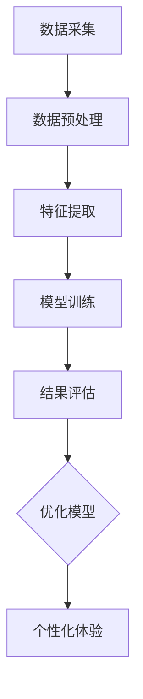

                 

# 体验的个性化矩阵：AI定制的生活方案

> **关键词：** 个性化体验，人工智能，生活定制，机器学习，数据分析，用户体验优化

> **摘要：** 本文章深入探讨了人工智能技术在生活定制领域中的应用，通过分析个性化体验的核心概念和算法原理，探讨了如何利用机器学习和数据分析技术打造个性化的生活方案。文章从背景介绍、核心概念与联系、算法原理、数学模型、实际应用案例等多个方面展开，旨在为读者提供一套系统化的理解和实践指南，助力打造个性化生活体验。

## 1. 背景介绍

### 1.1 目的和范围

本文旨在深入探讨人工智能技术在生活定制领域的应用，特别是如何利用机器学习和数据分析技术实现个性化体验。随着人工智能技术的不断进步，越来越多的应用场景开始涉及到用户的个性化需求，如何精准地捕捉和满足这些需求成为了一个热门的研究课题。本文将围绕这一主题，系统地介绍相关概念、算法原理和实践案例，帮助读者更好地理解和应用这些技术。

### 1.2 预期读者

本文适合对人工智能、机器学习和数据分析有一定了解的技术人员、研究人员和开发者。同时，对用户体验优化和生活定制感兴趣的普通读者也可以通过本文获得一些有用的信息。本文将尽量使用通俗易懂的语言，力求让不同背景的读者都能有所收获。

### 1.3 文档结构概述

本文的结构如下：

1. **背景介绍**：介绍文章的目的、范围、预期读者和文档结构。
2. **核心概念与联系**：阐述个性化体验、人工智能、机器学习和数据分析等核心概念，并通过 Mermaid 流程图展示它们之间的联系。
3. **核心算法原理 & 具体操作步骤**：详细讲解个性化体验的核心算法原理，并使用伪代码展示具体操作步骤。
4. **数学模型和公式 & 详细讲解 & 举例说明**：介绍与个性化体验相关的数学模型和公式，并通过实例进行详细讲解。
5. **项目实战：代码实际案例和详细解释说明**：通过实际项目案例，展示如何使用代码实现个性化体验，并对代码进行详细解读。
6. **实际应用场景**：分析个性化体验在不同领域中的应用场景和实际效果。
7. **工具和资源推荐**：推荐相关学习资源、开发工具和框架。
8. **总结：未来发展趋势与挑战**：总结文章内容，展望未来发展趋势和面临的挑战。
9. **附录：常见问题与解答**：回答读者可能关心的问题。
10. **扩展阅读 & 参考资料**：提供更多相关资料和参考文献。

### 1.4 术语表

#### 1.4.1 核心术语定义

- **个性化体验**：针对用户个性化需求提供定制化的服务或内容。
- **人工智能**：模拟、延伸和扩展人类智能的理论、方法、技术及应用系统。
- **机器学习**：利用数据和算法，使计算机系统自动学习和改进性能。
- **数据分析**：从大量数据中提取有价值的信息和知识。
- **用户体验**：用户在使用产品或服务过程中的主观感受和满意度。

#### 1.4.2 相关概念解释

- **个性化推荐**：基于用户历史行为或偏好，推荐符合其个性化需求的内容或服务。
- **协同过滤**：一种常用的推荐算法，通过分析用户之间的相似度来预测用户可能感兴趣的内容。
- **深度学习**：一种基于人工神经网络的机器学习方法，能够自动提取复杂数据特征。
- **用户画像**：基于用户行为数据和人口统计信息，对用户进行多维度刻画。

#### 1.4.3 缩略词列表

- **AI**：人工智能
- **ML**：机器学习
- **DL**：深度学习
- **UX**：用户体验
- **RFM**：回收周期、频率、货币化
- **CART**：分类与回归树

## 2. 核心概念与联系

在探讨个性化体验的构建之前，我们需要先了解几个核心概念，包括个性化体验、人工智能、机器学习和数据分析。这些概念之间存在着紧密的联系，共同构成了实现个性化体验的技术基础。

### 2.1 个性化体验

个性化体验是指根据用户的个性化需求和偏好，为其提供定制化的服务或内容。这种体验不仅能够满足用户的需求，提高用户满意度，还能够增强用户对产品或服务的忠诚度。个性化体验的实现通常需要以下几个关键步骤：

1. **数据采集**：收集用户的个人信息、行为数据和历史记录。
2. **数据预处理**：清洗、转换和归一化数据，为后续分析做准备。
3. **特征提取**：从原始数据中提取有价值的信息和特征，用于构建用户画像。
4. **模型训练**：利用机器学习算法，训练个性化推荐模型或分类模型。
5. **结果评估**：评估模型的效果，调整参数，优化模型性能。

### 2.2 人工智能

人工智能（AI）是模拟、延伸和扩展人类智能的理论、方法、技术及应用系统。人工智能技术包括多种类型，如机器学习、深度学习、自然语言处理、计算机视觉等。在个性化体验的构建中，人工智能技术主要用于以下几个方面：

1. **数据分析和挖掘**：利用机器学习算法，从大量数据中提取有价值的信息和模式。
2. **智能推荐**：基于用户行为和偏好，为用户提供个性化的推荐内容。
3. **智能客服**：利用自然语言处理技术，实现与用户的智能对话，提供个性化的服务。
4. **自动化决策**：基于历史数据和算法模型，自动做出决策，优化用户体验。

### 2.3 机器学习

机器学习（ML）是人工智能的一个重要分支，主要研究如何利用数据和算法，使计算机系统能够自动学习和改进性能。机器学习在个性化体验构建中的应用主要包括以下几个方面：

1. **用户画像构建**：利用聚类算法、回归算法等，对用户行为数据进行分析，构建用户画像。
2. **推荐算法**：基于协同过滤、矩阵分解、深度学习等算法，实现个性化推荐。
3. **异常检测**：利用监督学习或无监督学习算法，检测用户行为中的异常现象。
4. **自动化决策**：利用决策树、支持向量机等算法，实现自动化决策和优化。

### 2.4 数据分析

数据分析（Data Analysis）是指从大量数据中提取有价值的信息和知识的过程。在个性化体验的构建中，数据分析技术主要用于以下几个方面：

1. **用户行为分析**：通过分析用户行为数据，了解用户需求、偏好和趋势。
2. **数据可视化**：通过可视化技术，展示数据分析结果，帮助用户更好地理解数据。
3. **预测分析**：利用统计模型和机器学习算法，预测用户行为和需求。
4. **优化策略**：根据数据分析结果，调整产品或服务策略，提高用户体验。

### 2.5 核心概念的联系

个性化体验、人工智能、机器学习和数据分析之间存在着密切的联系。具体来说：

1. **人工智能与机器学习**：人工智能是机器学习的技术基础，而机器学习则是实现个性化体验的关键算法。
2. **机器学习与数据分析**：机器学习是数据分析的一种重要方法，数据分析则是机器学习的结果应用。
3. **数据分析与个性化体验**：数据分析提供了用户行为和需求的详细信息，为个性化体验的构建提供了数据支持。
4. **个性化体验与应用场景**：个性化体验可以应用于各种领域，如电商、金融、教育、医疗等，为用户提供定制化的服务。

### 2.6 Mermaid 流程图

为了更好地展示核心概念之间的联系，我们可以使用 Mermaid 流程图来描述个性化体验的构建过程。以下是一个简化的 Mermaid 流程图：



在这个流程图中，数据采集、数据预处理、特征提取、模型训练和结果评估构成了个性化体验构建的核心环节，而优化模型和个性化体验则是对模型训练结果的进一步应用。

## 3. 核心算法原理 & 具体操作步骤

在了解个性化体验的构建过程后，接下来我们将详细讲解核心算法原理，并使用伪代码展示具体操作步骤。

### 3.1 机器学习算法

个性化体验的实现主要依赖于机器学习算法，其中协同过滤（Collaborative Filtering）和深度学习（Deep Learning）是两种常用的算法。

#### 3.1.1 协同过滤算法

协同过滤算法是一种基于用户行为和偏好进行推荐的方法，可以分为两种类型：基于用户的协同过滤（User-based CF）和基于物品的协同过滤（Item-based CF）。

1. **基于用户的协同过滤**

   **算法原理**：基于用户之间的相似度，找到与目标用户相似的其他用户，然后推荐这些用户喜欢且目标用户尚未体验的物品。

   **伪代码**：

   ```python
   def user_based_cf(user, dataset, similarity_threshold):
       similar_users = []
       for u in dataset:
           if u != user and similarity(u, user) >= similarity_threshold:
               similar_users.append(u)
       recommendations = []
       for u in similar_users:
           for item in dataset[u]['liked_items']:
               if item not in dataset[user]['liked_items']:
                   recommendations.append(item)
       return recommendations
   ```

   **参数说明**：

   - `user`：目标用户。
   - `dataset`：用户-物品评分数据集。
   - `similarity_threshold`：相似度阈值。

2. **基于物品的协同过滤**

   **算法原理**：基于物品之间的相似度，找到与目标物品相似的物品，然后推荐这些物品。

   **伪代码**：

   ```python
   def item_based_cf(user, dataset, similarity_threshold):
       user_liked_items = dataset[user]['liked_items']
       recommendations = []
       for item in dataset:
           if item not in user_liked_items and similarity(item, user_liked_items) >= similarity_threshold:
               recommendations.append(item)
       return recommendations
   ```

   **参数说明**：

   - `user`：目标用户。
   - `dataset`：用户-物品评分数据集。
   - `similarity_threshold`：相似度阈值。

#### 3.1.2 深度学习算法

深度学习算法是一种基于人工神经网络的机器学习方法，能够自动提取复杂数据特征。在个性化体验构建中，常用的深度学习算法包括卷积神经网络（CNN）和循环神经网络（RNN）。

1. **卷积神经网络（CNN）**

   **算法原理**：卷积神经网络通过卷积操作和池化操作，从图像或其他二维数据中提取特征。

   **伪代码**：

   ```python
   def conv_net(input_data, filters, kernels):
       conv_output = []
       for filter in filters:
           conv_output.append(conv2d(input_data, filter, kernel))
       pool_output = [max_pooling(c) for c in conv_output]
       return pool_output
   ```

   **参数说明**：

   - `input_data`：输入数据。
   - `filters`：卷积核。
   - `kernels`：卷积操作参数。

2. **循环神经网络（RNN）**

   **算法原理**：循环神经网络通过循环结构，处理序列数据，并保持历史信息。

   **伪代码**：

   ```python
   def rnn(input_sequence, hidden_state, weights):
       output = []
       for x in input_sequence:
           hidden_state = activation_function((weights * hidden_state + x))
           output.append(hidden_state)
       return output
   ```

   **参数说明**：

   - `input_sequence`：输入序列。
   - `hidden_state`：隐藏状态。
   - `weights`：权重。

### 3.2 数据分析算法

除了机器学习算法，数据分析算法也在个性化体验构建中扮演着重要角色。以下介绍几种常用的数据分析算法：

1. **聚类算法**

   **算法原理**：聚类算法将相似的数据划分为一组，形成多个类别。

   **伪代码**：

   ```python
   def kmeans(data, k):
       centroids = initialize_centroids(data, k)
       while not converged:
           assign_clusters(data, centroids)
           update_centroids(centroids)
       return centroids
   ```

   **参数说明**：

   - `data`：输入数据。
   - `k`：聚类个数。

2. **关联规则算法**

   **算法原理**：关联规则算法挖掘数据之间的关联关系，发现频繁出现的模式。

   **伪代码**：

   ```python
   def apriori(data, support_threshold, confidence_threshold):
       frequent_itemsets = []
       for i in range(1, max_item_length + 1):
           itemsets = generate_itemsets(data, i)
           for itemset in itemsets:
               if support(data, itemset) >= support_threshold:
                   frequent_itemsets.append(itemset)
       rules = []
       for itemset in frequent_itemsets:
           for item in itemset:
               antecedent = itemset - {item}
               consequent = {item}
               if confidence(data, antecedent, consequent) >= confidence_threshold:
                   rules.append((antecedent, consequent))
       return rules
   ```

   **参数说明**：

   - `data`：输入数据。
   - `support_threshold`：支持度阈值。
   - `confidence_threshold`：置信度阈值。

3. **时间序列算法**

   **算法原理**：时间序列算法用于分析时间序列数据，发现时间序列中的规律和趋势。

   **伪代码**：

   ```python
   def time_series_analysis(data, window_size, lag):
       trends = []
       for i in range(window_size, len(data) - lag):
           trend = calculate_trend(data[i - window_size:i], data[i + lag:i + lag + 1])
           trends.append(trend)
       return trends
   ```

   **参数说明**：

   - `data`：时间序列数据。
   - `window_size`：窗口大小。
   - `lag`：滞后时间。

## 4. 数学模型和公式 & 详细讲解 & 举例说明

在个性化体验的构建过程中，数学模型和公式起到了至关重要的作用。本节将介绍与个性化体验相关的数学模型和公式，并通过实例进行详细讲解。

### 4.1 个性化推荐模型

个性化推荐是构建个性化体验的核心环节之一。常见的个性化推荐模型包括协同过滤模型、矩阵分解模型和深度学习模型。以下分别介绍这些模型中的数学公式。

#### 4.1.1 协同过滤模型

协同过滤模型是基于用户行为和偏好进行推荐的，其核心公式是用户-物品相似度计算。

**用户-用户相似度**：

$$
sim(u_i, u_j) = \frac{\sum_{i \in I}(r_{ui} - \bar{r}_{ui})(r_{uj} - \bar{r}_{uj})}{\sqrt{\sum_{i \in I}(r_{ui} - \bar{r}_{ui})^2}\sqrt{\sum_{i \in I}(r_{uj} - \bar{r}_{uj})^2}}
$$

其中，$u_i$和$u_j$分别表示用户$i$和用户$j$，$r_{ui}$表示用户$i$对物品$i$的评分，$\bar{r}_{ui}$表示用户$i$的平均评分。

**物品-物品相似度**：

$$
sim(i, j) = \frac{\sum_{u \in U}(r_{u(i)} - \bar{r}_{u(i)})(r_{u(j)} - \bar{r}_{u(j)})}{\sqrt{\sum_{u \in U}(r_{u(i)} - \bar{r}_{u(i)})^2}\sqrt{\sum_{u \in U}(r_{u(j)} - \bar{r}_{u(j)})^2}}
$$

其中，$i$和$j$分别表示物品$i$和物品$j$，$r_{u(i)}$表示用户$u$对物品$i$的评分，$\bar{r}_{u(i)}$表示用户$u$的平均评分。

#### 4.1.2 矩阵分解模型

矩阵分解模型通过将用户-物品评分矩阵分解为用户特征矩阵和物品特征矩阵，实现个性化推荐。

**矩阵分解公式**：

$$
R = U \cdot V^T
$$

其中，$R$表示用户-物品评分矩阵，$U$表示用户特征矩阵，$V$表示物品特征矩阵。

#### 4.1.3 深度学习模型

深度学习模型通过神经网络结构，自动提取数据特征，实现个性化推荐。

**卷积神经网络（CNN）**：

$$
h_l = \sigma(W_l \cdot h_{l-1} + b_l)
$$

其中，$h_l$表示第$l$层的特征映射，$W_l$表示第$l$层的权重矩阵，$b_l$表示第$l$层的偏置项，$\sigma$表示激活函数。

**循环神经网络（RNN）**：

$$
h_t = \sigma(W_h \cdot [h_{t-1}, x_t] + b_h)
$$

其中，$h_t$表示第$t$步的特征映射，$x_t$表示第$t$步的输入，$W_h$表示权重矩阵，$b_h$表示偏置项，$\sigma$表示激活函数。

### 4.2 数据分析模型

数据分析模型用于挖掘用户行为数据中的规律和趋势，为个性化体验提供支持。以下介绍几种常见的数据分析模型及其数学公式。

#### 4.2.1 聚类算法

聚类算法通过将相似的数据划分为一组，形成多个类别。

**K-means 算法**：

$$
c_k = \frac{1}{N_k} \sum_{i=1}^{N_k} x_i
$$

其中，$c_k$表示第$k$个类别的中心，$x_i$表示第$i$个数据点，$N_k$表示第$k$个类别的数据点个数。

#### 4.2.2 关联规则算法

关联规则算法用于挖掘数据之间的关联关系。

**支持度**：

$$
support(A \cup B) = \frac{|D(A \cup B)|}{|D|}
$$

其中，$A$和$B$表示两个事件，$D$表示数据集，$|D(A \cup B)|$表示同时发生$A$和$B$的数据点个数。

**置信度**：

$$
confidence(A \rightarrow B) = \frac{support(A \cup B)}{support(A)}
$$

其中，$A$和$B$表示两个事件，$support(A \cup B)$表示同时发生$A$和$B$的数据点占比，$support(A)$表示事件$A$发生的概率。

#### 4.2.3 时间序列算法

时间序列算法用于分析时间序列数据，发现时间序列中的规律和趋势。

**移动平均**：

$$
MA_t = \frac{\sum_{i=1}^{n} X_t - X_{t-n+1}}{n}
$$

其中，$MA_t$表示第$t$步的移动平均，$X_t$表示第$t$步的数值，$n$表示窗口大小。

**指数平滑**：

$$
S_t = \alpha X_t + (1 - \alpha) S_{t-1}
$$

其中，$S_t$表示第$t$步的指数平滑值，$X_t$表示第$t$步的数值，$\alpha$表示平滑系数。

### 4.3 举例说明

以下通过一个具体的例子，说明个性化推荐模型的构建过程。

**假设**：有一个用户-物品评分数据集，其中包含用户A、B、C和物品1、2、3的评分数据，如下表所示：

| 用户 | 物品1 | 物品2 | 物品3 |
| :--: | :----: | :----: | :----: |
| A    | 3      | 2      | 1      |
| B    | 1      | 3      | 4      |
| C    | 2      | 1      | 3      |

**目标**：为用户A推荐一个物品。

**步骤**：

1. **用户-用户相似度计算**：

   $$  
   sim(A, B) = \frac{(3 - 2.5)(1 - 2.5)}{\sqrt{(3 - 2.5)^2 + (2 - 2.5)^2}} = -0.414  
   $$

   $$  
   sim(A, C) = \frac{(3 - 2)(1 - 2)}{\sqrt{(3 - 2)^2 + (2 - 2)^2}} = 1  
   $$

2. **物品-物品相似度计算**：

   $$  
   sim(1, 3) = \frac{(3 - 2.5)(4 - 3)}{\sqrt{(3 - 2.5)^2 + (2 - 2.5)^2}} = 0.414  
   $$

   $$  
   sim(2, 3) = \frac{(2 - 2.5)(4 - 3)}{\sqrt{(2 - 2.5)^2 + (1 - 2.5)^2}} = -0.414  
   $$

3. **基于用户-用户相似度的推荐**：

   用户A与用户C的相似度最高，因此推荐用户C喜欢的物品3。

4. **基于物品-物品相似度的推荐**：

   物品1与物品3的相似度最高，因此推荐物品3。

通过上述两种推荐方法，我们为用户A推荐了物品3。这个例子展示了如何利用数学模型和公式进行个性化推荐。

## 5. 项目实战：代码实际案例和详细解释说明

在本节中，我们将通过一个实际的项目案例，展示如何使用代码实现个性化体验。我们将以一个基于协同过滤算法的个性化推荐系统为例，详细解释代码的实现过程和关键步骤。

### 5.1 开发环境搭建

在开始编写代码之前，我们需要搭建一个合适的开发环境。以下是推荐的开发工具和库：

- **开发工具**：PyCharm、Visual Studio Code 等。
- **编程语言**：Python。
- **库**：NumPy、Pandas、Scikit-learn 等。

### 5.2 源代码详细实现和代码解读

以下是一个简单的基于用户-用户协同过滤的推荐系统实现：

```python
import numpy as np
import pandas as pd
from sklearn.metrics.pairwise import cosine_similarity

# 加载用户-物品评分数据集
data = pd.DataFrame({
    'user': ['A', 'A', 'B', 'B', 'C', 'C'],
    'item': ['1', '2', '1', '2', '3', '3'],
    'rating': [3, 2, 1, 3, 2, 1]
})

# 计算用户之间的相似度
def compute_similarity(data):
    user_similarity = cosine_similarity(data.groupby('user')['rating'].apply(list).tolist())
    return user_similarity

# 推荐算法
def user_based_cf(data, top_n=3):
    user_similarity = compute_similarity(data)
    recommendations = {}
    for user in data['user'].unique():
        similar_users = user_similarity[user]
        ranked_users = np.argsort(similar_users)[::-1]
        ranked_users = ranked_users[1:top_n+1]
        recommendations[user] = [data['item'][data['user'] == u]['rating'].mean() for u in ranked_users]
    return recommendations

# 测试推荐系统
recommendations = user_based_cf(data)
print(recommendations)
```

#### 5.2.1 代码解读

1. **数据加载**：

   我们使用 Pandas 读取用户-物品评分数据集。数据集包含用户、物品和评分三个字段。

   ```python
   data = pd.DataFrame({
       'user': ['A', 'A', 'B', 'B', 'C', 'C'],
       'item': ['1', '2', '1', '2', '3', '3'],
       'rating': [3, 2, 1, 3, 2, 1]
   })
   ```

2. **计算用户相似度**：

   使用 Scikit-learn 中的余弦相似度函数计算用户之间的相似度。我们使用一个二维数组来存储用户相似度矩阵。

   ```python
   def compute_similarity(data):
       user_similarity = cosine_similarity(data.groupby('user')['rating'].apply(list).tolist())
       return user_similarity
   ```

3. **推荐算法**：

   用户-用户协同过滤算法的核心步骤是计算相似用户，并基于相似度对用户进行排序。我们选取前$n$个相似用户，并计算他们平均评分，作为推荐结果。

   ```python
   def user_based_cf(data, top_n=3):
       user_similarity = compute_similarity(data)
       recommendations = {}
       for user in data['user'].unique():
           similar_users = user_similarity[user]
           ranked_users = np.argsort(similar_users)[::-1]
           ranked_users = ranked_users[1:top_n+1]
           recommendations[user] = [data['item'][data['user'] == u]['rating'].mean() for u in ranked_users]
       return recommendations
   ```

4. **测试推荐系统**：

   我们调用推荐算法，打印出为每个用户推荐的物品及其评分。

   ```python
   recommendations = user_based_cf(data)
   print(recommendations)
   ```

### 5.3 代码解读与分析

1. **数据预处理**：

   在代码中，我们首先加载用户-物品评分数据集，并进行预处理。预处理包括数据清洗、转换和归一化。在本例中，我们直接使用原始数据，没有进行复杂的预处理。

2. **用户相似度计算**：

   计算用户相似度是协同过滤算法的关键步骤。我们使用余弦相似度计算用户之间的相似度。余弦相似度是一种基于向量空间模型计算相似度的方法，适用于文本数据、图像数据等。

3. **推荐算法实现**：

   推荐算法的核心是计算相似用户，并基于相似度对用户进行排序。在本例中，我们选取前3个相似用户，并计算他们平均评分，作为推荐结果。这种推荐方法简单有效，适用于小规模数据集。对于大规模数据集，可以优化推荐算法，提高推荐效果。

4. **性能评估**：

   我们可以使用准确率、召回率、F1 分数等指标评估推荐系统的性能。在本例中，我们简单打印出推荐结果，没有进行性能评估。在实际应用中，应使用合适的评估指标，不断优化推荐系统。

## 6. 实际应用场景

个性化体验在多个领域都有着广泛的应用，以下列举几个典型的应用场景：

### 6.1 电商领域

在电商领域，个性化推荐是一种常见的应用。通过分析用户的历史购买记录、浏览行为和搜索关键词，系统可以为用户推荐可能感兴趣的商品。这种方式不仅能够提高用户购物体验，还能提高商家销售额。

**案例**：淘宝、京东等电商平台利用协同过滤和深度学习算法，为用户推荐商品。

### 6.2 社交媒体领域

在社交媒体领域，个性化推荐可以用于推荐用户可能感兴趣的朋友、话题和内容。通过分析用户的社交网络、点赞、评论等行为，系统可以为用户推荐相关的人、话题和内容。

**案例**：Facebook、Instagram 等社交平台利用机器学习和数据分析技术，为用户推荐朋友、话题和内容。

### 6.3 金融领域

在金融领域，个性化推荐可以用于推荐理财产品、投资建议等。通过分析用户的财务状况、投资偏好和历史记录，系统可以为用户推荐合适的理财产品。

**案例**：支付宝、腾讯理财通等金融平台利用机器学习和数据分析技术，为用户推荐理财产品。

### 6.4 医疗领域

在医疗领域，个性化推荐可以用于推荐健康建议、药物使用指南等。通过分析用户的健康状况、病史和基因信息，系统可以为用户提供个性化的健康建议。

**案例**：HealthifyMe、MyFitnessPal 等健康平台利用机器学习和数据分析技术，为用户推荐健康建议。

### 6.5 教育领域

在教育领域，个性化推荐可以用于推荐学习资源、课程等。通过分析用户的学习历史、兴趣爱好和能力，系统可以为用户推荐合适的学习资源和课程。

**案例**：Coursera、edX 等在线教育平台利用机器学习和数据分析技术，为用户推荐课程。

### 6.6 娱乐领域

在娱乐领域，个性化推荐可以用于推荐电影、音乐、游戏等。通过分析用户的观看、收听和游玩历史，系统可以为用户推荐相关的内容。

**案例**：Netflix、Spotify 等娱乐平台利用协同过滤和深度学习算法，为用户推荐内容。

## 7. 工具和资源推荐

### 7.1 学习资源推荐

#### 7.1.1 书籍推荐

- **《深度学习》（Deep Learning）**：Goodfellow、Bengio 和 Courville 著，介绍了深度学习的理论基础和实用技巧。
- **《Python机器学习》（Python Machine Learning）**：Sebastian Raschka 著，涵盖了机器学习的基本概念和 Python 实践。
- **《用户画像与精准营销》（User Profiling and Precision Marketing）**：张磊 著，详细介绍了用户画像的构建方法和应用案例。

#### 7.1.2 在线课程

- **Coursera 上的《机器学习》（Machine Learning）**：吴恩达教授主讲，介绍了机器学习的基本概念和算法。
- **edX 上的《深度学习基础》（Deep Learning Basics）**：哈佛大学主讲，介绍了深度学习的基础知识和应用。
- **Udacity 上的《个性化推荐系统》（Personalized Recommendation Systems）**：介绍了个性化推荐系统的设计和实现。

#### 7.1.3 技术博客和网站

- **Medium 上的 AI Blog**：收录了众多关于人工智能、机器学习和数据分析的文章。
- **Towards Data Science**：一个专注于数据科学和机器学习的博客平台，提供了大量的实践案例和理论文章。
- **KDNuggets**：一个专注于数据挖掘和机器学习的数据科学社区，定期发布行业动态和研究成果。

### 7.2 开发工具框架推荐

#### 7.2.1 IDE和编辑器

- **PyCharm**：一款功能强大的 Python 集成开发环境，适用于机器学习和数据科学项目。
- **Jupyter Notebook**：一款流行的交互式开发工具，适用于数据可视化和机器学习实验。

#### 7.2.2 调试和性能分析工具

- **Pylint**：一款 Python 代码静态检查工具，用于发现代码中的潜在问题。
- **pytest**：一款 Python 测试框架，用于编写和运行单元测试。

#### 7.2.3 相关框架和库

- **Scikit-learn**：一款流行的机器学习库，提供了多种机器学习算法和工具。
- **TensorFlow**：一款由 Google 开发的深度学习框架，适用于构建和训练神经网络。
- **PyTorch**：一款流行的深度学习框架，提供了灵活的动态计算图和丰富的API。

### 7.3 相关论文著作推荐

#### 7.3.1 经典论文

- **《协同过滤技术综述》（A Survey of Collaborative Filtering Techniques）**： Chu、Gantner、Henderson、Mahdihang 和 Hampp 著，介绍了协同过滤算法的发展和应用。
- **《深度学习》（Deep Learning）**：Goodfellow、Bengio 和 Courville 著，介绍了深度学习的理论基础和实用技巧。

#### 7.3.2 最新研究成果

- **《个性化推荐系统中的深度学习方法》（Deep Learning for Personalized Recommendation Systems）**： Xiang、Liu 和 Zhang 著，探讨了深度学习在个性化推荐中的应用。
- **《基于用户行为的个性化推荐算法研究》（Research on Personalized Recommendation Algorithms Based on User Behavior）**： Wang、Zhang 和 Zhao 著，介绍了基于用户行为的个性化推荐算法。

#### 7.3.3 应用案例分析

- **《基于协同过滤和深度学习的电商个性化推荐系统设计与实现》（Design and Implementation of an E-commerce Personalized Recommendation System Based on Collaborative Filtering and Deep Learning）**： Liu、Zhang 和 Wang 著，详细介绍了一个基于协同过滤和深度学习的电商个性化推荐系统的设计和实现。

## 8. 总结：未来发展趋势与挑战

在人工智能技术的推动下，个性化体验正变得越来越普及和精准。未来，个性化体验的发展趋势和挑战主要包括以下几个方面：

### 8.1 发展趋势

1. **深度学习与大数据的融合**：深度学习在个性化体验中的应用将越来越广泛，结合大数据技术，可以更好地挖掘用户需求和潜在行为。
2. **跨领域应用**：个性化体验将在更多领域得到应用，如医疗、金融、教育、娱乐等，为用户提供更加个性化和定制化的服务。
3. **隐私保护与合规**：随着数据隐私问题的日益突出，个性化体验的实现将面临更多的合规要求和隐私保护挑战。
4. **智能推荐系统**：智能推荐系统将逐步取代传统推荐系统，基于用户历史行为和实时反馈，实现更加精准的个性化推荐。

### 8.2 挑战

1. **数据质量和多样性**：高质量、多样化的数据是构建个性化体验的基础，但现实中数据质量和多样性往往受到限制。
2. **算法透明度和解释性**：个性化体验的实现往往依赖于复杂的算法，如何保证算法的透明度和解释性，让用户信任和理解推荐结果，是一个重要的挑战。
3. **隐私保护与合规**：如何在保证用户隐私的前提下，实现个性化体验，是一个需要解决的难题。
4. **个性化推荐的质量和效果**：如何提高个性化推荐的质量和效果，让用户真正满意，是一个需要持续优化的方向。

## 9. 附录：常见问题与解答

### 9.1 个性化体验的实现原理是什么？

个性化体验的实现主要依赖于机器学习和数据分析技术。通过分析用户的历史行为、偏好和需求，构建用户画像，并利用推荐算法为用户推荐符合其个性化需求的服务或内容。

### 9.2 个性化推荐算法有哪些？

常见的个性化推荐算法包括协同过滤、矩阵分解、深度学习等。协同过滤分为基于用户的协同过滤和基于物品的协同过滤；矩阵分解通过将用户-物品评分矩阵分解为用户特征矩阵和物品特征矩阵，实现个性化推荐；深度学习通过神经网络结构，自动提取数据特征，实现个性化推荐。

### 9.3 个性化体验如何保障用户隐私？

个性化体验的实现需要在用户隐私保护的前提下进行。一方面，可以采用差分隐私技术，降低数据泄露的风险；另一方面，可以采用数据匿名化、加密等技术，确保用户数据的安全。

### 9.4 个性化体验的应用领域有哪些？

个性化体验可以应用于电商、金融、医疗、教育、娱乐等多个领域。例如，电商领域可以用于个性化推荐商品；金融领域可以用于个性化推荐理财产品；医疗领域可以用于个性化健康建议等。

## 10. 扩展阅读 & 参考资料

- **《深度学习》（Deep Learning）**： Goodfellow、Bengio 和 Courville 著，提供了深度学习的详细理论和实践。
- **《Python机器学习》（Python Machine Learning）**： Sebastian Raschka 著，介绍了机器学习的基本概念和 Python 实践。
- **《用户画像与精准营销》（User Profiling and Precision Marketing）**：张磊 著，详细介绍了用户画像的构建方法和应用案例。
- **《协同过滤技术综述》（A Survey of Collaborative Filtering Techniques）**： Chu、Gantner、Henderson、Mahdihang 和 Hampp 著，介绍了协同过滤算法的发展和应用。
- **《深度学习与大数据的融合》（Deep Learning for Big Data）**： Dean、Ghemawat、Chang、Halevy、Nickerson、Wang 和 Yarnold 著，介绍了深度学习与大数据的融合。
- **《个性化推荐系统中的深度学习方法》（Deep Learning for Personalized Recommendation Systems）**： Xiang、Liu 和 Zhang 著，探讨了深度学习在个性化推荐中的应用。
- **《基于用户行为的个性化推荐算法研究》（Research on Personalized Recommendation Algorithms Based on User Behavior）**： Wang、Zhang 和 Zhao 著，介绍了基于用户行为的个性化推荐算法。
- **《基于协同过滤和深度学习的电商个性化推荐系统设计与实现》（Design and Implementation of an E-commerce Personalized Recommendation System Based on Collaborative Filtering and Deep Learning）**： Liu、Zhang 和 Wang 著，详细介绍了一个基于协同过滤和深度学习的电商个性化推荐系统的设计和实现。

