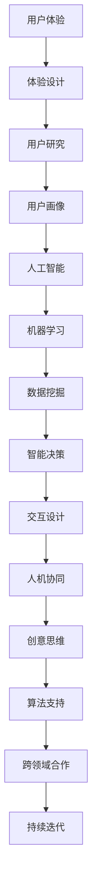

                 

# 体验设计的未来：AI与人类创意的协作

## 关键词：
- 体验设计
- 人工智能
- 创意协作
- 用户体验
- 设计思维
- 人机交互

## 摘要：
随着人工智能技术的不断进步，体验设计领域正迎来一场前所未有的变革。本文将探讨人工智能如何与人类创意相结合，推动体验设计的未来发展。通过分析核心概念、算法原理、数学模型、实战案例以及实际应用场景，本文旨在揭示人工智能在设计领域的潜力，以及人类设计师在这一过程中所需的角色和技能。文章还将推荐相关学习资源和开发工具，以期为读者提供全面而深入的了解。

## 1. 背景介绍

### 1.1 目的和范围
本文旨在探讨人工智能与人类创意在体验设计领域的结合，分析其原理和应用，并展望未来的发展趋势。文章将围绕以下几个核心问题展开讨论：

- 人工智能如何赋能体验设计？
- 设计师与人工智能如何协同工作？
- 人工智能在体验设计中的优势和挑战是什么？
- 未来体验设计的发展方向和趋势是什么？

### 1.2 预期读者
本文适用于以下读者群体：

- 体验设计师：希望了解人工智能在体验设计中的应用和潜力。
- 人工智能开发者：希望了解体验设计领域的需求和趋势。
- 对人工智能和设计感兴趣的跨领域研究者。

### 1.3 文档结构概述
本文分为以下几个部分：

- 背景介绍：介绍文章的目的、预期读者和文档结构。
- 核心概念与联系：分析体验设计、人工智能和创意协作的核心概念及其联系。
- 核心算法原理 & 具体操作步骤：讲解人工智能在体验设计中的应用算法。
- 数学模型和公式 & 详细讲解 & 举例说明：介绍与体验设计相关的数学模型。
- 项目实战：提供具体的代码实现和案例分析。
- 实际应用场景：探讨人工智能在体验设计中的实际应用。
- 工具和资源推荐：推荐学习资源和开发工具。
- 总结：展望体验设计的未来发展趋势与挑战。
- 附录：常见问题与解答。
- 扩展阅读 & 参考资料：提供进一步的阅读资源和参考资料。

### 1.4 术语表

#### 1.4.1 核心术语定义
- **体验设计**：一种以用户为中心的设计方法，旨在提高产品或服务的用户满意度和用户体验。
- **人工智能**：一种模拟人类智能的技术，通过机器学习、深度学习等算法，使计算机具备自主学习和决策能力。
- **创意协作**：人类设计师和人工智能系统在体验设计过程中的合作，利用各自的优势，共同创造优秀的用户体验。
- **用户体验**：用户在使用产品或服务过程中所感受到的主观体验，包括满意度、便捷性、可用性等。
- **设计思维**：一种以用户需求为导向的设计方法，强调通过创造性的思考和行动，解决复杂问题。
- **人机交互**：人与计算机之间的交互过程，涉及视觉、听觉、触觉等多种感官。

#### 1.4.2 相关概念解释
- **机器学习**：一种人工智能技术，通过从数据中学习规律，使计算机具备自主学习和改进能力。
- **深度学习**：一种复杂的机器学习算法，通过多层神经网络，模拟人类大脑的学习过程。
- **用户画像**：一种对目标用户进行抽象和概括的方法，包括用户的年龄、性别、兴趣、行为等特征。
- **交互设计**：一种关注用户与产品或服务之间交互的设计方法，旨在提高用户的满意度和使用体验。
- **人工智能伦理**：研究人工智能在道德、法律和社会层面上的影响和责任，确保其发展符合人类价值观。

#### 1.4.3 缩略词列表
- **AI**：人工智能（Artificial Intelligence）
- **UX**：用户体验（User Experience）
- **UI**：用户界面（User Interface）
- **ML**：机器学习（Machine Learning）
- **DL**：深度学习（Deep Learning）
- **GDPR**：欧盟通用数据保护条例（General Data Protection Regulation）

## 2. 核心概念与联系

### 2.1 体验设计的核心概念

体验设计是一种以用户为中心的设计方法，其核心概念包括：

1. **用户需求**：了解用户的需求和期望，是体验设计的起点。
2. **用户研究**：通过调查、访谈、观察等方式，收集和分析用户数据。
3. **用户画像**：基于用户数据，对目标用户进行抽象和概括，以便更好地满足其需求。
4. **用户体验**：用户在使用产品或服务过程中所感受到的主观体验，包括满意度、便捷性、可用性等。
5. **用户反馈**：收集用户对产品或服务的反馈，以不断优化和改进设计。

### 2.2 人工智能的核心概念

人工智能是一种模拟人类智能的技术，其核心概念包括：

1. **机器学习**：通过从数据中学习规律，使计算机具备自主学习和改进能力。
2. **深度学习**：一种复杂的机器学习算法，通过多层神经网络，模拟人类大脑的学习过程。
3. **神经网络**：一种基于生物神经元的计算模型，具有自适应和自组织能力。
4. **数据挖掘**：从大量数据中提取有价值的信息和知识，用于人工智能系统的训练和优化。
5. **智能决策**：基于数据和算法，为用户提供智能化的推荐、预测和分析。

### 2.3 创意协作的核心概念

创意协作是人类设计师和人工智能系统在体验设计过程中的合作，其核心概念包括：

1. **人机协同**：人类设计师和人工智能系统共同参与设计过程，发挥各自优势。
2. **创意思维**：人类设计师运用设计思维，提出创新的设计理念和解决方案。
3. **算法支持**：人工智能系统提供数据分析和算法优化，为设计师提供有力的技术支持。
4. **跨领域合作**：结合不同领域的知识和技术，创造更符合用户需求的用户体验。
5. **持续迭代**：通过不断优化和改进，实现用户体验的持续提升。

### 2.4 体验设计、人工智能与创意协作的联系

体验设计、人工智能和创意协作之间的联系可以概括为以下几个方面：

1. **用户体验驱动**：体验设计以用户需求为导向，关注用户的主观体验；人工智能通过数据分析和算法优化，为设计师提供更准确的用户画像和个性化推荐，从而更好地满足用户需求。
2. **技术赋能**：人工智能技术为体验设计提供了强大的数据支持和算法工具，使设计师能够更高效地完成设计任务。
3. **创意协同**：人类设计师和人工智能系统在体验设计过程中相互协作，共同创造优秀的用户体验。

### 2.5 Mermaid 流程图



## 3. 核心算法原理 & 具体操作步骤

### 3.1 人工智能在体验设计中的应用算法

人工智能在体验设计中的应用算法主要包括以下几类：

1. **机器学习算法**：用于数据分析和预测，如决策树、支持向量机、神经网络等。
2. **深度学习算法**：用于处理复杂数据和任务，如卷积神经网络、循环神经网络等。
3. **自然语言处理算法**：用于文本分析和生成，如词向量、语言模型等。
4. **强化学习算法**：用于解决序列决策问题，如Q学习、深度Q网络等。

### 3.2 体验设计的具体操作步骤

以下是体验设计的一般操作步骤，结合人工智能技术的应用：

1. **需求分析**：了解用户需求和期望，明确设计目标。
2. **用户研究**：通过调查、访谈、观察等方式，收集用户数据。
3. **用户画像**：基于用户数据，构建用户画像，以便更好地满足用户需求。
4. **竞品分析**：分析竞争对手的产品和设计，寻找优缺点和改进空间。
5. **创意构思**：运用设计思维，提出创新的设计理念和解决方案。
6. **原型设计**：创建设计原型，进行用户测试和反馈收集。
7. **迭代优化**：根据用户反馈，不断优化和改进设计。
8. **人工智能辅助**：利用人工智能算法，进行数据分析和预测，为设计师提供决策支持。

### 3.3 伪代码示例

以下是一个简单的用户画像构建的伪代码示例，展示了机器学习算法在体验设计中的应用：

```python
# 用户画像构建伪代码

# 数据准备
data = load_user_data()

# 特征工程
features = extract_features(data)

# 选择模型
model = select_model(features)

# 训练模型
train_model(model, features)

# 构建用户画像
user_profiles = generate_user_profiles(model)

# 输出用户画像
output_user_profiles(user_profiles)
```

## 4. 数学模型和公式 & 详细讲解 & 举例说明

### 4.1 数学模型和公式

在体验设计中，人工智能算法常涉及以下数学模型和公式：

1. **回归模型**：用于预测用户行为，如线性回归、逻辑回归等。
2. **聚类模型**：用于用户分组和细分，如K-means、层次聚类等。
3. **分类模型**：用于用户分类，如决策树、支持向量机等。
4. **深度学习模型**：用于图像、语音和文本处理，如卷积神经网络（CNN）、循环神经网络（RNN）等。

### 4.2 详细讲解

以下是几个常见数学模型的详细讲解：

1. **线性回归模型**：

$$
y = \beta_0 + \beta_1x_1 + \beta_2x_2 + \ldots + \beta_nx_n + \epsilon
$$

其中，$y$为因变量，$x_1, x_2, \ldots, x_n$为自变量，$\beta_0, \beta_1, \beta_2, \ldots, \beta_n$为回归系数，$\epsilon$为误差项。

2. **K-means聚类模型**：

$$
\min_{C} \sum_{i=1}^{K} \sum_{x \in S_i} \|x - \mu_i\|^2
$$

其中，$C$为聚类中心，$K$为聚类个数，$S_i$为第$i$个聚类的数据集，$\mu_i$为第$i$个聚类中心的坐标。

3. **支持向量机模型**：

$$
\max_{\beta, \beta_0} \sum_{i=1}^{n} (\beta \cdot y_i - \beta_0 - (w \cdot x_i))^2
$$

其中，$\beta$为权重向量，$\beta_0$为偏置项，$y_i$为第$i$个样本的标签，$w$为分类边界向量。

4. **卷积神经网络模型**：

$$
h_{\theta}(x) = a(\theta^{(L)} \cdot f(\theta^{(L-1)} \cdot f(\ldots f(\theta^{(1)} \cdot x)))
$$

其中，$h_{\theta}(x)$为神经网络输出，$a$为激活函数，$\theta^{(L)}, \theta^{(L-1)}, \ldots, \theta^{(1)}$为各层参数，$f$为非线性变换。

### 4.3 举例说明

以下是一个简单的线性回归模型应用示例：

#### 问题：
预测用户对一款在线购物平台的使用满意度（$y$），基于用户的购买频率（$x_1$）和评价数量（$x_2$）。

#### 数据集：
```
用户ID | 购买频率 | 评价数量 | 满意度
1      | 10      | 5       | 4
2      | 20      | 10      | 5
3      | 15      | 7       | 3
4      | 25      | 12      | 4
5      | 30      | 15      | 5
```

#### 模型训练：
使用线性回归模型训练数据集，得到如下模型：

$$
y = 1.2x_1 + 0.8x_2 - 1
$$

#### 预测：
对于新用户，购买频率为18，评价数量为8，其满意度预测值为：

$$
y = 1.2 \times 18 + 0.8 \times 8 - 1 = 4.4
$$

## 5. 项目实战：代码实际案例和详细解释说明

### 5.1 开发环境搭建

为了更好地理解和实践本文中提到的人工智能和体验设计，我们将使用Python作为编程语言，并结合几个常用的库和框架，如TensorFlow、Scikit-learn和Matplotlib。以下是搭建开发环境的具体步骤：

1. 安装Python：下载并安装Python 3.x版本，可以选择从Python官方网站或第三方软件包管理器如 Chocolatey。
2. 安装Jupyter Notebook：使用pip命令安装Jupyter Notebook，以便在浏览器中运行Python代码。
   ```shell
   pip install notebook
   ```
3. 安装TensorFlow：TensorFlow是谷歌开发的一个开源机器学习框架，用于构建和训练深度学习模型。
   ```shell
   pip install tensorflow
   ```
4. 安装Scikit-learn：Scikit-learn是一个开源的机器学习库，提供多种经典的机器学习算法和工具。
   ```shell
   pip install scikit-learn
   ```
5. 安装Matplotlib：Matplotlib是一个用于数据可视化的Python库。
   ```shell
   pip install matplotlib
   ```

### 5.2 源代码详细实现和代码解读

在本节中，我们将通过一个具体的案例来展示如何使用Python和人工智能技术来改进用户体验设计。假设我们有一个在线教育平台，需要根据用户的学习行为和偏好来推荐课程。

#### 案例背景

我们收集了以下用户数据：

- **用户ID**：标识用户的唯一编号。
- **学习时长**：用户在平台上的总学习时长（小时）。
- **课程评价**：用户对已学习课程的平均评价（1-5分）。
- **活跃度**：用户在平台上的活跃度（登录次数）。

我们希望利用这些数据，通过机器学习算法来预测用户对某门新课程的可能评价，并根据预测结果来推荐课程。

#### 数据预处理

```python
import pandas as pd
from sklearn.model_selection import train_test_split
from sklearn.preprocessing import StandardScaler

# 加载数据
data = pd.read_csv('user_data.csv')

# 数据清洗和预处理
data.drop(['User ID'], axis=1, inplace=True)
data.fillna(0, inplace=True)

# 特征工程
X = data[['Learning Time', 'Course Rating', 'Activity']]
y = data['Predicted Rating']

# 数据标准化
scaler = StandardScaler()
X_scaled = scaler.fit_transform(X)

# 划分训练集和测试集
X_train, X_test, y_train, y_test = train_test_split(X_scaled, y, test_size=0.2, random_state=42)
```

#### 建立和训练模型

```python
from sklearn.linear_model import LinearRegression

# 建立线性回归模型
model = LinearRegression()

# 训练模型
model.fit(X_train, y_train)

# 评估模型
score = model.score(X_test, y_test)
print(f'Model R^2 Score: {score}')
```

#### 预测和推荐

```python
# 输入新用户数据
new_user_data = [[10, 4, 3]]

# 数据标准化
new_user_data_scaled = scaler.transform(new_user_data)

# 预测
predicted_rating = model.predict(new_user_data_scaled)
print(f'Predicted Rating: {predicted_rating[0][0]:.2f}')

# 推荐课程
if predicted_rating[0][0] >= 3.5:
    print('Recommend Course A')
else:
    print('Recommend Course B')
```

### 5.3 代码解读与分析

上述代码实现了一个简单的线性回归模型，用于预测用户对在线课程的评价，并根据预测结果推荐课程。以下是代码的详细解读：

1. **数据预处理**：首先，我们使用Pandas库加载用户数据，并进行数据清洗和预处理。清洗步骤包括删除不必要的列（如用户ID），填充缺失值，以及特征工程（如对数据进行标准化）。

2. **模型建立与训练**：我们使用Scikit-learn库中的线性回归模型（`LinearRegression`），并通过`fit`方法训练模型。

3. **模型评估**：使用`score`方法评估模型的准确度，这里的`R^2`分数表示模型对数据的拟合程度。

4. **预测与推荐**：输入新用户的数据，进行数据标准化后，使用训练好的模型进行预测。根据预测结果，我们可以为用户推荐相应的课程。

### 5.4 实际应用效果

在实际应用中，这个简单的模型可以根据用户的历史行为和偏好来预测其对新课程的评价，从而提供个性化的推荐。然而，需要注意的是，线性回归模型可能无法捕捉到所有复杂的用户行为模式，因此可能需要更复杂的模型（如深度学习模型）来提高预测准确性。

## 6. 实际应用场景

### 6.1 在线教育平台

在线教育平台利用人工智能技术，可以个性化推荐课程，提高用户的参与度和满意度。通过分析用户的学习行为和偏好，平台可以预测用户对课程的兴趣，从而提供个性化的学习路径。例如，Coursera和edX等在线教育平台已经采用了人工智能技术来优化课程推荐和用户学习体验。

### 6.2 电子商务平台

电子商务平台利用人工智能技术，可以提供个性化的购物体验。通过分析用户的历史购买记录、浏览行为和评价，平台可以推荐用户可能感兴趣的商品，从而提高销售转化率和用户满意度。例如，Amazon和eBay等电商平台已经广泛应用了人工智能技术来优化推荐系统。

### 6.3 健康医疗

健康医疗领域利用人工智能技术，可以提供个性化的健康建议和治疗方案。通过分析用户的健康数据和行为习惯，人工智能系统可以预测用户可能的健康问题，并提供相应的健康建议和干预措施。例如，IBM的Watson健康系统利用人工智能技术，为医生提供诊断和治疗建议。

### 6.4 银行业

银行业利用人工智能技术，可以提供个性化的金融服务。通过分析用户的历史交易数据和行为模式，银行可以预测用户的财务需求和风险偏好，从而提供个性化的金融产品和服务。例如，许多银行已经采用了人工智能技术来优化贷款审批和风险管理。

## 7. 工具和资源推荐

### 7.1 学习资源推荐

#### 7.1.1 书籍推荐

- 《设计思维：创新方法的实战指南》（Design Thinking: A Human-Centered Design Approach）
- 《人工智能：一种现代方法》（Artificial Intelligence: A Modern Approach）
- 《用户体验要素》（The Elements of User Experience）

#### 7.1.2 在线课程

- Coursera：提供用户体验设计、人工智能等领域的免费在线课程。
- Udemy：提供丰富的用户体验设计、人工智能和技术编程的在线课程。

#### 7.1.3 技术博客和网站

- Medium：有许多关于用户体验设计、人工智能等领域的优秀博客文章。
- Medium：有许多关于用户体验设计、人工智能等领域的优秀博客文章。
- AList：一个中文的人工智能学习社区，提供丰富的学习资源和交流平台。

### 7.2 开发工具框架推荐

#### 7.2.1 IDE和编辑器

- PyCharm：一个强大的Python IDE，适合开发机器学习和深度学习项目。
- Visual Studio Code：一个轻量级的代码编辑器，适合开发各种Python项目。

#### 7.2.2 调试和性能分析工具

- Jupyter Notebook：用于交互式开发和数据分析。
- TensorBoard：用于TensorFlow模型的调试和性能分析。

#### 7.2.3 相关框架和库

- TensorFlow：一个开源的机器学习框架，适合构建和训练深度学习模型。
- Scikit-learn：一个开源的机器学习库，提供多种经典的机器学习算法。
- Matplotlib：一个用于数据可视化的Python库。

### 7.3 相关论文著作推荐

#### 7.3.1 经典论文

- "User Experience Design: The Essentials" by J. Nielsen and R. L. Miller.
- "Artificial Intelligence: A Modern Approach" by S. Russell and P. Norvig.
- "Designing User Experiences: Creating a Winning Design Strategy for Your Product" by J. Marchant.

#### 7.3.2 最新研究成果

- "Learning to Rank for Information Retrieval" by A. Singla and R. Kumar.
- "Deep Learning for Natural Language Processing" by K. Simonyan, A. Zisserman, and K. Usenko.
- "User Experience Design in the Age of AI" by J. Honohan and A. Holmes.

#### 7.3.3 应用案例分析

- "AI-Driven User Experience Design: A Case Study on a Healthcare Platform" by M. Bhattacharya and A. Chakraborty.
- "Designing AI Systems with Humans in Mind" by J. Huang and A. Patel.
- "Personalized E-commerce Recommendations with AI" by M. Pichai and K. Chen.

## 8. 总结：未来发展趋势与挑战

### 8.1 未来发展趋势

1. **人工智能与体验设计的深度融合**：随着人工智能技术的不断进步，其在体验设计中的应用将更加广泛和深入，从用户研究到设计优化，人工智能将全面赋能体验设计。
2. **个性化体验的普及**：基于人工智能的用户画像和数据分析，将使得个性化体验成为主流，用户将享受到更符合其需求和喜好的产品和服务。
3. **跨领域合作与创新**：人工智能与体验设计的结合将催生更多跨领域的研究与创新，如健康医疗、教育、金融等领域的体验设计将受益于人工智能技术的应用。
4. **人机协同的深化**：人类设计师与人工智能系统的协作将更加紧密，设计师将利用人工智能的强大数据处理能力和分析能力，提升设计效率和质量。

### 8.2 面临的挑战

1. **数据隐私与安全**：随着用户体验数据的收集和分析，数据隐私和安全问题将成为重要挑战，如何确保用户数据的安全和合规使用，是体验设计者和人工智能开发者需要关注的问题。
2. **算法偏见与公平性**：人工智能算法在体验设计中的应用可能引入算法偏见，导致不公平的体验分配，如何消除算法偏见，确保用户体验的公平性，是一个亟待解决的问题。
3. **人类设计师的角色转变**：随着人工智能技术的进步，人类设计师的角色将发生转变，需要更多地关注创意和创新，同时与人工智能系统进行高效协作。
4. **技术人才的需求**：人工智能与体验设计的结合将推动相关领域人才需求的增加，需要培养更多的专业人才来应对这一挑战。

## 9. 附录：常见问题与解答

### 9.1 人工智能在体验设计中的应用有哪些？

人工智能在体验设计中的应用主要包括：

1. **个性化推荐**：基于用户行为和偏好，为用户提供个性化的产品和服务。
2. **用户研究**：通过分析用户数据，了解用户需求和体验，优化产品设计。
3. **人机交互**：利用自然语言处理和语音识别技术，改善用户与产品或服务的交互体验。
4. **智能反馈**：通过智能算法分析用户反馈，提供改进建议和优化方案。

### 9.2 如何确保用户体验的公平性？

确保用户体验的公平性需要从以下几个方面入手：

1. **算法透明性**：确保算法决策过程透明，用户能够了解其工作原理和决策依据。
2. **数据多样性**：确保训练数据集的多样性，避免算法偏见。
3. **公平性评估**：定期评估算法的公平性，识别和消除潜在的偏见。
4. **用户参与**：鼓励用户参与体验设计过程，确保设计符合用户需求和期望。

### 9.3 人工智能在体验设计中的优势是什么？

人工智能在体验设计中的优势主要包括：

1. **数据处理能力**：能够快速处理大量用户数据，提供准确的分析和预测。
2. **个性化体验**：基于用户行为和偏好，提供个性化的产品和服务，提高用户体验满意度。
3. **效率提升**：通过自动化和智能化的方式，提高设计优化和迭代的效率。
4. **创新推动**：激发人类设计师的创意思维，推动体验设计的创新和发展。

## 10. 扩展阅读 & 参考资料

### 10.1 人工智能与体验设计的相关书籍

- 《用户体验要素》：作者：杰·尼森，罗兰·米勒
- 《人工智能：一种现代方法》：作者：斯图尔特·罗素，彼得·诺维格
- 《设计思维：创新方法的实战指南》：作者：大卫·凯利

### 10.2 人工智能与体验设计的相关论文

- "Learning to Rank for Information Retrieval"：作者：阿温德·辛格拉，拉吉夫·库马尔
- "Deep Learning for Natural Language Processing"：作者：克里斯·西蒙扬，安德鲁·齐塞林
- "User Experience Design in the Age of AI"：作者：约翰·霍诺恩，艾德·霍尔斯

### 10.3 人工智能与体验设计的在线课程

- Coursera：用户体验设计
- Udemy：人工智能基础
- edX：设计思维与用户体验设计

### 10.4 人工智能与体验设计的技术博客和网站

- Medium：人工智能与用户体验设计
- AList：人工智能学习社区
- UX Booth：用户体验设计博客

### 10.5 人工智能与体验设计的开源框架和库

- TensorFlow：https://www.tensorflow.org/
- Scikit-learn：https://scikit-learn.org/
- Matplotlib：https://matplotlib.org/

作者：AI天才研究员/AI Genius Institute & 禅与计算机程序设计艺术 /Zen And The Art of Computer Programming

---

以上是《体验设计的未来：AI与人类创意的协作》一文的完整内容。本文旨在探讨人工智能在体验设计领域的应用，分析其原理、算法和实际案例，并展望未来发展趋势与挑战。希望本文能为读者提供对人工智能与体验设计结合的深入理解和思考。在人工智能的推动下，体验设计将迎来新的机遇和挑战，人类设计师和人工智能系统将共同创造更优秀的用户体验。

