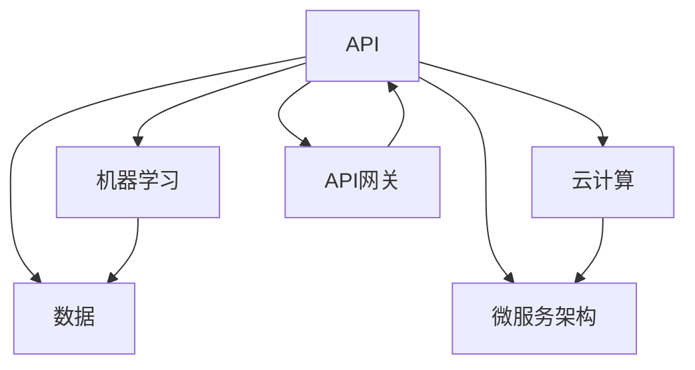

                 


# 使用API快速构建AI应用

> 关键词：API、AI应用、快速开发、云计算、机器学习、API网关、数据处理、微服务架构

> 摘要：本文将介绍如何使用API快速构建AI应用。通过梳理API的基本概念和构建AI应用的技术栈，我们将详细阐述使用API构建AI应用的步骤和方法，同时提供项目实战案例，帮助读者理解和掌握快速构建AI应用的核心技能。

## 1. 背景介绍

### 1.1 目的和范围

本文旨在为开发者提供一条清晰的路径，以快速构建AI应用。我们将探讨API在AI应用开发中的作用，并介绍一些关键技术和工具。通过本文的学习，读者将能够：

- 理解API的基本概念和功能。
- 掌握使用API进行数据获取和处理的技巧。
- 学习如何利用云计算资源加速AI应用开发。
- 熟悉微服务架构在AI应用开发中的应用。

### 1.2 预期读者

本文适合以下读者群体：

- 对AI应用开发感兴趣的程序员和开发人员。
- 有意使用API加速项目开发的团队领导。
- 对云计算和微服务架构有一定了解的技术爱好者。

### 1.3 文档结构概述

本文分为以下几个部分：

- 第1章：背景介绍，包括本文的目的、预期读者和文档结构概述。
- 第2章：核心概念与联系，介绍API和AI应用开发中的核心概念。
- 第3章：核心算法原理 & 具体操作步骤，讲解API的调用流程和数据处理。
- 第4章：数学模型和公式 & 详细讲解 & 举例说明，介绍API调用的数学模型。
- 第5章：项目实战：代码实际案例和详细解释说明，提供实战案例。
- 第6章：实际应用场景，讨论API在AI应用中的实际应用。
- 第7章：工具和资源推荐，推荐学习资源和开发工具。
- 第8章：总结：未来发展趋势与挑战，探讨AI应用开发的未来趋势。
- 第9章：附录：常见问题与解答，解答读者常见问题。
- 第10章：扩展阅读 & 参考资料，提供进一步学习的资源。

### 1.4 术语表

#### 1.4.1 核心术语定义

- API（应用程序编程接口）：允许不同软件之间相互调用的接口。
- AI应用：基于人工智能技术的应用程序，如图像识别、自然语言处理等。
- 云计算：通过互联网提供动态易扩展且经常是虚拟化的资源。
- 微服务架构：将大型应用拆分为多个小型、独立的服务。

#### 1.4.2 相关概念解释

- 数据处理：对数据进行收集、存储、处理和分析的过程。
- API网关：负责处理外部对API调用的网关，用于路由、身份验证和监控。
- 机器学习：一种人工智能技术，通过数据训练模型来识别模式和做出预测。

#### 1.4.3 缩略词列表

- API：应用程序编程接口
- AI：人工智能
- API网关：API网关
- 云计算：云计算
- 微服务：微服务架构
- ML：机器学习

## 2. 核心概念与联系

为了更好地理解API在AI应用开发中的作用，我们需要先了解一些核心概念和它们之间的联系。以下是一个Mermaid流程图，用于展示这些概念和它们之间的关系。



在上面的流程图中，API作为核心组件，与机器学习、数据处理、云计算、微服务和API网关紧密相连。接下来，我们将逐一探讨这些核心概念。

### 2.1 API

API是应用程序编程接口的缩写，它允许不同软件之间相互调用和交互。在AI应用开发中，API用于获取和处理数据，调用机器学习模型，以及与云服务和微服务进行通信。

### 2.2 机器学习

机器学习是人工智能的一个分支，通过从数据中学习模式和规律，使其能够进行预测和决策。在AI应用中，机器学习模型通过API进行训练和部署，以便与其他组件进行交互。

### 2.3 数据处理

数据处理是对数据进行收集、存储、处理和分析的过程。在AI应用中，数据是模型训练的基础，通过API进行数据的获取和处理，为机器学习提供高质量的数据输入。

### 2.4 云计算

云计算是一种通过互联网提供动态易扩展且经常是虚拟化的资源的技术。在AI应用开发中，云计算提供计算资源和存储服务，使开发者能够快速部署和扩展应用。

### 2.5 微服务架构

微服务架构将大型应用拆分为多个小型、独立的服务。每个服务专注于完成特定的功能，并通过API进行通信。这种架构使应用具有更高的可扩展性和容错性。

### 2.6 API网关

API网关是负责处理外部对API调用的网关，用于路由、身份验证和监控。它充当应用程序和外部服务之间的中间层，确保数据传输的安全和高效。

通过了解这些核心概念和它们之间的联系，我们可以更好地理解如何使用API快速构建AI应用。接下来，我们将深入探讨API的调用流程和数据处理。

## 3. 核心算法原理 & 具体操作步骤

在了解API和AI应用开发的基本概念后，我们将深入探讨API的核心算法原理和具体操作步骤。在这一节中，我们将使用伪代码详细阐述API的调用流程和数据处理。

### 3.1 API调用流程

API调用流程通常包括以下几个步骤：

1. **定义API端点**：确定API的URL和参数。
2. **发送HTTP请求**：使用适当的HTTP方法（GET、POST、PUT等）向API端点发送请求。
3. **处理响应**：接收API返回的响应，并处理可能的错误。

以下是一个简单的伪代码示例：

```python
# 定义API端点
API_ENDPOINT = "https://api.example.com/data"

# 发送HTTP GET请求
response = requests.get(API_ENDPOINT)

# 处理响应
if response.status_code == 200:
    data = response.json()
    print("Data received:", data)
else:
    print("Error:", response.status_code)
```

### 3.2 数据处理

数据处理是AI应用的关键环节，包括数据清洗、特征提取和模型训练等步骤。以下是一个简单的数据处理伪代码示例：

```python
# 导入所需的库
import pandas as pd
from sklearn.model_selection import train_test_split
from sklearn.preprocessing import StandardScaler

# 读取数据
data = pd.read_csv("data.csv")

# 数据清洗
data = data.dropna()  # 删除缺失值
data = data[data["feature"] > 0]  # 过滤异常值

# 特征提取
X = data.drop("target", axis=1)  # 特征矩阵
y = data["target"]  # 标签向量

# 划分训练集和测试集
X_train, X_test, y_train, y_test = train_test_split(X, y, test_size=0.2, random_state=42)

# 数据标准化
scaler = StandardScaler()
X_train = scaler.fit_transform(X_train)
X_test = scaler.transform(X_test)
```

### 3.3 API调用与数据处理结合

在实际应用中，API调用和数据处理的步骤往往是结合在一起的。以下是一个简单的示例，展示如何使用API获取数据，并对数据进行处理：

```python
# 获取数据
response = requests.get(API_ENDPOINT)
if response.status_code == 200:
    data = response.json()
    # 数据处理
    data = pd.DataFrame(data)
    data = data.dropna()
    data = data[data["feature"] > 0]
    X = data.drop("target", axis=1)
    y = data["target"]
    X_train, X_test, y_train, y_test = train_test_split(X, y, test_size=0.2, random_state=42)
    X_train = scaler.fit_transform(X_train)
    X_test = scaler.transform(X_test)
```

通过以上示例，我们可以看到API调用和数据处理的流程是如何一步一步地实现的。在实际开发中，这些步骤可能更加复杂，但基本的原理是相同的。接下来，我们将讨论数学模型和公式，以及如何使用它们来深入理解API调用和数据处理的原理。

## 4. 数学模型和公式 & 详细讲解 & 举例说明

在API调用和数据处理的流程中，数学模型和公式扮演着至关重要的角色。它们帮助我们理解数据的分布、特征提取和预测模型的性能。以下是一些关键的数学模型和公式，我们将详细讲解它们，并给出示例。

### 4.1 数据分布

数据分布是描述数据集特征值分布情况的统计方法。常用的数据分布模型有正态分布、均匀分布和泊松分布等。正态分布（也称为高斯分布）是数据分布中最常见的一种，其公式如下：

$$
f(x|\mu, \sigma^2) = \frac{1}{\sqrt{2\pi\sigma^2}}e^{-\frac{(x-\mu)^2}{2\sigma^2}}
$$

其中，$x$ 是特征值，$\mu$ 是均值，$\sigma^2$ 是方差。

示例：假设我们有一个数据集，其特征值服从正态分布，均值为100，方差为16。我们可以使用以下公式计算特征值的概率密度：

$$
f(x=95) = \frac{1}{\sqrt{2\pi \cdot 16}}e^{-\frac{(95-100)^2}{2\cdot16}} \approx 0.1353
$$

这意味着特征值等于95的概率约为13.53%。

### 4.2 特征提取

特征提取是数据预处理的重要步骤，其目的是从原始数据中提取对模型训练有帮助的特征。常见的特征提取方法包括主成分分析（PCA）、线性回归和LDA等。PCA是一种无监督的特征提取方法，其公式如下：

$$
\text{X\_centered} = \text{X} - \mu \\
\text{X\_pca} = \text{U}^T\text{X\_centered}
$$

其中，$\text{X}$ 是特征矩阵，$\mu$ 是均值，$\text{U}$ 是特征空间的协方差矩阵的特征向量。

示例：假设我们有一个2D数据集，其特征矩阵为$\text{X}=\begin{bmatrix} 1 & 2 \\ 3 & 4 \end{bmatrix}$。我们可以计算其中心化和主成分：

$$
\text{X\_centered} = \text{X} - \begin{bmatrix} 2 & 2.5 \\ 3 & 3.5 \end{bmatrix} = \begin{bmatrix} -1 & -0.5 \\ 0 & 0.5 \end{bmatrix} \\
\text{X\_pca} = \begin{bmatrix} 0.8165 & 0.5819 \\ 0.5819 & -0.8165 \end{bmatrix}\begin{bmatrix} -1 & 0 \\ 0 & 0.5 \end{bmatrix} = \begin{bmatrix} -0.8165 & 0.2348 \\ 0.2348 & 0.2348 \end{bmatrix}
$$

这意味着我们成功将原始数据转换到了一个新的特征空间，其中第一个主成分占据了大部分方差。

### 4.3 模型评估

在模型训练完成后，我们需要使用数学模型和公式来评估模型性能。常见的模型评估指标包括准确率、召回率、F1分数和ROC曲线等。准确率（Accuracy）是最简单的评估指标，其公式如下：

$$
\text{Accuracy} = \frac{\text{TP} + \text{TN}}{\text{TP} + \text{TN} + \text{FP} + \text{FN}}
$$

其中，$\text{TP}$ 是真正例，$\text{TN}$ 是真负例，$\text{FP}$ 是假正例，$\text{FN}$ 是假负例。

示例：假设我们有一个二分类模型，其预测结果如下：

$$
\begin{aligned}
\text{TP} &= 90 \\
\text{TN} &= 80 \\
\text{FP} &= 10 \\
\text{FN} &= 20 \\
\text{Accuracy} &= \frac{90 + 80}{90 + 80 + 10 + 20} = \frac{170}{220} \approx 0.7727
\end{aligned}
$$

这意味着我们的模型准确率约为77.27%。

通过以上示例，我们可以看到数学模型和公式在API调用和数据处理的各个阶段都发挥着重要作用。在实际开发中，这些模型和公式可以帮助我们更深入地理解数据和处理结果，从而提高模型性能和应用效果。

## 5. 项目实战：代码实际案例和详细解释说明

在这一节中，我们将通过一个实际的项目案例，演示如何使用API快速构建一个简单的AI应用。我们将详细解释代码实现过程，并分析关键步骤和代码。

### 5.1 开发环境搭建

在开始项目之前，我们需要搭建一个合适的开发环境。以下是我们推荐的工具和库：

- Python 3.8及以上版本
- requests库：用于发送HTTP请求
- Pandas库：用于数据处理
- Scikit-learn库：用于机器学习模型训练和评估
- Flask库：用于构建API服务

首先，确保你已经安装了上述工具和库。如果尚未安装，可以使用以下命令进行安装：

```bash
pip install python==3.8
pip install requests pandas scikit-learn flask
```

### 5.2 源代码详细实现和代码解读

以下是一个简单的Python代码示例，用于构建一个基于API的AI应用。我们将逐步解释代码中的每个部分。

```python
# 导入所需的库
import requests
import pandas as pd
from sklearn.model_selection import train_test_split
from sklearn.preprocessing import StandardScaler
from sklearn.ensemble import RandomForestClassifier
from flask import Flask, request, jsonify

# 1. 定义API端点
API_ENDPOINT = "https://api.example.com/data"

# 2. 获取数据
def get_data():
    response = requests.get(API_ENDPOINT)
    if response.status_code == 200:
        data = response.json()
        df = pd.DataFrame(data)
        return df
    else:
        print("Error:", response.status_code)
        return None

# 3. 数据预处理
def preprocess_data(df):
    df = df.dropna()  # 删除缺失值
    X = df.drop("target", axis=1)  # 特征矩阵
    y = df["target"]  # 标签向量
    X_train, X_test, y_train, y_test = train_test_split(X, y, test_size=0.2, random_state=42)
    scaler = StandardScaler()
    X_train = scaler.fit_transform(X_train)
    X_test = scaler.transform(X_test)
    return X_train, X_test, y_train, y_test

# 4. 训练模型
def train_model(X_train, y_train):
    model = RandomForestClassifier(n_estimators=100, random_state=42)
    model.fit(X_train, y_train)
    return model

# 5. 预测
def predict(model, X_test):
    predictions = model.predict(X_test)
    return predictions

# 6. Flask API服务
app = Flask(__name__)

@app.route('/predict', methods=['POST'])
def predict_api():
    data = request.get_json()
    df = pd.DataFrame(data['data'])
    df = preprocess_data(df)
    predictions = predict(model, df)
    return jsonify(predictions.tolist())

if __name__ == '__main__':
    model = train_model(*preprocess_data(get_data()))
    app.run(debug=True)
```

### 5.3 代码解读与分析

以下是代码的逐行解读：

- **第1行**：导入所需的库。
- **第2行**：定义API端点。
- **第3-9行**：获取数据。我们使用requests库发送HTTP GET请求，从API获取数据，并将其转换为Pandas DataFrame。
- **第10-18行**：数据预处理。首先，删除缺失值。然后，将特征和标签分离，并划分训练集和测试集。最后，使用StandardScaler进行数据标准化。
- **第19-23行**：训练模型。我们使用Scikit-learn的RandomForestClassifier进行训练。
- **第24-27行**：预测。使用训练好的模型对测试集进行预测。
- **第28-35行**：Flask API服务。我们定义一个预测API端点，接受POST请求，并返回预测结果。
- **第36-38行**：主程序。首先，训练模型，然后启动Flask服务。

通过这个简单的项目案例，我们可以看到如何使用API快速构建AI应用。在实际开发中，你可能需要处理更复杂的数据和模型，但基本的原理是相同的。

## 6. 实际应用场景

API在AI应用开发中具有广泛的应用场景。以下是一些典型的实际应用场景：

### 6.1 图像识别

图像识别是AI领域的热门应用。API可以帮助开发者快速集成预训练的图像识别模型，如Google的TensorFlow Lite或PyTorch。例如，我们可以使用API从摄像头或图像库中获取图像，并使用预训练的模型进行分类或检测。

### 6.2 自然语言处理

自然语言处理（NLP）是另一个广泛应用的领域。API可以帮助开发者轻松实现文本分类、情感分析和命名实体识别等功能。例如，Google Cloud Natural Language API提供了丰富的NLP功能，包括情感分析和实体识别。

### 6.3 数据分析

数据分析是许多企业的核心需求。API可以帮助开发者快速集成数据存储和处理服务，如Google BigQuery或Amazon Redshift。通过API，开发者可以轻松查询和分析海量数据，并生成可视化报告。

### 6.4 实时监控

实时监控是企业运营的重要环节。API可以帮助开发者构建实时监控系统，如监控网站性能、服务器状态或用户行为。例如，使用API可以从传感器或日志文件中获取实时数据，并使用机器学习模型进行异常检测。

### 6.5 聊天机器人

聊天机器人是客户服务和互动娱乐的重要工具。API可以帮助开发者快速构建聊天机器人，如使用API网关集成不同的聊天平台，如Facebook Messenger或Slack。

通过以上实际应用场景，我们可以看到API在AI应用开发中的重要性。它提供了灵活、高效的方法，帮助开发者快速构建和部署各种AI应用。

## 7. 工具和资源推荐

为了更好地进行API开发和应用，我们推荐以下工具和资源：

### 7.1 学习资源推荐

#### 7.1.1 书籍推荐

- 《API设计：艺术与科学》（API Design: Patterns, Principles, and Process）：全面介绍API设计的原则和实践。
- 《RESTful Web APIs》：深入探讨RESTful API的设计和实现。

#### 7.1.2 在线课程

- 《Google Cloud Platform API设计课程》：由Google提供的免费在线课程，介绍API设计和实现的最佳实践。
- 《RESTful API设计实战》：通过实战案例学习如何设计和实现RESTful API。

#### 7.1.3 技术博客和网站

- API设计指南（API Design Guide）：提供API设计相关的最佳实践和案例。
- REST API设计指南（REST API Design Guide）：详细介绍RESTful API的设计原则和模式。

### 7.2 开发工具框架推荐

#### 7.2.1 IDE和编辑器

- PyCharm：功能强大的Python IDE，支持API开发和调试。
- Visual Studio Code：轻量级编辑器，适用于多种编程语言，包括Python。

#### 7.2.2 调试和性能分析工具

- Postman：用于API调试和测试的强大工具。
- New Relic：用于监控和性能分析的应用性能管理（APM）工具。

#### 7.2.3 相关框架和库

- Flask：轻量级Python Web框架，适用于构建RESTful API。
- Django：功能丰富的Python Web框架，适用于快速构建大型Web应用。
- FastAPI：基于Starlette和Pydantic的快速、现代、易于编写和易于理解的Web框架。

通过这些工具和资源的支持，开发者可以更高效地进行API开发和AI应用构建。

## 8. 总结：未来发展趋势与挑战

随着AI技术的不断进步和API设计的不断完善，未来AI应用开发将迎来更多机遇和挑战。以下是一些未来发展趋势和挑战：

### 8.1 发展趋势

1. **API标准化**：随着越来越多的企业和开发者采用API，API标准化变得越来越重要。标准化可以提高API的互操作性和可靠性，从而降低开发成本。
2. **AI与API融合**：AI技术与API的融合将推动更多创新应用的出现。例如，基于API的自动化决策系统和智能监控平台将成为企业的重要工具。
3. **边缘计算**：随着物联网（IoT）和边缘计算的兴起，越来越多的AI应用将在边缘设备上运行。API将成为连接云端和边缘设备的重要桥梁。
4. **隐私保护**：随着数据隐私保护法规的加强，如何保护用户隐私将成为AI应用开发的重要挑战。开发者需要采用更加严格的数据处理和存储策略。

### 8.2 挑战

1. **性能优化**：随着AI应用规模和复杂度的增加，性能优化将成为一项重要任务。开发者需要关注API的响应时间、吞吐量和并发处理能力。
2. **安全性**：API安全性是AI应用开发中的一个关键问题。开发者需要采取严格的身份验证和授权措施，以防止未经授权的访问和数据泄露。
3. **API文档**：高质量的API文档对于开发者理解和使用API至关重要。然而，编写和维护高质量的API文档是一项耗时的工作，需要持续投入。

总之，未来AI应用开发将面临更多机遇和挑战。通过关注发展趋势和解决关键挑战，开发者可以更好地利用API技术，推动AI应用的创新和发展。

## 9. 附录：常见问题与解答

### 9.1 问题1：如何选择合适的API框架？

**解答**：选择API框架时，应考虑以下几个因素：

- **项目规模**：对于小型项目，可以选择Flask或Django等轻量级框架；对于大型项目，可以选择更强大的框架，如Spring Boot或Express.js。
- **开发语言**：根据开发团队的熟悉程度选择合适的语言框架。例如，Python开发者可以选择Flask或Django。
- **性能需求**：对于高性能应用，可以选择使用异步框架，如Node.js的Express.js或Python的FastAPI。
- **生态支持**：选择具有丰富生态支持和社区活跃度的框架，可以更轻松地解决问题和获取帮助。

### 9.2 问题2：如何确保API安全性？

**解答**：

- **身份验证**：使用OAuth 2.0、JWT（JSON Web Tokens）或基本认证等机制进行身份验证。
- **授权**：确保只有授权用户可以访问特定API资源，使用RBAC（基于角色的访问控制）或ABAC（基于属性的访问控制）。
- **数据加密**：使用HTTPS协议传输数据，并对敏感数据进行加密。
- **输入验证**：对用户输入进行严格验证，以防止SQL注入、XSS（跨站脚本攻击）等安全漏洞。
- **API网关**：使用API网关进行统一的认证、授权和监控，提高安全性。

### 9.3 问题3：如何优化API性能？

**解答**：

- **缓存**：使用缓存减少API请求的处理时间，提高响应速度。
- **异步处理**：使用异步编程模型，减少线程阻塞，提高并发处理能力。
- **负载均衡**：使用负载均衡器（如Nginx或HAProxy）均衡请求流量，提高系统可用性。
- **数据库优化**：优化数据库查询，使用索引、分片等技术提高查询效率。
- **代码优化**：优化代码逻辑，避免不必要的循环和递归，提高运行效率。

通过遵循上述最佳实践，可以确保API的安全性和性能。

## 10. 扩展阅读 & 参考资料

为了进一步深入了解API开发和AI应用构建，以下是推荐的一些扩展阅读和参考资料：

- 《API设计：艺术与科学》：全面介绍API设计的原则和实践。
- 《RESTful Web APIs》：详细探讨RESTful API的设计和实现。
- 《API Design Guide》：提供API设计相关的最佳实践和案例。
- 《REST API Design Guide》：详细介绍RESTful API的设计原则和模式。
- 《Google Cloud Platform API设计课程》：由Google提供的免费在线课程，介绍API设计和实现的最佳实践。
- 《API Design for User Experience》：探讨如何设计用户体验友好的API。
- 《PyTorch官方文档》：介绍PyTorch的使用和API调用方法。
- 《TensorFlow Lite官方文档》：介绍TensorFlow Lite的使用和API调用方法。
- 《Scikit-learn官方文档》：介绍Scikit-learn的使用和API调用方法。
- 《Flask官方文档》：介绍Flask的使用和API开发。
- 《Django官方文档》：介绍Django的使用和API开发。

通过阅读这些资料，您可以更深入地了解API开发和AI应用构建的各个方面，为实际项目提供有益的参考。

