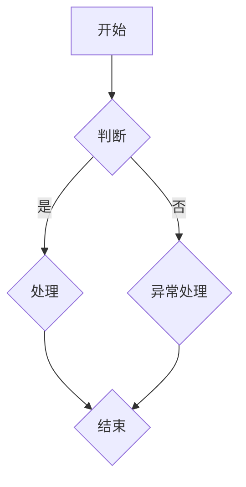
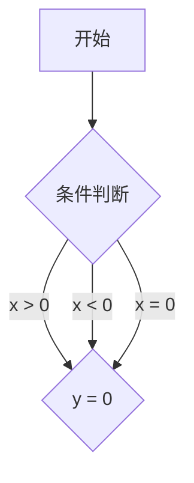
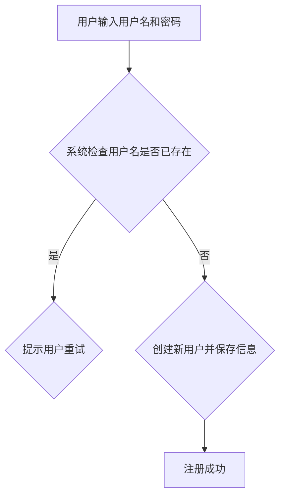
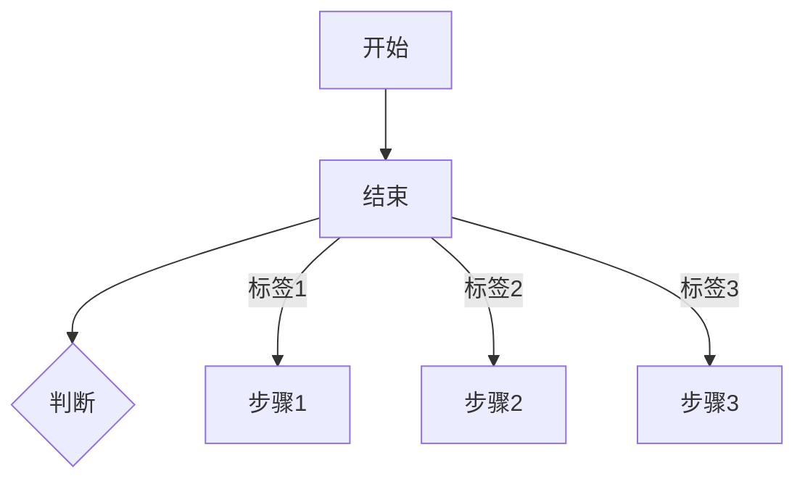

                 

# 使用Mermaid语法创建流程图表

> **关键词**：Mermaid，流程图，语法，图表，步骤，操作

> **摘要**：本文将详细介绍如何使用Mermaid语法创建流程图表。我们将从基础语法入手，逐步讲解复杂图表的构建方法，并展示实际操作步骤。通过本文的阅读，您将能够熟练掌握Mermaid语法，轻松绘制各种流程图表。

## 1. 背景介绍

### 1.1 目的和范围

本文旨在帮助您掌握使用Mermaid语法创建流程图表的方法。我们将覆盖以下内容：

- Mermaid基础语法
- 流程图表的基本构建方法
- 复杂图表的构建技巧
- 实际操作步骤示例

通过本文的学习，您将能够：

- 理解Mermaid语法的基本规则
- 创建简单的流程图表
- 设计复杂且美观的流程图
- 在实际项目中应用Mermaid语法

### 1.2 预期读者

本文适合以下读者群体：

- 初学者：对Mermaid语法一无所知，希望快速入门
- 进阶用户：已经了解Mermaid，希望深入了解其高级功能
- 开发者：需要使用流程图辅助项目开发，希望掌握Mermaid

### 1.3 文档结构概述

本文分为以下几个部分：

- 背景介绍
  - 目的和范围
  - 预期读者
  - 文档结构概述
- 核心概念与联系
- 核心算法原理 & 具体操作步骤
- 数学模型和公式 & 详细讲解 & 举例说明
- 项目实战：代码实际案例和详细解释说明
- 实际应用场景
- 工具和资源推荐
  - 学习资源推荐
  - 开发工具框架推荐
  - 相关论文著作推荐
- 总结：未来发展趋势与挑战
- 附录：常见问题与解答
- 扩展阅读 & 参考资料

### 1.4 术语表

#### 1.4.1 核心术语定义

- **Mermaid**：一种基于Markdown的图表绘制工具，支持流程图、序列图、类图等多种图表类型。
- **流程图**：用图形表示程序中各个步骤之间关系的图表。
- **语法**：表示图表元素和关系的特定规则。

#### 1.4.2 相关概念解释

- **节点（Node）**：流程图中的基本元素，表示一个步骤或决策点。
- **边（Edge）**：连接两个节点的元素，表示步骤之间的逻辑关系。

#### 1.4.3 缩略词列表

- **MD**：Markdown
- **D3.js**：Data-Driven Documents，一个用于数据可视化的JavaScript库

## 2. 核心概念与联系

在介绍Mermaid语法之前，我们需要了解一些核心概念和它们之间的联系。以下是一个简单的Mermaid流程图示例，展示了节点和边的基本结构：



### 核心概念解释

- **节点**：表示流程图中的各个步骤，如`A`（开始）、`B`（判断）、`C`（处理）、`D`（异常处理）和`E`（结束）。
- **边**：表示步骤之间的逻辑关系，如从`A`到`B`表示开始到判断的流程，从`B`到`C`和`D`表示判断为真是执行处理，判断为假则执行异常处理。

### 节点和边的连接规则

- **节点**：使用方括号`[]`包围节点名称，如`A[开始]`。
- **边**：使用箭头`-->`连接节点，如`A --> B`。箭头表示从左边节点指向右边节点。

## 3. 核心算法原理 & 具体操作步骤

在了解了基本概念后，接下来我们将详细讲解如何使用伪代码来描述流程图的构建过程。

### 伪代码描述

```plaintext
// 初始化流程图
graph {
    // 定义节点
    A[开始]
    B[判断]
    C[处理]
    D[异常处理]
    E[结束]

    // 添加边
    A --> B
    B -->|是| C
    B -->|否| D
    C --> E
    D --> E
}
```

### 步骤说明

1. **初始化流程图**：使用`graph`关键字开始定义流程图。
2. **定义节点**：使用方括号`[]`包围节点名称，如`A[开始]`。
3. **添加边**：使用箭头`-->`连接节点，如`A --> B`。边后面的标签表示条件或逻辑关系。

通过以上步骤，我们可以用伪代码描述一个简单的流程图。接下来，我们将进一步讲解如何使用Mermaid语法创建更复杂的流程图。

## 4. 数学模型和公式 & 详细讲解 & 举例说明

在流程图的构建过程中，我们常常需要使用数学模型和公式来表示复杂逻辑。以下是一个简单的数学模型示例，用于表示流程图中的条件判断：

### 数学模型

$$
f(x) = \begin{cases} 
y = x + 1 & \text{如果 } x > 0 \\
y = x - 1 & \text{如果 } x < 0 \\
y = 0 & \text{如果 } x = 0 
\end{cases}
$$

### 详细讲解

这个数学模型描述了如何根据输入值$x$计算输出值$y$。根据$x$的正负，模型分为三种情况：

1. 当$x > 0$时，$y = x + 1$。
2. 当$x < 0$时，$y = x - 1$。
3. 当$x = 0$时，$y = 0$。

### 举例说明

假设输入值$x = 3$，根据模型计算：

$$
f(3) = 3 + 1 = 4
$$

因此，当$x = 3$时，输出值$y = 4$。

再假设输入值$x = -2$，根据模型计算：

$$
f(-2) = -2 - 1 = -3
$$

因此，当$x = -2$时，输出值$y = -3$。

通过以上示例，我们可以看到如何将数学模型应用于流程图的构建。接下来，我们将展示如何使用Mermaid语法将这些模型表示为流程图。

### Mermaid语法示例



在这个示例中，我们使用条件判断节点`B`来表示数学模型中的不同情况，并使用边连接各个节点。条件判断节点的标签为`x > 0`、`x < 0`和`x = 0`，分别对应数学模型中的三种情况。

通过这个示例，我们可以看到如何使用Mermaid语法将数学模型和流程图结合起来。接下来，我们将进一步讲解如何创建更复杂的流程图。

## 5. 项目实战：代码实际案例和详细解释说明

为了更好地理解如何使用Mermaid语法创建流程图，我们将通过一个实际项目案例来进行详细解释。在这个案例中，我们将创建一个简单的用户注册流程图，包括以下几个步骤：

1. 用户输入用户名和密码。
2. 系统检查用户名是否已存在。
3. 如果用户名不存在，则创建新用户并保存信息。
4. 如果用户名已存在，则提示用户重试。

### 5.1 开发环境搭建

在开始之前，请确保您已安装以下工具：

- Node.js（版本>=10.0.0）
- Mermaid（可通过npm安装）

安装Node.js：

```bash
curl -fsSL https://deb.nodesource.com/setup_10.x | sudo -E bash -
sudo apt-get install -y nodejs
```

安装Mermaid：

```bash
npm install -g mermaid
```

### 5.2 源代码详细实现和代码解读

以下是用户注册流程图的Mermaid语法实现：



### 步骤解读

1. **用户输入用户名和密码**（A节点）：这是流程图的起始点，表示用户进行注册操作的步骤。
2. **系统检查用户名是否已存在**（B节点）：系统根据用户输入的用户名进行查询，以判断该用户名是否已存在于系统中。
3. **如果用户名已存在**（C节点）：系统提示用户重试，流程回到步骤1。
4. **如果用户名不存在**（D节点）：系统创建新用户并保存相关信息，流程继续到步骤4。
5. **注册成功**（E节点）：表示用户注册成功，流程结束。

### 5.3 代码解读与分析

以下是对上述代码的进一步解读和分析：

- **A节点**：使用`A[用户输入用户名和密码]`表示用户输入注册信息的步骤。在这个步骤中，用户需要输入用户名和密码。
- **B节点**：使用`B{系统检查用户名是否已存在}`表示系统检查用户名是否已存在。这是一个条件判断节点，根据结果决定流程的下一步。
- **C节点**：使用`C{提示用户重试}`表示系统提示用户重试。这个节点表示当用户名已存在时，系统将给出提示，并返回到步骤1。
- **D节点**：使用`D{创建新用户并保存信息}`表示系统创建新用户并保存相关信息。这个节点表示当用户名不存在时，系统将执行用户注册操作。
- **E节点**：使用`E[注册成功]`表示用户注册成功。这个节点表示流程的结束点。

通过以上分析，我们可以看到如何使用Mermaid语法实现一个简单的用户注册流程图，并理解其中的关键步骤和逻辑关系。接下来，我们将讨论流程图的实际应用场景。

### 5.4 实际应用场景

用户注册流程图在实际项目中具有广泛的应用场景，如下：

- **在线购物平台**：用户在注册账号时，系统会检查用户名是否已存在，以避免重复注册。
- **社交网络**：用户在注册社交账号时，系统会检查用户名和邮箱是否已被使用，以确保用户信息的唯一性。
- **企业内部系统**：员工在注册企业内部系统账号时，系统会检查用户名是否已存在，以防止信息泄露。

通过这些实际应用场景，我们可以看到流程图在软件开发中的重要性，它帮助我们清晰地理解和设计系统的业务流程。

### 5.5 绘制流程图

要绘制上述用户注册流程图，请按照以下步骤操作：

1. **创建Mermaid文件**：在文本编辑器中创建一个新文件，如`user_registration.md`。
2. **编写Mermaid代码**：将上面的Mermaid代码复制并粘贴到文件中。
3. **渲染流程图**：使用以下命令在命令行中渲染流程图：

```bash
mermaid user_registration.md
```

这将生成一个名为`user_registration.png`的流程图图像文件。

通过以上步骤，您就可以在本地生成并查看用户注册流程图。接下来，我们将讨论如何在项目中集成和使用Mermaid。

### 5.6 在项目中集成和使用Mermaid

在实际项目中，我们可以将Mermaid集成到各种开发环境中，以便更方便地绘制和展示流程图。以下是在不同环境中集成和使用Mermaid的方法：

- **Visual Studio Code**：安装Mermaid插件，支持在代码中直接绘制和预览流程图。
- **Jupyter Notebook**：使用`mermaid-python`库，在Markdown单元格中直接编写Mermaid代码并渲染。
- **Markdown编辑器**：如Typora，支持Mermaid语法的高亮显示和实时预览。

通过以上方法，我们可以在各种开发环境中轻松地使用Mermaid，为项目文档添加流程图，提高代码的可读性和可理解性。

## 6. 实际应用场景

Mermaid语法在实际应用中具有广泛的应用场景，以下是几个典型的应用领域：

### 6.1 软件开发

- **需求分析**：在软件项目开发初期，使用Mermaid流程图可以清晰地表示业务流程和系统架构，帮助团队成员更好地理解项目需求。
- **代码审查**：开发者在编写代码前可以使用流程图来规划代码结构，有助于发现潜在问题和优化代码逻辑。

### 6.2 项目管理

- **任务分配**：项目经理可以使用流程图来规划项目任务和时间线，确保团队成员了解各自的责任和进度。
- **风险管理**：流程图有助于识别项目中可能出现的风险点，并制定相应的应对措施。

### 6.3 产品设计

- **用户界面设计**：设计师可以使用流程图来表示用户界面交互流程，确保界面设计符合用户需求。
- **原型设计**：流程图可以用于创建产品原型，帮助团队成员更好地理解产品的功能和流程。

### 6.4 教育培训

- **课程设计**：教育工作者可以使用流程图来设计课程内容，提高学生的学习效果。
- **教学演示**：在课堂或培训中，流程图可以直观地展示知识点和逻辑关系，帮助学生更好地理解课程内容。

### 6.5 业务流程管理

- **供应链管理**：企业可以使用流程图来优化供应链流程，提高效率和降低成本。
- **客户服务**：客服团队可以使用流程图来处理客户问题，确保高效和一致的客户服务。

通过这些实际应用场景，我们可以看到Mermaid语法在各个领域的广泛适用性，它帮助我们更好地理解和传达复杂的信息和流程。

## 7. 工具和资源推荐

为了帮助您更高效地使用Mermaid，以下是一些学习资源、开发工具和框架的推荐。

### 7.1 学习资源推荐

#### 7.1.1 书籍推荐

- **《Mermaid Graph Visualization Guide》**：这是一本专门介绍Mermaid的指南书，涵盖了Mermaid的基本语法、高级功能和最佳实践。
- **《D3.js in Action》**：虽然不是专门关于Mermaid的书，但该书详细介绍了D3.js库的使用，其中包含了大量关于数据可视化的例子，对理解Mermaid也有很大帮助。

#### 7.1.2 在线课程

- **Coursera上的《Data Visualization with D3.js》**：这是一个系统的在线课程，涵盖了数据可视化的基础知识，包括如何使用D3.js和Mermaid进行图表绘制。
- **Udemy上的《Mermaid: Graph and Diagrams for Markdown》**：这是一个专门的Mermaid入门课程，从基础语法到高级功能都有详细的讲解。

#### 7.1.3 技术博客和网站

- **Mermaid官网（mermaid-js.github.io）**：这是Mermaid的官方文档网站，包含了详细的语法说明、示例和教程。
- **Stack Overflow上的Mermaid标签**：这是一个讨论Mermaid相关问题的技术社区，您可以在这里找到解决方案和最佳实践。

### 7.2 开发工具框架推荐

#### 7.2.1 IDE和编辑器

- **Visual Studio Code**：VS Code是一个强大的代码编辑器，安装Mermaid插件后可以轻松绘制和预览流程图。
- **Sublime Text**：Sublime Text也是一个优秀的文本编辑器，通过安装插件可以支持Mermaid语法高亮显示和渲染。

#### 7.2.2 调试和性能分析工具

- **Chrome DevTools**：Chrome DevTools提供了强大的性能分析工具，可以用来调试和优化使用Mermaid生成的图表。
- **Visual Studio Enterprise**：对于需要集成更多高级功能的开发者，Visual Studio Enterprise提供了全面的调试和分析工具。

#### 7.2.3 相关框架和库

- **D3.js**：D3.js是一个用于数据可视化的JavaScript库，与Mermaid语法有很好的兼容性，可以用来创建复杂且动态的图表。
- **Chart.js**：Chart.js是一个简单易用的图表库，虽然它不支持Mermaid语法，但可以与Mermaid结合使用，创建更丰富的图表。

### 7.3 相关论文著作推荐

#### 7.3.1 经典论文

- **"Data-Driven Documents: Web-based Data Visualization"**：该论文介绍了D3.js的基本原理和设计思想，对理解Mermaid有很大帮助。
- **"Graph Visualization and Navigation in Information Visualization"**：这篇论文详细讨论了图表可视化在信息可视化中的应用，包括如何构建和组织图表。

#### 7.3.2 最新研究成果

- **"Interactive Graph Visualization and Navigation"**：该研究论文探讨了交互式图表可视化的新方法和工具，为使用Mermaid进行复杂图表绘制提供了参考。
- **"Web-Based Data Visualization with D3.js"**：这是一篇关于如何使用D3.js和Mermaid进行Web数据可视化的最新研究成果，提供了实用的示例和技巧。

#### 7.3.3 应用案例分析

- **"Designing Data-Driven Documents with D3.js"**：这篇文章通过具体的案例分析，展示了如何使用D3.js和Mermaid构建高效的可视化工具。
- **"Creating Interactive Data Visualizations with Mermaid and D3.js"**：这篇案例研究讨论了如何结合Mermaid和D3.js创建交互式数据可视化应用，为开发实际项目提供了实用经验。

通过这些工具和资源，您可以更深入地了解和掌握Mermaid语法，在实际项目中应用这些知识，提高工作效率和代码质量。

## 8. 总结：未来发展趋势与挑战

随着技术的发展，Mermaid作为一种基于Markdown的图表绘制工具，正逐渐受到越来越多开发者的青睐。未来，Mermaid的发展趋势和面临的挑战如下：

### 8.1 未来发展趋势

1. **更丰富的图表类型**：目前，Mermaid支持多种图表类型，如流程图、序列图、类图等。未来，我们将看到更多类型的图表被加入，以满足不同领域的需求。

2. **更好的集成与兼容性**：随着各种开发工具和框架的不断发展，Mermaid将与其他工具更好地集成，提供更流畅的使用体验。同时，它也将与其他图表库（如D3.js、Chart.js等）实现更好的兼容性，以便于开发者灵活使用。

3. **更强大的交互功能**：未来，Mermaid将引入更多交互功能，如动态图表、用户自定义交互等，使得图表更加直观和用户友好。

4. **更广泛的应用领域**：随着Mermaid功能的不断完善，它将在更多领域得到应用，如数据可视化、软件设计、项目管理等。

### 8.2 面临的挑战

1. **性能优化**：随着图表类型的增多和复杂度提高，Mermaid需要面对性能优化的问题，确保在生成和渲染图表时保持高效。

2. **易用性提升**：尽管Mermaid的语法相对简单，但对于初学者和不太熟悉Markdown的开发者来说，仍存在一定的学习门槛。未来，需要进一步提升易用性，降低学习成本。

3. **标准化与规范**：为了确保Mermaid在不同平台和工具中的兼容性，需要制定更统一的规范和标准。

4. **社区建设和维护**：随着用户的增加，如何保持社区的活跃和健康，及时解决用户问题，是Mermaid面临的重要挑战。

总之，未来Mermaid将在图表绘制领域发挥更大的作用，同时也需要不断克服挑战，以实现更高效、更易用的图表绘制工具。

## 9. 附录：常见问题与解答

为了帮助您更好地理解和使用Mermaid语法，以下是一些常见问题及其解答。

### 9.1 如何绘制带标签的边？

要绘制带标签的边，可以使用如下语法：



在这个示例中，从节点`B`到节点`D`、`E`和`F`的边都带有标签。

### 9.2 如何在流程图中使用注释？

要在流程图中添加注释，可以使用如下语法：

```mermaid
graph TD
    A[开始]
    B{判断}
    C{处理}
    D[结束]

    A --> B
    B -->|是| C
    B -->|否| D

    %% 这是注释
    note right of B
    抽象层次:
    - 高层：业务逻辑
    - 中层：数据流和控制流
    - 低层：具体操作
    end note
```

在这个示例中，注释`%% 这是注释`被放置在流程图的右侧，并使用`note`关键字和`right of`属性来指定位置。

### 9.3 如何调整流程图的布局？

可以使用`graph`关键字中的`layout`属性来调整流程图的布局，如下所示：

```mermaid
graph TB
    A[开始]
    B{判断}
    C[处理]
    D[结束]

    A --> B
    B -->|是| C
    B -->|否| D

    layout TD; // 设置布局为表格布局
```

支持的布局包括`TB`（上下布局）、`LR`（左右布局）、`RL`（左右反转布局）和`TD`（表格布局）。您可以根据需要选择合适的布局。

### 9.4 如何在流程图中使用HTML标签？

要在流程图中使用HTML标签，可以使用`html`关键字，如下所示：

```mermaid
graph TD
    A[开始]
    B{判断}
    C[处理]
    D[结束]

    A --> B
    B -->|是| C
    B -->|否| D

    B html
    <div style="color: red; font-weight: bold;">警告：请谨慎操作！</div>
    end html
```

在这个示例中，`B`节点的HTML内容将被渲染为红色加粗的文字。

### 9.5 如何在流程图中使用图像？

要在流程图中添加图像，可以使用`image`关键字，如下所示：

```mermaid
graph TD
    A[开始]
    B{判断}
    C[处理]
    D[结束]

    A --> B
    B -->|是| C
    B -->|否| D

    C image
    src: "https://example.com/image.jpg"
    alt: "示例图片"
    end image
```

在这个示例中，`C`节点将显示一个来自指定URL的图片。

通过以上常见问题及其解答，我们可以更好地理解和应用Mermaid语法，创建美观且功能丰富的流程图。

## 10. 扩展阅读 & 参考资料

为了深入了解Mermaid及其应用，以下是一些扩展阅读和参考资料，供您参考：

### 10.1 经典技术书籍

- **《D3.js in Action》**：详细介绍D3.js的原理和应用，包括如何与Mermaid结合使用。
- **《Data Visualization with D3.js》**：探讨数据可视化的基本原理，涵盖D3.js和Mermaid的相关内容。
- **《Mermaid Graph Visualization Guide》**：专门介绍Mermaid的指南，包括基础语法、高级功能和最佳实践。

### 10.2 在线课程与教程

- **Coursera上的《Data Visualization with D3.js》**：一个系统的在线课程，涵盖数据可视化的基础知识，包括D3.js和Mermaid的使用。
- **Udemy上的《Mermaid: Graph and Diagrams for Markdown》**：一个专门的Mermaid入门课程，从基础语法到高级功能都有详细的讲解。

### 10.3 技术博客和网站

- **Mermaid官网（mermaid-js.github.io）**：包含详细的Mermaid语法说明、示例和教程。
- **Stack Overflow上的Mermaid标签**：一个讨论Mermaid相关问题的技术社区，提供解决方案和最佳实践。

### 10.4 论文和研究报告

- **"Data-Driven Documents: Web-Based Data Visualization"**：介绍了D3.js的基本原理和设计思想，有助于理解Mermaid。
- **"Interactive Graph Visualization and Navigation"**：探讨了交互式图表可视化的新方法和工具。

通过以上参考资料，您可以更深入地了解Mermaid的原理和应用，提高您的图表绘制技能。同时，也欢迎您继续关注和探索这个强大的图表工具。

