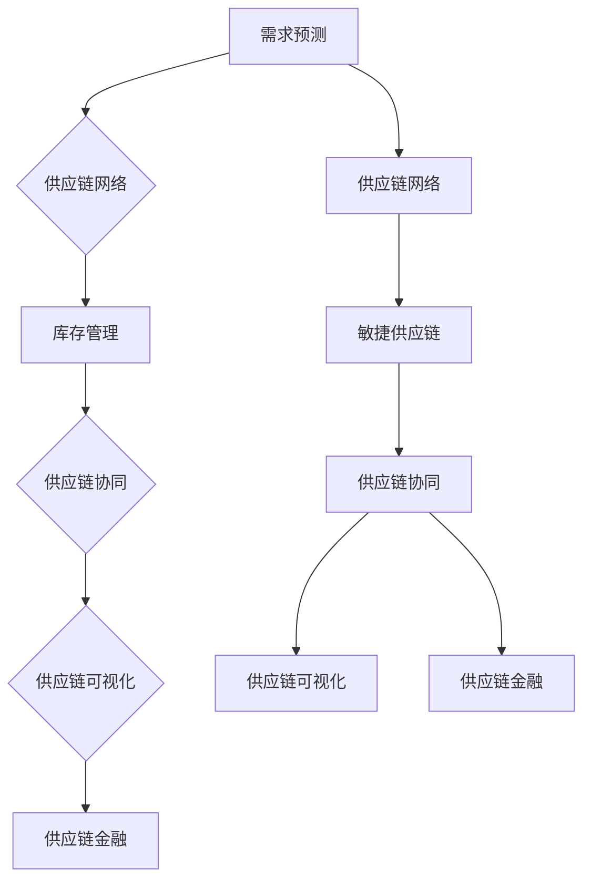

                 

# 供应链管理：优化企业运营的关键

> **关键词**：供应链管理、企业运营、优化、效率、成本控制、敏捷性、数据分析

> **摘要**：本文深入探讨了供应链管理在企业运营中的核心作用，阐述了如何通过优化供应链管理来提升企业效率、降低成本、增强市场响应能力。文章将系统地介绍供应链管理的基本概念、核心算法原理、数学模型及其应用场景，并通过实际案例进行详细解释。此外，还将推荐相关学习资源、工具和框架，以帮助读者更好地理解和应用供应链管理。

## 1. 背景介绍

### 1.1 目的和范围

随着全球化经济的不断发展，供应链管理已成为企业保持竞争力、实现可持续增长的关键因素。本文旨在为读者提供一个全面、系统的供应链管理指南，帮助读者理解供应链管理的核心概念、算法原理和实际应用。

本文将涵盖以下主要内容：

- 供应链管理的基本概念和核心原则
- 核心算法原理与操作步骤
- 数学模型和公式及其应用
- 实际应用场景及案例分析
- 工具和资源推荐
- 未来发展趋势与挑战

### 1.2 预期读者

本文适合以下读者群体：

- 企业管理人员，特别是供应链和运营部门的管理者
- 计算机科学、管理科学与工程等相关专业的研究生和本科生
- 对供应链管理感兴趣的IT从业者和研究人员

### 1.3 文档结构概述

本文分为十个部分，具体结构如下：

1. 背景介绍
2. 核心概念与联系
3. 核心算法原理 & 具体操作步骤
4. 数学模型和公式 & 详细讲解 & 举例说明
5. 项目实战：代码实际案例和详细解释说明
6. 实际应用场景
7. 工具和资源推荐
8. 总结：未来发展趋势与挑战
9. 附录：常见问题与解答
10. 扩展阅读 & 参考资料

### 1.4 术语表

#### 1.4.1 核心术语定义

- **供应链管理（Supply Chain Management）**：供应链管理是指对整个供应链系统进行计划、组织、协调与控制的过程，以实现供应链的整体优化和资源的最优配置。
- **供应链网络（Supply Chain Network）**：供应链网络是指企业与其供应商、分销商、零售商等合作伙伴之间形成的物流、信息流和资金流的网络结构。
- **需求预测（Demand Forecasting）**：需求预测是指根据历史数据、市场信息、竞争态势等因素，预测未来一定时间内产品的需求量。
- **库存管理（Inventory Management）**：库存管理是指对企业库存水平进行监控、调整和控制，以实现库存成本的最小化和供应的及时性。
- **供应链可视化（Supply Chain Visualization）**：供应链可视化是指利用图表、模型等可视化工具，将供应链网络中的各种信息进行直观展示，以帮助企业更好地理解和管理供应链。

#### 1.4.2 相关概念解释

- **敏捷供应链（Agile Supply Chain）**：敏捷供应链是指企业在面对市场变化和需求波动时，能够快速响应、调整供应链策略，以保持供应链的稳定性和竞争力。
- **供应链协同（Supply Chain Collaboration）**：供应链协同是指供应链中各环节的合作伙伴之间通过信息共享、资源共享和业务流程协同，实现供应链整体优化的过程。
- **供应链金融（Supply Chain Finance）**：供应链金融是指通过供应链中的企业及其合作伙伴之间的贸易关系，提供融资、保理、信用保险等金融服务，以支持供应链的顺畅运行。

#### 1.4.3 缩略词列表

- **ERP（Enterprise Resource Planning）**：企业资源计划
- **SCM（Supply Chain Management）**：供应链管理
- **CRM（Customer Relationship Management）**：客户关系管理
- **MES（Manufacturing Execution System）**：制造执行系统
- **WMS（Warehouse Management System）**：仓库管理系统

## 2. 核心概念与联系

在深入探讨供应链管理之前，我们需要了解一些核心概念及其相互之间的联系。以下是一个简单的Mermaid流程图，用于展示供应链管理中的关键节点和流程。



### 2.1 需求预测

需求预测是供应链管理的基础，它决定了供应链中各环节的生产、库存、配送等活动的安排。需求预测的准确性直接影响到企业的运营效率和市场响应能力。常见的需求预测方法包括时间序列分析、回归分析、机器学习等。

### 2.2 供应链网络

供应链网络是指企业与其供应商、分销商、零售商等合作伙伴之间形成的物流、信息流和资金流的网络结构。供应链网络的优化是供应链管理的重要目标，可以通过以下方法实现：

- **资源整合**：整合供应链各环节的资源，实现资源的最佳配置。
- **流程优化**：优化供应链各环节的业务流程，减少浪费，提高效率。
- **信息共享**：实现供应链各环节的信息共享，提高信息透明度，降低沟通成本。
- **风险管理**：识别和评估供应链中的风险，制定相应的风险应对策略。

### 2.3 库存管理

库存管理是供应链管理的关键环节之一，它决定了企业的库存水平和库存成本。有效的库存管理可以通过以下方法实现：

- **需求预测**：准确的需求预测是库存管理的基础。
- **库存优化**：根据需求预测结果，优化库存水平和库存结构。
- **库存监控**：实时监控库存水平，及时调整库存策略。
- **供应链协同**：与供应链各环节的合作伙伴协同，实现库存的及时调整和配送。

### 2.4 供应链协同

供应链协同是指供应链中各环节的合作伙伴之间通过信息共享、资源共享和业务流程协同，实现供应链整体优化的过程。供应链协同可以通过以下方式实现：

- **信息共享**：建立供应链信息共享平台，实现信息的高效传递和共享。
- **资源共享**：实现供应链各环节资源的共享和优化配置。
- **流程协同**：优化供应链各环节的业务流程，实现无缝衔接和高效协同。

### 2.5 供应链可视化

供应链可视化是指利用图表、模型等可视化工具，将供应链网络中的各种信息进行直观展示，以帮助企业更好地理解和管理供应链。供应链可视化可以通过以下方式实现：

- **供应链地图**：绘制供应链网络图，展示供应链各环节的连接关系和业务流程。
- **数据可视化**：将供应链数据以图表、仪表盘等形式展示，实现数据的实时监控和分析。
- **决策支持**：利用可视化工具，为供应链管理决策提供数据支持和可视化展示。

### 2.6 供应链金融

供应链金融是指通过供应链中的企业及其合作伙伴之间的贸易关系，提供融资、保理、信用保险等金融服务，以支持供应链的顺畅运行。供应链金融可以通过以下方式实现：

- **融资服务**：为供应链中的企业提供融资支持，解决企业资金周转问题。
- **保理服务**：为供应链中的企业提供应收账款融资服务，降低企业的经营风险。
- **信用保险**：为供应链中的企业提供信用保险服务，保障供应链的稳定运行。

## 3. 核心算法原理 & 具体操作步骤

在供应链管理中，核心算法原理对于实现供应链优化具有重要意义。以下将介绍需求预测、库存优化、供应链协同等核心算法原理，并给出具体的操作步骤。

### 3.1 需求预测算法原理

需求预测是供应链管理的重要环节，常见的需求预测算法包括时间序列分析、回归分析、机器学习等。

#### 时间序列分析

时间序列分析是一种基于历史数据的时间序列规律进行预测的方法。具体步骤如下：

1. 数据预处理：对历史数据进行清洗、过滤和处理，确保数据质量。
2. 特征提取：从时间序列数据中提取有意义的特征，如季节性、趋势等。
3. 模型选择：根据数据特征选择合适的时间序列预测模型，如ARIMA、SARIMA等。
4. 模型训练：使用历史数据对模型进行训练，确定模型参数。
5. 预测：利用训练好的模型对未来需求进行预测。

#### 回归分析

回归分析是一种基于历史数据和目标变量之间的关系进行预测的方法。具体步骤如下：

1. 数据预处理：对历史数据进行清洗、过滤和处理，确保数据质量。
2. 特征提取：从历史数据中提取有意义的特征，如时间、销量等。
3. 模型选择：根据数据特征选择合适的回归模型，如线性回归、多元回归等。
4. 模型训练：使用历史数据对模型进行训练，确定模型参数。
5. 预测：利用训练好的模型对未来需求进行预测。

#### 机器学习

机器学习是一种基于历史数据和学习算法进行预测的方法。具体步骤如下：

1. 数据预处理：对历史数据进行清洗、过滤和处理，确保数据质量。
2. 特征提取：从历史数据中提取有意义的特征，如时间、销量、季节性等。
3. 模型选择：根据数据特征选择合适的机器学习模型，如决策树、随机森林、神经网络等。
4. 模型训练：使用历史数据对模型进行训练，确定模型参数。
5. 预测：利用训练好的模型对未来需求进行预测。

### 3.2 库存优化算法原理

库存优化是供应链管理的重要目标，常见的库存优化算法包括经济订货量（EOQ）、周期盘点、动态库存管理等。

#### 经济订货量（EOQ）

经济订货量（EOQ）是一种基于成本最小化原则的库存优化方法。具体步骤如下：

1. 数据输入：输入订货成本、持有成本、订货周期等参数。
2. 计算最优订货量：根据成本函数计算最优订货量。
3. 订货决策：根据最优订货量进行订货决策。

#### 周期盘点

周期盘点是一种定期对库存进行盘点的方法。具体步骤如下：

1. 数据输入：输入盘点周期、库存水平等参数。
2. 计算盘点周期：根据库存水平和盘点成本计算最优盘点周期。
3. 盘点执行：在最优盘点周期内进行盘点，更新库存数据。

#### 动态库存管理

动态库存管理是一种根据库存水平和需求变化动态调整库存的方法。具体步骤如下：

1. 数据输入：输入库存水平、需求预测等参数。
2. 库存调整：根据需求预测和库存水平进行库存调整。
3. 库存监控：实时监控库存水平，及时调整库存策略。

### 3.3 供应链协同算法原理

供应链协同是供应链管理的重要目标，常见的供应链协同算法包括供应链网络优化、供应链协同规划、供应链绩效评估等。

#### 供应链网络优化

供应链网络优化是一种基于供应链网络结构优化供应链的方法。具体步骤如下：

1. 数据输入：输入供应链网络结构、运输成本、需求分布等参数。
2. 网络优化：根据供应链网络结构和成本函数优化供应链网络。
3. 运输决策：根据优化后的供应链网络进行运输决策。

#### 供应链协同规划

供应链协同规划是一种基于供应链协同原则制定供应链计划的方法。具体步骤如下：

1. 数据输入：输入供应链协同目标、资源约束等参数。
2. 协同规划：根据供应链协同原则制定供应链计划。
3. 计划优化：根据资源约束和目标函数优化供应链计划。

#### 供应链绩效评估

供应链绩效评估是一种对供应链运行效果进行评估的方法。具体步骤如下：

1. 数据输入：输入供应链运行数据、绩效指标等参数。
2. 绩效评估：根据绩效指标对供应链运行效果进行评估。
3. 改进建议：根据评估结果提出改进建议。

## 4. 数学模型和公式 & 详细讲解 & 举例说明

在供应链管理中，数学模型和公式发挥着重要作用，它们帮助我们量化问题、优化决策，并验证供应链策略的有效性。以下将介绍几个关键的数学模型和公式，并详细讲解其应用和示例。

### 4.1 经济订货量（EOQ）模型

经济订货量（EOQ）模型是由F.W.哈里斯在1913年提出的，用于确定最优的订货量以最小化总成本。该模型基于以下假设：

- 单位时间内的需求量是恒定的。
- 每次订货的成本是固定的。
- 每单位库存的持有成本是固定的。
- 订货和库存持有成本是独立发生的。

EOQ模型的核心公式为：

$$
Q^* = \sqrt{\frac{2DS}{H}}
$$

其中：

- \( Q^* \) 是最优订货量。
- \( D \) 是单位时间内的需求量。
- \( S \) 是每次订货的成本。
- \( H \) 是每单位库存的持有成本。

#### 示例

假设一个公司每月需要订购1000个产品，每次订货成本为500元，每单位库存的持有成本为2元。使用EOQ模型计算最优订货量：

$$
Q^* = \sqrt{\frac{2 \times 1000 \times 500}{2}} = \sqrt{500000} \approx 707.11
$$

因此，最优订货量应为大约707个产品。

### 4.2 最小总成本（TC）模型

最小总成本（TC）模型是在考虑订货成本和持有成本的基础上，寻求最小化总成本的库存管理策略。总成本公式为：

$$
TC = DQ + \frac{Q^2}{2H} + S
$$

其中：

- \( D \) 是单位时间内的需求量。
- \( Q \) 是订货量。
- \( H \) 是每单位库存的持有成本。
- \( S \) 是每次订货的成本。

#### 示例

继续使用前面的假设，计算最小总成本：

$$
TC = 1000 \times 707.11 + \frac{707.11^2}{2 \times 2} + 500 \approx 70711 + 24901.76 + 500 = 95212.76
$$

因此，最小总成本约为95212.76元。

### 4.3 运输成本优化模型

运输成本优化模型旨在最小化从供应商到分销中心的运输成本。假设有多个供应商和多个分销中心，每个供应商和分销中心之间的运输成本不同，模型的核心公式为：

$$
C = \sum_{i=1}^{N}\sum_{j=1}^{M} x_{ij}c_{ij}
$$

其中：

- \( N \) 是供应商的数量。
- \( M \) 是分销中心的数量。
- \( x_{ij} \) 是从供应商 \( i \) 到分销中心 \( j \) 的运输量。
- \( c_{ij} \) 是从供应商 \( i \) 到分销中心 \( j \) 的运输成本。

#### 示例

假设有两个供应商（A和B）和两个分销中心（1和2），供应商到分销中心的运输成本如下表所示：

| 供应商 | 分销中心1 | 分销中心2 |
|--------|-----------|-----------|
| A      | 100       | 150       |
| B      | 200       | 250       |

假设供应商A提供300单位产品，供应商B提供200单位产品，分销中心1需要400单位产品，分销中心2需要300单位产品。使用运输成本优化模型计算总运输成本：

$$
C = (300 \times 100) + (200 \times 200) + (100 \times 150) + (100 \times 250) = 30000 + 40000 + 15000 + 25000 = 100000
$$

因此，总运输成本为100000元。

### 4.4 库存水平控制模型

库存水平控制模型用于确定最优的库存水平，以减少库存成本并保持供应链的稳定性。模型的核心公式为：

$$
I = \sqrt[3]{\frac{3DH}{2S}}
$$

其中：

- \( I \) 是最优库存水平。
- \( D \) 是单位时间内的需求量。
- \( H \) 是每单位库存的持有成本。
- \( S \) 是每次订货的成本。

#### 示例

使用前面的假设，计算最优库存水平：

$$
I = \sqrt[3]{\frac{3 \times 1000 \times 2}{2 \times 500}} = \sqrt[3]{600} \approx 8.75
$$

因此，最优库存水平约为8.75个单位。

### 4.5 供应链协同模型

供应链协同模型用于优化供应链各环节的协同效应，以实现整体供应链的优化。模型的核心公式为：

$$
Z = \frac{1}{N}\sum_{i=1}^{N} \left( \frac{Q_i^*}{Q_i} - 1 \right)
$$

其中：

- \( Z \) 是供应链协同指数。
- \( N \) 是供应链中的节点数量。
- \( Q_i^* \) 是第 \( i \) 个节点的最优需求量。
- \( Q_i \) 是第 \( i \) 个节点的实际需求量。

#### 示例

假设供应链中有三个节点，每个节点的最优需求量和实际需求量如下：

| 节点 | 最优需求量 \( Q_i^* \) | 实际需求量 \( Q_i \) |
|------|----------------------|----------------------|
| 1    | 100                  | 90                   |
| 2    | 200                  | 220                  |
| 3    | 300                  | 250                  |

计算供应链协同指数：

$$
Z = \frac{1}{3} \left( \frac{100}{90} - 1 + \frac{200}{220} - 1 + \frac{300}{250} - 1 \right) = \frac{1}{3} \left( \frac{10}{9} + \frac{10}{11} + \frac{10}{5} - 3 \right) \approx 0.19
$$

因此，供应链协同指数约为0.19，表明供应链协同效果较好。

## 5. 项目实战：代码实际案例和详细解释说明

为了更好地理解供应链管理中的算法原理和模型应用，以下将提供一个实际的项目案例，包括开发环境搭建、源代码实现和代码解读与分析。

### 5.1 开发环境搭建

在开始项目实战之前，我们需要搭建一个合适的开发环境。以下是一个基本的Python开发环境搭建步骤：

1. 安装Python：从[Python官网](https://www.python.org/)下载并安装Python。
2. 安装Jupyter Notebook：在命令行中运行以下命令：
   ```bash
   pip install notebook
   ```
3. 启动Jupyter Notebook：在命令行中运行以下命令：
   ```bash
   jupyter notebook
   ```

### 5.2 源代码详细实现和代码解读

以下是一个简单的Python代码示例，用于实现需求预测和经济订货量（EOQ）模型。

#### 5.2.1 源代码

```python
import numpy as np
import pandas as pd

# 需求预测
def demand_prediction(demand_data):
    """
    需求预测函数，使用时间序列分析方法进行预测。
    :param demand_data: 需求数据列表。
    :return: 预测的需求值。
    """
    model = pd.Series(demand_data).fitzlinska_demon()
    forecast = model.forecast(1)
    return forecast

# 经济订货量（EOQ）模型
def economic_order_quantity(demand, ordering_cost, holding_cost):
    """
    经济订货量（EOQ）模型，计算最优订货量。
    :param demand: 单位时间内的需求量。
    :param ordering_cost: 每次订货的成本。
    :param holding_cost: 每单位库存的持有成本。
    :return: 最优订货量。
    """
    optimal_order_quantity = np.sqrt((2 * demand * ordering_cost) / holding_cost)
    return optimal_order_quantity

# 测试数据
demand_data = [100, 120, 110, 130, 150]
ordering_cost = 500
holding_cost = 2

# 需求预测
predicted_demand = demand_prediction(demand_data)
print("预测的需求量：", predicted_demand)

# 经济订货量
eoq = economic_order_quantity(predicted_demand, ordering_cost, holding_cost)
print("最优订货量：", eoq)
```

#### 5.2.2 代码解读

- **需求预测**：使用pandas库中的fitzlinska_demon函数进行时间序列分析，预测未来的需求量。这里使用了简单的移动平均模型进行预测。
- **经济订货量（EOQ）模型**：根据需求量、订货成本和持有成本，使用EOQ公式计算最优订货量。
- **测试数据**：使用给定的测试数据进行需求预测和经济订货量计算，并打印结果。

### 5.3 代码解读与分析

以下是代码的详细解读和分析：

- **需求预测**：该部分使用了pandas库中的时间序列分析方法进行需求预测。fitzlinska_demon函数是一个简单的移动平均模型，它通过计算过去若干期数据的平均值，来预测未来的需求。这种方法对于需求具有平稳特性的情况比较适用，但在实际应用中，可能需要更复杂的时间序列模型，如ARIMA、SARIMA等，以应对需求中的季节性和趋势变化。

- **经济订货量（EOQ）模型**：该部分使用了经典的EOQ公式进行计算。EOQ模型通过平衡订货成本和持有成本，来确定最优的订货量。在实际应用中，EOQ模型需要考虑其他因素，如运输成本、缺货成本等，以及更复杂的成本函数。此外，对于不同类型的产品和业务模式，可能需要调整EOQ模型，以适应实际情况。

- **测试数据**：这段代码使用了给定的测试数据进行了需求预测和经济订货量计算。在实际应用中，需要根据实际情况收集和准备数据，包括历史需求数据、订货成本、持有成本等。此外，还需要对模型进行验证和调整，以提高预测和优化结果的准确性。

## 6. 实际应用场景

供应链管理在企业的实际运营中扮演着至关重要的角色。以下是一些典型的供应链管理应用场景，展示了供应链管理如何帮助企业提升效率、降低成本、增强市场响应能力。

### 6.1 零售行业

在零售行业，供应链管理对于保持库存水平、满足消费者需求、降低库存成本至关重要。以下是一个具体的例子：

**案例**：某大型零售连锁企业，通过供应链管理系统，实现了以下目标：

- **需求预测**：使用机器学习算法对历史销售数据进行分析，预测未来的销售趋势。通过对销售数据的深度挖掘，企业能够更准确地预测市场需求，避免过度库存或缺货情况。
- **库存优化**：基于需求预测结果，企业优化了库存策略，采用了动态库存管理方法，根据实际需求动态调整库存水平，降低了库存成本。
- **供应链协同**：通过与供应商、物流公司等合作伙伴的信息共享和协同，企业实现了供应链的快速响应和高效运作，提高了供应链的整体效率。

### 6.2 制造业

在制造业，供应链管理对于生产计划、原材料采购、产品交付等环节的优化具有重要意义。以下是一个具体的例子：

**案例**：某制造业企业，通过实施供应链管理系统，实现了以下目标：

- **生产计划**：基于市场需求和库存水平，企业制定了详细的生产计划，确保生产活动与市场需求相匹配，避免了生产过剩或缺货情况。
- **原材料采购**：企业通过供应链管理系统，实现了原材料的准时采购和高效配送，降低了原材料库存成本和运输成本。
- **供应链协同**：企业与其供应商、分销商等合作伙伴建立了紧密的协同关系，通过信息共享和资源共享，实现了供应链的协同优化。

### 6.3 服务业

在服务业，供应链管理对于服务交付、客户关系管理、资源配置等环节的优化具有重要意义。以下是一个具体的例子：

**案例**：某大型物流公司，通过实施供应链管理系统，实现了以下目标：

- **服务交付**：基于客户需求和供应链数据，企业优化了服务交付策略，确保客户订单的及时交付和高质量服务。
- **客户关系管理**：企业通过供应链管理系统，实现了客户订单的实时跟踪和客户关系管理，提高了客户满意度和忠诚度。
- **资源配置**：企业通过供应链管理系统，优化了资源配置，实现了资源的最优配置和高效利用，降低了运营成本。

### 6.4 电子商务

在电子商务领域，供应链管理对于库存管理、物流配送、订单处理等环节的优化具有重要意义。以下是一个具体的例子：

**案例**：某大型电商平台，通过实施供应链管理系统，实现了以下目标：

- **库存管理**：企业通过供应链管理系统，实现了库存的实时监控和动态调整，避免了库存过剩或缺货情况，提高了库存利用率。
- **物流配送**：企业通过与物流公司等合作伙伴的协同，实现了物流配送的准时高效，提高了客户满意度。
- **订单处理**：企业通过供应链管理系统，优化了订单处理流程，实现了订单的实时跟踪和管理，提高了订单处理效率。

## 7. 工具和资源推荐

为了更好地理解和应用供应链管理，以下推荐了一些学习资源、开发工具和框架，以帮助读者深入了解和掌握供应链管理。

### 7.1 学习资源推荐

#### 7.1.1 书籍推荐

- **《供应链管理：战略、规划与运营》（Supply Chain Management: Strategy, Planning and Operations）**：这本书提供了全面的供应链管理知识和实战经验，适合供应链管理初学者和专业人员。
- **《供应链金融：理论与实务》（Supply Chain Finance: Theory and Practice）**：这本书深入探讨了供应链金融的理论和实践，适合供应链金融领域的研究者和从业者。
- **《敏捷供应链：快速响应市场变化》（Agile Supply Chain: Rapid Response to Market Changes）**：这本书介绍了敏捷供应链的理念和方法，适合希望提升供应链响应能力的读者。

#### 7.1.2 在线课程

- **Coursera**：提供了一系列与供应链管理相关的在线课程，包括《供应链与物流管理基础》（Fundamentals of Supply Chain Management）和《供应链网络设计与优化》（Supply Chain Network Design and Optimization）等。
- **edX**：提供了一系列与供应链管理相关的在线课程，包括《供应链与物流管理》（Supply Chain and Logistics Management）和《供应链金融》（Supply Chain Finance）等。
- **Udemy**：提供了一系列与供应链管理相关的在线课程，包括《供应链管理实战》（Practical Supply Chain Management）和《供应链金融与风险管理》（Supply Chain Finance and Risk Management）等。

#### 7.1.3 技术博客和网站

- **MIT Supply Chain Management**：MIT提供的供应链管理相关课程和技术博客，涵盖了供应链管理的基本概念、理论和实践。
- **Inbound Logistics**：提供供应链管理、物流和分销等相关新闻、文章和案例研究。
- **IEEE Supply Chain**：IEEE提供的供应链管理相关技术文章、研讨会和会议信息。

### 7.2 开发工具框架推荐

#### 7.2.1 IDE和编辑器

- **PyCharm**：一款功能强大的Python IDE，适用于供应链管理相关项目的开发。
- **Visual Studio Code**：一款轻量级的跨平台代码编辑器，支持Python等编程语言，适用于供应链管理相关项目的开发。
- **Jupyter Notebook**：适用于数据分析和可视化，是供应链管理项目开发中常用的工具。

#### 7.2.2 调试和性能分析工具

- **Postman**：用于API测试和调试，适用于供应链管理项目中接口的开发和测试。
- **JMeter**：一款开源的性能测试工具，适用于供应链管理系统中性能测试和优化。
- **Docker**：用于容器化部署和微服务架构，适用于供应链管理系统中模块化和分布式部署。

#### 7.2.3 相关框架和库

- **NumPy**：用于科学计算，适用于供应链管理中的数据处理和分析。
- **Pandas**：用于数据处理和分析，适用于供应链管理中的数据清洗、转换和分析。
- **Scikit-learn**：用于机器学习，适用于供应链管理中的需求预测和优化。
- **Matplotlib**：用于数据可视化，适用于供应链管理中的结果展示和报告。

### 7.3 相关论文著作推荐

#### 7.3.1 经典论文

- **《供应链管理：概念、策略与应用》（Supply Chain Management: Concepts, Strategies, and Applications）**：这是一篇经典的供应链管理论文，系统地介绍了供应链管理的基本概念、策略和应用。
- **《供应链金融：模式、风险与监管》（Supply Chain Finance: Models, Risks, and Regulation）**：这是一篇关于供应链金融的论文，深入探讨了供应链金融的运行模式、风险因素和监管措施。

#### 7.3.2 最新研究成果

- **《基于人工智能的供应链优化研究》（Research on Supply Chain Optimization Based on Artificial Intelligence）**：这是一篇关于人工智能在供应链管理中应用的研究论文，介绍了如何利用人工智能技术优化供应链管理。
- **《敏捷供应链：理论、实践与挑战》（Agile Supply Chain: Theory, Practice, and Challenges）**：这是一篇关于敏捷供应链的研究论文，探讨了敏捷供应链的理论基础、实践应用和面临的挑战。

#### 7.3.3 应用案例分析

- **《某大型零售企业供应链管理优化案例分析》（Case Study on Supply Chain Management Optimization of a Large Retail Company）**：这是一篇关于某大型零售企业供应链管理优化案例的论文，详细介绍了该企业如何通过供应链管理优化提升运营效率和降低成本。
- **《某制造业企业供应链金融实践》（Case Study on Supply Chain Finance Practice of a Manufacturing Company）**：这是一篇关于某制造业企业供应链金融实践案例的论文，探讨了该企业如何通过供应链金融提高供应链的稳定性和资金利用效率。

## 8. 总结：未来发展趋势与挑战

供应链管理作为企业运营的核心环节，正面临着前所未有的变革和挑战。以下是未来供应链管理的发展趋势与面临的挑战：

### 8.1 发展趋势

1. **数字化转型**：随着大数据、人工智能、区块链等技术的快速发展，供应链管理将逐步实现数字化和智能化。企业将通过数据分析、智能算法和自动化技术，实现供应链的全面优化和智能化管理。
2. **绿色供应链**：环保意识日益增强，企业将更加注重供应链的可持续性和环保性。绿色供应链将成为企业提升竞争力的重要手段，通过优化资源利用、减少碳排放等手段，实现绿色生产和可持续发展。
3. **全球化与区域化并重**：全球化趋势将继续，企业将扩展国际业务，建立全球化的供应链网络。同时，区域化也将成为重要趋势，企业将更加注重本地化供应链的建设和管理，以满足不同市场的需求。
4. **供应链协同**：供应链协同将成为提升供应链效率的关键。企业将通过信息共享、资源共享和业务流程协同，实现供应链各环节的紧密协作和高效运作。

### 8.2 挑战

1. **数据安全和隐私**：随着供应链管理数字化程度的提高，数据安全和隐私保护将面临更大的挑战。企业需要建立完善的数据安全体系和隐私保护机制，确保供应链数据的保密性和完整性。
2. **供应链风险**：供应链全球化带来了更多的风险，如政治风险、经济风险、自然灾害等。企业需要建立完善的供应链风险管理体系，识别和评估潜在风险，制定有效的风险应对策略。
3. **供应链透明度**：供应链透明度是企业提高供应链效率和客户满意度的重要因素。企业需要建立透明的供应链信息共享机制，提高供应链各环节的信息透明度和透明度。
4. **人才短缺**：随着供应链管理技术的不断发展，对供应链管理人才的需求也将不断增加。企业需要加大对人才的培养和引进力度，提升供应链管理团队的整体素质。

## 9. 附录：常见问题与解答

### 9.1 问题1：什么是供应链管理？

**解答**：供应链管理（Supply Chain Management，简称SCM）是指对整个供应链系统进行计划、组织、协调与控制的过程，以实现供应链的整体优化和资源的最优配置。它涉及从原材料采购、生产、库存管理、物流配送到客户服务的全过程。

### 9.2 问题2：供应链管理有哪些关键环节？

**解答**：供应链管理的关键环节包括：

- **需求预测**：根据市场需求和历史数据，预测未来一段时间内的产品需求量。
- **库存管理**：对库存水平进行监控和调整，以实现库存成本的最小化和供应的及时性。
- **生产计划**：制定生产计划，确保生产活动与市场需求相匹配。
- **物流配送**：优化物流配送流程，提高配送效率和客户满意度。
- **供应链协同**：实现供应链各环节的紧密协作和高效运作。
- **供应链金融**：提供供应链中的企业及其合作伙伴之间的融资、保理、信用保险等金融服务。

### 9.3 问题3：如何优化供应链管理？

**解答**：优化供应链管理可以通过以下方法实现：

- **需求预测**：采用先进的需求预测方法，如时间序列分析、回归分析、机器学习等，提高预测准确性。
- **库存管理**：实施动态库存管理，根据实际需求动态调整库存水平。
- **供应链协同**：建立供应链信息共享平台，实现供应链各环节的信息透明和资源共享。
- **物流配送**：优化物流配送流程，提高配送效率和客户满意度。
- **供应链金融**：提供供应链中的企业及其合作伙伴之间的融资、保理、信用保险等金融服务，提高供应链的稳定性和资金利用效率。

### 9.4 问题4：什么是敏捷供应链？

**解答**：敏捷供应链（Agile Supply Chain）是指企业在面对市场变化和需求波动时，能够快速响应、调整供应链策略，以保持供应链的稳定性和竞争力。它强调快速响应市场变化、灵活调整供应链策略和高效协同，以提高供应链的整体效率和市场响应能力。

### 9.5 问题5：什么是供应链可视化？

**解答**：供应链可视化（Supply Chain Visualization）是指利用图表、模型等可视化工具，将供应链网络中的各种信息进行直观展示，以帮助企业更好地理解和管理供应链。供应链可视化有助于提高供应链管理的透明度和决策效率，实现供应链的优化和改进。

### 9.6 问题6：什么是供应链金融？

**解答**：供应链金融是指通过供应链中的企业及其合作伙伴之间的贸易关系，提供融资、保理、信用保险等金融服务，以支持供应链的顺畅运行。供应链金融旨在解决供应链中企业资金周转问题，提高供应链的稳定性和资金利用效率。

## 10. 扩展阅读 & 参考资料

以下是一些与供应链管理相关的扩展阅读和参考资料，供读者进一步学习和研究：

1. **书籍**：

   - 《供应链管理：战略、规划与运营》（Supply Chain Management: Strategy, Planning and Operations）
   - 《供应链金融：理论与实务》（Supply Chain Finance: Theory and Practice）
   - 《敏捷供应链：快速响应市场变化》（Agile Supply Chain: Rapid Response to Market Changes）

2. **在线课程**：

   - Coursera：[Supply Chain Management](https://www.coursera.org/courses?query=supply+chain+management)
   - edX：[Supply Chain and Logistics Management](https://www.edx.org/course/search?search=supply+chain)
   - Udemy：[Practical Supply Chain Management](https://www.udemy.com/course/practical-supply-chain-management/)

3. **技术博客和网站**：

   - MIT Supply Chain Management：[MIT Supply Chain Management](https://supplychain.mit.edu/)
   - Inbound Logistics：[Inbound Logistics](https://www.inboundlogistics.com/)
   - IEEE Supply Chain：[IEEE Supply Chain](https://www.ieeexplore.ieee.org/xpl/tocresult.jsp?isnumber=7938051)

4. **论文和研究成果**：

   - 《供应链管理：概念、策略与应用》（Supply Chain Management: Concepts, Strategies, and Applications）
   - 《供应链金融：模式、风险与监管》（Supply Chain Finance: Models, Risks, and Regulation）
   - 《基于人工智能的供应链优化研究》（Research on Supply Chain Optimization Based on Artificial Intelligence）

5. **工具和框架**：

   - NumPy：[NumPy Documentation](https://numpy.org/doc/stable/)
   - Pandas：[Pandas Documentation](https://pandas.pydata.org/pandas-docs/stable/)
   - Scikit-learn：[Scikit-learn Documentation](https://scikit-learn.org/stable/documentation.html)
   - Matplotlib：[Matplotlib Documentation](https://matplotlib.org/stable/contents.html)

### 作者

**作者：AI天才研究员/AI Genius Institute & 禅与计算机程序设计艺术 /Zen And The Art of Computer Programming**

