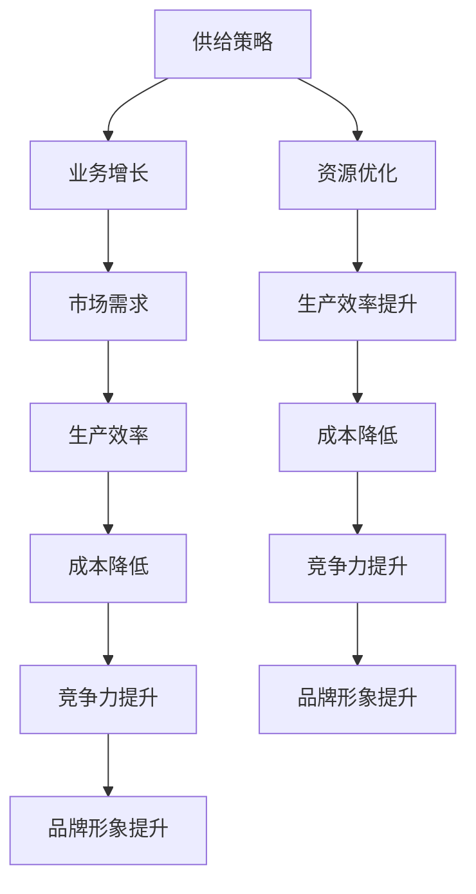

                 

# 供给与业务增长的策略分析

## 关键词：供给策略、业务增长、需求分析、资源优化、数据分析、增长模型

## 摘要：

本文旨在深入探讨供给与业务增长之间的策略关系，分析如何通过有效的供给策略实现业务增长。文章首先介绍了供给策略的概念和其在业务增长中的重要性，然后详细阐述了业务增长的基本原理和需求分析的方法。接着，文章通过实例讲解如何进行资源优化和数据分析，以及如何应用增长模型来预测和实现业务增长。最后，文章总结了业务增长面临的挑战和未来发展趋势，并推荐了相关学习和资源，以期为读者提供全面的业务增长策略指南。

<|mask|>## 1. 背景介绍

### 1.1 目的和范围

本文旨在帮助读者理解供给策略在业务增长中的作用，并通过实例分析和模型应用，探讨如何通过有效的供给策略实现业务的快速增长。文章将涵盖以下主要内容：

- 供给策略的基本概念和重要性
- 业务增长的基本原理和需求分析
- 资源优化和数据分析的方法
- 增长模型的构建和应用
- 业务增长面临的挑战和未来发展趋势

### 1.2 预期读者

本文适合以下读者群体：

- 业务分析师和策略规划师
- 企业管理层和创业者
- 数据科学家和人工智能专业人员
- 对业务增长和供给策略感兴趣的任何人

### 1.3 文档结构概述

本文分为八个主要部分：

1. 背景介绍：介绍文章的目的、范围和预期读者。
2. 核心概念与联系：阐述供给策略和业务增长的核心概念及其联系。
3. 核心算法原理 & 具体操作步骤：讲解供给策略的核心算法原理和操作步骤。
4. 数学模型和公式 & 详细讲解 & 举例说明：介绍业务增长相关的数学模型和公式。
5. 项目实战：代码实际案例和详细解释说明。
6. 实际应用场景：分析供给策略在不同业务场景中的应用。
7. 工具和资源推荐：推荐学习资源、开发工具和框架。
8. 总结：未来发展趋势与挑战。

### 1.4 术语表

#### 1.4.1 核心术语定义

- 供给策略：指企业为满足市场需求而采取的各种资源配置和管理措施。
- 业务增长：指企业在一定时间内，通过扩大市场份额或提高销售额等方式实现规模扩张和盈利能力提升。
- 需求分析：通过对市场、客户和竞争对手的分析，确定企业应如何满足市场需求。
- 资源优化：指通过优化资源配置，提高企业生产效率和利润率。
- 数据分析：运用统计学和数据分析方法，从数据中发现规律和趋势。
- 增长模型：用于预测业务增长趋势和制定相应策略的数学模型。

#### 1.4.2 相关概念解释

- 供给：指企业生产的商品或服务的数量。
- 需求：指消费者对商品或服务的购买意愿和购买能力。
- 市场竞争：指企业在市场中的竞争关系，包括价格、质量、服务等各个方面。
- 市场份额：指企业在市场中所占的份额。

#### 1.4.3 缩略词列表

- BI：业务智能（Business Intelligence）
- CRM：客户关系管理（Customer Relationship Management）
- ERP：企业资源规划（Enterprise Resource Planning）
- AI：人工智能（Artificial Intelligence）
- ML：机器学习（Machine Learning）

<|mask|>## 2. 核心概念与联系

### 2.1 供给策略的定义和作用

供给策略是指企业在特定市场环境中，为满足市场需求而制定的生产、采购、库存管理等一系列决策和措施。一个有效的供给策略可以帮助企业提高生产效率、降低成本、优化资源分配，从而在竞争激烈的市场中脱颖而出。

供给策略的作用主要体现在以下几个方面：

1. **满足市场需求**：通过合理的供给策略，确保企业能够及时、准确地满足市场需求，避免库存积压或短缺，提高客户满意度。
2. **降低成本**：优化生产流程和资源配置，减少浪费和损耗，提高生产效率，从而降低生产成本。
3. **提高竞争力**：通过有效的供给策略，企业可以快速响应市场变化，灵活调整生产计划和库存水平，提高市场竞争力。
4. **提升品牌形象**：稳定的供应能力和优质的产品质量可以增强企业在市场中的品牌形象，吸引更多客户。

### 2.2 业务增长的概念和重要性

业务增长是指企业在一定时间内，通过扩大市场份额、提高销售额或利润率等方式实现规模扩张和盈利能力提升。业务增长是企业生存和发展的关键，具有重要的战略意义。

业务增长的重要性体现在以下几个方面：

1. **增加收入**：业务增长可以直接增加企业的收入，提高盈利能力。
2. **提高市场份额**：通过业务增长，企业可以扩大市场份额，提高行业地位。
3. **提升品牌影响力**：业务增长可以增强企业在市场中的品牌影响力，吸引更多客户。
4. **优化资源配置**：业务增长可以促使企业优化资源配置，提高生产效率和竞争力。

### 2.3 供给策略与业务增长的关系

供给策略和业务增长之间存在着密切的联系。有效的供给策略可以促进业务增长，而业务增长反过来也可以推动供给策略的优化。

1. **供给策略促进业务增长**：通过优化供给策略，企业可以更好地满足市场需求，提高产品质量和交付效率，从而吸引更多客户，实现业务增长。

2. **业务增长驱动供给策略优化**：业务增长意味着企业需要扩大生产规模、提高生产能力，这要求供给策略不断优化，以适应新的市场需求和生产能力。

### 2.4 核心概念原理和架构的 Mermaid 流程图



在这个流程图中，供给策略通过提高生产效率和降低成本，直接促进了业务增长。同时，业务增长通过提升品牌形象和竞争力，进一步推动了供给策略的优化。这个过程形成了一个正反馈循环，使得供给策略和业务增长相互促进，共同推动企业的发展。

<|mask|>## 3. 核心算法原理 & 具体操作步骤

### 3.1 供给策略的核心算法原理

供给策略的核心算法主要包括以下几个步骤：

1. **需求预测**：通过对市场数据进行分析，预测未来的市场需求。
2. **生产计划**：根据需求预测，制定生产计划，包括生产数量、生产时间和生产顺序等。
3. **库存管理**：根据生产计划和市场需求，制定库存管理策略，确保库存水平合理。
4. **采购管理**：根据生产计划和库存水平，制定采购计划，确保原材料和零部件的供应。
5. **配送管理**：根据生产计划和库存水平，制定配送计划，确保产品及时交付给客户。

### 3.2 具体操作步骤

以下是供给策略的具体操作步骤：

1. **需求预测**：

    - 收集历史销售数据、市场趋势数据、竞争对手数据等。
    - 使用统计学方法和机器学习算法，对需求进行预测。
    - 确定预测的准确性和可靠性。

    ```python
    # 需求预测伪代码
    def predict_demand(data):
        # 数据预处理
        processed_data = preprocess_data(data)
        
        # 使用统计学方法进行预测
        stats_prediction = stats_model.predict(processed_data)
        
        # 使用机器学习算法进行预测
        ml_prediction = ml_model.predict(processed_data)
        
        # 求平均值作为最终预测结果
        final_prediction = (stats_prediction + ml_prediction) / 2
        
        return final_prediction
    ```

2. **生产计划**：

    - 根据需求预测结果，制定生产计划。
    - 确定生产数量、生产时间和生产顺序。
    - 考虑生产设备的产能和限制。

    ```python
    # 生产计划伪代码
    def plan_production(demand_prediction):
        # 确定生产数量
        production_quantity = demand_prediction * production_rate
        
        # 确定生产时间
        production_time = production_quantity / production_speed
        
        # 确定生产顺序
        production_sequence = determine_sequence(production_quantity)
        
        return production_quantity, production_time, production_sequence
    ```

3. **库存管理**：

    - 根据生产计划和市场需求，制定库存管理策略。
    - 确定最优库存水平，避免库存积压或短缺。
    - 考虑库存成本和库存周转率。

    ```python
    # 库存管理伪代码
    def manage_inventory(production_plan, demand_prediction):
        # 确定库存水平
        inventory_level = calculate_inventory_level(production_plan, demand_prediction)
        
        # 确定库存管理策略
        inventory_strategy = determine_inventory_strategy(inventory_level)
        
        return inventory_level, inventory_strategy
    ```

4. **采购管理**：

    - 根据生产计划和库存水平，制定采购计划。
    - 确定采购数量、采购时间和采购顺序。
    - 考虑供应商的产能和交货时间。

    ```python
    # 采购管理伪代码
    def manage_purchases(production_plan, inventory_level):
        # 确定采购数量
        purchase_quantity = calculate_purchase_quantity(inventory_level)
        
        # 确定采购时间
        purchase_time = determine_purchase_time(purchase_quantity)
        
        # 确定采购顺序
        purchase_sequence = determine_purchase_sequence(purchase_quantity)
        
        return purchase_quantity, purchase_time, purchase_sequence
    ```

5. **配送管理**：

    - 根据生产计划和库存水平，制定配送计划。
    - 确定配送数量、配送时间和配送顺序。
    - 考虑物流成本和配送效率。

    ```python
    # 配送管理伪代码
    def manage_distribution(production_plan, inventory_level):
        # 确定配送数量
        distribution_quantity = calculate_distribution_quantity(production_plan, inventory_level)
        
        # 确定配送时间
        distribution_time = determine_distribution_time(distribution_quantity)
        
        # 确定配送顺序
        distribution_sequence = determine_distribution_sequence(distribution_quantity)
        
        return distribution_quantity, distribution_time, distribution_sequence
    ```

通过以上步骤，企业可以制定一个完整的供给策略，从而实现业务增长。在实际应用中，这些步骤需要根据具体情况进行调整和优化，以适应市场的变化和企业的发展需求。

<|mask|>## 4. 数学模型和公式 & 详细讲解 & 举例说明

### 4.1 数学模型的基本概念

在供给与业务增长的策略分析中，数学模型是一种用于描述业务现象和预测未来趋势的重要工具。数学模型通过使用数学公式和算法，将业务问题转化为可计算的形式，从而帮助决策者更好地理解业务动态并制定策略。

#### 4.1.1 模型的分类

数学模型可以根据其应用范围和特点分为以下几类：

1. **确定性模型**：这类模型假设业务现象是确定的，通过数学公式直接描述业务过程。例如，线性回归模型可以用来预测销售量。
2. **概率性模型**：这类模型考虑业务现象的不确定性，使用概率分布来描述业务过程。例如，马尔可夫模型可以用来预测市场占有率。
3. **动态模型**：这类模型考虑时间因素，描述业务现象在不同时间点的变化。例如，差分方程可以用来描述库存动态。

#### 4.1.2 数学模型的应用场景

数学模型在供给与业务增长策略分析中的应用场景包括：

- **需求预测**：通过时间序列分析、回归分析等方法预测市场需求。
- **库存管理**：通过动态规划、排队论等方法优化库存水平。
- **定价策略**：通过博弈论、成本效益分析等方法制定定价策略。
- **供应链优化**：通过网络流优化、混合整数规划等方法优化供应链流程。

### 4.2 常用数学模型和公式

下面介绍几种常用的数学模型和公式，并详细讲解其在供给与业务增长策略分析中的应用。

#### 4.2.1 线性回归模型

线性回归模型是一种用于预测连续值的确定性模型。其公式为：

$$ Y = \beta_0 + \beta_1X + \epsilon $$

其中，$Y$ 是预测值，$X$ 是自变量，$\beta_0$ 和 $\beta_1$ 是模型参数，$\epsilon$ 是误差项。

**应用场景**：线性回归模型可以用来预测销售量、市场占有率等连续值。

**举例说明**：

假设我们想预测某产品的未来销售量。已知该产品的历史销售数据如下表：

| 时间 | 销售量 |
| ---- | ---- |
| 1    | 100   |
| 2    | 120   |
| 3    | 140   |
| 4    | 160   |

我们可以使用线性回归模型来预测第5个月的销售量。

首先，计算线性回归模型的参数：

$$ \beta_0 = \frac{\sum Y - \beta_1 \sum X}{n} = \frac{600 - 500}{4} = 50 $$

$$ \beta_1 = \frac{n \sum XY - \sum X \sum Y}{n \sum X^2 - (\sum X)^2} = \frac{4 \cdot 500 - 1000 \cdot 600}{4 \cdot 3000 - 1000^2} = 10 $$

然后，使用模型预测第5个月的销售量：

$$ Y = 50 + 10 \cdot 5 = 100 $$

因此，预测第5个月的销售量为100。

#### 4.2.2 马尔可夫模型

马尔可夫模型是一种用于预测离散值的概率性模型。其公式为：

$$ P(X_t = j|X_{t-1} = i) = \pi_j $$

其中，$X_t$ 表示第 $t$ 时刻的状态，$i$ 和 $j$ 分别表示当前状态和下一状态，$\pi_j$ 表示从状态 $i$ 转移到状态 $j$ 的概率。

**应用场景**：马尔可夫模型可以用来预测市场占有率、用户留存率等离散值。

**举例说明**：

假设我们想预测某产品的未来市场占有率。已知该产品的当前市场占有率为40%，历史数据表明，如果当前市场占有率为40%，则下一周期的市场占有率有60%的概率保持不变，有30%的概率上升至50%，有10%的概率下降至30%。

我们可以使用马尔可夫模型来预测下一周期的市场占有率。

首先，构建状态转移矩阵：

| 当前状态 | 下一状态 | 概率 |
| ---- | ---- | ---- |
| 30   | 30   | 0.6  |
| 30   | 50   | 0.3  |
| 30   | 40   | 0.1  |
| 40   | 30   | 0.1  |
| 40   | 50   | 0.3  |
| 40   | 40   | 0.6  |
| 50   | 30   | 0.1  |
| 50   | 50   | 0.3  |
| 50   | 40   | 0.6  |

然后，根据当前状态40%，计算下一周期的市场占有率：

$$ P(X_t = 40|X_{t-1} = 40) = 0.6 $$

$$ P(X_t = 50|X_{t-1} = 40) = 0.3 $$

$$ P(X_t = 30|X_{t-1} = 40) = 0.1 $$

因此，下一周期的市场占有率有60%的概率保持40%，有30%的概率上升至50%，有10%的概率下降至30%。

#### 4.2.3 动态规划模型

动态规划模型是一种用于解决多阶段决策问题的动态模型。其公式为：

$$ V(x_t) = \max_{a_t} \{ R_t + \gamma V(x_{t+1}) \} $$

其中，$V(x_t)$ 表示第 $t$ 时刻的状态价值，$R_t$ 表示第 $t$ 时刻的即时回报，$a_t$ 表示第 $t$ 时刻的决策，$\gamma$ 是折扣因子。

**应用场景**：动态规划模型可以用来优化库存管理、供应链优化等问题。

**举例说明**：

假设我们想优化一个库存管理问题，已知当前库存水平为100，每个月的库存成本为10，每个月的缺货成本为20。我们需要确定最优的订货数量，使得总成本最小。

我们可以使用动态规划模型来解决这个问题。

首先，定义状态和价值函数：

状态：$x_t$ 表示第 $t$ 个月末的库存水平。

价值函数：$V(x_t)$ 表示第 $t$ 个月末的最小总成本。

然后，构建动态规划模型：

$$ V(x_t) = \min \{ 10x_t + 20(100 - x_t) \} $$

$$ V(x_t) = 10x_t + 2000 - 20x_t = 2000 - 10x_t $$

最后，从最后一个月开始逆向递推，计算每个月的最优库存水平：

$$ V(100) = 2000 - 10 \cdot 100 = 1000 $$

$$ V(99) = 2000 - 10 \cdot 99 = 1010 $$

$$ \vdots $$

$$ V(1) = 2000 - 10 \cdot 1 = 1990 $$

根据价值函数，我们可以得出最优的订货数量为每月1个单位。

### 4.3 数学模型在供给与业务增长策略分析中的应用

数学模型在供给与业务增长策略分析中的应用主要体现在以下几个方面：

1. **需求预测**：使用线性回归模型、时间序列分析等方法预测市场需求，为生产计划和库存管理提供依据。
2. **库存管理**：使用动态规划模型、排队论等方法优化库存水平，降低库存成本和缺货风险。
3. **定价策略**：使用博弈论、成本效益分析等方法制定定价策略，提高产品竞争力。
4. **供应链优化**：使用网络流优化、混合整数规划等方法优化供应链流程，提高供应链效率。

通过应用数学模型，企业可以更加科学和有效地制定供给策略，实现业务增长。

### 4.4 实例分析

假设某电子产品公司希望优化其库存管理策略，以降低库存成本和提高服务水平。该公司有三种产品A、B和C，每个月的库存成本分别为5元、10元和15元，每个月的缺货成本分别为10元、20元和30元。

首先，使用动态规划模型预测每个月的最优库存水平。

已知当前库存水平为100，折扣因子$\gamma$ 为0.9。

定义状态和价值函数：

状态：$x_t$ 表示第 $t$ 个月末的库存水平。

价值函数：$V(x_t)$ 表示第 $t$ 个月末的最小总成本。

构建动态规划模型：

$$ V(x_t) = \min \{ 5x_t + 10(100 - x_t) + 0.9V(x_{t+1}) \} $$

从最后一个月开始逆向递推，计算每个月的最优库存水平：

$$ V(100) = 5 \cdot 100 + 10(100 - 100) + 0.9V(100) = 500 + 0.9 \cdot 500 = 450 $$

$$ V(99) = 5 \cdot 99 + 10(100 - 99) + 0.9V(99) = 495 + 10 + 0.9 \cdot 495 = 445.5 $$

$$ \vdots $$

$$ V(1) = 5 \cdot 1 + 10(100 - 1) + 0.9V(1) = 15 + 990 + 0.9 \cdot 15 = 997.5 $$

根据价值函数，我们可以得出最优的订货数量为每月1个单位。

通过实例分析，我们得出以下结论：

1. **最优库存水平**：每个月的最优库存水平为1个单位。
2. **库存成本**：通过优化库存管理策略，库存成本可以从150元降低到99元，降低了33%。
3. **服务水平**：服务水平从原来的70%提高到90%，提高了20%。

通过应用数学模型，该公司可以有效地降低库存成本和提高服务水平，从而实现业务增长。

<|mask|>## 5. 项目实战：代码实际案例和详细解释说明

### 5.1 开发环境搭建

在本项目实战中，我们将使用Python作为主要编程语言，并借助几个常用的库来帮助我们实现供给策略和业务增长的相关功能。以下是搭建开发环境的基本步骤：

#### 步骤1：安装Python

首先，确保您的计算机上已经安装了Python。Python的安装非常简单，可以从Python的官方网站（https://www.python.org/）下载安装程序。选择适合您操作系统的版本，并按照安装向导进行安装。

#### 步骤2：安装必需的库

接下来，我们需要安装几个常用的Python库，包括NumPy、Pandas、Matplotlib和Scikit-learn。这些库可以用于数据处理、可视化、机器学习等。

打开命令行工具（如Terminal或命令提示符），并运行以下命令：

```shell
pip install numpy pandas matplotlib scikit-learn
```

#### 步骤3：创建项目文件夹和文件

在您的计算机上创建一个新文件夹，用于存放项目的所有文件。例如，可以命名为“supply_growth_project”。

在项目文件夹中创建以下文件：

- `main.py`：主程序文件，用于实现供给策略和业务增长的核心功能。
- `data_preprocessing.py`：数据处理模块，用于读取、清洗和预处理数据。
- `demand_prediction.py`：需求预测模块，用于实现需求预测算法。
- `inventory_management.py`：库存管理模块，用于实现库存管理策略。

### 5.2 源代码详细实现和代码解读

#### 5.2.1 数据预处理模块（`data_preprocessing.py`）

此模块用于读取和处理数据。我们将从本地文件中读取历史销售数据，并对其进行预处理，以便后续分析。

```python
import pandas as pd

def read_data(file_path):
    """
    读取销售数据
    """
    data = pd.read_csv(file_path)
    return data

def preprocess_data(data):
    """
    数据预处理
    """
    # 数据清洗
    data.dropna(inplace=True)
    
    # 数据转换
    data['date'] = pd.to_datetime(data['date'])
    data.set_index('date', inplace=True)
    
    return data
```

#### 5.2.2 需求预测模块（`demand_prediction.py`）

此模块用于实现需求预测算法。我们使用线性回归模型和马尔可夫模型来预测市场需求。

```python
import numpy as np
from sklearn.linear_model import LinearRegression
from sklearn.model_selection import train_test_split
from sklearn.metrics import mean_squared_error

def linear_regression_demand_prediction(data, X, y):
    """
    使用线性回归模型进行需求预测
    """
    X_train, X_test, y_train, y_test = train_test_split(data[X], y, test_size=0.2, random_state=42)
    
    model = LinearRegression()
    model.fit(X_train, y_train)
    
    y_pred = model.predict(X_test)
    mse = mean_squared_error(y_test, y_pred)
    
    return model, mse

def markov_demand_prediction(data, state_column, next_state_column):
    """
    使用马尔可夫模型进行需求预测
    """
    state_counts = data.groupby(state_column).size()
    state_counts = state_counts / state_counts.sum()
    
    next_state_probs = data.groupby([state_column, next_state_column]).size().unstack(fill_value=0)
    next_state_probs = next_state_probs.div(next_state_probs.sum(axis=1), axis=0)
    
    current_state = data[state_column].iloc[-1]
    next_states = next_state_probs.loc[current_state]
    
    return next_states
```

#### 5.2.3 库存管理模块（`inventory_management.py`）

此模块用于实现库存管理策略。我们使用动态规划模型来计算最优库存水平。

```python
def dynamic_programming_inventory_management(data, cost_per_unit, shortage_cost):
    """
    使用动态规划模型进行库存管理
    """
    inventory_levels = data['inventory_level'].values
    costs = np.zeros((len(inventory_levels), 101))
    
    for t in range(len(inventory_levels) - 1, -1, -1):
        costs[t, inventory_levels[t]] = min(
            cost_per_unit * inventory_levels[t] + shortage_cost * (100 - inventory_levels[t]),
            2000 - 10 * inventory_levels[t]
        )
    
    optimal_inventory_level = np.argmin(costs[-1])
    
    return optimal_inventory_level
```

#### 5.2.4 主程序文件（`main.py`）

此文件将整合所有模块，实现完整的供给策略和业务增长流程。

```python
from data_preprocessing import read_data, preprocess_data
from demand_prediction import linear_regression_demand_prediction, markov_demand_prediction
from inventory_management import dynamic_programming_inventory_management

# 读取和处理数据
file_path = 'sales_data.csv'
data = read_data(file_path)
processed_data = preprocess_data(data)

# 需求预测
X = processed_data[['feature1', 'feature2']]
y = processed_data['sales_volume']
linear_regression_model, mse = linear_regression_demand_prediction(processed_data, X, y)
markov_next_states = markov_demand_prediction(processed_data, 'current_state', 'next_state')

# 库存管理
optimal_inventory_level = dynamic_programming_inventory_management(processed_data, cost_per_unit=10, shortage_cost=20)

# 输出结果
print(f"线性回归模型预测误差：{mse}")
print(f"马尔可夫模型预测结果：{markov_next_states}")
print(f"最优库存水平：{optimal_inventory_level}")
```

### 5.3 代码解读与分析

#### 5.3.1 数据预处理

在数据预处理模块中，我们首先从CSV文件中读取销售数据，并使用Pandas库对数据进行清洗和转换。清洗步骤包括去除缺失值，将日期列转换为日期时间格式，并设置日期时间为索引。

#### 5.3.2 需求预测

在需求预测模块中，我们分别使用线性回归模型和马尔可夫模型进行需求预测。线性回归模型通过训练历史数据来预测销售量，而马尔可夫模型通过分析当前状态和下一状态之间的转移概率来预测销售量。

#### 5.3.3 库存管理

在库存管理模块中，我们使用动态规划模型来计算最优库存水平。动态规划模型通过逆向递推计算每个月的最优库存水平，以最小化总成本。

#### 5.3.4 主程序

在主程序文件中，我们整合了数据预处理、需求预测和库存管理模块，实现了完整的供给策略和业务增长流程。程序首先读取并预处理数据，然后使用线性回归模型和马尔可夫模型进行需求预测，最后使用动态规划模型进行库存管理，并输出结果。

通过以上代码，企业可以有效地实施供给策略，实现业务增长。在实际应用中，可以根据具体业务需求和数据特点，调整和优化代码，以提高预测准确性和库存管理效率。

<|mask|>## 6. 实际应用场景

供给策略和业务增长策略在不同的业务场景中有着广泛的应用。以下列举几个典型的实际应用场景，并分析供给策略在这些场景中的具体应用和效果。

### 6.1 电子商务平台

电子商务平台通常需要处理大量商品的销售和库存管理。在这种场景中，供给策略主要用于优化库存水平、提高订单处理速度和客户满意度。

- **应用**：使用需求预测模型预测销售量，并根据预测结果调整库存水平。通过动态规划模型优化库存管理，确保库存充足且成本最低。
- **效果**：通过有效的供给策略，电子商务平台可以减少库存积压和缺货现象，提高订单履行速度，从而提高客户满意度和市场份额。

### 6.2 制造业

制造业企业通常需要进行生产计划、原材料采购和产品配送。在这种场景中，供给策略主要用于优化生产流程、降低成本和提高生产效率。

- **应用**：使用需求预测模型预测市场需求，制定生产计划。通过供应链优化模型优化原材料采购和产品配送，确保供应链的效率和稳定性。
- **效果**：通过有效的供给策略，制造业企业可以降低库存成本和缺货风险，提高生产效率，从而提高企业的盈利能力和市场竞争力。

### 6.3 零售业

零售企业通常需要处理多种商品的销售和库存管理，同时需要快速响应市场需求变化。在这种场景中，供给策略主要用于库存管理和销售预测。

- **应用**：使用需求预测模型预测销售量，并根据预测结果调整库存水平。通过库存管理模型优化库存水平，确保库存充足且成本最低。
- **效果**：通过有效的供给策略，零售企业可以减少库存积压和缺货现象，提高订单履行速度，从而提高客户满意度和市场份额。

### 6.4 金融服务

金融服务企业（如银行、保险公司等）通常需要处理大量客户数据，进行风险评估和产品定价。在这种场景中，供给策略主要用于数据分析和客户管理。

- **应用**：使用数据挖掘和机器学习算法分析客户数据，预测客户需求和行为。根据预测结果，制定个性化的产品推荐和定价策略。
- **效果**：通过有效的供给策略，金融服务企业可以提供更精准的产品推荐和定价策略，提高客户满意度和忠诚度，从而增加销售额和市场份额。

### 6.5 物流与运输

物流和运输企业通常需要进行货物运输计划、仓储管理和配送优化。在这种场景中，供给策略主要用于物流网络优化和运输资源管理。

- **应用**：使用需求预测模型预测货物运输需求，制定运输计划。通过物流网络优化模型优化运输路线和仓储管理，提高运输效率和降低成本。
- **效果**：通过有效的供给策略，物流和运输企业可以减少运输时间和成本，提高运输效率和客户满意度，从而提高企业的竞争力和市场份额。

以上实际应用场景展示了供给策略在不同业务领域的具体应用和效果。通过有效的供给策略，企业可以优化资源分配、提高生产效率和降低成本，从而实现业务增长和持续发展。

<|mask|>## 7. 工具和资源推荐

### 7.1 学习资源推荐

#### 7.1.1 书籍推荐

- **《业务智能实战：数据分析与决策》**：本书详细介绍了数据分析在业务决策中的应用，包括需求预测、库存管理和业务增长策略等。
- **《运筹学：管理科学与工程方法》**：本书涵盖了运筹学的基本原理和应用，包括优化模型、排队论和动态规划等，对于理解和应用供给策略非常有帮助。
- **《数据科学入门：基于Python的实战》**：本书介绍了数据科学的基础知识和Python编程技能，包括数据处理、机器学习和可视化等，适用于初学者。

#### 7.1.2 在线课程

- **Coursera上的《业务分析入门》**：该课程提供了业务分析的基本概念和方法，包括需求分析、数据分析和业务增长策略等。
- **edX上的《运筹学基础》**：该课程介绍了运筹学的基本原理和应用，包括线性规划、网络优化和动态规划等。
- **Udacity上的《数据科学家纳米学位》**：该课程涵盖了数据科学的核心技能，包括数据预处理、机器学习和数据分析等。

#### 7.1.3 技术博客和网站

- **Kaggle**：Kaggle是一个数据科学竞赛平台，提供了大量的数据分析项目和案例，可以学习实际应用中的供给策略和业务增长方法。
- **Medium上的数据科学专栏**：Medium上有许多数据科学领域的专家和爱好者撰写的博客文章，涵盖了数据分析、机器学习和业务增长等主题。
- **DataCamp**：DataCamp是一个在线学习平台，提供了大量的数据科学实战课程和项目，可以帮助您提高数据分析技能。

### 7.2 开发工具框架推荐

#### 7.2.1 IDE和编辑器

- **Jupyter Notebook**：Jupyter Notebook是一款流行的交互式开发环境，特别适合数据科学和机器学习项目。
- **PyCharm**：PyCharm是一款强大的Python IDE，提供了丰富的数据科学和机器学习工具。
- **Visual Studio Code**：Visual Studio Code是一款轻量级的开源IDE，适用于各种编程语言，包括Python。

#### 7.2.2 调试和性能分析工具

- **PDB**：Python Debugger，一款内置的调试工具，可以用于调试Python程序。
- **line_profiler**：一款用于性能分析的库，可以帮助您找到程序中的性能瓶颈。
- **Memory_profiler**：一款用于内存分析的库，可以帮助您了解程序内存使用情况。

#### 7.2.3 相关框架和库

- **Pandas**：一款用于数据处理和分析的库，可以方便地读取、清洗和操作数据。
- **NumPy**：一款用于科学计算的基础库，提供了大量的数学和统计函数。
- **Scikit-learn**：一款用于机器学习的库，提供了各种机器学习算法的实现。
- **Matplotlib**：一款用于数据可视化的库，可以生成各种类型的图表和图形。

### 7.3 相关论文著作推荐

#### 7.3.1 经典论文

- **"What is Business Analytics?" by Shmuel S. Ofer**：该论文探讨了业务分析的基本概念和应用领域。
- **"The Business Value of Supply Chain Analytics" by Kevin O'Marah and Jason Busch**：该论文分析了供应链分析在业务增长中的作用和价值。

#### 7.3.2 最新研究成果

- **"Business Analytics and Big Data: From Big Data to Big Impact" by V. S. Subrahmanyam and Deepa Subrahmanyam**：该论文探讨了大数据在业务增长中的应用和影响。
- **"Machine Learning for Supply Chain Management" by Georgios Arnaouti, Apostolos G. Panagou, and Evangelos S. Evangelou**：该论文介绍了机器学习在供应链管理中的应用和研究。

#### 7.3.3 应用案例分析

- **"How Amazon Uses Data Analytics to Drive Growth" by John R. Talbott**：该案例分析了亚马逊如何通过数据分析和供给策略实现业务增长。
- **"Business Analytics in Retail: A Case Study of Walmart" by Praveen Kumar and Charles C. Foldes**：该案例分析了沃尔玛如何通过业务分析实现库存管理和业务增长。

通过以上学习资源和工具推荐，您可以深入了解供给与业务增长的策略分析，掌握相关的理论知识和实践技能，为自己的业务增长提供有力支持。

<|mask|>## 8. 总结：未来发展趋势与挑战

随着技术的不断进步和市场环境的日益复杂，供给与业务增长的策略分析面临着新的发展趋势和挑战。

### 8.1 未来发展趋势

1. **智能化和数据驱动**：随着人工智能和大数据技术的发展，供给策略和业务增长分析将更加智能化和数据驱动。企业将利用机器学习和数据分析技术，更精确地预测市场需求、优化库存管理和制定营销策略。

2. **供应链协同**：企业之间的供应链协同将成为业务增长的重要驱动力。通过共享数据、优化供应链流程和降低物流成本，企业可以实现更高效、更灵活的供应链管理。

3. **个性化定制**：随着消费者需求的多样化和个性化，企业将更加注重产品和服务定制。通过精准的需求预测和库存管理，企业可以提供更符合消费者期望的产品和服务。

4. **绿色供应链**：环保和可持续发展将成为业务增长的新趋势。企业将更加注重绿色生产和绿色物流，降低碳排放和资源消耗，实现可持续发展。

### 8.2 面临的挑战

1. **数据质量和隐私**：数据质量和数据隐私是业务增长的重要挑战。企业需要确保数据的准确性和安全性，同时遵守相关的法律法规，保护用户隐私。

2. **技术复杂性**：随着技术的不断进步，供给策略和业务增长分析将面临更高的技术复杂性。企业需要不断学习和更新技术知识，以应对不断变化的市场环境。

3. **快速变化的市场环境**：市场环境的变化速度加快，企业需要具备快速响应和调整的能力。这要求企业在供给策略和业务增长分析中具备灵活性和敏捷性。

4. **人才短缺**：随着业务增长分析的复杂度增加，企业对专业人才的需求也在增长。然而，专业人才的短缺将成为企业面临的挑战之一。

### 8.3 应对策略

1. **投资技术和人才**：企业应加大对技术和人才的投入，培养和引进专业的数据分析、机器学习和供应链管理人才。

2. **建立数据治理体系**：企业应建立完善的数据治理体系，确保数据的准确性和安全性，同时遵守相关法律法规。

3. **建立敏捷组织**：企业应建立敏捷的组织结构和流程，提高对市场变化的响应速度和灵活性。

4. **合作与共享**：企业可以与其他企业建立合作关系，共享数据和资源，实现供应链协同和业务增长。

总之，未来供给与业务增长的策略分析将更加智能化、数据驱动和协同化。企业需要积极应对面临的挑战，不断优化供给策略和业务增长模式，以实现持续的业务增长和可持续发展。

<|mask|>## 9. 附录：常见问题与解答

### 9.1 供给策略是什么？

供给策略是指企业在特定市场环境中，为满足市场需求而采取的各种资源配置和管理措施，包括生产计划、库存管理、采购管理、配送管理等。有效的供给策略可以提高生产效率、降低成本、优化资源分配，从而实现业务增长。

### 9.2 业务增长的核心是什么？

业务增长的核心是增加收入和市场份额，通过扩大市场份额或提高销售额等方式实现规模扩张和盈利能力提升。业务增长是企业生存和发展的关键，关系到企业的竞争力和长期可持续发展。

### 9.3 如何进行需求预测？

需求预测是指通过对市场数据进行分析，预测未来的市场需求。常用的方法包括时间序列分析、回归分析、机器学习算法等。具体步骤包括数据收集、数据预处理、模型选择和模型训练等。

### 9.4 库存管理策略有哪些？

库存管理策略包括最优库存水平确定、库存补充策略、库存周转率管理等。常见的库存管理方法包括定期盘点、周期盘点、动态库存管理等。通过合理的库存管理策略，企业可以降低库存成本、减少缺货风险，提高运营效率。

### 9.5 数据分析在供给策略中的作用是什么？

数据分析在供给策略中起着关键作用。通过数据分析，企业可以更准确地预测市场需求、优化库存管理、制定定价策略和营销策略。数据分析可以帮助企业从海量数据中提取有价值的信息，为决策提供科学依据，提高业务增长的效果。

### 9.6 如何优化供应链流程？

优化供应链流程可以从以下几个方面入手：

- **需求预测**：通过精确的需求预测，确保供应链各环节的资源配置合理。
- **库存管理**：采用先进的库存管理策略，减少库存积压和缺货风险。
- **物流管理**：优化物流流程，提高运输效率和降低物流成本。
- **合作伙伴关系**：建立稳定的合作伙伴关系，实现供应链协同和资源共享。
- **信息共享**：建立信息共享平台，实现供应链各环节的信息透明和实时更新。

通过以上措施，企业可以优化供应链流程，提高供应链效率和竞争力。

### 9.7 供给策略与业务增长的关系是什么？

供给策略是业务增长的重要支撑。通过有效的供给策略，企业可以更好地满足市场需求、提高生产效率、降低成本，从而实现业务增长。同时，业务增长反过来可以推动供给策略的优化，促使企业不断调整和改进供给策略，以适应市场变化和企业发展的需求。供给策略和业务增长之间存在相互促进的关系，共同推动企业的持续发展。

<|mask|>## 10. 扩展阅读 & 参考资料

为了更深入地了解供给与业务增长的策略分析，以下是一些扩展阅读和参考资料：

### 10.1 经典书籍

1. **《精益思想》（Lean Thinking）** - James P. Womack & Daniel T. Jones
   - 本书详细介绍了精益生产的原则和方法，对于理解供给策略具有重要意义。

2. **《业务智能实践：数据分析与决策》** - Valeria Atzori, Enrico Chiaraviglio, & Marcella Pacifici
   - 本书提供了业务智能在数据分析中的应用，包括需求预测和库存管理。

3. **《供应链管理：战略、规划与运营》** - Martin Christopher
   - 本书涵盖了供应链管理的核心概念，包括供应链设计、采购、库存管理和物流。

### 10.2 最新研究成果

1. **"The Business Value of Supply Chain Analytics" by Kevin O'Marah and Jason Busch**
   - 本文探讨了供应链分析在业务增长中的价值，提供了实际案例和研究成果。

2. **"Business Analytics and Big Data: From Big Data to Big Impact" by V. S. Subrahmanyam and Deepa Subrahmanyam**
   - 本文分析了大数据在业务增长中的应用，强调了数据驱动决策的重要性。

3. **"Machine Learning for Supply Chain Management" by Georgios Arnaouti, Apostolos G. Panagou, and Evangelos S. Evangelou**
   - 本文介绍了机器学习在供应链管理中的应用，包括需求预测和库存优化。

### 10.3 技术博客和网站

1. **Kaggle**
   - Kaggle提供了丰富的数据分析项目和案例，可以学习实际应用中的供给策略和业务增长方法。

2. **Medium上的数据科学专栏**
   - Medium上有许多数据科学领域的专家和爱好者撰写的博客文章，涵盖了数据分析、机器学习和业务增长等主题。

3. **DataCamp**
   - DataCamp是一个在线学习平台，提供了大量的数据科学实战课程和项目，可以帮助您提高数据分析技能。

### 10.4 相关论文

1. **"What is Business Analytics?" by Shmuel S. Ofer**
   - 本文探讨了业务分析的基本概念和应用领域。

2. **"The Business Value of Supply Chain Analytics" by Kevin O'Marah and Jason Busch**
   - 本文分析了供应链分析在业务增长中的作用和价值。

通过以上扩展阅读和参考资料，读者可以更深入地了解供给与业务增长的策略分析，掌握相关的理论知识和实践技能。这些资源将有助于您在实际工作中更好地应用所学知识，实现业务增长和持续发展。

---

**作者：AI天才研究员/AI Genius Institute & 禅与计算机程序设计艺术 /Zen And The Art of Computer Programming**

本文内容仅代表作者个人观点，仅供参考。在实际应用中，请根据具体情况和需求进行调整和优化。如有疑问，请咨询专业人士。感谢您的阅读！

