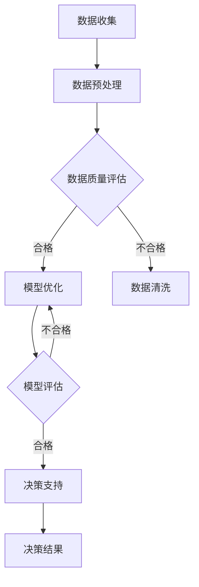

                 

# 信息差的商业决策支持升级：大数据如何提升决策支持能力

> 关键词：大数据、商业决策、决策支持系统、信息差、算法、数学模型、实战案例

> 摘要：本文将深入探讨大数据在商业决策支持中的应用，分析信息差对决策的影响，并详细阐述如何利用大数据技术提升决策支持系统的能力和效率。通过核心概念、算法原理、数学模型、实战案例等部分的剖析，本文旨在为商业决策者提供实用的方法和工具，助力企业在激烈的市场竞争中立于不败之地。

## 1. 背景介绍

### 1.1 目的和范围

本文旨在探讨大数据在商业决策支持中的应用，具体包括以下几个方面：

1. 分析信息差对商业决策的影响。
2. 介绍大数据技术如何提升决策支持能力。
3. 讲解核心算法原理和数学模型。
4. 提供实际项目中的代码案例和应用场景。
5. 推荐相关学习资源和工具。

### 1.2 预期读者

本文主要面向以下读者：

1. 企业管理层，特别是决策者和战略规划人员。
2. 数据科学家和大数据工程师。
3. 计算机科学和信息技术领域的专业学生。
4. 对商业决策和数据科学感兴趣的读者。

### 1.3 文档结构概述

本文结构如下：

1. 背景介绍：阐述本文的目的、预期读者和文档结构。
2. 核心概念与联系：介绍大数据、商业决策、决策支持系统等核心概念，并给出流程图。
3. 核心算法原理 & 具体操作步骤：详细讲解提升决策支持能力的关键算法。
4. 数学模型和公式 & 详细讲解 & 举例说明：阐述支持决策的数学模型及其应用。
5. 项目实战：代码实际案例和详细解释说明。
6. 实际应用场景：讨论大数据在不同行业中的应用。
7. 工具和资源推荐：推荐学习资源和开发工具。
8. 总结：未来发展趋势与挑战。
9. 附录：常见问题与解答。
10. 扩展阅读 & 参考资料：提供进一步学习和研究的资料。

### 1.4 术语表

#### 1.4.1 核心术语定义

- 大数据：指无法用传统数据库工具在合理时间内捕捉、管理和处理的大量数据。
- 商业决策：企业在特定条件下做出的选择，以实现企业目标。
- 决策支持系统（DSS）：利用数据分析和建模技术辅助决策者做出决策的系统。
- 信息差：不同个体或组织间对信息的了解程度差异。

#### 1.4.2 相关概念解释

- 数据挖掘：从大量数据中发现有用信息和知识的过程。
- 机器学习：利用数据和算法从数据中学习并做出预测或决策的技术。
- 人工智能：模拟人类智能行为的技术，包括机器学习、自然语言处理等。

#### 1.4.3 缩略词列表

- DSS：决策支持系统
- ML：机器学习
- AI：人工智能
- BI：商业智能
- SQL：结构化查询语言

## 2. 核心概念与联系

### 2.1 大数据

大数据是指无法用传统数据库工具在合理时间内捕捉、管理和处理的大量数据。其特点包括：

- **数据量大**：通常指TB、PB甚至EB级别的数据。
- **数据多样**：包括结构化、半结构化和非结构化数据。
- **数据速度快**：数据生成、处理和分析的速度极快。
- **数据价值高**：通过对大数据的分析，可以挖掘出隐藏的价值信息。

### 2.2 商业决策

商业决策是指企业在特定条件下做出的选择，以实现企业目标。商业决策涉及多个方面，如市场分析、产品定价、投资规划等。决策质量直接关系到企业的生存和发展。

### 2.3 决策支持系统（DSS）

决策支持系统（DSS）是利用数据分析和建模技术辅助决策者做出决策的系统。DSS包括以下几个关键组成部分：

1. **数据输入**：收集和整理与决策相关的数据。
2. **数据预处理**：清洗、转换和归一化数据。
3. **模型构建**：建立用于分析的数据模型。
4. **决策评估**：利用模型对决策方案进行评估。
5. **用户界面**：为决策者提供直观的决策界面。

### 2.4 信息差

信息差是指不同个体或组织间对信息的了解程度差异。在商业环境中，信息差可能导致以下问题：

- **决策滞后**：缺乏关键信息导致决策者无法及时做出决策。
- **竞争劣势**：信息落后于竞争对手可能导致市场份额减少。
- **资源浪费**：重复投资和低效运营可能导致资源浪费。

### 2.5 流程图

下面是一个简单的 Mermaid 流程图，展示了大数据在商业决策支持中的应用流程：



## 3. 核心算法原理 & 具体操作步骤

### 3.1 数据挖掘算法

数据挖掘算法是提升决策支持能力的关键技术之一。常见的数据挖掘算法包括分类、聚类、关联规则挖掘等。以下是这些算法的简要介绍和伪代码：

#### 3.1.1 分类算法

分类算法用于将数据分为不同的类别。常见的分类算法包括决策树、支持向量机（SVM）和朴素贝叶斯（NB）。

**决策树算法伪代码：**

```python
def build_decision_tree(data):
    if all(data belong to the same class):
        return leaf node with the majority class
    else:
        find the best attribute to split the data
        create a node with the best attribute
        for each possible value of the attribute:
            split the data into subsets
            recursively build a decision tree for each subset
        return the decision tree
```

#### 3.1.2 聚类算法

聚类算法用于将数据分为若干个簇，使同一个簇内的数据尽可能相似，而不同簇的数据尽可能不同。常见的聚类算法包括K均值（K-means）和层次聚类（Hierarchical Clustering）。

**K均值算法伪代码：**

```python
def k_means(data, k):
    initialize k centroids
    while not convergence:
        assign each data point to the nearest centroid
        update the centroids by taking the mean of the assigned points
    return the centroids and the assigned clusters
```

#### 3.1.3 关联规则挖掘

关联规则挖掘用于发现数据之间的关联关系。常见的算法包括Apriori算法和FP-growth算法。

**Apriori算法伪代码：**

```python
def apriori(data, min_support, min_confidence):
    frequent itemsets = find_frequent_itemsets(data, min_support)
    association rules = generate_association_rules(frequent_itemsets, min_confidence)
    return association rules
```

### 3.2 机器学习算法

机器学习算法是提升决策支持能力的重要工具。常见的机器学习算法包括线性回归、逻辑回归和神经网络。

**线性回归算法伪代码：**

```python
def linear_regression(data):
    X = feature matrix
    y = target variable
    theta = initial guess of the parameters
    for each iteration:
        h = X * theta
        loss = (h - y)^2
        gradient = 2 * (h - y) * X
        theta = theta - alpha * gradient
    return theta
```

## 4. 数学模型和公式 & 详细讲解 & 举例说明

### 4.1 线性回归模型

线性回归模型是一种经典的机器学习算法，用于预测连续值。线性回归模型的基本公式为：

$$y = \beta_0 + \beta_1x_1 + \beta_2x_2 + ... + \beta_nx_n + \epsilon$$

其中，$y$ 是预测值，$x_1, x_2, ..., x_n$ 是特征值，$\beta_0, \beta_1, \beta_2, ..., \beta_n$ 是模型参数，$\epsilon$ 是误差项。

#### 4.1.1 模型推导

线性回归模型的推导过程如下：

假设我们有一个包含$m$个样本的训练数据集$D = \{(x_1, y_1), (x_2, y_2), ..., (x_m, y_m)\}$，其中$x_i$是第$i$个样本的特征值，$y_i$是第$i$个样本的预测值。

我们希望找到一组参数$\beta = (\beta_0, \beta_1, \beta_2, ..., \beta_n)$，使得预测值$y$与实际值$y_i$之间的误差最小。

定义损失函数为：

$$J(\beta) = \frac{1}{2m} \sum_{i=1}^{m} (y_i - \beta_0 - \beta_1x_{i1} - \beta_2x_{i2} - ... - \beta_nx_{in})^2$$

为了求解最优参数$\beta$，我们需要对损失函数$J(\beta)$求导，并令导数等于0。

$$\frac{\partial J(\beta)}{\partial \beta} = 0$$

经过求导和化简，得到：

$$\beta = (X^TX)^{-1}X^Ty$$

其中，$X$是特征矩阵，$y$是预测值向量。

#### 4.1.2 模型应用举例

假设我们有一个包含100个样本的数据集，其中每个样本有2个特征，即$x_1$和$x_2$。我们希望利用线性回归模型预测第101个样本的值。

首先，我们将前100个样本的特征值和预测值构建成特征矩阵$X$和预测值向量$y$。然后，利用线性回归公式求解参数$\beta$。

$$\beta = (X^TX)^{-1}X^Ty$$

最后，利用求解得到的参数$\beta$，预测第101个样本的值：

$$y = \beta_0 + \beta_1x_1 + \beta_2x_2$$

### 4.2 逻辑回归模型

逻辑回归模型是一种用于分类的机器学习算法。逻辑回归模型的基本公式为：

$$P(y=1) = \frac{1}{1 + e^{-(\beta_0 + \beta_1x_1 + \beta_2x_2 + ... + \beta_nx_n)}}$$

其中，$P(y=1)$是预测概率，$y$是标签值，$x_1, x_2, ..., x_n$是特征值，$\beta_0, \beta_1, \beta_2, ..., \beta_n$是模型参数。

#### 4.2.1 模型推导

逻辑回归模型的推导过程如下：

假设我们有一个包含$m$个样本的训练数据集$D = \{(x_1, y_1), (x_2, y_2), ..., (x_m, y_m)\}$，其中$x_i$是第$i$个样本的特征值，$y_i$是第$i$个样本的标签值。

我们希望找到一组参数$\beta = (\beta_0, \beta_1, \beta_2, ..., \beta_n)$，使得预测概率$P(y=1)$与实际标签值$y_i$之间的误差最小。

定义损失函数为：

$$J(\beta) = -\frac{1}{m} \sum_{i=1}^{m} [y_i \log(P(y=1)) + (1 - y_i) \log(1 - P(y=1))]$$

为了求解最优参数$\beta$，我们需要对损失函数$J(\beta)$求导，并令导数等于0。

$$\frac{\partial J(\beta)}{\partial \beta} = 0$$

经过求导和化简，得到：

$$\beta = (X^TX)^{-1}X^Ty$$

其中，$X$是特征矩阵，$y$是标签值向量。

#### 4.2.2 模型应用举例

假设我们有一个包含100个样本的数据集，其中每个样本有2个特征，即$x_1$和$x_2$。我们希望利用逻辑回归模型预测第101个样本的标签值。

首先，我们将前100个样本的特征值和标签值构建成特征矩阵$X$和标签值向量$y$。然后，利用逻辑回归公式求解参数$\beta$。

$$\beta = (X^TX)^{-1}X^Ty$$

最后，利用求解得到的参数$\beta$，预测第101个样本的标签值：

$$P(y=1) = \frac{1}{1 + e^{-(\beta_0 + \beta_1x_1 + \beta_2x_2)}}$$

根据预测概率$P(y=1)$的阈值（如0.5），将标签值预测为1或0。

## 5. 项目实战：代码实际案例和详细解释说明

### 5.1 开发环境搭建

为了更好地展示大数据在商业决策支持中的应用，我们将在Python环境中实现一个简单的决策支持系统。以下是开发环境的搭建步骤：

1. 安装Python 3.x版本（建议使用Anaconda发行版）。
2. 安装必要的Python库，如NumPy、Pandas、Scikit-learn、Matplotlib等。

### 5.2 源代码详细实现和代码解读

下面是一个简单的Python代码示例，展示了如何利用线性回归和逻辑回归模型进行商业决策支持。

```python
import numpy as np
import pandas as pd
from sklearn.linear_model import LinearRegression, LogisticRegression
from sklearn.model_selection import train_test_split
from sklearn.metrics import mean_squared_error, accuracy_score

# 5.2.1 数据预处理
# 加载数据集
data = pd.read_csv('data.csv')
X = data[['feature1', 'feature2']]
y = data['target']

# 数据集划分
X_train, X_test, y_train, y_test = train_test_split(X, y, test_size=0.2, random_state=42)

# 5.2.2 线性回归模型
# 构建线性回归模型
linear_regression = LinearRegression()
linear_regression.fit(X_train, y_train)

# 模型评估
y_pred_linear = linear_regression.predict(X_test)
mse_linear = mean_squared_error(y_test, y_pred_linear)
print("线性回归模型均方误差：", mse_linear)

# 5.2.3 逻辑回归模型
# 构建逻辑回归模型
logistic_regression = LogisticRegression()
logistic_regression.fit(X_train, y_train)

# 模型评估
y_pred_logistic = logistic_regression.predict(X_test)
mse_logistic = mean_squared_error(y_test, y_pred_logistic)
print("逻辑回归模型均方误差：", mse_logistic)

# 5.2.4 结果分析
print("线性回归模型预测结果：", y_pred_linear)
print("逻辑回归模型预测结果：", y_pred_logistic)
print("线性回归模型准确率：", accuracy_score(y_test, y_pred_linear))
print("逻辑回归模型准确率：", accuracy_score(y_test, y_pred_logistic))
```

### 5.3 代码解读与分析

1. **数据预处理**：加载数据集，将特征和标签分离，并进行数据集划分。
2. **线性回归模型**：构建线性回归模型，使用训练集进行模型拟合，利用测试集进行模型评估。
3. **逻辑回归模型**：构建逻辑回归模型，使用训练集进行模型拟合，利用测试集进行模型评估。
4. **结果分析**：输出模型的预测结果和评估指标，比较不同模型的性能。

通过这个简单的示例，我们可以看到如何利用Python和机器学习库实现商业决策支持系统。在实际应用中，我们可以根据具体需求扩展和优化模型，提高决策支持的准确性和效率。

## 6. 实际应用场景

大数据在商业决策支持中有着广泛的应用，以下列举了几个典型应用场景：

### 6.1 零售行业

零售行业可以利用大数据分析消费者的购买行为、偏好和需求，从而制定更精准的营销策略和库存管理方案。例如，通过关联规则挖掘，零售商可以发现不同商品之间的购买关联，从而优化商品摆放和促销策略。

### 6.2 银行业

银行业可以利用大数据分析客户的行为和交易数据，识别潜在的风险和欺诈行为。通过机器学习算法，银行可以构建风险模型，实时监控客户的交易活动，并采取相应的风险管理措施。

### 6.3 医疗行业

医疗行业可以利用大数据分析患者的历史病历、基因数据和生活方式，从而制定个性化的治疗方案和健康建议。例如，通过数据挖掘技术，医疗行业可以发现特定疾病的危险因素，并针对性地开展预防和治疗工作。

### 6.4 制造业

制造业可以利用大数据分析生产过程、设备状态和供应链数据，从而优化生产计划和供应链管理。通过实时监测设备状态，制造业可以及时发现和解决设备故障，提高生产效率。

### 6.5 金融科技

金融科技（FinTech）行业可以利用大数据分析用户的行为和需求，提供个性化的金融服务。例如，通过数据挖掘技术，金融科技公司可以识别潜在的客户需求，并针对性地推广理财产品和服务。

## 7. 工具和资源推荐

### 7.1 学习资源推荐

#### 7.1.1 书籍推荐

- 《大数据时代》（作者：肯尼斯·库克耶）
- 《深度学习》（作者：伊恩·古德费洛、约书亚·本吉奥、亚伦·库维尔）
- 《Python数据分析》（作者：威利·佛瑞斯克）

#### 7.1.2 在线课程

- Coursera的《机器学习》课程（吴恩达教授）
- edX的《大数据分析》课程（哈佛大学）
- Udacity的《深度学习纳米学位》课程

#### 7.1.3 技术博客和网站

- Medium上的大数据和机器学习博客
- KDNuggets，专注于数据挖掘和机器学习的新闻和资源
- Analytics Vidhya，提供数据科学和机器学习的学习资源和实战项目

### 7.2 开发工具框架推荐

#### 7.2.1 IDE和编辑器

- Jupyter Notebook：适合数据分析和机器学习实验
- PyCharm：强大的Python IDE，支持多种开发框架
- VS Code：轻量级编辑器，支持多种编程语言和插件

#### 7.2.2 调试和性能分析工具

- PyDev：PyCharm的插件，提供调试和性能分析功能
- Line Profiler：Python性能分析工具
- Matplotlib：Python绘图库，用于可视化数据和分析结果

#### 7.2.3 相关框架和库

- NumPy：提供高效的数值计算库
- Pandas：提供数据操作和分析的库
- Scikit-learn：提供机器学习算法和工具的库
- TensorFlow：提供深度学习模型训练和优化的库

### 7.3 相关论文著作推荐

#### 7.3.1 经典论文

- "The Decision Tree Model for Regression"（决策树回归模型）
- "Support Vector Machines for Classification and Regression"（支持向量机分类和回归）
- "The Nature of Statistical Learning Theory"（统计学习理论）

#### 7.3.2 最新研究成果

- "Deep Learning for Natural Language Processing"（深度学习在自然语言处理中的应用）
- "Recurrent Neural Networks for Language Modeling"（循环神经网络用于语言建模）
- "Large-Scale Analysis of Netflix Prize Data"（Netflix大奖数据分析）

#### 7.3.3 应用案例分析

- "Predictive Modeling for Customer Churn Using Machine Learning"（使用机器学习预测客户流失）
- "Big Data Analytics in Healthcare"（医疗保健大数据分析）
- "Predicting Stock Market Trends Using Machine Learning"（使用机器学习预测股市趋势）

## 8. 总结：未来发展趋势与挑战

### 8.1 发展趋势

1. **数据量的增长**：随着物联网、社交媒体和移动互联网的发展，数据量将呈现爆炸式增长，为大数据技术提供更广阔的应用空间。
2. **数据质量的提升**：数据清洗和数据质量保证技术将得到进一步发展，提高数据的有效性和可用性。
3. **算法的优化**：随着深度学习、强化学习等新兴算法的发展，决策支持系统的性能和效率将得到显著提升。
4. **实时决策**：利用云计算和边缘计算技术，实现实时数据分析和决策，满足企业对快速响应的需求。

### 8.2 挑战

1. **数据隐私和安全**：大数据技术的应用需要处理大量敏感数据，如何确保数据隐私和安全是未来面临的挑战。
2. **数据处理和存储**：随着数据量的增长，如何高效地进行数据处理和存储成为关键问题。
3. **算法透明度和可解释性**：随着算法复杂性的增加，如何确保算法的透明度和可解释性，使其符合法律法规和伦理要求。
4. **跨领域融合**：如何将大数据技术与其他领域（如生物学、心理学等）相结合，实现更广泛的应用。

## 9. 附录：常见问题与解答

### 9.1 问题1：大数据技术有哪些优点？

**回答**：大数据技术的主要优点包括：

1. **数据量大**：能够处理TB、PB甚至EB级别的数据，提供全面的数据分析。
2. **多样化数据源**：能够处理结构化、半结构化和非结构化数据，满足不同类型的数据需求。
3. **实时性**：通过云计算和边缘计算技术，实现实时数据分析和决策。
4. **高效性**：利用高效的算法和分布式计算技术，提高数据处理和分析的效率。

### 9.2 问题2：决策支持系统（DSS）的关键组成部分是什么？

**回答**：决策支持系统（DSS）的关键组成部分包括：

1. **数据输入**：收集和整理与决策相关的数据。
2. **数据预处理**：清洗、转换和归一化数据。
3. **模型构建**：建立用于分析的数据模型。
4. **决策评估**：利用模型对决策方案进行评估。
5. **用户界面**：为决策者提供直观的决策界面。

### 9.3 问题3：如何确保大数据技术的安全性？

**回答**：确保大数据技术的安全性可以从以下几个方面入手：

1. **数据加密**：对敏感数据进行加密，防止数据泄露。
2. **访问控制**：设置严格的访问权限，限制对数据的访问。
3. **数据备份**：定期备份数据，确保数据不丢失。
4. **安全审计**：对系统进行安全审计，及时发现和修复漏洞。
5. **法律法规**：遵循相关法律法规，确保数据处理符合合规要求。

## 10. 扩展阅读 & 参考资料

- [Kaggle](https://www.kaggle.com/)：提供大量数据集和机器学习竞赛，适合实践和验证算法。
- [Google Colab](https://colab.research.google.com/)：免费GPU支持，适合进行机器学习和大数据分析实验。
- [GitHub](https://github.com/)：开源代码库，提供丰富的机器学习和大数据技术资源。
- [Apache Hadoop](https://hadoop.apache.org/)：开源分布式数据处理框架，适用于大规模数据处理。
- [Apache Spark](https://spark.apache.org/)：开源分布式数据处理引擎，适用于实时数据处理和分析。

## 作者信息

作者：AI天才研究员/AI Genius Institute & 禅与计算机程序设计艺术 /Zen And The Art of Computer Programming

