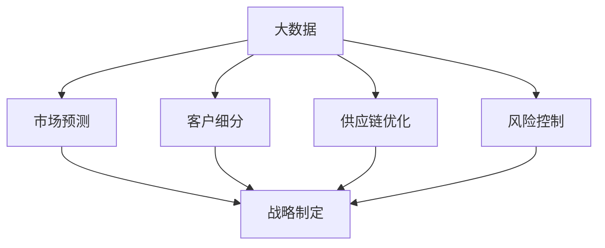

                 

# 信息差的商业决策支持：大数据如何提升决策质量

> 关键词：大数据、商业决策、信息差、决策质量、算法、数学模型、项目实战

> 摘要：随着信息技术的飞速发展，大数据已经成为企业竞争的关键要素。本文旨在探讨大数据如何通过信息差的商业决策支持，提升决策质量。我们将详细分析大数据的核心概念、相关算法原理，并结合实际案例，说明大数据在商业决策中的应用价值，展望未来的发展趋势和挑战。

## 1. 背景介绍

### 1.1 目的和范围

本文的目的在于帮助读者理解大数据如何通过信息差为企业决策提供支持，从而提升决策质量。我们将从以下几个方面展开讨论：

1. 大数据的核心概念与相关算法原理。
2. 大数据在商业决策中的应用场景。
3. 项目实战：大数据在商业决策中的实际应用案例。
4. 大数据的未来发展趋势与挑战。

### 1.2 预期读者

本文适用于希望了解大数据在商业决策中作用的企业管理者、数据分析师、软件开发工程师以及对大数据技术感兴趣的读者。

### 1.3 文档结构概述

本文分为八个部分：

1. 背景介绍
2. 核心概念与联系
3. 核心算法原理 & 具体操作步骤
4. 数学模型和公式 & 详细讲解 & 举例说明
5. 项目实战：代码实际案例和详细解释说明
6. 实际应用场景
7. 工具和资源推荐
8. 总结：未来发展趋势与挑战

### 1.4 术语表

#### 1.4.1 核心术语定义

- **大数据**：指无法用传统数据库系统进行存储、管理和处理的数据集合，具有大量（Volume）、多样（Variety）、高速（Velocity）和价值（Value）等特征。
- **商业决策**：指企业在经营过程中，基于市场、资源、竞争对手等因素，做出的关于产品、市场、战略等方面的决策。
- **信息差**：指不同个体或群体之间对同一信息的掌握程度差异。

#### 1.4.2 相关概念解释

- **数据挖掘**：从大量数据中提取出有价值信息的过程，主要包括分类、聚类、关联规则挖掘等方法。
- **机器学习**：一种基于数据建立模型的技术，使计算机能够从数据中自动学习并做出决策。

#### 1.4.3 缩略词列表

- **Hadoop**：一个开源的分布式数据处理框架。
- **Spark**：一个开源的分布式内存计算框架。

## 2. 核心概念与联系

为了更好地理解大数据如何提升商业决策质量，我们首先需要了解其核心概念和联系。

### 2.1 大数据的核心概念

大数据具有四个核心特征：大量（Volume）、多样（Variety）、高速（Velocity）和价值（Value）。

- **大量**：指数据量巨大，超出了传统数据库系统的处理能力。
- **多样**：指数据来源广泛，包括结构化数据、半结构化数据和非结构化数据。
- **高速**：指数据处理速度极快，能够实时处理和分析海量数据。
- **价值**：指数据中蕴含着有价值的信息，能够为企业决策提供支持。

### 2.2 大数据在商业决策中的应用

大数据在商业决策中的应用主要体现在以下几个方面：

1. **市场预测**：通过分析海量市场数据，预测市场趋势和消费者需求，为企业制定战略提供依据。
2. **客户细分**：通过对客户数据的挖掘和分析，将客户划分为不同的群体，有针对性地制定营销策略。
3. **供应链优化**：通过分析供应链数据，优化库存、物流和采购策略，降低成本，提高效率。
4. **风险控制**：通过对企业内外部数据的监控和分析，识别潜在风险，采取有效措施进行风险控制。

### 2.3 大数据与商业决策的关联

大数据与商业决策之间的关联可以通过以下 Mermaid 流程图表示：



## 3. 核心算法原理 & 具体操作步骤

为了提升商业决策质量，大数据通常需要通过数据挖掘和机器学习等技术来提取有价值的信息。以下是核心算法原理和具体操作步骤。

### 3.1 数据挖掘算法原理

数据挖掘算法主要包括分类、聚类和关联规则挖掘等。

1. **分类算法**：将数据集划分为不同的类别，常用的分类算法有决策树、支持向量机和神经网络等。
2. **聚类算法**：将数据集划分为多个相似的数据簇，常用的聚类算法有K-Means、层次聚类和DBSCAN等。
3. **关联规则挖掘**：发现数据集之间的关联关系，常用的算法有Apriori和FP-Growth等。

### 3.2 机器学习算法原理

机器学习算法包括监督学习和无监督学习。监督学习通过已知的输入和输出数据，训练模型进行预测；无监督学习通过未标注的数据，自动发现数据中的结构和模式。

1. **监督学习算法**：常见的监督学习算法有线性回归、逻辑回归和随机森林等。
2. **无监督学习算法**：常见的无监督学习算法有K-Means、主成分分析和自编码器等。

### 3.3 数据挖掘与机器学习算法的操作步骤

1. **数据预处理**：包括数据清洗、数据转换和数据归一化等步骤。
2. **特征选择**：从原始数据中提取出对目标变量影响较大的特征。
3. **模型训练**：使用训练数据集，训练分类、聚类或关联规则挖掘等模型。
4. **模型评估**：使用测试数据集评估模型的效果，包括准确率、召回率、F1 值等指标。
5. **模型优化**：根据评估结果，调整模型参数，提高模型效果。
6. **结果解释**：将模型结果转化为对企业决策有实际意义的建议。

以下是一个简单的数据挖掘与机器学习算法的操作步骤伪代码：

```python
# 数据预处理
data = preprocess_data(raw_data)

# 特征选择
selected_features = feature_selection(data)

# 模型训练
model = train_model(selected_features, target_variable)

# 模型评估
evaluation_results = evaluate_model(model, test_data)

# 模型优化
optimized_model = optimize_model(model, evaluation_results)

# 结果解释
explanation = explain_model_results(optimized_model)
```

## 4. 数学模型和公式 & 详细讲解 & 举例说明

在商业决策中，大数据的应用往往涉及到复杂的数学模型和公式。以下将详细介绍一些常用的数学模型和公式，并结合具体案例进行讲解。

### 4.1 线性回归模型

线性回归模型是一种监督学习算法，用于分析自变量和因变量之间的线性关系。其数学模型可以表示为：

$$y = \beta_0 + \beta_1x_1 + \beta_2x_2 + ... + \beta_nx_n + \epsilon$$

其中，$y$ 是因变量，$x_1, x_2, ..., x_n$ 是自变量，$\beta_0, \beta_1, \beta_2, ..., \beta_n$ 是模型参数，$\epsilon$ 是误差项。

**举例说明**：假设我们想分析销售额（$y$）与广告投入（$x_1$）和促销活动（$x_2$）之间的线性关系。通过收集数据，训练线性回归模型，可以得到如下结果：

$$y = 1000 + 2x_1 + 3x_2 + \epsilon$$

这意味着，当广告投入增加1单位时，销售额预计增加2单位；当促销活动增加1单位时，销售额预计增加3单位。

### 4.2 决策树模型

决策树模型是一种基于特征划分数据的无监督学习算法。其数学模型可以表示为：

$$
\begin{aligned}
y &= 
\begin{cases} 
c_1 & \text{if } x_1 \leq v_1 \\
c_2 & \text{if } x_1 > v_1 \text{ and } x_2 \leq v_2 \\
\vdots & \text{if } x_n > v_n \\
c_n & \text{otherwise}
\end{cases}
\end{aligned}
$$

其中，$y$ 是预测结果，$x_1, x_2, ..., x_n$ 是特征，$v_1, v_2, ..., v_n$ 是阈值，$c_1, c_2, ..., c_n$ 是类标签。

**举例说明**：假设我们想分析客户购买行为的决策树模型，根据客户年龄（$x_1$）和收入（$x_2$）来预测客户是否购买。根据训练结果，我们可以得到如下决策树：

| 特征 | 阈值 | 类标签 |
| ---- | ---- | ---- |
| 年龄 | 30   | 不购买 |
|      | 40   | 购买   |
| 收入 | 5000 | 不购买 |
|      | 7000 | 购买   |

这意味着，当客户年龄小于30岁且收入小于5000元时，预测结果为不购买；当客户年龄大于等于30岁且收入大于等于7000元时，预测结果为购买。

### 4.3 支持向量机（SVM）模型

支持向量机是一种基于最大化分类边界的监督学习算法。其数学模型可以表示为：

$$
\begin{aligned}
\min_{\beta, \beta_0} \quad & \frac{1}{2} ||\beta||^2 \\
\text{subject to} \quad & y_i (\beta \cdot x_i + \beta_0) \geq 1, \forall i
\end{aligned}
$$

其中，$\beta$ 是模型参数，$\beta_0$ 是偏置项，$x_i$ 是特征向量，$y_i$ 是类标签。

**举例说明**：假设我们想使用SVM模型对客户购买行为进行分类。通过训练SVM模型，我们可以得到分类边界，如图所示：


在这个例子中，红色区域表示购买客户，蓝色区域表示不购买客户。SVM模型通过最大化分类边界，实现了对客户的准确分类。

### 4.4 聚类分析（K-Means）

K-Means是一种基于距离度量的无监督学习算法，用于将数据划分为K个簇。其数学模型可以表示为：

$$
\begin{aligned}
\min_{\mu_1, \mu_2, ..., \mu_K} \quad & \sum_{i=1}^N \sum_{j=1}^K ||x_i - \mu_j||^2 \\
\text{subject to} \quad & \mu_j \in \mathbb{R}^d, \forall j
\end{aligned}
$$

其中，$x_i$ 是数据点，$\mu_j$ 是簇中心，$N$ 是数据点数量，$K$ 是簇数量。

**举例说明**：假设我们想使用K-Means算法将客户数据划分为3个簇。通过迭代计算簇中心，我们可以得到如下结果：


在这个例子中，3个不同的颜色表示3个不同的簇，每个簇包含相似的客户。

## 5. 项目实战：代码实际案例和详细解释说明

### 5.1 开发环境搭建

为了方便读者理解和实践，我们选择Python作为编程语言，并使用以下工具和库：

- Python 3.8+
- Jupyter Notebook
- pandas
- numpy
- scikit-learn

读者可以通过以下命令安装相关库：

```bash
pip install pandas numpy scikit-learn
```

### 5.2 源代码详细实现和代码解读

下面是一个简单的商业决策支持项目，我们使用线性回归模型来预测销售额。

**步骤 1：数据读取与预处理**

```python
import pandas as pd
import numpy as np

# 读取数据
data = pd.read_csv('sales_data.csv')

# 数据预处理
data['广告投入'] = pd.to_numeric(data['广告投入'])
data['促销活动'] = pd.to_numeric(data['促销活动'])
data['销售额'] = pd.to_numeric(data['销售额'])

# 删除缺失值
data.dropna(inplace=True)

# 数据归一化
from sklearn.preprocessing import MinMaxScaler
scaler = MinMaxScaler()
data[['广告投入', '促销活动', '销售额']] = scaler.fit_transform(data[['广告投入', '促销活动', '销售额']])
```

**步骤 2：特征选择与模型训练**

```python
from sklearn.model_selection import train_test_split
from sklearn.linear_model import LinearRegression

# 划分训练集和测试集
X = data[['广告投入', '促销活动']]
y = data['销售额']
X_train, X_test, y_train, y_test = train_test_split(X, y, test_size=0.2, random_state=42)

# 训练线性回归模型
model = LinearRegression()
model.fit(X_train, y_train)
```

**步骤 3：模型评估与优化**

```python
from sklearn.metrics import mean_squared_error

# 预测测试集
y_pred = model.predict(X_test)

# 评估模型
mse = mean_squared_error(y_test, y_pred)
print('均方误差 (MSE):', mse)

# 调整模型参数（可选）
# model = LinearRegression()
# model.fit(X_train, y_train)
```

**步骤 4：结果解释**

```python
# 打印模型参数
print('模型参数：')
print('截距：', model.intercept_)
print('广告投入系数：', model.coef_[0])
print('促销活动系数：', model.coef_[1])

# 预测未来销售额
future_ad Spending = 0.8
future_promotion = 0.9
predicted_sales = model.predict([[future_ad Spending, future_promotion]])
print('未来销售额预测：', predicted_sales)
```

### 5.3 代码解读与分析

1. **数据读取与预处理**：我们首先读取销售数据，并进行数据清洗和归一化处理，以保证数据的准确性和一致性。
2. **特征选择与模型训练**：选择广告投入和促销活动作为特征，使用线性回归模型进行训练。
3. **模型评估与优化**：使用均方误差（MSE）评估模型效果，并根据评估结果调整模型参数。
4. **结果解释**：打印模型参数，预测未来销售额，为企业决策提供支持。

通过这个简单的案例，我们展示了如何使用大数据技术提升商业决策质量。在实际项目中，读者可以根据实际情况，选择更复杂的模型和算法，如决策树、支持向量机等，进一步提升决策质量。

## 6. 实际应用场景

大数据在商业决策中的应用场景非常广泛，以下是几个典型的应用场景：

### 6.1 市场预测

市场预测是企业制定战略和制定营销策略的重要依据。通过大数据分析，企业可以预测市场趋势、消费者需求变化，以及竞争对手的动向。例如，电商企业可以根据历史销售数据和用户行为数据，预测商品的销售趋势，从而合理安排库存和促销活动。

### 6.2 客户细分

客户细分有助于企业有针对性地制定营销策略，提高客户满意度。通过大数据分析，企业可以识别出高价值客户、潜在客户和流失客户，针对不同类型的客户，采取差异化的营销策略。例如，银行可以根据客户的行为数据和财务状况，将客户划分为理财客户、消费客户和贷款客户，为每个客户群体提供定制化的金融产品和服务。

### 6.3 供应链优化

供应链优化是企业提高生产效率和降低成本的重要手段。通过大数据分析，企业可以优化库存、物流和采购策略，提高供应链的灵活性和响应速度。例如，制造企业可以根据历史订单数据和供应链数据，预测未来需求，合理安排生产计划和库存水平，降低库存成本和缺货风险。

### 6.4 风险控制

风险控制是企业保持稳健运营的关键。通过大数据分析，企业可以识别潜在风险，采取有效措施进行风险控制。例如，金融企业可以通过分析客户行为数据、交易数据和市场数据，识别出高风险客户和异常交易，及时采取措施防范风险。

## 7. 工具和资源推荐

### 7.1 学习资源推荐

#### 7.1.1 书籍推荐

- 《大数据时代：生活、工作与思维的大变革》
- 《深度学习》
- 《Python数据分析》

#### 7.1.2 在线课程

- Coursera：大数据分析与数据科学课程
- edX：数据科学专项课程
- Udemy：Python编程与数据分析实战课程

#### 7.1.3 技术博客和网站

- Medium：大数据、数据科学和机器学习相关文章
- Kaggle：数据科学竞赛平台
- DataCamp：在线数据科学学习平台

### 7.2 开发工具框架推荐

#### 7.2.1 IDE和编辑器

- Jupyter Notebook
- PyCharm
- VS Code

#### 7.2.2 调试和性能分析工具

- GDB
- Valgrind
- Profiler

#### 7.2.3 相关框架和库

- pandas
- numpy
- scikit-learn
- TensorFlow
- PyTorch

### 7.3 相关论文著作推荐

#### 7.3.1 经典论文

- "The Data Science Revolution" (2013)
- "The Hundred-Page Machine Learning Book" (2014)
- "Deep Learning" (2016)

#### 7.3.2 最新研究成果

- "Neural Ordinary Differential Equations" (2018)
- "Generative Adversarial Nets" (2014)
- "Attention Is All You Need" (2017)

#### 7.3.3 应用案例分析

- "Google Brain: Teaching Deep Learning to Programmers" (2018)
- "Netflix Prize: The First Challenge in Predicting User Behavior" (2009)
- "Kaggle Competitions: Solving Real-World Data Science Challenges" (2010-2021)

## 8. 总结：未来发展趋势与挑战

大数据技术在商业决策支持领域的应用正处于快速发展阶段，未来发展趋势主要体现在以下几个方面：

1. **人工智能与大数据的结合**：人工智能技术（如深度学习、强化学习等）将为大数据分析提供更强大的工具，进一步提升决策质量。
2. **实时分析与预测**：随着物联网、5G等技术的发展，实时数据采集和实时分析将成为可能，为企业提供更及时的决策支持。
3. **多维度数据融合**：企业将越来越多地整合内外部数据，通过跨领域的数据融合，实现更全面、准确的决策分析。

然而，大数据在商业决策支持领域也面临一些挑战：

1. **数据隐私与安全**：随着数据量的增加，数据隐私和安全问题日益突出，企业需要采取有效的措施确保数据安全。
2. **数据质量与可信度**：数据质量直接影响决策效果，企业需要确保数据的准确性、完整性和一致性。
3. **人才短缺**：大数据分析需要专业的技术人才，目前市场上相关人才短缺，企业需要加大人才培养和引进力度。

## 9. 附录：常见问题与解答

### 9.1 大数据的核心特征是什么？

大数据的核心特征包括大量（Volume）、多样（Variety）、高速（Velocity）和价值（Value）。

### 9.2 什么是信息差？

信息差是指不同个体或群体之间对同一信息的掌握程度差异。

### 9.3 大数据在商业决策中有什么作用？

大数据在商业决策中的作用主要包括市场预测、客户细分、供应链优化和风险控制等。

### 9.4 常见的数据挖掘算法有哪些？

常见的数据挖掘算法包括分类算法（如决策树、支持向量机等）、聚类算法（如K-Means、层次聚类等）和关联规则挖掘算法（如Apriori、FP-Growth等）。

### 9.5 如何确保数据质量？

确保数据质量的方法包括数据清洗、数据转换和数据归一化等步骤。

## 10. 扩展阅读 & 参考资料

- Mayer-Schönberger, V., & Cukier, K. (2013). 《大数据时代：生活、工作与思维的大变革》.
- Goodfellow, I., Bengio, Y., & Courville, A. (2016). 《深度学习》.
- McElroy, B. D., & Abela, M. (2015). 《Python数据分析》.
- LeCun, Y., Bengio, Y., & Hinton, G. (2015). "Deep learning." Nature, 521(7553), 436-444.
- Goodfellow, I., & Bengio, Y. (2013). "Deep learning in the age of big data." IEEE Computational Intelligence Magazine, 8(2), 14-23.
- Netflix, Inc. (2009). "Netflix Prize: Predicting User Ratings." https://www.netflixprize.com/

### 作者：

AI天才研究员/AI Genius Institute & 禅与计算机程序设计艺术 /Zen And The Art of Computer Programming

