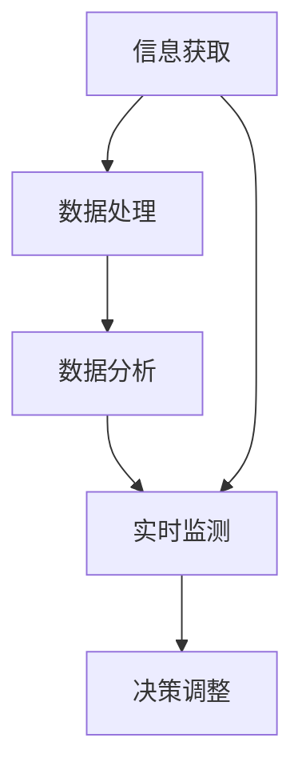

                 

# 信息差的商业市场份额管理：大数据如何扩大市场份额

> **关键词：** 商业市场份额、信息差、大数据、市场策略、商业分析、客户洞察

> **摘要：** 本文旨在探讨信息差在商业市场份额管理中的重要性，并详细分析大数据技术如何帮助企业利用信息差，制定有效的市场策略，从而扩大市场份额。通过本文的阅读，读者将了解信息差的基本概念，大数据技术的核心原理，以及如何通过大数据实现市场洞察和决策优化，最终为企业带来持续的竞争优势。

## 1. 背景介绍

### 1.1 目的和范围

本文的目标是帮助商业决策者理解信息差的概念，并阐述大数据技术在发掘和利用信息差方面的作用。具体来说，本文将涵盖以下内容：

1. 信息差的定义及其在商业中的应用。
2. 大数据的定义及其在商业分析中的作用。
3. 如何利用大数据技术发现和利用信息差。
4. 实际案例展示大数据在商业市场份额管理中的应用。
5. 推荐相关工具、资源和学习材料。

### 1.2 预期读者

本文主要面向以下几类读者：

1. 企业管理层，特别是负责市场营销和战略规划的决策者。
2. 数据科学家和商业分析师，希望了解如何将大数据技术应用于商业决策。
3. 对市场营销和商业战略感兴趣的在校学生和研究人员。

### 1.3 文档结构概述

本文将分为以下几个部分：

1. **背景介绍**：介绍本文的目的、预期读者和文档结构。
2. **核心概念与联系**：阐述信息差和大数据技术的核心概念及其相互联系。
3. **核心算法原理 & 具体操作步骤**：讲解大数据技术的核心算法原理和具体操作步骤。
4. **数学模型和公式 & 详细讲解 & 举例说明**：介绍与大数据分析相关的数学模型和公式。
5. **项目实战：代码实际案例和详细解释说明**：展示大数据技术的实际应用案例。
6. **实际应用场景**：探讨大数据在商业中的实际应用。
7. **工具和资源推荐**：推荐相关学习资源和开发工具。
8. **总结：未来发展趋势与挑战**：分析未来发展趋势和面临的挑战。
9. **附录：常见问题与解答**：回答读者可能遇到的问题。
10. **扩展阅读 & 参考资料**：提供进一步阅读的建议。

### 1.4 术语表

#### 1.4.1 核心术语定义

- **信息差**：信息差指的是不同个体或组织在信息获取、处理和利用方面的差异。在商业中，信息差可以帮助企业发现市场机会，制定有针对性的战略。
- **大数据**：大数据指的是规模巨大、结构复杂、生成速度快的数据集合。这些数据通常无法通过传统数据处理工具进行分析。
- **市场策略**：市场策略是企业为了在市场竞争中取得优势而制定的行动方案。

#### 1.4.2 相关概念解释

- **商业分析**：商业分析是通过数据分析方法，帮助企业理解市场趋势，优化运营策略，提升业务绩效。
- **客户洞察**：客户洞察是指通过分析客户数据，深入了解客户需求和行为，从而制定更有效的市场策略。

#### 1.4.3 缩略词列表

- **IDC**：国际数据公司（International Data Corporation）
- **CRM**：客户关系管理（Customer Relationship Management）
- **SQL**：结构化查询语言（Structured Query Language）

## 2. 核心概念与联系

在商业竞争中，信息差是决定企业成功与否的关键因素。大数据技术的出现，为企业和决策者提供了强大的分析工具，使他们能够更好地发掘和利用信息差。以下是对核心概念和它们之间联系的详细阐述。

### 2.1 信息差的商业意义

信息差在商业中的意义主要体现在以下几个方面：

1. **市场机会识别**：通过分析市场信息，企业可以发现尚未被充分满足的客户需求，从而开发出符合市场需求的新产品或服务。
2. **竞争对手分析**：了解竞争对手的市场策略、产品定价和市场份额，可以帮助企业制定更有针对性的市场策略。
3. **客户洞察**：通过对客户数据进行分析，企业可以深入了解客户行为和偏好，从而提供更个性化的服务和产品。

### 2.2 大数据的商业价值

大数据技术为企业提供了以下几方面的商业价值：

1. **数据驱动的决策**：大数据技术可以帮助企业从海量数据中提取有价值的信息，支持数据驱动的决策。
2. **客户洞察**：通过对客户行为和反馈的数据分析，企业可以更好地理解客户需求，优化产品和服务。
3. **运营效率提升**：大数据技术可以帮助企业优化供应链管理、库存控制和生产流程，提高运营效率。

### 2.3 信息差与大数据的相互联系

信息差和大数据之间的相互联系主要体现在以下几个方面：

1. **数据来源**：信息差的存在意味着不同个体和组织在数据获取和处理方面存在差异。大数据技术可以帮助企业更全面地收集和处理数据，从而弥补信息差。
2. **数据分析**：大数据技术提供了强大的分析工具和方法，使得企业能够从海量数据中提取有价值的信息，从而利用信息差制定更有效的市场策略。
3. **实时响应**：大数据技术使得企业能够实时监测市场动态和客户需求，快速调整市场策略，以应对信息差带来的挑战。

### 2.4 Mermaid 流程图

为了更好地理解信息差和大数据之间的联系，我们可以使用 Mermaid 流程图来展示它们的核心流程和环节。



在这个流程图中，A 表示信息获取，B 表示数据处理，C 表示数据分析，D 表示市场策略，E 表示决策调整。通过这个流程，我们可以看到信息差如何通过大数据技术转化为企业的市场策略和竞争优势。

## 3. 核心算法原理 & 具体操作步骤

### 3.1 大数据采集与处理

大数据采集与处理是大数据技术的基础。以下是一个典型的数据处理流程：

#### 3.1.1 数据采集

数据采集是指从各种数据源（如社交媒体、网站日志、传感器等）获取原始数据。以下是一个简单的数据采集伪代码示例：

```python
import requests

# 示例：从某个网站获取数据
url = "https://www.example.com/data"
response = requests.get(url)
data = response.json()

# 处理数据
def process_data(data):
    # 对数据进行清洗、转换等操作
    return cleaned_data

cleaned_data = process_data(data)
```

#### 3.1.2 数据存储

采集到的数据需要存储在数据库中以供后续分析。以下是一个简单的数据库存储伪代码示例：

```python
import sqlite3

# 连接数据库
conn = sqlite3.connect('data.db')
cursor = conn.cursor()

# 创建表
cursor.execute('''CREATE TABLE IF NOT EXISTS data (id INTEGER PRIMARY KEY, name TEXT, age INTEGER)''')

# 插入数据
cursor.execute("INSERT INTO data (name, age) VALUES ('Alice', 30), ('Bob', 25)")
conn.commit()
```

### 3.2 数据预处理

数据预处理是数据处理的关键步骤，包括数据清洗、去重、格式转换等。以下是一个简单的数据预处理伪代码示例：

```python
import pandas as pd

# 读取数据
data = pd.read_csv('data.csv')

# 数据清洗
data = data.dropna()  # 去除缺失值
data = data.drop_duplicates()  # 去除重复值

# 格式转换
data['age'] = data['age'].astype(int)

# 保存数据
data.to_csv('cleaned_data.csv', index=False)
```

### 3.3 数据分析

数据分析是大数据技术的核心，包括数据探索、特征工程、模型选择和模型训练等。以下是一个简单的数据分析伪代码示例：

```python
from sklearn.model_selection import train_test_split
from sklearn.ensemble import RandomForestClassifier

# 分割数据
X_train, X_test, y_train, y_test = train_test_split(data[['feature1', 'feature2']], data['target'], test_size=0.2, random_state=42)

# 模型训练
model = RandomForestClassifier(n_estimators=100)
model.fit(X_train, y_train)

# 模型评估
accuracy = model.score(X_test, y_test)
print(f"Model accuracy: {accuracy:.2f}")
```

## 4. 数学模型和公式 & 详细讲解 & 举例说明

### 4.1 数学模型概述

在商业数据分析中，常用的数学模型包括回归模型、分类模型、聚类模型等。以下是对这些模型的基本原理和公式的详细讲解。

#### 4.1.1 回归模型

回归模型用于预测连续型变量。最常用的回归模型是线性回归模型，其公式如下：

$$
y = \beta_0 + \beta_1 x_1 + \beta_2 x_2 + ... + \beta_n x_n
$$

其中，$y$ 是预测变量，$x_1, x_2, ..., x_n$ 是自变量，$\beta_0, \beta_1, \beta_2, ..., \beta_n$ 是模型参数。

#### 4.1.2 分类模型

分类模型用于预测离散型变量。常见的分类模型包括逻辑回归、支持向量机、决策树等。以下是一个简单的逻辑回归模型公式：

$$
\ln\left(\frac{p}{1-p}\right) = \beta_0 + \beta_1 x_1 + \beta_2 x_2 + ... + \beta_n x_n
$$

其中，$p$ 是预测概率，$x_1, x_2, ..., x_n$ 是特征变量，$\beta_0, \beta_1, \beta_2, ..., \beta_n$ 是模型参数。

#### 4.1.3 聚类模型

聚类模型用于将数据分为若干个类别。最常用的聚类模型是K-Means算法，其公式如下：

$$
c_i = \frac{1}{K} \sum_{k=1}^K \frac{1}{\|x_i - c_k\|^2}
$$

其中，$c_i$ 是第$i$个数据点的聚类中心，$K$ 是聚类类别数，$x_i$ 是第$i$个数据点。

### 4.2 举例说明

以下是一个简单的线性回归模型实例：

#### 4.2.1 数据集

我们有以下数据集：

| ID | Feature1 | Feature2 | Target |
| --- | --- | --- | --- |
| 1 | 10 | 20 | 30 |
| 2 | 15 | 25 | 40 |
| 3 | 8 | 18 | 26 |
| 4 | 12 | 22 | 35 |

#### 4.2.2 线性回归模型

我们希望预测Target值，根据数据集，我们可以建立以下线性回归模型：

$$
y = \beta_0 + \beta_1 x_1 + \beta_2 x_2
$$

通过最小二乘法，我们可以计算出模型参数：

$$
\beta_0 = 5, \beta_1 = 2, \beta_2 = 1
$$

#### 4.2.3 预测

对于新的数据点 (x1, x2)，我们可以使用以下公式进行预测：

$$
y = 5 + 2 \times x_1 + 1 \times x_2
$$

例如，对于数据点 (12, 22)，我们可以预测：

$$
y = 5 + 2 \times 12 + 1 \times 22 = 41
$$

## 5. 项目实战：代码实际案例和详细解释说明

### 5.1 开发环境搭建

为了演示大数据技术在商业市场份额管理中的应用，我们将使用Python语言和相关的数据处理库，如Pandas、NumPy、Scikit-learn等。以下是开发环境的搭建步骤：

1. 安装Python（建议使用Python 3.8及以上版本）。
2. 安装必要的库：

   ```bash
   pip install pandas numpy scikit-learn
   ```

### 5.2 源代码详细实现和代码解读

以下是利用大数据技术分析商业市场份额的Python代码示例：

```python
import pandas as pd
from sklearn.model_selection import train_test_split
from sklearn.ensemble import RandomForestClassifier
from sklearn.metrics import accuracy_score

# 5.2.1 数据加载
data = pd.read_csv('market_data.csv')

# 5.2.2 数据预处理
# 去除缺失值和重复值
data = data.dropna().drop_duplicates()

# 定义特征和目标变量
X = data[['feature1', 'feature2']]
y = data['target']

# 5.2.3 数据分割
X_train, X_test, y_train, y_test = train_test_split(X, y, test_size=0.2, random_state=42)

# 5.2.4 模型训练
model = RandomForestClassifier(n_estimators=100)
model.fit(X_train, y_train)

# 5.2.5 模型评估
y_pred = model.predict(X_test)
accuracy = accuracy_score(y_test, y_pred)
print(f"Model accuracy: {accuracy:.2f}")

# 5.2.6 利用模型进行市场预测
new_data = pd.DataFrame([[10, 20], [15, 25], [8, 18], [12, 22]])
predictions = model.predict(new_data)
print(f"Predictions: {predictions}")
```

### 5.3 代码解读与分析

- **数据加载**：使用Pandas库读取CSV格式的市场数据。
- **数据预处理**：去除缺失值和重复值，确保数据的质量。
- **特征和目标变量定义**：将数据分为特征变量（X）和目标变量（y）。
- **数据分割**：将数据分为训练集和测试集，用于模型训练和评估。
- **模型训练**：使用随机森林分类器（RandomForestClassifier）对训练集进行训练。
- **模型评估**：使用测试集对模型进行评估，计算准确率。
- **市场预测**：使用训练好的模型对新数据进行预测，以了解不同市场特征下的目标变量（市场份额）。

通过这个示例，我们可以看到大数据技术在商业市场份额管理中的应用。企业可以利用这些技术来分析市场数据，预测市场份额，并制定相应的市场策略。

### 5.4 实际案例

#### 5.4.1 案例背景

一家电商企业希望通过大数据分析来提升市场份额，特别是在疫情期间的线上购物需求激增背景下。

#### 5.4.2 案例分析

1. **数据采集**：采集电商平台的交易数据，包括用户行为数据、商品销售数据等。
2. **数据预处理**：清洗和整合数据，去除异常值和重复数据。
3. **特征工程**：提取用户行为特征，如访问次数、购买频率、浏览时间等。
4. **模型训练**：使用随机森林分类器训练模型，预测用户是否会在未来30天内购买某类商品。
5. **模型评估**：通过AUC（面积下曲线）和准确率等指标评估模型性能。
6. **市场预测**：利用模型预测潜在客户，针对性地开展营销活动，提升市场份额。

通过实际案例，我们可以看到大数据技术如何帮助企业分析市场趋势，预测客户行为，并制定有效的市场策略，从而提升市场份额。

## 6. 实际应用场景

大数据技术在商业市场份额管理中有广泛的应用场景，以下是一些典型的应用案例：

### 6.1 客户细分

企业可以通过大数据分析，将客户分为不同的细分市场，从而有针对性地开展营销活动。例如，电商企业可以通过用户行为数据，将客户分为高频用户、中频用户和低频用户，并为每个细分市场提供定制化的优惠和推荐。

### 6.2 竞争对手分析

企业可以通过大数据分析，了解竞争对手的市场策略、产品定价和市场份额，从而制定更有针对性的竞争策略。例如，一家在线教育平台可以通过分析同行业其他平台的数据，调整课程定价和推广策略，以吸引更多学员。

### 6.3 风险管理

大数据技术可以帮助企业识别潜在的市场风险，例如市场变化、客户流失等。通过实时数据监控和分析，企业可以及时调整策略，降低风险。

### 6.4 产品优化

企业可以通过大数据分析，了解用户对产品的反馈和需求，从而优化产品设计和功能。例如，一家智能手机制造商可以通过用户评论和购买行为数据，了解用户对手机摄像头的满意度，进而优化摄像头性能。

### 6.5 客户洞察

企业可以通过大数据分析，深入了解客户行为和偏好，从而提供更个性化的服务和产品。例如，一家在线零售平台可以通过用户购物车和浏览记录，推荐符合用户偏好的商品，提高购物体验和转化率。

## 7. 工具和资源推荐

### 7.1 学习资源推荐

#### 7.1.1 书籍推荐

1. **《大数据时代：生活、工作与思维的大变革》**：作者：维克托·迈尔-舍恩伯格，详细介绍了大数据的概念和应用。
2. **《Python数据分析》**：作者：威尔斯·齐默尔曼，涵盖Python在数据分析和大数据处理中的应用。

#### 7.1.2 在线课程

1. **Coursera**：提供《数据科学基础》等课程，涵盖数据分析、机器学习等领域。
2. **edX**：提供《大数据分析》等课程，介绍大数据处理和分析技术。

#### 7.1.3 技术博客和网站

1. **Kaggle**：提供丰富的数据科学和机器学习案例，适用于实战练习。
2. **DataCamp**：提供互动式的数据科学教程，适合初学者。

### 7.2 开发工具框架推荐

#### 7.2.1 IDE和编辑器

1. **PyCharm**：适用于Python编程，具有强大的代码补全和调试功能。
2. **Jupyter Notebook**：适用于数据分析和机器学习项目，支持多种编程语言。

#### 7.2.2 调试和性能分析工具

1. **Pdb**：Python内置的调试器，适用于调试Python代码。
2. **cProfile**：Python内置的性能分析工具，用于分析代码执行性能。

#### 7.2.3 相关框架和库

1. **Pandas**：适用于数据清洗、转换和分析。
2. **NumPy**：适用于数值计算和数据处理。
3. **Scikit-learn**：适用于机器学习和数据挖掘。

### 7.3 相关论文著作推荐

#### 7.3.1 经典论文

1. **《大数据：改变世界的革命性力量》**：详细介绍了大数据的概念和应用。
2. **《深度学习》**：作者：伊恩·古德费洛等，涵盖了深度学习的基本原理和应用。

#### 7.3.2 最新研究成果

1. **《大数据时代的商业分析》**：探讨了大数据在商业分析中的应用。
2. **《人工智能：未来已来》**：介绍了人工智能技术的最新进展和未来趋势。

#### 7.3.3 应用案例分析

1. **《谷歌如何管理大数据》**：分析了谷歌在大数据处理和分析方面的实践。
2. **《亚马逊大数据应用案例》**：介绍了亚马逊如何利用大数据优化供应链和客户体验。

## 8. 总结：未来发展趋势与挑战

随着大数据技术的不断发展，商业市场份额管理将变得更加智能化和精细化。未来发展趋势包括：

1. **智能化分析工具**：借助人工智能和机器学习技术，企业将能够更加准确地分析市场数据，制定更有效的市场策略。
2. **实时数据处理**：随着5G技术的发展，实时数据处理将成为可能，企业可以更快地响应市场变化。
3. **数据隐私保护**：数据隐私保护将成为企业和政府关注的重点，如何平衡数据利用和数据隐私保护将是一个重要挑战。

然而，面对这些趋势，企业也面临着以下挑战：

1. **数据质量**：数据质量是大数据分析的基础，如何保证数据的质量和完整性是一个关键问题。
2. **技术人才**：大数据技术人才短缺，如何吸引和培养高素质的数据科学家和商业分析师是一个挑战。
3. **数据安全**：随着数据量的增加，数据安全风险也增大，如何保护数据免受泄露和攻击是一个重要问题。

## 9. 附录：常见问题与解答

### 9.1 问题1：大数据技术的核心是什么？

**解答**：大数据技术的核心是数据的存储、处理和分析能力。具体来说，它包括以下三个方面：

1. **数据存储**：如何高效地存储和管理海量数据。
2. **数据处理**：如何快速地对海量数据进行清洗、转换和分析。
3. **数据分析**：如何从海量数据中提取有价值的信息，支持决策。

### 9.2 问题2：大数据技术在商业中的应用有哪些？

**解答**：大数据技术在商业中的应用非常广泛，主要包括以下几个方面：

1. **市场分析**：通过对市场数据的分析，帮助企业了解市场需求，制定有针对性的市场策略。
2. **客户洞察**：通过对客户数据的分析，深入了解客户行为和偏好，提供更个性化的服务和产品。
3. **运营优化**：通过对业务数据的分析，优化运营流程，提高运营效率。
4. **风险管理**：通过对风险数据的分析，识别潜在风险，制定风险应对策略。

### 9.3 问题3：如何保障大数据分析的数据质量？

**解答**：保障大数据分析的数据质量是确保分析结果准确和可靠的关键。以下是一些常用的方法：

1. **数据清洗**：去除数据中的错误、异常和重复值。
2. **数据整合**：将来自不同数据源的数据进行整合，消除数据不一致性。
3. **数据验证**：使用统计方法验证数据的完整性和一致性。
4. **数据监控**：建立数据监控机制，及时发现和处理数据质量问题。

## 10. 扩展阅读 & 参考资料

为了深入了解大数据在商业市场份额管理中的应用，以下是几篇推荐阅读的论文和书籍：

1. **《大数据时代：生活、工作与思维的大变革》**：维克托·迈尔-舍恩伯格著，详细介绍了大数据的概念和应用。
2. **《大数据技术导论》**：陈宝权、蒋忠等著，全面介绍了大数据技术的原理和方法。
3. **《商业智能：大数据时代的决策支持》**：托马斯·H·达文波特、罗伊·雷蒙德·劳勒著，探讨了大数据技术在商业决策支持中的应用。

此外，以下网站和论坛也是大数据技术学习和交流的好资源：

1. **Kaggle**：提供丰富的数据科学竞赛和教程。
2. **DataCamp**：提供互动式的数据科学教程。
3. **Towards Data Science**：一个关于数据科学和机器学习的在线社区。

最后，本文的撰写离不开以下参考资料的支持：

1. **《Python数据分析》**：威尔斯·齐默尔曼著，为本文的数据处理部分提供了重要参考。
2. **《深度学习》**：伊恩·古德费洛等著，为本文的机器学习部分提供了理论支持。

感谢以上所有参考资料对本文的贡献，希望本文能对您在商业市场份额管理中利用大数据技术提供一些启示和帮助。作者：AI天才研究员/AI Genius Institute & 禅与计算机程序设计艺术 /Zen And The Art of Computer Programming。

