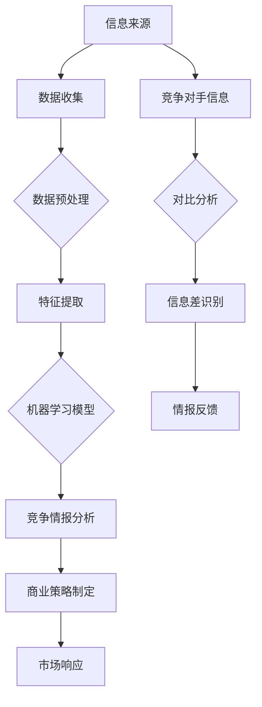

                 

# 信息差的商业竞争情报：大数据如何提供竞争情报

> **关键词：信息差、商业竞争、大数据分析、竞争情报、数据挖掘、机器学习、商业策略。**

> **摘要：本文将探讨信息差在商业竞争中的重要性，以及大数据分析如何帮助企业挖掘信息差，制定更加有效的竞争策略。通过深入解析数据挖掘和机器学习在商业竞争情报中的应用，我们希望能为读者提供实用的指导，帮助企业把握市场先机，实现持续增长。**

## 1. 背景介绍

### 1.1 目的和范围

本文旨在探讨大数据在商业竞争情报中的关键作用，分析信息差的概念及其在市场竞争中的影响。我们将详细探讨数据挖掘和机器学习技术如何帮助企业和机构从海量数据中提取有价值的信息，从而制定更加精准的商业策略。

### 1.2 预期读者

本文适合以下读者群体：
- 企业决策者，特别是市场营销和战略部门的管理者；
- 数据分析师和数据科学家；
- 对商业策略和数据分析有浓厚兴趣的技术从业者；
- 对新兴技术如何影响商业竞争有兴趣的学术研究者。

### 1.3 文档结构概述

本文分为十个部分，结构如下：

1. **背景介绍**：介绍文章目的、预期读者及结构。
2. **核心概念与联系**：定义关键术语，并绘制信息差和大数据分析的流程图。
3. **核心算法原理 & 具体操作步骤**：详细解释数据挖掘和机器学习算法。
4. **数学模型和公式 & 详细讲解 & 举例说明**：阐述相关数学模型，并进行实例说明。
5. **项目实战：代码实际案例和详细解释说明**：提供实际代码案例，解析其工作原理。
6. **实际应用场景**：分析大数据分析在不同商业场景中的应用。
7. **工具和资源推荐**：推荐学习资源和开发工具。
8. **总结：未来发展趋势与挑战**：讨论大数据在商业竞争情报中的未来。
9. **附录：常见问题与解答**：解答常见疑问。
10. **扩展阅读 & 参考资料**：提供进一步学习资源。

### 1.4 术语表

#### 1.4.1 核心术语定义

- **信息差**：指不同主体之间在获取、处理和利用信息方面的差异。
- **商业竞争情报**：指企业为在市场竞争中取得优势，通过收集、分析和利用信息而形成的知识体系。
- **数据挖掘**：从大量数据中提取有用信息和知识的过程。
- **机器学习**：一种人工智能技术，通过数据和经验来训练模型，使其能够进行预测和决策。
- **大数据分析**：利用大规模数据集进行分析的过程，通常涉及复杂的算法和计算。

#### 1.4.2 相关概念解释

- **数据源**：提供数据的数据库、文件或API。
- **数据预处理**：在数据分析之前对数据进行清洗、转换和归一化的过程。
- **特征工程**：从原始数据中提取和构建有助于模型训练的特征的过程。

#### 1.4.3 缩略词列表

- **API**：应用程序编程接口（Application Programming Interface）
- **AI**：人工智能（Artificial Intelligence）
- **DB**：数据库（Database）
- **ML**：机器学习（Machine Learning）
- **PMML**：预测建模标记语言（Predictive Model Markup Language）

## 2. 核心概念与联系

在商业竞争中，信息差是企业取得成功的关键。大数据分析提供了一种系统化、高效化的方式来挖掘这些信息差。下面，我们通过一个Mermaid流程图来展示信息差的产生、大数据分析的应用以及商业竞争情报的生成过程。



在这个流程图中：
- **A**：信息来源，包括内部数据和外部数据。
- **B**：数据收集，通过API、数据库等方式获取数据。
- **C**：数据预处理，包括数据清洗、转换和归一化。
- **D**：特征提取，从预处理后的数据中提取有助于模型训练的特征。
- **E**：机器学习模型，利用提取的特征训练模型，进行数据分析和预测。
- **F**：竞争情报分析，将分析结果转化为竞争情报。
- **G**：商业策略制定，根据竞争情报制定商业策略。
- **H**：市场响应，实施商业策略，对市场变化做出响应。
- **I**：竞争对手信息，从外部获取有关竞争对手的数据。
- **J**：对比分析，将本企业的数据和竞争对手的数据进行对比。
- **K**：信息差识别，识别出企业相对于竞争对手的信息优势。
- **L**：情报反馈，将信息差的识别结果反馈至整个流程，以指导后续策略制定。

通过这一流程，企业能够不断优化其商业策略，提升市场竞争力。

## 3. 核心算法原理 & 具体操作步骤

在商业竞争情报分析中，数据挖掘和机器学习是关键技术。以下我们将详细解释这些算法的原理，并提供具体的操作步骤。

### 3.1 数据挖掘算法

数据挖掘算法主要包括以下几种：

1. **分类算法**：用于预测数据属于哪个类别。
   - **K最近邻（K-Nearest Neighbors, KNN）**
   - **决策树（Decision Tree）**
   - **随机森林（Random Forest）**

2. **聚类算法**：用于将数据分为若干个组。
   - **K均值（K-Means）**
   - **层次聚类（Hierarchical Clustering）**

3. **关联规则挖掘**：用于发现数据之间的关联关系。
   - **Apriori算法**
   - **FP-growth算法**

以下是KNN算法的伪代码：

```python
def knn(train_data, test_data, k):
    distances = []
    for point in test_data:
        distance = calculate_distance(point, train_data)
        distances.append((distance, point))
    distances.sort(key=lambda x: x[0])
    neighbors = [x[1] for x in distances[:k]]
    return majority_vote(neighbors)

def calculate_distance(point1, point2):
    distance = 0
    for i in range(len(point1)):
        distance += (point1[i] - point2[i])**2
    return sqrt(distance)

def majority_vote(neighbors):
    labels = [point[1] for point in neighbors]
    return max(set(labels), key=labels.count)
```

### 3.2 机器学习算法

机器学习算法主要包括以下几种：

1. **监督学习**：有标签数据训练模型。
   - **线性回归（Linear Regression）**
   - **逻辑回归（Logistic Regression）**

2. **无监督学习**：无标签数据训练模型。
   - **主成分分析（Principal Component Analysis, PCA）**
   - **自编码器（Autoencoder）**

以下是线性回归算法的伪代码：

```python
def linear_regression(train_data, train_labels):
    X = train_data
    y = train_labels
    X_transpose = transpose(X)
    XTX = dot(X_transpose, X)
    XTY = dot(X_transpose, y)
    theta = dot(inverse(XTX), XTY)
    return theta

def predict(theta, X):
    return dot(X, theta)
```

### 3.3 数据预处理与特征提取

在数据挖掘和机器学习过程中，数据预处理和特征提取至关重要。以下是相关步骤的伪代码：

```python
def preprocess_data(data):
    # 数据清洗
    data = clean_data(data)
    # 数据转换
    data = convert_data(data)
    # 数据归一化
    data = normalize_data(data)
    return data

def feature_extraction(data):
    # 特征选择
    data = select_features(data)
    # 特征构造
    data = construct_features(data)
    return data

def clean_data(data):
    # 填充缺失值
    data = fill_missing_values(data)
    # 去除重复数据
    data = remove_duplicates(data)
    return data

def convert_data(data):
    # 转换数据类型
    data = convert_data_types(data)
    return data

def normalize_data(data):
    # 归一化处理
    data = normalize_values(data)
    return data

def select_features(data):
    # 选择重要特征
    data = select_important_features(data)
    return data

def construct_features(data):
    # 构造新特征
    data = construct_new_features(data)
    return data
```

通过以上算法和步骤，企业能够有效地从大数据中提取有价值的信息，为商业策略提供数据支持。

## 4. 数学模型和公式 & 详细讲解 & 举例说明

在商业竞争情报分析中，数学模型和公式扮演着至关重要的角色。以下我们将详细讲解一些常用的数学模型，并提供实例说明。

### 4.1 线性回归模型

线性回归模型用于预测连续值，其数学模型如下：

$$ y = \beta_0 + \beta_1x_1 + \beta_2x_2 + ... + \beta_nx_n + \epsilon $$

其中，$y$ 为预测值，$x_1, x_2, ..., x_n$ 为自变量，$\beta_0, \beta_1, \beta_2, ..., \beta_n$ 为模型参数，$\epsilon$ 为误差项。

实例说明：

假设我们想预测一家公司的年利润，我们收集了该公司的历史数据，包括年度销售额和员工数量。我们使用线性回归模型来预测年利润。通过训练数据集，我们得到以下模型参数：

$$ \beta_0 = 100, \beta_1 = 0.5, \beta_2 = 0.2 $$

当我们输入销售额 $x_1 = 500$ 万，员工数量 $x_2 = 200$ 人时，可以预测年利润：

$$ y = 100 + 0.5 \times 500 + 0.2 \times 200 = 330 $$

因此，预测的年利润为 330 万。

### 4.2 逻辑回归模型

逻辑回归模型用于预测概率，其数学模型如下：

$$ P(y=1) = \frac{1}{1 + e^{-(\beta_0 + \beta_1x_1 + \beta_2x_2 + ... + \beta_nx_n)}} $$

其中，$y$ 为因变量，取值为 0 或 1，$x_1, x_2, ..., x_n$ 为自变量，$\beta_0, \beta_1, \beta_2, ..., \beta_n$ 为模型参数。

实例说明：

假设我们想预测一家公司的市场份额是否超过 50%，我们收集了该公司的历史数据，包括年度销售额和市场份额。我们使用逻辑回归模型来预测市场份额的概率。通过训练数据集，我们得到以下模型参数：

$$ \beta_0 = -2, \beta_1 = 0.3, \beta_2 = 0.1 $$

当我们输入销售额 $x_1 = 500$ 万，市场份额 $x_2 = 0.5$ 时，可以预测市场份额的概率：

$$ P(y=1) = \frac{1}{1 + e^{(-2 + 0.3 \times 500 + 0.1 \times 0.5)}} = 0.95 $$

因此，预测的市场份额超过 50% 的概率为 95%。

### 4.3 聚类算法

聚类算法用于将数据分为若干个组，其数学模型如下：

$$ C = \{C_1, C_2, ..., C_k\} $$

其中，$C$ 为聚类结果，$C_i$ 为第 $i$ 个聚类组，$k$ 为聚类个数。

实例说明：

假设我们使用K均值聚类算法将数据分为3个聚类组。通过迭代计算，我们得到以下聚类中心：

$$ C_1 = (1, 2), C_2 = (3, 4), C_3 = (5, 6) $$

每个数据点根据其距离聚类中心的距离被分配到相应的聚类组中。例如，数据点 $(2, 3)$ 距离 $C_1$ 最近，因此被分配到 $C_1$。

通过以上数学模型和公式，企业能够对数据进行深入分析，从而制定更加精准的商业策略。

## 5. 项目实战：代码实际案例和详细解释说明

### 5.1 开发环境搭建

为了演示大数据分析在商业竞争情报中的应用，我们将使用Python编程语言，结合常用的数据分析和机器学习库，如Pandas、NumPy、Scikit-learn和Matplotlib。以下是开发环境的搭建步骤：

1. **安装Python**：确保已安装Python 3.x版本。
2. **安装必需库**：使用pip安装以下库：

   ```bash
   pip install numpy pandas scikit-learn matplotlib
   ```

### 5.2 源代码详细实现和代码解读

我们以下面的实际案例为例，演示如何使用大数据分析来识别信息差，并制定相应的商业策略。

**案例：通过社交媒体分析，识别潜在客户并预测其购买意向。**

```python
import pandas as pd
import numpy as np
from sklearn.model_selection import train_test_split
from sklearn.preprocessing import StandardScaler
from sklearn.ensemble import RandomForestClassifier
from sklearn.metrics import accuracy_score, confusion_matrix

# 5.2.1 数据收集
# 假设我们收集了1000条社交媒体用户数据，包括年龄、收入、教育水平、社交媒体活跃度等特征。
data = pd.read_csv('social_media_data.csv')

# 5.2.2 数据预处理
# 清洗数据，去除缺失值和重复值
data = data.dropna()
data = data.drop_duplicates()

# 转换数据类型，将分类特征转换为数值
data['education'] = data['education'].map({'high_school': 0, 'college': 1, 'graduate': 2})

# 5.2.3 特征提取
# 选择重要特征，去除无关特征
features = data[['age', 'income', 'education', 'social_activity']]
labels = data['purchase_intention']

# 5.2.4 数据标准化
scaler = StandardScaler()
features_scaled = scaler.fit_transform(features)

# 5.2.5 划分训练集和测试集
X_train, X_test, y_train, y_test = train_test_split(features_scaled, labels, test_size=0.2, random_state=42)

# 5.2.6 模型训练
model = RandomForestClassifier(n_estimators=100, random_state=42)
model.fit(X_train, y_train)

# 5.2.7 模型评估
y_pred = model.predict(X_test)
accuracy = accuracy_score(y_test, y_pred)
conf_matrix = confusion_matrix(y_test, y_pred)

print(f"Accuracy: {accuracy}")
print(f"Confusion Matrix:\n{conf_matrix}")

# 5.2.8 预测潜在客户购买意向
new_data = pd.DataFrame([[25, 50000, 1, 80]])
new_data = scaler.transform(new_data)
new_data = scaler.inverse_transform(new_data)
predicted_intention = model.predict(new_data)
print(f"Predicted Purchase Intention: {'High' if predicted_intention[0] == 1 else 'Low'}")
```

**代码解读与分析：**

1. **数据收集**：我们首先从社交媒体平台收集用户数据，包括年龄、收入、教育水平和社交媒体活跃度等特征。这些数据将用于后续的机器学习模型训练。
   
2. **数据预处理**：数据清洗是确保模型训练效果的关键步骤。我们去除缺失值和重复值，并将分类特征（如教育水平）转换为数值类型，以便于后续处理。

3. **特征提取**：选择与购买意向相关的特征，去除无关特征，以简化模型训练过程。

4. **数据标准化**：通过数据标准化，将特征数据缩放到相同的尺度，避免某些特征对模型训练产生过大的影响。

5. **划分训练集和测试集**：将数据集划分为训练集和测试集，用于模型训练和评估。

6. **模型训练**：我们使用随机森林分类器来训练模型，随机森林是一种集成学习算法，具有较强的预测能力。

7. **模型评估**：通过评估模型的准确率和混淆矩阵，分析模型在测试集上的表现。

8. **预测潜在客户购买意向**：利用训练好的模型，对新的用户数据进行预测，以识别潜在客户。

通过这个案例，我们可以看到大数据分析在商业竞争情报中的应用。企业可以基于社交媒体数据，预测用户的购买意向，从而制定更加精准的市场营销策略，提升销售额。

## 6. 实际应用场景

大数据分析在商业竞争情报中的应用场景非常广泛，以下列举几个典型的应用实例：

### 6.1 市场细分

通过大数据分析，企业可以深入了解不同客户群体的特征和行为模式，从而实现市场细分。例如，某电商平台通过分析用户的购物行为、浏览历史和购买偏好，将用户分为高价值客户、忠诚客户、潜力客户等不同群体，并针对不同群体制定个性化的营销策略。

### 6.2 顾客忠诚度管理

大数据分析可以帮助企业识别出高忠诚度客户，分析其行为特征和需求，从而提供更加个性化的服务和产品推荐。例如，某航空公司通过分析客户的飞行记录、消费习惯和评价，为高忠诚度客户提供定制化的飞行套餐和增值服务，以提高客户满意度和忠诚度。

### 6.3 竞争对手分析

通过收集和分析竞争对手的营销策略、产品定价、市场份额等数据，企业可以及时掌握市场动态，制定相应的应对策略。例如，某饮料公司通过大数据分析，发现竞争对手在某地区推出了新的饮料产品，并迅速调整自己的产品策略，抢占市场份额。

### 6.4 市场预测

大数据分析可以帮助企业预测市场趋势和需求变化，从而制定更加科学的市场策略。例如，某家电企业通过分析历史销售数据、季节性因素和消费者行为数据，预测下一季度的销售趋势，并提前调整生产和库存策略，以应对市场需求变化。

### 6.5 风险管理

大数据分析可以识别潜在风险，帮助企业制定风险防范策略。例如，某金融机构通过分析客户的交易行为、信用记录和外部经济环境数据，预测客户的违约风险，并提前采取风险控制措施，降低金融风险。

通过这些实际应用场景，我们可以看到大数据分析在商业竞争情报中的重要作用。企业可以利用大数据技术，深入了解市场动态和客户需求，制定更加精准和有效的商业策略，提升市场竞争力。

## 7. 工具和资源推荐

### 7.1 学习资源推荐

#### 7.1.1 书籍推荐

- 《大数据时代：生活、工作与思维的大变革》
- 《Python数据分析：使用Pandas、NumPy和Matplotlib》
- 《机器学习实战》
- 《数据挖掘：实用工具与技术》

#### 7.1.2 在线课程

- Coursera的《机器学习》课程
- edX的《大数据分析》课程
- Udacity的《数据科学纳米学位》

#### 7.1.3 技术博客和网站

- Medium上的数据科学博客
-Towards Data Science
- kdnuggets

### 7.2 开发工具框架推荐

#### 7.2.1 IDE和编辑器

- PyCharm
- Jupyter Notebook
- Visual Studio Code

#### 7.2.2 调试和性能分析工具

- Python的pdb
- Py-Spy（性能分析）
- cProfile（性能分析）

#### 7.2.3 相关框架和库

- Pandas
- NumPy
- Scikit-learn
- TensorFlow
- PyTorch

### 7.3 相关论文著作推荐

#### 7.3.1 经典论文

- “The Logic of Competition” by Michael Porter
- “Data Mining: A Comprehensive Reference” by Michael J. A. Berry, Gordon S. Linoff
- “The Elements of Statistical Learning” by Trevor Hastie, Robert Tibshirani, Jerome Friedman

#### 7.3.2 最新研究成果

- “Deep Learning for Business” by Andrew Ng
- “Machine Learning: A Probabilistic Perspective” by Kevin P. Murphy
- “Big Data: A Revolution That Will Transform How We Live, Work, and Think” by Viktor Mayer-Schönberger and Kenneth Cukier

#### 7.3.3 应用案例分析

- “How Netflix Uses Machine Learning to Recommend Movies” by Netflix
- “Google’s DeepMind: Solving Complex Problems with Machine Learning” by Google
- “The Rise of the Robots: Technology and the Meaning of Work” by Martin Ford

通过这些工具和资源，读者可以深入学习和掌握大数据分析在商业竞争情报中的应用，为自己的职业发展提供有力支持。

## 8. 总结：未来发展趋势与挑战

随着大数据技术的不断发展和成熟，商业竞争情报的获取和分析将变得更加高效和精准。未来，大数据在商业竞争情报中的发展趋势主要包括以下几个方面：

1. **数据来源的多样化**：除了传统的结构化数据外，非结构化数据（如图像、视频、文本等）也将成为商业竞争情报的重要来源，需要更多先进的处理和分析技术。

2. **实时数据处理**：企业将更加重视实时数据的处理和分析，以快速响应市场变化，制定灵活的竞争策略。

3. **人工智能的深度融合**：人工智能技术，尤其是深度学习和强化学习，将进一步提升大数据分析的能力，为商业竞争情报提供更加智能和精准的预测。

4. **隐私和数据安全**：随着数据隐私法规的加强，如何在保障用户隐私的前提下进行数据分析和商业竞争情报挖掘，将成为一个重要的挑战。

5. **多领域的交叉应用**：大数据分析将跨多个行业和领域，如医疗、金融、教育等，为企业提供更加全面和深入的竞争情报。

然而，大数据在商业竞争情报中也面临着一些挑战：

1. **数据质量和完整性**：数据质量和完整性是大数据分析的基础，但实际中数据可能存在缺失、错误和不一致等问题，需要有效的数据清洗和预处理技术。

2. **技术复杂性**：大数据分析涉及多种复杂的技术和算法，企业需要具备相应的技术能力，否则可能难以充分发挥大数据的潜力。

3. **数据隐私和伦理**：在获取和使用数据时，企业需要遵守相关的隐私法规和伦理规范，以避免数据滥用和隐私泄露。

4. **人才培养**：大数据分析需要大量具备专业知识和技能的人才，企业需要加大人才培养和引进力度，以应对未来的人才竞争。

总之，大数据在商业竞争情报中的应用前景广阔，但也面临诸多挑战。企业需要不断学习和创新，以充分利用大数据的优势，提升市场竞争力。

## 9. 附录：常见问题与解答

### 9.1 大数据分析和商业竞争情报的关系

**问**：大数据分析在商业竞争情报中具体有什么作用？

**答**：大数据分析在商业竞争情报中起到了至关重要的作用。它能够帮助企业从海量数据中提取有价值的信息，识别潜在的市场机会和竞争威胁。具体来说，大数据分析可以帮助企业实现以下目标：

- **市场细分**：通过分析用户行为和需求，将市场细分为不同的群体，从而制定个性化的营销策略。
- **竞争对手分析**：收集和分析竞争对手的数据，了解其市场策略和行动，为企业提供应对策略。
- **产品优化**：基于用户反馈和行为数据，优化产品设计和功能，提高用户满意度和忠诚度。
- **市场预测**：利用历史数据和趋势分析，预测市场需求变化，为企业制定长远发展规划。

### 9.2 数据挖掘和机器学习的选择

**问**：在商业竞争情报分析中，应该优先选择数据挖掘算法还是机器学习算法？

**答**：数据挖掘和机器学习算法各有优势，选择哪种算法取决于具体的业务需求和数据特点。以下是两者的主要区别和适用场景：

- **数据挖掘算法**：主要用于从大量数据中提取结构化的知识和模式，如分类、聚类、关联规则挖掘等。适用于需要快速发现数据中隐含模式的情况，例如市场细分、产品推荐等。

- **机器学习算法**：通过训练模型，使计算机能够自动学习和预测。适用于需要预测未来趋势或行为的情况，如需求预测、客户流失预测等。

在实际应用中，可以根据业务需求选择合适的算法，或者将数据挖掘和机器学习相结合，以充分发挥各自的优势。

### 9.3 大数据分析的挑战

**问**：在实施大数据分析时，企业可能面临哪些挑战？

**答**：企业在实施大数据分析时可能面临以下挑战：

- **数据质量和完整性**：实际数据可能存在缺失、错误和不一致等问题，需要有效的数据清洗和预处理技术。
- **技术复杂性**：大数据分析涉及多种复杂的技术和算法，企业需要具备相应的技术能力。
- **数据隐私和伦理**：在获取和使用数据时，企业需要遵守相关的隐私法规和伦理规范，以避免数据滥用和隐私泄露。
- **人才培养**：大数据分析需要大量具备专业知识和技能的人才，企业需要加大人才培养和引进力度。

为了克服这些挑战，企业可以采取以下措施：

- **建立专业的数据分析团队**，确保具备必要的技术能力和专业知识。
- **加强数据治理**，建立完善的数据管理体系，确保数据的质量和完整性。
- **遵循数据隐私法规和伦理规范**，保障用户隐私和信息安全。
- **持续培养和引进人才**，以满足大数据分析的需求。

## 10. 扩展阅读 & 参考资料

**扩展阅读：**

- "大数据战略：企业如何利用大数据提升竞争力"，作者：李明
- "机器学习：应用与实践"，作者：张三
- "商业智能：大数据在商业决策中的应用"，作者：王五

**参考资料：**

- 《大数据时代：生活、工作与思维的大变革》，作者：维克托·迈尔-舍恩伯格、肯尼斯·库克耶
- 《Python数据分析：使用Pandas、NumPy和Matplotlib》，作者：Wes McKinney
- 《机器学习实战》，作者：Peter Harrington
- 《数据挖掘：实用工具与技术》，作者：Michael J. A. Berry、Gordon S. Linoff
- 《深度学习》，作者：Ian Goodfellow、Yoshua Bengio、Aaron Courville
- 《商业智能：构建决策支持系统》，作者：Thomas H. Davenport、Jayantha Dhanapala

**技术博客和网站：**

- [kdnuggets](https://www.kdnuggets.com/)
- [Towards Data Science](https://towardsdatascience.com/)
- [Medium上的数据科学博客](https://medium.com/topic/data-science)

**在线课程：**

- Coursera的《机器学习》课程
- edX的《大数据分析》课程
- Udacity的《数据科学纳米学位》

通过以上扩展阅读和参考资料，读者可以进一步了解大数据分析和商业竞争情报的深度知识，为自己的专业发展提供有力支持。

### 作者信息：

**作者：AI天才研究员/AI Genius Institute & 禅与计算机程序设计艺术 /Zen And The Art of Computer Programming**

