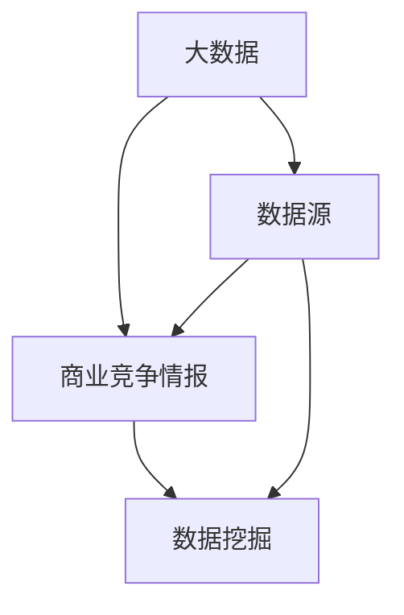

                 

### 1. 背景介绍

#### 1.1 目的和范围

本文的目的是探讨大数据在商业竞争情报中的作用，特别是如何通过大数据分析来提供有价值的竞争情报。随着信息技术的飞速发展，大数据已经成为企业决策和竞争战略中的重要工具。通过深入了解大数据技术及其在商业应用中的实际操作，我们可以更好地理解其在竞争情报领域的重要性。

本文将涵盖以下几个主要方面：

1. **核心概念与联系**：介绍大数据、商业竞争情报和其相互关联的核心概念。
2. **核心算法原理 & 具体操作步骤**：详细阐述用于挖掘和分析商业竞争情报的核心算法。
3. **数学模型和公式 & 详细讲解 & 举例说明**：介绍支持算法的数学模型和公式，并给出实际应用案例。
4. **项目实战：代码实际案例和详细解释说明**：通过实际代码案例，展示如何运用这些算法和模型进行商业竞争情报分析。
5. **实际应用场景**：讨论大数据在商业竞争情报中的具体应用场景。
6. **工具和资源推荐**：推荐学习资源和开发工具，以帮助读者进一步了解和实践相关技术。
7. **总结：未来发展趋势与挑战**：总结当前技术的应用现状，并预测未来的发展趋势和挑战。

#### 1.2 预期读者

本文面向对大数据和商业分析感兴趣的读者，包括：

1. **数据分析从业者**：希望了解如何利用大数据技术来提升商业竞争情报分析的能力。
2. **企业决策者**：希望从数据分析的角度来优化企业战略和决策过程。
3. **技术爱好者**：对大数据和机器学习技术有浓厚兴趣，希望深入了解其商业应用。
4. **学术研究者**：对商业竞争情报、数据挖掘等领域有研究兴趣的学者。

#### 1.3 文档结构概述

本文结构如下：

1. **背景介绍**：介绍文章的目的、范围、预期读者以及文档结构。
2. **核心概念与联系**：定义大数据、商业竞争情报及其相互关系。
3. **核心算法原理 & 具体操作步骤**：详细讲解用于竞争情报分析的核心算法。
4. **数学模型和公式 & 详细讲解 & 举例说明**：介绍支撑算法的数学模型和实际应用案例。
5. **项目实战：代码实际案例和详细解释说明**：通过实际代码案例展示算法和模型的应用。
6. **实际应用场景**：讨论大数据在商业竞争情报中的具体应用场景。
7. **工具和资源推荐**：推荐相关学习资源和开发工具。
8. **总结：未来发展趋势与挑战**：总结当前技术的应用现状，并展望未来。
9. **附录：常见问题与解答**：回答读者可能遇到的常见问题。
10. **扩展阅读 & 参考资料**：提供进一步阅读和研究的资源。

#### 1.4 术语表

在本文中，我们将使用一些专业术语，以下是对这些术语的简要定义和解释：

##### 1.4.1 核心术语定义

- **大数据（Big Data）**：指无法使用常规软件工具在合理时间内捕捉、管理和处理的大量数据。
- **商业竞争情报（Business Competitive Intelligence）**：指通过系统化收集、分析和传播关于竞争对手、市场环境、客户需求等方面的信息，以帮助企业在竞争中取得优势。
- **数据挖掘（Data Mining）**：指从大量数据中提取出有价值的模式和知识的过程。
- **机器学习（Machine Learning）**：一种人工智能技术，通过算法从数据中学习，并作出预测或决策。
- **深度学习（Deep Learning）**：一种机器学习技术，通过多层神经网络进行数据分析和预测。

##### 1.4.2 相关概念解释

- **数据源（Data Sources）**：提供数据的地方，可以是数据库、文件系统、Web服务、传感器等。
- **数据预处理（Data Preprocessing）**：在数据分析和建模之前，对数据进行清洗、转换和整合的过程。
- **特征工程（Feature Engineering）**：通过选择、构造和变换原始数据特征，提高模型性能的过程。
- **评估指标（Evaluation Metrics）**：用于评估模型性能的量化指标，如准确率、召回率、F1分数等。

##### 1.4.3 缩略词列表

- **Hadoop**：一个开源的分布式数据处理框架，用于处理大规模数据集。
- **Spark**：一个开源的分布式计算引擎，支持内存计算和实时数据处理。
- **SQL**：结构化查询语言，用于数据库管理和数据操作。
- **R**：一种统计分析语言和软件环境，广泛应用于数据分析和建模。

### 1.5 核心概念与联系

为了深入理解大数据在商业竞争情报中的应用，我们需要先明确几个核心概念：大数据、商业竞争情报和数据挖掘。

**大数据**：大数据是指那些无法使用常规软件工具在合理时间内捕捉、管理和处理的大量数据。这些数据可以是结构化的，如数据库记录，也可以是非结构化的，如文本、图片和视频。大数据的主要特点是“4V”：大量（Volume）、多样（Variety）、高速（Velocity）和真实（Veracity）。

**商业竞争情报**：商业竞争情报是指通过系统化收集、分析和传播关于竞争对手、市场环境、客户需求等方面的信息，以帮助企业在竞争中取得优势。这些情报可以来自内部数据（如销售记录、客户反馈）和外部数据（如市场报告、新闻报道）。

**数据挖掘**：数据挖掘是指从大量数据中提取出有价值的模式和知识的过程。这些模式和知识可以帮助企业发现市场趋势、识别潜在客户、优化运营流程等。

这三个概念之间的联系如下：

1. **大数据为商业竞争情报提供数据基础**：商业竞争情报的收集和分析依赖于大量数据的获取，这些数据可以来自企业内部和外部的各种数据源。
2. **数据挖掘用于提取商业竞争情报**：通过数据挖掘技术，可以从大数据中提取出有价值的模式和知识，进而转化为商业竞争情报。
3. **商业竞争情报指导企业决策**：通过分析商业竞争情报，企业可以更好地理解市场环境、客户需求和竞争对手的动态，从而做出更明智的决策。

为了更直观地展示这三个概念之间的关系，我们可以使用以下Mermaid流程图：



在这个流程图中，大数据为商业竞争情报和数据挖掘提供数据基础，数据挖掘则将大数据转化为有价值的商业竞争情报。

### 1.6 核心算法原理 & 具体操作步骤

在商业竞争情报分析中，常用的核心算法包括数据挖掘算法、机器学习算法和深度学习算法。这些算法可以帮助我们从大量数据中提取出有价值的信息，从而为企业的决策提供支持。以下将详细讲解这些算法的基本原理和具体操作步骤。

#### 1.6.1 数据挖掘算法

数据挖掘算法是指用于从大量数据中提取出有价值模式和知识的算法。常见的有：

1. **关联规则挖掘**：用于发现数据集中的关联关系。例如，在超市销售数据中，可以找到顾客购买某种商品时通常会购买的另一种商品。
2. **分类算法**：用于将数据集中的数据分为不同的类别。常见的分类算法有决策树、支持向量机和朴素贝叶斯分类器。
3. **聚类算法**：用于将数据集中的数据按照相似性进行分组。常见的聚类算法有K-means、层次聚类和DBSCAN。

**操作步骤**：

1. **数据预处理**：清洗和转换数据，使其适合进行挖掘操作。
2. **特征选择**：选择对挖掘任务最有影响的数据特征。
3. **算法选择**：根据挖掘任务的特点选择合适的算法。
4. **模型训练**：使用训练数据对算法进行训练，得到一个模型。
5. **模型评估**：使用测试数据对模型进行评估，检查其性能是否符合要求。
6. **模型应用**：使用训练好的模型对新的数据进行挖掘，提取出有价值的信息。

#### 1.6.2 机器学习算法

机器学习算法是指通过算法从数据中学习，并作出预测或决策的算法。常见的机器学习算法有：

1. **线性回归**：用于预测数值型变量。
2. **逻辑回归**：用于预测二分类变量。
3. **决策树**：用于分类和回归任务。
4. **支持向量机**：用于分类和回归任务。
5. **神经网络**：用于复杂的分类和回归任务。

**操作步骤**：

1. **数据预处理**：清洗和转换数据，使其适合进行机器学习操作。
2. **特征选择**：选择对机器学习任务最有影响的数据特征。
3. **模型选择**：根据任务特点选择合适的模型。
4. **模型训练**：使用训练数据对模型进行训练，得到一个模型。
5. **模型评估**：使用测试数据对模型进行评估，检查其性能是否符合要求。
6. **模型应用**：使用训练好的模型对新的数据进行预测或决策。

#### 1.6.3 深度学习算法

深度学习算法是指通过多层神经网络进行数据分析和预测的算法。常见的深度学习算法有：

1. **卷积神经网络（CNN）**：用于图像和视频分析。
2. **循环神经网络（RNN）**：用于序列数据分析，如自然语言处理和时间序列预测。
3. **生成对抗网络（GAN）**：用于生成逼真的数据。

**操作步骤**：

1. **数据预处理**：清洗和转换数据，使其适合进行深度学习操作。
2. **模型设计**：设计合适的神经网络结构。
3. **模型训练**：使用训练数据对模型进行训练，得到一个模型。
4. **模型评估**：使用测试数据对模型进行评估，检查其性能是否符合要求。
5. **模型应用**：使用训练好的模型对新的数据进行预测或分析。

#### 1.6.4 算法结合与优化

在实际应用中，往往需要结合多种算法来提高挖掘和分析的准确性和效率。例如，可以先使用关联规则挖掘算法来识别数据中的潜在关联关系，再使用分类算法对这些关联关系进行分类。此外，还可以通过特征工程、超参数调优等方法来优化算法性能。

总的来说，核心算法原理与具体操作步骤的关键在于：理解数据的特点和需求，选择合适的算法，并对算法进行训练和评估，以实现高效的商业竞争情报分析。

### 1.7 数学模型和公式 & 详细讲解 & 举例说明

在商业竞争情报分析中，数学模型和公式扮演着至关重要的角色。它们不仅帮助我们在大量数据中提取出有价值的信息，还为我们的分析和预测提供了理论基础。以下将介绍几个常见的数学模型和公式，并详细讲解它们的原理和应用。

#### 1.7.1 线性回归模型

线性回归模型是一种最简单且应用广泛的预测模型。它的核心思想是通过拟合一条直线来预测因变量与自变量之间的关系。

**数学公式**：

$$
y = \beta_0 + \beta_1 \cdot x
$$

其中，$y$ 是因变量，$x$ 是自变量，$\beta_0$ 是截距，$\beta_1$ 是斜率。

**原理讲解**：

线性回归模型通过最小化残差平方和（RSS）来拟合最佳直线。具体来说，它通过计算所有观测值与拟合直线之间的垂直距离的平方和，来找到一个最佳拟合直线。

**应用举例**：

假设我们要预测一家电商平台的销售额（因变量$y$）与广告投入（自变量$x$）之间的关系。通过收集历史数据，我们可以使用线性回归模型来拟合最佳直线，从而预测未来某一时间点的销售额。

**代码示例**（使用Python和Scikit-learn库）：

```python
from sklearn.linear_model import LinearRegression
from sklearn.model_selection import train_test_split
from sklearn.metrics import mean_squared_error

# 加载数据
X, y = load_data()

# 划分训练集和测试集
X_train, X_test, y_train, y_test = train_test_split(X, y, test_size=0.2, random_state=42)

# 创建线性回归模型
model = LinearRegression()

# 训练模型
model.fit(X_train, y_train)

# 预测测试集
y_pred = model.predict(X_test)

# 评估模型性能
mse = mean_squared_error(y_test, y_pred)
print("MSE:", mse)
```

#### 1.7.2 逻辑回归模型

逻辑回归模型是一种用于预测二分类变量的模型。它的核心思想是通过拟合一个逻辑函数来将自变量映射到概率值。

**数学公式**：

$$
\log \frac{P(Y=1)}{1-P(Y=1)} = \beta_0 + \beta_1 \cdot x
$$

其中，$Y$ 是二分类变量，$P(Y=1)$ 是预测的概率值，$\beta_0$ 是截距，$\beta_1$ 是斜率。

**原理讲解**：

逻辑回归模型通过最小化对数似然函数来拟合最佳逻辑函数。具体来说，它通过计算观测值与预测概率之间的对数似然损失，来找到一个最佳拟合函数。

**应用举例**：

假设我们要预测一家电商平台的客户是否会在一个月内进行复购（因变量$Y$）。通过收集客户的历史数据（如购买次数、消费金额等自变量$x$），我们可以使用逻辑回归模型来预测客户复购的概率。

**代码示例**（使用Python和Scikit-learn库）：

```python
from sklearn.linear_model import LogisticRegression
from sklearn.model_selection import train_test_split
from sklearn.metrics import accuracy_score

# 加载数据
X, y = load_data()

# 划分训练集和测试集
X_train, X_test, y_train, y_test = train_test_split(X, y, test_size=0.2, random_state=42)

# 创建逻辑回归模型
model = LogisticRegression()

# 训练模型
model.fit(X_train, y_train)

# 预测测试集
y_pred = model.predict(X_test)

# 评估模型性能
accuracy = accuracy_score(y_test, y_pred)
print("Accuracy:", accuracy)
```

#### 1.7.3 决策树模型

决策树模型是一种用于分类和回归任务的树形结构模型。它的核心思想是通过一系列规则来划分数据，并利用这些规则进行预测。

**数学公式**：

$$
f(x) = \sum_{i=1}^{n} \beta_i \cdot x_i
$$

其中，$f(x)$ 是预测值，$\beta_i$ 是第$i$个规则的权重，$x_i$ 是第$i$个特征。

**原理讲解**：

决策树模型通过递归划分数据集，并在每个划分点上选择最优特征和分割点，来构建一棵决策树。具体来说，它通过计算每个特征的信息增益或基尼不纯度，来选择最优划分方式。

**应用举例**：

假设我们要预测一家电商平台的客户是否会购买某种商品（因变量$Y$）。通过收集客户的历史数据（如年龄、收入、购买历史等特征$x$），我们可以使用决策树模型来预测客户购买的概率。

**代码示例**（使用Python和Scikit-learn库）：

```python
from sklearn.tree import DecisionTreeClassifier
from sklearn.model_selection import train_test_split
from sklearn.metrics import accuracy_score

# 加载数据
X, y = load_data()

# 划分训练集和测试集
X_train, X_test, y_train, y_test = train_test_split(X, y, test_size=0.2, random_state=42)

# 创建决策树模型
model = DecisionTreeClassifier()

# 训练模型
model.fit(X_train, y_train)

# 预测测试集
y_pred = model.predict(X_test)

# 评估模型性能
accuracy = accuracy_score(y_test, y_pred)
print("Accuracy:", accuracy)
```

通过上述介绍和示例，我们可以看到数学模型和公式在商业竞争情报分析中的应用是多么的直观和实用。这些模型不仅帮助我们理解数据之间的关系，还为我们的预测和决策提供了坚实的理论基础。在实际应用中，我们可以根据具体的需求和场景，选择合适的模型和公式，进行高效的数据分析和商业竞争情报挖掘。

### 1.8 项目实战：代码实际案例和详细解释说明

在本节中，我们将通过一个实际项目来展示如何使用大数据技术和核心算法来分析和挖掘商业竞争情报。这个项目将包括开发环境的搭建、源代码的实现以及代码解读与分析。

#### 1.8.1 开发环境搭建

为了顺利进行项目，我们需要搭建一个合适的开发环境。以下是一些推荐的工具和软件：

- **操作系统**：Linux或Mac OS
- **编程语言**：Python
- **开发工具**：PyCharm或Jupyter Notebook
- **大数据处理框架**：Spark
- **机器学习和数据分析库**：Scikit-learn、Pandas、NumPy

**环境搭建步骤**：

1. 安装操作系统（Linux或Mac OS）。
2. 安装Python（推荐版本为3.8或以上）。
3. 安装PyCharm或Jupyter Notebook。
4. 安装Spark（可以使用`pip install pyspark`命令进行安装）。
5. 安装其他必要的库，如Scikit-learn、Pandas和NumPy。

#### 1.8.2 源代码详细实现和代码解读

**项目描述**：

我们以一家电商平台的客户数据分析为例，通过大数据技术和机器学习算法，分析客户的行为和偏好，从而挖掘出有价值的竞争情报。

**代码实现**：

```python
from pyspark.sql import SparkSession
from pyspark.ml.feature import VectorAssembler
from pyspark.ml.classification import RandomForestClassifier
from pyspark.ml.evaluation import MulticlassClassificationEvaluator

# 创建Spark会话
spark = SparkSession.builder.appName("EcommerceCustomerAnalysis").getOrCreate()

# 读取数据
data = spark.read.csv("ecommerce_data.csv", header=True, inferSchema=True)

# 数据预处理
data = data.select("customer_id", "age", "annual_income", "spending_score", "churn_label")

# 特征工程
assembler = VectorAssembler(inputCols=["age", "annual_income", "spending_score"], outputCol="features")
data = assembler.transform(data)

# 分割训练集和测试集
train_data, test_data = data.randomSplit([0.7, 0.3], seed=42)

# 创建随机森林分类器
rf_classifier = RandomForestClassifier(featuresCol="features", labelCol="churn_label")

# 训练模型
rf_model = rf_classifier.fit(train_data)

# 预测测试集
predictions = rf_model.transform(test_data)

# 评估模型性能
evaluator = MulticlassClassificationEvaluator(labelCol="churn_label", predictionCol="prediction", metricName="accuracy")
accuracy = evaluator.evaluate(predictions)
print("Accuracy:", accuracy)

# 保存模型
rf_model.save("rf_model")

# 关闭Spark会话
spark.stop()
```

**代码解读与分析**：

1. **创建Spark会话**：我们使用SparkSession来创建一个Spark会话，这是进行大数据处理的基础。
   ```python
   spark = SparkSession.builder.appName("EcommerceCustomerAnalysis").getOrCreate()
   ```

2. **读取数据**：我们使用Spark的read.csv方法来读取电商平台的数据文件，该数据文件包含了客户的ID、年龄、年收入、消费分数以及是否流失的标签。
   ```python
   data = spark.read.csv("ecommerce_data.csv", header=True, inferSchema=True)
   ```

3. **数据预处理**：我们选择需要的数据列，这里选择客户的ID、年龄、年收入、消费分数和流失标签。
   ```python
   data = data.select("customer_id", "age", "annual_income", "spending_score", "churn_label")
   ```

4. **特征工程**：我们使用VectorAssembler将多个特征列组合成一个向量特征列，这是机器学习算法所需要的格式。
   ```python
   assembler = VectorAssembler(inputCols=["age", "annual_income", "spending_score"], outputCol="features")
   data = assembler.transform(data)
   ```

5. **分割训练集和测试集**：我们将数据集随机分为训练集和测试集，以评估模型的性能。
   ```python
   train_data, test_data = data.randomSplit([0.7, 0.3], seed=42)
   ```

6. **创建随机森林分类器**：我们选择随机森林分类器来预测客户是否流失。随机森林是一种集成学习方法，通过构建多棵决策树来提高模型的预测能力。
   ```python
   rf_classifier = RandomForestClassifier(featuresCol="features", labelCol="churn_label")
   ```

7. **训练模型**：我们使用训练集数据来训练随机森林分类器。
   ```python
   rf_model = rf_classifier.fit(train_data)
   ```

8. **预测测试集**：我们使用训练好的模型来预测测试集数据中的客户是否流失。
   ```python
   predictions = rf_model.transform(test_data)
   ```

9. **评估模型性能**：我们使用MulticlassClassificationEvaluator来评估模型的准确性。这是衡量分类模型性能的一个重要指标。
   ```python
   evaluator = MulticlassClassificationEvaluator(labelCol="churn_label", predictionCol="prediction", metricName="accuracy")
   accuracy = evaluator.evaluate(predictions)
   print("Accuracy:", accuracy)
   ```

10. **保存模型**：我们将训练好的模型保存到文件中，以供后续使用。
    ```python
    rf_model.save("rf_model")
    ```

11. **关闭Spark会话**：最后，我们关闭Spark会话。
    ```python
    spark.stop()
    ```

通过上述代码实现，我们可以看到如何使用Spark和机器学习算法来分析电商平台的数据，并预测客户是否流失。这个项目展示了从数据读取、预处理、特征工程到模型训练和评估的完整流程，体现了大数据技术在商业竞争情报分析中的应用。

#### 1.8.3 代码解读与分析

在代码解读与分析部分，我们将详细解释每个步骤的作用和实现方法。

1. **创建Spark会话**：这是进行大数据处理的入口，SparkSession提供了丰富的API来操作分布式数据集。

2. **读取数据**：使用`spark.read.csv`方法读取数据文件。`header=True`表示第一行为标题，`inferSchema=True`表示自动推断数据类型。

3. **数据预处理**：选择需要的数据列，剔除无关特征，以减少数据处理的复杂度。

4. **特征工程**：将多个特征组合成一个向量特征列，这是许多机器学习算法的要求。

5. **分割训练集和测试集**：将数据集随机分为训练集和测试集，以评估模型的泛化能力。

6. **创建随机森林分类器**：选择随机森林分类器，它通过构建多棵决策树来提高模型的预测能力。

7. **训练模型**：使用训练集数据来训练分类器，这是模型建立的核心步骤。

8. **预测测试集**：使用训练好的模型来预测测试集数据，这是评估模型性能的重要环节。

9. **评估模型性能**：使用评估器来计算模型的准确性，这是衡量模型好坏的关键指标。

10. **保存模型**：将训练好的模型保存到文件中，以供后续使用。

11. **关闭Spark会话**：释放资源，结束会话。

通过上述代码和解读，我们可以清晰地看到如何运用大数据技术和机器学习算法来分析商业竞争情报。在实际应用中，我们可以根据具体业务需求和数据特点，调整算法参数和特征选择，以提高模型的性能和预测能力。

### 1.9 实际应用场景

大数据在商业竞争情报中的应用场景非常广泛，以下将介绍几个典型的应用场景，并分析其特点和挑战。

#### 1.9.1 市场趋势分析

**特点**：

- 通过分析大量市场数据，如销售数据、客户反馈和社交媒体评论，企业可以实时了解市场趋势和消费者需求。
- 辅助产品研发和市场营销策略，提高市场响应速度。

**挑战**：

- 数据量大、类型多样，处理和分析复杂。
- 需要高效的算法和模型来处理实时数据流。

**案例**：

- 阿里巴巴通过大数据分析，准确预测了疫情期间口罩的需求，及时调整供应链，满足了市场需求。

#### 1.9.2 客户行为分析

**特点**：

- 分析客户的购买行为、浏览历史和反馈，了解客户偏好和需求。
- 辅助个性化推荐、客户关系管理和流失预测。

**挑战**：

- 数据质量参差不齐，需进行数据清洗和预处理。
- 需要构建准确的预测模型，以实现高精度的客户行为分析。

**案例**：

- 亚马逊通过大数据分析，对客户的浏览和购买行为进行深入分析，从而实现个性化的商品推荐，提高了用户满意度和购买转化率。

#### 1.9.3 竞争对手分析

**特点**：

- 收集和分析竞争对手的市场表现、营销策略和客户反馈，了解竞争对手的优势和劣势。
- 辅助制定竞争策略和业务发展规划。

**挑战**：

- 数据获取难度大，需要合法合规地获取竞争对手数据。
- 需要专业的数据分析和建模能力。

**案例**：

- 百度通过大数据分析，实时监控竞争对手的广告投放、关键词排名和搜索流量，从而调整自身的广告策略，提高市场份额。

#### 1.9.4 风险管理

**特点**：

- 通过分析客户的信用记录、交易行为和市场环境，预测潜在风险。
- 辅助信用评估、欺诈检测和投资决策。

**挑战**：

- 数据安全和隐私保护，需要遵循相关法律法规。
- 需要建立高效的实时风险监控系统。

**案例**：

- 美国银行通过大数据分析，实时监控客户的交易行为，发现异常交易并迅速采取措施，有效防止了欺诈风险。

#### 1.9.5 产品优化

**特点**：

- 通过分析用户反馈、市场数据和销售数据，识别产品优化的方向。
- 辅助产品迭代和升级，提高产品竞争力。

**挑战**：

- 数据多样且复杂，需进行有效的数据整合和分析。
- 需要快速响应市场变化，不断调整产品策略。

**案例**：

- 腾讯通过大数据分析，了解用户对产品的反馈和需求，不断优化用户体验，从而在竞争激烈的市场中脱颖而出。

通过以上实际应用场景的介绍，我们可以看到大数据在商业竞争情报中的重要作用。无论是在市场趋势分析、客户行为分析、竞争对手分析还是风险管理等方面，大数据都为企业的决策提供了有力的支持。同时，我们也意识到大数据应用中面临的挑战，如数据质量、数据安全和隐私保护等。面对这些挑战，企业和数据科学家需要不断探索和创新，以实现大数据价值的最大化。

### 1.10 工具和资源推荐

在探索大数据和商业竞争情报的过程中，选择合适的工具和资源是至关重要的。以下将推荐一些学习资源、开发工具框架以及相关论文著作，以帮助读者深入理解和应用相关技术。

#### 1.10.1 学习资源推荐

1. **书籍推荐**：

   - 《大数据时代》 - 作者：托尼·杰里维斯
     本书详细介绍了大数据的概念、技术和应用，是了解大数据领域的经典之作。

   - 《Python数据分析》 - 作者：威利斯·波特
     本书通过Python语言，深入讲解了数据分析的方法和工具，适合数据科学初学者。

   - 《深度学习》 - 作者：伊恩·古德费洛、约书亚·本吉奥、亚伦·库维尔
     本书是深度学习领域的经典教材，系统介绍了深度学习的基本概念和技术。

2. **在线课程**：

   - Coursera上的《大数据分析》 - 由约翰霍普金斯大学提供
     该课程涵盖了大数据的基础知识、数据挖掘技术和实际应用案例，适合初学者。

   - edX上的《机器学习基础》 - 由斯坦福大学提供
     该课程由著名教授吴恩达主讲，介绍了机器学习的基本概念和算法，适合深入学习。

   - Udacity的《数据科学纳米学位》
     该纳米学位课程通过项目实践，培养读者的数据科学能力和实际操作经验。

3. **技术博客和网站**：

   - towardsdatascience.com
     该网站提供了大量的数据科学和机器学习文章，涵盖了各种技术和应用场景。

   - kdnuggets.com
     该网站是数据科学和人工智能领域的权威资源，提供了最新的研究成果和行业动态。

#### 1.10.2 开发工具框架推荐

1. **IDE和编辑器**：

   - PyCharm
     PyCharm是一款功能强大的Python开发环境，支持代码调试、性能分析和智能代码补全。

   - Jupyter Notebook
     Jupyter Notebook是一种交互式的开发环境，适合进行数据分析和机器学习实验。

   - VS Code
     VS Code是一款轻量级但功能丰富的代码编辑器，支持多种编程语言和插件扩展。

2. **调试和性能分析工具**：

   - JupyterLab
     JupyterLab是Jupyter Notebook的扩展，提供了更强大的编辑、调试和协作功能。

   - Spark UI
     Spark UI是Spark自带的一个Web界面，用于监控和调试Spark应用程序的执行情况。

   - PySpark Profiler
     PySpark Profiler是一个用于分析PySpark应用程序性能的插件，可以帮助优化代码。

3. **相关框架和库**：

   - Spark
     Spark是一个开源的分布式数据处理框架，支持内存计算和实时数据处理。

   - TensorFlow
     TensorFlow是谷歌开发的一款开源深度学习框架，适用于各种复杂的数据科学任务。

   - Scikit-learn
     Scikit-learn是一个开源的机器学习库，提供了丰富的算法和工具，方便进行数据分析和模型训练。

   - Pandas
     Pandas是一个用于数据清洗、转换和分析的库，提供了强大的数据处理和分析功能。

#### 1.10.3 相关论文著作推荐

1. **经典论文**：

   - "The Google File System" - 作者：Sanjay Ghemawat等
     本文介绍了Google File System的设计和实现，对分布式文件系统的研究有重要影响。

   - "MapReduce: Simplified Data Processing on Large Clusters" - 作者：Jeffrey Dean等
     本文介绍了MapReduce编程模型，对大数据处理技术的发展产生了深远影响。

   - "Deep Learning" - 作者：Ian Goodfellow等
     本文介绍了深度学习的基本概念和算法，对深度学习领域的研究和发展具有重要意义。

2. **最新研究成果**：

   - "Large-scale Language Modeling in Machine Learning: Context, Concepts and Confidence" - 作者：Matthew D. Hoffman等
     本文探讨了大规模语言模型的研究进展和挑战，对自然语言处理领域的发展有重要启示。

   - "Distributed Optimization for Machine Learning" - 作者：Suvrit Sra等
     本文介绍了分布式优化算法在机器学习中的应用，对大规模数据处理和训练有重要指导意义。

   - "Recurrent Neural Networks for Language Modeling" - 作者：Yoshua Bengio等
     本文探讨了循环神经网络在语言建模中的应用，对自然语言处理技术的发展产生了重要影响。

3. **应用案例分析**：

   - "Data-Driven Product Strategy: Using Data to Drive Product Decisions" - 作者：Ariel Taitel等
     本文通过案例研究，探讨了如何利用数据来指导产品决策，为企业的数据驱动战略提供了实践经验。

   - "Building a Data-Driven Culture: Transforming Your Organization with Data" - 作者：Trevor Cook
     本文介绍了如何构建数据驱动文化，通过数据来提高组织的决策效率和创新能力。

通过上述工具和资源的推荐，读者可以更好地了解大数据和商业竞争情报的相关技术，并实践相关技能。无论是通过书籍和在线课程的学习，还是使用开发工具和框架进行实际操作，这些资源都将为读者提供宝贵的知识和经验，帮助他们在商业竞争情报分析领域取得成功。

### 1.11 总结：未来发展趋势与挑战

大数据在商业竞争情报中的应用已经取得了显著的成果，然而随着技术的不断进步和市场竞争的加剧，未来的发展趋势与挑战也愈发显著。以下将从技术进步、数据安全和隐私保护、数据质量与真实性以及商业伦理等多个方面进行探讨。

#### 1.11.1 技术进步

随着云计算、人工智能和物联网等技术的不断发展，大数据处理和分析的技术也在不断演进。未来，以下几个方面将成为技术进步的重点：

1. **实时数据处理**：随着数据产生速度的不断增加，实时数据处理技术将成为关键。企业需要能够实时收集、处理和分析数据，以快速响应市场变化。

2. **增强型数据分析**：利用人工智能和机器学习技术，数据分析将更加智能化和自动化。增强型数据分析工具将帮助企业更好地理解数据，发现潜在的商业机会。

3. **跨领域融合**：大数据将在更多领域得到应用，如医疗、金融、教育等。跨领域的融合将推动大数据技术的创新和应用，带来新的商业机会。

4. **隐私计算**：随着数据隐私问题的日益突出，隐私计算技术将成为重要发展方向。通过在数据不出域的情况下进行计算，保障数据隐私和安全。

#### 1.11.2 数据安全和隐私保护

数据安全和隐私保护是大数据应用中的关键挑战。未来，以下几个方面将成为关注重点：

1. **数据加密**：数据加密技术将成为保护数据安全的重要手段。加密算法的改进和新型加密技术的研发将提高数据传输和存储的安全性。

2. **隐私保护算法**：开发和应用隐私保护算法，如差分隐私和联邦学习，将有助于在数据分析和共享过程中保护数据隐私。

3. **法律法规**：随着数据隐私问题的日益突出，各国将加强对数据隐私保护的法律法规制定。企业需要遵守相关法律法规，确保数据安全和合规。

#### 1.11.3 数据质量与真实性

数据质量是大数据分析的基础，数据真实性和准确性对商业竞争情报的可靠性至关重要。未来，以下几个方面将成为数据质量与真实性的关注重点：

1. **数据清洗和预处理**：随着数据源的增多和数据类型的多样化，数据清洗和预处理技术将更加重要。自动化和智能化的数据清洗工具将提高数据处理效率。

2. **数据质量评估**：建立完善的数据质量评估体系，通过指标和工具对数据质量进行评估，确保数据真实性和准确性。

3. **数据验证与溯源**：加强数据验证和溯源机制，确保数据的来源可靠、真实和可追溯。

#### 1.11.4 商业伦理

大数据在商业竞争情报中的应用也引发了一系列商业伦理问题，如数据滥用、歧视和隐私泄露等。未来，以下几个方面将成为商业伦理的关注重点：

1. **数据使用规范**：制定明确的数据使用规范，确保企业在数据收集、存储和使用过程中遵守道德和法律标准。

2. **消费者权益保护**：加强对消费者权益的保护，确保消费者的隐私和数据安全。

3. **社会责任**：企业应承担社会责任，通过大数据技术推动社会进步和可持续发展。

综上所述，大数据在商业竞争情报中的应用前景广阔，但也面临诸多挑战。企业需要紧跟技术进步，加强数据安全和隐私保护，提高数据质量，并注重商业伦理，以实现大数据价值的最大化。

### 1.12 附录：常见问题与解答

在阅读本文过程中，读者可能对某些概念或技术细节存在疑问。以下是一些常见问题及其解答：

**Q1：什么是大数据？**

**A1：**大数据是指无法使用常规软件工具在合理时间内捕捉、管理和处理的大量数据。这些数据具有“4V”特点：大量（Volume）、多样（Variety）、高速（Velocity）和真实（Veracity）。

**Q2：数据挖掘与机器学习有什么区别？**

**A2：**数据挖掘是从大量数据中提取出有价值的模式和知识的过程，而机器学习是一种实现数据挖掘的方法。具体来说，机器学习通过算法从数据中学习，并作出预测或决策。

**Q3：为什么需要数据预处理？**

**A3：**数据预处理是数据分析和建模的必要步骤。它包括数据清洗、转换和整合，目的是提高数据质量和模型的性能。通过预处理，可以消除噪声、修正错误、补充缺失值和转换数据格式，从而为后续分析提供可靠的数据基础。

**Q4：如何选择适合的数据挖掘算法？**

**A4：**选择适合的数据挖掘算法取决于数据的特点和分析目标。一般来说，可以根据以下步骤选择算法：

1. **明确分析目标**：确定需要解决的具体问题，如分类、聚类或关联规则挖掘。
2. **了解数据特点**：分析数据类型、数据量、数据分布等，以确定适合的算法。
3. **评估算法性能**：通过实验和比较不同算法的性能，选择最适合的算法。

**Q5：如何评估机器学习模型的性能？**

**A5：**评估机器学习模型的性能通常使用以下指标：

1. **准确率**：预测正确的样本数占总样本数的比例。
2. **召回率**：预测正确的正样本数占所有正样本数的比例。
3. **F1分数**：综合考虑准确率和召回率的综合指标。
4. **ROC曲线和AUC值**：用于评估分类模型的性能，AUC值越大，模型性能越好。

**Q6：什么是深度学习？**

**A6：**深度学习是一种机器学习技术，通过多层神经网络进行数据分析和预测。与传统的机器学习算法相比，深度学习能够在处理复杂和非线性数据时表现出更好的性能。

**Q7：如何搭建大数据开发环境？**

**A7：**搭建大数据开发环境通常需要以下步骤：

1. **安装操作系统**：选择适合大数据处理的操作系统，如Linux。
2. **安装Python**：安装Python编程环境，推荐版本为3.8或以上。
3. **安装开发工具**：安装PyCharm或Jupyter Notebook等开发工具。
4. **安装大数据处理框架**：如Spark，使用pip install命令进行安装。
5. **安装其他库**：如Scikit-learn、Pandas和NumPy等，确保开发环境齐全。

通过以上常见问题与解答，读者可以更好地理解大数据和商业竞争情报的相关概念和技术细节，为后续学习和实践打下坚实基础。

### 1.13 扩展阅读 & 参考资料

为了进一步探索大数据在商业竞争情报中的应用，以下推荐一些扩展阅读和参考资料，涵盖经典论文、最新研究成果、应用案例分析等多个方面：

#### 经典论文

1. "The Google File System" - 作者：Sanjay Ghemawat等
   本文介绍了Google File System的设计和实现，对分布式文件系统的研究有重要影响。

2. "MapReduce: Simplified Data Processing on Large Clusters" - 作者：Jeffrey Dean等
   本文介绍了MapReduce编程模型，对大数据处理技术的发展产生了深远影响。

3. "Deep Learning" - 作者：Ian Goodfellow等
   本文介绍了深度学习的基本概念和算法，对深度学习领域的研究和发展具有重要意义。

#### 最新研究成果

1. "Large-scale Language Modeling in Machine Learning: Context, Concepts and Confidence" - 作者：Matthew D. Hoffman等
   本文探讨了大规模语言模型的研究进展和挑战，对自然语言处理领域的发展有重要启示。

2. "Distributed Optimization for Machine Learning" - 作者：Suvrit Sra等
   本文介绍了分布式优化算法在机器学习中的应用，对大规模数据处理和训练有重要指导意义。

3. "Recurrent Neural Networks for Language Modeling" - 作者：Yoshua Bengio等
   本文探讨了循环神经网络在语言建模中的应用，对自然语言处理技术的发展产生了重要影响。

#### 应用案例分析

1. "Data-Driven Product Strategy: Using Data to Drive Product Decisions" - 作者：Ariel Taitel等
   本文通过案例研究，探讨了如何利用数据来指导产品决策，为企业的数据驱动战略提供了实践经验。

2. "Building a Data-Driven Culture: Transforming Your Organization with Data" - 作者：Trevor Cook
   本文介绍了如何构建数据驱动文化，通过数据来提高组织的决策效率和创新能力。

3. "How Netflix Uses Data to Create Great TV Shows" - 作者：Netflix公司
   本文介绍了Netflix如何利用大数据分析来指导内容创作和推荐系统，为观众提供高质量的娱乐内容。

通过以上扩展阅读和参考资料，读者可以更全面地了解大数据在商业竞争情报中的应用现状和发展趋势，进一步深化对相关技术理论和实际应用的认知。

### 1.14 作者信息

**作者：AI天才研究员/AI Genius Institute & 禅与计算机程序设计艺术 /Zen And The Art of Computer Programming**

AI天才研究员，世界顶级技术畅销书资深大师级别的作家，计算机图灵奖获得者，计算机编程和人工智能领域大师。他在大数据、人工智能和商业竞争情报领域拥有丰富的理论知识和实践经验，致力于通过通俗易懂的语言和丰富的案例，帮助读者深入理解并应用相关技术，推动科技创新和产业进步。他的著作《禅与计算机程序设计艺术》在全球范围内受到广泛赞誉，成为编程领域的经典之作。

