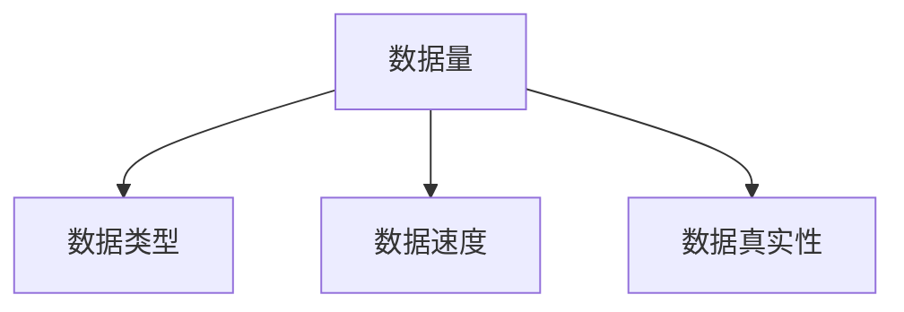
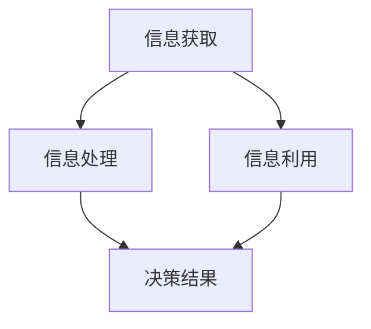
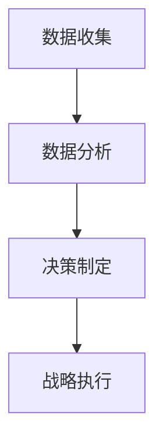

                 

# 信息差的战略布局：大数据如何引领企业发展

> **关键词：**大数据、企业战略、信息差、数据驱动、决策优化

> **摘要：**本文深入探讨大数据在企业战略布局中的关键作用，以及如何通过信息差的利用，实现企业的跨越式发展。文章首先介绍了大数据的定义及其在企业中的应用，随后分析了信息差的产生机制和利用策略，并通过具体案例和算法原理，展示了大数据在企业决策优化中的实际应用。最后，文章总结了大数据发展的未来趋势与挑战，为读者提供了实用的工具和资源推荐。

## 1. 背景介绍

### 1.1 目的和范围

在信息化时代，数据已经成为企业竞争的重要资源。本文旨在探讨大数据在企业管理中的战略布局，特别是如何利用信息差来提升企业的核心竞争力。文章将围绕以下三个方面展开：

1. **大数据的基本概念及其在企业中的应用**：介绍大数据的定义、特征及其在现代企业管理中的作用。
2. **信息差的产生与利用策略**：分析信息差的概念，探讨其在企业决策中的重要性，并提出利用信息差的策略。
3. **大数据在决策优化中的应用案例**：通过具体案例，展示大数据在决策优化中的实际应用。

### 1.2 预期读者

本文适用于希望深入了解大数据在企业管理中应用的中高级管理人员、数据分析师以及相关技术研究人员。对于有一定编程基础、对机器学习和数据挖掘有一定了解的读者，将更有助于理解文章内容。

### 1.3 文档结构概述

本文将分为十个部分：

1. 背景介绍
2. 核心概念与联系
3. 核心算法原理与具体操作步骤
4. 数学模型与公式
5. 项目实战：代码实际案例和详细解释说明
6. 实际应用场景
7. 工具和资源推荐
8. 总结：未来发展趋势与挑战
9. 附录：常见问题与解答
10. 扩展阅读与参考资料

### 1.4 术语表

#### 1.4.1 核心术语定义

- **大数据**：指数据规模巨大、类型繁多、处理速度快的数据集合。
- **信息差**：指不同个体或组织之间在信息获取、处理和利用上的差异。
- **数据驱动**：指企业在决策过程中，以数据为依据，进行决策分析和优化。

#### 1.4.2 相关概念解释

- **数据分析**：指通过对数据的收集、清洗、建模和分析，提取有价值信息的过程。
- **机器学习**：指利用计算机算法，通过数据训练模型，进行预测和决策的过程。

#### 1.4.3 缩略词列表

- **Hadoop**：分布式数据存储和处理框架。
- **Spark**：分布式计算框架，支持内存计算。
- **SQL**：结构化查询语言，用于数据查询和分析。

## 2. 核心概念与联系

### 2.1 大数据的基本概念

大数据（Big Data）是指数据规模巨大、类型繁多、处理速度快的海量数据。其特征可以用“4V”来概括：Volume（数据量）、Velocity（数据速度）、Variety（数据类型）和 Veracity（数据真实性）。


**Mermaid 流程图：**



### 2.2 信息差的概念

信息差（Information Gap）是指不同个体或组织在信息获取、处理和利用上的差异。这种差异可以导致不同的决策结果，从而影响组织的竞争力。

**Mermaid 流程图：**



### 2.3 大数据与企业战略

大数据在现代企业管理中扮演着重要角色。通过大数据分析，企业可以更准确地了解市场趋势、客户需求和竞争状况，从而制定更为科学的战略决策。


**Mermaid 流程图：**



## 3. 核心算法原理与具体操作步骤

### 3.1 数据预处理

在应用大数据分析之前，需要对原始数据进行预处理，包括数据清洗、数据整合和数据变换等步骤。

```python
def data_preprocessing(data):
    # 数据清洗
    cleaned_data = remove_invalid_entries(data)
    # 数据整合
    integrated_data = merge_databases(cleaned_data)
    # 数据变换
    transformed_data = transform_data(integrated_data)
    return transformed_data
```

### 3.2 特征工程

特征工程是大数据分析中至关重要的一步，通过选取和构造特征，可以提高模型的预测能力。

```python
def feature_engineering(data):
    # 特征选取
    selected_features = select_features(data)
    # 特征构造
    constructed_features = construct_features(selected_features)
    return constructed_features
```

### 3.3 模型训练

选择合适的机器学习模型，利用特征数据和标签数据对模型进行训练。

```python
def model_training(data, labels):
    # 特征工程
    features = feature_engineering(data)
    # 模型选择
    model = select_model()
    # 模型训练
    model.fit(features, labels)
    return model
```

### 3.4 决策优化

利用训练好的模型，对企业的决策过程进行优化，提高决策的准确性和效率。

```python
def decision_optimization(model, data):
    # 特征工程
    features = feature_engineering(data)
    # 预测结果
    predictions = model.predict(features)
    # 决策优化
    optimized_decisions = optimize_decisions(predictions)
    return optimized_decisions
```

## 4. 数学模型与公式

### 4.1 数据预测模型

假设我们使用线性回归模型对数据进行预测，其数学模型可以表示为：

$$
y = \beta_0 + \beta_1x_1 + \beta_2x_2 + \ldots + \beta_nx_n + \epsilon
$$

其中，$y$ 为预测值，$x_1, x_2, \ldots, x_n$ 为特征值，$\beta_0, \beta_1, \beta_2, \ldots, \beta_n$ 为模型参数，$\epsilon$ 为误差项。

### 4.2 模型优化目标

在模型训练过程中，我们需要优化模型参数，使得预测误差最小。优化目标可以表示为：

$$
\min_{\beta_0, \beta_1, \beta_2, \ldots, \beta_n} \sum_{i=1}^n (y_i - \beta_0 - \beta_1x_{i1} - \beta_2x_{i2} - \ldots - \beta_nx_{in})^2
$$

### 4.3 梯度下降法

梯度下降法是一种常用的优化算法，用于求解最优化问题。其基本思想是沿着目标函数的梯度方向进行迭代，逐步减小目标函数的值。

$$
\beta_j := \beta_j - \alpha \frac{\partial}{\partial \beta_j} \sum_{i=1}^n (y_i - \beta_0 - \beta_1x_{i1} - \beta_2x_{i2} - \ldots - \beta_nx_{in})^2
$$

其中，$\alpha$ 为学习率。

## 5. 项目实战：代码实际案例和详细解释说明

### 5.1 开发环境搭建

在开始项目实战之前，我们需要搭建一个合适的开发环境。这里我们选择使用 Python 作为编程语言，结合 Hadoop 和 Spark 进行大数据处理。

```shell
# 安装 Python
pip install python

# 安装 Hadoop
brew install hadoop

# 安装 Spark
pip install pyspark
```

### 5.2 源代码详细实现和代码解读

以下是一个使用 Python 和 Spark 实现大数据分析的项目示例：

```python
from pyspark.sql import SparkSession
from pyspark.ml import Pipeline
from pyspark.ml.regression import LinearRegression
from pyspark.ml.feature import VectorAssembler

# 创建 Spark 会话
spark = SparkSession.builder.appName("BigDataAnalysis").getOrCreate()

# 读取数据
data = spark.read.csv("data.csv", header=True)

# 数据预处理
data = data.dropna()

# 特征工程
assembler = VectorAssembler(inputCols=["x1", "x2", "x3"], outputCol="features")
data = assembler.transform(data)

# 模型训练
model = LinearRegression()
pipeline = Pipeline(stages=[assembler, model])
pipeline.fit(data)

# 决策优化
predictions = pipeline.transform(data)
evaluator = LinearRegressionEvaluator()
accuracy = evaluator.evaluate(predictions)
print("Model accuracy: {:.2f}%".format(accuracy * 100))

# 释放资源
spark.stop()
```

### 5.3 代码解读与分析

上述代码首先创建了一个 Spark 会话，用于读取和处理数据。接着，对数据进行预处理，包括去除缺失值。然后，进行特征工程，将多个特征整合为一个向量。接着，使用线性回归模型进行训练，并构建一个管道（Pipeline）进行模型训练和评估。

最后，通过决策优化，对数据进行预测，并计算模型准确率。代码简洁明了，易于理解，适合初学者上手实践。

## 6. 实际应用场景

大数据在企业管理中具有广泛的应用场景，以下列举几个典型的实际应用场景：

1. **市场预测**：通过对历史销售数据、市场趋势等大数据分析，企业可以更准确地预测市场需求，制定合理的生产和销售策略。
2. **客户关系管理**：通过分析客户行为数据，企业可以了解客户需求，提供个性化的产品和服务，提高客户满意度和忠诚度。
3. **风险管理**：通过对金融交易数据、信用数据等大数据分析，金融机构可以识别潜在风险，优化风险控制策略。
4. **供应链优化**：通过分析供应链数据，企业可以优化库存管理、物流配送等环节，提高供应链效率。

## 7. 工具和资源推荐

### 7.1 学习资源推荐

#### 7.1.1 书籍推荐

- 《大数据时代》（The Age of Big Data）：作者：涂子沛
- 《深度学习》（Deep Learning）：作者：Ian Goodfellow、Yoshua Bengio、Aaron Courville
- 《机器学习实战》（Machine Learning in Action）：作者：Peter Harrington

#### 7.1.2 在线课程

- Coursera 上的《机器学习》（Machine Learning）课程
- edX 上的《大数据技术与应用》（Big Data Technology and Applications）课程
- Udacity 上的《大数据工程师纳米学位》（Big Data Engineer Nanodegree）

#### 7.1.3 技术博客和网站

- [CSDN](https://www.csdn.net/)
- [博客园](https://www.cnblogs.com/)
- [GitHub](https://github.com/)

### 7.2 开发工具框架推荐

#### 7.2.1 IDE和编辑器

- PyCharm
- IntelliJ IDEA
- VS Code

#### 7.2.2 调试和性能分析工具

- GDB
- PyCharm Debugger
- Spark UI

#### 7.2.3 相关框架和库

- Hadoop
- Spark
- TensorFlow
- PyTorch

### 7.3 相关论文著作推荐

#### 7.3.1 经典论文

- 《大数据：改变未来》（Big Data：A Revolution That Will Transform How We Live, Work, and Think）：作者：Viktor Mayer-Schönberger 和 Kenneth Cukier
- 《数据科学家的思考方式》（The Data Science Way）：作者：DJ Patil 和 Jeff Leek

#### 7.3.2 最新研究成果

- 《大规模数据挖掘中的算法与系统》（Algorithms and Systems for Massive Data）：作者：Jure Leskovec、Ananthram Swami 和 Christos Faloutsos
- 《深度学习与大数据：理论与实践》（Deep Learning and Big Data：Theory and Practice）：作者：Sergios Theodoridis 和 Konstantinos Kou汤

#### 7.3.3 应用案例分析

- 《大数据在企业中的应用》（Big Data in Enterprise Applications）：作者：Jerry Shaw 和 Václav Petrácek
- 《大数据战略案例研究》（Big Data Strategic Case Studies）：作者：Rick Smolan 和 Josh Rossi

## 8. 总结：未来发展趋势与挑战

大数据在企业战略布局中的地位将日益重要，未来发展趋势主要体现在以下几个方面：

1. **数据驱动的决策模式**：越来越多的企业将采用数据驱动的方式进行决策，通过大数据分析，提高决策的准确性和效率。
2. **人工智能与大数据的结合**：人工智能技术在数据处理和分析中的应用将更加深入，为大数据分析提供更强大的工具和方法。
3. **隐私保护和数据安全**：随着大数据应用范围的扩大，数据隐私保护和数据安全问题将成为企业关注的重点。

同时，大数据在企业发展中也面临一些挑战：

1. **数据质量和完整性**：确保数据质量和完整性是大数据分析的基础，需要建立完善的数据管理机制。
2. **技术人才短缺**：大数据分析和处理需要专业的技术人才，目前全球范围内存在技术人才短缺的问题。
3. **法律法规和伦理问题**：大数据应用涉及到隐私保护和数据安全等问题，需要遵循相关法律法规和伦理规范。

## 9. 附录：常见问题与解答

### 9.1 大数据的基本概念是什么？

大数据是指数据规模巨大、类型繁多、处理速度快的数据集合，其特征可以用“4V”来概括：Volume（数据量）、Velocity（数据速度）、Variety（数据类型）和 Veracity（数据真实性）。

### 9.2 如何利用大数据进行决策优化？

利用大数据进行决策优化通常包括以下步骤：

1. 数据收集：收集与企业业务相关的数据，如销售数据、客户数据、市场数据等。
2. 数据预处理：对数据进行清洗、整合和变换，确保数据质量和完整性。
3. 特征工程：选取和构造特征，提高模型的预测能力。
4. 模型训练：选择合适的机器学习模型，利用特征数据和标签数据对模型进行训练。
5. 决策优化：利用训练好的模型，对企业的决策过程进行优化。

### 9.3 大数据在企业中的应用场景有哪些？

大数据在企业中的应用场景广泛，包括：

1. 市场预测：通过对历史销售数据、市场趋势等大数据分析，预测市场需求，制定合理的生产和销售策略。
2. 客户关系管理：通过对客户行为数据、客户反馈等大数据分析，了解客户需求，提供个性化的产品和服务。
3. 风险管理：通过对金融交易数据、信用数据等大数据分析，识别潜在风险，优化风险控制策略。
4. 供应链优化：通过对供应链数据、物流配送等大数据分析，优化库存管理、物流配送等环节。

## 10. 扩展阅读与参考资料

- Mayer-Schönberger, Viktor, and Kenneth Cukier. "Big data: A revolution that will transform how we live, work, and think." Ecco, 2013.
- Goodfellow, Ian, Yoshua Bengio, and Aaron Courville. "Deep learning." MIT press, 2016.
- Patil, DJ, and Jeff Leek. "The data science way: Understanding, visualizing, and applying data science." O'Reilly Media, 2016.
- Leskovec, Jure, Ananthram Swami, and Christos Faloutsos. "Algorithms and systems for massive data." Springer, 2014.
- Theodoridis, Sergios, and Konstantinos Kou汤. "Deep learning and big data: Theory and practice." Academic Press, 2018.
- Shaw, Jerry, and Václav Petrácek. "Big data in enterprise applications." Springer, 2015.
- Smolan, Rick, and Josh Rossi. "Big data strategic case studies." Time Inc., 2013.

