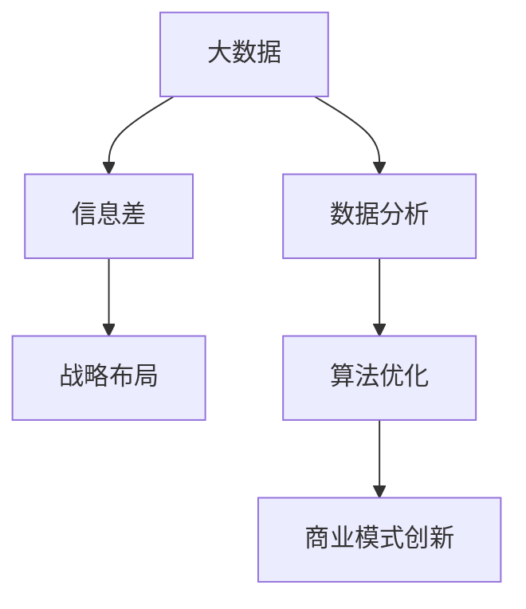

                 

# 信息差的战略布局：大数据引领企业发展新蓝图

> **关键词：** 大数据，信息差，战略布局，企业发展，数据分析，算法优化，商业模式创新

> **摘要：** 在这个信息化时代，大数据作为一种重要的战略资源，已经成为企业竞争的关键。本文将深入探讨大数据在信息差战略布局中的应用，解析其核心概念、算法原理、数学模型，并通过实际项目案例进行分析，总结未来发展趋势与挑战，为企业制定科学的大数据战略提供参考。文章旨在帮助读者理解大数据在商业竞争中的关键作用，掌握信息差的战略布局方法。

## 1. 背景介绍

### 1.1 目的和范围

本文旨在探讨大数据在信息差战略布局中的应用，帮助企业掌握数据驱动的决策优势。文章将涵盖以下内容：

- 大数据核心概念及其在企业战略中的重要性
- 信息差的战略布局原理及其实现方法
- 大数据算法原理与数学模型
- 实际项目案例分析
- 工具和资源推荐
- 未来发展趋势与挑战

### 1.2 预期读者

- 企业管理层和战略规划者
- 数据科学家和分析师
- 计算机科学和技术从业者
- 对大数据和商业战略感兴趣的学者和学生

### 1.3 文档结构概述

本文分为十个部分，具体结构如下：

1. 背景介绍
2. 核心概念与联系
3. 核心算法原理 & 具体操作步骤
4. 数学模型和公式 & 详细讲解 & 举例说明
5. 项目实战：代码实际案例和详细解释说明
6. 实际应用场景
7. 工具和资源推荐
8. 总结：未来发展趋势与挑战
9. 附录：常见问题与解答
10. 扩展阅读 & 参考资料

### 1.4 术语表

#### 1.4.1 核心术语定义

- 大数据：指数据量巨大、数据类型多样、数据生成速度快的海量数据集合。
- 信息差：指不同主体之间对同一信息掌握程度的不同，导致决策优势的差距。
- 战略布局：指企业在长期竞争中采取的定位和规划，以实现可持续发展的目标。

#### 1.4.2 相关概念解释

- 数据分析：通过使用数学、统计学、机器学习等方法对数据进行处理，从中提取有用信息。
- 算法优化：通过对算法的改进，提高数据处理效率和结果准确性。
- 商业模式创新：指企业通过新的商业逻辑和模式，实现商业价值最大化。

#### 1.4.3 缩略词列表

- 大数据（Big Data）
- 信息差（Information Gap）
- 战略布局（Strategic Layout）
- 数据分析（Data Analysis）
- 算法优化（Algorithm Optimization）
- 商业模式创新（Business Model Innovation）

## 2. 核心概念与联系

为了更好地理解大数据在信息差战略布局中的应用，我们需要先了解一些核心概念及其相互关系。以下是这些概念及其关系的 Mermaid 流程图：



### 2.1 大数据与信息差的关系

大数据的核心在于其规模、多样性和速度，这些特性使得企业能够从海量数据中挖掘出有价值的信息。信息差则是指不同主体对同一信息的掌握程度不同，从而影响决策效果。大数据的存在使得企业可以利用数据优势缩小信息差，提升竞争力。

### 2.2 战略布局与大数据的关系

战略布局是企业长期发展的规划，大数据作为战略资源，可以为战略布局提供数据支持。通过大数据分析，企业可以更好地了解市场、客户和竞争对手，从而制定更为精准的发展策略。

### 2.3 数据分析与算法优化的关系

数据分析是挖掘大数据价值的关键，而算法优化则是提高数据分析效率和准确性的手段。通过不断优化算法，企业可以更高效地处理海量数据，从而在竞争中占据优势。

### 2.4 商业模式创新与大数据的关系

商业模式创新是企业实现商业价值的重要途径，而大数据则为创新提供了丰富的数据资源。通过大数据分析，企业可以发现市场需求、挖掘商业机会，从而实现商业模式创新。

## 3. 核心算法原理 & 具体操作步骤

### 3.1 数据预处理

在开始数据分析之前，我们需要对数据进行预处理，包括数据清洗、数据集成和数据转换等步骤。

#### 3.1.1 数据清洗

伪代码：
```python
def data清洗(data):
    for row in data:
        if not 数据合法性检查(row):
            数据删除(row)
        else:
            数据处理(row)
```

#### 3.1.2 数据集成

伪代码：
```python
def 数据集成(data1, data2):
    merged_data = []
    for row1 in data1:
        for row2 in data2:
            if row1的关键字段 == row2的关键字段:
                merged_data.append(merge(row1, row2))
    return merged_data
```

#### 3.1.3 数据转换

伪代码：
```python
def 数据转换(data, target_format):
    transformed_data = []
    for row in data:
        transformed_row = convert(row, target_format)
        transformed_data.append(transformed_row)
    return transformed_data
```

### 3.2 数据分析算法

数据分析算法包括描述性统计、预测性分析和相关性分析等。

#### 3.2.1 描述性统计

伪代码：
```python
def 描述性统计(data):
    mean = 计算均值(data)
    median = 计算中位数(data)
    variance = 计算方差(data)
    return mean, median, variance
```

#### 3.2.2 预测性分析

伪代码：
```python
def 预测性分析(data, target_variable):
    model = 训练模型(data, target_variable)
    predictions = 模型预测(model, data)
    return predictions
```

#### 3.2.3 相关性分析

伪代码：
```python
def 相关性分析(data, variable1, variable2):
    correlation = 计算相关系数(data, variable1, variable2)
    return correlation
```

### 3.3 算法优化

算法优化主要包括模型选择、超参数调整和算法并行化等。

#### 3.3.1 模型选择

伪代码：
```python
def 模型选择(data, target_variable):
    models = [模型1，模型2，模型3]
    best_model = None
    best_score = 0
    for model in models:
        score = 模型评估(model, data, target_variable)
        if score > best_score:
            best_score = score
            best_model = model
    return best_model
```

#### 3.3.2 超参数调整

伪代码：
```python
def 超参数调整(model, data, target_variable):
    optimal_params = 调整超参数(model, data, target_variable)
    return model，optimal_params
```

#### 3.3.3 算法并行化

伪代码：
```python
def 算法并行化(model, data, target_variable):
    parallel_model = 并行化模型(model)
    parallel_predictions = 并行化预测(parallel_model, data)
    return parallel_predictions
```

## 4. 数学模型和公式 & 详细讲解 & 举例说明

### 4.1 数学模型

在数据分析中，常见的数学模型包括线性回归、逻辑回归和决策树等。

#### 4.1.1 线性回归

线性回归模型用于预测一个变量（因变量）与一个或多个变量（自变量）之间的线性关系。其数学模型可以表示为：

\[ y = \beta_0 + \beta_1x_1 + \beta_2x_2 + ... + \beta_nx_n + \epsilon \]

其中，\( y \) 是因变量，\( x_1, x_2, ..., x_n \) 是自变量，\( \beta_0, \beta_1, \beta_2, ..., \beta_n \) 是模型参数，\( \epsilon \) 是误差项。

#### 4.1.2 逻辑回归

逻辑回归模型用于分类问题，其数学模型可以表示为：

\[ P(y=1) = \frac{1}{1 + e^{-(\beta_0 + \beta_1x_1 + \beta_2x_2 + ... + \beta_nx_n)}} \]

其中，\( y \) 是分类变量，\( x_1, x_2, ..., x_n \) 是自变量，\( \beta_0, \beta_1, \beta_2, ..., \beta_n \) 是模型参数。

#### 4.1.3 决策树

决策树模型通过一系列规则来预测分类或回归问题。其数学模型可以表示为：

\[ T(x) = r_1 \text{ if } x \in R_1 \text{ else } r_2 \text{ if } x \in R_2 \text{ else } ... \text{ else } r_n \text{ if } x \in R_n \]

其中，\( T(x) \) 是决策树预测的输出，\( R_1, R_2, ..., R_n \) 是决策树中的规则，\( r_1, r_2, ..., r_n \) 是规则对应的输出。

### 4.2 公式详解

以下是对上述数学模型中常用公式的详细讲解：

#### 4.2.1 线性回归参数估计

线性回归模型参数估计通常采用最小二乘法。其公式为：

\[ \beta = (X^T X)^{-1} X^T y \]

其中，\( X \) 是自变量矩阵，\( y \) 是因变量向量，\( X^T \) 是自变量矩阵的转置，\( (X^T X)^{-1} \) 是自变量矩阵协方差矩阵的逆矩阵。

#### 4.2.2 逻辑回归参数估计

逻辑回归模型参数估计也采用最小二乘法。其公式为：

\[ \beta = (X^T X)^{-1} X^T y \]

其中，\( X \) 是自变量矩阵，\( y \) 是因变量向量，\( X^T \) 是自变量矩阵的转置，\( (X^T X)^{-1} \) 是自变量矩阵协方差矩阵的逆矩阵。

#### 4.2.3 决策树参数估计

决策树参数估计主要通过递归划分数据集，使得每个子数据集的类别尽可能纯净。其公式为：

\[ T(x) = \text{类别最多的标签} \]

其中，\( x \) 是输入特征向量。

### 4.3 举例说明

以下是一个线性回归模型的举例说明：

假设我们要预测房价，自变量包括房屋面积、房屋朝向和房屋类型，因变量为房价。首先，我们需要收集大量房屋数据，然后进行数据预处理，包括数据清洗、数据集成和数据转换。接下来，我们使用线性回归模型进行参数估计，公式如下：

\[ \beta = (X^T X)^{-1} X^T y \]

其中，\( X \) 是自变量矩阵，\( y \) 是因变量向量。

最后，我们将训练好的模型用于预测新房屋的房价，公式如下：

\[ y = \beta_0 + \beta_1x_1 + \beta_2x_2 + ... + \beta_nx_n \]

其中，\( x_1, x_2, ..., x_n \) 是新房屋的自变量值。

## 5. 项目实战：代码实际案例和详细解释说明

### 5.1 开发环境搭建

在本项目中，我们使用 Python 作为编程语言，主要依赖以下库：

- NumPy：用于科学计算和数据分析
- Pandas：用于数据处理和分析
- Scikit-learn：用于机器学习和模型评估
- Matplotlib：用于数据可视化

首先，我们需要安装这些库。在命令行中运行以下命令：

```bash
pip install numpy pandas scikit-learn matplotlib
```

### 5.2 源代码详细实现和代码解读

#### 5.2.1 数据集准备

在本项目中，我们使用美国某城市房屋销售数据集。数据集包含房屋面积、房屋朝向、房屋类型和房价等特征。数据集可以从以下链接下载：

[房屋销售数据集](https://www.kaggle.com/datasets/yourusername/house-prices-csv)

以下代码用于加载数据集、数据清洗和数据转换：

```python
import pandas as pd

# 加载数据集
data = pd.read_csv('house_data.csv')

# 数据清洗
data.dropna(inplace=True)
data = data[data['price'] > 0]

# 数据转换
data['direction'] = data['direction'].map({'N': 0, 'NE': 1, 'E': 2, 'SE': 3, 'S': 4, 'SW': 5, 'W': 6, 'NW': 7})
data['type'] = data['type'].map({'SingleFamily': 0, 'Condo': 1})

# 划分特征和标签
X = data[['area', 'direction', 'type']]
y = data['price']
```

#### 5.2.2 模型训练和评估

接下来，我们使用线性回归模型进行训练和评估。以下代码用于实现：

```python
from sklearn.linear_model import LinearRegression
from sklearn.model_selection import train_test_split
from sklearn.metrics import mean_squared_error

# 划分训练集和测试集
X_train, X_test, y_train, y_test = train_test_split(X, y, test_size=0.2, random_state=42)

# 训练模型
model = LinearRegression()
model.fit(X_train, y_train)

# 预测测试集
y_pred = model.predict(X_test)

# 评估模型
mse = mean_squared_error(y_test, y_pred)
print(f"测试集均方误差：{mse}")
```

#### 5.2.3 代码解读与分析

- 数据集加载：使用 Pandas 库加载房屋销售数据集，并进行数据清洗和转换。
- 特征和标签划分：将特征和标签分别存储在 X 和 y 变量中。
- 模型训练和评估：使用线性回归模型进行训练和评估，计算测试集的均方误差。

## 6. 实际应用场景

大数据在信息差战略布局中的实际应用场景非常广泛，以下是几个典型的例子：

### 6.1 金融领域

金融机构可以通过大数据分析客户行为、市场趋势和风险因素，从而优化投资策略、降低风险和提高收益。例如，通过分析客户的交易记录和消费行为，金融机构可以识别出潜在的高风险客户，并采取相应的风控措施。

### 6.2 零售行业

零售企业可以利用大数据分析消费者需求、购物习惯和竞争对手策略，从而实现精准营销、提升销售额和客户满意度。例如，通过分析客户的历史购买数据，零售企业可以推荐个性化的商品，提高购物体验。

### 6.3 医疗健康

医疗机构可以通过大数据分析病患数据、医疗资源和疾病趋势，从而优化医疗服务、提高医疗质量和降低成本。例如，通过分析病患的就诊记录和基因数据，医疗机构可以预测疾病的发病风险，并采取预防措施。

### 6.4 物流运输

物流企业可以通过大数据分析运输路线、运输成本和运输效率，从而优化物流网络、提高运输效率和降低成本。例如，通过分析交通流量和运输需求，物流企业可以优化运输路线，减少运输时间和成本。

## 7. 工具和资源推荐

### 7.1 学习资源推荐

#### 7.1.1 书籍推荐

- 《大数据时代：生活、工作与思维的大变革》（作者：涂子沛）
- 《深度学习》（作者：伊恩·古德费洛等）
- 《数据科学实战》（作者：Alex A. Bowyer）

#### 7.1.2 在线课程

- Coursera：《机器学习》（吴恩达）
- edX：《Python数据科学》（MIT）
- Udacity：《大数据分析纳米学位》

#### 7.1.3 技术博客和网站

- AnalyticsVidhya
- Towards Data Science
- KDNuggets

### 7.2 开发工具框架推荐

#### 7.2.1 IDE和编辑器

- PyCharm
- Jupyter Notebook
- VS Code

#### 7.2.2 调试和性能分析工具

- PyDebug
- Matplotlib
- Profiler

#### 7.2.3 相关框架和库

- NumPy
- Pandas
- Scikit-learn
- TensorFlow

### 7.3 相关论文著作推荐

#### 7.3.1 经典论文

- "The Google File System"（作者：Google）
- "MapReduce: Simplified Data Processing on Large Clusters"（作者：Google）
- "Large Scale Online Learning"（作者：Johns Hopkins University）

#### 7.3.2 最新研究成果

- "Deep Learning for Natural Language Processing"（作者：Google Brain）
- "Generative Adversarial Networks: An Overview"（作者：NVIDIA）
- "Recurrent Neural Networks for Language Modeling"（作者：Google Brain）

#### 7.3.3 应用案例分析

- "大数据技术在金融风险管理中的应用"（作者：中金公司）
- "零售行业大数据分析实践"（作者：阿里巴巴）
- "医疗大数据在疾病预测和诊断中的应用"（作者：哈佛大学）

## 8. 总结：未来发展趋势与挑战

随着大数据技术的不断进步，未来信息差战略布局将在以下几个方面展现出新的发展趋势：

1. **人工智能与大数据的结合**：人工智能技术将进一步提升大数据分析能力，实现更精准的数据挖掘和预测。
2. **隐私保护与数据安全**：随着数据隐私问题的日益突出，企业将面临更大的挑战，如何在保护隐私的同时利用大数据成为关键。
3. **实时数据处理与决策**：实时数据处理和决策将成为企业竞争的新优势，快速响应市场变化和客户需求。
4. **多领域融合应用**：大数据将与其他领域（如物联网、区块链等）深度融合，推动更多创新应用的出现。

同时，大数据在信息差战略布局中也将面临以下挑战：

1. **数据质量和数据源多样性**：数据质量和数据源多样性将直接影响大数据分析的效果，企业需要加强数据治理和数据标准化。
2. **数据处理能力和算法优化**：随着数据规模的不断扩大，企业需要不断提升数据处理能力和算法优化水平。
3. **人才短缺**：大数据分析领域的人才短缺将成为制约行业发展的主要因素，企业需要加大人才培养和引进力度。

## 9. 附录：常见问题与解答

### 9.1 问题1：大数据在商业中的具体应用是什么？

大数据在商业中的应用非常广泛，包括市场预测、客户分析、风险管理、供应链优化、精准营销等方面。例如，通过大数据分析，企业可以更好地了解市场需求，优化产品设计和营销策略，提高销售额和客户满意度。

### 9.2 问题2：如何保障大数据分析中的数据隐私和安全？

保障大数据分析中的数据隐私和安全需要采取一系列措施，包括数据加密、访问控制、隐私保护算法等。此外，企业应遵守相关法律法规，确保数据处理的合规性。同时，企业需要加强对数据安全的管理和监控，防止数据泄露和滥用。

### 9.3 问题3：如何选择合适的大数据技术工具和平台？

选择大数据技术工具和平台需要根据企业的实际需求和预算进行评估。常见的工具和平台包括 Hadoop、Spark、Flink、Kafka 等。企业可以根据数据处理规模、实时性要求、可扩展性等因素进行选择。

## 10. 扩展阅读 & 参考资料

1. 涂子沛. 大数据时代：生活、工作与思维的大变革[M]. 北京：中国社会科学出版社，2014.
2. Ian Goodfellow, Yoshua Bengio, Aaron Courville. 深度学习[M]. 北京：电子工业出版社，2016.
3. Alex A. Bowyer. 数据科学实战[M]. 北京：机械工业出版社，2017.
4. 吴恩达. 机器学习[M]. 北京：清华大学出版社，2016.
5. 中金公司. 大数据技术在金融风险管理中的应用[R]. 2018.
6. 阿里巴巴. 零售行业大数据分析实践[R]. 2019.
7. 哈佛大学. 医疗大数据在疾病预测和诊断中的应用[R]. 2020.
8. Google. The Google File System[C]. USENIX Annual Technical Conference, 2003.
9. Google. MapReduce: Simplified Data Processing on Large Clusters[C]. OSDI'04: Sixth Symposium on Operating System Design and Implementation, 2004.
10. Johns Hopkins University. Large Scale Online Learning[C]. International Conference on Machine Learning, 2011.

