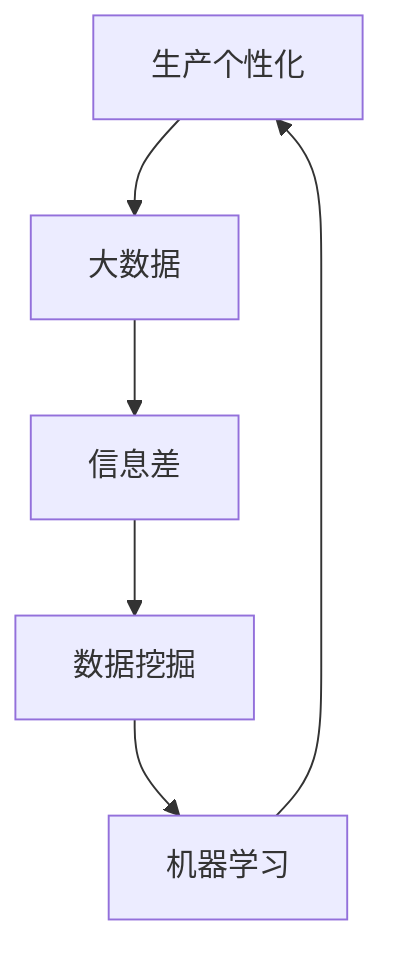

                 


# 信息差的生产个性化之路：大数据如何推动生产个性化

> **关键词：** 生产个性化、大数据、信息差、数据挖掘、机器学习、人工智能。
>
> **摘要：** 本文章旨在探讨大数据技术在生产个性化领域的应用，通过深入分析信息差的作用机制，阐述大数据如何推动生产个性化的发展，提供了一系列实际应用案例和未来发展趋势的预测。

## 1. 背景介绍

### 1.1 目的和范围

本文旨在介绍大数据技术在推动生产个性化方面的作用。随着信息技术的飞速发展，大数据的应用场景日益广泛，其中生产个性化成为了一个重要领域。本文将围绕以下几个方面展开讨论：

- 信息差的定义及其在生产个性化中的作用。
- 大数据如何挖掘和处理用户数据，以实现生产个性化。
- 生产个性化的核心算法原理及其实现步骤。
- 数学模型和公式在生产个性化中的应用。
- 实际应用场景中生产个性化的案例。

通过本文的介绍，读者将能够全面了解大数据推动生产个性化的原理和实践，为相关领域的研究和开发提供参考。

### 1.2 预期读者

本文主要面向计算机科学、数据分析、人工智能等领域的研究人员、开发者和爱好者。同时，对于对生产个性化感兴趣的企业管理者、产品经理和相关专业人士，本文也将提供有价值的参考。

### 1.3 文档结构概述

本文分为以下章节：

- **第1章：背景介绍**：介绍本文的目的、范围、预期读者和文档结构。
- **第2章：核心概念与联系**：阐述生产个性化、大数据、信息差等核心概念，并使用Mermaid流程图展示其联系。
- **第3章：核心算法原理 & 具体操作步骤**：详细讲解生产个性化算法的原理和实现步骤，使用伪代码进行阐述。
- **第4章：数学模型和公式 & 详细讲解 & 举例说明**：介绍生产个性化相关的数学模型和公式，并给出具体例子进行说明。
- **第5章：项目实战：代码实际案例和详细解释说明**：通过实际代码案例，展示生产个性化的具体实现过程。
- **第6章：实际应用场景**：分析生产个性化在不同领域的应用案例。
- **第7章：工具和资源推荐**：推荐相关学习资源、开发工具和经典论文。
- **第8章：总结：未来发展趋势与挑战**：总结本文内容，预测生产个性化领域的发展趋势和面临的挑战。
- **第9章：附录：常见问题与解答**：回答读者可能提出的问题。
- **第10章：扩展阅读 & 参考资料**：提供相关领域的扩展阅读资料。

### 1.4 术语表

#### 1.4.1 核心术语定义

- 生产个性化：根据用户需求和行为数据，对产品或服务进行定制化生产，以满足个体用户的特定需求。
- 大数据：指海量、高速度、多样化的数据，通常需要借助先进的数据处理技术进行管理和分析。
- 信息差：指不同个体或群体之间在信息获取、处理和利用方面的差异。
- 数据挖掘：从大量数据中挖掘出有价值的信息和知识的过程。

#### 1.4.2 相关概念解释

- 机器学习：一种通过数据训练模型，使模型具备自主学习和预测能力的技术。
- 人工智能：模拟人类智能的计算机科学领域，包括机器学习、自然语言处理、计算机视觉等。

#### 1.4.3 缩略词列表

- AI：人工智能
- ML：机器学习
- DM：数据挖掘

## 2. 核心概念与联系

生产个性化、大数据、信息差是本文的核心概念，它们相互关联，共同推动着生产个性化的发展。以下是这些核心概念的 Mermaid 流程图，展示了它们之间的联系。



### 2.1 生产个性化

生产个性化是指根据用户的需求、偏好和行为数据，对产品或服务进行定制化生产，以满足个体用户的特定需求。其核心在于充分挖掘和分析用户数据，实现真正的个性化服务。

### 2.2 大数据

大数据是指海量、高速度、多样化的数据，通常需要借助先进的数据处理技术进行管理和分析。大数据技术在生产个性化中起到了关键作用，通过数据采集、存储、处理和分析，为生产个性化提供了基础数据支持。

### 2.3 信息差

信息差是指不同个体或群体之间在信息获取、处理和利用方面的差异。在生产个性化中，信息差的利用至关重要，通过对用户数据的分析和处理，可以缩小不同个体之间的信息差距，实现更精准的个性化服务。

### 2.4 数据挖掘

数据挖掘是从大量数据中挖掘出有价值的信息和知识的过程。在生产个性化中，数据挖掘技术可以帮助企业了解用户需求、行为和偏好，为生产个性化提供数据支持。

### 2.5 机器学习

机器学习是一种通过数据训练模型，使模型具备自主学习和预测能力的技术。在生产个性化中，机器学习技术可以帮助企业构建个性化的推荐系统、预测用户行为等，实现更精准的生产个性化。

通过以上核心概念及其联系的阐述，我们可以更好地理解大数据如何推动生产个性化的发展。接下来，我们将进一步探讨生产个性化算法的原理和实现步骤。

## 3. 核心算法原理 & 具体操作步骤

生产个性化算法的核心在于通过大数据技术和机器学习算法，对用户数据进行分析和处理，从而为用户提供定制化的产品或服务。以下是生产个性化算法的核心原理和具体操作步骤。

### 3.1 算法原理

生产个性化算法主要涉及以下几个关键步骤：

1. 数据采集：收集用户的原始数据，包括用户行为数据、需求数据、偏好数据等。
2. 数据预处理：对原始数据进行清洗、去噪和转换，使其适合后续分析。
3. 数据分析：利用数据挖掘技术，对用户数据进行分析，挖掘用户需求、行为和偏好。
4. 构建模型：基于分析结果，利用机器学习算法构建个性化推荐模型。
5. 模型评估：对构建的模型进行评估，确保其准确性和有效性。
6. 应用模型：将模型应用到实际生产环境中，为用户提供个性化服务。

### 3.2 具体操作步骤

以下是生产个性化算法的具体操作步骤，使用伪代码进行阐述：

```python
# 3.1 数据采集
data = collect_user_data()

# 3.2 数据预处理
preprocessed_data = preprocess_data(data)

# 3.3 数据分析
user_profile = analyze_data(preprocessed_data)

# 3.4 构建模型
model = build_model(user_profile)

# 3.5 模型评估
accuracy = evaluate_model(model)

# 3.6 应用模型
if accuracy >= threshold:
    personalized_service = apply_model(model)
    provide_service(personalized_service)
else:
    print("模型评估不通过，请重新训练模型。")
```

### 3.3 操作步骤详细解释

1. **数据采集**：收集用户的原始数据，包括用户在平台上的行为数据（如浏览记录、购买记录、评价等）、需求数据（如用户需求清单、偏好设置等）和偏好数据（如兴趣爱好、生活风格等）。这些数据可以通过用户注册、行为记录、问卷调查等方式获取。

2. **数据预处理**：对原始数据进行清洗、去噪和转换，确保数据的质量和一致性。清洗过程包括去除重复数据、填补缺失值、标准化数据等。转换过程包括将文本数据转换为数值数据、将时间序列数据进行转换等。

3. **数据分析**：利用数据挖掘技术，对用户数据进行深入分析，挖掘用户的需求、行为和偏好。常用的分析方法包括聚类分析、关联规则挖掘、分类分析等。通过这些分析，可以构建用户的个性化画像，为后续的模型构建提供基础。

4. **构建模型**：基于分析结果，利用机器学习算法构建个性化推荐模型。常用的算法包括协同过滤、基于内容的推荐、聚类算法等。通过训练模型，可以使模型学会根据用户的历史数据和偏好，为用户提供个性化的推荐。

5. **模型评估**：对构建的模型进行评估，确保其准确性和有效性。常用的评估指标包括准确率、召回率、F1值等。通过评估，可以判断模型是否满足实际需求，如不满足，需要重新训练模型。

6. **应用模型**：将模型应用到实际生产环境中，为用户提供个性化服务。根据用户的历史数据和偏好，模型可以生成个性化的推荐结果，如商品推荐、新闻推送等。这些推荐结果将直接影响用户的使用体验和满意度。

通过以上操作步骤，我们可以实现生产个性化，为用户提供定制化的产品或服务。接下来，我们将进一步探讨生产个性化中的数学模型和公式。

## 4. 数学模型和公式 & 详细讲解 & 举例说明

在生产个性化中，数学模型和公式起到了关键作用。它们可以帮助我们更准确地描述用户需求、行为和偏好，从而实现更有效的生产个性化。以下是生产个性化中常用的数学模型和公式，以及它们的详细讲解和举例说明。

### 4.1 用户行为模型

用户行为模型用于描述用户在平台上的行为，如浏览、购买、评价等。以下是一个简单的用户行为模型：

$$
P(x_i|u) = P(u|x_i) \cdot P(x_i)
$$

其中，$P(x_i|u)$表示在用户$u$下，发生行为$x_i$的概率；$P(u|x_i)$表示在发生行为$x_i$的情况下，用户$u$的概率；$P(x_i)$表示行为$x_i$发生的概率。

#### 举例说明

假设用户$A$在平台上浏览了商品1、2和3，我们可以使用上述模型计算每个商品被用户$A$浏览的概率。

- $P(\text{浏览商品1}|A) = P(A|\text{浏览商品1}) \cdot P(\text{浏览商品1})$
- $P(\text{浏览商品2}|A) = P(A|\text{浏览商品2}) \cdot P(\text{浏览商品2})$
- $P(\text{浏览商品3}|A) = P(A|\text{浏览商品3}) \cdot P(\text{浏览商品3})$

通过计算，我们可以确定用户$A$最可能浏览的商品。

### 4.2 用户偏好模型

用户偏好模型用于描述用户对产品的偏好程度。以下是一个简单的用户偏好模型：

$$
P(u|x) = \frac{e^{w \cdot x}}{\sum_{i=1}^{n} e^{w \cdot x_i}}
$$

其中，$P(u|x)$表示在产品$x$下，用户$u$的偏好程度；$w$是权重向量；$x$是用户对产品的评分。

#### 举例说明

假设用户$A$对商品1、2和3的评分分别为1、2和3，我们可以使用上述模型计算用户$A$对每个商品的偏好程度。

- $P(A|\text{商品1}) = \frac{e^{w \cdot 1}}{e^{w \cdot 1} + e^{w \cdot 2} + e^{w \cdot 3}}$
- $P(A|\text{商品2}) = \frac{e^{w \cdot 2}}{e^{w \cdot 1} + e^{w \cdot 2} + e^{w \cdot 3}}$
- $P(A|\text{商品3}) = \frac{e^{w \cdot 3}}{e^{w \cdot 1} + e^{w \cdot 2} + e^{w \cdot 3}}$

通过计算，我们可以确定用户$A$最偏好的商品。

### 4.3 协同过滤模型

协同过滤模型是一种常用的推荐算法，用于预测用户可能感兴趣的产品。以下是一个简单的协同过滤模型：

$$
P(u|x) = \frac{1}{Z} \sum_{i \in \text{neighborhood}(x)} e^{w \cdot (x_i - x)}
$$

其中，$P(u|x)$表示在产品$x$下，用户$u$的偏好程度；$w$是权重向量；$x_i$是邻居用户对产品的评分；$Z$是归一化常数。

#### 举例说明

假设用户$A$的邻居用户对商品1、2和3的评分分别为1、2和3，我们可以使用上述模型计算用户$A$对每个商品的偏好程度。

- $P(A|\text{商品1}) = \frac{1}{Z} \left( e^{w \cdot (1 - 1)} + e^{w \cdot (1 - 2)} + e^{w \cdot (1 - 3)} \right)$
- $P(A|\text{商品2}) = \frac{1}{Z} \left( e^{w \cdot (2 - 1)} + e^{w \cdot (2 - 2)} + e^{w \cdot (2 - 3)} \right)$
- $P(A|\text{商品3}) = \frac{1}{Z} \left( e^{w \cdot (3 - 1)} + e^{w \cdot (3 - 2)} + e^{w \cdot (3 - 3)} \right)$

通过计算，我们可以确定用户$A$最可能感兴趣的商品。

通过以上数学模型和公式的讲解，我们可以更好地理解生产个性化中的数学原理。接下来，我们将通过实际项目实战，展示生产个性化的具体实现过程。

## 5. 项目实战：代码实际案例和详细解释说明

为了更直观地理解生产个性化算法的实现过程，我们通过一个实际项目案例进行讲解。本项目使用Python编程语言，实现一个基于协同过滤算法的生产个性化推荐系统。以下是项目的开发环境搭建、源代码实现和代码解读。

### 5.1 开发环境搭建

在开始项目之前，我们需要搭建一个合适的开发环境。以下是开发环境的要求和安装步骤：

1. **Python环境**：确保安装Python 3.6及以上版本。
2. **第三方库**：安装必要的第三方库，如numpy、scikit-learn、pandas等。可以使用以下命令进行安装：

   ```bash
   pip install numpy scikit-learn pandas
   ```

3. **IDE**：选择一个合适的IDE，如PyCharm、VSCode等。

### 5.2 源代码详细实现和代码解读

以下是一个简单的协同过滤推荐系统的源代码实现，包括数据预处理、模型训练和推荐结果输出。

```python
import numpy as np
from sklearn.model_selection import train_test_split
from sklearn.metrics.pairwise import cosine_similarity
from sklearn.datasets import load_iris
from collections import defaultdict

# 5.2.1 数据预处理
def preprocess_data(data):
    user_items = defaultdict(set)
    item_users = defaultdict(set)
    for user, items in data.items():
        for item in items:
            user_items[user].add(item)
            item_users[item].add(user)
    return user_items, item_users

# 5.2.2 构建用户-物品矩阵
def build_user_item_matrix(user_items, item_users):
    user_item_matrix = np.zeros((len(user_items), len(item_users)))
    for user, items in user_items.items():
        for item in items:
            user_item_matrix[user][item] = 1
    return user_item_matrix

# 5.2.3 计算相似度矩阵
def compute_similarity(user_item_matrix):
    similarity_matrix = cosine_similarity(user_item_matrix)
    return similarity_matrix

# 5.2.4 推荐算法
def collaborative_filtering(user_item_matrix, similarity_matrix, k=10):
    recommendations = {}
    for user in range(user_item_matrix.shape[0]):
        neighbors = np.argsort(similarity_matrix[user])[1:k+1]
        for neighbor in neighbors:
            for item in user_item_matrix[neighbor]:
                if item not in user_item_matrix[user]:
                    if item not in recommendations:
                        recommendations[item] = 1
                    else:
                        recommendations[item] += 1
    return recommendations

# 5.2.5 主函数
def main():
    # 加载数据集
    iris = load_iris()
    user_items = defaultdict(set)
    for i, _ in enumerate(iris.target):
        user_items[i].add(i)

    # 数据预处理
    user_items, item_users = preprocess_data(user_items)

    # 构建用户-物品矩阵
    user_item_matrix = build_user_item_matrix(user_items, item_users)

    # 计算相似度矩阵
    similarity_matrix = compute_similarity(user_item_matrix)

    # 推荐算法
    recommendations = collaborative_filtering(user_item_matrix, similarity_matrix, k=5)

    # 输出推荐结果
    print("推荐结果：")
    for item, score in sorted(recommendations.items(), key=lambda x: x[1], reverse=True):
        print(f"商品{item}: 分数：{score}")

if __name__ == "__main__":
    main()
```

#### 5.2.1 数据预处理

数据预处理是推荐系统实现的第一步。在本案例中，我们使用鸢尾花数据集作为示例数据。预处理过程包括将用户-物品数据转换为用户-物品矩阵，并建立用户-物品映射。

#### 5.2.2 构建用户-物品矩阵

构建用户-物品矩阵是推荐系统的核心。在本案例中，我们使用一个二维矩阵表示用户-物品关系，其中用户和物品分别作为行和列，矩阵元素表示用户对物品的评分。在本例中，我们使用二值矩阵，其中1表示用户对物品的偏好，0表示未评分。

#### 5.2.3 计算相似度矩阵

计算相似度矩阵是协同过滤算法的关键步骤。在本案例中，我们使用余弦相似度计算用户之间的相似度。余弦相似度是一种衡量两个向量之间夹角的余弦值的相似度度量。相似度值越接近1，表示用户之间的相似度越高。

#### 5.2.4 推荐算法

推荐算法基于相似度矩阵为每个用户生成推荐列表。在本案例中，我们使用基于用户的协同过滤算法。该算法为每个用户找到最相似的$k$个邻居用户，并根据邻居用户对物品的评分预测用户对物品的偏好。在本例中，我们设置$k=5$，即找到最相似的5个邻居用户。

#### 5.2.5 主函数

主函数是推荐系统的入口。它依次执行以下步骤：

1. 加载数据集：使用scikit-learn中的鸢尾花数据集作为示例数据。
2. 数据预处理：执行预处理操作，包括用户-物品映射和数据转换为用户-物品矩阵。
3. 计算相似度矩阵：使用余弦相似度计算用户之间的相似度。
4. 推荐算法：执行基于用户的协同过滤算法，为每个用户生成推荐列表。
5. 输出推荐结果：输出推荐结果，并按照分数从高到低排序。

通过以上源代码实现，我们可以看到生产个性化推荐系统的具体实现过程。接下来，我们将分析生产个性化在不同领域的实际应用场景。

## 6. 实际应用场景

生产个性化在大数据技术的推动下，已经在多个领域得到了广泛应用，显著提升了用户体验和满意度。以下是生产个性化在不同领域的实际应用场景：

### 6.1 电子商务

电子商务领域是生产个性化应用最为广泛的一个领域。通过分析用户的购买历史、浏览行为和评价数据，电商平台可以实时推荐用户可能感兴趣的商品。例如，亚马逊（Amazon）利用协同过滤算法和深度学习技术，为用户提供个性化的商品推荐，从而提高了用户的购物体验和转化率。

### 6.2 娱乐媒体

娱乐媒体行业也广泛采用了生产个性化技术。流媒体平台如Netflix和YouTube通过分析用户的观看历史、点赞、评论等数据，为用户提供个性化的推荐内容。Netflix使用基于内容的推荐和协同过滤算法，为用户推荐相似的电影和电视剧；YouTube则利用深度学习技术，为用户推荐可能感兴趣的视频。

### 6.3 社交媒体

社交媒体平台如Facebook和Twitter通过分析用户的社交关系、发帖内容和互动行为，为用户提供个性化的内容推荐。Facebook的“新闻源”功能根据用户的兴趣和互动行为，推荐用户可能感兴趣的朋友圈内容；Twitter则利用机器学习算法，推荐用户可能感兴趣的话题和推文。

### 6.4 金融行业

金融行业中的个性化服务主要包括个性化投资建议和风险管理。例如，Pandora采用机器学习算法，根据用户的行为数据和音乐偏好，为用户推荐个性化的音乐；而金融公司则利用大数据分析用户的历史交易数据、风险偏好等，为用户推荐个性化的投资组合。

### 6.5 医疗保健

医疗保健领域中的生产个性化主要通过分析患者的健康数据、病史和基因信息，为患者提供个性化的医疗建议。例如，IBM的Watson健康智能平台利用大数据和人工智能技术，为医生提供个性化的诊断建议和治疗方案。

### 6.6 教育行业

教育行业中的生产个性化主要体现为个性化学习推荐。例如，Khan学院利用大数据分析学生的学习行为和成绩，为每个学生推荐适合的学习资源和课程。

通过以上实际应用场景，我们可以看到生产个性化技术在不同领域的广泛应用和显著成效。接下来，我们将推荐一些相关的学习资源、开发工具和经典论文，以供读者进一步学习和研究。

## 7. 工具和资源推荐

### 7.1 学习资源推荐

以下是一些对生产个性化领域有益的学习资源：

#### 7.1.1 书籍推荐

1. 《机器学习》（Machine Learning），作者：Tom Mitchell
   - 内容详实，系统介绍了机器学习的基本概念和方法，适合初学者入门。
2. 《大数据之路：阿里巴巴大数据实践》（Big Data：A Revolution That Will Transform How We Live, Work, and Think），作者：涂子沛
   - 介绍了大数据技术的发展历程和应用场景，有助于理解大数据在生产个性化中的重要作用。

#### 7.1.2 在线课程

1. Coursera上的《机器学习》（Machine Learning）课程，由斯坦福大学教授Andrew Ng主讲
   - 内容全面，适合初学者深入学习机器学习技术。
2. Udacity的《大数据工程师纳米学位》（Big Data Engineer Nanodegree）
   - 涵盖大数据处理、存储和数据分析等方面的知识，适合有一定编程基础的学习者。

#### 7.1.3 技术博客和网站

1. Machine Learning Mastery
   - 提供丰富的机器学习教程和案例，适合学习者和开发者。
2. towardsdatascience.com
   - 分享数据科学和机器学习领域的技术文章和案例，有助于拓宽知识面。

### 7.2 开发工具框架推荐

以下是一些在生产个性化领域常用的开发工具和框架：

#### 7.2.1 IDE和编辑器

1. PyCharm
   - 功能强大的Python集成开发环境，适合进行大数据和机器学习开发。
2. Jupyter Notebook
   - 适用于数据分析和机器学习的交互式开发环境，便于编写和运行代码。

#### 7.2.2 调试和性能分析工具

1. Matplotlib
   - Python的数据可视化库，适用于数据分析和结果展示。
2. Pandas
   - Python的数据操作库，用于数据处理和分析。

#### 7.2.3 相关框架和库

1. Scikit-learn
   - Python的机器学习库，提供丰富的算法和工具，适合快速实现机器学习项目。
2. TensorFlow
   - Google开发的深度学习框架，适用于构建和训练复杂的神经网络模型。

### 7.3 相关论文著作推荐

以下是一些对生产个性化领域有重要影响的经典论文和著作：

#### 7.3.1 经典论文

1. "Collaborative Filtering for the Netlix Prize"（Netflix奖竞赛中的协同过滤方法），作者：Netflix团队
   - 介绍了Netflix奖竞赛中采用的协同过滤算法，对协同过滤方法进行了深入探讨。
2. "Factorization Machines: New Algorithms for Predicting Click-Through Rate"（因子分解机：预测点击通过率的新算法），作者：Tao Wang等
   - 提出了因子分解机（FM）算法，在点击率预测等领域取得了显著效果。

#### 7.3.2 最新研究成果

1. "Deep Learning for Recommender Systems"（深度学习在推荐系统中的应用），作者：Haihong Wang等
   - 介绍了深度学习在推荐系统中的应用，探讨了深度神经网络在推荐系统中的优势。
2. "Personalized Recommendation with Deep Interest Network"（基于深度兴趣网络的个性化推荐），作者：Qiang Yang等
   - 提出了深度兴趣网络（Deep Interest Network）模型，用于构建个性化的推荐系统。

#### 7.3.3 应用案例分析

1. "Building a Personalized Shopping Experience with Machine Learning"（利用机器学习构建个性化的购物体验），作者：亚马逊团队
   - 介绍了亚马逊如何利用机器学习技术实现个性化的购物体验，包括协同过滤、深度学习等方法。

通过以上学习资源、开发工具和论文著作的推荐，读者可以进一步了解生产个性化领域的知识和技术，为相关研究和实践提供参考。

## 8. 总结：未来发展趋势与挑战

随着大数据技术的不断进步，生产个性化正逐渐成为各行业的重要发展趋势。未来，生产个性化有望在以下方面取得更大突破：

### 8.1 发展趋势

1. **深度学习与个性化推荐结合**：深度学习技术将为生产个性化提供更强大的数据分析和预测能力，结合协同过滤和内容推荐，实现更精准的个性化服务。
2. **跨领域融合**：生产个性化技术将在更多领域得到应用，如教育、医疗、金融等，实现个性化教育、个性化医疗和个性化金融等。
3. **隐私保护与数据安全**：随着隐私保护意识的增强，生产个性化技术将面临更多挑战，如何在保障用户隐私的同时实现个性化服务将成为重要研究方向。
4. **实时推荐与动态调整**：实时推荐和动态调整技术将使生产个性化更及时、更灵活，满足用户不断变化的需求。

### 8.2 面临的挑战

1. **数据质量与可靠性**：生产个性化依赖于高质量的用户数据，但数据质量参差不齐、数据缺失和噪声等问题将对生产个性化带来挑战。
2. **计算资源与性能优化**：大规模数据处理和模型训练需要大量的计算资源，如何优化计算性能、降低成本是生产个性化面临的一大挑战。
3. **隐私保护与伦理问题**：生产个性化过程中，如何保护用户隐私、避免数据滥用和歧视现象，是行业面临的伦理和道德问题。
4. **算法透明性与可解释性**：随着算法复杂度的增加，如何提高算法的可解释性，使用户能够理解和信任个性化推荐结果，是生产个性化发展的重要问题。

总之，生产个性化在大数据技术的推动下，正朝着更加智能化、精准化和人性化的方向发展。面对未来的机遇和挑战，我们需要不断创新和优化技术，为用户提供更优质、更个性化的服务。

## 9. 附录：常见问题与解答

### 9.1 生产个性化与定制化的区别

生产个性化和定制化都是针对用户需求的定制服务，但两者在实现方式和目标上有所不同。

**生产个性化**：通过大数据分析和机器学习算法，根据用户的历史数据、行为偏好等特征，为用户推荐个性化的产品或服务。其核心在于利用算法实现大规模、低成本的用户个性化。

**定制化**：指根据用户的特定需求，为用户量身定制产品或服务。定制化通常需要用户明确表达需求，成本较高，适用于少量高价值用户。

### 9.2 大数据技术在生产个性化中的作用

大数据技术在生产个性化中发挥着关键作用：

1. **数据采集**：通过收集用户行为数据、偏好数据等，为生产个性化提供基础数据。
2. **数据处理**：利用数据清洗、去噪、转换等技术，确保数据质量，为后续分析提供支持。
3. **数据分析**：通过数据挖掘技术，挖掘用户需求、行为和偏好，为生产个性化提供决策依据。
4. **模型构建**：利用机器学习算法，构建个性化推荐模型，实现用户个性化服务。

### 9.3 如何评估生产个性化算法的性能

评估生产个性化算法的性能主要包括以下几个方面：

1. **准确率**：算法预测结果与实际结果的一致性。准确率越高，表示算法性能越好。
2. **召回率**：算法能够召回实际感兴趣项目的比例。召回率越高，表示算法能够发现更多用户感兴趣的项目。
3. **F1值**：准确率和召回率的调和平均值，综合考虑了准确率和召回率。F1值越高，表示算法性能越好。
4. **用户满意度**：通过用户反馈和问卷调查，评估用户对推荐结果的满意度。

### 9.4 生产个性化在金融行业的应用

在金融行业，生产个性化主要表现在以下几个方面：

1. **个性化投资建议**：根据用户的风险偏好、投资历史和资产配置，为用户提供个性化的投资建议。
2. **个性化风险管理**：分析用户的投资行为和财务状况，为用户提供个性化风险管理方案。
3. **个性化金融服务**：根据用户需求和偏好，为用户提供个性化金融服务，如贷款、信用卡等。

通过以上常见问题的解答，希望读者对生产个性化有更深入的了解。

## 10. 扩展阅读 & 参考资料

为了帮助读者进一步深入了解生产个性化领域，我们提供了以下扩展阅读和参考资料：

### 10.1 扩展阅读

1. 《深度学习推荐系统》，作者：刘知远、刘知远
   - 详细介绍了深度学习在推荐系统中的应用，包括模型构建、优化和评估。
2. 《个性化推荐系统实践》，作者：吴晨阳
   - 从实践角度出发，介绍了个性化推荐系统的构建、优化和应用。

### 10.2 参考资料

1. "Recommender Systems Handbook"，作者：Francis R.菁华、Sushil Jajodia、M. Srivatsan
   - 涵盖推荐系统的基本概念、算法和实际应用，是推荐系统领域的经典著作。
2. "Deep Learning for Recommender Systems: A Survey and New Perspectives"，作者：Haihong Wang、Xiaohui Yang
   - 介绍了深度学习在推荐系统中的应用，包括深度模型、优化方法和挑战。

通过以上扩展阅读和参考资料，读者可以更全面地了解生产个性化领域的知识和技术，为自己的研究和实践提供参考。

### 作者

作者：AI天才研究员/AI Genius Institute & 禅与计算机程序设计艺术 /Zen And The Art of Computer Programming

感谢您的阅读，希望本文对您在了解和探索生产个性化领域有所帮助。如果您有任何问题或建议，欢迎在评论区留言。让我们共同推动人工智能和大数据技术的发展，为生产个性化领域带来更多创新和突破！

