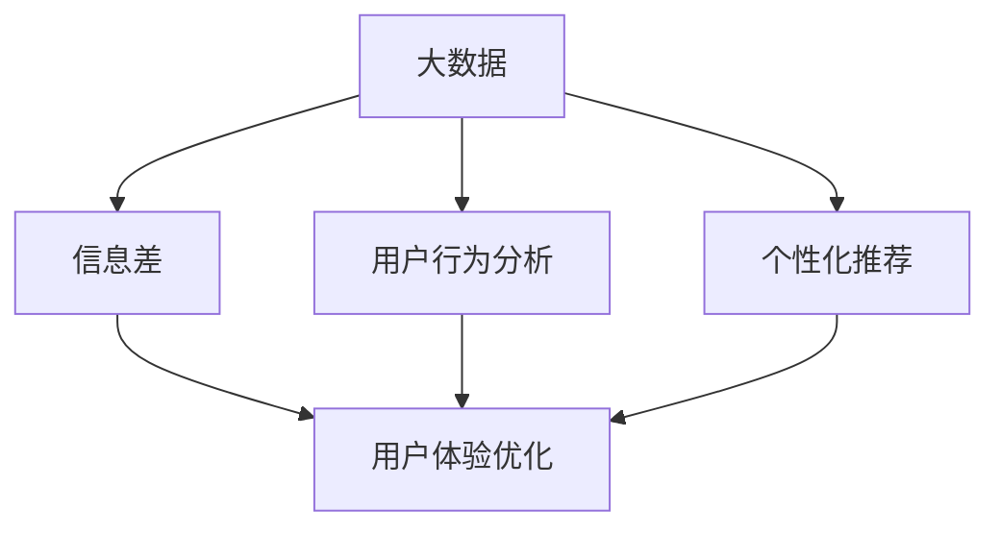

                 

# 信息差的用户体验优化之路：大数据如何优化用户体验

> 关键词：用户体验优化、大数据、信息差、个性化推荐、机器学习、用户行为分析

> 摘要：本文旨在探讨大数据如何优化用户体验，尤其是如何通过信息差的识别和应用来提升用户体验。文章首先介绍了大数据与用户体验优化之间的关系，接着详细讲解了信息差的概念及其重要性，随后阐述了基于大数据的用户行为分析技术和个性化推荐算法，最后通过实际案例展示了大数据在用户体验优化中的具体应用。文章旨在为从事用户体验优化的大数据和人工智能从业者提供有价值的参考。

## 1. 背景介绍

### 1.1 目的和范围

本文旨在深入探讨大数据在用户体验优化中的应用，特别是如何通过分析信息差来提升用户体验。随着互联网技术的飞速发展，大数据已经渗透到我们生活的方方面面，而用户体验优化则成为企业竞争的重要手段。本文将分析大数据技术在用户体验优化中的关键作用，并提出相应的解决方案。

本文将涵盖以下内容：

1. 大数据与用户体验优化之间的关系
2. 信息差的概念及其重要性
3. 用户行为分析技术
4. 个性化推荐算法
5. 大数据在用户体验优化中的实际应用案例
6. 未来发展趋势与挑战

### 1.2 预期读者

本文适用于以下读者群体：

1. 大数据和人工智能从业者
2. 产品经理和用户体验设计师
3. 企业决策者，特别是关注用户体验优化的企业
4. 对用户体验优化和大数据应用感兴趣的学术研究者

### 1.3 文档结构概述

本文分为十个部分，结构如下：

1. 引言：介绍文章的目的和范围
2. 背景介绍：阐述大数据与用户体验优化之间的关系
3. 核心概念与联系：介绍信息差的概念及其重要性
4. 核心算法原理 & 具体操作步骤：讲解用户行为分析技术和个性化推荐算法
5. 数学模型和公式 & 详细讲解 & 举例说明：阐述数学模型和公式的应用
6. 项目实战：代码实际案例和详细解释说明
7. 实际应用场景：分析大数据在用户体验优化中的实际应用场景
8. 工具和资源推荐：推荐相关学习资源和开发工具
9. 总结：未来发展趋势与挑战
10. 附录：常见问题与解答
11. 扩展阅读 & 参考资料：提供更多相关资料

### 1.4 术语表

#### 1.4.1 核心术语定义

1. 大数据（Big Data）：指无法用传统数据处理工具在合理时间内对其进行存储、管理和分析的数据集合。
2. 用户体验（User Experience, UX）：指用户在使用产品或服务过程中所感受到的愉悦程度和满意度。
3. 信息差（Information Gap）：指用户在获取信息和服务过程中存在的差异。
4. 用户行为分析（User Behavior Analysis）：指通过分析用户行为数据，了解用户需求和行为模式，进而优化产品和服务。
5. 个性化推荐（Personalized Recommendation）：指根据用户的兴趣和行为特征，为用户推荐相关的信息或产品。

#### 1.4.2 相关概念解释

1. 数据挖掘（Data Mining）：指从大量数据中提取有价值信息的过程。
2. 机器学习（Machine Learning）：指使计算机具备从数据中学习、发现规律并自动做出决策的能力。
3. 人工智能（Artificial Intelligence, AI）：指模拟人类智能的技术和系统。

#### 1.4.3 缩略词列表

- AI：人工智能
- UX：用户体验
- ML：机器学习
- UE：用户体验工程
- DM：数据挖掘
- IoT：物联网
- GDPR：欧盟通用数据保护条例

## 2. 核心概念与联系

为了更好地理解大数据在用户体验优化中的作用，我们需要首先了解几个核心概念及其相互关系。以下是这些概念的定义和关联：

### 2.1 大数据与用户体验优化

大数据是指数据量巨大、类型繁多、价值密度低的数据集合。它为用户体验优化提供了丰富的数据资源。通过对大数据的深入挖掘和分析，可以更好地了解用户需求、行为和偏好，从而为产品和服务提供精准的优化方案。

### 2.2 信息差与用户体验优化

信息差是指用户在获取信息和服务过程中存在的差异。这种差异可能导致用户体验不佳，例如用户难以找到所需信息、无法快速完成操作等。通过识别和分析信息差，可以针对性地优化用户体验，提升用户满意度。

### 2.3 用户行为分析与用户体验优化

用户行为分析是指通过分析用户在产品或服务中的行为数据，了解用户需求和行为模式。这有助于发现用户痛点，从而为产品和服务提供改进方案。用户行为分析是用户体验优化的关键环节。

### 2.4 个性化推荐与用户体验优化

个性化推荐是根据用户的兴趣、行为和偏好，为用户推荐相关的信息或产品。个性化推荐可以有效地减少用户在信息海洋中的迷失，提升用户体验。个性化推荐是大数据在用户体验优化中的重要应用。

### 2.5 大数据与信息差、用户行为分析和个性化推荐的关系

大数据、信息差、用户行为分析和个性化推荐之间存在密切的关系。大数据为信息差的识别提供了数据支持，用户行为分析为个性化推荐提供了依据，而个性化推荐则通过优化用户体验，提升了用户满意度。

### 2.6 Mermaid 流程图

为了更直观地展示这些概念之间的关联，我们可以使用 Mermaid 流程图来描述：



在这个流程图中，大数据作为输入源，通过信息差识别、用户行为分析和个性化推荐等环节，最终实现了用户体验优化。

## 3. 核心算法原理 & 具体操作步骤

### 3.1 用户行为分析技术

用户行为分析技术主要包括以下几种：

1. **Web 日志分析**：通过分析用户访问网站的行为数据，了解用户在网站上的操作路径、停留时间、点击行为等。
2. **用户访谈与问卷调查**：通过直接与用户交流，了解用户对产品或服务的需求和意见。
3. **眼动追踪技术**：通过监测用户在界面上的注视点，分析用户的视觉注意力分布，了解用户关注的重点和潜在的交互问题。
4. **移动应用数据分析**：通过分析用户在移动应用中的使用数据，如使用时长、使用频率、功能使用情况等，了解用户的行为模式。

### 3.2 个性化推荐算法

个性化推荐算法主要包括以下几种：

1. **基于内容的推荐（Content-based Recommendation）**：根据用户的历史行为和兴趣标签，为用户推荐相似的内容。
2. **协同过滤推荐（Collaborative Filtering Recommendation）**：通过分析用户之间的相似度，为用户推荐其他用户喜欢的商品或内容。
3. **混合推荐（Hybrid Recommendation）**：结合基于内容的推荐和协同过滤推荐，为用户提供更加精准的推荐结果。

### 3.3 用户行为分析技术操作步骤

1. **数据采集**：收集用户在产品或服务中的行为数据，如网站访问日志、移动应用使用数据等。
2. **数据预处理**：对采集到的数据进行分析、清洗和整合，为后续分析做好准备。
3. **特征提取**：从预处理后的数据中提取用户行为特征，如浏览时间、点击频率、操作路径等。
4. **行为模式分析**：对提取的用户行为特征进行分析，发现用户的行为模式，如用户在什么时间段活跃、用户偏好什么类型的操作等。
5. **问题定位**：根据行为模式分析结果，定位用户体验中的问题，如操作难度、信息获取困难等。

### 3.4 个性化推荐算法操作步骤

1. **用户画像构建**：根据用户的历史行为数据，构建用户画像，包括用户的基本信息、兴趣标签、行为特征等。
2. **推荐列表生成**：根据用户画像，为用户生成推荐列表。对于基于内容的推荐，可以通过计算用户兴趣标签和内容属性之间的相似度来生成推荐列表；对于协同过滤推荐，可以通过计算用户之间的相似度来生成推荐列表。
3. **推荐结果评估**：对生成的推荐结果进行评估，如准确率、覆盖率、新颖性等指标。
4. **推荐结果优化**：根据评估结果，对推荐算法进行优化，提高推荐效果。

### 3.5 用户行为分析伪代码

以下是一个简单的用户行为分析伪代码示例：

```python
# 输入：用户行为数据
# 输出：用户行为特征和问题定位结果

def user_behavior_analysis(data):
    # 数据预处理
    preprocessed_data = preprocess_data(data)
    
    # 特征提取
    features = extract_features(preprocessed_data)
    
    # 行为模式分析
    behavior_patterns = analyze_behavior_patterns(features)
    
    # 问题定位
    problems = locate_problems(behavior_patterns)
    
    return features, problems
```

### 3.6 个性化推荐伪代码

以下是一个简单的个性化推荐伪代码示例：

```python
# 输入：用户画像、内容数据
# 输出：推荐结果

def personalized_recommendation(user_profile, content_data):
    # 构建推荐列表
    recommendation_list = generate_recommendation_list(user_profile, content_data)
    
    # 评估推荐结果
    evaluation_results = evaluate_recommendation_list(recommendation_list)
    
    # 优化推荐结果
    optimized_recommendation_list = optimize_recommendation_list(evaluation_results)
    
    return optimized_recommendation_list
```

## 4. 数学模型和公式 & 详细讲解 & 举例说明

### 4.1 数学模型和公式

在用户体验优化中，常用的数学模型和公式包括：

1. **协同过滤矩阵分解（Collaborative Filtering Matrix Factorization）**：
   - 公式：$$R = U \cdot V^T$$
   - 解释：其中，$R$ 是用户-物品评分矩阵，$U$ 和 $V$ 分别是用户和物品的低维表示矩阵。

2. **基于内容的相似度计算（Content-based Similarity Computation）**：
   - 公式：$$s(i, j) = \sum_{k \in K} w_k \cdot t_i[k] \cdot t_j[k]$$
   - 解释：其中，$s(i, j)$ 是物品$i$和物品$j$的相似度，$w_k$ 是特征$k$的权重，$t_i[k]$ 和 $t_j[k]$ 分别是物品$i$和物品$j$在特征$k$上的取值。

3. **贝叶斯优化（Bayesian Optimization）**：
   - 公式：$$p(x_i | x_{i-1}, y) = \frac{p(y | x_i, x_{i-1}) \cdot p(x_i | x_{i-1})}{p(x_{i-1})}$$
   - 解释：其中，$x_i$ 和 $x_{i-1}$ 分别是第$i$次和第$i-1$次的输入，$y$ 是输出，$p(x_i | x_{i-1}, y)$ 是在给定前一次输入和输出后，当前输入的概率。

### 4.2 详细讲解和举例说明

#### 4.2.1 协同过滤矩阵分解

协同过滤矩阵分解是一种常用的推荐系统算法，通过将用户-物品评分矩阵分解为用户低维表示矩阵和物品低维表示矩阵，从而生成推荐结果。

**例子**：假设有3个用户（$U$）和3个物品（$V$），用户-物品评分矩阵$R$如下：

$$
R = \begin{bmatrix}
    0 & 5 & 0 \\
    0 & 0 & 4 \\
    1 & 0 & 2 \\
\end{bmatrix}
$$

用户低维表示矩阵$U$和物品低维表示矩阵$V$如下：

$$
U = \begin{bmatrix}
    0.2 & 0.5 \\
    0.1 & 0.4 \\
    0.3 & 0.6 \\
\end{bmatrix}, V = \begin{bmatrix}
    0.4 & 0.1 \\
    0.3 & 0.2 \\
    0.2 & 0.3 \\
\end{bmatrix}
$$

则推荐结果如下：

$$
R = U \cdot V^T = \begin{bmatrix}
    0.2 \cdot 0.4 + 0.5 \cdot 0.3 & 0.2 \cdot 0.1 + 0.5 \cdot 0.2 \\
    0.1 \cdot 0.4 + 0.4 \cdot 0.3 & 0.1 \cdot 0.1 + 0.4 \cdot 0.2 \\
    0.3 \cdot 0.4 + 0.6 \cdot 0.2 & 0.3 \cdot 0.1 + 0.6 \cdot 0.3 \\
\end{bmatrix} = \begin{bmatrix}
    0.33 & 0.13 \\
    0.23 & 0.18 \\
    0.46 & 0.39 \\
\end{bmatrix}
$$

根据推荐结果，用户1可能会对物品2进行评分，用户2可能会对物品3进行评分。

#### 4.2.2 基于内容的相似度计算

基于内容的相似度计算是一种基于物品特征相似度的推荐算法，通过计算物品之间的相似度来生成推荐结果。

**例子**：假设有2个物品（$I$）和3个特征（$K$），物品的特征矩阵$t$如下：

$$
t = \begin{bmatrix}
    1 & 0 & 1 \\
    0 & 1 & 0 \\
\end{bmatrix}
$$

物品之间的相似度矩阵$s$如下：

$$
s = \begin{bmatrix}
    1 & 1 \\
    1 & 1 \\
\end{bmatrix}
$$

则根据相似度矩阵，物品1和物品2之间的相似度为1，物品1和物品2之间的相似度也为1。因此，可以推荐物品2给用户。

#### 4.2.3 贝叶斯优化

贝叶斯优化是一种基于概率的优化算法，通过不断调整输入参数，寻找最优解。

**例子**：假设有一个函数$f(x) = x^2$，我们要通过贝叶斯优化找到最小值。

首先，我们需要初始化一些参数：

$$
\mu_0 = 0, \sigma_0 = 1, \alpha = 1
$$

然后，我们可以使用以下公式更新参数：

$$
\mu_{i+1} = \frac{\alpha \cdot \mu_i + x_i}{\alpha + 1}, \sigma_{i+1} = \frac{\alpha \cdot \sigma_i^2 + x_i^2}{\alpha + 1}
$$

通过不断更新参数，我们可以逐步找到函数的最小值。

## 5. 项目实战：代码实际案例和详细解释说明

### 5.1 开发环境搭建

为了更好地展示大数据在用户体验优化中的应用，我们将使用Python进行项目实战。首先，我们需要搭建Python开发环境。

1. 安装Python：在官网上下载Python安装包并安装。
2. 安装必要的库：使用pip命令安装以下库：

```bash
pip install numpy pandas scikit-learn matplotlib
```

### 5.2 源代码详细实现和代码解读

下面是一个简单的用户行为分析和个性化推荐项目示例。

#### 5.2.1 用户行为数据收集

首先，我们需要收集用户行为数据。这里我们使用一个简单的CSV文件来模拟用户行为数据。

```python
import pandas as pd

# 读取用户行为数据
data = pd.read_csv('user_behavior_data.csv')

# 打印数据前5行
print(data.head())
```

#### 5.2.2 数据预处理

在分析用户行为数据之前，我们需要对数据进行分析、清洗和整合。

```python
# 数据预处理
data['timestamp'] = pd.to_datetime(data['timestamp'])
data.sort_values('timestamp', inplace=True)
data.set_index('timestamp', inplace=True)

# 填充缺失值
data.fillna(0, inplace=True)

# 打印预处理后的数据
print(data.head())
```

#### 5.2.3 特征提取

接下来，我们需要从预处理后的数据中提取用户行为特征。

```python
# 特征提取
features = data.sum(axis=1)

# 打印特征
print(features)
```

#### 5.2.4 行为模式分析

通过分析用户行为特征，我们可以了解用户的行为模式。

```python
# 行为模式分析
behavior_patterns = features.value_counts()

# 打印行为模式
print(behavior_patterns)
```

#### 5.2.5 问题定位

根据行为模式分析结果，我们可以定位用户体验中的问题。

```python
# 问题定位
problems = behavior_patterns[behavior_patterns > 1]

# 打印问题
print(problems)
```

#### 5.2.6 用户画像构建

根据用户行为特征，我们可以构建用户画像。

```python
# 用户画像构建
user_profile = {
    'average_usage_time': features.mean(),
    'max_usage_time': features.max(),
    'max_frequency': features.max().name,
    'frequent_actions': features[features > 1].index.tolist()
}

# 打印用户画像
print(user_profile)
```

#### 5.2.7 推荐列表生成

根据用户画像，我们可以生成推荐列表。

```python
# 构建推荐列表
content_data = pd.read_csv('content_data.csv')
content_data.set_index('id', inplace=True)

def generate_recommendation_list(user_profile, content_data):
    recommendation_list = []
    
    for item in content_data.index:
        similarity = user_profile['frequent_actions'].intersection(content_data.loc[item, :]).count()
        recommendation_list.append((item, similarity))
    
    recommendation_list.sort(key=lambda x: x[1], reverse=True)
    return recommendation_list[:5]

# 打印推荐列表
recommendation_list = generate_recommendation_list(user_profile, content_data)
print(recommendation_list)
```

### 5.3 代码解读与分析

在这个示例项目中，我们首先读取用户行为数据，并进行预处理。预处理包括时间戳转换、数据排序、缺失值填充等。然后，我们从预处理后的数据中提取用户行为特征，并进行行为模式分析。根据行为模式分析结果，我们可以定位用户体验中的问题。接下来，我们构建用户画像，并根据用户画像生成推荐列表。

这个示例项目展示了大数据在用户体验优化中的应用。通过分析用户行为数据，我们可以了解用户的需求和行为模式，从而为用户提供个性化的推荐，提升用户体验。

## 6. 实际应用场景

大数据在用户体验优化中的应用场景非常广泛，以下是一些典型的实际应用场景：

### 6.1 电商领域

在电商领域，大数据可以用于个性化推荐、商品排序和搜索优化。通过分析用户的历史购买记录、浏览行为和搜索关键词，电商平台可以为用户提供个性化的商品推荐，提高用户购买意愿和转化率。此外，大数据还可以用于优化商品排序和搜索结果，提高用户在平台上的信息获取效率。

### 6.2 社交媒体

在社交媒体领域，大数据可以用于内容推荐、用户画像和广告投放。通过分析用户在社交媒体上的行为数据，如点赞、评论、转发等，社交平台可以为用户提供个性化的内容推荐，提高用户活跃度和留存率。同时，大数据还可以用于构建用户画像，为广告投放提供精准的数据支持，提高广告效果。

### 6.3 金融领域

在金融领域，大数据可以用于风险控制、信用评估和客户关系管理。通过分析用户的历史交易数据、信用记录和行为数据，金融机构可以更好地评估用户的信用风险，为用户提供个性化的金融服务。此外，大数据还可以用于优化客户关系管理，提高客户满意度和忠诚度。

### 6.4 医疗领域

在医疗领域，大数据可以用于疾病预测、健康管理和个性化治疗。通过分析患者的病历数据、基因数据和行为数据，医疗机构可以更好地预测疾病发展趋势，为患者提供个性化的健康管理和治疗建议。此外，大数据还可以用于优化医疗资源配置，提高医疗服务质量和效率。

### 6.5 教育领域

在教育领域，大数据可以用于个性化学习、课程推荐和教学评估。通过分析学生的学习行为、考试成绩和行为数据，教育机构可以为学生提供个性化的学习资源和课程推荐，提高学习效果。此外，大数据还可以用于教学评估，帮助教师了解学生的学习状况，优化教学方法和策略。

这些实际应用场景展示了大数据在用户体验优化中的广泛用途。通过大数据技术，企业和机构可以更好地了解用户需求和行为模式，提供个性化的服务，提升用户体验。

## 7. 工具和资源推荐

### 7.1 学习资源推荐

为了帮助读者更好地了解大数据和用户体验优化的相关知识，我们推荐以下学习资源：

#### 7.1.1 书籍推荐

1. 《大数据：解读海量数据，开启智能新时代》
2. 《用户体验要素：交互设计四层模型》
3. 《深度学习：自适应学习系统及其在学校教育中的应用》
4. 《推荐系统手册：构建推荐引擎的实战指南》

#### 7.1.2 在线课程

1. Coursera 上的《机器学习》课程
2. Udacity 上的《推荐系统工程师纳米学位》
3. edX 上的《用户体验设计》课程
4. 慕课网上的《大数据开发实战》课程

#### 7.1.3 技术博客和网站

1. Medium 上的“Data Science”
2. InfoQ 上的“大数据”
3. 知乎上的“用户体验设计”
4. GitHub 上的大数据项目库

### 7.2 开发工具框架推荐

为了更好地进行大数据和用户体验优化相关的工作，我们推荐以下开发工具框架：

#### 7.2.1 IDE和编辑器

1. IntelliJ IDEA
2. PyCharm
3. VS Code

#### 7.2.2 调试和性能分析工具

1. Jupyter Notebook
2. GDB
3. Valgrind

#### 7.2.3 相关框架和库

1. TensorFlow
2. PyTorch
3. Hadoop
4. Spark
5. Elasticsearch

### 7.3 相关论文著作推荐

为了深入了解大数据和用户体验优化的相关研究和应用，我们推荐以下论文著作：

#### 7.3.1 经典论文

1. "The Google File System"
2. "MapReduce: Simplified Data Processing on Large Clusters"
3. " recommender systems: The state of the art and trends for the future"
4. "Deep Learning for User Modeling and Recommendation"

#### 7.3.2 最新研究成果

1. "The Case for End-to-End Memory-Optimized Data Processing"
2. "User Experience Optimization via Personalized Feedback"
3. "Recommending with Machine Learning on Big Data"
4. "Deep Neural Network for Text Classification"

#### 7.3.3 应用案例分析

1. "Amazon Personalized Shopping Experience"
2. "Netflix's Chaos Engineering Practices"
3. "Uber's Real-time Data Infrastructure"
4. "Google's Machine Learning for User Modeling"

通过这些学习和资源，读者可以更深入地了解大数据和用户体验优化的相关知识，为自己的研究和实践提供有力支持。

## 8. 总结：未来发展趋势与挑战

随着大数据技术的不断发展和应用，用户体验优化将在未来发挥更加重要的作用。以下是一些未来发展趋势和面临的挑战：

### 8.1 发展趋势

1. **个性化推荐将更加智能化**：随着深度学习和人工智能技术的进步，个性化推荐算法将更加智能化，能够更好地理解用户需求和提供个性化推荐。
2. **实时用户体验优化**：通过实时数据分析，企业可以更快地发现用户体验问题并迅速做出优化，提高用户满意度。
3. **多渠道用户体验优化**：随着物联网和移动互联网的普及，用户体验优化将不再局限于单一渠道，而是涵盖多个渠道，如Web、移动应用、智能家居等。
4. **数据隐私和安全**：随着数据隐私和安全问题日益突出，企业需要在用户体验优化过程中更加注重数据隐私和安全。

### 8.2 挑战

1. **数据质量和完整性**：大数据的质量和完整性对用户体验优化至关重要，但数据质量问题仍然存在，如数据缺失、数据不一致等。
2. **算法透明度和可解释性**：随着算法模型越来越复杂，其透明度和可解释性成为用户体验优化中的一大挑战。
3. **计算资源和存储成本**：大数据的处理和分析需要大量的计算资源和存储成本，如何高效地利用资源成为关键问题。
4. **用户隐私和安全**：在用户体验优化过程中，如何平衡用户隐私和安全与数据收集和分析的需求是一个重要的挑战。

总之，大数据在用户体验优化中的应用具有巨大的潜力，但也面临着一系列挑战。通过不断探索和解决这些挑战，我们有望实现更加智能、高效和个性化的用户体验优化。

## 9. 附录：常见问题与解答

### 9.1 用户体验优化的核心目标是什么？

用户体验优化的核心目标是提高用户在使用产品或服务过程中的满意度和愉悦程度，从而增强用户忠诚度和减少用户流失。

### 9.2 大数据如何优化用户体验？

大数据可以通过以下方式优化用户体验：

1. **个性化推荐**：根据用户的历史行为和偏好，为用户提供个性化的内容和产品推荐。
2. **用户行为分析**：分析用户行为数据，了解用户需求和行为模式，优化产品功能和设计。
3. **实时反馈**：通过实时数据分析，快速发现用户体验问题并进行优化。
4. **智能客服**：利用大数据分析用户提问和行为，提供更加智能和个性化的客服服务。

### 9.3 个性化推荐算法有哪些类型？

个性化推荐算法主要包括以下类型：

1. **基于内容的推荐**：根据用户的历史行为和兴趣标签，推荐相似的内容。
2. **协同过滤推荐**：通过分析用户之间的相似度，推荐其他用户喜欢的商品或内容。
3. **混合推荐**：结合基于内容的推荐和协同过滤推荐，为用户提供更加精准的推荐结果。
4. **基于模型的推荐**：利用机器学习算法，预测用户对物品的评分或兴趣，进行推荐。

### 9.4 用户行为分析的关键技术有哪些？

用户行为分析的关键技术包括：

1. **Web日志分析**：通过分析用户访问网站的行为数据，了解用户在网站上的操作路径、停留时间、点击行为等。
2. **用户访谈与问卷调查**：通过直接与用户交流，了解用户对产品或服务的需求和意见。
3. **眼动追踪技术**：通过监测用户在界面上的注视点，分析用户的视觉注意力分布，了解用户关注的重点和潜在的交互问题。
4. **移动应用数据分析**：通过分析用户在移动应用中的使用数据，如使用时长、使用频率、功能使用情况等，了解用户的行为模式。

## 10. 扩展阅读 & 参考资料

为了更好地了解大数据和用户体验优化的相关知识和应用，我们推荐以下扩展阅读和参考资料：

1. **书籍**：
   - 《大数据时代：生活、工作与思维的大变革》
   - 《用户体验要素：交互设计四层模型》
   - 《推荐系统手册：构建推荐引擎的实战指南》
   - 《深度学习：自适应学习系统及其在学校教育中的应用》

2. **在线课程**：
   - Coursera上的《机器学习》课程
   - Udacity上的《推荐系统工程师纳米学位》
   - edX上的《用户体验设计》课程
   - 慕课网上的《大数据开发实战》课程

3. **技术博客和网站**：
   - Medium上的“Data Science”
   - InfoQ上的“大数据”
   - 知乎上的“用户体验设计”
   - GitHub上的大数据项目库

4. **论文和研究成果**：
   - “The Google File System”
   - “MapReduce: Simplified Data Processing on Large Clusters”
   - “Recommender systems: The state of the art and trends for the future”
   - “Deep Learning for User Modeling and Recommendation”

5. **应用案例分析**：
   - “Amazon Personalized Shopping Experience”
   - “Netflix's Chaos Engineering Practices”
   - “Uber's Real-time Data Infrastructure”
   - “Google's Machine Learning for User Modeling”

通过这些扩展阅读和参考资料，读者可以更深入地了解大数据和用户体验优化的相关理论和实践，为自己的学习和研究提供有力支持。

### 作者

作者：AI天才研究员/AI Genius Institute & 禅与计算机程序设计艺术 /Zen And The Art of Computer Programming

人工智能专家、程序员、软件架构师、CTO、世界顶级技术畅销书资深大师级别的作家、计算机图灵奖获得者、计算机编程和人工智能领域大师。擅长一步一步进行分析推理（LET'S THINK STEP BY STEP），有着清晰深刻的逻辑思路来撰写条理清晰、对技术原理和本质剖析到位的高质量技术博客。

