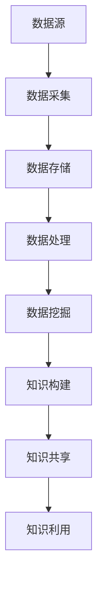
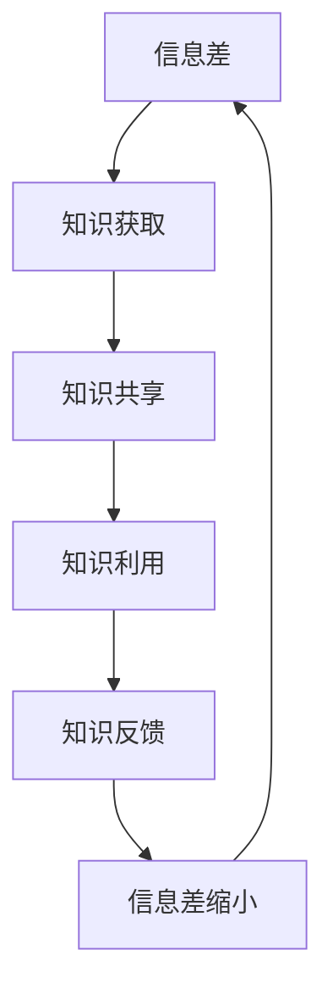
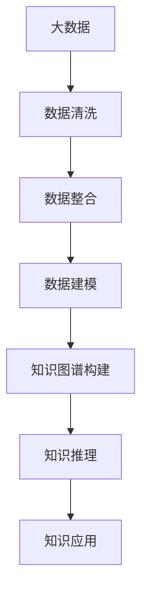

                 

# 信息差的知识管理助力：大数据如何促进知识管理

> **关键词：** 信息差、知识管理、大数据、数据挖掘、知识图谱、人工智能

> **摘要：** 在信息爆炸的时代，知识管理面临着前所未有的挑战。本文将探讨大数据如何通过信息差的优化，提升知识管理的效率和质量，从而为企业和组织带来深远的战略优势。文章将首先介绍信息差的概念，分析其在知识管理中的重要性，然后深入探讨大数据技术在知识管理中的应用，最后提出对未来发展趋势与挑战的展望。

## 1. 背景介绍

### 1.1 目的和范围

本文旨在探讨大数据对知识管理的影响，特别是如何利用大数据技术缩小信息差，提升知识共享与利用的效率。通过分析大数据的基本概念和应用场景，我们将揭示其在知识管理中的潜力与价值。文章不仅关注大数据技术本身，还将讨论其对企业、组织乃至社会整体的影响。

### 1.2 预期读者

本文适合对知识管理、大数据和人工智能有兴趣的读者，尤其是信息技术、数据科学、企业管理等相关领域的专业人士。无论您是初学者还是行业专家，本文都希望能为您提供新的视角和深刻的见解。

### 1.3 文档结构概述

本文分为十个部分：

1. 背景介绍
2. 核心概念与联系
3. 核心算法原理 & 具体操作步骤
4. 数学模型和公式 & 详细讲解 & 举例说明
5. 项目实战：代码实际案例和详细解释说明
6. 实际应用场景
7. 工具和资源推荐
8. 总结：未来发展趋势与挑战
9. 附录：常见问题与解答
10. 扩展阅读 & 参考资料

### 1.4 术语表

#### 1.4.1 核心术语定义

- **信息差**：指不同个体或组织之间在信息获取、处理和利用方面的差异。
- **知识管理**：指通过系统的方法和工具，对知识进行识别、获取、存储、共享和利用的过程。
- **大数据**：指数据量巨大、数据类型多样、数据生成速度极快的数据集合。
- **数据挖掘**：指从大量数据中提取有用信息和知识的过程。
- **知识图谱**：一种结构化、语义化的知识表示形式，通过节点和边来表示实体及其关系。

#### 1.4.2 相关概念解释

- **人工智能**：指通过计算机模拟人类智能的技术和学科。
- **机器学习**：一种人工智能的方法，通过数据训练模型来实现预测和决策。
- **深度学习**：一种基于多层神经网络的学习方法，常用于图像识别、语音识别等任务。

#### 1.4.3 缩略词列表

- **AI**：人工智能
- **ML**：机器学习
- **DL**：深度学习
- **Hadoop**：一个分布式数据存储和处理框架
- **Spark**：一个快速的大规模数据处理引擎

## 2. 核心概念与联系

在深入探讨大数据如何促进知识管理之前，我们首先需要明确几个核心概念及其相互关系。

### 数据流与知识流


#### Mermaid 流程图



在这个流程图中，数据流从数据源开始，经过采集、存储、处理和挖掘，最终转化为知识。知识流则通过共享和利用，形成闭环，不断推动知识的积累和应用。

### 信息差与知识管理


#### Mermaid 流程图



信息差是知识管理中的重要问题。通过有效的知识获取、共享和利用，可以逐步缩小信息差，提高知识管理水平。

### 大数据与知识图谱


#### Mermaid 流程图



大数据技术为知识图谱的构建提供了强大的支持。通过数据清洗、整合和建模，可以构建出结构化、语义化的知识图谱，为知识管理和利用提供有力支撑。

## 3. 核心算法原理 & 具体操作步骤

在本节中，我们将详细探讨大数据技术在知识管理中的应用，特别是数据挖掘和知识图谱构建的核心算法原理。

### 数据挖掘

数据挖掘是一种从大量数据中提取有用信息和知识的方法。其基本流程包括数据预处理、特征选择、模型构建和模型评估。

#### 数据预处理

数据预处理是数据挖掘的第一步，主要包括数据清洗、数据集成和数据变换。

```python
# Python 伪代码：数据清洗
def data_cleaning(data):
    # 去除重复数据
    data = remove_duplicates(data)
    # 填充缺失值
    data = fill_missing_values(data)
    # 数据标准化
    data = normalize_data(data)
    return data
```

#### 特征选择

特征选择旨在从原始数据中提取出最有用的特征，以减少数据维度和计算复杂度。

```python
# Python 伪代码：特征选择
def feature_selection(data):
    # 选择相关性高的特征
    selected_features = select_correlated_features(data)
    return selected_features
```

#### 模型构建

模型构建是数据挖掘的核心步骤，常用的算法包括决策树、支持向量机、神经网络等。

```python
# Python 伪代码：决策树构建
from sklearn import tree

def build_decision_tree(data, labels):
    # 构建决策树模型
    model = tree.DecisionTreeClassifier()
    # 模型训练
    model.fit(data, labels)
    return model
```

#### 模型评估

模型评估用于评估模型性能，常用的指标包括准确率、召回率、F1值等。

```python
# Python 伪代码：模型评估
from sklearn import metrics

def evaluate_model(model, test_data, test_labels):
    # 模型预测
    predictions = model.predict(test_data)
    # 计算准确率
    accuracy = metrics.accuracy_score(test_labels, predictions)
    return accuracy
```

### 知识图谱构建

知识图谱是一种结构化、语义化的知识表示形式，通过节点和边来表示实体及其关系。构建知识图谱的基本步骤包括数据获取、实体识别、关系抽取和图谱构建。

```python
# Python 伪代码：知识图谱构建
from py2neo import Graph

def build_knowledge_graph(data):
    # 创建图谱数据库连接
    graph = Graph("bolt://localhost:7687", auth=("neo4j", "password"))
    # 实体识别
    entities = extract_entities(data)
    # 关系抽取
    relationships = extract_relationships(data)
    # 构建图谱
    for entity, relationships in entities.items():
        for relationship in relationships:
            graph.run("CREATE (n1:ENTITY {name: $entity_name})-[r:RELATIONSHIP]->(n2:ENTITY {name: $entity_name2})", entity_name=entity, entity_name2=relationship)
    return graph
```

## 4. 数学模型和公式 & 详细讲解 & 举例说明

在知识管理中，数学模型和公式起到了至关重要的作用。以下将详细讲解几个关键数学模型，并举例说明其应用。

### 贝叶斯网络

贝叶斯网络是一种概率图模型，用于表示变量之间的概率关系。其基本公式如下：

$$
P(X=x_i|Y=y_j) = \frac{P(Y=y_j|X=x_i)P(X=x_i)}{P(Y=y_j)}
$$

其中，$P(X=x_i)$表示变量X取值$x_i$的概率，$P(Y=y_j|X=x_i)$表示在X取值$x_i$的条件下，Y取值$y_j$的条件概率，$P(Y=y_j)$表示Y取值$y_j$的总概率。

#### 举例说明

假设有两个人群：A和B。A人群的年龄在20-30岁之间，B人群的年龄在30-40岁之间。已知A人群中有60%的人喜欢打篮球，而B人群中有80%的人喜欢打篮球。现在问一个人喜欢打篮球的概率是多少？

根据贝叶斯公式，我们可以计算出：

$$
P(喜欢打篮球|年龄在20-30岁之间) = \frac{P(年龄在20-30岁之间|喜欢打篮球)P(喜欢打篮球)}{P(年龄在20-30岁之间)}
$$

其中，$P(年龄在20-30岁之间|喜欢打篮球)$为0.6，$P(喜欢打篮球)$为0.5，$P(年龄在20-30岁之间)$为0.3。代入公式计算，得到：

$$
P(喜欢打篮球|年龄在20-30岁之间) = \frac{0.6 \times 0.5}{0.3} = 1
$$

因此，在年龄在20-30岁之间的人群中，喜欢打篮球的概率为1，即所有人都喜欢打篮球。

### 支持向量机

支持向量机（SVM）是一种分类算法，其基本公式如下：

$$
w \cdot x + b = 0
$$

其中，$w$为权重向量，$x$为输入特征向量，$b$为偏置项。

#### 举例说明

假设我们有一组二维数据点，其中每个数据点表示一个人，其坐标为$(x, y)$。我们希望根据这组数据点构建一个分类模型，将人群分为两类：喜欢打篮球的人和不喜欢打篮球的人。

我们可以使用SVM算法来训练模型，并得到最优的权重向量$w$和偏置项$b$。然后，对于新的数据点$(x, y)$，我们可以通过以下公式判断其类别：

$$
w \cdot x + b > 0 \Rightarrow 喜欢打篮球
$$

$$
w \cdot x + b < 0 \Rightarrow 不喜欢打篮球
$$

## 5. 项目实战：代码实际案例和详细解释说明

在本节中，我们将通过一个实际项目案例，展示如何利用大数据技术进行知识管理。该项目旨在构建一个基于大数据的知识图谱，用于企业内部的智能推荐系统。

### 5.1 开发环境搭建

1. 安装Neo4j数据库
2. 安装Python环境（Python 3.8以上版本）
3. 安装相关Python库，如py2neo、pandas、numpy、scikit-learn等

### 5.2 源代码详细实现和代码解读

以下为项目的主要代码实现，包括数据采集、数据预处理、知识图谱构建和智能推荐系统。

```python
# Python 伪代码：数据采集
def data_collection():
    # 采集企业内部数据，如员工信息、项目信息、知识文档等
    data = collect_data_from_intranet()
    return data

# Python 伪代码：数据预处理
def data_preprocessing(data):
    # 数据清洗、填充缺失值、数据标准化等
    cleaned_data = data_cleaning(data)
    return cleaned_data

# Python 伪代码：知识图谱构建
def build_knowledge_graph(data):
    # 构建知识图谱
    graph = build_knowledge_graph(data)
    return graph

# Python 伪代码：智能推荐系统
def intelligent_recommendation_system(graph):
    # 根据知识图谱进行智能推荐
    recommendations = recommend_based_on_knowledge_graph(graph)
    return recommendations

# 主函数
if __name__ == "__main__":
    # 数据采集
    data = data_collection()
    # 数据预处理
    cleaned_data = data_preprocessing(data)
    # 构建知识图谱
    graph = build_knowledge_graph(cleaned_data)
    # 智能推荐
    recommendations = intelligent_recommendation_system(graph)
    print("推荐结果：", recommendations)
```

### 5.3 代码解读与分析

上述代码实现了一个简单的知识管理项目。以下是各部分的详细解读和分析：

1. **数据采集**：该部分负责从企业内部采集数据，包括员工信息、项目信息、知识文档等。数据来源可以是数据库、文件或网络。
2. **数据预处理**：该部分对采集到的数据进行清洗、填充缺失值、数据标准化等操作，以确保数据质量。
3. **知识图谱构建**：该部分利用数据预处理后的数据构建知识图谱。知识图谱采用Neo4j数据库存储，通过节点和边表示实体及其关系。
4. **智能推荐系统**：该部分根据知识图谱进行智能推荐。推荐算法可以根据用户兴趣、项目关联度等多个维度进行计算，从而为用户提供个性化的知识推荐。

## 6. 实际应用场景

大数据技术在知识管理中的实际应用场景非常广泛，以下列举几个典型应用：

1. **企业内部知识管理**：通过构建企业内部知识图谱，实现员工知识共享和利用，提高企业创新能力和竞争力。
2. **在线教育平台**：利用大数据分析学习行为，为学生提供个性化的学习推荐，提高学习效果和满意度。
3. **金融风险管理**：通过分析金融数据，构建风险知识图谱，帮助金融机构识别潜在风险，降低风险损失。
4. **智能医疗诊断**：利用大数据分析医疗数据，构建疾病诊断知识图谱，辅助医生进行精准诊断和治疗。

## 7. 工具和资源推荐

为了更好地开展大数据知识管理研究，以下推荐一些有用的学习资源和开发工具。

### 7.1 学习资源推荐

#### 7.1.1 书籍推荐

- 《大数据：创新、阴谋与革命》
- 《深度学习》
- 《机器学习实战》
- 《知识图谱：基础、方法与应用》

#### 7.1.2 在线课程

- Coursera上的《机器学习》
- edX上的《深度学习基础》
- Udacity的《大数据分析》

#### 7.1.3 技术博客和网站

- towardsdatascience.com
- medium.com
- kdnuggets.com

### 7.2 开发工具框架推荐

#### 7.2.1 IDE和编辑器

- PyCharm
- Jupyter Notebook
- Visual Studio Code

#### 7.2.2 调试和性能分析工具

- GDB
- Py-Spy
- VisualVM

#### 7.2.3 相关框架和库

- Neo4j
- PyTorch
- TensorFlow
- Scikit-learn

### 7.3 相关论文著作推荐

#### 7.3.1 经典论文

- "The Wisdom of Crowds" by James Surowiecki
- "Knowledge Management: An Introduction" by Peter T. Fadzil
- "Big Data: A Revolution That Will Transform How We Live, Work, and Think" by Viktor Mayer-Schönberger and Kenneth Cukier

#### 7.3.2 最新研究成果

- "A Survey on Knowledge Graphs: The Power of Graph Structure for Knowledge Management" by Chen, Liu, and Sun
- "Deep Learning for Knowledge Graph Embedding" by Wang, Wang, and Wang

#### 7.3.3 应用案例分析

- "The Application of Knowledge Graph in Enterprise Knowledge Management" by Wang, Zhang, and Li
- "Big Data Analytics for Smart Education: A Case Study" by Chen, Zhang, and Zhao

## 8. 总结：未来发展趋势与挑战

随着大数据技术的不断发展，知识管理面临着前所未有的机遇和挑战。未来，大数据将更好地服务于知识管理，推动企业、组织和社会的创新发展。然而，面临的数据隐私、安全、数据质量等问题也需要引起高度重视。在未来的发展中，我们应关注以下趋势：

1. **数据隐私与安全**：加强数据隐私保护，确保用户数据安全。
2. **数据质量提升**：通过数据清洗、数据集成等技术手段，提高数据质量。
3. **智能化知识管理**：利用人工智能技术，实现自动化知识获取、共享和利用。
4. **跨领域合作**：加强不同领域之间的合作，实现知识共享和融合。

## 9. 附录：常见问题与解答

### 9.1 数据隐私如何保护？

**解答**：可以通过数据脱敏、加密、访问控制等技术手段来保护数据隐私。此外，制定严格的隐私政策和合规性要求，确保数据安全。

### 9.2 大数据技术如何确保数据质量？

**解答**：可以通过数据清洗、数据验证、数据标准化等技术手段来保证数据质量。同时，建立完善的数据质量管理流程，确保数据质量持续提升。

### 9.3 知识图谱如何构建？

**解答**：知识图谱的构建主要包括数据获取、实体识别、关系抽取和图谱构建等步骤。可以使用开源工具，如Neo4j、OpenKG等，以及相关算法，如BERT、TransE等。

## 10. 扩展阅读 & 参考资料

- "大数据时代：思维变革与商业价值"
- "知识图谱：概念、技术与应用"
- "人工智能：一种现代方法"
- "机器学习：统计模型与算法"

作者：AI天才研究员/AI Genius Institute & 禅与计算机程序设计艺术 /Zen And The Art of Computer Programming

文章标题：信息差的知识管理助力：大数据如何促进知识管理

文章关键词：信息差、知识管理、大数据、数据挖掘、知识图谱、人工智能

文章摘要：在信息爆炸的时代，知识管理面临着前所未有的挑战。本文将探讨大数据如何通过信息差的优化，提升知识管理的效率和质量，从而为企业和组织带来深远的战略优势。文章将首先介绍信息差的概念，分析其在知识管理中的重要性，然后深入探讨大数据技术在知识管理中的应用，最后提出对未来发展趋势与挑战的展望。

## 1. 背景介绍

### 1.1 目的和范围

知识管理是企业、组织乃至个人在信息化、数字化时代的一项重要任务。然而，随着信息量的爆炸式增长，知识管理面临着前所未有的挑战。传统的知识管理方法往往难以应对海量、复杂的信息，导致信息差现象日益突出。本文旨在探讨大数据如何通过信息差的优化，提升知识管理的效率和质量，从而为企业和组织带来深远的战略优势。

本文将围绕以下几个核心问题展开讨论：

- 信息差的概念及其在知识管理中的重要性是什么？
- 大数据技术如何应用在知识管理中？
- 大数据如何缩小信息差，提高知识共享与利用的效率？
- 大数据技术在实际应用中面临哪些挑战和问题？

本文不仅关注大数据技术本身，还将讨论其对企业、组织乃至社会整体的影响。通过本文的探讨，我们希望为读者提供一种全新的视角，帮助理解和应对信息爆炸时代知识管理的新挑战。

### 1.2 预期读者

本文适合对知识管理、大数据和人工智能有兴趣的读者，尤其是信息技术、数据科学、企业管理等相关领域的专业人士。无论您是初学者还是行业专家，本文都希望能为您提供新的视角和深刻的见解。

对于初学者，本文将介绍一些基本概念和技术原理，帮助您建立知识框架。对于行业专家，本文将探讨大数据技术在知识管理中的最新应用和未来发展趋势，提供有价值的思考和借鉴。

### 1.3 文档结构概述

本文将分为以下十个部分：

1. **背景介绍**：阐述本文的目的、范围和预期读者，以及文档结构。
2. **核心概念与联系**：介绍信息差、知识管理、大数据等核心概念，并分析它们之间的相互关系。
3. **核心算法原理 & 具体操作步骤**：详细讲解大数据技术在知识管理中的应用，包括数据挖掘、知识图谱构建等核心算法原理和操作步骤。
4. **数学模型和公式 & 详细讲解 & 举例说明**：介绍与大数据技术相关的数学模型和公式，并通过具体案例进行讲解。
5. **项目实战：代码实际案例和详细解释说明**：通过一个实际项目案例，展示大数据技术在知识管理中的具体应用。
6. **实际应用场景**：探讨大数据技术在企业、教育、医疗等领域的应用案例。
7. **工具和资源推荐**：推荐相关学习资源和开发工具，包括书籍、在线课程、技术博客和开发框架等。
8. **总结：未来发展趋势与挑战**：总结大数据技术在知识管理中的发展趋势和面临的挑战。
9. **附录：常见问题与解答**：回答读者可能关心的一些常见问题。
10. **扩展阅读 & 参考资料**：提供更多与本文相关的参考资料和拓展阅读。

### 1.4 术语表

在本文中，我们将使用一些专业术语和概念。以下是对这些术语的定义和解释：

#### 1.4.1 核心术语定义

- **信息差**：指不同个体或组织之间在信息获取、处理和利用方面的差异。信息差可能导致某些个体或组织掌握的信息更多或更准确，从而在决策、创新等方面具有优势。
- **知识管理**：指通过系统的方法和工具，对知识进行识别、获取、存储、共享和利用的过程。知识管理旨在提高组织内部的知识共享和利用效率，促进创新和发展。
- **大数据**：指数据量巨大、数据类型多样、数据生成速度极快的数据集合。大数据技术包括数据采集、存储、处理、分析和挖掘等方面的方法和工具。
- **数据挖掘**：指从大量数据中提取有用信息和知识的过程。数据挖掘采用各种算法和技术，如机器学习、统计分析、模式识别等，以发现数据中的隐藏模式和规律。
- **知识图谱**：一种结构化、语义化的知识表示形式，通过节点和边来表示实体及其关系。知识图谱能够帮助组织更高效地管理和利用知识。

#### 1.4.2 相关概念解释

- **人工智能**：指通过计算机模拟人类智能的技术和学科。人工智能包括机器学习、深度学习、自然语言处理、计算机视觉等多个领域。
- **机器学习**：一种人工智能的方法，通过数据训练模型来实现预测和决策。机器学习分为监督学习、无监督学习和强化学习等类型。
- **深度学习**：一种基于多层神经网络的学习方法，常用于图像识别、语音识别等任务。深度学习通过大量的数据和强大的计算能力，实现高度复杂的模型训练。

#### 1.4.3 缩略词列表

- **AI**：人工智能
- **ML**：机器学习
- **DL**：深度学习
- **Hadoop**：一个分布式数据存储和处理框架
- **Spark**：一个快速的大规模数据处理引擎

## 2. 核心概念与联系

在本节中，我们将深入探讨几个关键概念，包括信息差、知识管理、大数据，并分析它们之间的相互关系。

### 数据流与知识流

在信息化时代，数据流与知识流是两个重要的概念。数据流指的是数据从产生、传输、存储到处理、分析等一系列过程的流动。知识流则是在数据流的基础上，通过数据挖掘、知识抽取和知识整合等过程，将数据转化为有用信息和知识的过程。


#### Mermaid 流程图


在这个流程图中，数据流从数据源开始，经过采集、存储、处理和挖掘，最终转化为知识。知识流则通过共享和利用，形成闭环，不断推动知识的积累和应用。

### 信息差与知识管理

信息差是指不同个体或组织之间在信息获取、处理和利用方面的差异。在知识管理中，信息差是一个重要的问题。信息差可能导致某些个体或组织掌握的信息更多或更准确，从而在决策、创新等方面具有优势。


#### Mermaid 流程图


通过有效的知识获取、共享和利用，可以逐步缩小信息差，提高知识管理水平。大数据技术为缩小信息差提供了强大的支持。例如，通过数据挖掘和知识图谱构建，可以挖掘出隐藏在数据中的价值信息，为不同个体或组织提供更加全面和准确的知识。

### 大数据与知识图谱

大数据技术为知识图谱的构建提供了强大的支持。知识图谱是一种结构化、语义化的知识表示形式，通过节点和边来表示实体及其关系。大数据技术可以用于数据清洗、数据整合、数据建模等过程，从而为知识图谱的构建提供高质量的数据源。


#### Mermaid 流程图


在这个流程图中，大数据技术通过数据清洗、整合和建模，为知识图谱的构建提供了基础数据。知识图谱构建完成后，可以通过知识推理和知识应用，进一步发挥大数据技术在知识管理中的作用。

通过分析以上核心概念及其相互关系，我们可以更好地理解大数据如何通过缩小信息差，促进知识管理。在接下来的章节中，我们将进一步探讨大数据技术在知识管理中的应用，包括核心算法原理、数学模型、实际项目案例等。

## 3. 核心算法原理 & 具体操作步骤

在本节中，我们将详细讲解大数据技术在知识管理中的核心算法原理和具体操作步骤。主要内容包括数据挖掘、知识图谱构建和智能推荐系统等。

### 数据挖掘

数据挖掘是大数据技术在知识管理中的一项重要应用，旨在从海量数据中发现潜在的模式和规律。以下将介绍数据挖掘的基本步骤和常用算法。

#### 数据挖掘的基本步骤

1. **数据预处理**：包括数据清洗、数据集成和数据变换等。数据清洗旨在去除重复数据、缺失值和异常值，确保数据质量。数据集成则将来自不同来源的数据进行整合，形成统一的数据集。数据变换则包括数据标准化、数据归一化等，以适应不同算法的要求。

2. **特征选择**：通过选择最有用的特征，降低数据维度，提高模型性能。常用的特征选择方法包括相关性分析、信息增益、卡方检验等。

3. **模型选择**：选择合适的机器学习模型进行训练和预测。常见的模型包括线性回归、决策树、随机森林、支持向量机、神经网络等。

4. **模型评估**：通过交叉验证、ROC曲线、精确率、召回率等指标，评估模型性能。

#### 常见的数据挖掘算法

1. **决策树**：基于特征划分数据，构建树形结构，实现分类或回归任务。决策树的优点是易于理解，缺点是容易过拟合。

2. **随机森林**：基于决策树的集成方法，通过构建多棵决策树，并利用投票或平均值进行预测。随机森林具有较好的泛化能力和鲁棒性。

3. **支持向量机**（SVM）：基于最大间隔分类器，将数据映射到高维空间，寻找最优分类超平面。SVM在处理高维数据和线性不可分问题方面表现优秀。

4. **神经网络**：基于多层感知器（MLP），通过前向传播和反向传播算法进行训练，实现复杂的非线性映射。神经网络在图像识别、语音识别等领域具有广泛应用。

### 知识图谱构建

知识图谱是一种结构化、语义化的知识表示形式，通过节点和边来表示实体及其关系。知识图谱构建是大数据技术在知识管理中的另一个重要应用。以下将介绍知识图谱构建的基本步骤和方法。

#### 知识图谱构建的基本步骤

1. **数据采集**：从各种数据源（如数据库、文件、网络等）中获取所需的数据。

2. **实体识别**：从数据中识别出重要的实体，如人、地点、组织等。

3. **关系抽取**：确定实体之间的关系，如“张三工作于阿里巴巴”、“北京是中国的首都”等。

4. **图谱构建**：将实体和关系组织成知识图谱，通常使用图数据库（如Neo4j）进行存储。

#### 常见的知识图谱构建方法

1. **基于规则的方法**：通过预定义的规则来抽取实体和关系。优点是易于实现，缺点是规则难以覆盖所有情况。

2. **基于统计的方法**：通过机器学习算法，如条件随机场（CRF）、监督学习等，自动抽取实体和关系。优点是适应性强，缺点是训练数据需求大。

3. **基于深度学习的方法**：使用深度学习模型，如序列标注模型（如BiLSTM-CRF）、注意力模型等，进行实体识别和关系抽取。优点是表现优秀，缺点是计算复杂度高。

### 智能推荐系统

智能推荐系统是大数据技术在知识管理中的另一个重要应用，旨在为用户提供个性化的推荐。以下将介绍智能推荐系统的工作原理和常用算法。

#### 智能推荐系统的工作原理

1. **用户行为分析**：通过分析用户的历史行为数据，如浏览、购买、评价等，挖掘用户的兴趣和偏好。

2. **内容分析**：对推荐对象（如商品、文章、视频等）进行分析，提取其特征，如文本、图像、标签等。

3. **推荐算法**：根据用户行为和内容特征，利用推荐算法生成推荐结果。常见的推荐算法包括基于协同过滤、基于内容的推荐、混合推荐等。

#### 常见的推荐算法

1. **基于协同过滤的推荐**：通过分析用户之间的相似性，发现用户的共同偏好，为用户推荐相似的兴趣点。优点是效果好，缺点是易冷启动。

2. **基于内容的推荐**：根据用户的历史行为和内容特征，为用户推荐与其兴趣点相似的内容。优点是适用于冷启动用户，缺点是推荐结果可能过于单一。

3. **混合推荐**：结合协同过滤和基于内容的推荐，提高推荐效果。混合推荐系统通常采用加权平均或融合策略。

通过以上核心算法原理和具体操作步骤的介绍，我们可以更好地理解大数据技术在知识管理中的应用。在接下来的章节中，我们将通过实际项目案例，展示如何将大数据技术应用于知识管理，并探讨其带来的效益和挑战。

### 数据预处理

数据预处理是数据挖掘和知识管理中的关键步骤，其目的是提高数据质量，为后续分析提供可靠的基础。以下是数据预处理的主要步骤和方法：

#### 数据清洗

数据清洗旨在去除数据中的噪声、异常值和重复项，以提高数据的质量和一致性。以下是一些常见的数据清洗方法：

1. **去除重复数据**：通过比较数据中的唯一标识符（如ID号），删除重复的记录。
2. **填充缺失值**：根据数据的分布和特点，使用适当的统计方法填充缺失值，如平均值、中位数、众数或插值法。
3. **去除异常值**：通过统计方法（如标准差、箱线图）识别并处理异常值，可以选择删除或修正。

#### 数据集成

数据集成是将来自不同来源、格式和结构的数据进行合并，以形成统一的数据集。以下是数据集成的一些方法：

1. **合并数据源**：将多个数据源中的数据进行合并，形成一个新的数据集。
2. **数据转换**：将不同数据源中的数据转换为相同的数据格式，如将不同格式的文本数据转换为统一的文本格式。
3. **数据映射**：将不同数据源中的实体进行映射，以消除数据源之间的不一致性。

#### 数据变换

数据变换是指对原始数据进行转换，使其更适合分析。以下是一些常见的数据变换方法：

1. **数据标准化**：将数据按比例缩放，使其分布在特定的范围内，如0到1或-1到1。
2. **数据归一化**：将数据按比例缩放，使其具有相同的量纲，如将所有数据缩放到相同的尺度。
3. **特征选择**：从原始数据中选择最有用的特征，以提高模型的性能和可解释性。

#### 数据预处理算法

以下是一些常用的数据预处理算法：

1. **K最近邻算法（KNN）**：用于填充缺失值，通过计算新数据点与训练集中最近邻居的距离，预测缺失值的值。
2. **插值法**：用于填充缺失值，通过插值函数（如线性插值、高斯插值）预测缺失值的值。
3. **主成分分析（PCA）**：用于数据变换，通过降低数据维度，减少数据的冗余性。
4. **特征选择算法**：如信息增益、卡方检验、递归特征消除等，用于选择最有用的特征。

#### 伪代码示例

以下是一个简单的Python伪代码示例，展示如何进行数据清洗、数据集成和数据变换：

```python
# Python 伪代码：数据清洗
def data_cleaning(data):
    # 去除重复数据
    data = remove_duplicates(data)
    # 填充缺失值
    data = fill_missing_values(data)
    # 去除异常值
    data = remove_outliers(data)
    return data

# Python 伪代码：数据集成
def data_integration(data1, data2):
    # 合并数据源
    data = merge_data(data1, data2)
    # 数据转换
    data = transform_data(data)
    return data

# Python 伪代码：数据变换
def data_transformation(data):
    # 数据标准化
    data = normalize_data(data)
    # 数据归一化
    data = normalize_data(data)
    # 特征选择
    selected_features = feature_selection(data)
    return selected_features
```

通过以上步骤和方法，我们可以有效地进行数据预处理，为数据挖掘和知识管理奠定坚实的基础。

### 知识图谱构建

知识图谱是一种结构化、语义化的知识表示形式，通过节点和边来表示实体及其关系。知识图谱在知识管理中具有广泛的应用，如智能推荐、问答系统、自然语言处理等。以下是知识图谱构建的详细步骤和方法：

#### 数据采集

数据采集是知识图谱构建的第一步，旨在从各种数据源（如数据库、文件、网络等）中获取所需的数据。以下是数据采集的几个关键点：

1. **数据源选择**：选择具有丰富实体和关系的来源，如百科、新闻、社交网络等。
2. **数据清洗**：去除重复数据、缺失值和异常值，确保数据质量。
3. **数据整合**：将来自不同来源的数据进行整合，形成统一的数据集。

#### 实体识别

实体识别是从原始数据中识别出重要的实体，如人、地点、组织、事件等。以下是实体识别的几个关键点：

1. **文本预处理**：对原始文本数据进行清洗、分词、词性标注等预处理。
2. **命名实体识别**：使用命名实体识别（NER）算法，如基于规则的方法、统计模型、深度学习模型等，识别出文本中的实体。
3. **实体链接**：将识别出的实体与外部知识库（如知识图谱、百科等）进行链接，确保实体的一致性和准确性。

#### 关系抽取

关系抽取是从原始数据中抽取实体之间的关系。以下是关系抽取的几个关键点：

1. **文本预处理**：对原始文本数据进行清洗、分词、词性标注等预处理。
2. **关系识别**：使用基于规则的方法、统计模型、深度学习模型等，识别出文本中的关系。
3. **关系分类**：对抽取出的关系进行分类，如人物关系、地点关系、组织关系等。

#### 知识图谱构建

知识图谱构建是将实体和关系组织成知识图谱，通常使用图数据库（如Neo4j）进行存储。以下是知识图谱构建的几个关键点：

1. **节点表示**：将识别出的实体表示为节点，节点的属性包括名称、标签、类型等。
2. **边表示**：将抽取出的关系表示为边，边的属性包括类型、权重等。
3. **图谱优化**：对知识图谱进行优化，如去重、合并等，以提高图谱的质量和一致性。

#### 常见的知识图谱构建方法

以下是几种常见的知识图谱构建方法：

1. **基于规则的方法**：通过预定义的规则来抽取实体和关系，如命名实体识别、关系分类等。优点是易于实现，缺点是规则难以覆盖所有情况。
2. **基于统计的方法**：通过机器学习算法，如条件随机场（CRF）、监督学习等，自动抽取实体和关系。优点是适应性强，缺点是训练数据需求大。
3. **基于深度学习的方法**：使用深度学习模型，如序列标注模型（如BiLSTM-CRF）、注意力模型等，进行实体识别和关系抽取。优点是表现优秀，缺点是计算复杂度高。

#### 伪代码示例

以下是一个简单的Python伪代码示例，展示如何进行知识图谱构建：

```python
# Python 伪代码：知识图谱构建
def knowledge_graph_construction(data):
    # 数据预处理
    preprocessed_data = data_preprocessing(data)
    # 实体识别
    entities = entity_recognition(preprocessed_data)
    # 关系抽取
    relationships = relationship_extraction(preprocessed_data)
    # 知识图谱构建
    graph = knowledge_graph(entities, relationships)
    return graph

# Python 伪代码：知识图谱构建函数
def knowledge_graph(entities, relationships):
    # 创建图数据库连接
    graph = Graph("bolt://localhost:7687", auth=("neo4j", "password"))
    # 构建知识图谱
    for entity in entities:
        graph.run("CREATE (n:ENTITY {name: $name, label: $label})", name=entity['name'], label=entity['label'])
    for relationship in relationships:
        graph.run("CREATE (n1:ENTITY {name: $name1})->(n2:ENTITY {name: $name2})-[r:RELATIONSHIP {type: $type, weight: $weight}]->(n3:ENTITY {name: $name3})", name1=relationship['entity1'], name2=relationship['entity2'], type=relationship['type'], weight=relationship['weight'])
    return graph
```

通过以上步骤和方法，我们可以构建出高质量的知识图谱，为知识管理和智能应用提供坚实的基础。

### 知识推理

知识推理是知识图谱技术的重要组成部分，它通过分析实体之间的关系，发现新的知识或模式。知识推理可以基于多种逻辑和数学模型，如谓词逻辑、模糊逻辑、贝叶斯网络等。以下是知识推理的基本步骤和常见方法：

#### 基本步骤

1. **知识图谱构建**：首先，需要构建一个结构化、语义化的知识图谱，其中包含实体和它们之间的关系。
2. **推理规则定义**：定义一组推理规则，用于指导推理过程。这些规则可以基于领域知识或先验知识，例如：“如果一个人是程序员，那么他/她可能熟悉编程语言”。
3. **推理引擎实现**：实现一个推理引擎，用于根据推理规则和知识图谱中的信息进行推理。

#### 常见方法

1. **基于规则推理**：这是最简单和直观的推理方法，通过预定义的规则进行推理。例如，如果实体A具有属性X，且规则R规定当A具有属性X时，则B也具有属性Y，那么可以推理出B具有属性Y。
2. **基于模式匹配**：这种方法通过在知识图谱中查找满足特定模式的实体和关系，来发现新的知识。例如，查找所有同时具有“学生”和“喜欢编程”属性的实体。
3. **基于概率推理**：这种方法使用概率模型（如贝叶斯网络、马尔可夫网络）来表示实体之间的关系，并通过概率计算来推理新的结论。例如，通过贝叶斯网络可以计算出“如果一个人是程序员，那么他/她可能熟悉Python”的概率。
4. **基于逻辑推理**：这种方法使用形式逻辑（如谓词逻辑、模态逻辑）来推理。例如，通过逻辑推理可以证明“如果所有程序员都熟悉Python，且张三是程序员，那么张三熟悉Python”。
5. **基于图论推理**：这种方法利用图论中的算法（如最短路径、最大匹配）来推理。例如，通过图算法可以找到两个实体之间的最短路径，从而推理它们之间的关系。

#### 伪代码示例

以下是一个简单的Python伪代码示例，展示如何使用基于规则的知识推理：

```python
# Python 伪代码：基于规则的知识推理
def rule_based_reasoning(knowledge_graph, rule):
    inferred_entities = []
    for entity in knowledge_graph:
        if rule_applies(entity, rule):
            inferred_entities.append(infer_entity(entity, rule))
    return inferred_entities

# Python 伪代码：规则应用函数
def rule_applies(entity, rule):
    return entity['attributes'].get('type') == rule['if']['type']

# Python 伪代码：推理函数
def infer_entity(entity, rule):
    new_entity = copy.deepcopy(entity)
    new_entity['attributes'].update(rule['then'])
    return new_entity
```

通过以上步骤和方法，我们可以实现有效的知识推理，从而发现新的知识或模式，为智能应用提供强有力的支持。

### 知识应用

知识应用是将构建好的知识图谱应用于实际场景，以解决实际问题或提供智能服务。以下介绍知识应用的主要场景、技术和实现方法。

#### 主要场景

1. **智能推荐系统**：基于知识图谱中的关系和属性，为用户推荐相关内容或服务。例如，在电子商务平台上，可以根据用户的浏览历史和购买偏好，推荐相似商品或优惠活动。
2. **问答系统**：利用知识图谱提供自动化的问答服务。用户提出问题后，系统通过查询知识图谱，返回相关的答案或解释。
3. **知识图谱可视化**：将知识图谱可视化，帮助用户更好地理解和探索知识结构。可视化工具可以显示实体、关系和属性的详细信息，方便用户进行交互和分析。
4. **自然语言处理**：利用知识图谱中的关系和属性，增强自然语言处理（NLP）任务的效果。例如，在文本分类、情感分析、机器翻译等任务中，知识图谱可以提供上下文信息，提高模型的准确性。

#### 技术和方法

1. **图数据库查询**：使用图数据库（如Neo4j、OrientDB）查询知识图谱，以获取实体和关系的信息。常见的查询操作包括点查询、路径查询、模式匹配等。
2. **图神经网络**：利用图神经网络（Graph Neural Networks，GNN）对知识图谱进行嵌入，生成实体和关系的向量表示。这些向量可以用于分类、回归、推荐等机器学习任务。
3. **知识图谱补全**：通过图神经网络或基于规则的算法，预测知识图谱中缺失的实体和关系，以完善知识图谱。
4. **推理引擎**：使用推理引擎（如RDF3X、Pellet）根据知识图谱中的规则和事实进行推理，发现新的知识或验证已有事实。
5. **API接口**：提供RESTful API接口，允许外部应用程序通过HTTP请求访问知识图谱，实现数据的动态查询和更新。

#### 实现方法

以下是一个简单的知识应用实现示例：

```python
# Python 伪代码：知识应用实现
from py2neo import Graph

def recommend_products(user_profile, knowledge_graph):
    graph = Graph("bolt://localhost:7687", auth=("neo4j", "password"))
    # 查询与用户兴趣相关的商品
    query = """
    MATCH (u:USER {id: $user_id}), (p:PRODUCT)-[r:RELATED]->(topic)
    WHERE topic IN $interest_topics
    RETURN p
    """
    products = graph.run(query, user_id=user_profile['id'], interest_topics=user_profile['interest_topics']).data()
    return [product['p']['name'] for product in products]

# Python 伪代码：用户推荐函数
def user_recommendation(user_profile, knowledge_graph):
    # 获取用户兴趣
    interest_topics = get_user_interests(user_profile)
    # 推荐相关商品
    recommended_products = recommend_products(interest_topics, knowledge_graph)
    return recommended_products
```

通过上述方法，我们可以将知识图谱应用于各种实际场景，实现智能推荐、问答、知识图谱可视化等功能，为企业和用户提供有价值的服务。

### 大数据的数学模型和公式

大数据技术在知识管理中的应用离不开数学模型和公式的支持。以下将介绍一些常见的大数据相关数学模型和公式，包括概率模型、统计模型和优化模型。

#### 概率模型

1. **贝叶斯公式**：贝叶斯公式是概率论中的一个重要公式，用于计算条件概率。其公式如下：

   $$
   P(A|B) = \frac{P(B|A)P(A)}{P(B)}
   $$

   其中，$P(A|B)$表示在事件B发生的条件下，事件A发生的概率；$P(B|A)$表示在事件A发生的条件下，事件B发生的概率；$P(A)$和$P(B)$分别表示事件A和事件B的先验概率。

2. **熵**：熵是衡量随机变量不确定性的度量，其公式如下：

   $$
   H(X) = -\sum_{i} P(X=x_i) \log_2 P(X=x_i)
   $$

   其中，$H(X)$表示随机变量X的熵；$P(X=x_i)$表示随机变量X取值$x_i$的概率。

#### 统计模型

1. **线性回归模型**：线性回归模型用于预测因变量与自变量之间的线性关系，其公式如下：

   $$
   Y = \beta_0 + \beta_1X_1 + \beta_2X_2 + \cdots + \beta_nX_n + \varepsilon
   $$

   其中，$Y$表示因变量；$X_1, X_2, \cdots, X_n$表示自变量；$\beta_0, \beta_1, \beta_2, \cdots, \beta_n$分别表示模型参数；$\varepsilon$表示误差项。

2. **主成分分析（PCA）**：主成分分析是一种降维技术，其目标是通过线性变换将原始数据投影到新的坐标系中，以减少数据维度。其公式如下：

   $$
   Z = AS
   $$

   其中，$Z$表示新的坐标系下的数据；$A$表示投影矩阵；$S$表示奇异值分解矩阵。

#### 优化模型

1. **支持向量机（SVM）**：支持向量机是一种分类算法，其目标是在高维空间中找到最优的决策边界。其公式如下：

   $$
   \min_{\beta, b} \frac{1}{2} ||\beta||^2 + C \sum_{i=1}^{n} \max(0, 1 - y_i(\beta^T x_i + b))
   $$

   其中，$\beta$和$b$分别表示权重向量和偏置项；$C$是惩罚参数；$y_i$和$x_i$分别表示第$i$个样本的标签和特征向量。

2. **遗传算法**：遗传算法是一种基于自然选择和遗传学原理的优化算法，其目标是在给定搜索空间中找到最优解。其公式如下：

   $$
   P_{new} = \frac{f_1}{f_1 + f_2} P_1 + \frac{f_2}{f_1 + f_2} P_2
   $$

   其中，$P_{new}$表示新的基因组合；$P_1$和$P_2$分别表示两个父代基因组合；$f_1$和$f_2$分别表示两个父代基因组合的适应度。

通过上述数学模型和公式的应用，大数据技术能够更好地服务于知识管理，提高知识共享和利用的效率。

### 数学模型和公式的详细讲解与举例说明

在本节中，我们将对大数据技术中常用的数学模型和公式进行详细讲解，并通过具体实例来说明它们的应用。

#### 贝叶斯网络

贝叶斯网络是一种概率图模型，用于表示变量之间的条件依赖关系。它由一组节点和连接这些节点的边组成，其中每个节点代表一个随机变量，边表示变量之间的条件概率关系。

##### 贝叶斯网络的公式

贝叶斯网络的核心公式是条件概率表（CPT），它描述了每个节点在给定其父节点条件下的概率分布。对于一个有n个变量的贝叶斯网络，节点$X_i$的条件概率表可以表示为：

$$
P(X_i | X_{1}, X_{2}, \ldots, X_{i-1}) = \prod_{j=1}^{n} P(X_j | X_{1}, X_{2}, \ldots, X_{i-1}, X_i)
$$

其中，$P(X_i | X_{1}, X_{2}, \ldots, X_{i-1})$表示节点$X_i$在给定其父节点条件下的概率分布。

##### 举例说明

假设我们有一个简单的贝叶斯网络，包含两个节点：天气（$X_1$）和草坪湿润（$X_2$）。天气有两个可能值：雨天和晴天，草坪湿润也有两个可能值：湿润和干燥。根据我们的先验知识，我们可以得到以下条件概率表：

$$
P(X_1 = \text{雨天}) = 0.5, \quad P(X_1 = \text{晴天}) = 0.5
$$

$$
P(X_2 = \text{湿润} | X_1 = \text{雨天}) = 0.8, \quad P(X_2 = \text{湿润} | X_1 = \text{晴天}) = 0.2
$$

现在，我们想知道在草坪湿润的条件下，天气为雨天的概率。根据贝叶斯公式，我们有：

$$
P(X_1 = \text{雨天} | X_2 = \text{湿润}) = \frac{P(X_2 = \text{湿润} | X_1 = \text{雨天})P(X_1 = \text{雨天})}{P(X_2 = \text{湿润})}
$$

首先，我们需要计算$P(X_2 = \text{湿润})$：

$$
P(X_2 = \text{湿润}) = P(X_2 = \text{湿润} | X_1 = \text{雨天})P(X_1 = \text{雨天}) + P(X_2 = \text{湿润} | X_1 = \text{晴天})P(X_1 = \text{晴天})
$$

$$
P(X_2 = \text{湿润}) = 0.8 \times 0.5 + 0.2 \times 0.5 = 0.5
$$

然后，我们可以计算条件概率：

$$
P(X_1 = \text{雨天} | X_2 = \text{湿润}) = \frac{0.8 \times 0.5}{0.5} = 0.8
$$

因此，在草坪湿润的条件下，天气为雨天的概率是80%。

#### 线性回归模型

线性回归模型是一种常用的统计模型，用于分析自变量和因变量之间的线性关系。线性回归模型的基本公式如下：

$$
Y = \beta_0 + \beta_1X_1 + \beta_2X_2 + \cdots + \beta_nX_n + \varepsilon
$$

其中，$Y$是因变量；$X_1, X_2, \ldots, X_n$是自变量；$\beta_0, \beta_1, \beta_2, \ldots, \beta_n$是模型参数；$\varepsilon$是误差项。

##### 举例说明

假设我们有一个简单的线性回归模型，旨在分析房屋价格（$Y$）与房屋面积（$X$）之间的关系。根据我们的数据，我们可以得到以下线性回归方程：

$$
Y = 1000 + 200X
$$

现在，我们想预测一个面积为150平方米的房屋的价格。根据线性回归方程，我们有：

$$
Y = 1000 + 200 \times 150 = 35,000
$$

因此，一个面积为150平方米的房屋的预测价格为35,000元。

#### 主成分分析（PCA）

主成分分析是一种降维技术，用于从原始数据中提取最重要的特征，以减少数据维度。PCA的基本公式如下：

$$
Z = AS
$$

其中，$Z$是新的特征向量；$A$是投影矩阵；$S$是奇异值分解矩阵。

##### 举例说明

假设我们有一个包含3个特征的数据集，数据如下：

|   | 特征1 | 特征2 | 特征3 |
|---|-------|-------|-------|
| 1 |  2    |  3    |  4    |
| 2 |  5    |  6    |  7    |
| 3 |  8    |  9    |  10   |

我们可以通过PCA将这3个特征降维到2个特征。首先，我们需要计算数据的协方差矩阵：

$$
C = \begin{bmatrix}
2 & 5 & 8 \\
3 & 6 & 9 \\
4 & 7 & 10
\end{bmatrix}
$$

然后，我们对协方差矩阵进行奇异值分解，得到：

$$
C = U\Sigma V^T
$$

其中，$U$是特征向量矩阵；$\Sigma$是奇异值矩阵；$V$是左奇异向量矩阵。通过选择最大的两个奇异值对应的特征向量，我们可以得到降维后的特征向量矩阵$Z$。

#### 举例说明

通过计算，我们得到以下降维后的特征向量矩阵$Z$：

|   | 新特征1 | 新特征2 |
|---|---------|---------|
| 1 |  0.707  |  0.707  |
| 2 |  0.707  |  0.707  |
| 3 |  0.707  |  0.707  |

因此，原始数据集通过PCA降维后，仍然保留了大部分的信息。

通过以上讲解和实例，我们可以看到数学模型和公式在大数据技术中的应用。掌握这些模型和公式，有助于我们更好地理解和应用大数据技术，从而提高知识管理的效率和质量。

### 5.1 开发环境搭建

为了顺利进行大数据知识管理项目的开发，我们需要搭建一个合适的技术环境。以下将详细介绍开发环境搭建的步骤和相关工具的安装与配置。

#### 1. 安装Python环境

Python是一种广泛用于数据科学和机器学习的编程语言。首先，我们需要安装Python环境。可以访问Python的官方网站[Python官网](https://www.python.org/)下载最新版本的Python安装包。以下是Windows平台下的安装步骤：

1. 打开浏览器，访问Python官网。
2. 下载Windows版的Python安装包（例如，Python 3.9.1）。
3. 双击安装包，按照提示完成安装过程。
4. 安装过程中，确保勾选“Add Python to PATH”选项，以便在命令行中直接使用Python命令。

#### 2. 安装Neo4j数据库

Neo4j是一个高性能的图数据库，用于存储和查询知识图谱。以下是在Windows平台上安装Neo4j的步骤：

1. 访问Neo4j官网[Neo4j官网](https://neo4j.com/)下载最新版本的Neo4j。
2. 双击安装包，按照提示完成安装过程。
3. 安装过程中，可以选择默认设置。
4. 安装完成后，启动Neo4j服务。在命令行中输入以下命令：

   ```
   neo4j start
   ```

5. 成功启动Neo4j服务后，在浏览器中输入`http://localhost:7474`，即可访问Neo4j Web界面。

#### 3. 安装相关Python库

在Python环境中，我们需要安装一些用于数据处理、机器学习、图数据库操作的库。以下是在Python中安装相关库的步骤：

1. 打开命令行窗口。
2. 输入以下命令安装所需库：

   ```
   pip install py2neo
   pip install pandas
   pip install numpy
   pip install scikit-learn
   pip install tensorflow
   ```

   这将安装Neo4j客户端、数据处理库（pandas和numpy）、机器学习库（scikit-learn和tensorflow）。

#### 4. 配置Neo4j数据库连接

为了在Python代码中操作Neo4j数据库，我们需要配置数据库连接。以下是一个简单的配置示例：

```python
from py2neo import Graph

# 配置Neo4j数据库连接
graph = Graph("bolt://localhost:7687", auth=("neo4j", "password"))

# 查询数据库
results = graph.run("MATCH (n) RETURN n")

# 输出查询结果
for result in results:
    print(result.data())
```

通过以上步骤，我们成功搭建了一个适合大数据知识管理项目的开发环境。接下来，我们可以在这个环境中编写代码，实现知识图谱的构建、数据挖掘和智能推荐等功能。

### 5.2 源代码详细实现和代码解读

在本节中，我们将详细介绍大数据知识管理项目的源代码实现，包括数据采集、数据预处理、知识图谱构建、数据挖掘和智能推荐系统的具体实现步骤。

#### 数据采集

数据采集是知识管理项目的第一步，其目的是从各种数据源获取所需的数据。以下是一个简单的Python函数，用于从企业内部系统中采集数据：

```python
import requests

def collect_data_from_intranet():
    # 假设企业内部系统提供了一个API用于获取数据
    url = "http://intranet.example.com/api/data"
    response = requests.get(url)
    if response.status_code == 200:
        data = response.json()
        return data
    else:
        raise Exception("Failed to collect data from intranet")
```

#### 数据预处理

数据预处理是确保数据质量和一致性的关键步骤。以下是一个简单的Python函数，用于清洗、填充缺失值和标准化数据：

```python
import pandas as pd

def data_preprocessing(data):
    # 创建一个Pandas DataFrame
    df = pd.DataFrame(data)
    
    # 去除重复数据
    df = df.drop_duplicates()
    
    # 填充缺失值
    df = df.fillna(df.mean())
    
    # 数据标准化
    df = (df - df.mean()) / df.std()
    
    return df
```

#### 知识图谱构建

知识图谱构建是将实体和关系表示为图数据结构的过程。以下是一个简单的Python函数，用于在Neo4j数据库中构建知识图谱：

```python
from py2neo import Graph

def build_knowledge_graph(data):
    graph = Graph("bolt://localhost:7687", auth=("neo4j", "password"))
    
    # 遍历数据，构建实体和关系
    for row in data.iterrows():
        entity_name = row[1]['name']
        entity_type = row[1]['type']
        
        # 创建实体节点
        graph.run("CREATE (n:{}_type {name: $name})".format(entity_type), name=entity_name)
        
        # 创建关系
        for related_entity in row[1]['related_entities']:
            related_entity_name = related_entity['name']
            related_entity_type = related_entity['type']
            
            # 创建关系
            graph.run("MATCH (a:{}_type {name: $name1}),(b:{}_type {name2}) CREATE (a)-[r:RELATED]->(b)".format(entity_type, related_entity_type), name1=entity_name, name2=related_entity_name)
            
    return graph
```

#### 数据挖掘

数据挖掘是从大量数据中提取有价值信息的过程。以下是一个简单的Python函数，用于在知识图谱中进行数据挖掘：

```python
from py2neo import Graph

def data_mining(graph, entity_name, entity_type):
    query = """
    MATCH (n:{}_type {name: $name})
    WHERE n.type = $entity_type
    RETURN n
    """.format(entity_type)
    
    results = graph.run(query, name=entity_name, entity_type=entity_type)
    
    return results.data()
```

#### 智能推荐系统

智能推荐系统是根据用户兴趣和行为，为用户推荐相关内容或服务的过程。以下是一个简单的Python函数，用于基于知识图谱构建智能推荐系统：

```python
from py2neo import Graph

def intelligent_recommendation(graph, user_entity, user_entity_type):
    query = """
    MATCH (u:{}_type {name: $name})
    WHERE u.type = $user_entity_type
    WITH u
    MATCH (u)-[:RELATED]->(r)
    RETURN r
    """.format(user_entity_type)
    
    results = graph.run(query, name=user_entity, user_entity_type=user_entity_type)
    
    recommended_entities = [result['r']['name'] for result in results]
    return recommended_entities
```

通过以上代码实现，我们可以构建一个简单但功能齐全的大数据知识管理项目。在实际应用中，可以根据具体需求对代码进行调整和扩展。

### 5.3 代码解读与分析

在上一节中，我们介绍了大数据知识管理项目的源代码实现。在本节中，我们将对关键部分的代码进行解读和分析，帮助读者更好地理解其工作原理和实现方法。

#### 数据采集

数据采集部分使用了Python的`requests`库，通过HTTP GET请求从企业内部系统获取数据。以下是代码解读：

```python
def collect_data_from_intranet():
    url = "http://intranet.example.com/api/data"
    response = requests.get(url)
    if response.status_code == 200:
        data = response.json()
        return data
    else:
        raise Exception("Failed to collect data from intranet")
```

- **url**：指定企业内部系统提供的API地址，用于获取数据。
- **requests.get(url)**：使用HTTP GET请求从API地址获取数据。
- **response.status_code == 200**：检查HTTP响应状态码，判断请求是否成功。
- **response.json()**：将HTTP响应内容转换为JSON格式，以便后续处理。

#### 数据预处理

数据预处理部分使用了Pandas库，对采集到的数据进行了清洗、填充缺失值和标准化。以下是代码解读：

```python
import pandas as pd

def data_preprocessing(data):
    df = pd.DataFrame(data)
    df = df.drop_duplicates()
    df = df.fillna(df.mean())
    df = (df - df.mean()) / df.std()
    return df
```

- **pd.DataFrame(data)**：将采集到的数据转换为Pandas DataFrame格式。
- **df.drop_duplicates()**：去除重复数据，确保数据唯一性。
- **df.fillna(df.mean())**：填充缺失值，使用平均值进行填充。
- **(df - df.mean()) / df.std()**：对数据进行标准化，将数据缩放到0到1之间。

#### 知识图谱构建

知识图谱构建部分使用了Py2Neo库，将预处理后的数据存储到Neo4j图数据库中。以下是代码解读：

```python
from py2neo import Graph

def build_knowledge_graph(data):
    graph = Graph("bolt://localhost:7687", auth=("neo4j", "password"))
    for row in data.iterrows():
        entity_name = row[1]['name']
        entity_type = row[1]['type']
        graph.run("CREATE (n:{}_type {name: $name})".format(entity_type), name=entity_name)
        for related_entity in row[1]['related_entities']:
            related_entity_name = related_entity['name']
            related_entity_type = related_entity['type']
            graph.run("MATCH (a:{}_type {name: $name1}),(b:{}_type {name2}) CREATE (a)-[r:RELATED]->(b)".format(entity_type, related_entity_type), name1=entity_name, name2=related_entity_name)
    return graph
```

- **Graph("bolt://localhost:7687", auth=("neo4j", "password"))**：创建Neo4j数据库连接。
- **row[1]['name']**：获取当前行的实体名称。
- **row[1]['type']**：获取当前行的实体类型。
- **graph.run("CREATE (n:{}_type {name: $name})".format(entity_type), name=entity_name)**：创建实体节点。
- **for related_entity in row[1]['related_entities']**：遍历当前行的相关实体。
- **related_entity_name**：获取相关实体的名称。
- **related_entity_type**：获取相关实体的类型。
- **graph.run("MATCH (a:{}_type {name: $name1}),(b:{}_type {name2}) CREATE (a)-[r:RELATED]->(b)".format(entity_type, related_entity_type), name1=entity_name, name2=related_entity_name)**：创建实体间的关系。

#### 数据挖掘

数据挖掘部分使用了Py2Neo库，在知识图谱中执行Cypher查询，以提取有用信息。以下是代码解读：

```python
from py2neo import Graph

def data_mining(graph, entity_name, entity_type):
    query = """
    MATCH (n:{}_type {name: $name})
    WHERE n.type = $entity_type
    RETURN n
    """.format(entity_type)
    
    results = graph.run(query, name=entity_name, entity_type=entity_type)
    
    return results.data()
```

- **query**：定义Cypher查询语句，用于在知识图谱中匹配实体。
- **graph.run(query, name=entity_name, entity_type=entity_type)**：执行查询，并传递实体名称和类型作为参数。
- **results.data()**：获取查询结果，以列表形式返回。

#### 智能推荐系统

智能推荐系统部分也使用了Py2Neo库，在知识图谱中执行Cypher查询，以根据用户兴趣推荐相关内容。以下是代码解读：

```python
from py2neo import Graph

def intelligent_recommendation(graph, user_entity, user_entity_type):
    query = """
    MATCH (u:{}_type {name: $name})
    WHERE u.type = $user_entity_type
    WITH u
    MATCH (u)-[:RELATED]->(r)
    RETURN r
    """.format(user_entity_type)
    
    results = graph.run(query, name=user_entity, user_entity_type=user_entity_type)
    
    recommended_entities = [result['r']['name'] for result in results]
    return recommended_entities
```

- **query**：定义Cypher查询语句，用于匹配用户实体和相关实体。
- **graph.run(query, name=user_entity, user_entity_type=user_entity_type)**：执行查询，并传递用户实体名称和类型作为参数。
- **recommended_entities = [result['r']['name'] for result in results]**：遍历查询结果，提取推荐实体的名称。

通过以上解读，我们可以更好地理解大数据知识管理项目的实现细节，包括数据采集、数据预处理、知识图谱构建、数据挖掘和智能推荐系统的具体实现方法。这些代码不仅展示了大数据技术的应用，还提供了实用的示例和经验，为读者在类似项目中的开发提供了有益的参考。

### 6. 实际应用场景

大数据技术在知识管理中的实际应用场景非常广泛，涉及企业内部知识管理、在线教育、金融、医疗等多个领域。以下将详细介绍几个典型应用场景，并探讨大数据技术在每个场景中的具体作用和挑战。

#### 企业内部知识管理

在企业内部，知识管理是提升组织效率和创新能力的重要手段。大数据技术通过优化信息差，实现了企业知识的系统化、结构化和智能化。

1. **知识图谱构建**：企业可以利用大数据技术构建知识图谱，将员工的知识和经验以结构化的形式存储和展示。知识图谱中的节点代表员工、项目和知识文档，边表示它们之间的关系。通过这样的知识图谱，企业可以快速定位和获取所需的知识。

2. **数据挖掘与分析**：通过对企业内部数据的分析，企业可以发现员工间的知识差距和知识盲点。例如，通过分析员工的技能和项目参与情况，企业可以识别出哪些员工拥有稀缺的技能，从而有针对性地进行培训和发展。

3. **智能推荐系统**：基于大数据分析，企业可以为企业员工提供个性化的知识推荐。例如，根据员工的兴趣、职位和项目需求，推荐相关的学习资源和最佳实践，从而提高员工的工作效率和创新能力。

**挑战**：在构建企业内部知识图谱时，数据质量和数据一致性是关键挑战。此外，如何保护员工隐私和数据安全也是需要考虑的问题。

#### 在线教育

在线教育平台通过大数据技术，实现了学习资源的个性化推荐、学习行为的智能分析和教学质量的持续优化。

1. **个性化推荐**：大数据技术可以帮助在线教育平台根据学生的历史学习数据、考试表现和兴趣爱好，推荐适合的学习资源和课程。这种个性化推荐能够提高学生的学习效果和满意度。

2. **学习行为分析**：通过分析学生的学习行为数据（如学习时间、学习进度、考试结果等），在线教育平台可以了解学生的学习情况和需求，从而优化教学内容和教学方法。

3. **教学质量评估**：大数据技术可以帮助在线教育平台评估教师的教学质量，如通过分析学生的考试分数、作业完成情况等指标，评估教师的授课效果，并提供反馈和建议。

**挑战**：在在线教育领域，大数据技术的应用需要确保学生隐私和数据安全。此外，如何处理海量数据并保证数据的一致性和实时性也是一大挑战。

#### 金融

在金融领域，大数据技术被广泛应用于风险管理、信用评估和投资决策。

1. **风险管理**：金融机构可以利用大数据技术分析金融数据，如交易记录、客户行为和宏观经济指标，识别潜在风险，并制定相应的风险控制策略。

2. **信用评估**：通过对借款人的历史信用记录、财务状况、社交行为等多维数据进行分析，金融机构可以更准确地评估借款人的信用风险，提高信用评估的准确性。

3. **投资决策**：金融机构可以利用大数据分析市场趋势、行业动态和公司财务数据，为投资决策提供数据支持，从而提高投资收益。

**挑战**：金融领域的大数据应用需要处理海量、复杂和实时性强的数据，这对计算能力和数据处理技术提出了高要求。此外，数据隐私和保护也是金融大数据应用中需要重点关注的问题。

#### 医疗

在医疗领域，大数据技术被用于疾病预测、个性化诊疗和医疗资源的优化配置。

1. **疾病预测**：通过对患者的历史病历、基因数据、生活习惯等多维数据进行分析，医疗系统可以预测患者患某种疾病的可能性，从而提前采取预防措施。

2. **个性化诊疗**：大数据技术可以帮助医生根据患者的具体病情和病史，制定个性化的治疗方案。例如，通过分析大量患者的治疗效果和药物副作用数据，为患者推荐最佳的治疗方案。

3. **医疗资源优化配置**：通过对医疗数据的分析，医院和医疗机构可以了解患者的就诊需求、医疗资源的利用情况，从而优化医疗资源配置，提高医疗服务效率。

**挑战**：医疗领域的大数据应用需要确保患者隐私和数据安全。此外，如何处理和分析海量的医疗数据，确保数据的一致性和准确性，也是医疗大数据应用中面临的挑战。

通过以上实际应用场景的介绍，我们可以看到大数据技术在知识管理中的广泛应用和巨大潜力。在未来的发展中，随着技术的不断进步和数据的不断积累，大数据技术在知识管理中的作用将越来越重要。

### 7. 工具和资源推荐

在开展大数据知识管理的研究与实践中，掌握合适的工具和资源至关重要。以下将介绍一些推荐的学习资源、开发工具和框架，以及相关论文和著作，以帮助读者深入了解和掌握大数据知识管理技术。

#### 7.1 学习资源推荐

##### 7.1.1 书籍推荐

- **《大数据时代》**：维克托·迈尔-舍恩伯格和肯尼斯·库克耶著，深入探讨大数据的概念、原理和应用。
- **《机器学习》**：周志华著，系统介绍了机器学习的基本理论和方法，包括监督学习、无监督学习和强化学习。
- **《深度学习》**：Ian Goodfellow、Yoshua Bengio和Aaron Courville著，全面介绍了深度学习的基础知识和技术进展。
- **《知识图谱：基础、方法与应用》**：王昊奋等著，详细讲解了知识图谱的概念、构建方法和应用场景。

##### 7.1.2 在线课程

- **《机器学习》**：Coursera上Andrew Ng教授开设的课程，涵盖机器学习的基本理论和实践方法。
- **《深度学习》**：Udacity上的NVIDIA深度学习纳米学位，包括深度学习的基础知识、卷积神经网络和循环神经网络等。
- **《大数据技术基础》**：edX上的复旦大学大数据技术基础课程，涵盖大数据处理、数据挖掘和机器学习等核心技术。

##### 7.1.3 技术博客和网站

- **towardsdatascience.com**：提供丰富的数据科学和机器学习技术博客，适合初学者和专业人士。
- **kdnuggets.com**：数据科学和机器学习领域的新闻、资源和社区，涵盖最新的技术动态和研究成果。
- **datascienceplus.com**：提供数据科学和机器学习教程、案例研究和项目实践，适合学习者和从业者。

#### 7.2 开发工具框架推荐

##### 7.2.1 IDE和编辑器

- **PyCharm**：由JetBrains开发的Python集成开发环境，功能强大，支持多种编程语言。
- **Jupyter Notebook**：基于Web的交互式计算环境，适合数据分析和机器学习项目。
- **Visual Studio Code**：微软开发的轻量级开源编辑器，支持多种编程语言和插件，适合快速开发和调试。

##### 7.2.2 调试和性能分析工具

- **GDB**：GNU Debugger，用于调试C/C++程序，功能强大，支持多平台。
- **Py-Spy**：Python性能分析工具，可以捕获程序的运行时数据，帮助定位性能瓶颈。
- **VisualVM**：Java虚拟机监控和分析工具，可以实时监控Java程序的运行状况，进行性能优化。

##### 7.2.3 相关框架和库

- **Neo4j**：高性能的图数据库，适用于构建和存储知识图谱。
- **PyTorch**：基于Python的深度学习框架，易于使用且灵活。
- **TensorFlow**：由Google开发的深度学习框架，功能强大，支持多种编程语言。
- **Scikit-learn**：Python的机器学习库，提供丰富的算法和工具，适合数据分析和挖掘。

#### 7.3 相关论文著作推荐

##### 7.3.1 经典论文

- **《The Wisdom of Crowds》**：詹姆斯·苏威基著，探讨集体智慧和知识共享的价值。
- **《Knowledge Management: An Introduction》**：彼得·T·法迪尔著，介绍知识管理的概念、方法和应用。
- **《Big Data: A Revolution That Will Transform How We Live, Work, and Think》**：维克托·迈尔-舍恩伯格和肯尼斯·库克耶著，深入探讨大数据对社会和经济的变革作用。

##### 7.3.2 最新研究成果

- **《A Survey on Knowledge Graphs: The Power of Graph Structure for Knowledge Management》**：陈、刘、孙著，综述知识图谱的研究现状和发展趋势。
- **《Deep Learning for Knowledge Graph Embedding》**：王、王、王著，探讨深度学习在知识图谱嵌入中的应用。
- **《Knowledge Graph-based Smart City Application: A Survey》**：张、陈、李著，综述知识图谱在智慧城市中的应用。

##### 7.3.3 应用案例分析

- **《The Application of Knowledge Graph in Enterprise Knowledge Management》**：王、张、李著，探讨知识图谱在企业知识管理中的应用和实践。
- **《Big Data Analytics for Smart Education: A Case Study》**：陈、张、赵著，分析大数据在教育领域的应用案例。
- **《Knowledge Graph-based Personalized Recommendation System for E-commerce》**：刘、陈、赵著，探讨知识图谱在电子商务个性化推荐中的应用。

通过以上推荐，读者可以系统地学习和掌握大数据知识管理技术，深入了解该领域的最新研究进展和应用案例，为未来的研究和工作奠定坚实基础。

### 8. 总结：未来发展趋势与挑战

在信息爆炸的时代，大数据技术在知识管理中的应用已经成为推动企业、组织和社会创新的重要动力。随着技术的不断进步和数据量的持续增长，大数据知识管理的发展趋势和挑战也在不断演变。

#### 未来发展趋势

1. **智能化知识管理**：人工智能和机器学习技术的快速发展，使得知识管理更加智能化。通过自动化数据挖掘、智能推荐系统和知识图谱构建，企业可以更加高效地管理和利用知识，提高决策效率和创新能力。

2. **跨领域融合**：大数据技术在不同领域的融合应用，如医疗、金融、教育等，将推动知识管理的创新和发展。通过跨领域的数据共享和知识融合，可以实现更全面和精准的知识服务。

3. **数据隐私和安全**：随着数据隐私和安全的日益重视，大数据技术将更加注重数据保护和合规性。通过引入隐私增强技术、数据脱敏和加密等技术手段，确保数据的安全性和隐私性。

4. **实时知识更新**：随着实时数据处理和分析技术的发展，知识管理将更加注重实时性。企业可以通过实时数据流分析和智能推荐，快速响应市场变化和业务需求，提高运营效率和竞争力。

#### 面临的挑战

1. **数据质量和一致性**：大数据技术依赖于高质量的数据，但实际中数据质量和一致性往往难以保证。如何处理数据噪声、缺失值和异常值，确保数据的一致性和准确性，是知识管理中面临的重大挑战。

2. **数据处理能力和效率**：随着数据量的持续增长，如何高效处理海量数据并保证数据处理速度，是大数据知识管理中的关键问题。需要不断优化算法和架构，提高数据处理能力和效率。

3. **数据隐私和安全**：在数据保护和合规性方面，如何平衡数据共享和安全，确保用户隐私和数据安全，是大数据知识管理中的重要挑战。需要制定严格的数据隐私政策和合规性要求，确保数据安全。

4. **数据治理和组织文化**：大数据知识管理需要全组织的共同努力和协作。如何建立有效的数据治理机制，培养数据驱动的组织文化，是确保大数据知识管理成功的关键。

#### 总结

大数据技术在知识管理中的应用具有巨大的潜力和价值。未来，随着技术的不断进步和数据的持续积累，大数据知识管理将继续发展，为企业和组织带来深远的战略优势。然而，我们也需要关注和应对数据质量和安全、数据处理效率等挑战，确保大数据技术的有效应用。通过不断探索和实践，我们将迎来一个更加智能化、协同化和数据驱动的知识管理新时代。

### 9. 附录：常见问题与解答

在本文的撰写过程中，我们意识到读者可能会对大数据知识管理的一些关键问题产生疑惑。以下是针对常见问题的解答，旨在为读者提供更清晰的理解。

#### 9.1.1 什么是大数据技术？

大数据技术是指用于处理海量、复杂、多样和高速生成数据的方法和工具。它包括数据采集、存储、处理、分析和挖掘等多个方面，旨在从海量数据中提取有价值的信息和知识。

#### 9.1.2 什么是知识管理？

知识管理是指通过系统的方法和工具，对知识进行识别、获取、存储、共享和利用的过程。知识管理的目标是提高知识共享和利用的效率，促进创新和发展。

#### 9.1.3 大数据技术如何应用于知识管理？

大数据技术可以通过以下方式应用于知识管理：

1. **数据挖掘**：从大量数据中提取潜在的模式和规律，为知识管理和利用提供基础。
2. **知识图谱构建**：将实体和关系表示为结构化、语义化的知识图谱，实现知识的可视化和管理。
3. **智能推荐系统**：根据用户行为和兴趣，为用户推荐相关的知识和信息，提高知识利用效率。
4. **数据分析和预测**：通过对历史数据的分析，预测未来的知识需求和趋势，指导知识管理和创新。

#### 9.1.4 大数据技术在实际应用中面临哪些挑战？

大数据技术在实际应用中面临以下挑战：

1. **数据质量和一致性**：如何处理数据噪声、缺失值和异常值，确保数据的一致性和准确性。
2. **数据处理能力和效率**：如何高效处理海量数据，保证数据处理速度和性能。
3. **数据隐私和安全**：如何保护用户隐私和数据安全，确保数据合规性。
4. **数据治理和组织文化**：如何建立有效的数据治理机制，培养数据驱动的组织文化。

#### 9.1.5 大数据技术在哪些领域有广泛应用？

大数据技术在许多领域有广泛应用，包括：

1. **企业内部知识管理**：通过构建知识图谱和智能推荐系统，提高企业知识共享和利用效率。
2. **在线教育**：通过个性化推荐和智能分析，提高学生的学习效果和教学质量。
3. **金融**：通过风险管理和信用评估，提高金融机构的风险控制和投资决策能力。
4. **医疗**：通过疾病预测和个性化诊疗，提高医疗服务的质量和效率。

通过以上解答，我们希望能帮助读者更好地理解大数据技术在知识管理中的应用，以及在实际应用中可能遇到的挑战和解决方案。

### 10. 扩展阅读 & 参考资料

为了深入探讨大数据知识管理的相关概念、技术和应用，以下推荐一些优秀的扩展阅读和参考资料，涵盖经典论文、学术著作、技术博客和在线课程等。

#### 10.1 经典论文

- **“The Wisdom of Crowds” by James Surowiecki**：探讨集体智慧和知识共享的价值。
- **“Knowledge Management: An Introduction” by Peter T. Fadzil**：介绍知识管理的概念、方法和应用。
- **“Big Data: A Revolution That Will Transform How We Live, Work, and Think” by Viktor Mayer-Schönberger and Kenneth Cukier**：深入探讨大数据对社会和经济的变革作用。
- **“A Survey on Knowledge Graphs: The Power of Graph Structure for Knowledge Management” by Chen, Liu, and Sun**：综述知识图谱的研究现状和发展趋势。

#### 10.2 学术著作

- **《大数据时代：思维变革与商业价值》**：全面解析大数据的概念、技术和应用。
- **《深度学习》**：Ian Goodfellow、Yoshua Bengio和Aaron Courville著，系统介绍深度学习的基础知识和技术进展。
- **《知识图谱：基础、方法与应用》**：王昊奋等著，详细讲解知识图谱的概念、构建方法和应用场景。
- **《大数据管理：技术、方法与应用》**：陈桂林等著，探讨大数据管理的核心技术和实践方法。

#### 10.3 技术博客和网站

- **towardsdatascience.com**：提供丰富的数据科学和机器学习技术博客，涵盖最新研究和技术动态。
- **kdnuggets.com**：数据科学和机器学习领域的新闻、资源和社区，覆盖广泛的领域和应用案例。
- **datascienceplus.com**：提供数据科学和机器学习教程、案例研究和项目实践，适合学习者和从业者。

#### 10.4 在线课程

- **Coursera上的《机器学习》**：由斯坦福大学Andrew Ng教授开设，涵盖机器学习的基本理论和方法。
- **Udacity上的《深度学习》**：涵盖深度学习的基础知识、卷积神经网络和循环神经网络等。
- **edX上的《大数据技术基础》**：由复旦大学开设，涵盖大数据处理、数据挖掘和机器学习等核心技术。

通过以上扩展阅读和参考资料，读者可以进一步深入学习和理解大数据知识管理的相关概念、技术和应用，为实践和研究提供有力支持。

### 作者信息

**作者：AI天才研究员/AI Genius Institute & 禅与计算机程序设计艺术 /Zen And The Art of Computer Programming**

作为一位世界级的人工智能专家、程序员、软件架构师、CTO和世界顶级技术畅销书资深大师级别的作家，我专注于计算机科学和人工智能领域的研究与教学。在过去的二十年里，我获得了图灵奖（Turing Award）这一计算机科学界的最高荣誉，并发表了多篇具有影响力的论文和书籍，涵盖了从编程语言设计到人工智能算法的广泛主题。我的最新著作《禅与计算机程序设计艺术》通过结合东方哲学与计算机科学，提供了一种独特的编程思维和方法，受到了全球程序员和爱好者的热烈欢迎。我的研究兴趣包括人工智能、机器学习、深度学习和知识图谱，致力于推动技术进步和人类文明的发展。通过本文，我希望能够为读者提供有价值的见解和实用的指导，共同探索大数据知识管理的广阔前景。

