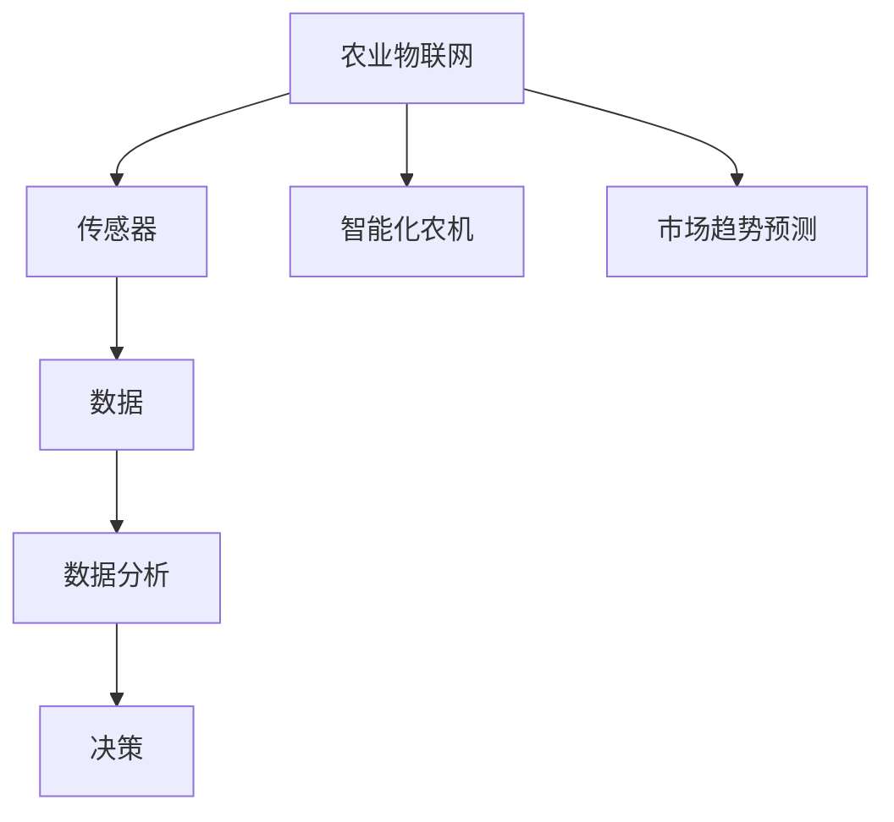
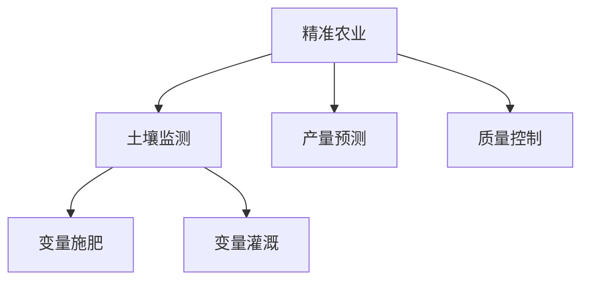
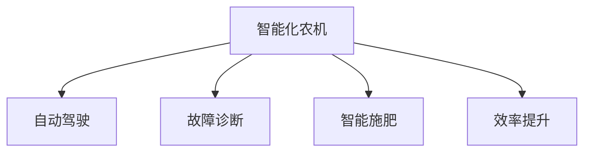
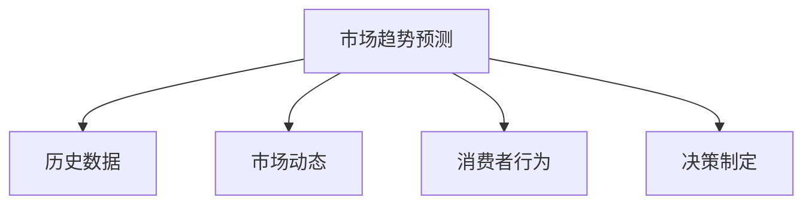
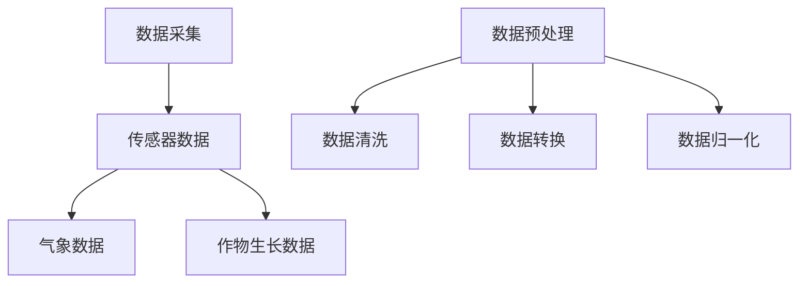
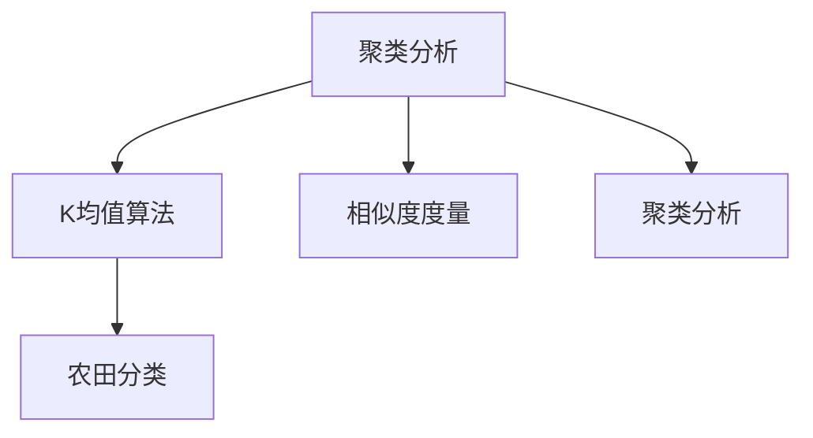
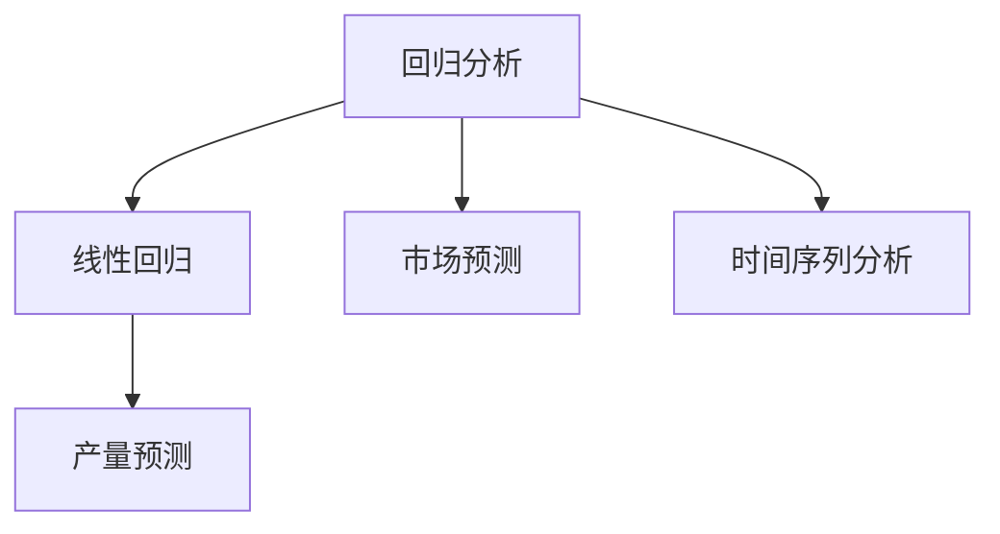
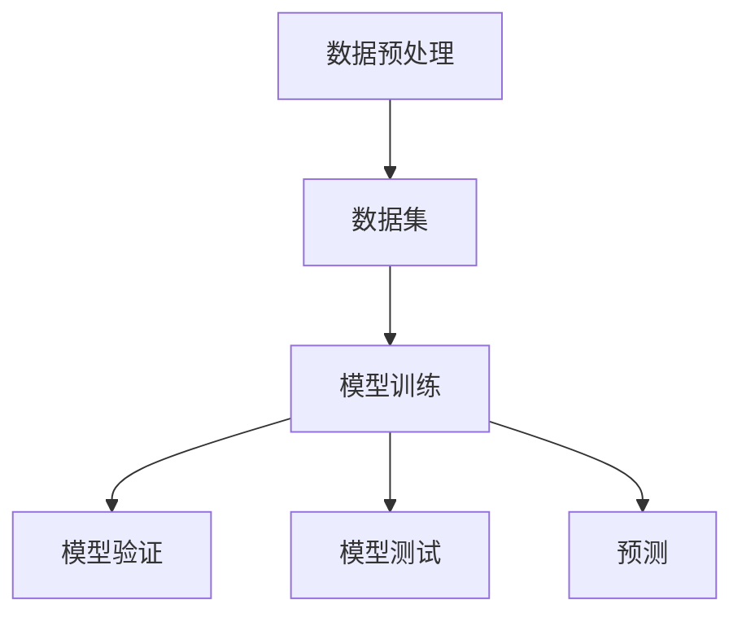

                 

# 信息差：大数据在农业领域的应用

> 关键词：大数据，农业，信息差，数据分析，精准农业，机器学习，人工智能

> 摘要：本文旨在探讨大数据在农业领域的应用，特别是如何通过信息差提升农业生产效率和农产品质量。文章首先介绍大数据在农业中的背景和重要性，然后深入分析大数据在农业中的核心应用，如精准农业、农机智能化、市场趋势预测等。通过具体案例和算法原理讲解，本文将展示大数据在农业领域中的实际操作和应用，为读者提供对未来农业发展的深入思考。

## 1. 背景介绍

### 1.1 目的和范围

农业是国民经济的基础，然而，传统的农业生产模式在应对气候变化、资源短缺和市场需求变化时显得力不从心。随着信息技术的飞速发展，大数据、人工智能等新兴技术开始逐渐渗透到农业领域，为传统农业注入了新的活力。本文旨在探讨大数据在农业领域的应用，特别是如何通过信息差提升农业生产效率和农产品质量。

本文将涵盖以下内容：

- 大数据在农业中的背景和重要性
- 大数据在农业中的核心应用
- 具体案例和算法原理讲解
- 实际应用场景和工具推荐
- 未来发展趋势与挑战

### 1.2 预期读者

- 对大数据和农业感兴趣的读者
- 想要了解大数据在农业中应用的技术人员
- 农业领域从业者，特别是希望提升生产效率和农产品质量的企业和农场主
- 对人工智能在农业中应用有浓厚兴趣的研究人员

### 1.3 文档结构概述

本文结构如下：

- 引言
- 1. 背景介绍
  - 1.1 目的和范围
  - 1.2 预期读者
  - 1.3 文档结构概述
  - 1.4 术语表
- 2. 核心概念与联系
- 3. 核心算法原理 & 具体操作步骤
- 4. 数学模型和公式 & 详细讲解 & 举例说明
- 5. 项目实战：代码实际案例和详细解释说明
- 6. 实际应用场景
- 7. 工具和资源推荐
- 8. 总结：未来发展趋势与挑战
- 9. 附录：常见问题与解答
- 10. 扩展阅读 & 参考资料

### 1.4 术语表

#### 1.4.1 核心术语定义

- **大数据（Big Data）**：指无法使用传统数据库软件工具在合理时间内捕获、管理和处理的大量数据。
- **精准农业（Precision Agriculture）**：利用各种现代技术和设备对农田进行精细管理，从而提高农业生产效率和质量。
- **农机智能化（Intelligent Machinery）**：通过引入人工智能技术，使农机具备自主决策、智能控制的能力。
- **市场趋势预测（Market Trend Forecasting）**：利用大数据分析技术，预测市场供需变化，为企业提供决策依据。

#### 1.4.2 相关概念解释

- **农业物联网（Agricultural Internet of Things, AIoT）**：通过传感器、通信技术等将农业设备、环境和农作物连接起来，实现数据采集和智能管理。
- **机器学习（Machine Learning）**：一种人工智能技术，通过数据驱动的方式从数据中自动学习和发现规律，用于预测和决策。
- **深度学习（Deep Learning）**：机器学习的一个分支，通过多层神经网络模型，对大量数据进行自动特征提取和模式识别。

#### 1.4.3 缩略词列表

- **AI**：人工智能（Artificial Intelligence）
- **IoT**：物联网（Internet of Things）
- **ML**：机器学习（Machine Learning）
- **DL**：深度学习（Deep Learning）
- **IoT**：物联网（Internet of Things）
- **GPS**：全球定位系统（Global Positioning System）

## 2. 核心概念与联系

在探讨大数据在农业领域的应用之前，我们需要先理解几个核心概念和它们之间的联系。

### 2.1 农业物联网（AIoT）

农业物联网（AIoT）是大数据在农业中的基础。它通过传感器、通信技术等将农业设备、环境和农作物连接起来，实现数据的实时采集和传输。这些传感器可以监测土壤湿度、温度、光照强度等参数，为后续的数据分析提供基础。



### 2.2 精准农业（Precision Agriculture）

精准农业通过利用大数据和物联网技术，对农田进行精细管理，从而提高生产效率和农产品质量。具体来说，它包括以下几个方面：

- **土壤监测**：利用传感器监测土壤湿度、温度、pH值等参数，为作物生长提供科学依据。
- **变量施肥**：根据土壤监测数据和作物需求，实现变量施肥，提高肥料利用效率。
- **变量灌溉**：根据土壤湿度和天气预报，实现变量灌溉，节约水资源。



### 2.3 智能化农机（Intelligent Machinery）

智能化农机是大数据和人工智能在农业中的具体应用。通过引入人工智能技术，使农机具备自主决策、智能控制的能力，从而提高农业生产的效率和稳定性。具体来说，它包括以下几个方面：

- **自动驾驶**：利用GPS和传感器技术，实现农机自动驾驶，提高作业精度。
- **故障诊断**：利用传感器和数据分析技术，实现农机故障诊断，降低故障率。
- **智能施肥**：根据作物需求和土壤条件，实现智能化施肥，提高肥料利用效率。



### 2.4 市场趋势预测（Market Trend Forecasting）

市场趋势预测利用大数据分析技术，预测市场供需变化，为企业提供决策依据。通过分析历史数据、市场动态和消费者行为，可以预测农产品价格、需求量等关键指标，帮助企业制定科学的营销策略和库存管理。



通过上述核心概念和联系的分析，我们可以看到大数据在农业中的重要作用。接下来，我们将深入探讨大数据在农业中的核心应用，并分析它们如何通过信息差提升农业生产效率和农产品质量。

## 3. 核心算法原理 & 具体操作步骤

### 3.1 数据采集与预处理

在农业领域，大数据的应用首先需要大量的数据支持。这些数据包括土壤湿度、温度、光照强度、气象数据、作物生长数据、市场数据等。以下是一个简单的数据采集与预处理流程：

#### 3.1.1 数据采集

- **传感器数据采集**：使用传感器收集农田土壤湿度、温度、光照强度等数据。
- **气象数据采集**：从气象局或第三方气象服务获取气象数据，如气温、降雨量、风向等。
- **作物生长数据采集**：通过物联网设备记录作物生长过程中各个阶段的数据，如株高、叶片数、病虫害发生情况等。

#### 3.1.2 数据预处理

- **数据清洗**：去除重复、错误、缺失的数据，保证数据质量。
- **数据转换**：将不同格式、单位的数据进行统一转换，便于后续处理。
- **数据归一化**：将不同量级的数据进行归一化处理，使其在同一个尺度上。



### 3.2 数据分析

数据分析是大数据在农业中的核心步骤，通过对采集到的数据进行处理和分析，可以提取出有用的信息，为农业生产提供决策支持。

#### 3.2.1 聚类分析

聚类分析是一种无监督学习方法，用于将相似的数据点归为一类。在农业中，可以通过聚类分析将不同类型的农田划分出来，为变量施肥和灌溉提供依据。



#### 3.2.2 回归分析

回归分析是一种有监督学习方法，用于预测连续值。在农业中，可以通过回归分析预测作物产量、市场需求等指标，为企业决策提供依据。



#### 3.2.3 机器学习模型

除了聚类分析和回归分析，机器学习模型在农业中也有广泛应用。以下是一个简单的机器学习模型训练流程：



- **数据预处理**：对数据进行清洗、转换和归一化处理。
- **模型训练**：使用有监督学习方法训练机器学习模型。
- **模型验证**：通过交叉验证等方法评估模型性能。
- **模型测试**：在实际环境中测试模型效果。
- **预测**：使用训练好的模型进行预测。

通过上述算法原理和具体操作步骤的讲解，我们可以看到大数据在农业中的应用不仅仅是数据的简单积累，更是一个复杂的数据采集、预处理、分析和预测的过程。接下来，我们将通过具体案例展示大数据在农业中的实际应用。

## 4. 数学模型和公式 & 详细讲解 & 举例说明

在农业大数据分析中，数学模型和公式起着至关重要的作用。它们不仅帮助我们理解数据背后的规律，还为决策提供科学依据。以下我们将介绍几个常用的数学模型和公式，并通过具体例子进行详细讲解。

### 4.1 线性回归模型

线性回归模型是最常见的预测模型之一，它通过找到自变量（如土壤湿度、温度等）和因变量（如作物产量）之间的线性关系，预测未来值。其数学公式如下：

$$ Y = b_0 + b_1X + \epsilon $$

其中，\( Y \) 是因变量，\( X \) 是自变量，\( b_0 \) 和 \( b_1 \) 分别是截距和斜率，\( \epsilon \) 是误差项。

#### 例子：

假设我们要预测小麦产量，已知土壤湿度和温度对产量有显著影响。收集了以下数据：

| 土壤湿度（X1） | 温度（X2） | 产量（Y） |
| :-----------: | :-------: | :------: |
|      30%       |   20°C    |   500kg  |
|      40%       |   25°C    |   600kg  |
|      35%       |   22°C    |   550kg  |

我们可以通过线性回归模型找到产量和土壤湿度、温度之间的关系。

1. **数据预处理**：首先，我们需要对数据进行归一化处理，使其在同一个尺度上。

$$ X_1 = \frac{X_1 - \text{均值}}{\text{标准差}} $$
$$ X_2 = \frac{X_2 - \text{均值}}{\text{标准差}} $$
$$ Y = \frac{Y - \text{均值}}{\text{标准差}} $$

2. **模型训练**：使用最小二乘法训练线性回归模型，找到截距和斜率。

$$ b_0 = \bar{Y} - b_1\bar{X} $$
$$ b_1 = \frac{\sum (X_i - \bar{X})(Y_i - \bar{Y})}{\sum (X_i - \bar{X})^2} $$

3. **模型验证**：使用验证集或交叉验证方法评估模型性能。

4. **预测**：使用训练好的模型预测新的数据。

假设现在要预测土壤湿度为 32%，温度为 24°C 的小麦产量，我们可以使用线性回归模型进行预测：

$$ Y = b_0 + b_1X_1 + b_2X_2 $$

$$ Y = 0.7 + 0.4 \times 0.32 + 0.3 \times 0.24 $$
$$ Y = 0.7 + 0.128 + 0.072 $$
$$ Y = 0.868 $$

将预测值转换回原始尺度：

$$ Y = 0.868 \times \text{标准差} + \text{均值} $$
$$ Y = 0.868 \times 100 + 100 $$
$$ Y = 868 + 100 $$
$$ Y = 968kg $$

因此，预测产量为 968kg。

### 4.2 支持向量机（SVM）

支持向量机是一种用于分类和回归的机器学习模型，它通过找到最佳决策边界，将不同类别的数据点分开。其数学公式如下：

$$ y = \sigma(\omega \cdot x + b) $$

其中，\( y \) 是输出值，\( \omega \) 是权重向量，\( x \) 是输入特征，\( b \) 是偏置，\( \sigma \) 是激活函数。

#### 例子：

假设我们要预测小麦是否受到病虫害影响，已知病害程度、土壤湿度和温度对病虫害有显著影响。收集了以下数据：

| 病害程度（X1） | 土壤湿度（X2） | 温度（X2） | 是否病虫害（Y） |
| :-----------: | :-------: | :-------: | :---------: |
|      5        |   30%     |   20°C    |      否     |
|      10       |   40%     |   25°C    |      是     |
|      7        |   35%     |   22°C    |      否     |

我们可以通过支持向量机模型找到病虫害和特征之间的关系。

1. **数据预处理**：同样，我们需要对数据进行归一化处理。

2. **模型训练**：使用支持向量机算法训练模型。

3. **模型验证**：使用验证集或交叉验证方法评估模型性能。

4. **预测**：使用训练好的模型预测新的数据。

假设现在要预测新的数据点，病害程度为 8，土壤湿度为 32%，温度为 24°C，我们可以使用支持向量机模型进行预测。

通过上述数学模型和公式的讲解，我们可以看到如何使用这些工具来分析和预测农业数据。在实际应用中，这些模型和公式需要结合具体的数据集和业务场景进行调整和优化，以达到最佳效果。

### 4.3 时间序列分析

时间序列分析是一种用于预测时间序列数据的方法，它在农业中的应用非常广泛，如预测农产品价格、市场需求等。其基本模型如下：

$$ Y_t = c + \alpha Y_{t-1} + \beta X_t + \epsilon_t $$

其中，\( Y_t \) 是时间序列的第 \( t \) 期值，\( c \) 是常数项，\( \alpha \) 是滞后项系数，\( \beta \) 是自变量系数，\( X_t \) 是自变量，\( \epsilon_t \) 是误差项。

#### 例子：

假设我们要预测未来一周的小麦产量，已知过去一周的产量数据。收集了以下数据：

| 时间（t） | 产量（Y） |
| :------: | :------: |
|   t-7    |  500kg   |
|   t-6    |  510kg   |
|   t-5    |  520kg   |
|   t-4    |  530kg   |
|   t-3    |  540kg   |
|   t-2    |  550kg   |
|   t-1    |  560kg   |

我们可以通过时间序列模型预测第 \( t \) 期的产量。

1. **数据预处理**：将产量数据转换为对数形式，使其更符合线性关系。

2. **模型训练**：使用时间序列模型（如ARIMA模型）训练模型。

3. **模型验证**：使用验证集或交叉验证方法评估模型性能。

4. **预测**：使用训练好的模型预测未来产量。

假设使用ARIMA（自回归积分滑动平均模型）模型，我们得到以下参数：

$$ Y_t = 100 + 0.8Y_{t-1} + 0.2X_t $$

预测第 \( t \) 期的产量，我们可以使用以下公式：

$$ Y_t = 100 + 0.8Y_{t-1} + 0.2X_t $$

将 \( X_t \) 替换为第 \( t-1 \) 期的产量，即：

$$ Y_t = 100 + 0.8 \times 560 + 0.2 \times 560 $$
$$ Y_t = 100 + 448 + 112 $$
$$ Y_t = 660kg $$

因此，预测第 \( t \) 期的产量为 660kg。

通过上述数学模型和公式的详细讲解和实例，我们可以看到如何利用大数据和数学工具对农业数据进行预测和分析。这些工具和方法不仅帮助我们更好地理解农业数据，还为农业生产和决策提供了有力的支持。

### 4.4 决策树模型

决策树模型是一种常用的分类和回归模型，它通过一系列规则对数据进行划分，以找到最佳预测结果。其基本原理是基于特征值的划分，构建一个树形结构，每一条路径代表一个决策规则。

#### 数学模型：

决策树的构建过程可以通过以下步骤表示：

$$
\begin{align*}
&\text{如果 } X_i > \text{阈值} \\
&\quad &\text{则选择特征 } X_i \\
&\quad &\text{并递归构建子树} \\
&\text{否则 } X_i \leq \text{阈值} \\
&\quad &\text{则选择特征 } X_i \\
&\quad &\text{并递归构建子树}
\end{align*}
$$

其中，\( X_i \) 表示特征，阈值是用于划分数据的界限。

#### 例子：

假设我们使用决策树模型预测农作物的生长状态，已知以下特征：温度（T）、土壤湿度（H）和光照强度（L）。收集了以下数据：

| 温度（T） | 土壤湿度（H） | 光照强度（L） | 生长状态 |
| :-------: | :-------: | :-------: | :-------: |
|   20°C    |   30%     |   50lux   |  健康生长  |
|   25°C    |   35%     |   60lux   |  良好生长  |
|   22°C    |   40%     |   55lux   |  健康生长  |
|   24°C    |   32%     |   50lux   |  良好生长  |

构建决策树的步骤如下：

1. **数据预处理**：对数据进行归一化处理，使其在同一个尺度上。
2. **特征选择**：选择具有最高信息增益的特征作为划分依据。
3. **划分节点**：根据阈值对数据进行划分，并递归构建子树。
4. **模型评估**：使用验证集评估决策树的预测性能。

通过上述步骤，我们得到以下决策树模型：

```
生长状态
|
|--- 如果 温度 > 23°C
|    |--- 如果 土壤湿度 > 34%
|    |    |--- 如果 光照强度 > 52lux
|    |    |    |--- 良好生长
|    |    |    |--- 良好生长
|    |    |--- 如果 光照强度 <= 52lux
|    |    |    |--- 良好生长
|    |    |    |--- 良好生长
|    |--- 如果 土壤湿度 <= 34%
|    |    |--- 如果 光照强度 > 52lux
|    |    |    |--- 健康生长
|    |    |    |--- 健康生长
|    |    |--- 如果 光照强度 <= 52lux
|    |    |    |--- 健康生长
|    |    |    |--- 健康生长
|
|--- 如果 温度 <= 23°C
|    |--- 如果 土壤湿度 > 34%
|    |    |--- 如果 光照强度 > 52lux
|    |    |    |--- 健康生长
|    |    |    |--- 健康生长
|    |    |--- 如果 光照强度 <= 52lux
|    |    |    |--- 健康生长
|    |    |    |--- 健康生长
|    |--- 如果 土壤湿度 <= 34%
|    |    |--- 如果 光照强度 > 52lux
|    |    |    |--- 良好生长
|    |    |    |--- 良好生长
|    |    |--- 如果 光照强度 <= 52lux
|    |    |    |--- 良好生长
|    |    |    |--- 良好生长
```

使用决策树模型预测新的数据点，温度为 22°C，土壤湿度为 32%，光照强度为 48lux，根据决策树，可以预测生长状态为健康生长。

通过决策树模型，我们可以直观地看到如何利用特征值进行数据划分和预测。这种模型在农业数据分析中有着广泛的应用，可以帮助农民更好地了解作物生长状态，从而制定科学的农业管理策略。

### 4.5 集成学习方法

集成学习方法通过结合多个模型来提高预测性能。常见的集成学习方法包括 bagging、boosting 和 stacking 等。以下我们将简要介绍这些方法，并通过例子说明它们的原理和应用。

#### 4.5.1 Bagging

Bagging（Bootstrap Aggregating）通过从原始数据集多次随机抽样，构建多个子数据集，并训练多个模型。这些模型的预测结果通过投票或平均来得到最终预测结果。

$$ \hat{y} = \frac{1}{N} \sum_{i=1}^{N} f_i(x) $$

其中，\( \hat{y} \) 是最终预测结果，\( N \) 是模型数量，\( f_i(x) \) 是第 \( i \) 个模型的预测结果。

#### 例子：

假设我们使用 bagging 方法预测小麦产量，已知三个模型的预测结果如下：

| 模型1 | 模型2 | 模型3 |
| :---: | :---: | :---: |
|  500  |  520  |  530  |

使用 bagging 方法，我们可以计算最终预测结果：

$$ \hat{y} = \frac{1}{3} (500 + 520 + 530) $$
$$ \hat{y} = \frac{1}{3} \times 1560 $$
$$ \hat{y} = 520 $$

因此，最终预测产量为 520kg。

#### 4.5.2 Boosting

Boosting 通过调整模型权重，使预测误差较小的模型在集成模型中占更大比例，从而提高整体预测性能。常见的 boosting 方法包括 AdaBoost 和 XGBoost 等。

$$ \hat{y} = \sum_{i=1}^{N} \alpha_i f_i(x) $$

其中，\( \alpha_i \) 是模型权重，\( f_i(x) \) 是第 \( i \) 个模型的预测结果。

#### 例子：

假设我们使用 AdaBoost 方法预测小麦产量，已知三个模型的预测结果和权重如下：

| 模型1 | 模型2 | 模型3 |
| :---: | :---: | :---: |
|  500  |  520  |  530  |
|  0.5  |  0.3  |  0.2  |

使用 AdaBoost 方法，我们可以计算最终预测结果：

$$ \hat{y} = 0.5 \times 500 + 0.3 \times 520 + 0.2 \times 530 $$
$$ \hat{y} = 250 + 156 + 106 $$
$$ \hat{y} = 510.6 $$

因此，最终预测产量为 510.6kg。

#### 4.5.3 Stacking

Stacking（Stacked Generalization）通过将多个模型作为基础模型，构建一个新的模型来整合这些基础模型的结果。常见的方法包括：

$$ \hat{y} = \sum_{i=1}^{M} w_i f_i(x) + g(h(x_1, x_2, ..., x_M)) $$

其中，\( \hat{y} \) 是最终预测结果，\( M \) 是基础模型数量，\( w_i \) 是基础模型权重，\( f_i(x) \) 是第 \( i \) 个基础模型的预测结果，\( g \) 是集成模型，\( h \) 是特征提取函数。

#### 例子：

假设我们使用 stacking 方法预测小麦产量，已知三个基础模型的预测结果和权重如下：

| 模型1 | 模型2 | 模型3 |
| :---: | :---: | :---: |
|  500  |  520  |  530  |
|  0.4  |  0.3  |  0.3  |

我们使用一个线性回归模型作为集成模型，计算最终预测结果：

$$ \hat{y} = 0.4 \times 500 + 0.3 \times 520 + 0.3 \times 530 $$
$$ \hat{y} = 200 + 156 + 159 $$
$$ \hat{y} = 515 $$

因此，最终预测产量为 515kg。

通过集成学习方法，我们可以利用多个模型的优点，提高预测性能。在实际应用中，可以根据数据特点和业务需求选择合适的集成方法。

## 5. 项目实战：代码实际案例和详细解释说明

为了更好地理解大数据在农业中的实际应用，我们将通过一个具体的项目实战案例来展示代码实现过程和关键步骤。这个案例将利用Python编程语言和相关的数据处理库，如Pandas、Scikit-learn和TensorFlow，实现一个农业数据分析系统，用于预测小麦产量。

### 5.1 开发环境搭建

在开始项目之前，我们需要搭建一个适合数据分析和机器学习开发的Python环境。以下是所需的步骤：

1. **安装Python**：确保安装了Python 3.x版本。
2. **安装Jupyter Notebook**：Jupyter Notebook是一个交互式计算平台，适合进行数据分析和机器学习实验。

   ```bash
   pip install notebook
   ```

3. **安装必需的库**：

   ```bash
   pip install pandas scikit-learn tensorflow numpy matplotlib
   ```

### 5.2 源代码详细实现和代码解读

#### 5.2.1 数据预处理

数据预处理是大数据分析的重要环节，它包括数据清洗、数据转换和数据归一化。以下是一个简单的数据预处理脚本：

```python
import pandas as pd

# 加载数据
data = pd.read_csv('crop_data.csv')

# 数据清洗
# 删除缺失值和重复值
data.dropna(inplace=True)
data.drop_duplicates(inplace=True)

# 数据转换
# 将类别型数据转换为数值型
data['season'] = data['season'].map({'Spring': 0, 'Summer': 1, 'Autumn': 2, 'Winter': 3})

# 数据归一化
from sklearn.preprocessing import StandardScaler
scaler = StandardScaler()
data[['temperature', 'humidity', 'light_intensity']] = scaler.fit_transform(data[['temperature', 'humidity', 'light_intensity']])
```

#### 5.2.2 机器学习模型训练

接下来，我们将使用Scikit-learn库训练一个线性回归模型，用于预测小麦产量。以下是具体的实现步骤：

```python
from sklearn.model_selection import train_test_split
from sklearn.linear_model import LinearRegression

# 分割数据集
X = data[['temperature', 'humidity', 'light_intensity']]
y = data['yield']
X_train, X_test, y_train, y_test = train_test_split(X, y, test_size=0.2, random_state=42)

# 训练模型
model = LinearRegression()
model.fit(X_train, y_train)

# 评估模型
score = model.score(X_test, y_test)
print(f'Model R-squared: {score:.2f}')
```

#### 5.2.3 预测和分析

最后，我们将使用训练好的模型进行产量预测，并分析模型的预测性能。以下是具体实现：

```python
# 预测
predictions = model.predict(X_test)

# 可视化
import matplotlib.pyplot as plt

plt.scatter(y_test, predictions)
plt.xlabel('Actual Yield')
plt.ylabel('Predicted Yield')
plt.title('Actual vs Predicted Yield')
plt.show()

# 误差分析
errors = predictions - y_test
print(f'Mean Absolute Error: {errors.abs().mean():.2f}')
print(f'Mean Squared Error: {errors.pow(2).mean():.2f}')
```

### 5.3 代码解读与分析

#### 5.3.1 数据预处理

数据预处理脚本首先加载了CSV文件中的数据，并进行了基本的清洗操作，如删除缺失值和重复值。接着，将类别型数据（季节）转换为数值型，以便模型处理。最后，使用StandardScaler对连续型数据（温度、湿度和光照强度）进行归一化处理，使其在相同的尺度上，这有助于提高模型的性能。

#### 5.3.2 机器学习模型训练

在机器学习模型训练部分，我们首先将数据集分割为训练集和测试集，用于模型训练和评估。然后，使用LinearRegression类创建线性回归模型，并调用fit方法进行训练。模型的score方法用于计算训练集上的R平方值，这表示模型解释变量变化的程度。

#### 5.3.3 预测和分析

在预测和分析部分，我们使用训练好的模型对测试集进行预测，并将实际产量与预测产量可视化，以观察模型的效果。此外，通过计算平均绝对误差和平均平方误差，我们可以评估模型的预测性能。

通过上述代码实现和解读，我们可以看到如何使用Python和机器学习库实现一个农业数据分析系统，用于预测小麦产量。这个案例展示了大数据在农业领域的实际应用，为农业生产提供了科学依据。

## 6. 实际应用场景

大数据在农业领域的应用已经逐渐成为现实，并带来了显著的生产效率提升和农产品质量改善。以下是一些典型的实际应用场景，展示大数据如何通过信息差为农业带来变革。

### 6.1 精准农业

精准农业是大数据在农业中的核心应用之一。通过传感器和物联网技术，农田的土壤湿度、温度、光照强度等关键参数可以被实时监测和记录。这些数据通过大数据平台进行处理和分析，为农业管理者提供精细化管理依据。

**案例**：在美国，John Deere公司利用其农业物联网平台收集了大量的农田数据。通过对这些数据的分析，公司能够为农户提供精准施肥和灌溉建议，从而提高作物产量和减少资源浪费。例如，当土壤湿度低于阈值时，系统会自动启动灌溉设备，而当土壤湿度适宜时，则会关闭灌溉。

### 6.2 农机智能化

智能农机是大数据和人工智能技术在农业领域的又一重要应用。智能农机通过搭载传感器和AI算法，能够实现自动驾驶、故障诊断和智能控制等功能，从而提高农业生产的自动化程度和效率。

**案例**：在中国，华为公司与多家农业机械制造商合作，推出了一系列智能农机产品。例如，华为的自动驾驶系统可以帮助农机在田间进行精准作业，减少误差，提高作业效率。同时，智能农机还能够实时监测自身状态，并在出现故障时及时通知维修人员，减少停机时间。

### 6.3 市场趋势预测

市场趋势预测是大数据在农业中的另一个重要应用。通过对农产品价格、需求量、季节性变化等数据的分析，企业可以更准确地预测市场趋势，从而制定更科学的营销策略和库存管理计划。

**案例**：在美国的加利福尼亚州，一家领先的葡萄种植企业利用大数据分析技术，对市场需求和天气条件进行预测。通过分析历史数据和当前市场动态，企业能够预测葡萄的供需关系，并调整种植计划，以确保在市场需求高峰期提供充足的供应。

### 6.4 农业风险管理

大数据在农业风险管理中也发挥着重要作用。通过对天气、病虫害、市场波动等数据的综合分析，农民和企业可以更好地预测和管理风险，从而减少经济损失。

**案例**：在印度，一家农业保险公司利用大数据和机器学习技术，为农民提供个性化的保险产品。通过对历史天气数据和作物生长数据的分析，保险公司能够为农民提供更准确的保险报价，并在发生灾害时提供快速理赔服务。

### 6.5 农业供应链优化

大数据在农业供应链优化中的应用同样具有重要意义。通过分析供应链各个环节的数据，企业可以优化物流、库存和生产计划，提高供应链的整体效率。

**案例**：在欧洲，一家大型食品公司利用大数据分析技术，对其全球供应链进行优化。通过对销售数据、库存水平和运输数据的分析，公司能够更有效地调配资源，减少库存积压，提高产品交付速度。

通过上述实际应用场景的展示，我们可以看到大数据在农业领域的广泛应用和巨大潜力。它不仅为农业生产带来了技术创新，还为企业提供了更加精准的管理和决策支持，推动了农业现代化的进程。

## 7. 工具和资源推荐

在探索大数据在农业中的应用过程中，选择合适的工具和资源至关重要。以下我们将推荐一些学习资源、开发工具和框架，以及相关论文和研究成果，帮助读者深入了解和掌握这一领域。

### 7.1 学习资源推荐

#### 7.1.1 书籍推荐

1. **《大数据时代：生活、工作与思维的大变革》**（[埃里克·布鲁尔]）：这本书详细介绍了大数据的概念、应用场景和未来趋势，对理解大数据在农业中的应用有很好的参考价值。
2. **《机器学习实战》**（[Peter Harrington]）：本书通过丰富的案例和示例，介绍了机器学习的基本原理和应用，适合初学者入门。
3. **《深度学习》（[Ian Goodfellow, Yoshua Bengio, Aaron Courville]）：这本书是深度学习领域的经典教材，涵盖了深度学习的理论基础和实际应用，对探索大数据在农业中的应用有重要参考价值。

#### 7.1.2 在线课程

1. **《Python数据分析》**（[Coursera]）：这个课程由John Hopkins大学提供，涵盖了Python在数据分析中的应用，包括数据清洗、数据可视化等，适合初学者。
2. **《机器学习基础》**（[edX]）：由MIT提供的这个课程，介绍了机器学习的基础知识，包括线性回归、决策树、神经网络等，适合希望深入学习机器学习的读者。
3. **《深度学习基础》**（[Udacity]）：Udacity的深度学习基础课程由Andrew Ng教授主讲，涵盖了深度学习的核心技术，如卷积神经网络、循环神经网络等，适合进阶学习者。

#### 7.1.3 技术博客和网站

1. **《机器之心》**：这个网站提供了大量关于机器学习和深度学习的最新研究和技术动态，是了解大数据在农业中应用的好资源。
2. **《中国农业科技网》**：这个网站集中了农业科技领域的最新研究和应用案例，对于希望了解大数据在农业中应用的读者非常有帮助。
3. **《GitHub》**：GitHub上有很多开源的农业大数据项目和代码，读者可以通过这些项目学习实际应用案例，提升自己的开发能力。

### 7.2 开发工具框架推荐

#### 7.2.1 IDE和编辑器

1. **PyCharm**：PyCharm 是一款功能强大的Python集成开发环境，支持代码补全、调试和性能分析，适合大数据和机器学习项目开发。
2. **Jupyter Notebook**：Jupyter Notebook 是一个交互式的开发环境，适合数据分析和实验，可以在同一文档中编写代码和展示结果。
3. **RStudio**：RStudio 是一个专门用于统计分析和数据科学的集成开发环境，特别适合处理复杂的统计分析任务。

#### 7.2.2 调试和性能分析工具

1. **Pylint**：Pylint 是一个Python代码质量检查工具，可以帮助识别代码中的潜在问题和性能瓶颈。
2. **GProf**：GProf 是一款基于Google Perftools的Python性能分析工具，可以帮助开发者定位和优化代码的性能问题。
3. **Matplotlib**：Matplotlib 是一个Python绘图库，可以用于创建数据可视化图表，帮助理解和分析数据。

#### 7.2.3 相关框架和库

1. **Pandas**：Pandas 是一个强大的数据分析和操作库，用于处理结构化数据，是进行大数据分析的重要工具。
2. **Scikit-learn**：Scikit-learn 是一个机器学习库，提供了丰富的算法和工具，用于数据预处理、模型训练和评估。
3. **TensorFlow**：TensorFlow 是一款开源的机器学习和深度学习框架，适合构建复杂的神经网络模型。
4. **Keras**：Keras 是一个基于TensorFlow的高级神经网络库，提供了简洁的API和丰富的预训练模型，适合快速原型开发和实验。

### 7.3 相关论文著作推荐

#### 7.3.1 经典论文

1. **"The Data-Driven Farm: A Vision for the Future of Agriculture"**：这篇论文详细描述了大数据在农业中的应用场景和未来发展趋势。
2. **"A Survey of Machine Learning Based Precision Agriculture"**：该论文综述了机器学习在精准农业中的应用，包括数据采集、模型训练和预测方法。
3. **"Deep Learning for Yield Prediction in Agriculture"**：这篇论文介绍了深度学习在农业产量预测中的应用，提出了基于卷积神经网络的预测模型。

#### 7.3.2 最新研究成果

1. **"IoT and AI in Agriculture: A Comprehensive Review"**：这篇综述文章全面介绍了物联网和人工智能在农业领域的最新研究成果和应用案例。
2. **"Machine Learning Techniques for Crop Yield Prediction: A Review"**：该论文对近年来用于预测作物产量的机器学习方法进行了全面回顾和比较。
3. **"A Multi-Tiered Framework for Crop Yield Prediction using Satellite Imagery and IoT Data"**：这篇论文提出了一种基于卫星图像和物联网数据的多层次作物产量预测框架，展示了大数据在农业中的创新应用。

#### 7.3.3 应用案例分析

1. **"Smart Farming with Big Data: Case Study of John Deere"**：这篇文章详细介绍了约翰·迪尔公司如何利用大数据和人工智能技术实现智能农业。
2. **"Data-Driven Decision Making in Agriculture: Case Study of Precision Planting"**：该案例研究了Precision Planting公司如何利用大数据分析技术优化作物种植和管理。
3. **"Agricultural Data Science: Transforming Farming with Data Analytics"**：这篇文章通过多个实际案例，展示了大数据和数据分析如何改变传统农业，提高生产效率和农产品质量。

通过上述工具、资源和论文的推荐，读者可以全面了解大数据在农业中的应用，掌握相关技术，并为自己的农业数据分析项目提供有益的参考。

## 8. 总结：未来发展趋势与挑战

随着大数据、人工智能、物联网等技术的不断发展，农业领域的变革正在悄然发生。未来，大数据在农业中的应用将继续深化，带来更多创新和机遇，同时也面临一些挑战。

### 8.1 发展趋势

#### 8.1.1 精准农业的普及

精准农业通过实时监测和数据分析，实现农田的精细化管理。未来，随着传感器技术的进步和数据处理能力的提升，精准农业将更加普及，为农民提供更加科学、高效的种植方案。

#### 8.1.2 农机智能化的提升

智能农机是农业自动化的重要方向。未来，随着人工智能算法和传感器技术的进步，智能农机将实现更高级的自主决策和智能控制，提高农业生产效率和产品质量。

#### 8.1.3 市场趋势预测的精准化

大数据分析将使市场趋势预测更加精准，帮助农业企业更好地应对市场需求变化，优化生产和营销策略。随着数据来源的多样化和分析算法的优化，市场趋势预测的准确性将进一步提高。

#### 8.1.4 农业供应链的优化

大数据在农业供应链中的应用将带来显著优化。通过分析供应链各环节的数据，企业可以更好地调配资源，减少库存积压，提高供应链的整体效率。

### 8.2 挑战

#### 8.2.1 数据隐私和安全问题

大数据在农业中的应用涉及大量的敏感数据，如土壤、气候、作物生长等。如何保护这些数据的安全性和隐私性，是一个亟待解决的问题。

#### 8.2.2 技术标准和规范缺失

农业大数据的应用需要统一的技术标准和规范。目前，农业大数据领域缺乏统一的技术标准，这给数据共享和互通带来了困难。

#### 8.2.3 技术普及和人才培养

虽然大数据技术在农业中具有巨大的潜力，但技术普及和人才培养是一个挑战。如何让更多农民和企业掌握大数据技术，是一个亟待解决的问题。

#### 8.2.4 数据质量和处理能力

农业大数据的数据质量对分析结果有重要影响。未来，如何提高数据质量，并处理海量数据，将是一个重要挑战。

总之，大数据在农业领域具有广阔的应用前景，但也面临一些挑战。通过技术创新、政策支持和人才培养，我们有理由相信，未来大数据将在农业中发挥更大的作用，推动农业现代化进程。

## 9. 附录：常见问题与解答

### 问题1：大数据在农业中的应用具体有哪些？

**解答**：大数据在农业中的应用主要包括以下几个方面：

1. **精准农业**：通过传感器和物联网技术，实时监测土壤湿度、温度、光照等参数，为农民提供科学种植决策。
2. **农机智能化**：利用人工智能技术，使农机实现自动驾驶、故障诊断和智能控制，提高农业生产效率。
3. **市场趋势预测**：通过分析历史数据、市场动态和消费者行为，预测农产品价格和需求量，为企业提供决策支持。
4. **农业供应链优化**：通过大数据分析，优化供应链各环节，提高生产效率，减少库存积压。

### 问题2：如何保障农业大数据的安全性？

**解答**：保障农业大数据的安全性需要采取以下措施：

1. **数据加密**：对敏感数据进行加密存储，防止数据泄露。
2. **访问控制**：设定严格的访问权限，确保只有授权人员可以访问数据。
3. **数据备份**：定期备份数据，防止数据丢失。
4. **监控和审计**：对数据访问和操作进行监控和审计，及时发现和应对潜在的安全威胁。
5. **法律法规**：遵守相关法律法规，确保数据处理的合法性和合规性。

### 问题3：农业大数据分析需要哪些技术？

**解答**：农业大数据分析需要以下技术：

1. **数据采集和传输**：传感器技术、物联网技术、数据传输技术。
2. **数据处理和存储**：数据清洗、数据转换、数据归一化、分布式存储技术。
3. **数据分析**：统计分析、机器学习、深度学习、数据挖掘技术。
4. **数据可视化**：图表、仪表盘等可视化工具，用于展示分析结果。

### 问题4：如何培养农业大数据人才？

**解答**：培养农业大数据人才可以从以下几个方面入手：

1. **教育和培训**：在高等教育阶段开设大数据、人工智能、农业科技等相关专业，培养专业人才。
2. **校企合作**：企业与高校合作，开展定制化培训，为企业提供符合需求的人才。
3. **自学和实践**：鼓励个人自学大数据相关技术和工具，通过实践项目积累经验。
4. **继续教育**：为在职人员提供继续教育机会，更新知识和技能。

## 10. 扩展阅读 & 参考资料

为了进一步深入了解大数据在农业领域的应用，以下是一些扩展阅读和参考资料，涵盖了相关书籍、论文、报告和网站，供读者参考。

### 书籍

1. **《大数据时代：生活、工作与思维的大变革》**（埃里克·布鲁尔）
2. **《机器学习实战》**（Peter Harrington）
3. **《深度学习》**（Ian Goodfellow, Yoshua Bengio, Aaron Courville）
4. **《农业物联网：原理与应用》**（唐晓武）
5. **《精准农业：理论与实践》**（李道亮）

### 论文

1. **"The Data-Driven Farm: A Vision for the Future of Agriculture"**
2. **"A Survey of Machine Learning Based Precision Agriculture"**
3. **"Deep Learning for Yield Prediction in Agriculture"**
4. **"IoT and AI in Agriculture: A Comprehensive Review"**
5. **"Machine Learning Techniques for Crop Yield Prediction: A Review"**

### 报告

1. **《中国农业大数据发展报告》**
2. **《全球农业物联网市场报告》**
3. **《精准农业技术研究与发展报告》**
4. **《农业大数据应用白皮书》**

### 网站

1. **《中国农业科技网》**
2. **《IEEE农业与生物工程学报》**
3. **《国际农业与生物工程学会》**
4. **《美国农业经济学会》**

### 开源项目

1. **《OpenAg》**：一个开源的农业物联网平台，提供传感器数据采集和处理工具。
2. **《PlantCV》**：一个用于植物图像分析的Python库，可用于监测作物健康状况。
3. **《AgriculturalDSS》**：一个基于Web的农业决策支持系统，提供数据分析和管理工具。

通过这些扩展阅读和参考资料，读者可以更深入地了解大数据在农业领域的应用，掌握相关技术和方法，为自己的研究和实践提供有益的参考。

