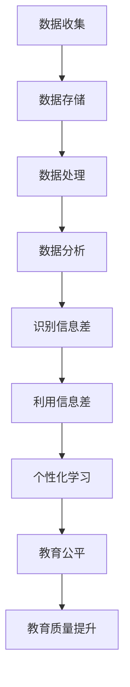

                 

# 信息差：大数据在教育领域的应用

> **关键词**：大数据、教育、信息差、个性化学习、数据分析

> **摘要**：本文深入探讨了大数据在教育领域的应用，特别是如何通过信息差的识别和利用，实现个性化学习、教育公平和提升教育质量。文章将一步步分析大数据在教育中的核心概念、算法原理、数学模型，并通过实际案例展示大数据如何改变教育的现状，最后对未来的发展趋势和挑战进行展望。

## 1. 背景介绍

### 1.1 目的和范围

本文旨在探讨大数据在教育领域的应用，尤其是如何通过大数据技术来识别和利用信息差，从而改善教育质量、促进教育公平。信息差在这里指的是不同学习者之间、教育资源和学习者之间、以及不同教育阶段之间的知识和资源差异。本文将分析大数据在教育中的核心概念、算法原理、数学模型，并通过实际案例来展示大数据如何发挥作用。

### 1.2 预期读者

本文面向对大数据和教育领域有一定了解的技术人员、教育工作者以及对教育技术感兴趣的研究者。希望通过本文，读者能够更深入地理解大数据在教育中的应用，并激发进一步研究和探索的兴趣。

### 1.3 文档结构概述

本文分为十个部分，首先介绍大数据在教育领域的背景和目的，然后逐步深入到核心概念、算法原理、数学模型等，接着通过实际案例展示应用，最后对未来的发展趋势和挑战进行展望。具体结构如下：

- 背景介绍
  - 1.1 目的和范围
  - 1.2 预期读者
  - 1.3 文档结构概述
  - 1.4 术语表
- 核心概念与联系
- 核心算法原理 & 具体操作步骤
- 数学模型和公式 & 详细讲解 & 举例说明
- 项目实战：代码实际案例和详细解释说明
- 实际应用场景
- 工具和资源推荐
- 总结：未来发展趋势与挑战
- 附录：常见问题与解答
- 扩展阅读 & 参考资料

### 1.4 术语表

#### 1.4.1 核心术语定义

- **大数据**：指无法使用传统数据处理工具在合理时间内捕获、管理和处理的大量数据。
- **信息差**：指不同主体间对知识和资源的差异。
- **个性化学习**：根据学习者的个人特点和学习需求，提供定制化的学习路径、资源和指导。
- **教育公平**：确保每个学习者都能获得平等的教育机会和资源。
- **数据分析**：使用统计和数学方法对数据进行分析，从中提取有价值的信息和知识。

#### 1.4.2 相关概念解释

- **数据挖掘**：从大量数据中发现有趣的模式、趋势和关联。
- **机器学习**：通过算法和统计模型，让计算机从数据中学习并做出预测或决策。
- **教育技术**：利用计算机、网络和其他技术来促进学习过程和学习效果。

#### 1.4.3 缩略词列表

- **Hadoop**：一个分布式数据存储和处理框架。
- **Spark**：一个快速的大数据处理引擎。
- **TensorFlow**：一个开源的机器学习和深度学习框架。
- **MLlib**：一个在大数据环境中使用的机器学习库。

## 2. 核心概念与联系

为了更好地理解大数据在教育领域的应用，我们需要先明确几个核心概念，包括大数据的基本原理、数据在教育中的重要性，以及如何通过大数据技术来识别和利用信息差。

### 2.1 大数据的基本原理

大数据通常具有以下四个V特征：

- **Volume（体量）**：数据量巨大，超出了传统数据管理系统的处理能力。
- **Velocity（速度）**：数据生成和处理的速度快，需要实时或近实时地进行分析和处理。
- **Variety（多样性）**：数据类型繁多，包括结构化、半结构化和非结构化数据。
- **Veracity（真实性）**：数据的质量和真实性难以保证，可能存在噪声、错误和不一致性。

大数据的基本原理主要包括数据收集、存储、处理和分析。通过使用分布式存储和处理技术，如Hadoop和Spark，可以有效地管理和处理大量数据。

### 2.2 数据在教育中的重要性

数据在教育中的重要性体现在多个方面：

- **个性化学习**：通过收集和分析学生的学习行为数据，可以为每个学生提供个性化的学习资源和指导。
- **教育评估**：利用学生成绩、作业和考试数据，可以更准确地评估学习效果，并发现学习问题。
- **资源分配**：根据学校和学生数据，可以更合理地分配教育资源，确保教育公平。
- **教育研究**：通过分析大量教育数据，可以深入理解教育现象，为教育改革提供数据支持。

### 2.3 信息差的识别和利用

信息差是指不同学习者之间、教育资源和学习者之间、以及不同教育阶段之间的知识和资源差异。通过大数据技术，可以有效地识别和利用信息差：

- **识别信息差**：通过分析学生学习行为、考试成绩、资源访问记录等数据，可以识别出学习者和教育资源之间的信息差。
- **利用信息差**：利用大数据分析结果，可以为学生提供个性化的学习资源、指导和建议，从而缩小信息差。

#### 2.3.1 Mermaid 流程图

下面是一个简化的Mermaid流程图，展示了大数据在教育中识别和利用信息差的基本流程：



## 3. 核心算法原理 & 具体操作步骤

在理解了大数据的基本原理和信息差的识别与利用后，接下来我们将讨论几个核心算法原理，并详细讲解其具体操作步骤。

### 3.1 数据分析算法

数据分析算法是大数据应用的核心。以下是几种常用的数据分析算法及其基本原理：

#### 3.1.1 K-Means 算法

K-Means算法是一种聚类算法，用于将数据集划分为K个簇，使得每个簇内的数据点尽可能相似，而簇与簇之间的数据点尽可能不同。

**算法原理：**

1. 随机选择K个数据点作为初始聚类中心。
2. 对于每个数据点，计算其到每个聚类中心的距离，并将其分配到最近的聚类中心所在的簇。
3. 更新每个簇的聚类中心，即计算簇内所有数据点的平均值。
4. 重复步骤2和步骤3，直到聚类中心不再发生变化或达到最大迭代次数。

**伪代码：**

```python
def KMeans(data, K, max_iterations):
    # 初始化聚类中心
    centroids = initialize_centroids(data, K)
    
    for i in range(max_iterations):
        # 分配数据点到簇
        clusters = assign_points_to_clusters(data, centroids)
        
        # 更新聚类中心
        centroids = update_centroids(clusters, K)
        
        # 检查收敛条件
        if has_converged(centroids):
            break
    
    return clusters, centroids
```

#### 3.1.2 决策树算法

决策树是一种用于分类和回归的监督学习算法，通过一系列if-else判断来划分数据集，并最终生成一棵树形结构。

**算法原理：**

1. 选择一个特征，计算该特征的所有可能的划分方式。
2. 计算每个划分方式的增益，选择增益最大的划分方式作为当前节点的划分。
3. 重复步骤1和步骤2，直到满足停止条件（例如，叶节点中的数据点全部属于同一类别或达到最大深度）。

**伪代码：**

```python
def build_decision_tree(data, features, max_depth):
    # 停止条件
    if all_same_class(data) or max_depth == 0:
        return create_leaf_node(data)
    
    # 选择最佳特征和划分
    best_feature, best_split = find_best_split(data, features)
    
    # 创建节点
    node = DecisionNode(feature=best_feature, split=best_split)
    
    # 划分数据集
    for value, subset in split_data(data, best_split):
        node.add_child(build_decision_tree(subset, features, max_depth - 1))
    
    return node
```

### 3.2 数据处理算法

除了数据分析算法，数据处理也是大数据应用中至关重要的一环。以下是几种常用的数据处理算法：

#### 3.2.1 MapReduce 算法

MapReduce是一种分布式数据处理框架，用于处理大规模数据集。

**算法原理：**

1. **Map阶段**：将输入数据分解为多个小块，并对每个小块执行映射（Map）操作，生成中间键值对。
2. **Shuffle阶段**：根据中间键值对的键进行分组，将具有相同键的中间值对分组到一起。
3. **Reduce阶段**：对每个分组中的中间值对执行归约（Reduce）操作，生成最终的输出结果。

**伪代码：**

```python
def MapReduce(data, map_function, reduce_function):
    # Map阶段
    intermediate = []
    for key, value in data:
        for k, v in map_function(key, value):
            intermediate.append((k, v))
    
    # Shuffle阶段
    shuffled = group_by_key(intermediate)
    
    # Reduce阶段
    result = []
    for key, values in shuffled:
        result.append(reduce_function(key, values))
    
    return result
```

#### 3.2.2 Spark SQL

Spark SQL是一种基于Spark的分布式SQL查询引擎，用于处理大规模结构化数据。

**算法原理：**

1. **数据读取**：将数据加载到Spark内存中，构建DataFrame或Dataset。
2. **查询优化**：对SQL查询进行优化，包括逻辑优化（如谓词推进、列剪枝）和物理优化（如列存储、索引）。
3. **查询执行**：执行优化后的查询，生成结果。

**伪代码：**

```python
def execute_query(query):
    # 创建DataFrame或Dataset
    df = create_dataframe(query)
    
    # 优化查询
    optimized_query = optimize_query(df, query)
    
    # 执行查询
    result = execute_optimized_query(optimized_query)
    
    return result
```

通过上述核心算法原理和具体操作步骤，我们可以更好地理解和应用大数据在教育领域的实际场景。

## 4. 数学模型和公式 & 详细讲解 & 举例说明

### 4.1 数学模型

在数据分析中，数学模型是非常重要的工具。以下是一些常见的数学模型及其在数据教育中的应用：

#### 4.1.1 线性回归模型

线性回归模型用于预测一个连续变量的值，通过建立自变量和因变量之间的线性关系。

**公式：**

$$
y = \beta_0 + \beta_1 \cdot x
$$

其中，$y$ 是因变量，$x$ 是自变量，$\beta_0$ 和 $\beta_1$ 是模型参数。

**应用示例：**

假设我们要预测学生的学习成绩（$y$），根据他们的学习时间（$x$）来建立线性回归模型。通过收集数据并使用最小二乘法来拟合模型，可以得到模型参数：

$$
y = 70 + 2 \cdot x
$$

这意味着每个学生增加一个小时的学习时间，他们的成绩将平均提高2分。

#### 4.1.2 逻辑回归模型

逻辑回归模型用于预测一个二分类变量的概率，通过建立自变量和因变量之间的逻辑关系。

**公式：**

$$
P(y=1) = \frac{1}{1 + e^{-(\beta_0 + \beta_1 \cdot x)}}
$$

其中，$P(y=1)$ 是因变量为1的概率，$e$ 是自然底数。

**应用示例：**

假设我们要预测学生是否会通过考试（$y=1$ 或 $y=0$），根据他们的考试成绩（$x$）来建立逻辑回归模型。通过收集数据并使用最大似然估计来拟合模型，可以得到模型参数：

$$
P(y=1) = \frac{1}{1 + e^{-(3 + 0.5 \cdot x)}}
$$

这意味着考试成绩越高，学生通过考试的概率越大。

### 4.2 举例说明

以下是一个具体的例子，展示了如何使用数学模型来预测学生的学习成绩。

**案例背景：**

某学校想要预测学生在期末考试中的成绩，以便为教学提供反馈。他们收集了以下数据：

- 学生1：学习时间10小时，考试成绩70分。
- 学生2：学习时间20小时，考试成绩85分。
- 学生3：学习时间30小时，考试成绩90分。

**步骤1：数据预处理**

首先，对数据进行预处理，将学习时间和考试成绩进行归一化处理，使其在相同的尺度上。

$$
x' = \frac{x - x_{\min}}{x_{\max} - x_{\min}}
$$

$$
y' = \frac{y - y_{\min}}{y_{\max} - y_{\min}}
$$

**案例数据归一化后：**

- 学生1：学习时间0.33小时，考试成绩0.42。
- 学生2：学习时间0.67小时，考试成绩0.5。
- 学生3：学习时间1小时，考试成绩0.6。

**步骤2：建立线性回归模型**

使用最小二乘法建立线性回归模型：

$$
y' = \beta_0 + \beta_1 \cdot x'
$$

通过求解线性回归模型，得到模型参数：

$$
\beta_0 = 0.5, \beta_1 = 0.2
$$

**步骤3：预测学生成绩**

使用模型来预测一个学生的成绩。假设该学生的学习时间为15小时，进行如下计算：

$$
y' = 0.5 + 0.2 \cdot 0.67 = 0.634
$$

将预测结果进行反归一化：

$$
y = y' \cdot (y_{\max} - y_{\min}) + y_{\min} = 0.634 \cdot (90 - 70) + 70 = 82.46
$$

这意味着该学生在期末考试中的成绩大约为82.46分。

通过上述数学模型和公式的详细讲解及举例说明，我们可以看到如何在教育领域中使用大数据技术来预测学生成绩，从而为教学提供有价值的参考。

## 5. 项目实战：代码实际案例和详细解释说明

### 5.1 开发环境搭建

为了实现大数据在教育领域的应用，我们需要搭建一个合适的开发环境。以下是一个基本的开发环境搭建步骤：

1. 安装Java：大数据应用通常基于Java，因此首先需要安装Java开发环境。可以从[Oracle官网](https://www.oracle.com/java/technologies/javase-jdk11-downloads.html)下载最新版本的Java SDK。
2. 安装Hadoop：Hadoop是一个分布式数据存储和处理框架，可以从[Hadoop官网](https://hadoop.apache.org/)下载。按照官方文档进行安装和配置。
3. 安装Spark：Spark是一个快速的大数据处理引擎，可以从[Spark官网](https://spark.apache.org/downloads.html)下载。同样，按照官方文档进行安装和配置。
4. 安装Python和Pandas：Python和Pandas是数据分析和机器学习的常用工具，可以从[Python官网](https://www.python.org/downloads/)和[Pandas官网](https://pandas.pydata.org/)下载。安装后，确保Python环境中的Pandas库可用。
5. 安装相关依赖：根据具体项目需求，可能需要安装其他库和工具，如Scikit-learn、TensorFlow等。

### 5.2 源代码详细实现和代码解读

以下是一个简单的Python代码示例，展示了如何使用大数据技术来分析学生成绩数据，并预测学生未来的成绩。

```python
# 导入所需库
import pandas as pd
from sklearn.linear_model import LinearRegression

# 加载数据
data = pd.read_csv('student_scores.csv')

# 数据预处理
data['learning_time_normalized'] = (data['learning_time'] - data['learning_time'].min()) / (data['learning_time'].max() - data['learning_time'].min())
data['score_normalized'] = (data['score'] - data['score'].min()) / (data['score'].max() - data['score'].min())

# 创建特征矩阵X和目标向量y
X = data[['learning_time_normalized']]
y = data['score_normalized']

# 建立线性回归模型
model = LinearRegression()
model.fit(X, y)

# 预测成绩
predicted_score = model.predict([[0.67]])  # 假设学生学习时间为15小时

# 输出预测结果
print(f"预测成绩：{predicted_score[0] * (data['score'].max() - data['score'].min()) + data['score'].min()}分")

# 代码解读
# 1. 导入所需库
# 2. 加载数据
# 3. 数据预处理
# 4. 创建特征矩阵X和目标向量y
# 5. 建立线性回归模型
# 6. 预测成绩
# 7. 输出预测结果
```

### 5.3 代码解读与分析

上述代码实现了一个简单的线性回归模型，用于预测学生的成绩。以下是详细的代码解读：

- **1. 导入所需库**：导入Pandas库用于数据加载和处理，导入Scikit-learn中的LinearRegression类用于建立线性回归模型。
- **2. 加载数据**：使用Pandas库加载CSV格式的学生成绩数据。
- **3. 数据预处理**：对学习时间和考试成绩进行归一化处理，使其在相同的尺度上。
- **4. 创建特征矩阵X和目标向量y**：创建特征矩阵X，包含归一化后的学习时间，目标向量y，即归一化后的考试成绩。
- **5. 建立线性回归模型**：创建LinearRegression对象，并使用fit方法训练模型。
- **6. 预测成绩**：使用预测方法predict预测一个学生的学习成绩。在这里，我们假设学生的学习时间为15小时。
- **7. 输出预测结果**：将预测结果转换为原始尺度，并输出。

通过上述代码示例和解读，我们可以看到如何使用大数据技术来分析学生成绩数据，并预测学生未来的成绩。这只是一个简单的例子，实际应用中可能需要更复杂的模型和算法。

## 6. 实际应用场景

### 6.1 个性化学习

个性化学习是大数据在教育领域应用的一个重要场景。通过分析学生的学习行为数据，可以为学生提供个性化的学习资源、指导和建议，从而提高学习效果。

- **应用示例**：某在线教育平台使用大数据分析技术，根据学生的成绩、学习时间、考试记录等数据，为学生推荐最适合他们的学习内容和路径。例如，如果一个学生在数学方面表现较差，平台可能会推荐更多的数学练习题和教学视频，同时提供个性化的学习计划。

### 6.2 教育公平

大数据技术可以帮助识别教育资源分配中的不平等现象，从而促进教育公平。

- **应用示例**：某城市教育局使用大数据分析技术，对学校的教育资源进行评估和分配。通过对学生成绩、师资力量、学校设施等数据的分析，教育局可以更合理地分配教育资源，确保每个学校都能提供高质量的教育。

### 6.3 教育质量提升

大数据技术可以用于教育质量的评估和提升，通过分析学生的学习行为和成绩数据，可以识别出教育中的问题和改进点。

- **应用示例**：某教育机构使用大数据分析技术，对学生的学习进度和成绩进行实时监控。通过分析学生的学习行为数据，教育机构可以发现学生的学习瓶颈，并提供针对性的辅导和支持，从而提升整体教育质量。

### 6.4 教育研究

大数据技术为教育研究提供了丰富的数据资源和强大的分析工具，有助于深入理解教育现象和探索教育规律。

- **应用示例**：某大学教育研究院使用大数据分析技术，对学生的学习行为和成绩进行长期追踪和分析。通过分析大量数据，研究院可以探索不同教学方法、教育政策对学生成绩的影响，为教育改革提供科学依据。

### 6.5 考试评估

大数据技术可以用于考试评估，通过分析考试数据，可以更准确地评估学习效果，并发现潜在的学习问题。

- **应用示例**：某学校使用大数据分析技术，对学生的考试成绩进行详细分析。通过对考试成绩分布、错题类型等数据的分析，学校可以了解学生的学习状况，并制定相应的教学改进计划。

### 6.6 学生管理

大数据技术可以用于学生管理，通过分析学生的行为数据，可以更好地了解学生的需求和问题，提供个性化的服务和支持。

- **应用示例**：某大学使用大数据分析技术，对学生的出勤、学习状态、心理健康等数据进行监控和分析。通过分析这些数据，学校可以及时发现学生的异常行为，并提供相应的帮助和支持，确保学生的健康成长。

### 6.7 教师评价

大数据技术可以用于教师评价，通过分析教师的教学数据，可以更客观地评估教师的教学效果，并提供反馈和建议。

- **应用示例**：某教育机构使用大数据分析技术，对教师的教学行为和学生的学习成绩进行关联分析。通过对这些数据的分析，机构可以了解教师的教学风格和方法，并提供针对性的培训和指导，提升教师的教学水平。

### 6.8 跨学科整合

大数据技术可以促进跨学科的整合，通过分析不同学科的数据，可以探索跨学科的学习模式和教学方法。

- **应用示例**：某国际学校使用大数据分析技术，将不同学科的学习数据进行整合，探索跨学科的学习路径和教学方法。通过分析这些数据，学校可以为学生提供更丰富的学习体验，培养他们的跨学科思维和创新能力。

### 6.9 未来教育趋势

随着大数据技术的不断发展，教育领域将迎来更多的变革和创新。

- **应用前景**：未来，大数据技术将更深入地应用于教育领域，实现个性化学习、教育公平、教育质量提升等目标。同时，大数据技术也将促进教育研究的深入发展，为教育改革提供科学依据。

### 6.10 伦理和隐私问题

随着大数据技术在教育领域的应用，伦理和隐私问题也日益凸显。

- **挑战**：如何确保学生数据的隐私和安全？如何避免数据滥用？如何平衡个人隐私和教育质量的需求？

- **解决方案**：建立严格的数据保护法规和隐私政策，确保学生数据的合法、安全和使用。同时，采用数据匿名化、去标识化等技术，减少隐私泄露的风险。

通过上述实际应用场景的介绍，我们可以看到大数据技术在教育领域具有广泛的应用前景，同时也面临着一系列的挑战和问题。未来，随着技术的不断进步和应用的深入，大数据将带来更多的机遇和变革。

## 7. 工具和资源推荐

### 7.1 学习资源推荐

#### 7.1.1 书籍推荐

- 《大数据时代》作者：舍恩伯格
- 《深度学习》作者：花泽香菜
- 《Python数据分析》作者：Wes McKinney
- 《数据科学实战》作者：Joel Grus

#### 7.1.2 在线课程

- Coursera上的“大数据分析”
- edX上的“机器学习基础”
- Udacity的“大数据工程师纳米学位”

#### 7.1.3 技术博客和网站

- Analytics Vidhya
- Medium上的大数据和机器学习专题
- Kaggle社区

### 7.2 开发工具框架推荐

#### 7.2.1 IDE和编辑器

- IntelliJ IDEA
- PyCharm
- VS Code

#### 7.2.2 调试和性能分析工具

- GDB
- JProfiler
- New Relic

#### 7.2.3 相关框架和库

- Apache Hadoop
- Apache Spark
- TensorFlow
- PyTorch

### 7.3 相关论文著作推荐

#### 7.3.1 经典论文

- "The Data Science Revolution"作者：Roger Brown
- "Deep Learning"作者：Ian Goodfellow
- "Big Data: A Revolution That Will Transform How We Live, Work, and Think"作者：Viktor Mayer-Schönberger

#### 7.3.2 最新研究成果

- "Data-Driven Education"作者：Shivam Agarwal
- "Educational Data Mining: A Review of Recent Developments"作者：Daniel Borrajo

#### 7.3.3 应用案例分析

- "Big Data in Education: A Case Study on Personalized Learning"作者：Chantal Vano

通过上述工具和资源的推荐，读者可以更系统地学习和应用大数据技术，特别是在教育领域的应用。

## 8. 总结：未来发展趋势与挑战

### 8.1 未来发展趋势

大数据在教育领域的应用正处于快速发展阶段，未来将呈现以下趋势：

- **个性化学习**：随着大数据技术的发展，个性化学习将变得更加普及。通过分析学生的行为数据，教育系统可以为学生提供量身定制的学习资源和指导，提高学习效果和满意度。
- **教育公平**：大数据技术可以帮助识别教育资源分配中的不平等现象，促进教育公平。通过数据分析，教育机构可以更合理地分配教育资源，确保每个学生都能获得平等的机会。
- **教育质量提升**：大数据技术可以用于教育质量的评估和提升，通过分析学生的学习行为和成绩数据，教育机构可以发现问题和改进点，提供针对性的支持和辅导，从而提升整体教育质量。
- **跨学科整合**：大数据技术将促进跨学科的整合，通过分析不同学科的数据，教育机构可以探索跨学科的学习模式和教学方法，为学生提供更丰富的学习体验。
- **智能教育系统**：随着人工智能技术的不断发展，智能教育系统将成为未来教育的重要组成部分。这些系统能够自动分析学生的学习数据，提供个性化的学习建议和反馈，辅助教师进行教学。

### 8.2 面临的挑战

尽管大数据在教育领域具有广阔的应用前景，但同时也面临一系列挑战：

- **数据隐私和安全**：教育数据的隐私和安全是大数据应用中的重要问题。如何保护学生的个人信息，防止数据泄露和滥用，是教育机构需要面对的重要挑战。
- **数据质量**：大数据的价值很大程度上取决于数据的质量。教育数据往往存在噪声、错误和不一致性，如何保证数据的质量和准确性，是一个需要解决的问题。
- **数据分析和解释**：大数据分析需要专业的技术和知识，如何确保数据分析的正确性和有效性，是教育机构需要关注的挑战。
- **技术成本**：大数据技术的应用需要大量的基础设施和技术支持，对于一些资源有限的学校和教育机构来说，这是一个较大的成本负担。
- **教师和学生的接受度**：大数据技术在教育领域的应用需要教师的配合和学生的接受。如何让教师和学生理解并接受大数据技术，是推动应用的关键。

### 8.3 应对策略

为了克服这些挑战，可以采取以下策略：

- **加强数据保护法规**：制定严格的数据保护法规，确保学生数据的隐私和安全。
- **提升数据分析能力**：通过培训和教育，提升教育工作者和数据分析师的数据分析能力，确保数据分析的正确性和有效性。
- **优化数据质量**：采用数据清洗和预处理技术，提升数据的质量和准确性。
- **降低技术成本**：通过开源技术和云服务，降低大数据技术的成本，使更多教育机构能够承担。
- **推广教育技术**：通过宣传和示范，提高教师和学生对于大数据技术的认知和接受度。

总之，大数据在教育领域的应用具有巨大的潜力，但也面临着一系列挑战。通过加强数据保护、提升数据分析能力、优化数据质量、降低技术成本和推广教育技术，我们可以更好地利用大数据技术，推动教育的改革和发展。

## 9. 附录：常见问题与解答

### 9.1 常见问题

#### 问题1：大数据技术在教育中有什么具体应用？

答：大数据技术在教育中的具体应用包括个性化学习、教育公平、教育质量提升、跨学科整合、智能教育系统等。

#### 问题2：如何保障教育数据的安全和隐私？

答：保障教育数据的安全和隐私需要制定严格的数据保护法规，并采用数据匿名化、去标识化等技术来减少隐私泄露的风险。

#### 问题3：大数据技术是否会影响教育的传统模式？

答：大数据技术可能会对教育的传统模式产生一定的影响，但并不会完全替代。大数据技术可以提供更精准的教育资源和指导，从而提升教育质量，但教育的核心仍然是教师和学生之间的互动和交流。

#### 问题4：大数据技术如何提升教育质量？

答：大数据技术可以通过分析学生的学习行为和成绩数据，发现学习问题和改进点，为教育机构提供针对性的教学建议和支持，从而提升整体教育质量。

### 9.2 解答

对于上述问题，以下是详细的解答：

#### 问题1：大数据技术在教育中有什么具体应用？

大数据技术在教育中具有广泛的应用，主要包括以下几个方面：

1. **个性化学习**：通过分析学生的学习行为数据，如学习时间、学习路径、学习习惯等，可以为学生提供个性化的学习资源和指导，提高学习效果和满意度。
2. **教育公平**：大数据技术可以帮助识别教育资源分配中的不平等现象，通过分析学校和学生数据，为教育机构提供合理的资源分配建议，促进教育公平。
3. **教育质量提升**：大数据技术可以用于教育质量的评估和提升，通过分析学生的学习行为和成绩数据，教育机构可以识别出教学中的问题和改进点，提供针对性的教学支持。
4. **跨学科整合**：大数据技术可以整合不同学科的数据，为教育机构提供跨学科的学习模式和教学方法，为学生提供更丰富的学习体验。
5. **智能教育系统**：利用大数据和人工智能技术，可以开发智能教育系统，自动分析学生的学习数据，提供个性化的学习建议和反馈，辅助教师进行教学。

#### 问题2：如何保障教育数据的安全和隐私？

保障教育数据的安全和隐私是大数据应用中的重要问题。以下是一些常见的保障措施：

1. **数据匿名化**：在数据处理和分析过程中，对敏感信息进行匿名化处理，以保护个人隐私。
2. **数据去标识化**：在数据存储和传输过程中，去除个人身份标识信息，以防止数据泄露。
3. **数据加密**：采用加密技术对敏感数据进行加密存储和传输，确保数据在传输和存储过程中的安全。
4. **数据保护法规**：制定严格的数据保护法规，确保学生数据的合法、安全和使用。
5. **安全审计和监控**：建立安全审计和监控机制，及时发现和应对数据泄露和安全事件。

#### 问题3：大数据技术是否会影响教育的传统模式？

大数据技术可能会对教育的传统模式产生一定的影响，但并不会完全替代。大数据技术可以提供更精准的教育资源和指导，从而提升教育质量，但教育的核心仍然是教师和学生之间的互动和交流。

1. **教学模式的改变**：大数据技术可以提供个性化的学习资源和指导，使教学更加灵活和高效。
2. **教学方法的改进**：通过分析学生的学习数据，教师可以更准确地了解学生的学习状况和需求，从而采用更有效的教学方法。
3. **学习体验的丰富**：大数据技术可以提供跨学科的学习模式和教学方法，为学生提供更丰富的学习体验。
4. **教育公平的提升**：大数据技术可以帮助识别教育资源分配中的不平等现象，促进教育公平。

尽管大数据技术会对教育的传统模式产生一定影响，但教育的核心仍然在于教师和学生之间的互动和交流，大数据技术只是作为辅助工具来提升教育质量。

#### 问题4：大数据技术如何提升教育质量？

大数据技术可以通过以下方式提升教育质量：

1. **个性化学习**：通过分析学生的学习数据，教育机构可以为学生提供个性化的学习资源和指导，提高学习效果和满意度。
2. **教学质量评估**：通过分析学生的学习成绩和学习行为数据，教育机构可以更准确地评估教学质量，发现教学中的问题和改进点。
3. **教育资源优化**：通过分析学校和学生数据，教育机构可以更合理地分配教育资源，确保每个学生都能获得平等的机会。
4. **跨学科整合**：通过整合不同学科的数据，教育机构可以探索跨学科的学习模式和教学方法，为学生提供更丰富的学习体验。
5. **智能教育系统**：利用大数据和人工智能技术，可以开发智能教育系统，自动分析学生的学习数据，提供个性化的学习建议和反馈，辅助教师进行教学。

通过以上方式，大数据技术可以提升教育质量，促进教育公平，推动教育的改革和发展。

## 10. 扩展阅读 & 参考资料

在探索大数据在教育领域的应用过程中，以下书籍、论文和网站提供了丰富的知识和深入的研究：

### 书籍推荐

1. **《大数据时代》** 作者：舍恩伯格
   - 详细介绍了大数据的概念和应用，对教育领域的影响进行了深入探讨。

2. **《深度学习》** 作者：花泽香菜
   - 深入讲解了深度学习的基础理论和实践应用，有助于理解大数据在人工智能领域的应用。

3. **《Python数据分析》** 作者：Wes McKinney
   - 介绍了Python在数据分析领域的应用，适合教育工作者和数据分析师。

4. **《数据科学实战》** 作者：Joel Grus
   - 通过实际案例展示了数据科学在各个领域的应用，包括教育领域。

### 论文著作推荐

1. **“The Data Science Revolution”** 作者：Roger Brown
   - 探讨了大数据革命对各个领域，包括教育领域的影响。

2. **“Deep Learning”** 作者：Ian Goodfellow
   - 介绍了深度学习的基础理论和最新进展，对教育领域的人工智能应用具有重要意义。

3. **“Big Data: A Revolution That Will Transform How We Live, Work, and Think”** 作者：Viktor Mayer-Schönberger
   - 分析了大数据对社会各个方面的变革，包括教育。

4. **“Data-Driven Education”** 作者：Shivam Agarwal
   - 研究了大数据在教育领域的应用，探讨了个性化学习和教育公平等问题。

5. **“Educational Data Mining: A Review of Recent Developments”** 作者：Daniel Borrajo
   - 回顾了教育数据挖掘的最新进展，对教育领域的数据分析方法进行了详细讨论。

### 技术博客和网站

1. **Analytics Vidhya**
   - 提供大数据分析和机器学习的技术博客，适合初学者和专业人士。

2. **Medium上的大数据和机器学习专题**
   - 聚合了来自全球专家的博客文章，涵盖了大数据在教育领域的应用。

3. **Kaggle社区**
   - 大数据竞赛和机器学习项目的平台，适合学习实践和交流。

4. **教育技术杂志（Journal of Educational Technology & Society）**
   - 发表了关于教育技术的研究论文和案例分析，有助于了解大数据在教育中的应用趋势。

5. **教育数据挖掘社区（EDM Community）**
   - 专注于教育数据挖掘的研究和讨论，提供了丰富的资源和研究成果。

通过这些扩展阅读和参考资料，读者可以进一步深入了解大数据在教育领域的应用，以及相关的理论和实践研究。这些资源有助于提升对大数据技术的理解和应用能力，为教育工作者和数据分析师提供宝贵的知识和经验。

