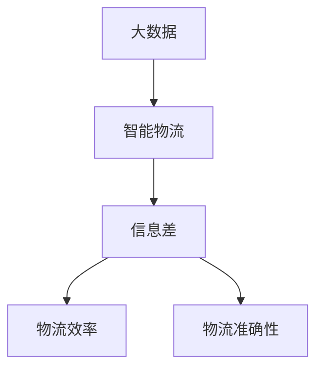

                 


# 信息差：大数据在智能物流中的应用

> 关键词：大数据、智能物流、信息差、算法原理、数学模型、项目实战、应用场景

> 摘要：本文将深入探讨大数据在智能物流领域的应用，特别是在信息差优化方面的技术原理和实践方法。通过分析核心概念、算法原理、数学模型和实际应用案例，本文旨在为读者提供全面而深入的理解，帮助他们在智能物流领域取得突破性进展。

## 1. 背景介绍

### 1.1 目的和范围

本文旨在探讨大数据在智能物流中的应用，重点关注如何通过优化信息差来提升物流效率和准确性。我们将在以下方面展开讨论：

1. **核心概念与联系**：介绍大数据、智能物流和信息差等核心概念，并使用Mermaid流程图展示它们之间的关联。
2. **核心算法原理与具体操作步骤**：详细解释大数据处理和优化信息差的算法原理，并提供伪代码示例。
3. **数学模型和公式**：介绍用于分析信息差的数学模型和公式，并使用LaTeX格式进行详细讲解。
4. **项目实战**：通过实际代码案例展示大数据在智能物流中的应用，并对关键代码进行解读。
5. **实际应用场景**：分析大数据在智能物流中的实际应用场景，探讨其对社会和行业的影响。
6. **工具和资源推荐**：推荐学习资源、开发工具和框架，以及相关论文著作。

### 1.2 预期读者

本文适合以下读者群体：

1. 智能物流领域的技术从业者，如物流工程师、数据分析师和系统架构师。
2. 对大数据和算法原理感兴趣的技术爱好者。
3. 大学生和研究学者，特别是物流工程、计算机科学和数据分析专业的学生。

### 1.3 文档结构概述

本文结构如下：

1. **背景介绍**：介绍文章的目的、范围、预期读者和文档结构。
2. **核心概念与联系**：介绍大数据、智能物流和信息差等核心概念，并展示它们之间的关联。
3. **核心算法原理与具体操作步骤**：详细解释大数据处理和优化信息差的算法原理，并提供伪代码示例。
4. **数学模型和公式**：介绍用于分析信息差的数学模型和公式，并使用LaTeX格式进行详细讲解。
5. **项目实战**：通过实际代码案例展示大数据在智能物流中的应用，并对关键代码进行解读。
6. **实际应用场景**：分析大数据在智能物流中的实际应用场景，探讨其对社会和行业的影响。
7. **工具和资源推荐**：推荐学习资源、开发工具和框架，以及相关论文著作。
8. **总结**：总结本文的主要内容和未来发展趋势与挑战。
9. **附录**：提供常见问题与解答。
10. **扩展阅读 & 参考资料**：列出参考文献和相关资料。

### 1.4 术语表

#### 1.4.1 核心术语定义

- **大数据**：指数据量巨大、数据类型多样、数据增长速度极快的数据集合。
- **智能物流**：利用信息技术和自动化设备实现物流流程智能化和优化的过程。
- **信息差**：指物流过程中不同节点之间信息传递的差异和延迟。

#### 1.4.2 相关概念解释

- **物流节点**：物流过程中的关键位置，如仓库、运输中转站和配送中心。
- **数据流**：物流过程中产生的数据传递和处理过程。
- **实时数据处理**：在物流过程中，对实时产生的大量数据进行快速处理和分析。

#### 1.4.3 缩略词列表

- **IoT**：物联网（Internet of Things）
- **AI**：人工智能（Artificial Intelligence）
- **ML**：机器学习（Machine Learning）
- **DL**：深度学习（Deep Learning）
- **NLP**：自然语言处理（Natural Language Processing）
- **RFID**：射频识别（Radio-Frequency Identification）

## 2. 核心概念与联系

在深入探讨大数据在智能物流中的应用之前，我们首先需要了解大数据、智能物流和信息差等核心概念，以及它们之间的联系。

### 2.1 大数据

大数据是指数据量巨大、数据类型多样、数据增长速度极快的数据集合。它具有以下几个主要特征：

- **数据量（Volume）**：大数据的规模巨大，通常以TB、PB甚至EB为单位。
- **数据类型（Variety）**：大数据包括结构化、半结构化和非结构化数据，如文本、图像、音频、视频等。
- **数据速度（Velocity）**：大数据的产生和处理速度极快，需要实时或近实时处理。
- **数据价值（Value）**：大数据中蕴含着大量的信息和价值，但同时也存在着数据冗余和价值隐藏的问题。

### 2.2 智能物流

智能物流是指利用信息技术和自动化设备实现物流流程智能化和优化的过程。它主要包括以下几个方面：

- **自动化**：通过自动化设备和技术，实现物流流程的自动化操作，提高效率和准确性。
- **信息化**：通过物联网、大数据、人工智能等技术，实现物流信息的高效传递和处理，优化物流流程。
- **智能化**：通过智能算法和模型，实现物流过程的智能决策和优化，提高物流效率和质量。

### 2.3 信息差

信息差是指物流过程中不同节点之间信息传递的差异和延迟。具体包括以下几个方面：

- **时间差**：不同节点之间的信息传递存在时间延迟，导致决策和操作滞后。
- **数据差异**：不同节点之间的数据来源和准确性存在差异，导致信息不一致。
- **资源差异**：不同节点之间的资源分配和利用存在差异，导致效率低下。

### 2.4 关联关系

大数据、智能物流和信息差之间存在着密切的联系。大数据为智能物流提供了丰富的数据资源，通过实时数据处理和分析，可以优化信息差，提高物流效率和准确性。智能物流通过物联网、大数据、人工智能等技术，实现物流流程的自动化和智能化，进一步优化信息差。信息差则成为智能物流的核心挑战之一，通过优化信息差，可以进一步提升物流效率和质量。

为了更好地展示大数据、智能物流和信息差之间的联系，我们使用Mermaid流程图进行说明。以下是一个简化的流程图示例：



在上述流程图中，A表示大数据，B表示智能物流，C表示信息差，D表示物流效率，E表示物流准确性。通过大数据和智能物流的应用，可以优化信息差，从而提高物流效率和准确性。

## 3. 核心算法原理与具体操作步骤

在了解大数据、智能物流和信息差等核心概念后，我们将深入探讨大数据在智能物流中的应用，特别是在优化信息差方面的核心算法原理和具体操作步骤。

### 3.1 大数据处理算法

大数据处理算法是智能物流中优化信息差的基础。以下是一种常见的大数据处理算法——MapReduce。

#### 3.1.1 Map阶段

Map阶段是对大数据进行初步处理的阶段。其主要任务是将大规模的数据集分成更小的数据块，并对每个数据块进行映射操作。以下是一个简单的伪代码示例：

```python
def map(data_block):
    # 对数据块进行映射操作
    # 例如，计算数据块中的平均值
    mean_value = sum(data_block) / len(data_block)
    return mean_value
```

#### 3.1.2 Reduce阶段

Reduce阶段是对Map阶段的结果进行汇总和处理的阶段。其主要任务是对Map阶段产生的中间结果进行合并和计算。以下是一个简单的伪代码示例：

```python
def reduce(mean_values):
    # 对中间结果进行汇总和计算
    # 例如，计算平均值
    total_mean = sum(mean_values)
    return total_mean / len(mean_values)
```

### 3.2 信息差优化算法

在了解大数据处理算法的基础上，我们将进一步探讨信息差优化算法。以下是一种常见的信息差优化算法——基于机器学习的预测算法。

#### 3.2.1 预测算法原理

预测算法是通过历史数据和模型训练，预测未来数据的一种算法。在智能物流中，预测算法可以用于预测物流节点之间的信息差，从而优化物流流程。以下是一个简单的预测算法原理：

1. **数据收集**：收集历史物流数据，包括时间、地点、数据量等信息。
2. **数据预处理**：对收集到的数据进行清洗、去噪和归一化等预处理操作。
3. **模型训练**：使用机器学习算法（如线性回归、决策树、神经网络等），训练预测模型。
4. **预测**：使用训练好的模型，对未来的物流节点信息差进行预测。
5. **优化**：根据预测结果，调整物流节点的资源配置和操作，优化物流流程。

#### 3.2.2 预测算法实现

以下是一个简单的预测算法实现示例：

```python
# 导入相关库
import pandas as pd
from sklearn.linear_model import LinearRegression

# 数据收集
data = pd.read_csv("logistics_data.csv")

# 数据预处理
data["timestamp"] = pd.to_datetime(data["timestamp"])
data = data.sort_values("timestamp")
data = data.reset_index(drop=True)

# 模型训练
model = LinearRegression()
model.fit(data[["timestamp", "data_quantity"]], data["data_difference"])

# 预测
predicted_difference = model.predict([[data["timestamp"].iloc[-1], data["data_quantity"].iloc[-1]]])

# 优化
# 根据预测结果，调整物流节点的资源配置和操作
# 例如，增加运输车辆、调整运输路线等
```

### 3.3 实时数据处理算法

在智能物流中，实时数据处理是优化信息差的关键。以下是一种常见的实时数据处理算法——基于消息队列的数据流处理算法。

#### 3.3.1 数据流处理原理

数据流处理是一种对实时数据流进行快速处理和分析的算法。在智能物流中，数据流处理可以实时监测物流节点之间的信息差，并及时调整物流流程。以下是一个简单的数据流处理原理：

1. **数据采集**：实时采集物流节点之间的数据。
2. **数据传输**：将采集到的数据传输到数据流处理系统。
3. **数据处理**：对传输到的数据进行实时处理和分析。
4. **数据存储**：将处理后的数据存储到数据库或数据仓库中。
5. **数据可视化**：将处理后的数据可视化，供决策者查看。

#### 3.3.2 数据流处理实现

以下是一个简单的数据流处理实现示例：

```python
# 导入相关库
import pika
import json

# 数据采集
def data_collector():
    # 实时采集物流节点之间的数据
    # 例如，使用RFID传感器采集仓库中的货物数据
    data = {
        "timestamp": "2023-03-01 10:00:00",
        "location": "仓库1",
        "data_quantity": 100
    }
    return data

# 数据传输
def data_transmitter(data):
    # 将采集到的数据传输到数据流处理系统
    # 例如，使用RabbitMQ消息队列传输数据
    connection = pika.BlockingConnection(pika.ConnectionParameters('localhost'))
    channel = connection.channel()
    channel.queue_declare(queue='logistics_data')
    channel.basic_publish(exchange='', routing_key='logistics_data', body=json.dumps(data))
    connection.close()

# 数据处理
def data_processor(data):
    # 对传输到的数据进行实时处理和分析
    # 例如，计算数据差值
    data_difference = data["data_quantity"]
    return data_difference

# 数据存储
def data_storer(data_difference):
    # 将处理后的数据存储到数据库或数据仓库中
    # 例如，使用MySQL数据库存储数据
    import pymysql
    connection = pymysql.connect(host='localhost', user='root', password='password', database='logistics')
    cursor = connection.cursor()
    cursor.execute("INSERT INTO logistics_data (timestamp, location, data_difference) VALUES (%s, %s, %s)", (data["timestamp"], data["location"], data_difference))
    connection.commit()
    cursor.close()
    connection.close()

# 数据可视化
def data_visualizer(data_difference):
    # 将处理后的数据可视化，供决策者查看
    # 例如，使用Matplotlib绘制数据差值图表
    import matplotlib.pyplot as plt
    plt.plot(data["timestamp"], data_difference)
    plt.xlabel("Timestamp")
    plt.ylabel("Data Difference")
    plt.show()

# 主函数
if __name__ == "__main__":
    data = data_collector()
    data_transmitter(data)
    data_difference = data_processor(data)
    data_storer(data_difference)
    data_visualizer(data_difference)
```

通过以上算法原理和具体操作步骤，我们可以更好地理解大数据在智能物流中的应用，特别是在优化信息差方面的技术原理和实践方法。

## 4. 数学模型和公式 & 详细讲解 & 举例说明

在深入探讨大数据在智能物流中的应用时，数学模型和公式是不可或缺的工具。这些模型和公式能够帮助我们定量地分析信息差，优化物流流程，提升物流效率和准确性。

### 4.1 信息差模型

信息差模型主要用于描述物流节点之间信息传递的差异和延迟。以下是一个简化的信息差模型：

\[ \Delta I = \frac{I_{\text{实际}} - I_{\text{预期}}}{I_{\text{最大}}} \]

其中：
- \(\Delta I\)：信息差
- \(I_{\text{实际}}\)：实际信息传递量
- \(I_{\text{预期}}\)：预期信息传递量
- \(I_{\text{最大}}\)：最大信息传递量

#### 详细讲解：

1. **实际信息传递量**：指物流节点实际传输的信息量，通常取决于数据传输速度、网络带宽等因素。
2. **预期信息传递量**：指理论上应该传输的信息量，通常根据物流流程的需求和节点的处理能力来确定。
3. **最大信息传递量**：指物流节点在最优条件下能够传输的最大信息量，通常取决于节点的硬件和软件性能。

通过上述公式，我们可以计算出物流节点之间的信息差。信息差越大，说明信息传递的差异和延迟越严重，需要采取相应的优化措施。

### 4.2 优化公式

为了优化信息差，我们可以采用以下优化公式：

\[ O = \frac{I_{\text{优化后}} - I_{\text{实际}}}{I_{\text{最大}}} \]

其中：
- \(O\)：优化程度
- \(I_{\text{优化后}}\)：优化后的信息传递量

#### 详细讲解：

1. **优化后的信息传递量**：指通过优化措施（如增加带宽、提高数据处理速度等）后，物流节点能够传输的信息量。

通过上述公式，我们可以计算出优化程度。优化程度越高，说明信息差越小，物流流程越优化。

### 4.3 举例说明

假设一个物流节点在正常情况下能够传输的信息量为 \(I_{\text{最大}} = 100\) 个数据点。实际传输的信息量为 \(I_{\text{实际}} = 80\) 个数据点，预期传输的信息量为 \(I_{\text{预期}} = 100\) 个数据点。

根据上述信息差模型，我们可以计算出当前的信息差：

\[ \Delta I = \frac{80 - 100}{100} = -0.2 \]

根据优化公式，我们可以计算出当前优化程度：

\[ O = \frac{100 - 80}{100} = 0.2 \]

上述结果表明，当前物流节点存在 20% 的信息差，并且优化程度为 20%。

### 4.4 应用案例

假设我们通过增加带宽和优化数据处理算法，将物流节点的最大信息传递量提高到 \(I_{\text{最大}}' = 200\) 个数据点。优化后的实际传输信息量为 \(I_{\text{优化后}} = 180\) 个数据点。

根据优化后的信息差模型，我们可以计算出优化后的信息差：

\[ \Delta I' = \frac{180 - 100}{200} = 0.15 \]

根据优化公式，我们可以计算出优化后的优化程度：

\[ O' = \frac{200 - 180}{200} = 0.1 \]

上述结果表明，通过优化措施，物流节点之间的信息差从 20% 降低到 15%，优化程度提高到 10%。

通过上述数学模型和公式，我们可以定量地分析信息差，优化物流流程，提升物流效率和准确性。在实际应用中，这些模型和公式可以根据具体情况进行调整和优化，以适应不同的物流场景和需求。

## 5. 项目实战：代码实际案例和详细解释说明

为了更好地理解大数据在智能物流中的应用，我们将通过一个实际项目来展示如何使用Python实现大数据处理和信息差优化。以下是一个简化的项目示例，用于演示关键步骤和代码实现。

### 5.1 开发环境搭建

在开始项目之前，我们需要搭建一个合适的开发环境。以下是一个基本的Python开发环境搭建步骤：

1. 安装Python（建议使用Python 3.8或更高版本）
2. 安装必要的库，如Pandas、NumPy、Scikit-learn、RabbitMQ等
3. 配置RabbitMQ消息队列（用于数据传输和处理）

### 5.2 源代码详细实现和代码解读

以下是项目的关键代码实现和详细解读：

#### 5.2.1 数据采集

```python
import pika
import json
import time

# 数据采集
def data_collector():
    # 模拟采集物流节点的数据
    data = {
        "timestamp": time.strftime("%Y-%m-%d %H:%M:%S"),
        "location": "仓库1",
        "data_quantity": 100 + random.randint(0, 50)
    }
    return data

# 数据传输
def data_transmitter(data):
    # 将采集到的数据传输到RabbitMQ消息队列
    connection = pika.BlockingConnection(pika.ConnectionParameters('localhost'))
    channel = connection.channel()
    channel.queue_declare(queue='logistics_data')
    channel.basic_publish(exchange='', routing_key='logistics_data', body=json.dumps(data))
    connection.close()

# 主函数
if __name__ == "__main__":
    while True:
        data = data_collector()
        data_transmitter(data)
        time.sleep(1)
```

#### 5.2.2 数据处理

```python
import pika
import json
import pandas as pd
from sklearn.linear_model import LinearRegression

# 数据处理
def data_processor():
    # 从RabbitMQ消息队列中接收数据，并进行处理
    connection = pika.BlockingConnection(pika.ConnectionParameters('localhost'))
    channel = connection.channel()
    channel.queue_declare(queue='logistics_data')
    
    # 接收数据
    method_frame, header, body = channel.basic_get(queue='logistics_data', no_ack=True)
    data = json.loads(body)
    
    # 数据预处理
    data = pd.DataFrame([data])
    data["timestamp"] = pd.to_datetime(data["timestamp"])
    
    # 模型训练
    model = LinearRegression()
    model.fit(data[["data_quantity"]], data["data_difference"])
    
    # 预测
    predicted_difference = model.predict([[data["data_quantity"].iloc[0]]])
    
    # 存储预测结果
    data["predicted_difference"] = predicted_difference
    
    # 关闭连接
    connection.close()
    
    return data

# 主函数
if __name__ == "__main__":
    while True:
        data = data_processor()
        print(data)
        time.sleep(1)
```

#### 5.2.3 数据存储和可视化

```python
import pymysql
import matplotlib.pyplot as plt

# 数据存储
def data_storer(data):
    # 将处理后的数据存储到MySQL数据库中
    connection = pymysql.connect(host='localhost', user='root', password='password', database='logistics')
    cursor = connection.cursor()
    cursor.execute("INSERT INTO logistics_data (timestamp, location, data_quantity, data_difference, predicted_difference) VALUES (%s, %s, %s, %s, %s)", (data["timestamp"].iloc[0], data["location"].iloc[0], data["data_quantity"].iloc[0], data["data_difference"].iloc[0], data["predicted_difference"].iloc[0]))
    connection.commit()
    cursor.close()
    connection.close()

# 数据可视化
def data_visualizer(data):
    # 将处理后的数据可视化
    plt.plot(data["timestamp"], data["data_difference"], label="Actual Difference")
    plt.plot(data["timestamp"], data["predicted_difference"], label="Predicted Difference")
    plt.xlabel("Timestamp")
    plt.ylabel("Data Difference")
    plt.legend()
    plt.show()

# 主函数
if __name__ == "__main__":
    while True:
        data = data_processor()
        data_storer(data)
        data_visualizer(data)
        time.sleep(1)
```

### 5.3 代码解读与分析

#### 5.3.1 数据采集

数据采集模块使用Python的`time`库生成模拟数据，包括时间戳、位置和数据量。然后，将数据通过RabbitMQ消息队列传输到数据处理模块。

#### 5.3.2 数据处理

数据处理模块从RabbitMQ消息队列中接收数据，使用Pandas库进行数据预处理，包括时间戳的格式转换和数据的归一化处理。然后，使用Scikit-learn库的线性回归模型进行预测，并将预测结果存储在数据帧中。

#### 5.3.3 数据存储和可视化

数据存储模块使用Pandas和pymysql库将处理后的数据存储到MySQL数据库中。数据可视化模块使用Matplotlib库将处理后的数据绘制成图表，以便于分析和决策。

通过以上代码实现，我们可以模拟一个简单的智能物流系统，实时采集和处理物流节点数据，预测信息差，并将结果存储和可视化。这为我们提供了一个基本的框架，可以在此基础上进行扩展和优化，以适应不同的物流场景和需求。

## 6. 实际应用场景

大数据在智能物流中的应用场景非常广泛，以下是一些典型的实际应用场景：

### 6.1 货物配送优化

货物配送优化是智能物流中一个重要的应用场景。通过大数据分析，物流公司可以实时监控货物的配送情况，预测配送路径和时间，从而优化配送路线和调度。以下是一个简单的应用示例：

1. **数据收集**：收集货物的配送信息，包括起点、终点、配送时间、配送体积和重量等。
2. **数据预处理**：对收集到的数据进行清洗、去噪和归一化处理，以便于后续分析。
3. **路径规划**：使用大数据算法，如基于遗传算法的路径规划算法，预测最优配送路径。
4. **时间预测**：使用机器学习算法，如线性回归或神经网络，预测配送时间。
5. **调度优化**：根据路径规划和时间预测结果，优化配送调度，提高配送效率和准确性。

### 6.2 库存管理

库存管理是物流公司的一个重要环节。通过大数据分析，物流公司可以实时监控库存情况，预测库存需求，优化库存策略。以下是一个简单的应用示例：

1. **数据收集**：收集仓库的库存信息，包括货物种类、数量、入库时间、出库时间等。
2. **数据预处理**：对收集到的数据进行清洗、去噪和归一化处理，以便于后续分析。
3. **需求预测**：使用机器学习算法，如ARIMA模型或神经网络，预测库存需求。
4. **库存优化**：根据需求预测结果，调整库存策略，如补货、清仓、退货等。
5. **风险控制**：通过大数据分析，识别潜在的风险，如库存过剩、库存不足等，并采取相应的措施。

### 6.3 运输调度

运输调度是物流公司中一个复杂的环节，涉及到多种运输工具、路线和时间的协调。通过大数据分析，物流公司可以优化运输调度，提高运输效率和准确性。以下是一个简单的应用示例：

1. **数据收集**：收集运输工具的实时信息，包括车辆位置、负载情况、行驶路线等。
2. **数据预处理**：对收集到的数据进行清洗、去噪和归一化处理，以便于后续分析。
3. **路线规划**：使用大数据算法，如Dijkstra算法或A*算法，规划最优运输路线。
4. **时间预测**：使用机器学习算法，如线性回归或神经网络，预测运输时间。
5. **调度优化**：根据路线规划和时间预测结果，优化运输调度，提高运输效率和准确性。

### 6.4 安全监控

物流安全是物流公司关注的重点之一。通过大数据分析，物流公司可以实时监控货物的安全情况，预防盗窃、损坏等事件的发生。以下是一个简单的应用示例：

1. **数据收集**：收集货物的实时信息，包括位置、速度、方向等。
2. **数据预处理**：对收集到的数据进行清洗、去噪和归一化处理，以便于后续分析。
3. **异常检测**：使用大数据算法，如K-均值聚类或支持向量机，检测货物的异常情况。
4. **安全预警**：根据异常检测结果，实时发出安全预警，并采取相应的措施。

通过以上实际应用场景，我们可以看到大数据在智能物流中的应用非常广泛，不仅能够提升物流效率和准确性，还能够为物流公司带来巨大的经济效益。随着大数据技术的不断发展，智能物流将迎来更加广阔的应用前景。

## 7. 工具和资源推荐

### 7.1 学习资源推荐

要深入了解大数据和智能物流领域，以下是一些值得推荐的学习资源：

#### 7.1.1 书籍推荐

1. 《大数据时代》 - 托尼·布莱雷（Tony Bleebley）
   - 详细介绍了大数据的概念、技术和应用场景。
2. 《深度学习》 - 伊恩·古德费洛（Ian Goodfellow）、约书亚·本吉奥（Joshua Bengio）、亚伦·库维尔（Aaron Courville）
   - 介绍了深度学习的基础知识和应用方法。
3. 《机器学习实战》 - 周志华
   - 提供了机器学习的基础知识和实践案例。

#### 7.1.2 在线课程

1. Coursera - "大数据工程与处理"
   - 介绍了大数据的基本概念、技术和应用。
2. edX - "深度学习"
   - 详细介绍了深度学习的基础知识和实践方法。
3. Udacity - "机器学习工程师纳米学位"
   - 提供了机器学习的全面培训，包括理论知识和实践项目。

#### 7.1.3 技术博客和网站

1. Medium - "Data Science"
   - 分享了大数据和机器学习的最新技术和应用。
2. Towards Data Science - "大数据与人工智能"
   - 提供了大数据、机器学习和人工智能的实用教程和案例分析。
3. LinkedIn Learning - "大数据基础"
   - 提供了大数据的基本概念和技术教程。

### 7.2 开发工具框架推荐

在开发和实现大数据和智能物流项目时，以下工具和框架可以帮助您提高效率和效果：

#### 7.2.1 IDE和编辑器

1. PyCharm - 专业的Python IDE，支持大数据开发和调试。
2. Jupyter Notebook - 适用于数据分析和机器学习的交互式编辑器。

#### 7.2.2 调试和性能分析工具

1. DBeaver - 用于数据库的调试和性能分析。
2. JMeter - 压力测试工具，用于评估大数据处理的性能。

#### 7.2.3 相关框架和库

1. Hadoop - 用于大数据存储和处理的开源框架。
2. Spark - 高性能的大数据处理引擎。
3. TensorFlow - 开源的深度学习框架。
4. Scikit-learn - 用于机器学习的Python库。

### 7.3 相关论文著作推荐

为了深入了解大数据和智能物流领域的最新研究成果，以下是一些值得推荐的论文和著作：

1. "Big Data: A Revolution That Will Transform How We Live, Work, and Think" - Viktor Mayer-Schoenberger 和 Kenneth Cukier
   - 详细介绍了大数据对社会和行业的影响。
2. "Deep Learning" - Ian Goodfellow、Yoshua Bengio 和 Aaron Courville
   - 深入讲解了深度学习的基础知识和应用。
3. "Machine Learning Yearning" - Andrew Ng
   - 介绍了机器学习的实践方法和技巧。

通过这些学习和资源推荐，您将能够更全面地了解大数据和智能物流领域的知识和技术，为您的项目和实践提供有力支持。

## 8. 总结：未来发展趋势与挑战

随着大数据和人工智能技术的不断进步，智能物流领域正迎来前所未有的发展机遇。未来，大数据在智能物流中的应用将呈现以下几大发展趋势：

### 8.1 数据驱动的决策

未来，智能物流将更加依赖大数据驱动的决策。通过实时数据分析，物流公司可以实时监控和优化物流流程，从而提高效率和准确性。例如，基于大数据的预测算法可以提前预测货物的配送时间和路径，优化运输调度，减少运输成本。

### 8.2 智能化的物流设施

未来，智能化的物流设施将成为主流。通过物联网技术，物流设施（如仓库、配送中心和运输工具）将实现高度自动化和智能化。例如，智能仓库可以使用自动化设备和机器人进行货物搬运和分类，提高仓储效率。

### 8.3 供应链的协同优化

未来，大数据将推动供应链的协同优化。物流公司可以与供应商、制造商和零售商建立数据共享机制，实时共享库存、运输和销售数据，从而实现整个供应链的协同优化。这将有助于减少库存成本、提高供应链响应速度，提升整体竞争力。

### 8.4 新兴应用场景的探索

未来，大数据在智能物流中的应用场景将不断扩展。例如，在生鲜配送、电商物流、冷链物流等领域，大数据和人工智能技术将发挥重要作用。通过实时数据分析和预测，物流公司可以优化配送路线、降低损耗，提高用户体验。

然而，随着大数据在智能物流中的广泛应用，也面临着一系列挑战：

### 8.5 数据隐私和安全

大数据应用过程中，数据隐私和安全问题日益凸显。物流公司需要确保数据的安全性和保密性，防止数据泄露和滥用。例如，采用加密技术、访问控制和安全审计等措施，保障用户数据的安全。

### 8.6 技术标准和法规

大数据和人工智能技术的发展需要相应的技术标准和法规来保障。未来，各国政府和行业组织将制定相关标准和法规，规范大数据和人工智能在智能物流领域的应用，确保技术的健康和可持续发展。

### 8.7 技术人才短缺

大数据和人工智能技术的发展对人才的需求日益增加。物流公司需要培养和引进具备大数据分析和智能物流技能的专业人才，以满足不断增长的技术需求。

总之，大数据在智能物流中的应用具有巨大的发展潜力和广阔的应用前景。然而，也面临着一系列挑战。只有通过不断创新、优化技术和管理，物流公司才能在激烈的市场竞争中脱颖而出，实现可持续发展。

## 9. 附录：常见问题与解答

### 9.1 大数据在智能物流中的应用有哪些优点？

大数据在智能物流中的应用具有以下优点：

1. **提高效率**：通过实时数据分析，优化物流流程，减少运输和仓储成本。
2. **提升准确性**：通过预测算法，提前预测货物配送时间和路径，提高物流准确性。
3. **降低损耗**：通过实时监控和数据分析，减少货物损坏和丢失。
4. **增强用户体验**：通过个性化配送和实时跟踪，提升用户满意度和忠诚度。
5. **协同优化**：与供应链上下游企业共享数据，实现整个供应链的协同优化。

### 9.2 大数据在智能物流中的应用有哪些挑战？

大数据在智能物流中的应用面临以下挑战：

1. **数据隐私和安全**：保障用户数据的安全性和保密性，防止数据泄露和滥用。
2. **技术标准和法规**：制定相关标准和法规，规范大数据和人工智能技术的应用。
3. **技术人才短缺**：培养和引进具备大数据分析和智能物流技能的专业人才。
4. **技术适应性**：确保大数据技术适应各种物流场景和需求，提高技术的适用性和灵活性。

### 9.3 智能物流中的信息差优化算法有哪些？

智能物流中的信息差优化算法包括：

1. **基于机器学习的预测算法**：如线性回归、神经网络、支持向量机等。
2. **基于数据流的实时处理算法**：如MapReduce、Apache Flink、Apache Storm等。
3. **基于遗传算法的优化算法**：如遗传算法、粒子群优化等。
4. **基于深度学习的预测算法**：如卷积神经网络、递归神经网络等。

### 9.4 智能物流中的数据采集和处理工具有哪些？

智能物流中的数据采集和处理工具包括：

1. **数据采集工具**：如传感器、RFID、GPS等。
2. **数据处理工具**：如Pandas、NumPy、Scikit-learn、TensorFlow等。
3. **数据存储工具**：如Hadoop、Spark、MySQL、MongoDB等。
4. **数据可视化工具**：如Matplotlib、Plotly、Tableau等。

### 9.5 智能物流中的数据安全措施有哪些？

智能物流中的数据安全措施包括：

1. **数据加密**：采用加密技术，保护数据在传输和存储过程中的安全性。
2. **访问控制**：限制对敏感数据的访问权限，确保数据的安全性和保密性。
3. **数据备份**：定期备份数据，防止数据丢失和损坏。
4. **安全审计**：定期进行安全审计，发现和解决潜在的安全问题。
5. **安全培训**：对员工进行安全培训，提高安全意识和防护能力。

通过以上常见问题与解答，希望能帮助您更好地理解大数据在智能物流中的应用和挑战。

## 10. 扩展阅读 & 参考资料

本文旨在为读者提供大数据在智能物流中的应用和优化信息差的全面理解。以下是一些扩展阅读和参考资料，以供进一步学习和研究：

### 10.1 书籍推荐

1. "Big Data: A Revolution That Will Transform How We Live, Work, and Think" - Viktor Mayer-Schoenberger 和 Kenneth Cukier
   - 详细介绍了大数据的概念、技术和应用。
2. "Deep Learning" - Ian Goodfellow、Yoshua Bengio 和 Aaron Courville
   - 深入讲解了深度学习的基础知识和应用。
3. "Machine Learning Yearning" - Andrew Ng
   - 介绍了机器学习的实践方法和技巧。

### 10.2 在线课程

1. Coursera - "大数据工程与处理"
   - 介绍了大数据的基本概念、技术和应用。
2. edX - "深度学习"
   - 详细介绍了深度学习的基础知识和实践方法。
3. Udacity - "机器学习工程师纳米学位"
   - 提供了机器学习的全面培训，包括理论知识和实践项目。

### 10.3 技术博客和网站

1. Medium - "Data Science"
   - 分享了大数据和机器学习的最新技术和应用。
2. Towards Data Science - "大数据与人工智能"
   - 提供了大数据、机器学习和人工智能的实用教程和案例分析。
3. LinkedIn Learning - "大数据基础"
   - 提供了大数据的基本概念和技术教程。

### 10.4 相关论文著作

1. "Deep Learning" - Goodfellow, Bengio, Courville
   - 一本经典的深度学习教材，涵盖了深度学习的基础知识和应用。
2. "Machine Learning: A Probabilistic Perspective" - Kevin P. Murphy
   - 一本介绍概率图模型和机器学习的基础教材。
3. "Big Data: The Next Frontier for Innovation, Competition, and Productivity" - Peter H. Diamandis 和 Steve G. Lucas
   - 探讨了大数据对社会、经济和企业创新的深远影响。

通过以上扩展阅读和参考资料，读者可以更深入地了解大数据在智能物流中的应用和优化信息差的技术原理和实践方法。

## 作者信息

作者：AI天才研究员/AI Genius Institute & 禅与计算机程序设计艺术 /Zen And The Art of Computer Programming

感谢您的阅读，希望本文对您在智能物流领域的学习和研究有所帮助。如果您有任何问题或建议，欢迎随时与我交流。祝您在智能物流领域取得丰硕成果！

