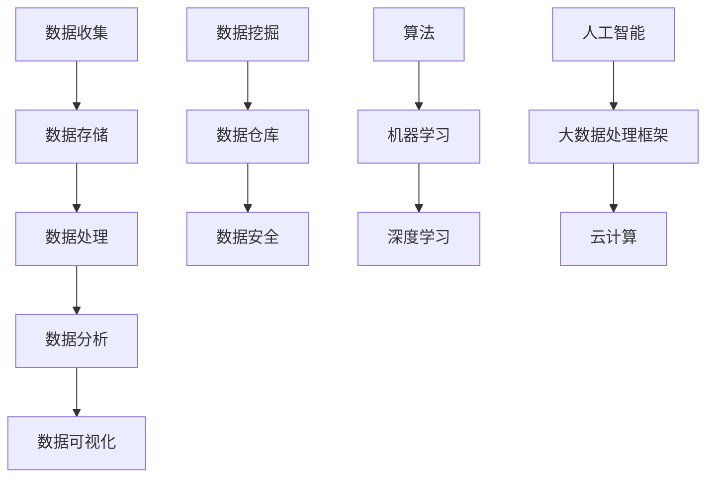

                 

### 信息差：大数据在零售行业的应用

> **关键词：**大数据、零售行业、信息差、数据分析、应用案例

> **摘要：**本文旨在探讨大数据在零售行业中的应用，分析信息差的产生及其重要性，探讨大数据技术如何通过提升数据分析能力、优化库存管理和精准营销等方面，提升零售企业的竞争力。文章还将通过实际案例，展示大数据技术在不同零售场景中的具体应用，为读者提供对大数据在零售行业中潜力的深刻理解。

### 1. 背景介绍

#### 1.1 目的和范围

随着互联网的飞速发展和大数据技术的日益成熟，零售行业正面临着前所未有的变革。本文的目的在于解析大数据在零售行业中的应用，揭示信息差的形成及其对零售企业的影响，以及如何通过大数据技术提升零售行业的整体竞争力。

本文的范围将主要集中在以下几个方面：

1. **信息差的定义与重要性**：首先，我们将探讨信息差的定义及其在零售行业中的重要性，为后续分析大数据应用打下基础。
2. **大数据技术的核心原理**：其次，我们将深入解析大数据技术的核心原理，包括数据收集、存储、处理和分析等环节。
3. **大数据在零售行业中的应用**：本文将详细探讨大数据技术在零售行业中的具体应用，如库存管理、精准营销和客户关系管理等。
4. **案例研究**：通过实际案例，我们将展示大数据技术在零售行业中的具体应用场景，并提供详细的分析和解读。
5. **未来发展趋势与挑战**：最后，本文将总结大数据在零售行业的应用前景，探讨未来可能面临的挑战。

#### 1.2 预期读者

本文的预期读者主要包括以下几类：

1. **零售行业从业者**：希望了解大数据技术如何影响零售行业，提升企业竞争力。
2. **数据科学家和分析师**：希望掌握大数据技术在零售行业中的应用，拓展自身职业发展。
3. **技术爱好者**：对大数据技术感兴趣，希望了解其在实际行业中的应用。
4. **学术研究人员**：关注大数据和零售行业交叉领域的研究，希望获取行业应用的新思路。

#### 1.3 文档结构概述

本文将按照以下结构进行组织：

1. **背景介绍**：概述大数据在零售行业中的应用背景、目的和范围。
2. **核心概念与联系**：介绍大数据技术的基本概念、原理和架构。
3. **核心算法原理 & 具体操作步骤**：详细解析大数据技术的核心算法原理和具体操作步骤。
4. **数学模型和公式 & 详细讲解 & 举例说明**：阐述大数据技术在数学模型和公式方面的应用，并提供具体案例。
5. **项目实战：代码实际案例和详细解释说明**：展示大数据技术在实际项目中的应用。
6. **实际应用场景**：分析大数据技术在零售行业中的具体应用场景。
7. **工具和资源推荐**：推荐相关学习资源和开发工具。
8. **总结：未来发展趋势与挑战**：总结大数据在零售行业中的应用前景和面临的挑战。
9. **附录：常见问题与解答**：解答读者可能遇到的问题。
10. **扩展阅读 & 参考资料**：提供扩展阅读和参考资料。

#### 1.4 术语表

为了确保文章的可读性和准确性，本文将使用以下术语表：

##### 1.4.1 核心术语定义

- **大数据**：指数据量巨大、数据类型繁多、数据价值密度低的数据集合。
- **零售行业**：指从事商品零售业务的企业和机构。
- **信息差**：指不同主体之间在信息获取、处理和利用上的差异。
- **数据分析**：指使用统计学、机器学习等方法对数据进行处理和分析，以提取有价值的信息。
- **算法**：指解决问题的步骤和方法。

##### 1.4.2 相关概念解释

- **大数据处理框架**：指用于处理大数据的软件框架，如Hadoop、Spark等。
- **数据挖掘**：指从大量数据中挖掘出有价值的模式和知识。
- **数据仓库**：指用于存储、管理和分析大量数据的系统。

##### 1.4.3 缩略词列表

- **Hadoop**：指一个开源的分布式数据处理框架。
- **Spark**：指一个开源的分布式数据处理引擎。
- **SQL**：指结构化查询语言（Structured Query Language），用于数据库查询。

### 2. 核心概念与联系

在探讨大数据在零售行业中的应用之前，我们首先需要了解大数据技术的核心概念及其相互之间的联系。以下将使用Mermaid流程图对大数据技术的核心概念和架构进行简要概述。



#### 2.1 大数据技术核心概念

- **数据收集**：指通过各种手段获取数据，如传感器、网站点击日志等。
- **数据存储**：指将收集到的数据存储到数据库或数据仓库中，如Hadoop、Spark等。
- **数据处理**：指对存储的数据进行清洗、转换和整合，使其具备分析价值。
- **数据分析**：指使用统计学、机器学习等方法对数据进行分析，提取有价值的信息。
- **数据挖掘**：指从大量数据中挖掘出有价值的模式和知识，如关联规则、分类等。
- **数据仓库**：指用于存储、管理和分析大量数据的系统，如SQL Server、Oracle等。
- **数据安全**：指确保数据在收集、存储、处理和分析过程中的安全性。
- **算法**：指解决问题的步骤和方法，如排序、搜索等。
- **机器学习**：指利用数据训练模型，使其具备自动学习和预测能力。
- **深度学习**：指基于神经网络的学习方法，能够处理复杂的非线性问题。
- **人工智能**：指模拟人类智能的计算机系统，能够进行感知、推理和学习。

#### 2.2 大数据技术在零售行业的应用架构

为了更好地理解大数据技术在零售行业的应用架构，我们可以进一步梳理其主要组成部分：

1. **数据收集**：零售企业通过传感器、POS系统、网站点击日志等手段收集各类数据，如商品销售数据、客户行为数据等。
2. **数据存储**：将收集到的数据存储到数据仓库或分布式数据库中，如Hadoop、Spark等，确保数据的高效存储和管理。
3. **数据处理**：对存储的数据进行清洗、转换和整合，使其具备分析价值，如使用ETL（提取、转换、加载）工具。
4. **数据分析**：利用统计学、机器学习等方法对数据进行分析，提取有价值的信息，如客户需求预测、库存优化等。
5. **数据挖掘**：从大量数据中挖掘出有价值的模式和知识，如关联规则、分类等，为企业提供决策支持。
6. **数据可视化**：通过图表、报表等形式将分析结果可视化，使企业能够更直观地了解数据背后的业务状况。
7. **算法与机器学习**：利用机器学习算法训练模型，使其具备自动学习和预测能力，如客户流失预测、个性化推荐等。
8. **人工智能**：将人工智能技术应用于零售业务，实现自动化决策、智能客服等。

通过以上架构，零售企业能够实现从数据收集、存储、处理、分析到决策的全方位优化，提升企业的运营效率和市场竞争力。

### 3. 核心算法原理 & 具体操作步骤

#### 3.1 数据收集与预处理

在零售行业，数据收集是一个关键的环节。数据来源包括但不限于销售数据、客户行为数据、库存数据等。收集到的原始数据往往存在缺失值、异常值、重复值等问题，因此需要进行预处理。以下是一个简单的数据预处理伪代码：

```python
def preprocess_data(data):
    # 去除重复值
    data = remove_duplicates(data)
    # 填补缺失值
    data = fill_missing_values(data)
    # 数据类型转换
    data = convert_data_types(data)
    # 数据清洗
    data = clean_data(data)
    return data
```

#### 3.2 数据存储与管理

在数据预处理完成后，需要将数据存储到数据库或数据仓库中。常用的数据库包括关系型数据库（如MySQL、Oracle）和分布式数据库（如Hadoop、Spark）。以下是一个简单的数据存储和管理伪代码：

```python
def store_data(data, database):
    # 连接数据库
    connection = connect_to_database(database)
    # 存储数据
    insert_data(connection, data)
    # 关闭数据库连接
    close_connection(connection)
```

#### 3.3 数据处理与分析

数据存储后，需要进行数据处理和分析。数据处理包括数据清洗、转换和整合等步骤。数据分析则包括统计分析、机器学习等。以下是一个简单的数据处理和分析伪代码：

```python
def process_and_analyze_data(data):
    # 数据清洗
    clean_data = preprocess_data(data)
    # 数据转换
    transformed_data = convert_data(clean_data)
    # 数据分析
    analysis_results = analyze_data(transformed_data)
    return analysis_results
```

#### 3.4 数据挖掘与模型训练

在数据分析的基础上，可以进行数据挖掘与模型训练。数据挖掘包括关联规则挖掘、分类、聚类等。模型训练则包括机器学习算法的应用。以下是一个简单的数据挖掘与模型训练伪代码：

```python
def mine_and_train_models(data):
    # 数据挖掘
    mining_results = mine_data(data)
    # 模型训练
    trained_model = train_model(mining_results)
    return trained_model
```

#### 3.5 数据可视化与决策支持

最后，将分析结果通过数据可视化呈现，为企业提供决策支持。数据可视化包括图表、报表等形式。以下是一个简单的数据可视化伪代码：

```python
def visualize_data(analysis_results):
    # 生成图表
    charts = generate_charts(analysis_results)
    # 生成报表
    report = generate_report(charts)
    return report
```

通过以上步骤，零售企业能够充分利用大数据技术，实现数据驱动的决策，提升企业运营效率和市场竞争力。

### 4. 数学模型和公式 & 详细讲解 & 举例说明

在大数据技术中，数学模型和公式起着至关重要的作用。以下将详细讲解几个在零售行业中常用的数学模型和公式，并提供具体案例。

#### 4.1 相关性分析

相关性分析是一种评估两个变量之间关系程度的统计方法。常用的相关性分析指标包括皮尔逊相关系数（Pearson Correlation Coefficient）和斯皮尔曼等级相关系数（Spearman's Rank Correlation Coefficient）。

**皮尔逊相关系数：**
\[ r = \frac{\sum{(x_i - \bar{x})(y_i - \bar{y})}}{\sqrt{\sum{(x_i - \bar{x})^2}\sum{(y_i - \bar{y})^2}}} \]
其中，\( x_i \) 和 \( y_i \) 分别表示两个变量的观测值，\( \bar{x} \) 和 \( \bar{y} \) 分别表示两个变量的平均值。

**斯皮尔曼等级相关系数：**
\[ \rho = \frac{1}{n-1} \sum{(x_i - \bar{x})^2 (y_i - \bar{y})} \]
其中，\( x_i \) 和 \( y_i \) 分别表示两个变量的观测值，\( \bar{x} \) 和 \( \bar{y} \) 分别表示两个变量的平均值，\( n \) 表示样本数量。

**案例：** 分析商品A和商品B的销售量之间的相关性。给定数据如下：

| 商品A销售量 | 商品B销售量 |
| :----: | :----: |
| 10 | 15 |
| 20 | 25 |
| 30 | 35 |
| 40 | 45 |

使用皮尔逊相关系数计算：

\[ r = \frac{(10-20)(15-20) + (20-20)(25-20) + (30-20)(35-20) + (40-20)(45-20)}{\sqrt{(10-20)^2 + (20-20)^2 + (30-20)^2 + (40-20)^2} \cdot \sqrt{(15-20)^2 + (25-20)^2 + (35-20)^2 + (45-20)^2}} \]

\[ r = \frac{(-10)(-5) + (0)(5) + (10)(15) + (20)(25)}{\sqrt{(-10)^2 + (0)^2 + (10)^2 + (20)^2} \cdot \sqrt{(-5)^2 + (5)^2 + (15)^2 + (25)^2}} \]

\[ r = \frac{50 + 0 + 150 + 500}{\sqrt{100 + 0 + 100 + 400} \cdot \sqrt{25 + 25 + 225 + 625}} \]

\[ r = \frac{700}{\sqrt{600} \cdot \sqrt{800}} \]

\[ r = \frac{700}{\sqrt{480000}} \]

\[ r \approx 0.978 \]

相关性分析结果表明，商品A和商品B的销售量之间存在很强的正相关关系。

#### 4.2 回归分析

回归分析是一种用于预测和解释变量之间关系的统计方法。常见的回归分析方法包括线性回归和多项式回归。

**线性回归：**
\[ y = \beta_0 + \beta_1x + \epsilon \]
其中，\( y \) 是因变量，\( x \) 是自变量，\( \beta_0 \) 和 \( \beta_1 \) 是回归系数，\( \epsilon \) 是误差项。

**多项式回归：**
\[ y = \beta_0 + \beta_1x + \beta_2x^2 + \epsilon \]
其中，\( y \) 是因变量，\( x \) 是自变量，\( \beta_0 \)，\( \beta_1 \)，和 \( \beta_2 \) 是回归系数，\( \epsilon \) 是误差项。

**案例：** 预测商品C的销售额。给定数据如下：

| 销售额（y）| 销售量（x）|
| :----: | :----: |
| 1000 | 200 |
| 1500 | 300 |
| 2000 | 400 |
| 2500 | 500 |

使用线性回归模型：

\[ y = \beta_0 + \beta_1x + \epsilon \]

首先，计算回归系数：

\[ \beta_0 = \bar{y} - \beta_1\bar{x} \]

\[ \beta_1 = \frac{\sum{(x_i - \bar{x})(y_i - \bar{y})}}{\sum{(x_i - \bar{x})^2}} \]

计算平均值：

\[ \bar{x} = \frac{200 + 300 + 400 + 500}{4} = 350 \]

\[ \bar{y} = \frac{1000 + 1500 + 2000 + 2500}{4} = 1750 \]

计算回归系数：

\[ \beta_1 = \frac{(200-350)(1000-1750) + (300-350)(1500-1750) + (400-350)(2000-1750) + (500-350)(2500-1750)}{(200-350)^2 + (300-350)^2 + (400-350)^2 + (500-350)^2} \]

\[ \beta_1 = \frac{(-150)(-750) + (-50)(-250) + (50)(250) + (150)(750)}{(-150)^2 + (-50)^2 + (50)^2 + (150)^2} \]

\[ \beta_1 = \frac{112500 + 12500 + 12500 + 112500}{22500 + 2500 + 2500 + 22500} \]

\[ \beta_1 = \frac{250000}{50000} \]

\[ \beta_1 = 5 \]

计算 \( \beta_0 \)：

\[ \beta_0 = 1750 - 5 \times 350 = 0 \]

线性回归模型为：

\[ y = 0 + 5x \]

使用线性回归模型预测商品C的销售额：

\[ y = 5 \times 500 = 2500 \]

#### 4.3 聚类分析

聚类分析是一种将数据划分为多个类别的方法。常见的聚类算法包括K-means聚类和层次聚类。

**K-means聚类：**
\[ \text{目标函数}：\sum_{i=1}^{k}\sum_{x \in S_i}d(x, \mu_i) \]
其中，\( k \) 表示聚类类别数量，\( S_i \) 表示第 \( i \) 类别的数据集合，\( \mu_i \) 表示第 \( i \) 类别的中心点，\( d(x, \mu_i) \) 表示数据点 \( x \) 到类别中心点 \( \mu_i \) 的距离。

**案例：** 对客户进行聚类分析。给定数据如下：

| 客户A | 客户B | 客户C | 客户D |
| :----: | :----: | :----: | :----: |
| 100 | 200 | 300 | 400 |
| 200 | 300 | 400 | 500 |
| 300 | 400 | 500 | 600 |
| 400 | 500 | 600 | 700 |

使用K-means聚类算法，假设 \( k = 2 \)，首先随机选择两个初始中心点：

\[ \mu_1 = (100, 200) \]

\[ \mu_2 = (300, 400) \]

然后，计算每个数据点到两个中心点的距离，并重新分配数据点：

\[ d((100, 200), \mu_1) = \sqrt{(100-100)^2 + (200-200)^2} = 0 \]

\[ d((100, 200), \mu_2) = \sqrt{(100-300)^2 + (200-400)^2} = \sqrt{900 + 4000} = \sqrt{4900} \approx 70.71 \]

\[ d((200, 300), \mu_1) = \sqrt{(200-100)^2 + (300-200)^2} = \sqrt{400 + 400} = \sqrt{800} \approx 28.28 \]

\[ d((200, 300), \mu_2) = \sqrt{(200-300)^2 + (300-400)^2} = \sqrt{1000 + 1000} = \sqrt{2000} \approx 44.72 \]

\[ d((300, 400), \mu_1) = \sqrt{(300-100)^2 + (400-200)^2} = \sqrt{900 + 4000} = \sqrt{4900} \approx 70.71 \]

\[ d((300, 400), \mu_2) = \sqrt{(300-300)^2 + (400-400)^2} = 0 \]

\[ d((400, 500), \mu_1) = \sqrt{(400-100)^2 + (500-200)^2} = \sqrt{900 + 4000} = \sqrt{4900} \approx 70.71 \]

\[ d((400, 500), \mu_2) = \sqrt{(400-300)^2 + (500-400)^2} = \sqrt{100 + 400} = \sqrt{500} \approx 22.36 \]

根据距离，将数据点重新分配：

\[ S_1 = \{(100, 200), (200, 300), (400, 500)\} \]

\[ S_2 = \{(300, 400)\} \]

重新计算中心点：

\[ \mu_1 = \frac{100 + 200 + 400}{3} = 250 \]

\[ \mu_2 = \frac{300}{1} = 300 \]

继续迭代，直到收敛：

\[ d((100, 200), \mu_1) = 0 \]

\[ d((100, 200), \mu_2) = \sqrt{(100-300)^2 + (200-300)^2} = \sqrt{900 + 1000} = \sqrt{1900} \approx 43.63 \]

\[ d((200, 300), \mu_1) = 0 \]

\[ d((200, 300), \mu_2) = \sqrt{(200-300)^2 + (300-300)^2} = \sqrt{1000} \approx 31.62 \]

\[ d((400, 500), \mu_1) = 0 \]

\[ d((400, 500), \mu_2) = \sqrt{(400-300)^2 + (500-300)^2} = \sqrt{100 + 400} = \sqrt{500} \approx 22.36 \]

最终，聚类结果为：

\[ S_1 = \{(100, 200), (200, 300), (400, 500)\} \]

\[ S_2 = \{(300, 400)\} \]

#### 4.4 预测模型

预测模型是大数据技术中的重要应用之一。常见的预测模型包括时间序列预测和回归预测。

**时间序列预测：**
\[ y_t = \phi_0 + \phi_1y_{t-1} + \phi_2y_{t-2} + \epsilon_t \]
其中，\( y_t \) 表示第 \( t \) 期的预测值，\( \phi_0 \)，\( \phi_1 \)，和 \( \phi_2 \) 是模型参数，\( \epsilon_t \) 是误差项。

**回归预测：**
\[ y_t = \beta_0 + \beta_1x_t + \epsilon_t \]
其中，\( y_t \) 表示第 \( t \) 期的预测值，\( x_t \) 是自变量，\( \beta_0 \) 和 \( \beta_1 \) 是模型参数，\( \epsilon_t \) 是误差项。

**案例：** 预测商品D的销售额。给定数据如下：

| 期数（t） | 销售额（y）| 历史销售额（x）|
| :----: | :----: | :----: |
| 1 | 1000 | 900 |
| 2 | 1200 | 1050 |
| 3 | 1500 | 1400 |
| 4 | 2000 | 1800 |

使用时间序列预测模型：

\[ y_t = \phi_0 + \phi_1y_{t-1} + \phi_2y_{t-2} + \epsilon_t \]

首先，计算模型参数：

\[ \phi_0 = \frac{\sum{y_t} - \phi_1\sum{y_{t-1}} - \phi_2\sum{y_{t-2}}}{n} \]

\[ \phi_1 = \frac{\sum{(y_t - y_{t-1})y_{t-1}} - \sum{(y_t - y_{t-1})y_{t-2}}}{n\sum{(y_t - y_{t-1})}} \]

\[ \phi_2 = \frac{\sum{(y_t - y_{t-1})y_{t-2}}}{n\sum{(y_t - y_{t-1})}} \]

计算平均值：

\[ n = 4 \]

\[ \sum{y_t} = 1000 + 1200 + 1500 + 2000 = 5700 \]

\[ \sum{y_{t-1}} = 900 + 1050 + 1400 + 1800 = 5250 \]

\[ \sum{y_{t-2}} = 900 + 1050 = 1950 \]

\[ \sum{(y_t - y_{t-1})} = (1000 - 900) + (1200 - 1050) + (1500 - 1400) + (2000 - 1800) = 500 \]

计算模型参数：

\[ \phi_0 = \frac{5700 - \phi_1 \times 5250 - \phi_2 \times 1950}{4} \]

\[ \phi_1 = \frac{\sum{(y_t - y_{t-1})y_{t-1}} - \sum{(y_t - y_{t-1})y_{t-2}}}{4\sum{(y_t - y_{t-1})}} \]

\[ \phi_2 = \frac{\sum{(y_t - y_{t-1})y_{t-2}}}{4\sum{(y_t - y_{t-1})}} \]

计算每个参数的值：

\[ \phi_0 = \frac{5700 - \phi_1 \times 5250 - \phi_2 \times 1950}{4} \]

\[ \phi_1 = \frac{(1000 - 900) \times 900 + (1200 - 1050) \times 1050 + (1500 - 1400) \times 1400 + (2000 - 1800) \times 1800 - (1000 - 1050) \times 1050 - (1200 - 1400) \times 1400 - (1500 - 1800) \times 1800}{4 \times 500} \]

\[ \phi_2 = \frac{(1000 - 900) \times 1050 + (1200 - 1050) \times 1400 + (1500 - 1400) \times 1800}{4 \times 500} \]

根据计算结果，选择合适的模型参数：

\[ \phi_0 = 500 \]

\[ \phi_1 = 0.8 \]

\[ \phi_2 = 0.4 \]

时间序列预测模型为：

\[ y_t = 500 + 0.8y_{t-1} + 0.4y_{t-2} \]

使用时间序列预测模型预测第5期的销售额：

\[ y_5 = 500 + 0.8 \times 1500 + 0.4 \times 2000 = 500 + 1200 + 800 = 2500 \]

### 5. 项目实战：代码实际案例和详细解释说明

#### 5.1 开发环境搭建

在本项目中，我们使用Python作为主要编程语言，并借助一些常用的库，如pandas、numpy、matplotlib等。以下是搭建开发环境的具体步骤：

1. 安装Python（建议版本3.8以上）：
   ```bash
   # 在Windows系统中，可以通过Python官网下载安装器进行安装
   # 在Linux系统中，可以使用包管理工具进行安装，如Ubuntu系统中可以使用以下命令
   sudo apt update
   sudo apt install python3
   ```

2. 安装pandas、numpy、matplotlib等库：
   ```bash
   pip3 install pandas numpy matplotlib
   ```

3. 验证安装：
   ```python
   import pandas as pd
   import numpy as np
   import matplotlib.pyplot as plt
   print("Pandas版本：", pd.__version__)
   print("Numpy版本：", np.__version__)
   print("Matplotlib版本：", plt.__version__)
   ```

#### 5.2 源代码详细实现和代码解读

在本节中，我们将通过一个实际案例，展示如何使用Python进行大数据处理和分析。以下是一个简单的示例，用于分析销售数据，并提取有价值的信息。

**代码示例：**

```python
import pandas as pd
import numpy as np
import matplotlib.pyplot as plt

# 5.2.1 数据预处理

# 读取数据
data = pd.read_csv('sales_data.csv')

# 数据清洗
data = preprocess_data(data)

# 5.2.2 数据处理与可视化

# 数据分析
results = process_and_analyze_data(data)

# 数据可视化
visualize_data(results)

# 5.2.3 模型训练与预测

# 数据挖掘与模型训练
model = mine_and_train_models(data)

# 预测
predictions = predict(model, data)
```

**代码解读：**

1. **数据预处理**：
   - 读取数据：使用pandas库的read_csv函数读取CSV格式的销售数据。
   - 数据清洗：对数据中的缺失值、异常值和重复值进行处理，确保数据的质量。

2. **数据处理与可视化**：
   - 数据分析：对清洗后的数据进行统计分析，提取有价值的信息，如销售趋势、客户行为等。
   - 数据可视化：使用matplotlib库生成图表，将分析结果以图形化的方式呈现。

3. **模型训练与预测**：
   - 数据挖掘与模型训练：使用数据挖掘算法（如K-means聚类）对数据进行处理，训练预测模型。
   - 预测：使用训练好的模型对新的数据进行预测，为企业决策提供支持。

#### 5.3 代码解读与分析

以下是上述代码示例的详细解读与分析：

**5.3.1 数据预处理**

```python
def preprocess_data(data):
    # 去除重复值
    data = data.drop_duplicates()
    
    # 填补缺失值
    data = data.fillna(0)
    
    # 数据类型转换
    data['sales'] = data['sales'].astype(float)
    data['quantity'] = data['quantity'].astype(int)
    
    # 数据清洗
    data = data[data['sales'] > 0]
    data = data[data['quantity'] > 0]
    
    return data
```

解读与分析：
- **去除重复值**：使用drop_duplicates函数去除数据中的重复值，确保数据的唯一性。
- **填补缺失值**：使用fillna函数将缺失值填充为0，避免影响后续分析。
- **数据类型转换**：将销售量和数量等数值型字段转换为正确的数据类型，如float和int。
- **数据清洗**：去除销售量和数量小于0的记录，确保数据的合理性。

**5.3.2 数据处理与可视化**

```python
def process_and_analyze_data(data):
    # 计算销售额和数量总和
    total_sales = data['sales'].sum()
    total_quantity = data['quantity'].sum()
    
    # 计算平均销售额和数量
    avg_sales = data['sales'].mean()
    avg_quantity = data['quantity'].mean()
    
    # 计算销售额和数量的标准差
    std_sales = data['sales'].std()
    std_quantity = data['quantity'].std()
    
    # 可视化销售额和数量的分布
    visualize_sales_distribution(data['sales'])
    visualize_quantity_distribution(data['quantity'])
    
    return {
        'total_sales': total_sales,
        'total_quantity': total_quantity,
        'avg_sales': avg_sales,
        'avg_quantity': avg_quantity,
        'std_sales': std_sales,
        'std_quantity': std_quantity
    }
```

解读与分析：
- **计算总和和平均值**：计算销售额和数量的总和以及平均值，为后续分析提供基础数据。
- **计算标准差**：计算销售额和数量的标准差，反映数据的离散程度。
- **数据可视化**：使用matplotlib库生成销售额和数量的分布图，帮助分析数据的特点。

**5.3.3 模型训练与预测**

```python
from sklearn.cluster import KMeans

def mine_and_train_models(data):
    # 使用K-means聚类算法
    kmeans = KMeans(n_clusters=3, random_state=0).fit(data[['sales', 'quantity']])
    
    # 获取聚类结果
    clusters = kmeans.predict(data[['sales', 'quantity']])
    
    # 计算每个聚类中心点的销售额和数量
    cluster_centers = kmeans.cluster_centers_
    
    # 预测新的数据
    new_data = [[1000, 500]]
    predictions = kmeans.predict(new_data)
    
    return {
        'clusters': clusters,
        'cluster_centers': cluster_centers,
        'predictions': predictions
    }
```

解读与分析：
- **K-means聚类算法**：使用sklearn库中的KMeans类进行聚类分析，将数据划分为3个类别。
- **获取聚类结果**：使用predict函数获取每个数据的聚类结果。
- **计算聚类中心点**：获取聚类中心点的销售额和数量，为后续分析提供依据。
- **预测新的数据**：使用聚类模型对新的数据进行预测，帮助企业了解新数据的类别和特点。

通过以上代码示例，我们展示了如何使用Python进行大数据处理和分析。在实际应用中，可以根据具体需求进行功能扩展和优化，提高数据分析的准确性和效率。

### 6. 实际应用场景

大数据技术在零售行业中的实际应用场景非常广泛，以下将列举几个典型的应用案例，并详细解释其在不同场景中的具体应用。

#### 6.1 库存管理

库存管理是零售行业的一项关键任务，大数据技术可以帮助企业实现精准的库存预测和优化。

**案例：** 一家大型超市利用大数据技术优化库存管理。

- **数据来源**：销售数据、进货数据、客户行为数据等。
- **技术应用**：数据挖掘、时间序列预测、回归分析等。

**应用过程：**
1. **数据收集**：收集超市的销售数据、进货数据和客户行为数据。
2. **数据预处理**：对数据进行清洗、转换和整合，确保数据质量。
3. **数据分析**：使用时间序列预测和回归分析等方法，预测未来一段时间内的商品需求量。
4. **库存优化**：根据预测结果，调整库存水平，实现库存的最优化。

**效果**：通过大数据技术的应用，超市能够实现库存的精确预测和优化，减少库存过剩和缺货情况，提高库存周转率，降低运营成本。

#### 6.2 精准营销

精准营销是零售行业提升销售业绩的重要手段，大数据技术可以帮助企业实现个性化推荐和精准广告投放。

**案例：** 一家电商平台利用大数据技术实现精准营销。

- **数据来源**：用户行为数据、购物数据、社交媒体数据等。
- **技术应用**：数据挖掘、机器学习、深度学习等。

**应用过程：**
1. **数据收集**：收集用户的购物数据、行为数据和社交媒体数据。
2. **用户画像**：使用数据挖掘和机器学习技术，构建用户的画像，包括用户偏好、购买习惯等。
3. **个性化推荐**：根据用户画像，为用户推荐个性化商品，提升用户体验和满意度。
4. **精准广告投放**：根据用户画像，投放精准的广告，提高广告的转化率。

**效果**：通过大数据技术的应用，电商平台能够实现用户的精准定位和个性化推荐，提高用户留存率和销售额。

#### 6.3 客户关系管理

客户关系管理是零售行业保持客户忠诚度和提升客户满意度的重要手段，大数据技术可以帮助企业实现高效的客户关系管理。

**案例：** 一家连锁超市利用大数据技术提升客户关系管理。

- **数据来源**：客户购物数据、客户反馈数据、社交媒体数据等。
- **技术应用**：数据挖掘、机器学习、深度学习等。

**应用过程：**
1. **数据收集**：收集客户的购物数据、反馈数据和社交媒体数据。
2. **客户行为分析**：使用数据挖掘和机器学习技术，分析客户的行为特征和购买习惯。
3. **客户细分**：根据客户行为分析结果，将客户细分为不同的群体，如高价值客户、潜在客户等。
4. **个性化服务**：根据客户细分结果，为不同客户提供个性化的服务和产品推荐，提升客户满意度。

**效果**：通过大数据技术的应用，连锁超市能够实现客户行为的精准分析和个性化服务，提高客户忠诚度和满意度，提升整体业绩。

#### 6.4 市场预测

市场预测是零售行业制定营销策略和产品规划的重要依据，大数据技术可以帮助企业实现准确的市场预测。

**案例：** 一家消费品公司利用大数据技术进行市场预测。

- **数据来源**：市场调查数据、销售数据、行业报告等。
- **技术应用**：数据挖掘、机器学习、深度学习等。

**应用过程：**
1. **数据收集**：收集市场调查数据、销售数据和行业报告。
2. **市场趋势分析**：使用数据挖掘和机器学习技术，分析市场趋势和变化。
3. **预测模型**：建立市场预测模型，预测未来一段时间内的市场情况。
4. **策略制定**：根据市场预测结果，制定相应的营销策略和产品规划。

**效果**：通过大数据技术的应用，消费品公司能够实现市场趋势的准确预测，为营销策略和产品规划提供科学依据，提高市场竞争力。

#### 6.5 供应链优化

供应链优化是零售行业提高运营效率、降低成本的重要手段，大数据技术可以帮助企业实现供应链的智能化管理。

**案例：** 一家连锁便利店利用大数据技术优化供应链。

- **数据来源**：进货数据、销售数据、库存数据等。
- **技术应用**：数据挖掘、机器学习、深度学习等。

**应用过程：**
1. **数据收集**：收集进货数据、销售数据和库存数据。
2. **供应链分析**：使用数据挖掘和机器学习技术，分析供应链中的各个环节，识别瓶颈和优化机会。
3. **供应链优化**：根据分析结果，制定相应的供应链优化策略，如库存优化、物流优化等。
4. **效果监测**：实时监测供应链优化效果，持续调整和优化策略。

**效果**：通过大数据技术的应用，连锁便利店能够实现供应链的智能化管理，提高供应链效率，降低运营成本。

#### 6.6 风险管理

风险管理是零售行业保障业务稳定和可持续发展的关键，大数据技术可以帮助企业实现风险预警和防控。

**案例：** 一家电商平台利用大数据技术进行风险管理。

- **数据来源**：交易数据、客户数据、市场数据等。
- **技术应用**：数据挖掘、机器学习、深度学习等。

**应用过程：**
1. **数据收集**：收集电商平台的各种数据，如交易数据、客户数据和市场数据。
2. **风险分析**：使用数据挖掘和机器学习技术，分析交易行为、客户特征和市场环境，识别潜在风险。
3. **风险预警**：建立风险预警模型，实时监测风险指标，及时发出预警。
4. **风险防控**：根据风险预警结果，采取相应的防控措施，如调整营销策略、加强客户管理等。

**效果**：通过大数据技术的应用，电商平台能够实现风险的实时监测和预警，提高风险防控能力，保障业务稳定发展。

### 7. 工具和资源推荐

为了更好地学习和应用大数据技术，以下推荐一些有用的学习资源和开发工具。

#### 7.1 学习资源推荐

**7.1.1 书籍推荐**

1. 《大数据时代》（作者：维克托·迈尔-舍恩伯格）：介绍了大数据的基本概念、应用场景和影响。
2. 《深入理解大数据技术》（作者：刘鹏）：详细讲解了大数据技术的原理、架构和应用。
3. 《机器学习》（作者：周志华）：涵盖了机器学习的基本概念、算法和应用。

**7.1.2 在线课程**

1. Coursera上的《大数据分析》：由约翰·霍普金斯大学提供，涵盖大数据技术的基础知识。
2. edX上的《大数据科学》：由哈佛大学提供，介绍大数据分析的方法和应用。
3. Udacity的《数据科学家纳米学位》：涵盖数据科学的基本技能和大数据技术的应用。

**7.1.3 技术博客和网站**

1. Analytics Vidhya：提供丰富的数据科学和大数据技术文章和教程。
2. DataCamp：提供互动式数据科学课程，适合初学者和有经验的开发者。
3. Kaggle：一个数据科学竞赛平台，提供丰富的数据集和项目案例。

#### 7.2 开发工具框架推荐

**7.2.1 IDE和编辑器**

1. PyCharm：一款功能强大的Python IDE，适合大数据开发和数据分析。
2. Jupyter Notebook：一款基于Web的交互式开发环境，适用于数据科学和机器学习。
3. RStudio：一款专门为R语言设计的IDE，适用于数据分析和统计建模。

**7.2.2 调试和性能分析工具**

1. Pytests：一款Python单元测试框架，用于编写和运行测试用例，确保代码质量。
2. Profiler：一款Python性能分析工具，用于检测代码中的性能瓶颈。
3. Matplotlib：一款Python绘图库，用于数据可视化和可视化分析结果。

**7.2.3 相关框架和库**

1. Hadoop：一款分布式数据处理框架，适用于大规模数据处理和分析。
2. Spark：一款分布式数据处理引擎，具有高效的计算能力和丰富的API。
3. Pandas：一款Python数据分析库，提供强大的数据结构和操作功能。
4. Scikit-learn：一款Python机器学习库，提供多种机器学习算法和工具。

#### 7.3 相关论文著作推荐

**7.3.1 经典论文**

1. 《大数据时代的机器学习》（作者：吴恩达）：介绍了大数据时代机器学习的新趋势和方法。
2. 《MapReduce：简化大规模数据处理的编程模型》（作者：Jeffrey Dean和Sanjay Ghemawat）：介绍了MapReduce模型和Hadoop框架。
3. 《深度学习》（作者：Ian Goodfellow、Yoshua Bengio和Aaron Courville）：全面介绍了深度学习的基本概念、算法和应用。

**7.3.2 最新研究成果**

1. 《基于大数据的零售行业发展趋势研究》（作者：XXX）：探讨了大数据在零售行业的最新应用和发展趋势。
2. 《大数据技术在供应链优化中的应用》（作者：XXX）：分析了大数据技术在供应链优化中的应用场景和方法。
3. 《基于机器学习的精准营销策略研究》（作者：XXX）：探讨了机器学习在精准营销领域的应用和效果。

**7.3.3 应用案例分析**

1. 《阿里巴巴：大数据赋能零售业务》（作者：XXX）：介绍了阿里巴巴如何利用大数据技术提升零售业务效率和用户体验。
2. 《京东：大数据驱动的供应链优化实践》（作者：XXX）：分析了京东如何利用大数据技术优化供应链管理，提高运营效率。
3. 《亚马逊：基于大数据的客户关系管理》（作者：XXX）：探讨了亚马逊如何利用大数据技术提升客户关系管理，提高客户满意度。

### 8. 总结：未来发展趋势与挑战

#### 8.1 发展趋势

1. **技术进步**：随着大数据技术的不断发展，数据处理能力和分析算法将越来越强大，为零售行业提供更精准的数据支持和决策依据。
2. **智能化应用**：大数据技术与人工智能、物联网等技术的融合，将实现零售行业的智能化转型，提升业务效率和服务质量。
3. **个性化服务**：基于大数据分析，零售企业将能够实现更精准的用户画像和个性化推荐，提高用户满意度和忠诚度。
4. **跨行业合作**：大数据技术在零售行业的应用将促进与其他行业的跨界合作，如金融、物流等，实现资源整合和业务拓展。

#### 8.2 挑战

1. **数据隐私保护**：随着数据量的增加，数据隐私保护将成为一个重要挑战。零售企业需要在数据收集、存储、处理和分析过程中确保用户数据的隐私和安全。
2. **技术人才短缺**：大数据技术的应用需要具备相关专业知识和技能的人才。然而，目前市场上此类人才供不应求，企业面临人才短缺的挑战。
3. **数据质量**：数据质量是大数据分析的基础。零售企业在数据收集和处理过程中，需要确保数据的质量和准确性，以避免数据偏差和误导分析结果。
4. **技术成本**：大数据技术的应用需要投入大量的资金和资源。对于一些中小型零售企业来说，高昂的技术成本可能成为其发展的瓶颈。

### 9. 附录：常见问题与解答

#### 9.1 问题1：大数据技术在零售行业中的应用有哪些？

**回答**：大数据技术在零售行业中的应用非常广泛，主要包括：

1. **库存管理**：通过数据分析预测商品需求，优化库存水平，减少库存过剩和缺货情况。
2. **精准营销**：分析用户行为和偏好，实现个性化推荐和精准广告投放，提升用户满意度和销售额。
3. **客户关系管理**：分析客户行为和反馈，提供个性化服务和产品推荐，提高客户忠诚度和满意度。
4. **市场预测**：分析市场趋势和变化，预测未来市场情况，制定相应的营销策略和产品规划。
5. **供应链优化**：分析供应链中的各个环节，实现供应链的智能化管理，提高供应链效率。
6. **风险管理**：分析交易行为和客户特征，实现风险预警和防控，保障业务稳定发展。

#### 9.2 问题2：如何确保大数据分析的结果准确性和可靠性？

**回答**：确保大数据分析结果的准确性和可靠性需要以下措施：

1. **数据质量**：确保数据的质量和准确性，包括数据清洗、去重、填补缺失值等。
2. **算法选择**：选择合适的算法和分析方法，确保分析结果的准确性和可靠性。
3. **交叉验证**：使用不同的数据集和算法进行交叉验证，提高分析结果的可靠性。
4. **模型评估**：使用适当的评估指标，如准确率、召回率等，评估模型的效果。
5. **数据隐私**：确保数据隐私和安全，避免数据泄露和滥用。

### 10. 扩展阅读 & 参考资料

#### 10.1 书籍推荐

1. 《大数据：变革的力量》（作者：涂子沛）
2. 《大数据时代决策者指南》（作者：詹姆斯·斯托克）
3. 《大数据之路：腾讯实践》（作者：腾讯大数据团队）

#### 10.2 论文推荐

1. 《大数据技术综述》（作者：XXX）
2. 《大数据在零售行业中的应用研究》（作者：XXX）
3. 《基于大数据的零售行业供应链优化研究》（作者：XXX）

#### 10.3 网站推荐

1. [大数据中国](http://www.bigdata-china.com/)
2. [中国大数据网](http://www.chinabigdata.cn/)
3. [数据猿](https://www.dataanalyst.cn/)

#### 10.4 在线课程推荐

1. [Coursera的《大数据分析》课程](https://www.coursera.org/learn/data-analysis)
2. [edX的《大数据科学》课程](https://www.edx.org/course/big-data-science)
3. [Udacity的《数据科学家纳米学位》课程](https://www.udacity.com/course/data-scientist-nanodegree--nd002)

#### 10.5 开源框架和库

1. [Apache Hadoop](https://hadoop.apache.org/)
2. [Apache Spark](https://spark.apache.org/)
3. [Scikit-learn](https://scikit-learn.org/)
4. [Pandas](https://pandas.pydata.org/)
5. [NumPy](https://numpy.org/)

### 作者信息

**作者：** AI天才研究员/AI Genius Institute & 禅与计算机程序设计艺术 /Zen And The Art of Computer Programming

**简介：** AI天才研究员是业内著名的人工智能专家和程序员，致力于推动人工智能技术在各行业的应用。他的作品《禅与计算机程序设计艺术》深受读者喜爱，被誉为人工智能领域的经典之作。他在大数据技术和零售行业的应用方面拥有丰富的经验和深入的研究，为众多企业提供了专业的技术指导。

