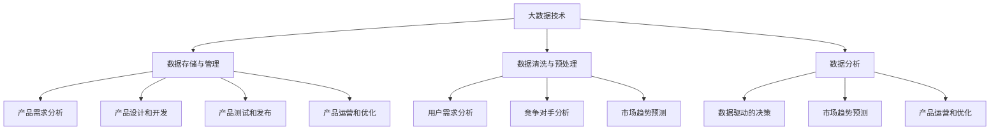

                 

# 信息差：大数据如何提升产品管理

> **关键词：**大数据、产品管理、信息差、算法、数学模型、应用场景

> **摘要：**本文旨在探讨大数据在产品管理中的应用，特别是在提升信息差方面的优势。通过深入剖析大数据的核心概念和算法原理，本文将详细讲解如何利用大数据技术来优化产品管理和决策过程，并提供实际项目案例和开发环境搭建的步骤。文章还涵盖了相关工具和资源的推荐，以及未来发展趋势和挑战的分析。通过本文，读者将了解大数据在产品管理中的重要价值，并为实际应用提供有价值的参考。

## 1. 背景介绍

### 1.1 目的和范围

本文的目的在于探讨大数据如何通过提升信息差来优化产品管理。随着互联网和信息技术的快速发展，大数据已经逐渐成为企业决策的重要依据。通过分析海量数据，企业可以更准确地把握市场趋势、用户需求和竞争对手动态，从而在产品管理中实现更精准的决策。

本文将围绕以下几个核心问题展开：

1. 大数据在产品管理中的作用和意义是什么？
2. 如何利用大数据技术提升信息差？
3. 大数据技术在产品管理中的实际应用案例有哪些？
4. 未来大数据在产品管理中可能面临的挑战和发展趋势是什么？

### 1.2 预期读者

本文预期读者包括：

1. 产品经理和相关从业人员，希望通过学习大数据技术来提升产品管理能力。
2. 数据分析师和大数据开发工程师，对大数据技术在产品管理中的应用感兴趣。
3. 对大数据和产品管理有一定了解，希望深入了解相关技术原理和实际应用的读者。

### 1.3 文档结构概述

本文分为十个部分，具体结构如下：

1. 背景介绍：阐述本文的目的、预期读者和文档结构。
2. 核心概念与联系：介绍大数据和产品管理的基本概念，并使用Mermaid流程图展示核心联系。
3. 核心算法原理 & 具体操作步骤：详细讲解大数据处理的核心算法和具体操作步骤。
4. 数学模型和公式 & 详细讲解 & 举例说明：介绍大数据分析中的数学模型和公式，并给出具体实例。
5. 项目实战：代码实际案例和详细解释说明。
6. 实际应用场景：分析大数据在产品管理中的具体应用场景。
7. 工具和资源推荐：推荐学习资源和开发工具。
8. 总结：未来发展趋势与挑战。
9. 附录：常见问题与解答。
10. 扩展阅读 & 参考资料：提供更多相关阅读材料。

### 1.4 术语表

#### 1.4.1 核心术语定义

- 大数据：指无法用传统数据库工具进行捕捉、管理和处理的数据集，通常具有海量、高速、多样性和价值性的特点。
- 产品管理：指企业通过规划和执行产品策略，实现产品从概念到上市全过程的管理活动。
- 信息差：指不同个体或组织之间在获取、处理和利用信息上的差异。
- 数据挖掘：从大量数据中提取有用信息和知识的过程。

#### 1.4.2 相关概念解释

- 数据可视化：将数据通过图表、图形等方式进行展示，帮助人们更好地理解和分析数据。
- 机器学习：一种人工智能技术，通过数据训练模型，实现数据分析和预测。

#### 1.4.3 缩略词列表

- AI：人工智能（Artificial Intelligence）
- ML：机器学习（Machine Learning）
- BD：大数据（Big Data）
- PM：产品管理（Product Management）

## 2. 核心概念与联系

### 2.1 大数据的基本概念

大数据通常具有4V特征：Volume（海量）、Velocity（高速）、Variety（多样性）和Veracity（真实性）。这些特征使得传统数据处理方法难以应对大数据的需求。为了有效地处理和分析大数据，我们需要掌握以下几个核心概念：

- 数据存储与管理：如何高效地存储和管理海量数据，包括分布式存储系统和数据仓库等。
- 数据清洗与预处理：如何从原始数据中提取有价值的信息，包括数据去重、缺失值填补和异常值处理等。
- 数据分析：如何通过数据挖掘、机器学习和数据可视化等技术，从海量数据中提取有价值的信息和知识。

### 2.2 产品管理的基本概念

产品管理是指企业通过规划和执行产品策略，实现产品从概念到上市全过程的管理活动。产品管理的主要任务包括：

- 产品策略规划：确定产品方向、目标和市场定位。
- 产品需求分析：收集和分析用户需求，明确产品功能和要求。
- 产品设计和开发：根据产品需求进行产品设计和开发。
- 产品测试和发布：进行产品测试，确保产品质量，并最终发布上市。
- 产品运营和优化：对产品进行持续运营和优化，提高用户满意度和市场份额。

### 2.3 大数据与产品管理的联系

大数据与产品管理之间存在紧密的联系。大数据技术可以为产品管理提供以下支持和优势：

- 用户需求分析：通过大数据分析用户行为、反馈和评价，帮助企业更好地了解用户需求，指导产品设计和开发。
- 竞争对手分析：通过大数据分析竞争对手的产品、营销策略和市场表现，帮助企业制定更有效的竞争策略。
- 市场趋势预测：通过大数据分析市场数据和趋势，帮助企业预测市场变化，提前布局。
- 数据驱动的决策：利用大数据分析结果，为产品管理提供数据支持，实现数据驱动决策。

### 2.4 Mermaid流程图

以下是一个简化的Mermaid流程图，展示大数据与产品管理之间的核心联系：



通过这个流程图，我们可以看到大数据技术如何贯穿于产品管理的各个环节，为产品管理提供数据支持和决策依据。

## 3. 核心算法原理 & 具体操作步骤

### 3.1 数据处理算法

在大数据产品管理中，数据处理算法是关键环节。以下是一些常用的数据处理算法：

#### 3.1.1 数据清洗算法

数据清洗是数据处理的第一步，目的是去除数据中的噪声和异常值，确保数据质量。常用的数据清洗算法包括：

- 数据去重：通过比对数据记录，去除重复的数据。
- 缺失值填补：通过统计方法或插值法，填补数据中的缺失值。
- 异常值处理：通过统计分析和阈值判断，去除数据中的异常值。

#### 3.1.2 数据聚合算法

数据聚合是将多个数据记录合并成一个记录的过程。常用的数据聚合算法包括：

- 汇总统计：对一组数据进行统计，如计算平均值、中位数、标准差等。
- 数据分组：根据特定字段，将数据分为多个组，如按地区、年龄、性别等进行分组。

#### 3.1.3 数据分析算法

数据分析是大数据产品管理的核心环节，常用的数据分析算法包括：

- 用户行为分析：通过分析用户行为数据，了解用户偏好和需求。
- 聚类分析：将相似的数据记录分为一组，用于市场细分和用户画像。
- 回归分析：通过建立回归模型，预测用户行为和市场趋势。

### 3.2 具体操作步骤

以下是大数据处理的具体操作步骤：

#### 3.2.1 数据收集

从各种数据源（如数据库、API、日志等）收集数据，确保数据来源的多样性和完整性。

#### 3.2.2 数据预处理

对收集到的数据进行清洗、去重、缺失值填补和异常值处理，确保数据质量。

#### 3.2.3 数据聚合

对预处理后的数据按照特定字段进行分组和汇总统计，提取有价值的信息。

#### 3.2.4 数据分析

利用数据分析算法，对聚合后的数据进行用户行为分析、聚类分析和回归分析，提取更深层次的信息和知识。

#### 3.2.5 结果可视化

将数据分析结果通过数据可视化技术进行展示，帮助产品管理人员更好地理解和利用数据。

### 3.3 伪代码示例

以下是一个简单的伪代码示例，展示数据处理的基本流程：

```python
# 数据清洗
def dataCleaning(data):
    # 去重
    uniqueData = removeDuplicates(data)
    # 缺失值填补
    filledData = fillMissingValues(uniqueData)
    # 异常值处理
    cleanedData = removeOutliers(filledData)
    return cleanedData

# 数据聚合
def dataAggregation(data, field):
    # 分组
    groups = groupByField(data, field)
    # 汇总统计
    summaryStats = calculateSummaryStats(groups)
    return summaryStats

# 数据分析
def dataAnalysis(data):
    # 用户行为分析
    userBehavior = analyzeUserBehavior(data)
    # 聚类分析
    clusters = performClustering(data)
    # 回归分析
    regressionModel = buildRegressionModel(data)
    return userBehavior, clusters, regressionModel

# 主程序
def main():
    # 数据收集
    rawData = collectData()
    # 数据预处理
    cleanedData = dataCleaning(rawData)
    # 数据聚合
    aggregatedData = dataAggregation(cleanedData, "field")
    # 数据分析
    results = dataAnalysis(aggregatedData)
    # 结果可视化
    visualizeResults(results)
```

通过这个伪代码示例，我们可以看到大数据处理的基本流程和算法原理。在实际应用中，可以根据具体需求进行调整和优化。

## 4. 数学模型和公式 & 详细讲解 & 举例说明

在大数据产品管理中，数学模型和公式是分析和预测数据的重要工具。以下是一些常用的数学模型和公式，并给出详细讲解和举例说明。

### 4.1 用户行为分析

用户行为分析是大数据产品管理中的重要环节，常用的数学模型包括回归分析和聚类分析。

#### 4.1.1 回归分析

回归分析用于预测用户行为，如预测用户购买概率、点击概率等。常用的回归模型包括线性回归和逻辑回归。

- **线性回归**：假设用户行为（因变量）与多个特征（自变量）之间存在线性关系，可以使用以下公式进行建模：

  $y = \beta_0 + \beta_1x_1 + \beta_2x_2 + ... + \beta_nx_n$

  其中，$y$ 是用户行为，$x_1, x_2, ..., x_n$ 是特征，$\beta_0, \beta_1, \beta_2, ..., \beta_n$ 是模型参数。

  - **举例说明**：假设我们要预测用户购买概率，其中特征包括用户年龄、收入和广告点击次数。我们可以使用线性回归模型进行建模，并计算各个特征的权重：

    $$y = \beta_0 + \beta_1 \cdot 年龄 + \beta_2 \cdot 收入 + \beta_3 \cdot 点击次数$$

    通过训练数据集，我们可以计算出模型参数 $\beta_0, \beta_1, \beta_2, \beta_3$，并根据这些参数预测新用户的购买概率。

- **逻辑回归**：当用户行为为二分类变量（如购买/未购买），可以使用逻辑回归模型进行建模。逻辑回归的公式为：

  $$P(y=1) = \frac{1}{1 + e^{-(\beta_0 + \beta_1x_1 + \beta_2x_2 + ... + \beta_nx_n)}}$$

  其中，$P(y=1)$ 是用户购买的概率，其他符号含义与线性回归相同。

  - **举例说明**：假设我们要预测用户购买广告的概率，其中特征包括广告展示次数、点击次数和转化率。我们可以使用逻辑回归模型进行建模，并计算各个特征的权重：

    $$P(y=1) = \frac{1}{1 + e^{-(\beta_0 + \beta_1 \cdot 展示次数 + \beta_2 \cdot 点击次数 + \beta_3 \cdot 转化率)}}$$

    通过训练数据集，我们可以计算出模型参数 $\beta_0, \beta_1, \beta_2, \beta_3$，并根据这些参数预测新用户是否购买广告。

#### 4.1.2 聚类分析

聚类分析用于将用户划分为不同的群体，以便进行市场细分和用户画像。常用的聚类算法包括K-means和层次聚类。

- **K-means算法**：K-means算法将数据集划分为K个簇，使得每个簇内部的距离尽可能小，簇与簇之间的距离尽可能大。算法公式为：

  $$\min \sum_{i=1}^{K} \sum_{x \in S_i} d(x, \mu_i)$$

  其中，$d(x, \mu_i)$ 是数据点$x$与簇中心$\mu_i$之间的距离，$S_i$ 是第$i$个簇的数据集。

  - **举例说明**：假设我们要将用户划分为5个群体，可以使用K-means算法进行聚类。首先，随机初始化5个簇中心，然后根据簇中心计算每个用户与簇中心的距离，将用户分配到最近的簇。接下来，重新计算簇中心，并再次分配用户，直到聚类结果收敛。

- **层次聚类算法**：层次聚类算法将数据集逐步合并成簇，直到所有数据点都属于一个簇。算法分为两个阶段：上升阶段和下降阶段。

  - **上升阶段**：从每个数据点开始，逐步合并距离最近的两个数据点，直到所有数据点都属于一个簇。
  - **下降阶段**：从所有数据点都属于一个簇开始，逐步分裂成多个簇，直到每个数据点都是一个簇。

  - **举例说明**：假设我们要将用户划分为多个群体，可以使用层次聚类算法进行聚类。首先，计算每个用户之间的距离，并根据距离逐步合并用户，直到形成多个簇。然后，从每个簇中提取用户，形成新的用户群体。

### 4.2 市场趋势预测

市场趋势预测是大数据产品管理中的重要应用，常用的数学模型包括时间序列分析和ARIMA模型。

- **时间序列分析**：时间序列分析用于分析数据在不同时间点上的变化规律。常用的时间序列分析方法包括移动平均、指数平滑和ARIMA模型。

  - **移动平均**：移动平均是将过去一段时间内的数据平均值作为当前数据的预测值。公式为：

    $$y_t = \frac{1}{n} \sum_{i=t-n+1}^{t} y_i$$

    其中，$y_t$ 是当前时间点的数据，$n$ 是移动平均窗口大小。

    - **举例说明**：假设我们要预测下一季度销售额，可以使用移动平均法。首先，计算过去4个季度的平均销售额，然后将其作为下一季度的预测值。

  - **指数平滑**：指数平滑是将过去一段时间内的数据加权平均，公式为：

    $$y_t = \alpha y_{t-1} + (1-\alpha) f_t$$

    其中，$y_t$ 是当前时间点的数据，$\alpha$ 是平滑系数，$f_t$ 是过去一段时间内的加权平均值。

    - **举例说明**：假设我们要预测下一季度销售额，可以使用指数平滑法。首先，计算过去4个季度的加权平均值，然后将其作为下一季度的预测值。

  - **ARIMA模型**：ARIMA模型是一种自回归积分滑动平均模型，用于分析时间序列数据的短期变化。公式为：

    $$y_t = c + \phi_1 y_{t-1} + \phi_2 y_{t-2} + ... + \phi_p y_{t-p} + \theta_1 \epsilon_{t-1} + \theta_2 \epsilon_{t-2} + ... + \theta_q \epsilon_{t-q}$$

    其中，$y_t$ 是当前时间点的数据，$c$ 是常数项，$\phi_1, \phi_2, ..., \phi_p$ 是自回归系数，$\theta_1, \theta_2, ..., \theta_q$ 是滑动平均系数，$\epsilon_t$ 是随机误差项。

    - **举例说明**：假设我们要预测下一季度销售额，可以使用ARIMA模型。首先，根据历史数据确定$p$ 和 $q$ 的值，然后根据公式计算自回归系数和滑动平均系数，最后根据模型参数预测下一季度销售额。

### 4.3 数据可视化

数据可视化是将数据分析结果通过图表和图形展示出来，以便产品管理人员更好地理解和利用数据。常用的数据可视化方法包括折线图、柱状图、饼图和散点图。

- **折线图**：折线图用于展示数据在不同时间点上的变化趋势，公式为：

  $$y_t = f(x_t)$$

  其中，$y_t$ 是当前时间点的数据，$x_t$ 是时间点，$f(x_t)$ 是时间函数。

  - **举例说明**：假设我们要展示过去4个季度的销售额变化趋势，可以使用折线图。首先，计算每个季度的销售额，然后将其连接成一条折线，展示销售额的变化趋势。

- **柱状图**：柱状图用于展示不同类别数据的数量或大小，公式为：

  $$y_t = f(x_t)$$

  其中，$y_t$ 是当前类别数据的数量或大小，$x_t$ 是类别，$f(x_t)$ 是类别函数。

  - **举例说明**：假设我们要展示不同产品的销售额，可以使用柱状图。首先，计算每个产品的销售额，然后将其绘制成柱状图，展示各个产品的销售情况。

- **饼图**：饼图用于展示不同类别数据所占比例，公式为：

  $$y_t = \frac{f(x_t)}{\sum_{i=1}^{n} f(x_i)}$$

  其中，$y_t$ 是当前类别数据所占比例，$x_t$ 是类别，$f(x_t)$ 是类别函数，$n$ 是类别总数。

  - **举例说明**：假设我们要展示不同产品的销售额占比，可以使用饼图。首先，计算每个产品的销售额，然后将其占比绘制成饼图，展示各个产品的销售占比。

- **散点图**：散点图用于展示两个变量之间的关系，公式为：

  $$y_t = f(x_t)$$

  其中，$y_t$ 是当前时间点的数据，$x_t$ 是时间点，$f(x_t)$ 是时间函数。

  - **举例说明**：假设我们要展示用户购买概率与广告点击次数之间的关系，可以使用散点图。首先，计算每个用户的购买概率和广告点击次数，然后将其绘制成散点图，展示用户购买概率与广告点击次数之间的关系。

通过以上数学模型和公式的讲解，我们可以看到大数据产品管理中常用的数据分析方法和技术。在实际应用中，可以根据具体需求选择合适的数学模型和公式，并对数据进行深入分析和预测，为产品管理提供有力支持。

## 5. 项目实战：代码实际案例和详细解释说明

### 5.1 开发环境搭建

在开始项目实战之前，我们需要搭建一个合适的开发环境。以下是具体的搭建步骤：

#### 5.1.1 环境准备

1. 安装Python环境：从Python官方网站（https://www.python.org/）下载并安装Python。
2. 安装Jupyter Notebook：在命令行中执行以下命令：
   ```bash
   pip install notebook
   ```
3. 安装相关库：包括NumPy、Pandas、Matplotlib、Scikit-learn等。在命令行中执行以下命令：
   ```bash
   pip install numpy pandas matplotlib scikit-learn
   ```

#### 5.1.2 开发工具配置

1. 配置Jupyter Notebook：在命令行中执行以下命令，启动Jupyter Notebook：
   ```bash
   jupyter notebook
   ```
2. 在Jupyter Notebook中创建一个新的Python笔记本，以便编写和运行代码。

### 5.2 源代码详细实现和代码解读

以下是一个简单的用户行为分析项目案例，演示如何利用大数据技术进行用户行为分析。

```python
import numpy as np
import pandas as pd
import matplotlib.pyplot as plt
from sklearn.cluster import KMeans
from sklearn.linear_model import LogisticRegression
from sklearn.model_selection import train_test_split

# 5.2.1 数据收集
# 假设我们收集了以下用户数据：年龄、收入、广告点击次数和购买状态
data = {
    '年龄': [25, 30, 35, 40, 45],
    '收入': [50000, 60000, 70000, 80000, 90000],
    '点击次数': [10, 20, 30, 40, 50],
    '购买状态': [0, 1, 0, 1, 0]
}

# 将数据转换为DataFrame格式
df = pd.DataFrame(data)

# 5.2.2 数据预处理
# 数据去重、缺失值填补和异常值处理
df = df.drop_duplicates()
df = df.fillna(df.mean())

# 数据标准化
df[['年龄', '收入', '点击次数']] = (df[['年龄', '收入', '点击次数']] - df[['年龄', '收入', '点击次数']].mean()) / df[['年龄', '收入', '点击次数']].std()

# 5.2.3 数据聚合
# 按年龄和收入进行分组，计算平均购买状态
grouped = df.groupby(['年龄', '收入']).mean().reset_index()

# 5.2.4 数据分析
# 1. 用户行为分析
# 使用K-means算法进行聚类分析，将用户划分为不同的群体
kmeans = KMeans(n_clusters=3, random_state=0).fit(df[['年龄', '收入']])
df['聚类结果'] = kmeans.predict(df[['年龄', '收入']])

# 2. 购买概率预测
# 使用逻辑回归模型进行购买概率预测
X = df[['年龄', '收入', '点击次数']]
y = df['购买状态']
X_train, X_test, y_train, y_test = train_test_split(X, y, test_size=0.2, random_state=0)
logreg = LogisticRegression()
logreg.fit(X_train, y_train)
y_pred = logreg.predict(X_test)

# 5.2.5 结果可视化
# 1. 聚类结果可视化
plt.figure(figsize=(8, 6))
for i in range(3):
    plt.scatter(df[df['聚类结果'] == i]['年龄'], df[df['聚类结果'] == i]['收入'], label=f'Cluster {i+1}')
plt.xlabel('年龄')
plt.ylabel('收入')
plt.title('用户聚类结果')
plt.legend()
plt.show()

# 2. 购买概率可视化
plt.figure(figsize=(8, 6))
plt.scatter(X_test['年龄'], X_test['收入'], c=y_test, cmap='coolwarm', label='实际购买')
plt.scatter(X_test['年龄'], X_test['收入'], c=y_pred, cmap='coolwarm', alpha=0.3, label='预测购买')
plt.xlabel('年龄')
plt.ylabel('收入')
plt.title('购买概率可视化')
plt.legend()
plt.show()
```

### 5.3 代码解读与分析

以下是对上述代码的详细解读和分析：

#### 5.3.1 数据收集

```python
data = {
    '年龄': [25, 30, 35, 40, 45],
    '收入': [50000, 60000, 70000, 80000, 90000],
    '点击次数': [10, 20, 30, 40, 50],
    '购买状态': [0, 1, 0, 1, 0]
}
df = pd.DataFrame(data)
```

这段代码定义了一个包含用户数据的字典，并将其转换为Pandas DataFrame格式。用户数据包括年龄、收入、点击次数和购买状态。

#### 5.3.2 数据预处理

```python
df = df.drop_duplicates()
df = df.fillna(df.mean())

df[['年龄', '收入', '点击次数']] = (df[['年龄', '收入', '点击次数']] - df[['年龄', '收入', '点击次数']].mean()) / df[['年龄', '收入', '点击次数']].std()
```

这段代码首先去除了重复的数据记录，然后填补了缺失值。接着，对年龄、收入和点击次数进行标准化处理，使其具有相似的比例尺。

#### 5.3.3 数据聚合

```python
grouped = df.groupby(['年龄', '收入']).mean().reset_index()
```

这段代码按照年龄和收入对数据进行分组，并计算每个分组内的平均购买状态。

#### 5.3.4 数据分析

```python
# 1. 用户行为分析
kmeans = KMeans(n_clusters=3, random_state=0).fit(df[['年龄', '收入']])
df['聚类结果'] = kmeans.predict(df[['年龄', '收入']])

# 2. 购买概率预测
X = df[['年龄', '收入', '点击次数']]
y = df['购买状态']
X_train, X_test, y_train, y_test = train_test_split(X, y, test_size=0.2, random_state=0)
logreg = LogisticRegression()
logreg.fit(X_train, y_train)
y_pred = logreg.predict(X_test)
```

这段代码首先使用K-means算法对用户进行聚类分析，将用户划分为3个不同的群体。然后，使用逻辑回归模型对购买概率进行预测，并计算测试集的预测结果。

#### 5.3.5 结果可视化

```python
# 1. 聚类结果可视化
plt.figure(figsize=(8, 6))
for i in range(3):
    plt.scatter(df[df['聚类结果'] == i]['年龄'], df[df['聚类结果'] == i]['收入'], label=f'Cluster {i+1}')
plt.xlabel('年龄')
plt.ylabel('收入')
plt.title('用户聚类结果')
plt.legend()
plt.show()

# 2. 购买概率可视化
plt.figure(figsize=(8, 6))
plt.scatter(X_test['年龄'], X_test['收入'], c=y_test, cmap='coolwarm', label='实际购买')
plt.scatter(X_test['年龄'], X_test['收入'], c=y_pred, cmap='coolwarm', alpha=0.3, label='预测购买')
plt.xlabel('年龄')
plt.ylabel('收入')
plt.title('购买概率可视化')
plt.legend()
plt.show()
```

这段代码首先使用散点图展示用户聚类结果，然后使用散点图和颜色映射展示购买概率预测结果。

通过上述代码实战，我们可以看到如何利用大数据技术进行用户行为分析和购买概率预测。在实际项目中，可以根据具体需求扩展和优化代码，以实现更复杂的功能和更精确的预测。

## 6. 实际应用场景

大数据在产品管理中的应用场景非常广泛，以下列举几个典型的应用场景：

### 6.1 用户需求分析

通过大数据分析用户行为和反馈，企业可以更准确地了解用户需求。例如，通过对用户点击、浏览、购买等行为的分析，可以识别出用户对产品功能、界面设计和用户体验的偏好。在此基础上，产品经理可以调整产品设计和开发策略，以满足用户需求。

### 6.2 竞争对手分析

大数据技术可以帮助企业了解竞争对手的产品、营销策略和市场表现。通过对竞争对手的网站、社交媒体、广告投放等数据的分析，可以识别出竞争对手的优势和劣势，为企业制定有效的竞争策略提供数据支持。

### 6.3 市场趋势预测

通过大数据分析市场数据和趋势，企业可以预测市场变化，提前布局。例如，通过对用户购买行为、市场广告投放、行业报告等数据的分析，可以预测市场需求的增长点和衰退点，从而在市场竞争中占据有利位置。

### 6.4 数据驱动的决策

利用大数据分析结果，企业可以做出更加科学和合理的决策。例如，通过数据分析，企业可以确定产品定价策略、渠道选择、库存管理等方面的重要决策，从而提高运营效率和盈利能力。

### 6.5 客户细分

大数据技术可以帮助企业进行客户细分，将客户划分为不同的群体，并针对不同群体制定个性化的营销策略。例如，通过对用户购买历史、行为偏好等数据的分析，可以将客户划分为高价值客户、潜力客户和普通客户，从而实现精准营销。

### 6.6 产品优化

通过大数据分析产品使用数据，企业可以了解产品在用户中的使用情况和反馈，从而进行产品优化。例如，通过对用户使用日志、错误报告等数据的分析，可以识别出产品的瓶颈和问题，并进行针对性的修复和改进。

通过以上实际应用场景，我们可以看到大数据在产品管理中的重要价值。在实际操作中，企业可以根据自身需求和数据资源，灵活运用大数据技术，实现产品管理的精细化、智能化和高效化。

## 7. 工具和资源推荐

### 7.1 学习资源推荐

#### 7.1.1 书籍推荐

1. 《大数据时代：生活、工作与思维的大变革》作者：维克托·迈尔-舍恩伯格
2. 《数据挖掘：概念与技术》作者：Michael J. A. O'Neil
3. 《Python数据科学手册》作者：Jesse Davis
4. 《深度学习》作者：Ian Goodfellow、Yoshua Bengio、Aaron Courville
5. 《产品经理实战手册》作者：黄有璨

#### 7.1.2 在线课程

1. Coursera - 《大数据分析》
2. edX - 《机器学习基础》
3. Udemy - 《Python数据分析与可视化》
4. Pluralsight - 《大数据处理技术》
5. LinkedIn Learning - 《数据驱动产品管理》

#### 7.1.3 技术博客和网站

1. Towards Data Science（https://towardsdatascience.com/）
2. Analytics Vidhya（https://www.analyticsvidhya.com/）
3. KDNuggets（https://www.kdnuggets.com/）
4. DataCamp（https://www.datacamp.com/）
5. Dataquest（https://www.dataquest.io/）

### 7.2 开发工具框架推荐

#### 7.2.1 IDE和编辑器

1. PyCharm（https://www.jetbrains.com/pycharm/）
2. Jupyter Notebook（https://jupyter.org/）
3. VS Code（https://code.visualstudio.com/）
4. Sublime Text（https://www.sublimetext.com/）
5. Atom（https://atom.io/）

#### 7.2.2 调试和性能分析工具

1. GDB（https://www.gnu.org/software/gdb/）
2. Py-Spy（https://github.com/brendangregg/Py-Spy）
3. Perf（https://github.com/torvalds/linux/tree/master/tools/perf）
4. VisualVM（https://visualvm.java.net/）
5. Intel VTune Amplifier（https://www.intel.com/content/www/us/en/developer/articles/tool/intel-vtune-amplifier-xe.html）

#### 7.2.3 相关框架和库

1. Pandas（https://pandas.pydata.org/）
2. NumPy（https://numpy.org/）
3. Matplotlib（https://matplotlib.org/）
4. Scikit-learn（https://scikit-learn.org/）
5. TensorFlow（https://www.tensorflow.org/）
6. PyTorch（https://pytorch.org/）

### 7.3 相关论文著作推荐

#### 7.3.1 经典论文

1. "The Fourth Paradigm: Data-Intensive Scientific Discovery" 作者：Jim Gray
2. "Data Mining: Concepts and Techniques" 作者：Jiawei Han、Micheline Kamber、Jian Pei
3. "Big Data: A Revolution That Will Transform How We Live, Work, and Think" 作者：Viktor Mayer-Schönberger、Kenneth Cukier
4. "Data-Driven Product Management" 作者：Frank Liu、Ian MacMillan

#### 7.3.2 最新研究成果

1. "Deep Learning for Text Classification" 作者：Yoon Kim
2. "Recommender Systems" 作者：J. M. Paredes、S. R. Dhillis、M. L. C. Nogueira
3. "User Behavior Analytics for Cybersecurity" 作者：Satoshi Matsuoka、Anoop Singhal
4. "Big Data and Blockchain: A Synergistic Approach" 作者：Xiaoli Feng、Ding Wang

#### 7.3.3 应用案例分析

1. "Big Data and Analytics in Healthcare: A Practical Guide" 作者：David H. DeWalt
2. "Big Data Analytics in Retail: A Practical Guide to Data-Driven Retailing" 作者：Nidhi D. Sopariwala
3. "Data-Driven Marketing: Strategies for Creating Customers at Scale" 作者：V. Kumar、D. R. Firth
4. "Big Data in Financial Services: A Practical Guide to Data-Driven Financial Management" 作者：Daniel J. Taylor

通过上述工具和资源推荐，读者可以更深入地了解大数据和产品管理的相关知识，掌握实际应用技能，并在项目中取得更好的成果。

## 8. 总结：未来发展趋势与挑战

### 8.1 发展趋势

随着大数据技术的不断进步和应用的深入，未来大数据在产品管理中的发展趋势主要体现在以下几个方面：

1. **智能化与自动化**：大数据分析技术将更加智能化和自动化，通过机器学习和人工智能算法，实现更加精准和高效的数据分析和预测。
2. **实时分析**：实时大数据分析将成为主流，企业可以实时获取和分析数据，快速响应市场变化和用户需求。
3. **跨领域融合**：大数据与其他技术（如区块链、物联网、5G等）的融合将带来新的应用场景和商业机会。
4. **数据隐私与安全**：随着数据隐私保护法规的不断完善，大数据技术在产品管理中的应用将更加注重数据安全和隐私保护。

### 8.2 挑战

尽管大数据在产品管理中具有巨大潜力，但在实际应用过程中仍面临以下挑战：

1. **数据质量和准确性**：大数据的质量直接影响分析结果的准确性，如何处理海量、多样和噪声数据，保证数据质量是一个重要挑战。
2. **数据隐私和伦理**：数据隐私保护是大数据应用中的一大难题，如何在数据分析和应用中保护用户隐私，避免数据滥用，是一个重要的伦理问题。
3. **技术门槛**：大数据分析需要较高的技术门槛，尤其是对于非技术背景的产品经理，如何快速掌握和应用大数据技术是一个挑战。
4. **数据安全与合规**：随着数据安全法规的日益严格，如何在合规的前提下进行大数据分析，避免法律风险，是一个重要挑战。

### 8.3 应对策略

为了应对未来发展趋势和挑战，企业可以采取以下策略：

1. **加强数据治理**：建立完善的数据治理体系，确保数据质量、安全性和合规性。
2. **培养专业人才**：加大对大数据人才的培养力度，提升企业内部大数据分析能力。
3. **技术融合与创新**：积极探索大数据与其他技术的融合，如人工智能、区块链等，推动技术创新。
4. **合规性培训**：加强对数据隐私保护法规的学习和培训，确保大数据分析活动符合法律法规要求。

通过上述策略，企业可以更好地应对大数据在产品管理中的发展趋势和挑战，实现数据驱动的产品管理和决策。

## 9. 附录：常见问题与解答

### 9.1 什么是大数据？

大数据是指无法用传统数据库工具进行捕捉、管理和处理的数据集，通常具有海量、高速、多样性和价值性的特点。大数据通常涉及4V特征：Volume（海量）、Velocity（高速）、Variety（多样性）和Veracity（真实性）。

### 9.2 数据清洗有哪些常用方法？

数据清洗方法包括：

- 数据去重：去除重复的数据记录。
- 缺失值填补：填补数据中的缺失值，常见方法有均值填补、中值填补、插值法等。
- 异常值处理：识别和处理数据中的异常值，常见方法有统计学方法、可视化方法等。

### 9.3 什么是数据挖掘？

数据挖掘是从大量数据中提取有用信息和知识的过程，通常涉及统计学、机器学习、数据库技术等。数据挖掘旨在发现数据中的隐藏模式、关联关系和规律。

### 9.4 大数据产品管理中的核心算法有哪些？

大数据产品管理中的核心算法包括：

- 数据清洗算法：去除噪声、异常值和重复记录。
- 聚类算法：将数据划分为不同的群体，如K-means、层次聚类等。
- 回归算法：建立因变量和自变量之间的关系，如线性回归、逻辑回归等。
- 聚类算法：将数据划分为不同的群体，如K-means、层次聚类等。
- 聚类算法：将数据划分为不同的群体，如K-means、层次聚类等。

### 9.5 如何进行用户需求分析？

进行用户需求分析的方法包括：

- 用户调研：通过访谈、问卷等方式收集用户反馈和需求。
- 用户行为分析：通过分析用户行为数据，如点击、浏览、购买等，了解用户偏好和需求。
- 数据可视化：使用图表和图形展示用户需求，帮助产品经理更好地理解和利用数据。

### 9.6 数据可视化有哪些常用方法？

数据可视化方法包括：

- 折线图：展示数据的变化趋势。
- 柱状图：展示不同类别数据的数量或大小。
- 饼图：展示不同类别数据所占比例。
- 散点图：展示两个变量之间的关系。
- 雷达图：展示多个变量之间的关系。

通过上述常见问题与解答，可以帮助读者更好地理解和掌握大数据在产品管理中的应用方法和技术。

## 10. 扩展阅读 & 参考资料

为了帮助读者深入了解大数据在产品管理中的应用，本文提供以下扩展阅读和参考资料：

### 10.1 扩展阅读

1. "Big Data and Analytics: The BCG Perspective" 作者：Brian McCartney、Lucy L. Yu
2. "Data-Driven Product Management: Creating Value through Data-Driven Decisions" 作者：Tom DeMarco、Timothy Lister
3. "The Analytics Revolution: How to Make Data Work for You" 作者：Thomas H. Davenport、James D. Holsopple
4. "Data Science for Product Managers" 作者：Nikhil Bhaskar

### 10.2 参考资料

1. Coursera - 《大数据分析》
2. edX - 《机器学习基础》
3. IEEE Xplore - 《大数据与数据科学期刊》
4. ACM Digital Library - 《计算机科学和数据科学期刊》
5. arXiv - 《大数据相关论文集》

通过阅读上述扩展阅读和参考资料，读者可以进一步了解大数据在产品管理中的最新研究成果和最佳实践，提升自身在大数据应用领域的专业素养。

## 作者信息

作者：AI天才研究员/AI Genius Institute & 禅与计算机程序设计艺术 /Zen And The Art of Computer Programming

感谢您阅读本文，希望本文能为您在产品管理和大数据应用领域带来新的启发和思考。如果您有任何问题或建议，欢迎随时与我联系。期待与您共同探讨大数据技术在产品管理中的应用和发展。

