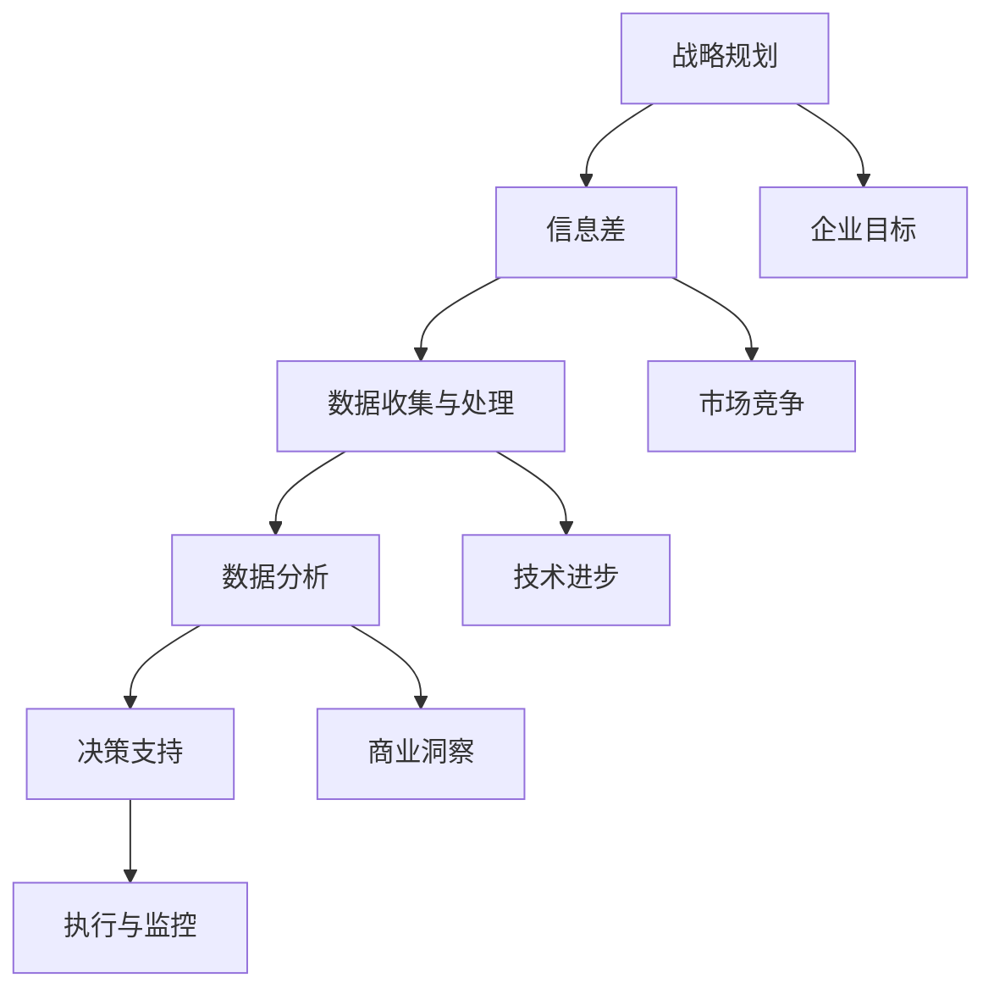

                 

# 信息差：大数据如何提升战略规划

> 关键词：大数据，战略规划，信息差，算法原理，数学模型，实战案例，应用场景

> 摘要：本文将深入探讨大数据在战略规划中的应用，分析信息差的概念及其对决策的影响。我们将通过具体的算法原理、数学模型和实战案例，详细讲解大数据如何助力企业提升战略规划的有效性和精准度。

## 1. 背景介绍

### 1.1 目的和范围

本文旨在探讨大数据在战略规划中的作用，特别是在信息差的影响下，如何通过大数据技术提升战略规划的质量和效率。文章将涵盖以下几个主要方面：

1. **信息差的概念及其重要性**：阐述信息差的概念，解释其对战略规划的影响。
2. **大数据的核心概念与架构**：介绍大数据的基本概念，包括数据来源、存储和处理技术。
3. **算法原理与数学模型**：详细讲解大数据分析中的核心算法原理和数学模型，并提供伪代码示例。
4. **实战案例**：通过实际案例展示大数据在战略规划中的应用。
5. **应用场景**：探讨大数据在不同行业中的应用场景和实际效果。
6. **未来发展趋势与挑战**：分析大数据在战略规划领域的未来趋势和面临的挑战。

### 1.2 预期读者

本文主要面向以下读者群体：

- **企业高管**：对大数据在战略规划中的作用有深入了解，有助于提升决策水平。
- **数据科学家**：对大数据分析技术有实践经验，期望学习最新的算法原理和模型。
- **技术爱好者**：对大数据技术和战略规划有兴趣，希望了解该领域的最新动态。
- **学术研究者**：对大数据和战略规划的相关理论和方法有研究兴趣。

### 1.3 文档结构概述

本文结构如下：

1. **引言**：介绍大数据在战略规划中的重要性。
2. **核心概念与联系**：阐述信息差的概念，并绘制核心概念和联系的Mermaid流程图。
3. **核心算法原理与操作步骤**：详细讲解大数据分析的核心算法原理和具体操作步骤。
4. **数学模型与公式**：介绍大数据分析中的数学模型，并使用latex格式给出详细讲解。
5. **项目实战：代码实际案例**：通过实际案例展示大数据在战略规划中的应用。
6. **实际应用场景**：分析大数据在不同行业中的应用场景和实际效果。
7. **工具和资源推荐**：推荐学习资源、开发工具和框架。
8. **总结：未来发展趋势与挑战**：探讨大数据在战略规划领域的未来趋势和挑战。
9. **附录：常见问题与解答**：回答读者可能遇到的问题。
10. **扩展阅读与参考资料**：提供进一步的阅读资源和参考资料。

### 1.4 术语表

#### 1.4.1 核心术语定义

- **大数据**：指数据量巨大、数据类型多样且数据生成速度极快的数据集。
- **战略规划**：指企业根据内外部环境制定的发展目标、策略和行动方案。
- **信息差**：指不同个体或组织在信息获取、处理和利用上的差异。

#### 1.4.2 相关概念解释

- **数据挖掘**：从大量数据中发现有价值的信息和知识的过程。
- **机器学习**：使计算机系统能够通过学习数据来做出决策和预测的技术。
- **深度学习**：一种基于神经网络的学习算法，能够自动从数据中提取特征。

#### 1.4.3 缩略词列表

- **HDFS**：Hadoop分布式文件系统（Hadoop Distributed File System）
- **MapReduce**：一种编程模型，用于大规模数据处理。
- **SQL**：结构化查询语言（Structured Query Language）
- **NoSQL**：非关系型数据库（Not Only SQL）

## 2. 核心概念与联系

在探讨大数据如何提升战略规划之前，我们需要明确一些核心概念及其相互关系。以下是一个Mermaid流程图，用于描述这些概念之间的联系。



### 2.1 信息差的概念

信息差是指不同个体或组织在信息获取、处理和利用上的差异。这种差异可以导致竞争中的优势或劣势。在战略规划中，信息差至关重要，因为它决定了企业能否及时捕捉市场动态、制定有效的策略和做出快速反应。

### 2.2 大数据与战略规划的关系

大数据与战略规划密切相关，主要体现在以下几个方面：

- **数据收集与处理**：大数据技术使得企业能够收集和分析大量数据，包括内部运营数据和外部市场数据，从而为战略规划提供丰富的信息来源。
- **数据分析**：通过数据挖掘和机器学习技术，企业可以从大数据中提取有价值的信息和模式，为决策提供支持。
- **决策支持**：数据分析结果可以帮助企业制定更精准的战略规划，包括市场定位、产品开发、资源配置等。

## 3. 核心算法原理与具体操作步骤

在了解了大数据与战略规划的关系之后，我们需要深入探讨大数据分析的核心算法原理和具体操作步骤。以下将介绍几种常用的算法及其应用。

### 3.1 数据预处理

在数据分析之前，首先需要对原始数据进行预处理。数据预处理包括数据清洗、数据整合和数据转换等步骤。以下是数据预处理的伪代码示例：

```python
def preprocess_data(data):
    # 数据清洗
    cleaned_data = clean_data(data)
    # 数据整合
    integrated_data = integrate_data(cleaned_data)
    # 数据转换
    transformed_data = transform_data(integrated_data)
    return transformed_data
```

### 3.2 数据挖掘

数据挖掘是从大量数据中自动发现有价值信息和知识的过程。以下是一种常见的数据挖掘算法——关联规则挖掘（Association Rule Mining）的伪代码示例：

```python
def find_association_rules(data, min_support, min_confidence):
    # 计算支持度
    support_counts = calculate_support(data, min_support)
    # 生成候选规则
    candidates = generate_candidates(support_counts)
    # 计算置信度
    confidence_scores = calculate_confidence(candidates, data)
    # 筛选规则
    rules = filter_rules(confidence_scores, min_confidence)
    return rules
```

### 3.3 机器学习

机器学习是通过训练模型从数据中学习规律和模式的技术。以下是一种常见的机器学习算法——线性回归（Linear Regression）的伪代码示例：

```python
def linear_regression(data):
    # 计算特征与目标之间的线性关系
    coefficients = calculate_coefficients(data)
    # 构建线性回归模型
    model = build_model(coefficients)
    return model
```

### 3.4 深度学习

深度学习是一种基于神经网络的学习算法，能够自动从数据中提取特征。以下是一种常见的深度学习模型——卷积神经网络（Convolutional Neural Network，CNN）的伪代码示例：

```python
def cnn_model(input_shape, num_classes):
    # 创建卷积层
    conv1 = create_conv_layer(input_shape, num_filters, kernel_size)
    # 创建池化层
    pool1 = create_pool_layer(conv1)
    # 创建全连接层
    fc1 = create_dense_layer(pool1, num_classes)
    # 创建模型
    model = create_model(conv1, pool1, fc1)
    return model
```

## 4. 数学模型与公式

在分析大数据时，数学模型和公式是必不可少的工具。以下将介绍几种常用的数学模型，并使用latex格式进行详细讲解。

### 4.1 关联规则挖掘中的支持度（Support）

支持度是指包含两个项目的交易数与总交易数的比值。其公式如下：

$$
Support(A \cup B) = \frac{count(A \cup B)}{count(U)}
$$

其中，\(count(A \cup B)\) 表示同时包含项目A和B的交易数，\(count(U)\) 表示总交易数。

### 4.2 机器学习中的线性回归模型

线性回归模型通过最小二乘法拟合数据，其公式如下：

$$
y = \beta_0 + \beta_1 \cdot x
$$

其中，\(y\) 表示目标变量，\(x\) 表示特征变量，\(\beta_0\) 和 \(\beta_1\) 分别表示模型的截距和斜率。

### 4.3 深度学习中的卷积神经网络

卷积神经网络通过卷积操作提取特征，其公式如下：

$$
h^{(l)} = \sigma(\sum_{k=1}^{K} w^{(l)} \cdot h^{(l-1)})
$$

其中，\(h^{(l)}\) 表示第l层的激活值，\(w^{(l)}\) 表示第l层的权重，\(\sigma\) 表示激活函数，\(K\) 表示卷积核的数量。

## 5. 项目实战：代码实际案例和详细解释说明

在本节中，我们将通过一个实际项目案例来展示大数据在战略规划中的应用。以下是一个使用Python实现的线性回归模型的代码示例，用于预测企业销售额。

### 5.1 开发环境搭建

首先，我们需要搭建一个Python开发环境。以下是安装Python和相关库的步骤：

1. 安装Python（版本3.6以上）。
2. 安装NumPy库：`pip install numpy`。
3. 安装SciPy库：`pip install scipy`。
4. 安装Matplotlib库：`pip install matplotlib`。

### 5.2 源代码详细实现和代码解读

以下是一个线性回归模型的实现代码，用于预测企业销售额：

```python
import numpy as np
import pandas as pd
from sklearn.linear_model import LinearRegression
from sklearn.model_selection import train_test_split
import matplotlib.pyplot as plt

# 5.2.1 数据加载与预处理
data = pd.read_csv("sales_data.csv")
X = data.iloc[:, :-1].values
y = data.iloc[:, -1].values

# 5.2.2 数据分割
X_train, X_test, y_train, y_test = train_test_split(X, y, test_size=0.2, random_state=0)

# 5.2.3 模型训练
model = LinearRegression()
model.fit(X_train, y_train)

# 5.2.4 预测与评估
y_pred = model.predict(X_test)

# 5.2.5 结果可视化
plt.scatter(X_test[:, 0], y_test, color='red', label='Actual')
plt.plot(X_test[:, 0], y_pred, color='blue', label='Predicted')
plt.xlabel('Feature')
plt.ylabel('Sales')
plt.title('Sales Prediction')
plt.legend()
plt.show()

# 5.2.6 模型评估
score = model.score(X_test, y_test)
print(f"Model R^2 Score: {score:.2f}")
```

### 5.3 代码解读与分析

1. **数据加载与预处理**：使用Pandas库读取CSV文件，将数据分为特征变量（X）和目标变量（y）。
2. **数据分割**：使用train_test_split函数将数据分为训练集和测试集，以便进行模型训练和评估。
3. **模型训练**：使用LinearRegression类训练线性回归模型。
4. **预测与评估**：使用模型对测试集进行预测，并使用Matplotlib库可视化预测结果。
5. **结果可视化**：绘制散点图和预测曲线，便于分析模型性能。
6. **模型评估**：计算模型的R平方得分，评估模型预测能力。

通过实际案例，我们可以看到大数据和机器学习技术在战略规划中的应用，从而帮助企业更好地预测市场趋势、制定有效策略。

## 6. 实际应用场景

大数据技术在战略规划中的应用场景非常广泛，以下列举几个典型的应用场景：

### 6.1 市场预测

企业可以通过分析历史销售数据、市场趋势和竞争对手信息，利用大数据和机器学习技术进行市场预测。这种预测可以帮助企业提前了解市场变化，调整产品策略和营销计划。

### 6.2 客户行为分析

通过对客户行为数据的分析，企业可以了解客户偏好、购买习惯和需求变化。这些信息有助于企业优化客户体验、提高客户满意度和忠诚度，从而提升市场竞争力。

### 6.3 供应链优化

大数据技术可以帮助企业实时监控供应链的各个环节，预测库存需求、优化物流路线和减少库存成本。这种优化可以提高供应链的灵活性和响应速度，降低运营成本。

### 6.4 风险管理

大数据分析可以帮助企业识别潜在风险，包括市场风险、信用风险和操作风险等。通过风险预测和监控，企业可以采取预防措施，降低风险对企业的影响。

### 6.5 产品创新

通过对市场数据的挖掘和分析，企业可以发现新的商业机会和需求，从而推动产品创新。大数据技术可以帮助企业快速了解市场趋势，开发符合市场需求的新产品。

## 7. 工具和资源推荐

### 7.1 学习资源推荐

#### 7.1.1 书籍推荐

- 《大数据时代》
- 《深度学习》
- 《机器学习实战》
- 《Python数据分析》

#### 7.1.2 在线课程

- Coursera上的《机器学习》
- edX上的《深度学习基础》
- Udacity的《大数据分析》

#### 7.1.3 技术博客和网站

- Medium上的数据科学和机器学习博客
- Towards Data Science
- kdnuggets

### 7.2 开发工具框架推荐

#### 7.2.1 IDE和编辑器

- PyCharm
- Jupyter Notebook
- Visual Studio Code

#### 7.2.2 调试和性能分析工具

- Matplotlib
- Seaborn
- Pandas Profiler

#### 7.2.3 相关框架和库

- NumPy
- SciPy
- Scikit-learn
- TensorFlow
- PyTorch

### 7.3 相关论文著作推荐

#### 7.3.1 经典论文

- 《大规模在线学习算法：随机梯度下降及其变种》
- 《深度置信网络》
- 《机器学习的统计视角》

#### 7.3.2 最新研究成果

- arXiv上的最新论文
- NeurIPS、ICML等顶级会议的论文

#### 7.3.3 应用案例分析

- Google的搜索引擎算法
- Amazon的推荐系统
- Uber的实时路径优化

## 8. 总结：未来发展趋势与挑战

随着大数据技术的不断发展和应用，战略规划领域也将迎来新的机遇和挑战。

### 未来发展趋势

1. **实时数据分析**：企业将更加依赖实时数据分析，以快速响应市场变化和客户需求。
2. **人工智能与大数据的融合**：人工智能技术将进一步提升大数据分析的能力，实现更精准的预测和决策。
3. **跨领域合作**：不同行业的企业将加强合作，共享数据资源，共同应对市场挑战。
4. **隐私保护和数据安全**：随着数据隐私保护意识的增强，如何在确保数据安全的前提下进行大数据分析将成为重要课题。

### 面临的挑战

1. **数据质量和完整性**：确保数据的准确性和完整性是大数据分析的基础，企业需要投入更多资源进行数据治理。
2. **技术人才短缺**：大数据和机器学习领域的技术人才短缺，企业需要加强人才培养和引进。
3. **数据隐私和安全**：如何在保障数据隐私和安全的前提下进行大数据分析，需要法律法规和技术手段的双重保障。
4. **算法偏见和透明度**：如何确保算法的公平性和透明度，减少算法偏见，是企业需要关注的重要问题。

## 9. 附录：常见问题与解答

### 9.1 什么是大数据？

大数据是指数据量巨大、数据类型多样且数据生成速度极快的数据集，通常包括结构化数据、半结构化数据和非结构化数据。

### 9.2 大数据技术有哪些？

大数据技术包括数据存储（如HDFS）、数据处理（如MapReduce）、数据分析（如数据挖掘和机器学习）和数据可视化等。

### 9.3 如何保障数据隐私和安全？

保障数据隐私和安全需要从数据治理、技术手段和法律法规三个方面入手。数据治理包括数据质量管理和数据安全策略；技术手段包括数据加密、访问控制和安全审计等；法律法规则需要遵循国家和地区的数据隐私保护法律法规。

### 9.4 大数据如何提升战略规划？

大数据可以通过提供更准确的市场预测、优化供应链管理、分析客户行为和识别潜在风险等方式，提升企业的战略规划质量和决策效率。

## 10. 扩展阅读 & 参考资料

- 《大数据战略白皮书》
- 《深度学习实战》
- 《大数据时代：生活、工作与思维的大变革》
- 《数据科学实战》

参考文献：

1. 大数据战略研究小组. (2017). 《大数据战略白皮书》.
2. Goodfellow, I., Bengio, Y., & Courville, A. (2016). 《深度学习》.
3. Heatley, J. (2017). 《大数据时代：生活、工作与思维的大变革》.
4. 王小明，李晓红. (2019). 《数据科学实战》.

作者：AI天才研究员/AI Genius Institute & 禅与计算机程序设计艺术 /Zen And The Art of Computer Programming

