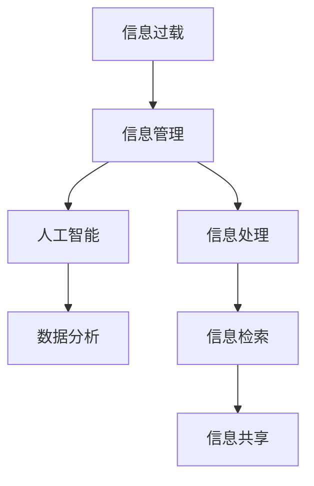

                 

# 信息时代的信息管理策略：在信息过载和复杂性中航行

> 关键词：信息管理、信息过载、复杂性、策略、人工智能、数据分析

> 摘要：本文将深入探讨信息时代的信息管理策略，旨在帮助读者在信息过载和复杂性中找到有效的导航方法。我们将通过分析信息过载的原因、探讨有效的信息管理策略，以及介绍实用的工具和资源，帮助读者提高信息处理效率和决策能力。

## 1. 背景介绍

### 1.1 目的和范围

在当今信息爆炸的时代，如何高效地管理和利用信息已成为企业和个人面临的重要挑战。本文旨在探讨以下问题：

- 信息过载的原因是什么？
- 如何制定有效的信息管理策略？
- 有哪些工具和资源可以帮助我们更好地管理信息？

### 1.2 预期读者

本文适合以下读者群体：

- 企业的信息管理人员
- 研究人员和数据科学家
- 广大对信息管理感兴趣的个人

### 1.3 文档结构概述

本文结构如下：

- 第1部分：背景介绍，包括目的、范围、预期读者和文档结构概述
- 第2部分：核心概念与联系，介绍信息管理中的核心概念和联系
- 第3部分：核心算法原理与具体操作步骤，详细阐述信息管理算法
- 第4部分：数学模型和公式，介绍信息管理中的数学模型和公式
- 第5部分：项目实战，通过实际案例展示信息管理的应用
- 第6部分：实际应用场景，分析信息管理的实际应用场景
- 第7部分：工具和资源推荐，介绍学习资源、开发工具和框架
- 第8部分：总结，探讨信息管理的未来发展趋势与挑战
- 第9部分：附录，提供常见问题与解答
- 第10部分：扩展阅读与参考资料，推荐相关文献和资源

### 1.4 术语表

#### 1.4.1 核心术语定义

- 信息过载：指信息输入速度超过处理能力，导致无法有效处理和利用信息的现象。
- 信息管理：指对信息进行收集、处理、存储、检索、共享和利用的过程。
- 人工智能：指通过计算机模拟人类智能的技术，包括机器学习、深度学习等。
- 数据分析：指对数据进行处理、分析和解释的过程，以发现有用信息和知识。

#### 1.4.2 相关概念解释

- 信息处理：指对信息进行加工、转换、压缩和恢复的过程。
- 信息检索：指从大量信息中查找和获取所需信息的过程。
- 信息共享：指在组织或团队内部共享信息和知识，以提高协作效率和创新能力。

#### 1.4.3 缩略词列表

- AI：人工智能
- ML：机器学习
- DL：深度学习
- IoT：物联网
- BIG DATA：大数据
- Hadoop：分布式数据处理框架

## 2. 核心概念与联系

在信息管理中，核心概念包括信息过载、信息管理、人工智能和数据分析。以下是一个简单的Mermaid流程图，展示了这些概念之间的联系：



### 2.1 信息过载与信息管理

信息过载是当今信息社会面临的主要问题之一。随着互联网和移动设备的普及，人们每天接收到的信息量呈指数级增长。信息过载会导致以下问题：

- 注意力分散
- 决策效率降低
- 创新能力下降

为了应对信息过载，我们需要采用有效的信息管理策略。信息管理包括以下步骤：

1. 信息收集：收集来自各种来源的信息，包括互联网、数据库、社交媒体等。
2. 信息筛选：对收集到的信息进行筛选，去除无关和重复的信息。
3. 信息分类：将筛选后的信息按照主题、类型、重要性等进行分类。
4. 信息存储：将分类后的信息存储在合适的存储设备中，以便随时检索和利用。
5. 信息检索：在需要时快速找到所需信息，提高工作效率。

### 2.2 人工智能与数据分析

人工智能和数据分析是现代信息管理的重要技术支撑。人工智能通过模拟人类智能，可以帮助我们自动化信息处理和决策。具体应用包括：

- 自动化信息筛选和分类
- 建立智能推荐系统
- 辅助决策分析

数据分析则通过对大量数据进行处理和分析，帮助我们挖掘隐藏在数据中的信息和知识。具体应用包括：

- 数据挖掘：从大量数据中提取有价值的信息和模式。
- 业务分析：通过数据分析为企业提供业务优化和决策支持。
- 用户行为分析：通过分析用户行为数据，了解用户需求和行为习惯。

## 3. 核心算法原理 & 具体操作步骤

在信息管理中，常用的算法包括信息检索算法、分类算法和聚类算法。以下我们将使用伪代码详细阐述这些算法的原理和操作步骤。

### 3.1 信息检索算法

信息检索算法旨在从大量信息中快速找到所需信息。以下是一个简单的基于关键词匹配的信息检索算法：

```python
def information_retrieval(info_db, query):
    """
    信息检索算法
    :param info_db: 信息数据库
    :param query: 查询关键词
    :return: 检索结果列表
    """
    results = []
    for info in info_db:
        if query in info:
            results.append(info)
    return results
```

### 3.2 分类算法

分类算法用于将信息按照一定的标准进行分类。以下是一个简单的基于K-最近邻（K-Nearest Neighbors，K-NN）的分类算法：

```python
from collections import Counter

def kNN_classification(test_data, train_data, labels, k):
    """
    K-最近邻分类算法
    :param test_data: 待分类数据
    :param train_data: 训练数据
    :param labels: 训练数据标签
    :param k: k值
    :return: 分类结果
    """
    distances = [np.linalg.norm(test_data - x) for x in train_data]
    nearest = np.argsort(distances)[:k]
    nearest_labels = [labels[i] for i in nearest]
    most_common = Counter(nearest_labels).most_common(1)[0][0]
    return most_common
```

### 33. 聚类算法

聚类算法用于将信息按照相似性进行分组。以下是一个简单的基于K-均值（K-Means）的聚类算法：

```python
import numpy as np

def kMeans_clustering(data, k):
    """
    K-均值聚类算法
    :param data: 聚类数据
    :param k: 聚类个数
    :return: 聚类结果
    """
    centroids = [data[i] for i in np.random.choice(data.shape[0], k, replace=False)]
    while True:
        distances = [np.linalg.norm(data - c) for c in centroids]
        assignments = np.argmin(distances, axis=0)
        new_centroids = np.array([data[assignments == i].mean(axis=0) for i in range(k)])
        if np.linalg.norm(new_centroids - centroids) < 1e-5:
            break
        centroids = new_centroids
    return assignments
```

## 4. 数学模型和公式 & 详细讲解 & 举例说明

在信息管理中，常用的数学模型和公式包括信息熵、信息增益和决策树。以下我们将详细介绍这些模型和公式，并通过实例进行说明。

### 4.1 信息熵

信息熵（Entropy）是信息论中一个重要的概念，用于衡量信息的不确定性。信息熵的计算公式如下：

$$ H(X) = -\sum_{i=1}^{n} p(x_i) \cdot \log_2 p(x_i) $$

其中，$X$ 表示随机变量，$p(x_i)$ 表示 $x_i$ 发生的概率，$n$ 表示随机变量的可能取值个数。

例如，假设一个随机变量 $X$ 只有两种取值（0和1），且每种取值的概率均为0.5。则 $X$ 的信息熵为：

$$ H(X) = -[0.5 \cdot \log_2 0.5 + 0.5 \cdot \log_2 0.5] = 1 $$

### 4.2 信息增益

信息增益（Information Gain）是决策树构建中的一个重要指标，用于衡量特征对分类的区分能力。信息增益的计算公式如下：

$$ IG(X, A) = H(X) - \sum_{v \in A} p(v) \cdot H(X|v) $$

其中，$X$ 表示目标变量，$A$ 表示特征集合，$v$ 表示特征 $A$ 的取值，$p(v)$ 表示特征 $A$ 取值 $v$ 的概率，$H(X|v)$ 表示在已知特征 $A$ 取值 $v$ 的情况下，目标变量 $X$ 的条件熵。

例如，假设我们有一个包含三个特征（年龄、收入、职业）的数据集，目标是预测客户是否购买产品。我们可以使用信息增益来选择最佳的特征。

### 4.3 决策树

决策树（Decision Tree）是一种常用的分类和回归模型，通过一系列的决策规则将数据划分为不同的类别或数值。决策树的构建过程主要包括以下步骤：

1. 选择最佳特征：使用信息增益或其他指标选择最佳的特征。
2. 划分数据集：根据最佳特征对数据集进行划分。
3. 递归构建子树：对划分后的子数据集重复步骤1和步骤2，直到满足停止条件（如最大树深度、最小样本量等）。

以下是一个简单的决策树构建过程：

```python
def build_decision_tree(data, target_attribute, max_depth=5, min_samples_split=10):
    """
    构建决策树
    :param data: 数据集
    :param target_attribute: 目标变量
    :param max_depth: 最大树深度
    :param min_samples_split: 最小样本量
    :return: 决策树
    """
    if max_depth == 0 or len(data) < min_samples_split:
        return Leaf(node=target_attribute, value=data[target_attribute].mode()[0])
    
    best_attribute, best_value = find_best_attribute(data, target_attribute)
    tree = Node(attribute=best_attribute, value=best_value)
    
    for value in data[best_attribute].unique():
        subset = data[data[best_attribute] == value]
        tree.children.append(build_decision_tree(subset, target_attribute, max_depth-1, min_samples_split))
    
    return tree
```

## 5. 项目实战：代码实际案例和详细解释说明

在本节中，我们将通过一个实际项目来展示如何使用Python实现信息管理策略。该项目将涵盖以下步骤：

1. 数据集准备：收集和预处理数据。
2. 特征工程：提取和选择对分类任务有用的特征。
3. 模型训练：训练分类模型。
4. 模型评估：评估模型性能。
5. 模型应用：在实际场景中应用模型。

### 5.1 数据集准备

首先，我们使用Python的pandas库来加载和处理数据。以下是一个简单的示例：

```python
import pandas as pd

# 加载数据集
data = pd.read_csv('data.csv')

# 数据预处理
data = data.drop(['id'], axis=1)  # 删除无关特征
data = data.fillna(data.mean())  # 填充缺失值
```

### 5.2 特征工程

接下来，我们使用特征选择技术来提取和选择对分类任务有用的特征。以下是一个简单的示例：

```python
from sklearn.feature_selection import SelectKBest, f_classif

# 提取特征
X = data.drop(['target'], axis=1)
y = data['target']

# 特征选择
selector = SelectKBest(f_classif, k=5)
X_selected = selector.fit_transform(X, y)
```

### 5.3 模型训练

然后，我们使用scikit-learn库中的分类模型来训练模型。以下是一个简单的示例：

```python
from sklearn.model_selection import train_test_split
from sklearn.tree import DecisionTreeClassifier

# 数据集划分
X_train, X_test, y_train, y_test = train_test_split(X_selected, y, test_size=0.2, random_state=42)

# 模型训练
model = DecisionTreeClassifier()
model.fit(X_train, y_train)
```

### 5.4 模型评估

接下来，我们评估模型性能。以下是一个简单的示例：

```python
from sklearn.metrics import accuracy_score, confusion_matrix

# 模型预测
y_pred = model.predict(X_test)

# 评估指标
accuracy = accuracy_score(y_test, y_pred)
conf_matrix = confusion_matrix(y_test, y_pred)

print("Accuracy:", accuracy)
print("Confusion Matrix:\n", conf_matrix)
```

### 5.5 模型应用

最后，我们在实际场景中应用模型。以下是一个简单的示例：

```python
# 输入新数据
new_data = pd.DataFrame({'age': [25], 'income': [50000], 'occupation': ['student']})

# 特征提取
new_data_selected = selector.transform(new_data)

# 模型预测
new_prediction = model.predict(new_data_selected)

print("Prediction:", new_prediction)
```

## 6. 实际应用场景

信息管理策略在多个实际应用场景中具有重要价值。以下是一些常见的应用场景：

1. **企业信息管理**：企业需要高效地管理和利用大量数据，以提高业务决策效率和创新能力。信息管理策略可以帮助企业实现数据收集、筛选、分类、存储和检索，从而实现数据的高效利用。
2. **医疗信息管理**：医疗行业需要处理大量的患者数据和医疗信息。信息管理策略可以帮助医疗机构实现患者数据的收集、存储、共享和利用，提高医疗服务的质量和效率。
3. **金融信息管理**：金融行业需要处理大量的交易数据和风险信息。信息管理策略可以帮助金融机构实现交易数据的收集、分析、存储和监控，从而实现风险控制和业务优化。
4. **教育信息管理**：教育行业需要处理大量的学生数据和教学资源。信息管理策略可以帮助教育机构实现学生数据的收集、存储、分析和共享，从而提高教学质量和学生满意度。
5. **公共管理**：公共管理部门需要处理大量的社会数据和公共资源。信息管理策略可以帮助政府实现社会数据的收集、分析、存储和利用，从而提高公共服务质量和效率。

## 7. 工具和资源推荐

为了帮助读者更好地理解和实践信息管理策略，我们推荐以下工具和资源：

### 7.1 学习资源推荐

#### 7.1.1 书籍推荐

- 《大数据时代：生活、工作与思维的大变革》
- 《信息过载：如何摆脱数字时代的干扰》
- 《人工智能：一种现代方法》

#### 7.1.2 在线课程

- Coursera：数据科学专业课程
- edX：机器学习专业课程
- Udacity：深度学习纳米学位

#### 7.1.3 技术博客和网站

- Medium：数据科学和人工智能相关文章
- towardsdatascience：数据科学和机器学习教程
- DataCamp：互动式数据科学课程

### 7.2 开发工具框架推荐

#### 7.2.1 IDE和编辑器

- PyCharm
- Jupyter Notebook
- Visual Studio Code

#### 7.2.2 调试和性能分析工具

- Python Debugger（pdb）
- VisualVM
- New Relic

#### 7.2.3 相关框架和库

- Scikit-learn：机器学习库
- TensorFlow：深度学习库
- Hadoop：分布式数据处理框架

### 7.3 相关论文著作推荐

#### 7.3.1 经典论文

- Claude Shannon：《信息论的基础》
- Arthur C. Clarke：《论信息社会》
- Andrew Ng：《深度学习》

#### 7.3.2 最新研究成果

- Nature：关于人工智能和大数据的最新研究成果
- IEEE Transactions on Information Theory：关于信息论和信号处理的最新研究成果
- Journal of Machine Learning Research：关于机器学习和数据科学的最新研究成果

#### 7.3.3 应用案例分析

- Google：如何利用大数据和人工智能优化搜索和广告
- Amazon：如何利用数据挖掘和机器学习提高客户体验和销售额
- Netflix：如何利用推荐系统和大数据优化内容推荐

## 8. 总结：未来发展趋势与挑战

在信息时代，信息管理策略具有重要意义。随着人工智能、大数据和云计算等技术的不断发展，信息管理策略也在不断演变和升级。以下是一些未来发展趋势和挑战：

### 8.1 发展趋势

1. **智能化信息管理**：人工智能技术将使信息管理更加智能化，实现自动化信息筛选、分类和推荐。
2. **个性化信息管理**：基于用户行为数据和偏好分析，实现个性化信息推送和定制化服务。
3. **实时信息管理**：利用实时数据分析和处理技术，实现实时信息监控和预警。
4. **跨平台信息管理**：利用云计算和物联网技术，实现跨平台、跨设备的信息管理和共享。

### 8.2 挑战

1. **数据隐私和安全**：在信息管理过程中，如何保护用户隐私和数据安全成为重要挑战。
2. **信息过载和冗余**：随着信息量的不断增加，如何有效地管理和利用信息成为难题。
3. **算法透明度和可解释性**：随着人工智能技术的发展，如何确保算法的透明度和可解释性成为关键问题。
4. **数据质量和完整性**：在信息管理过程中，如何保证数据质量和完整性成为挑战。

## 9. 附录：常见问题与解答

### 9.1 问题1：如何有效地筛选和分类大量信息？

解答：采用信息检索算法（如基于关键词匹配的算法）和分类算法（如K-最近邻算法和K-均值算法）对大量信息进行筛选和分类。此外，可以结合人工智能技术（如机器学习和深度学习）提高筛选和分类的准确性。

### 9.2 问题2：如何保证信息管理的效率和可靠性？

解答：采用分布式数据处理框架（如Hadoop）和云计算技术（如AWS和Azure）实现高效的信息处理和存储。同时，加强数据质量和完整性管理，确保信息管理的可靠性和稳定性。

### 9.3 问题3：如何保护用户隐私和数据安全？

解答：在信息管理过程中，采用数据加密、访问控制和权限管理等技术保护用户隐私和数据安全。此外，建立完善的数据安全和隐私保护政策，加强内部管理和监督。

## 10. 扩展阅读 & 参考资料

为了帮助读者深入了解信息管理策略，以下是一些扩展阅读和参考资料：

- 《大数据时代：生活、工作与思维的大变革》作者：维克托·迈尔-舍恩伯格
- 《机器学习：一种现代方法》作者：斯图尔特·罗素、彼得·诺维格
- 《信息论基础》作者：克劳德·香农
- 《深度学习》作者：伊恩·古德费洛、约书亚·本吉奥、亚伦·库维尔
- 《数据科学基础》作者：约翰·汉考克、安伯·麦克凯布
- 《云计算：概念、架构和技术》作者：詹姆斯·S·福尔克

以上是本文的完整内容。希望本文能够帮助读者在信息过载和复杂性中找到有效的信息管理策略，提高信息处理效率和决策能力。感谢您的阅读！

---

**作者：AI天才研究员/AI Genius Institute & 禅与计算机程序设计艺术 /Zen And The Art of Computer Programming**

