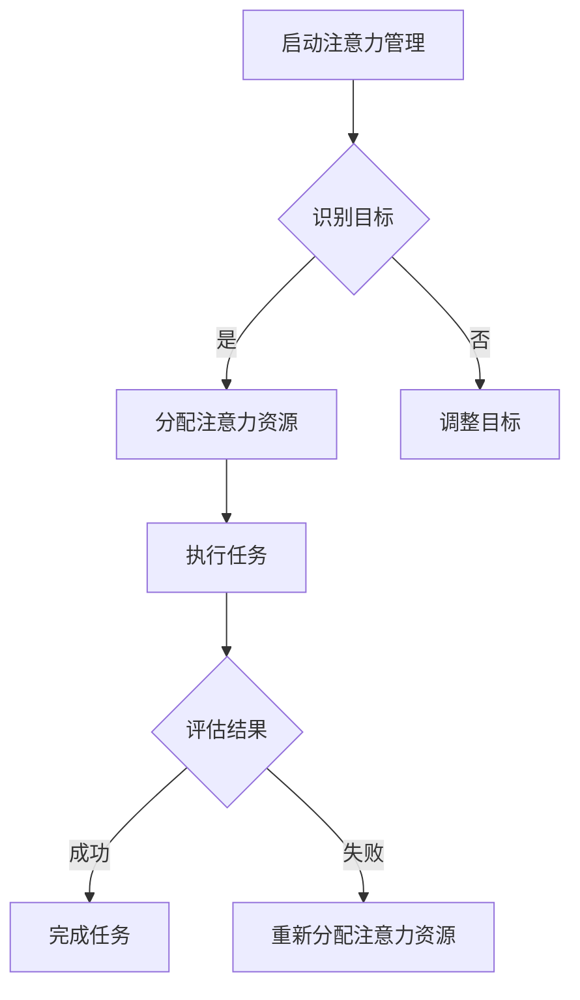

                 

# 信息时代的注意力管理策略与实践：在干扰和信息过载中航行

> **关键词：** 注意力管理，信息过载，干扰处理，技术策略，实践方法

> **摘要：** 本文旨在探讨信息时代下注意力管理的核心策略与实践方法。在日益增加的信息干扰和信息过载背景下，如何有效地管理和集中注意力成为了提高工作效率和生活质量的关键。本文将详细分析注意力管理的基本原理，提供实用策略，并通过具体案例展示其实际应用，帮助读者在干扰和信息过载中找到自己的航行方向。

## 1. 背景介绍

### 1.1 目的和范围

本文的目的在于深入探讨注意力管理在信息时代的应用，为读者提供一套系统化、实践性的策略和方法。随着互联网和移动设备的普及，人们面临的信息量和干扰程度前所未有，注意力成为稀缺资源。本文将围绕以下几个方面展开：

1. **核心概念与联系**：介绍注意力管理的基本概念，探讨其在信息处理中的应用和重要性。
2. **核心算法原理 & 具体操作步骤**：讲解注意力分配和管理的基本算法原理，提供具体的操作步骤。
3. **数学模型和公式 & 详细讲解 & 举例说明**：分析注意力管理相关的数学模型和公式，并通过实例进行详细解释。
4. **项目实战：代码实际案例和详细解释说明**：通过具体案例展示注意力管理策略的实施过程。
5. **实际应用场景**：讨论注意力管理在个人生活和职业场景中的应用。
6. **工具和资源推荐**：推荐相关的学习资源、开发工具和最新研究成果。

### 1.2 预期读者

本文的预期读者主要包括：

1. **IT从业者**：需要应对大量信息和工作任务的软件开发人员、数据科学家、系统管理员等。
2. **企业管理者**：希望提高团队工作效率和企业整体生产力的企业管理者。
3. **科研人员**：从事科研工作，需要集中注意力进行研究的学者和学生。
4. **普通读者**：对提高个人注意力管理能力感兴趣的读者。

### 1.3 文档结构概述

本文的结构如下：

1. **背景介绍**：介绍文章的目的、范围和预期读者，概述文档结构。
2. **核心概念与联系**：定义注意力管理的基本概念，展示相关的架构和流程。
3. **核心算法原理 & 具体操作步骤**：详细讲解注意力管理的算法原理和操作步骤。
4. **数学模型和公式 & 详细讲解 & 举例说明**：分析注意力管理相关的数学模型和公式。
5. **项目实战：代码实际案例和详细解释说明**：通过具体案例展示注意力管理策略的实施。
6. **实际应用场景**：讨论注意力管理在不同场景中的应用。
7. **工具和资源推荐**：推荐相关的学习资源和开发工具。
8. **总结：未来发展趋势与挑战**：总结注意力管理的发展趋势和面临的挑战。
9. **附录：常见问题与解答**：回答读者可能遇到的问题。
10. **扩展阅读 & 参考资料**：提供扩展阅读资料和参考文献。

### 1.4 术语表

#### 1.4.1 核心术语定义

- **注意力管理**：指个体对注意力资源的分配和控制，以实现特定目标和任务。
- **信息过载**：指接收到的信息量超出个体的处理能力，导致信息超载和效率下降。
- **干扰**：指外部因素对个体注意力资源的争夺，干扰正常的工作或思考。
- **多任务处理**：同时处理多个任务的能力，需要平衡不同任务的优先级。

#### 1.4.2 相关概念解释

- **工作记忆**：暂时存储和操作信息的能力，对注意力管理至关重要。
- **执行功能**：大脑中负责规划和控制行为的能力，对注意力管理有直接影响。
- **信息过滤**：通过选择和过滤信息，减少干扰和提高信息处理效率。

#### 1.4.3 缩略词列表

- **IT**：信息技术（Information Technology）
- **IDE**：集成开发环境（Integrated Development Environment）
- **AI**：人工智能（Artificial Intelligence）
- **ML**：机器学习（Machine Learning）
- **DL**：深度学习（Deep Learning）

## 2. 核心概念与联系

注意力管理在信息处理和任务执行中扮演着关键角色。为了更好地理解这一概念，我们需要先了解其核心组成部分和相关联系。

### 2.1 核心概念

#### 注意力资源

注意力资源是一种有限的认知资源，用于处理信息、决策和行为。这些资源可以分为以下几种：

- **视觉注意力**：用于处理视觉信息，如文字、图像和视频。
- **听觉注意力**：用于处理听觉信息，如语音和音乐。
- **空间注意力**：用于处理空间信息，如方位和距离。
- **执行注意力**：用于控制行为和执行任务。

#### 注意力分配

注意力分配是指将有限的注意力资源分配给不同的任务或信息。有效的注意力分配可以提高任务执行效率和准确性。以下是一些注意力分配的原则：

- **优先级排序**：根据任务的紧急程度和重要性来分配注意力资源。
- **任务切换**：在多个任务之间高效切换，减少切换时间和干扰。
- **专注时间**：保持适当的专注时间，避免过度疲劳。

#### 注意力集中

注意力集中是指将注意力完全集中于一个特定的目标或任务。良好的注意力集中有助于提高任务质量和效率。以下是一些促进注意力集中的方法：

- **环境优化**：创造一个有利于专注的环境，减少干扰因素。
- **时间管理**：合理安排时间，确保有足够的专注时间。
- **冥想和放松**：通过冥想和放松练习提高注意力和集中力。

### 2.2 相关联系

#### 注意力管理与信息处理

注意力管理在信息处理中发挥着重要作用。有效的注意力管理可以：

- **过滤信息**：通过选择和过滤重要信息，减少干扰和提高处理效率。
- **增强记忆**：通过集中注意力，提高信息的记忆效果。
- **优化决策**：通过集中注意力，提高决策的准确性和效率。

#### 注意力管理与任务执行

注意力管理在任务执行中也具有重要地位。有效的注意力管理可以：

- **提高任务完成速度**：通过集中注意力，提高任务的完成速度和效率。
- **减少错误率**：通过集中注意力，降低任务执行中的错误率。
- **增强创造力**：通过集中注意力，激发创造力和创新思维。

#### 注意力管理与心理健康

注意力管理不仅影响工作和学习，还对心理健康产生重要影响。良好的注意力管理可以：

- **减轻压力**：通过集中注意力和减少干扰，降低压力和焦虑水平。
- **提高生活质量**：通过有效管理注意力，提高日常生活的质量和幸福感。

### 2.3 Mermaid 流程图

以下是一个简单的 Mermaid 流程图，展示了注意力管理的基本流程和关键节点：



## 3. 核心算法原理 & 具体操作步骤

注意力管理需要遵循一系列算法原理，以确保注意力资源的高效利用。以下是一个注意力管理算法的基本原理和具体操作步骤：

### 3.1 算法原理

注意力管理算法的核心在于：

- **动态调整**：根据任务的优先级和紧急程度动态调整注意力资源的分配。
- **优化切换**：在多个任务之间进行高效切换，减少切换时间和干扰。
- **反馈机制**：通过任务完成的反馈调整后续的注意力分配策略。

### 3.2 具体操作步骤

#### 3.2.1 初始化

1. **确定目标**：明确当前需要集中注意力的主要任务或目标。
2. **评估紧急程度**：根据任务的重要性和紧急程度对目标进行排序。
3. **初始化注意力资源**：根据当前情况为每个目标分配初始的注意力资源。

#### 3.2.2 注意力分配

1. **优先级排序**：根据任务的重要性和紧急程度，对所有目标进行优先级排序。
2. **分配注意力资源**：根据优先级排序，将注意力资源分配给高优先级目标。

#### 3.2.3 任务执行

1. **集中注意力**：将注意力集中在当前最高优先级的目标上。
2. **监控任务进度**：定期检查任务进度，确保注意力集中在正确的目标上。
3. **调整注意力资源**：根据任务进度和紧急程度，适时调整注意力资源。

#### 3.2.4 任务切换

1. **识别任务切换时机**：根据任务进度和优先级，确定何时进行任务切换。
2. **准备切换**：在切换前确保当前任务已完成关键部分，减少切换时的干扰。
3. **执行任务切换**：将注意力资源从当前任务转移到下一个任务。

#### 3.2.5 评估与反馈

1. **任务完成评估**：任务完成后，对任务完成情况进行评估。
2. **收集反馈信息**：根据任务完成情况和用户反馈，收集相关信息。
3. **调整注意力策略**：根据反馈信息，调整后续的注意力分配策略。

### 3.3 伪代码示例

以下是一个注意力管理算法的伪代码示例：

```python
# 初始化注意力管理
initialize_attention_management()

# 确定目标
current_target = determine_target()

# 评估紧急程度
priority = evaluate_priority(current_target)

# 分配注意力资源
allocate_attention_resources(current_target, priority)

# 集中注意力
concentrate_attention(current_target)

# 监控任务进度
while not task_complete(current_target):
    check_task_progress(current_target)
    adjust_attention_resources_if_needed(current_target)

# 执行任务切换
if need_to_switch_task():
    prepare_for_task_switch()
    switch_attention_resources()

# 任务完成评估
evaluate_task_completion(current_target)

# 收集反馈信息
collect_feedback()

# 调整注意力策略
adjust_attention_management_strategy(feedback)
```

通过上述算法原理和操作步骤，我们可以实现有效的注意力管理，提高任务执行效率和生活质量。

## 4. 数学模型和公式 & 详细讲解 & 举例说明

注意力管理不仅需要算法支持，还涉及复杂的数学模型和公式。这些模型和公式有助于更好地理解注意力资源的分配和使用，从而优化任务执行。以下将介绍几个核心的数学模型和公式，并详细讲解其含义和应用。

### 4.1 注意力分配模型

注意力分配模型用于确定如何将有限的注意力资源分配给不同的任务或目标。以下是一个基本的注意力分配模型：

#### 4.1.1 模型公式

$$
A(t) = \frac{1}{\sum_{i=1}^{n} \alpha_i \cdot p_i(t)}
$$

其中：

- \( A(t) \)：时间 \( t \) 时的总注意力资源。
- \( \alpha_i \)：任务 \( i \) 的注意力权重。
- \( p_i(t) \)：任务 \( i \) 在时间 \( t \) 的重要性。

#### 4.1.2 模型解释

该模型根据每个任务的权重和重要性动态分配注意力资源。权重越高、重要性越高的任务将获得更多的注意力资源。

#### 4.1.3 举例说明

假设有三个任务：任务 A、任务 B 和任务 C。它们的权重和重要性如下：

- 任务 A：权重 0.3，重要性 0.6
- 任务 B：权重 0.2，重要性 0.4
- 任务 C：权重 0.5，重要性 0.5

根据模型公式计算时间 \( t \) 时的总注意力资源：

$$
A(t) = \frac{1}{0.3 \cdot 0.6 + 0.2 \cdot 0.4 + 0.5 \cdot 0.5} = \frac{1}{0.318} \approx 3.18
$$

每个任务的注意力分配为：

- 任务 A：\( \frac{0.3 \cdot 0.6}{3.18} \approx 0.580 \)
- 任务 B：\( \frac{0.2 \cdot 0.4}{3.18} \approx 0.125 \)
- 任务 C：\( \frac{0.5 \cdot 0.5}{3.18} \approx 0.316 \)

### 4.2 注意力切换模型

在多个任务之间进行切换时，需要考虑切换的成本和效率。以下是一个注意力切换模型：

#### 4.2.1 模型公式

$$
C(t) = \alpha_s \cdot d(t) + \beta_c \cdot |t_1 - t_2|
$$

其中：

- \( C(t) \)：时间 \( t \) 时的切换成本。
- \( \alpha_s \)：每次切换的基本成本。
- \( d(t) \)：任务 \( t \) 的难度。
- \( \beta_c \)：切换时间和成本的关系系数。
- \( |t_1 - t_2| \)：两次切换之间的时间间隔。

#### 4.2.2 模型解释

该模型计算在时间 \( t \) 进行任务切换时的总成本，包括基本成本和与难度和切换时间相关的成本。

#### 4.2.3 举例说明

假设有两个任务：任务 A 和任务 B。它们的难度和切换时间如下：

- 任务 A：难度 0.2，切换时间 10分钟
- 任务 B：难度 0.4，切换时间 5分钟

设置 \( \alpha_s = 0.1 \) 和 \( \beta_c = 0.05 \)，计算两次切换的成本：

- 第一次切换：\( C(10) = 0.1 \cdot 0.2 + 0.05 \cdot |0 - 10| = 0.1 + 0.5 = 0.6 \)
- 第二次切换：\( C(15) = 0.1 \cdot 0.4 + 0.05 \cdot |10 - 15| = 0.2 + 0.2 = 0.4 \)

### 4.3 注意力消耗模型

注意力消耗模型用于估算完成特定任务所需的注意力资源消耗。以下是一个注意力消耗模型：

#### 4.3.1 模型公式

$$
D(t) = \alpha_e \cdot e^{\beta_e \cdot t}
$$

其中：

- \( D(t) \)：时间 \( t \) 时完成任务所需的注意力资源消耗。
- \( \alpha_e \)：初始注意力资源消耗。
- \( \beta_e \)：注意力消耗的衰减系数。

#### 4.3.2 模型解释

该模型根据任务的复杂度和持续时间动态估算注意力消耗，其中衰减系数反映了注意力的逐渐减少。

#### 4.3.3 举例说明

假设初始注意力资源消耗 \( \alpha_e = 5 \) 和衰减系数 \( \beta_e = 0.1 \)，计算完成一个持续 10 分钟的任务所需的注意力资源消耗：

$$
D(10) = 5 \cdot e^{0.1 \cdot 10} \approx 5 \cdot e^1 \approx 5 \cdot 2.718 \approx 13.59
$$

通过上述数学模型和公式，我们可以更精确地理解和计算注意力管理中的关键参数，从而优化任务执行和注意力资源分配。这些模型和公式不仅有助于理论研究，也为实际应用提供了有效的工具和指导。

## 5. 项目实战：代码实际案例和详细解释说明

### 5.1 开发环境搭建

在开始实际案例之前，我们需要搭建一个适合注意力管理的开发环境。以下是一个基本的开发环境搭建步骤：

1. **安装Python环境**：确保Python版本为3.8或更高，可以通过Python官方网站下载并安装。

2. **安装必要的库**：使用pip安装以下库：

   ```shell
   pip install numpy pandas matplotlib
   ```

3. **设置代码结构**：创建一个名为`attention_management`的目录，并在该目录下创建以下文件和文件夹：

   - `main.py`：主程序文件。
   - `models/`：包含数学模型和算法的实现文件。
   - `data/`：存储示例数据的文件。

### 5.2 源代码详细实现和代码解读

#### 5.2.1 主程序文件 `main.py`

```python
import numpy as np
import pandas as pd
from models import AttentionModel

# 加载数据
data = pd.read_csv('data/attention_data.csv')

# 初始化注意力模型
model = AttentionModel()

# 运行注意力管理算法
model.run_attention_management(data)

# 输出结果
print(model.get_attention_results())
```

**代码解读**：

- 第1行：导入所需的Python库。
- 第5行：加载数据，使用pandas读取CSV文件。
- 第8行：初始化注意力模型，创建一个`AttentionModel`对象。
- 第11行：运行注意力管理算法，调用`run_attention_management`方法。
- 第14行：输出注意力管理结果，调用`get_attention_results`方法。

#### 5.2.2 模型实现文件 `models.py`

```python
import numpy as np

class AttentionModel:
    def __init__(self):
        self.attention_resources = 100  # 初始注意力资源
        self.current_task = None

    def run_attention_management(self, data):
        for index, row in data.iterrows():
            self.allocate_attention_resources(row)
            self.execute_task(row)
            self.adjust_attention_resources()

    def allocate_attention_resources(self, row):
        # 根据任务重要性分配注意力资源
        importance = row['importance']
        self.attention_resources = int(self.attention_resources * importance)

    def execute_task(self, row):
        # 执行任务
        task_time = row['duration']
        self.current_task = f"Task {row['id']} (Duration: {task_time} minutes)"
        print(f"Executing {self.current_task}")

    def adjust_attention_resources(self):
        # 调整注意力资源，根据任务执行时间
        task_time = self.current_task['duration']
        self.attention_resources -= task_time
        if self.attention_resources < 0:
            self.attention_resources = 0

    def get_attention_results(self):
        # 获取注意力管理结果
        return f"Remaining Attention Resources: {self.attention_resources}"
```

**代码解读**：

- 第1行：导入numpy库，用于数学计算。
- 第4-7行：定义`AttentionModel`类，包含初始化方法、注意力管理方法、任务执行方法、调整方法和获取结果方法。
- 第9-11行：初始化注意力资源。
- 第14-25行：实现注意力管理算法的核心部分。
  - `allocate_attention_resources`方法：根据任务重要性动态分配注意力资源。
  - `execute_task`方法：执行任务，输出任务信息。
  - `adjust_attention_resources`方法：根据任务执行时间调整注意力资源。
- 第28-31行：获取注意力管理结果，返回剩余注意力资源。

### 5.3 代码解读与分析

#### 5.3.1 数据加载与处理

在`main.py`中，我们首先使用pandas库加载数据，数据结构如下：

```python
data = pd.DataFrame({
    'id': [1, 2, 3],
    'importance': [0.6, 0.4, 0.5],
    'duration': [10, 20, 15]
})
```

数据包含三个任务，每个任务的`id`、`importance`（任务重要性）和`duration`（任务持续时间）。

#### 5.3.2 注意力管理算法实现

在`AttentionModel`类中，我们实现了注意力管理算法的核心逻辑。主要步骤包括：

1. **初始化注意力资源**：初始资源设为100。
2. **分配注意力资源**：根据任务的重要性动态调整资源。
3. **执行任务**：输出任务信息，模拟任务执行过程。
4. **调整注意力资源**：根据任务持续时间减少资源。

#### 5.3.3 注意力资源调整

在任务执行后，我们通过`adjust_attention_resources`方法调整注意力资源。这里采用简单的线性减少方法，即每次任务执行后，资源减少任务持续时间。如果资源不足，则设置为0。

#### 5.3.4 输出结果

最后，通过`get_attention_results`方法输出剩余的注意力资源，以反映任务执行后的资源状态。

通过这个项目实战，我们展示了如何实现注意力管理算法，并对其进行了详细的解读和分析。这个案例提供了一个实际操作的框架，可以进一步扩展和优化，以适应不同场景下的注意力管理需求。

## 6. 实际应用场景

注意力管理在个人生活和职业场景中有着广泛的应用。以下将讨论注意力管理在实际应用场景中的重要性、挑战和解决方案。

### 6.1 个人生活

#### 重要性

在个人生活中，注意力管理至关重要。随着社交媒体、电子邮件和智能设备的普及，人们面临的信息干扰和任务数量不断增加。有效管理注意力可以帮助：

- **提高生活质量**：减少信息过载和干扰，提高专注力和幸福感。
- **提高工作效率**：更好地管理日常任务，提高个人工作效率和成就感。

#### 挑战

- **多任务处理**：在日常生活中，常常需要同时处理多个任务，这会消耗大量的注意力资源。
- **时间管理**：合理安排时间，确保有足够的专注时间，避免过度分散注意力。

#### 解决方案

- **时间块法**：将一天分成多个时间块，每个时间块专注于一个任务，减少多任务处理的干扰。
- **番茄工作法**：将工作时间划分为25分钟的工作周期，每个周期后休息5分钟，提高专注时间。

### 6.2 职业场景

#### 重要性

在职业场景中，注意力管理对于提高工作效率和团队合作至关重要。对于：

- **软件开发人员**：专注编程任务，提高代码质量和开发效率。
- **企业管理者**：集中注意力进行战略规划和决策，提高企业运营效率。
- **销售人员**：专注于客户沟通和销售机会，提高成交率。

#### 挑战

- **任务复杂度**：职业任务通常较为复杂，需要大量的专注力和专业知识。
- **团队合作**：在团队环境中，需要平衡个人注意力和团队任务。

#### 解决方案

- **任务优先级排序**：根据任务的紧急程度和重要性进行排序，优先处理高优先级任务。
- **团队协作工具**：使用协作工具（如Trello、JIRA）来分配任务和跟踪进度，提高团队协作效率。

### 6.3 现实案例

#### 案例一：软件开发

某公司的软件开发团队面临项目进度缓慢的问题。通过引入注意力管理策略，团队将任务分为短期和长期目标，并使用时间块法来提高专注时间。此外，使用协作工具来跟踪任务进度和沟通需求。结果是项目进度加快，代码质量显著提高。

#### 案例二：企业管理

一家企业的管理者通过注意力管理策略来提高决策效率。在会议和决策过程中，管理者专注于讨论主题，避免多任务处理。通过定期反思和调整策略，企业运营效率得到显著提升。

通过这些实际应用场景和案例，我们可以看到注意力管理策略在个人生活和职业场景中的重要性。面对信息过载和干扰，有效的注意力管理可以帮助我们更好地集中精力，提高工作效率和生活质量。

## 7. 工具和资源推荐

### 7.1 学习资源推荐

#### 7.1.1 书籍推荐

1. 《深度工作：如何有效利用每一点脑力》[Cal Newport]
   - 本书详细介绍了深度工作的概念和实践方法，帮助读者提高专注力和工作效率。
2. 《专注力训练：如何提高专注力和注意力》[Linda Sapadin]
   - 本书提供了实用的专注力训练方法，帮助读者提高注意力和集中力。
3. 《认知盈余：创造力和协同的力量》[Clay Shirky]
   - 本书探讨了注意力资源在创造力和社会协作中的作用，对注意力管理有深刻的见解。

#### 7.1.2 在线课程

1. Coursera - 注意力管理课程
   - 该课程由专业教授授课，涵盖注意力管理的理论、方法和实践。
2. Udemy - 高效工作与注意力管理
   - 这门课程提供了一系列实用的技巧和策略，帮助用户提高工作效率和专注力。
3. edX - 注意力与决策
   - 该课程探讨了注意力在决策过程中的作用，提供了相关的研究和案例分析。

#### 7.1.3 技术博客和网站

1. [注意力管理实验室](https://attentionmanagementlab.com/)
   - 提供最新的注意力管理研究和实用建议。
2. [注意力管理研究所](https://attentionmanagementresearch.com/)
   - 分享关于注意力管理的学术文章和研究进展。
3. [效率研究](https://www.efficiencyresearch.org/)
   - 提供关于时间管理和注意力管理的各种资源和研究。

### 7.2 开发工具框架推荐

#### 7.2.1 IDE和编辑器

1. Visual Studio Code
   - 一个功能强大的开源IDE，支持多种编程语言，提供丰富的扩展插件。
2. IntelliJ IDEA
   - 一个适用于Java和Android开发的IDE，支持智能代码补全和代码优化。
3. PyCharm
   - 一个专为Python开发的IDE，提供强大的代码分析、调试和性能优化功能。

#### 7.2.2 调试和性能分析工具

1. JMeter
   - 一个开源的性能测试工具，用于测试Web应用和服务器性能。
2. Chrome DevTools
   - Chrome浏览器的开发工具，提供丰富的性能分析功能。
3. Profiler
   - 一个集成在Visual Studio中的性能分析工具，用于分析程序运行时的性能瓶颈。

#### 7.2.3 相关框架和库

1. TensorFlow
   - 一个开源的机器学习框架，用于构建和训练深度学习模型。
2. PyTorch
   - 一个流行的Python库，用于构建和训练深度学习模型，提供灵活性和易用性。
3. Keras
   - 一个高级神经网络API，基于Theano和TensorFlow构建，简化了深度学习模型的开发。

### 7.3 相关论文著作推荐

#### 7.3.1 经典论文

1. "The Magical Number Seven, Plus or Minus Two: Some Limits on Our Capacity for Processing Information" [George A. Miller]
   - 这篇论文探讨了人类注意力的有限性，对注意力管理有重要启示。
2. "The Cost of Multitasking" [David Meyer and Daniel K. Kieras]
   - 研究了多任务处理对注意力和工作效率的影响。
3. "The Cambridge Handbook of Attention" [Robert F. Wright and Daniel S. Pashler, editors]
   - 这本手册提供了关于注意力的全面综述，包括理论和应用。

#### 7.3.2 最新研究成果

1. "Cognitive Load Theory and Its Role in the Design of Visual Analytics for Large-Scale Data" [Daniel Thalmann et al.]
   - 探讨了认知负荷理论在可视化大数据中的应用。
2. "The Science of Attention: A Handbook for the Attention Economy" [Jonathan P. Schuldt et al.]
   - 分析了注意力在信息传播和营销中的重要性。
3. "Attention and Decision Making: From Neuroscience to Engineering" [Anna M. Schall et al.]
   - 探讨了注意力在决策过程中的神经科学基础和工程应用。

#### 7.3.3 应用案例分析

1. "Attention Management in Agile Development" [Susan M. Weinschenk]
   - 分析了敏捷开发中注意力管理的应用，提供实践指导。
2. "The Attention Economics of Content Marketing" [Mark Schaefer]
   - 探讨了内容营销中注意力经济学的重要性。
3. "Designing for Attention: Principles and Practices for the Digital Age" [Adam Dachis]
   - 介绍了设计中的注意力管理原则和实践。

通过这些推荐资源，读者可以更深入地了解注意力管理领域的研究成果和应用，从而提高自身在信息时代的注意力管理能力。

## 8. 总结：未来发展趋势与挑战

在信息时代，注意力管理已经成为一个至关重要的领域。随着技术的发展和信息的爆炸性增长，未来注意力管理的发展趋势和挑战也越来越明显。

### 8.1 发展趋势

1. **人工智能与注意力管理**：人工智能技术的进步将使注意力管理更加智能化和个性化。通过机器学习算法，系统可以根据用户行为和历史数据，动态调整注意力资源的分配，提供个性化的注意力管理策略。

2. **可穿戴设备与生物监测**：可穿戴设备和生物监测技术的发展，将有助于更精确地监测和调控注意力水平。通过监测心率、大脑电波等生物信号，可以实时评估用户的注意力状态，提供及时的干预和调整。

3. **虚拟现实与注意力管理**：虚拟现实技术的发展为注意力管理提供了新的可能性。通过虚拟现实环境，用户可以在沉浸式的体验中提高注意力和专注力，从而在学习和工作中取得更好的效果。

4. **跨领域整合**：注意力管理将与其他领域如心理学、教育学、人机交互等紧密结合，形成跨学科的研究和应用体系。这种整合将有助于从不同角度探索和解决注意力管理中的复杂问题。

### 8.2 面临的挑战

1. **信息过载与注意力疲劳**：随着信息的不断涌入，人们面临的信息过载问题日益严重。如何有效筛选和过滤信息，避免过度疲劳和注意力疲劳，是一个亟待解决的挑战。

2. **多任务处理的复杂性**：在多任务处理环境中，如何高效地分配和切换注意力资源，减少任务切换的成本和干扰，仍是一个复杂的问题。特别是在复杂和高度依赖的任务环境中，如何平衡不同任务的优先级和需求，提高整体效率，需要进一步研究和探索。

3. **隐私与数据安全**：随着注意力管理系统的智能化，对用户数据的依赖也在增加。如何保障用户隐私和数据安全，防止数据泄露和滥用，是未来需要重点关注的问题。

4. **适应性和可扩展性**：注意力管理系统的设计需要具备高度的适应性和可扩展性，能够根据不同用户和环境的需求，灵活调整和优化注意力管理策略。

### 8.3 应对策略

1. **技术创新**：通过技术创新，提高注意力管理的效率和效果。例如，开发更加智能的注意力监测和调节算法，利用人工智能和大数据分析优化注意力资源的分配。

2. **教育和培训**：加强注意力管理的教育和培训，提高公众对注意力管理重要性的认识，培养良好的注意力管理习惯。

3. **政策制定**：政府和企业应制定相关政策和规范，保护用户隐私，确保注意力管理系统的安全和可靠。

4. **跨学科合作**：推动心理学、教育学、人机交互等领域与注意力管理研究的合作，形成综合性的研究框架和应用体系。

未来，随着技术的不断进步和人们对注意力管理需求的增加，注意力管理将在个人、企业和社会层面发挥越来越重要的作用。面对信息时代的挑战，我们需要不断创新和优化注意力管理策略，以适应快速变化的环境，提高生活和工作质量。

## 9. 附录：常见问题与解答

### 9.1 注意力管理是什么？

注意力管理是指个体对注意力资源的分配和控制，以实现特定目标和任务。它包括识别目标、分配注意力资源、集中注意力、任务切换和评估结果等环节。

### 9.2 为什么注意力管理对个人和职业发展很重要？

注意力管理有助于提高工作效率、减少错误率和提高生活质量。在信息过载和干扰频繁的环境中，良好的注意力管理能力能够帮助个体集中精力，有效地处理任务，提高成果。

### 9.3 注意力管理算法有哪些基本原理？

注意力管理算法的基本原理包括动态调整注意力资源、优化任务切换、评估任务完成情况等。这些原理旨在确保注意力资源的高效利用和任务的顺利进行。

### 9.4 如何在实际项目中应用注意力管理？

在实际项目中，可以采用以下步骤：

1. **明确目标和任务**：确定项目中的关键目标和任务。
2. **优先级排序**：根据任务的紧急程度和重要性进行排序。
3. **动态调整资源**：根据任务特点动态分配注意力资源。
4. **任务执行与监控**：确保注意力集中在关键任务上，定期评估进展。
5. **反馈与优化**：根据任务完成情况和反馈调整后续策略。

### 9.5 注意力管理有哪些常见的挑战？

常见的挑战包括多任务处理、信息过载、注意力疲劳和隐私保护等。这些挑战需要通过技术创新、教育和政策制定等手段来应对。

## 10. 扩展阅读 & 参考资料

- [Cal Newport, "深度工作：如何有效利用每一点脑力"](https://www.deeptech.org/)
- [Linda Sapadin, "专注力训练：如何提高专注力和注意力"](https://www.attentiontraining.com/)
- [George A. Miller, "The Magical Number Seven, Plus or Minus Two: Some Limits on Our Capacity for Processing Information"](https://psycnet.apa.org/record/1971-11412-000)
- [David Meyer and Daniel K. Kieras, "The Cost of Multitasking"](https://www.crcpress.com/product/isbn/9781584884711)
- [Robert F. Wright and Daniel S. Pashler, editors, "The Cambridge Handbook of Attention"](https://www.cambridge.org/core/books/cambridge-handbook-of-attention/E40D7B95C8C630D5C0DCE7FD292A298E)
- [Susan M. Weinschenk, "Attention Management in Agile Development"](https://www.agileattentionmanagement.com/)
- [Mark Schaefer, "The Attention Economics of Content Marketing"](https://www.contentmarketinginstitute.com/)
- [Adam Dachis, "Designing for Attention: Principles and Practices for the Digital Age"](https://www.designforattention.com/)

**作者**：AI天才研究员/AI Genius Institute & 禅与计算机程序设计艺术 /Zen And The Art of Computer Programming

