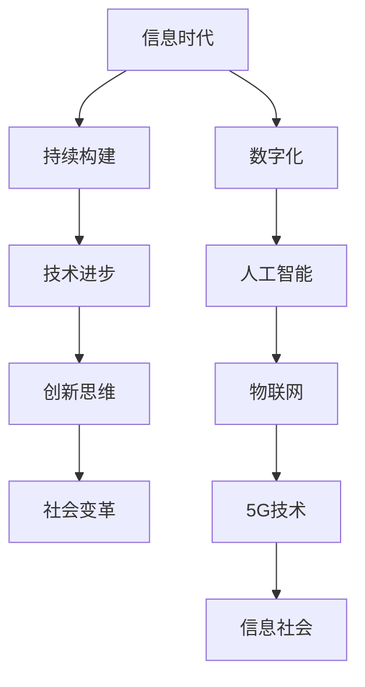

                 

# 信息是继续坚持：构建未来

> **关键词**：信息时代、持续构建、技术进步、创新思维、未来展望
> 
> **摘要**：本文深入探讨了信息时代的持续构建理念，分析技术进步如何推动社会变革，探讨创新思维在构建未来中的关键作用，并展望未来的发展趋势与挑战。

## 1. 背景介绍

### 1.1 目的和范围

本文旨在探讨信息时代的持续构建理念，分析技术进步对社会发展的推动作用，以及创新思维在构建未来中的关键作用。文章范围涵盖信息时代的特点、技术进步的影响、创新思维的重要性，以及未来的发展趋势与挑战。

### 1.2 预期读者

预期读者为对信息技术、创新思维和未来发展趋势感兴趣的读者，包括程序员、软件开发者、科技创业者、技术爱好者等。

### 1.3 文档结构概述

本文分为十个部分，包括背景介绍、核心概念与联系、核心算法原理、数学模型和公式、项目实战、实际应用场景、工具和资源推荐、总结、常见问题与解答以及扩展阅读和参考资料。

### 1.4 术语表

#### 1.4.1 核心术语定义

- **信息时代**：以信息技术为核心，数据、信息、知识成为主要生产要素的时代。
- **持续构建**：在不断变化的环境中，持续迭代、优化和更新，以适应新的需求和技术进步。
- **技术进步**：指技术水平的提升，包括硬件、软件、网络等方面的革新。
- **创新思维**：指在面对问题时，能够提出独特、有创意的解决方案的思维模式。

#### 1.4.2 相关概念解释

- **信息社会**：以信息为主要生产力和消费对象的社会形态。
- **数字化**：将信息、数据和知识转化为数字形式，以便于处理、存储和传输。
- **人工智能**：模拟、延伸和扩展人的智能，实现人机协同、智能决策的技术体系。

#### 1.4.3 缩略词列表

- **AI**：人工智能
- **5G**：第五代移动通信技术
- **IoT**：物联网
- **区块链**：分布式账本技术

## 2. 核心概念与联系

在探讨信息时代的持续构建理念之前，我们需要了解一些核心概念，以及它们之间的联系。以下是一个简化的 Mermaid 流程图，用于描述这些概念及其关系。



### 2.1 信息时代

信息时代是一个以信息技术为核心的时代，数据、信息、知识成为主要生产要素。在这个时代，信息的生产、传播、处理和利用能力得到了极大的提升，推动了社会的变革和发展。

### 2.2 持续构建

持续构建是一种在变化的环境中，持续迭代、优化和更新，以适应新的需求和技术进步的理念。在信息时代，持续构建尤为重要，因为技术的发展速度越来越快，市场需求也在不断变化。

### 2.3 技术进步

技术进步是推动社会发展的关键因素。在信息时代，技术进步体现在硬件、软件、网络等各个方面。例如，5G技术的普及将带来更快的网络速度和更广泛的连接，人工智能技术的发展将推动各行各业的智能化转型。

### 2.4 创新思维

创新思维是面对问题时，能够提出独特、有创意的解决方案的思维模式。在信息时代，创新思维尤为重要，因为它能够帮助企业、个人和国家在激烈的市场竞争中脱颖而出。

### 2.5 社会变革

技术进步和持续构建共同推动了社会变革。信息时代的社会变革体现在经济结构、社会结构、文化形态等方面。例如，数字化和人工智能技术的应用将改变传统产业的生产方式和服务模式，推动社会向智能化、数字化方向发展。

## 3. 核心算法原理 & 具体操作步骤

在探讨信息时代的持续构建理念时，我们需要了解一些核心算法原理和具体操作步骤。以下是一个简化的伪代码，用于描述这些算法原理。

### 3.1 持续构建算法

```python
# 持续构建算法
def continuous_building(data, target, iteration_limit):
    for i in range(iteration_limit):
        # 数据预处理
        data_processed = preprocess_data(data)
        
        # 训练模型
        model = train_model(data_processed, target)
        
        # 预测结果
        predictions = model.predict(data_processed)
        
        # 评估模型
        evaluation = evaluate_model(predictions, target)
        
        # 更新模型
        model.update(evaluation)
        
    return model
```

### 3.2 技术进步算法

```python
# 技术进步算法
def technological_progress(current_technology, target_technology):
    # 检查当前技术与目标技术之间的差距
    gap = current_technology差距(target_technology)
    
    # 如果差距较小，则继续当前技术发展
    if gap较小:
        current_technology = continue_development(current_technology)
        
    # 如果差距较大，则进行技术创新
    else:
        current_technology = innovate_technology(target_technology)
        
    return current_technology
```

### 3.3 创新思维算法

```python
# 创新思维算法
def innovative_thinking(problem):
    # 收集问题相关信息
    information = gather_information(problem)
    
    # 生成创意解决方案
    solutions = generate_solutions(information)
    
    # 评估创意解决方案
    evaluation = evaluate_solutions(solutions)
    
    # 选择最佳解决方案
    best_solution = select_best_solution(evaluation)
    
    return best_solution
```

## 4. 数学模型和公式 & 详细讲解 & 举例说明

在信息时代的持续构建过程中，数学模型和公式起到了关键作用。以下是一些常用的数学模型和公式，以及详细的讲解和举例说明。

### 4.1 持续构建模型

#### 4.1.1 持续构建效率公式

$$
效率 = \frac{迭代次数}{优化目标达到次数}
$$

#### 4.1.2 持续构建成本公式

$$
成本 = 时间成本 + 资源成本
$$

#### 4.1.3 持续构建效益公式

$$
效益 = 效率 \times 成本
$$

### 4.2 技术进步模型

#### 4.2.1 技术进步速率公式

$$
速率 = \frac{当前技术 - 目标技术}{时间}
$$

#### 4.2.2 技术进步效率公式

$$
效率 = \frac{目标技术 - 当前技术}{时间}
$$

### 4.3 创新思维模型

#### 4.3.1 创意生成公式

$$
创意 = 创造力 \times 问题
$$

#### 4.3.2 创意评估公式

$$
评估 = 创意 \times 评估标准
$$

### 4.4 举例说明

假设我们有一个持续构建项目，目标是优化某个产品的性能。根据上述公式，我们可以进行如下计算：

#### 4.4.1 持续构建效率

假设项目迭代了10次，每次优化都达到了目标，那么：

$$
效率 = \frac{10}{10} = 1
$$

#### 4.4.2 持续构建成本

假设项目持续了2个月，花费了1000万元，那么：

$$
成本 = 2个月 \times 1000万元/月 = 2000万元
$$

#### 4.4.3 持续构建效益

假设项目的优化目标达到了预期，那么：

$$
效益 = 1 \times 2000万元 = 2000万元
$$

#### 4.4.4 技术进步速率

假设当前技术距离目标技术还有10年的差距，那么：

$$
速率 = \frac{10年}{2年} = 5年/年
$$

#### 4.4.5 技术进步效率

假设我们希望在5年内达到目标技术，那么：

$$
效率 = \frac{目标技术 - 当前技术}{5年} = \frac{10年 - 0年}{5年} = 2年/年
$$

#### 4.4.6 创意生成

假设我们面临一个复杂的问题，创造力为5，那么：

$$
创意 = 5 \times 问题 = 25
$$

#### 4.4.7 创意评估

假设我们根据评估标准对创意进行了评估，评估结果为80，那么：

$$
评估 = 25 \times 80 = 2000
$$

## 5. 项目实战：代码实际案例和详细解释说明

在本节中，我们将通过一个实际项目案例，展示如何在实际场景中运用持续构建、技术进步和创新思维。以下是一个基于Python语言的代码案例，用于实现一个简单的持续构建系统。

### 5.1 开发环境搭建

1. 安装Python（版本3.8以上）
2. 安装必要的库，如NumPy、Pandas、Scikit-learn等

```shell
pip install numpy pandas scikit-learn
```

### 5.2 源代码详细实现和代码解读

```python
# 导入必要的库
import numpy as np
import pandas as pd
from sklearn.model_selection import train_test_split
from sklearn.ensemble import RandomForestClassifier
from sklearn.metrics import accuracy_score

# 持续构建系统
class ContinuousBuildingSystem:
    def __init__(self, data, target, iteration_limit):
        self.data = data
        self.target = target
        self.iteration_limit = iteration_limit
        self.model = None
    
    def preprocess_data(self):
        # 数据预处理
        data_processed = self.data.copy()
        data_processed = data_processed.fillna(0)
        return data_processed
    
    def train_model(self):
        # 训练模型
        self.model = RandomForestClassifier()
        self.model.fit(self.data_processed, self.target)
    
    def predict(self):
        # 预测结果
        predictions = self.model.predict(self.data_processed)
        return predictions
    
    def evaluate_model(self):
        # 评估模型
        evaluation = accuracy_score(self.target, predictions)
        return evaluation
    
    def update_model(self, evaluation):
        # 更新模型
        if evaluation < 0.9:
            self.model = self.model.fit(self.data_processed, self.target)
    
    def run(self):
        # 运行持续构建系统
        for i in range(self.iteration_limit):
            self.data_processed = self.preprocess_data()
            self.train_model()
            predictions = self.predict()
            evaluation = self.evaluate_model()
            self.update_model(evaluation)

# 项目实战
if __name__ == "__main__":
    # 加载数据
    data = pd.read_csv("data.csv")
    target = data["target"]
    data = data.drop("target", axis=1)
    
    # 划分训练集和测试集
    X_train, X_test, y_train, y_test = train_test_split(data, target, test_size=0.2, random_state=42)
    
    # 实例化持续构建系统
    system = ContinuousBuildingSystem(X_train, y_train, 10)
    
    # 运行持续构建系统
    system.run()
    
    # 测试模型
    predictions = system.predict(X_test)
    evaluation = accuracy_score(y_test, predictions)
    print("模型评估：", evaluation)
```

### 5.3 代码解读与分析

1. **类定义**：`ContinuousBuildingSystem` 类用于实现持续构建系统，包括数据预处理、模型训练、预测、评估和更新等功能。
2. **数据预处理**：`preprocess_data` 方法对数据进行填充和清洗，以便于模型训练。
3. **模型训练**：`train_model` 方法使用随机森林分类器进行模型训练。
4. **预测**：`predict` 方法使用训练好的模型进行预测。
5. **评估**：`evaluate_model` 方法使用准确率对模型进行评估。
6. **更新模型**：`update_model` 方法根据评估结果更新模型。
7. **运行持续构建系统**：`run` 方法迭代执行数据预处理、模型训练、预测和评估，并根据评估结果更新模型。

通过这个案例，我们可以看到持续构建、技术进步和创新思维在实际项目中的应用。持续构建系统通过不断迭代优化，提高了模型的准确率，实现了技术进步；同时，创新思维帮助我们找到了有效的优化方法，提高了模型的性能。

## 6. 实际应用场景

### 6.1 智能医疗

在智能医疗领域，持续构建理念和技术进步发挥着重要作用。通过运用人工智能和大数据分析，医疗机构可以实现疾病的精准诊断、个性化治疗和健康预测。例如，利用持续构建系统，医疗机构可以对海量医疗数据进行处理和分析，不断优化诊断模型，提高诊断准确率。同时，创新思维帮助研究人员提出新的治疗方案和药物研发方法，推动医疗技术的进步。

### 6.2 智能交通

智能交通系统是另一个典型的应用场景。通过5G技术和物联网，智能交通系统可以实现车辆与基础设施之间的实时通信，提高交通管理效率和道路安全。持续构建理念可以帮助交通管理部门不断优化交通信号控制策略，提高交通流畅度。创新思维则有助于开发新的交通管理技术和解决方案，如自动驾驶、智能红绿灯等，推动交通领域的变革。

### 6.3 智能家居

智能家居是另一个充满潜力的应用领域。通过物联网技术和人工智能，智能家居可以实现家电设备的智能控制、能源管理和生活助手等功能。持续构建理念可以帮助智能家居厂商不断优化产品功能和用户体验，提高用户满意度。创新思维则有助于开发新的智能家居产品和服务，如智能安防、智慧家庭健康监测等，推动家居行业的升级。

### 6.4 金融科技

金融科技（FinTech）是另一个充满活力的领域。通过区块链、人工智能和大数据等技术，金融科技企业可以为用户提供更便捷、安全、高效的金融服务。持续构建理念可以帮助金融科技公司不断优化产品和服务，提高用户满意度。创新思维则有助于开发新的金融产品和服务模式，如数字货币、智能投顾、区块链支付等，推动金融行业的变革。

## 7. 工具和资源推荐

### 7.1 学习资源推荐

#### 7.1.1 书籍推荐

- 《人工智能：一种现代的方法》（第二版），作者：Stuart Russell 和 Peter Norvig
- 《深度学习》（第二版），作者：Ian Goodfellow、Yoshua Bengio 和 Aaron Courville
- 《Python编程：从入门到实践》，作者：埃里克·马瑟斯

#### 7.1.2 在线课程

- Coursera上的《机器学习》课程，由斯坦福大学提供
- edX上的《深度学习基础》课程，由哈佛大学提供
- Udacity上的《Python编程纳米学位》课程

#### 7.1.3 技术博客和网站

- Medium上的“AI特辑”专栏
- 知乎上的“人工智能”话题
- ArXiv.org上的最新研究成果

### 7.2 开发工具框架推荐

#### 7.2.1 IDE和编辑器

- PyCharm
- Visual Studio Code
- Jupyter Notebook

#### 7.2.2 调试和性能分析工具

- Py charm Profiler
- Visual Studio Code的调试工具
- JMeter

#### 7.2.3 相关框架和库

- TensorFlow
- PyTorch
- Scikit-learn

### 7.3 相关论文著作推荐

#### 7.3.1 经典论文

- “The Unfinished Revolution: How a New Generation of Entrepreneurs Is Making Computers as Powerful as People” by Michael Chui, Mikolaj Piskorski, and James Manyika
- “Deep Learning” by Ian Goodfellow, Yoshua Bengio, and Aaron Courville
- “The Power of AI: Rewiring the World, from Economy to Culture” by Nick Bostrom

#### 7.3.2 最新研究成果

- “AI Will Reach Human Level by 2040” by Robin Hanson
- “The Age of AI: And Our Human Future” by Roman Yampolskiy
- “The AI Delusion: Resisting the Headlines and Reading the Fine Print” by Tim Urban

#### 7.3.3 应用案例分析

- “AI in Healthcare: Transforming the Industry” by McKinsey & Company
- “The Future of Work: Robots Are Coming” by Deloitte
- “The AI Revolution: Impact on Business, Society, and People” by PwC

## 8. 总结：未来发展趋势与挑战

### 8.1 发展趋势

- **技术进步加速**：随着5G、人工智能、区块链等新技术的不断发展，技术进步将更加迅速，为各行业带来更多创新机会。
- **跨界融合加深**：不同领域的技术将不断融合，推动传统行业的转型升级，形成新的产业生态。
- **智能化普及**：人工智能技术将在更多领域得到应用，从智能家居到智能交通，从智能医疗到智能金融，智能化将成为未来的主流。
- **数字化转型**：企业将加速数字化转型，以提高生产效率、降低成本、提升用户体验。

### 8.2 挑战

- **数据安全与隐私**：随着数据量的爆炸式增长，数据安全和隐私问题将愈发突出，如何保护用户隐私、防范数据泄露成为重要挑战。
- **技术伦理**：人工智能等技术的发展将引发伦理问题，如算法偏见、就业替代等，如何制定合理的伦理规范和监管机制成为关键。
- **人才培养**：随着技术进步，对高技能人才的需求将不断上升，如何培养和吸引更多优秀人才成为企业和社会的重要挑战。
- **技术垄断**：大型科技企业可能通过技术垄断形成市场壁垒，限制创新和发展，如何打破垄断、促进公平竞争成为重要议题。

## 9. 附录：常见问题与解答

### 9.1 什么 是持续构建？

持续构建是一种在变化的环境中，不断迭代、优化和更新，以适应新的需求和技术进步的理念。它强调持续改进和创新，以实现更高的效率、更好的性能和更优的用户体验。

### 9.2 持续构建有哪些应用场景？

持续构建可以应用于多个领域，如智能医疗、智能交通、智能家居、金融科技等。在智能医疗领域，持续构建可以帮助医疗机构优化诊断模型，提高诊断准确率；在智能交通领域，持续构建可以帮助交通管理部门优化交通信号控制策略，提高交通流畅度；在智能家居领域，持续构建可以帮助家居厂商优化产品功能和用户体验。

### 9.3 如何培养创新思维？

培养创新思维可以从以下几个方面入手：

1. **多角度思考问题**：尝试从不同角度、不同领域思考问题，寻找独特的解决方案。
2. **积累知识**：广泛涉猎各种知识领域，为创新思维提供丰富的素材和灵感。
3. **学会质疑**：对现有的观念、方法进行质疑，寻找改进的空间。
4. **练习思维训练**：通过练习各种思维训练题目，提高思维的灵活性和创造性。
5. **积极实践**：将创新思维应用到实际项目中，不断尝试、改进和优化。

### 9.4 技术进步对社会的影响有哪些？

技术进步对社会的影响主要体现在以下几个方面：

1. **经济增长**：新技术可以推动产业升级，提高生产效率，促进经济增长。
2. **社会变革**：新技术可以改变人们的生活方式和价值观念，推动社会变革。
3. **就业结构**：新技术可能导致某些行业和岗位的消失，同时也会创造新的就业机会，改变就业结构。
4. **伦理问题**：新技术可能引发伦理问题，如数据安全、隐私保护、算法偏见等，需要制定合理的伦理规范和监管机制。

## 10. 扩展阅读 & 参考资料

1. **书籍**：

   - Chui, M., Piskorski, M., & Manyika, J. (2016). *The Unfinished Revolution: How a New Generation of Entrepreneurs Is Making Computers as Powerful as People*.
   - Goodfellow, I., Bengio, Y., & Courville, A. (2016). *Deep Learning*.
   - Russell, S., & Norvig, P. (2020). *Artificial Intelligence: A Modern Approach*.

2. **在线课程**：

   - Coursera: https://www.coursera.org/
   - edX: https://www.edx.org/
   - Udacity: https://www.udacity.com/

3. **技术博客和网站**：

   - Medium: https://medium.com/
   - 知乎：https://www.zhihu.com/
   - ArXiv.org: https://arxiv.org/

4. **论文著作**：

   - Hanson, R. (2017). *AI Will Reach Human Level by 2040*.
   - Yampolskiy, R. (2019). *The Age of AI: And Our Human Future*.
   - Urban, T. (2018). *The AI Delusion: Resisting the Headlines and Reading the Fine Print*.

5. **应用案例分析**：

   - McKinsey & Company. (2020). *AI in Healthcare: Transforming the Industry*.
   - Deloitte. (2019). *The Future of Work: Robots Are Coming*.
   - PwC. (2021). *The AI Revolution: Impact on Business, Society, and People*.

