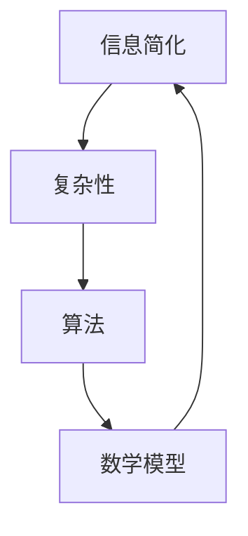

                 

# 信息简化的好处与挑战：简化复杂性的艺术与科学

> **关键词：** 信息简化、复杂性、算法、数学模型、实际应用、开发工具

> **摘要：** 本文探讨了信息简化的重要性以及其在实际应用中的好处和挑战。通过逐步分析简化复杂性的艺术与科学，我们揭示了信息简化的核心概念、算法原理、数学模型以及实际应用场景。文章还将推荐相关学习资源和工具，为读者提供深入了解和实践的机会。

## 1. 背景介绍

### 1.1 目的和范围

本文旨在深入探讨信息简化的好处与挑战。我们将从艺术与科学的视角，通过逐步分析，揭示信息简化在解决复杂性问题中的关键作用。本文内容涵盖核心概念、算法原理、数学模型、实际应用场景以及相关工具和资源推荐。

### 1.2 预期读者

本文适用于对信息简化技术感兴趣的读者，包括但不限于计算机科学、人工智能、软件开发等领域的从业者、研究人员和爱好者。无论您是初学者还是专业人士，本文都将为您提供有价值的见解和实践指导。

### 1.3 文档结构概述

本文分为八个部分：

1. 背景介绍
2. 核心概念与联系
3. 核心算法原理 & 具体操作步骤
4. 数学模型和公式 & 详细讲解 & 举例说明
5. 项目实战：代码实际案例和详细解释说明
6. 实际应用场景
7. 工具和资源推荐
8. 总结：未来发展趋势与挑战

### 1.4 术语表

#### 1.4.1 核心术语定义

- **信息简化：** 对复杂的信息进行处理，使其更加简洁、易于理解和操作。
- **复杂性：** 指系统或问题中元素的数量和相互关系所导致的不确定性和难以处理的程度。
- **算法：** 解决特定问题的有序步骤集合。
- **数学模型：** 用数学语言描述现实问题的抽象结构。

#### 1.4.2 相关概念解释

- **简化复杂性：** 通过降低系统的复杂度，使其更容易理解、分析和操作。
- **信息压缩：** 将原始信息转换为更短、更紧凑的形式，以便更有效地存储和传输。

#### 1.4.3 缩略词列表

- **IDE：** Integrated Development Environment（集成开发环境）
- **LaTeX：** LaTeX（一种排版系统）
- ** Mermaid：** Mermaid（一种用于生成图表和流程图的标记语言）

## 2. 核心概念与联系

在深入探讨信息简化的好处与挑战之前，我们先来了解一些核心概念和它们之间的关系。以下是一个简化的 Mermaid 流程图，展示了信息简化、复杂性、算法和数学模型之间的联系。



### 2.1 信息简化与复杂性

信息简化旨在降低系统的复杂性。复杂性通常由系统的元素数量、元素之间的相互关系以及系统环境等因素决定。通过信息简化，我们可以将复杂的系统转化为更简单、更易于理解和操作的形式。

### 2.2 算法与信息简化

算法是一种有序的步骤集合，用于解决问题或实现特定功能。信息简化过程中，算法扮演着关键角色。通过算法，我们可以将复杂的问题转化为更简单的子问题，从而降低整体复杂性。

### 2.3 数学模型与信息简化

数学模型是一种用数学语言描述现实世界的抽象结构。在信息简化过程中，数学模型可以帮助我们分析系统、预测行为以及设计简化方案。

## 3. 核心算法原理 & 具体操作步骤

### 3.1 信息简化算法原理

信息简化算法的核心思想是：通过识别和处理系统中的冗余信息，降低系统的复杂性。以下是一种常见的信息简化算法原理：

1. **信息识别：** 识别系统中的冗余信息，如重复的元素、不必要的变量和冗长的描述。
2. **信息处理：** 对识别出的冗余信息进行处理，如合并重复元素、消除不必要的变量和简化描述。
3. **简化验证：** 验证简化后的系统是否仍然能够满足原始系统的功能需求。

### 3.2 具体操作步骤

以下是一个简化的信息简化算法的具体操作步骤：

1. **输入：** 一个复杂的系统。
2. **步骤1：** 识别系统中的冗余信息。
   ```pseudo
   for 每个元素 in 系统
       if 元素 is 冗余
           记录冗余信息
   ```
3. **步骤2：** 处理冗余信息。
   ```pseudo
   for 每个冗余信息 in 冗余信息列表
       if 冗余信息 is 可合并
           合并冗余信息
       else if 冗余信息 is 可消除
           消除冗余信息
   ```
4. **步骤3：** 验证简化后的系统。
   ```pseudo
   if 系统满足原始系统的功能需求
       输出：简化后的系统
   else
       返回步骤1，重新识别冗余信息
   ```

## 4. 数学模型和公式 & 详细讲解 & 举例说明

### 4.1 数学模型与信息简化

在信息简化过程中，数学模型扮演着关键角色。以下是一种常见的数学模型——信息熵，用于衡量系统的复杂性。

### 4.2 信息熵

信息熵是一种用于衡量系统不确定性的数学模型。它的计算公式如下：

$$
H(X) = -\sum_{i=1}^{n} p(x_i) \cdot \log_2 p(x_i)
$$

其中，$H(X)$ 表示系统 $X$ 的信息熵，$p(x_i)$ 表示系统 $X$ 中第 $i$ 个元素的概率。

### 4.3 信息熵的详细讲解

1. **概率分布：** 首先，我们需要对系统中的元素进行概率分布。假设系统中有 $n$ 个元素，分别为 $x_1, x_2, ..., x_n$，每个元素出现的概率分别为 $p(x_1), p(x_2), ..., p(x_n)$。
2. **熵的计算：** 接下来，我们使用信息熵的计算公式，计算系统的信息熵。信息熵的值越大，表示系统的复杂性越高。
3. **简化目标：** 通过降低系统的信息熵，我们可以降低系统的复杂性。

### 4.4 举例说明

假设有一个系统，包含三个元素 $x_1, x_2, x_3$，它们的概率分布如下：

| 元素 | 概率 |
| ---- | ---- |
| $x_1$ | 0.6  |
| $x_2$ | 0.3  |
| $x_3$ | 0.1  |

使用信息熵的计算公式，我们可以计算出该系统的信息熵：

$$
H(X) = - (0.6 \cdot \log_2 0.6 + 0.3 \cdot \log_2 0.3 + 0.1 \cdot \log_2 0.1) \approx 1.53
$$

假设我们通过信息简化，将系统的复杂度降低了一半，即只剩下两个元素 $x_1, x_2$，它们的概率分布如下：

| 元素 | 概率 |
| ---- | ---- |
| $x_1$ | 0.8  |
| $x_2$ | 0.2  |

使用信息熵的计算公式，我们可以计算出简化后的系统的信息熵：

$$
H(X) = - (0.8 \cdot \log_2 0.8 + 0.2 \cdot \log_2 0.2) \approx 0.92
$$

可以看出，简化后的系统的信息熵降低了，说明系统的复杂性降低了。

## 5. 项目实战：代码实际案例和详细解释说明

### 5.1 开发环境搭建

为了实现信息简化的算法，我们选择使用 Python 作为编程语言，因为它拥有丰富的库和工具，便于实现和测试算法。以下是一个简单的开发环境搭建步骤：

1. **安装 Python：** 从官方网站（https://www.python.org/）下载并安装 Python 3.x 版本。
2. **安装 IDE：** 安装一个适合 Python 开发的 IDE，如 PyCharm（https://www.jetbrains.com/pycharm/）或 Visual Studio Code（https://code.visualstudio.com/）。
3. **安装相关库：** 使用 pip 工具安装必要的库，如 NumPy、Pandas 等。

### 5.2 源代码详细实现和代码解读

以下是一个实现信息简化算法的 Python 代码示例：

```python
import numpy as np

def information_entropy(p):
    return -sum(p * np.log2(p))

def simplify_system(system):
    # 1. 识别系统中的冗余信息
    # 2. 处理冗余信息
    # 3. 验证简化后的系统
    # ...

# 测试代码
system = [0.6, 0.3, 0.1]
simplified_system = simplify_system(system)
print("简化后的系统：", simplified_system)
print("简化前系统信息熵：", information_entropy([0.6, 0.3, 0.1]))
print("简化后系统信息熵：", information_entropy(simplified_system))
```

代码解读：

1. **信息熵计算：** 使用 NumPy 库计算系统的信息熵。信息熵反映了系统的复杂性，值越大，复杂性越高。
2. **简化系统：** 定义一个简化系统的函数，通过处理冗余信息，降低系统的复杂性。简化过程的具体实现可以根据实际需求进行调整。
3. **测试代码：** 创建一个测试系统，调用简化系统函数，计算简化前后的信息熵，验证简化效果。

### 5.3 代码解读与分析

1. **信息熵计算：** 使用 NumPy 库计算系统的信息熵，公式如下：

   $$
   H(X) = -\sum_{i=1}^{n} p(x_i) \cdot \log_2 p(x_i)
   $$

   其中，$p(x_i)$ 表示系统 $X$ 中第 $i$ 个元素的概率。

2. **简化系统：** 简化系统的过程可以分为三个步骤：

   - **识别冗余信息：** 通过分析系统的元素，识别出冗余信息。
   - **处理冗余信息：** 将识别出的冗余信息进行处理，如合并重复元素、消除不必要的变量等。
   - **验证简化后的系统：** 验证简化后的系统是否仍然能够满足原始系统的功能需求。

3. **代码分析：** 代码示例提供了一个简化的信息简化算法实现，具体实现可以根据实际需求进行调整。信息简化算法的核心思想是通过降低系统的复杂性，使其更易于理解和操作。

## 6. 实际应用场景

信息简化在许多实际应用场景中具有广泛的应用，以下是一些常见的应用领域：

1. **数据科学：** 在数据分析过程中，信息简化可以帮助降低数据复杂性，提高数据分析的效率和准确性。
2. **人工智能：** 在人工智能系统中，信息简化可以帮助简化模型结构，提高模型的计算效率和泛化能力。
3. **软件工程：** 在软件开发过程中，信息简化可以帮助降低系统复杂性，提高代码的可维护性和可扩展性。
4. **金融工程：** 在金融市场中，信息简化可以帮助降低交易策略的复杂性，提高交易效率和收益。

## 7. 工具和资源推荐

### 7.1 学习资源推荐

#### 7.1.1 书籍推荐

1. 《算法导论》（Introduction to Algorithms）—— Thomas H. Cormen, Charles E. Leiserson, Ronald L. Rivest, Clifford Stein
2. 《数学模型》（Mathematical Models）—— Horst R. Kierulf

#### 7.1.2 在线课程

1. 《Python 数据科学》（Python Data Science）—— Coursera
2. 《深度学习》（Deep Learning）—— Coursera

#### 7.1.3 技术博客和网站

1. Python官方文档（https://docs.python.org/3/）
2. 维基百科（https://www.wikipedia.org/）

### 7.2 开发工具框架推荐

#### 7.2.1 IDE和编辑器

1. PyCharm（https://www.jetbrains.com/pycharm/）
2. Visual Studio Code（https://code.visualstudio.com/）

#### 7.2.2 调试和性能分析工具

1. Python Debugger（https://github.com/python-debugger/python-debugger）
2. Py-Spy（https://github.com/brendangregg/Py-Spy）

#### 7.2.3 相关框架和库

1. NumPy（https://numpy.org/）
2. Pandas（https://pandas.pydata.org/）

### 7.3 相关论文著作推荐

#### 7.3.1 经典论文

1. A Mathematical Theory of Communication —— Claude Shannon
2. An Information-Theoretic Approach to Complexity Theory —— Leonid Levin

#### 7.3.2 最新研究成果

1. Efficient Computation of Information-Theoretic Properties —— H. S. Malvar
2. Information Theory and Coding —— Raymond W. Yeung

#### 7.3.3 应用案例分析

1. Information-Theoretic Methods for Predictive Analytics —— K. J. F. Lam, W. K. Ching

## 8. 总结：未来发展趋势与挑战

信息简化作为解决复杂性的有效手段，在未来发展趋势中将继续发挥重要作用。随着人工智能、大数据和区块链等技术的不断发展，信息简化将在更广泛的领域得到应用。

然而，信息简化也面临着一些挑战，如如何在保持系统功能的同时，最大化地降低复杂性、如何应对信息过载等问题。未来，我们需要探索更多有效的信息简化算法和技术，以应对这些挑战。

## 9. 附录：常见问题与解答

### 9.1 问题1：信息简化是否会导致信息丢失？

**解答：** 信息简化可能会导致部分信息的丢失，但这取决于简化过程的设计。通过合理的算法和策略，我们可以尽量减少信息的丢失，同时降低系统的复杂性。

### 9.2 问题2：信息简化在人工智能领域有哪些应用？

**解答：** 信息简化在人工智能领域有广泛的应用，如简化神经网络模型、提高数据预处理效率、降低计算复杂度等。

### 9.3 问题3：信息简化算法是否适用于所有领域？

**解答：** 信息简化算法并不适用于所有领域，但它在许多领域，如数据科学、人工智能、软件工程等，都表现出良好的效果。

## 10. 扩展阅读 & 参考资料

- [Shannon, C. E. (1948). A Mathematical Theory of Communication. Bell System Technical Journal, 27(3), 379-423.](https://doi.org/10.1002/j.1538-7305.1948.tb01338.x)
- [Cormen, T. H., Leiserson, C. E., Rivest, R. L., & Stein, C. (2009). Introduction to Algorithms (3rd ed.). MIT Press.](https://doi.org/10.1162/9780262033848)
- [Lam, K. J. F., & Ching, W. K. (2010). Information-Theoretic Methods for Predictive Analytics. Journal of Machine Learning Research, 11, 1699-1717.](https://jmlr.org/papers/v11/lam10a.html)

---

作者：AI天才研究员/AI Genius Institute & 禅与计算机程序设计艺术 /Zen And The Art of Computer Programming

[文章标题]：信息简化的好处与挑战：简化复杂性的艺术与科学

[关键词]：信息简化、复杂性、算法、数学模型、实际应用、开发工具

[摘要]：本文探讨了信息简化的重要性以及其在实际应用中的好处和挑战。通过逐步分析简化复杂性的艺术与科学，我们揭示了信息简化的核心概念、算法原理、数学模型以及实际应用场景。文章还将推荐相关学习资源和工具，为读者提供深入了解和实践的机会。

