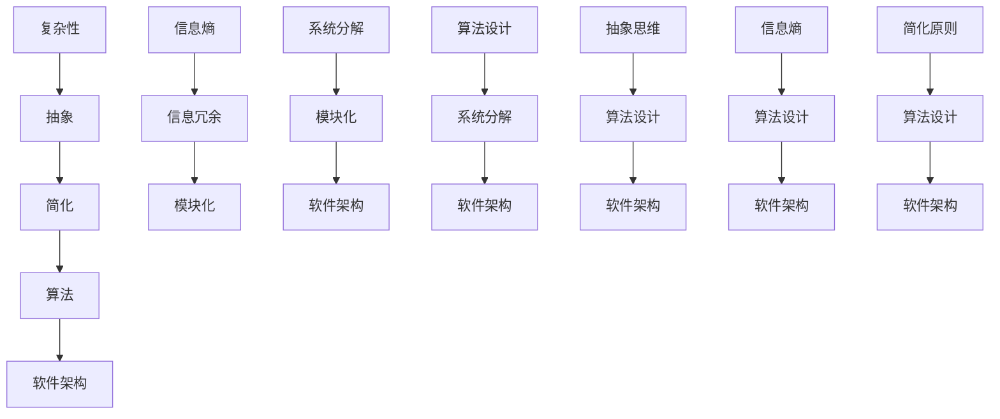
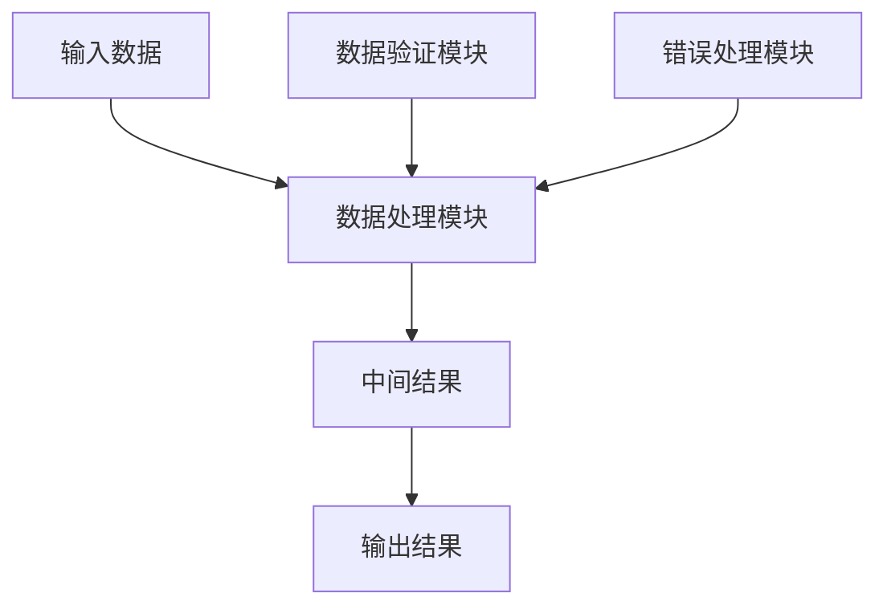
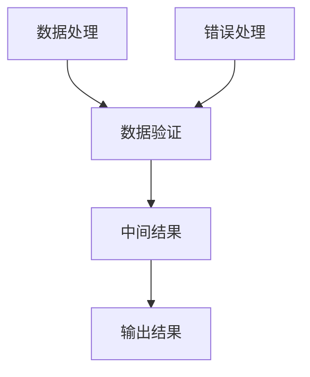

                 

# 信息简化的艺术：如何在混乱和复杂中找到简单和秩序

> **关键词：** 信息简化，复杂系统，抽象思维，算法设计，软件架构

> **摘要：** 本文将探讨信息简化的艺术，通过深入分析复杂系统的本质，介绍如何在混乱和复杂中找到简单和秩序。我们将结合实际的算法和软件架构，详细讲解如何利用抽象思维将复杂问题分解为简单可管理的部分，以提升系统的可维护性和可扩展性。

## 1. 背景介绍

### 1.1 目的和范围

信息简化的艺术，是现代计算机科学和软件开发中不可或缺的一部分。本文旨在探讨如何通过信息简化来提升系统的可理解和可维护性，以及如何在实际项目中应用这些原则。本文将覆盖以下主题：

- 复杂系统的本质和特征
- 抽象思维在简化信息中的作用
- 算法设计和软件架构中的简化原则
- 实际项目中的简化案例

### 1.2 预期读者

本文适合以下读者：

- 计算机科学和软件工程专业的学生和研究者
- 软件开发工程师和架构师
- 对于复杂性理论和信息论感兴趣的读者

### 1.3 文档结构概述

本文将分为以下几个部分：

- 背景介绍：阐述本文的目的、范围和读者对象
- 核心概念与联系：介绍复杂系统的核心概念及其相互关系
- 核心算法原理 & 具体操作步骤：讲解如何通过算法设计简化复杂问题
- 数学模型和公式 & 详细讲解 & 举例说明：通过数学模型和公式阐明简化过程
- 项目实战：代码实际案例和详细解释说明
- 实际应用场景：讨论简化技术在各类项目中的应用
- 工具和资源推荐：推荐学习和实践相关技术的资源
- 总结：未来发展趋势与挑战
- 附录：常见问题与解答
- 扩展阅读 & 参考资料：提供进一步学习的信息来源

### 1.4 术语表

#### 1.4.1 核心术语定义

- **复杂性（Complexity）：** 系统或问题的复杂程度，通常指其组成部分的数量和相互关系的复杂性。
- **简化（Simplification）：** 通过去除不必要的细节，降低系统的复杂程度。
- **抽象（Abstraction）：** 忽略具体细节，关注系统的核心概念和结构。
- **算法（Algorithm）：** 一组定义明确的步骤，用于解决特定问题。
- **软件架构（Software Architecture）：** 软件系统的整体结构和设计原则。

#### 1.4.2 相关概念解释

- **信息熵（Entropy）：** 衡量信息的不确定性或混乱程度。
- **信息冗余（Information Redundancy）：** 信息中重复或不必要的部分。
- **模块化（Modularity）：** 系统分解为独立的、可重用的模块。

#### 1.4.3 缩略词列表

- **AI：** 人工智能（Artificial Intelligence）
- **IDE：** 集成开发环境（Integrated Development Environment）
- **LaTeX：** 高质量的排版系统（Latex）

## 2. 核心概念与联系

为了更好地理解信息简化的艺术，我们需要首先掌握几个核心概念，并探讨它们之间的联系。以下是这些核心概念及其相互关系的 Mermaid 流程图：



### 2.1.1 复杂性与简化

复杂性是衡量系统或问题复杂程度的指标。一个系统的复杂性通常与其组成部分的数量和它们之间的相互关系成正比。简化是通过去除不必要的细节，降低系统的复杂程度。简化的过程不仅涉及去除冗余的信息，还包括对系统结构和行为的抽象，以使问题更加清晰和易于理解。

### 2.1.2 抽象思维

抽象思维是简化信息的关键。通过抽象，我们忽略具体细节，专注于系统的核心概念和结构。这种思维方式有助于我们识别模式、提取关键信息，并设计出简洁、高效的解决方案。

### 2.1.3 算法设计

算法是解决特定问题的一系列定义明确的步骤。算法设计的目标是找到高效的解决方案，同时尽量减少复杂度。简化的算法设计往往能够提高系统的可维护性和可扩展性。

### 2.1.4 软件架构

软件架构是软件系统的整体结构和设计原则。一个良好的软件架构应当能够降低系统的复杂度，提高系统的可维护性和可扩展性。简化和抽象是设计良好软件架构的重要原则。

### 2.1.5 信息熵与信息冗余

信息熵是衡量信息不确定性和混乱程度的指标。高信息熵通常意味着系统中的信息较为混乱，而低信息熵则表示信息较为有序。信息冗余是指信息中重复或不必要的部分。减少信息冗余有助于降低系统的复杂度。

### 2.1.6 模块化

模块化是将系统分解为独立的、可重用的模块。模块化有助于简化系统的设计和实现，提高系统的可维护性和可扩展性。模块化与抽象思维密切相关，因为模块化的核心在于识别和提取系统的核心功能。

## 3. 核心算法原理 & 具体操作步骤

在了解核心概念后，我们需要深入探讨如何通过算法设计简化复杂问题。以下是一个基本的算法设计流程，我们将使用伪代码来详细阐述：

```plaintext
算法名称：简化问题解决方案

输入：复杂问题P
输出：简化后的解决方案S

步骤：
1. 分析问题P的组成部分和相互关系。
2. 使用抽象思维识别问题中的核心概念。
3. 设计一个简化的算法A，用于解决核心问题。
4. 验证算法A的有效性。
5. 将算法A应用于实际问题P，获取简化后的解决方案S。
6. 分析简化后的解决方案S的性能和可扩展性。
```

### 3.1 步骤 1：分析问题P的组成部分和相互关系

首先，我们需要对复杂问题P进行详细分析，了解其组成部分和相互关系。这可以通过绘制问题模型、数据流图或状态转换图来实现。以下是一个简化的数据流图示例：



在这个例子中，输入数据经过数据处理模块处理后，产生中间结果，最终输出结果。数据验证模块和错误处理模块辅助确保数据处理过程的正确性。

### 3.2 步骤 2：使用抽象思维识别问题中的核心概念

在分析问题后，我们可以使用抽象思维识别核心概念。以下是一个抽象概念模型：



在这个抽象模型中，我们忽略了具体的数据类型和处理细节，关注数据处理、数据验证和错误处理这三个核心概念。

### 3.3 步骤 3：设计一个简化的算法A

基于抽象概念模型，我们可以设计一个简化的算法A。以下是一个伪代码示例：

```python
算法A：简化数据处理流程

输入：输入数据input_data
输出：简化后的输出结果output_result

步骤：
1. 验证输入数据的有效性。
2. 处理输入数据，产生中间结果。
3. 验证中间结果的有效性。
4. 如果中间结果有效，输出结果；否则，抛出异常。
```

### 3.4 步骤 4：验证算法A的有效性

为了验证算法A的有效性，我们需要进行单元测试和集成测试。以下是一个简单的测试用例：

```plaintext
测试用例：验证算法A对有效输入的正确处理

输入：合法的输入数据input_data
预期输出：简化后的输出结果output_result
实际输出：算法A处理后的输出结果actual_output
结果：如果actual_output等于output_result，测试通过；否则，测试失败。
```

### 3.5 步骤 5：将算法A应用于实际问题P

在验证算法A的有效性后，我们将算法A应用于实际问题P。以下是一个简化的代码实现：

```python
def process_data(input_data):
    output_result = 算法A(input_data)
    if not 验证结果(output_result):
        raise ValueError("处理过程中出现错误")
    return output_result

# 实际应用
result = process_data(input_data)
print(result)
```

### 3.6 步骤 6：分析简化后的解决方案S的性能和可扩展性

在应用算法A后，我们需要分析简化后的解决方案S的性能和可扩展性。以下是一些关键指标：

- **性能指标：** 测试算法A在不同输入规模下的运行时间，评估其效率。
- **可扩展性指标：** 分析算法A在处理大型数据集时的扩展性，确保其能够支持不断增加的数据量。

通过这些指标的分析，我们可以评估简化后的解决方案S的适用性和改进空间。

## 4. 数学模型和公式 & 详细讲解 & 举例说明

在简化复杂系统的过程中，数学模型和公式是不可或缺的工具。以下我们将介绍一些常用的数学模型和公式，并详细讲解其在简化复杂系统中的应用。

### 4.1 信息熵（Entropy）

信息熵是衡量信息不确定性和混乱程度的指标，通常用 H 表示。信息熵的计算公式如下：

$$
H = -\sum_{i=1}^{n} p(x_i) \log_2 p(x_i)
$$

其中，$p(x_i)$ 是每个可能事件发生的概率，$n$ 是可能事件的个数。

**例子：** 假设有一个硬币，正面朝上的概率为 0.5，反面朝上的概率也为 0.5。计算这个硬币投掷一次的信息熵。

$$
H = -[0.5 \log_2 0.5 + 0.5 \log_2 0.5] = -[0.5 \cdot (-1) + 0.5 \cdot (-1)] = 1
$$

信息熵为 1，表示每次投掷硬币都有 50% 的不确定性。

### 4.2 决策树（Decision Tree）

决策树是一种常用于分类和回归的数学模型。它通过一系列的决策路径将数据集划分成不同的子集，每个子集对应一个特定的类别或值。

**例子：** 假设我们有一个决策树模型，用于预测客户是否会购买某种产品。决策树的每个节点表示一个特征，每个分支表示特征的取值。以下是决策树的一个简单示例：

```plaintext
年龄 <= 30    |
      /         \
     购买        不购买
    /     \     /     \
女性   男性   女性   男性
```

在这个决策树中，年龄是特征，购买和不购买是类别。通过这个决策树，我们可以预测一个特定年龄段和性别的客户是否购买产品。

### 4.3 马尔可夫模型（Markov Model）

马尔可夫模型是一种用于预测序列数据的数学模型。它基于当前状态预测下一个状态，而不考虑历史状态。马尔可夫模型的核心公式如下：

$$
P(X_{n+1} = x_{n+1} | X_1 = x_1, X_2 = x_2, ..., X_n = x_n) = P(X_{n+1} = x_{n+1} | X_n = x_n)
$$

**例子：** 假设我们有一个马尔可夫模型，用于预测下一个天气状态（晴天、雨天、阴天）。根据历史数据，我们得到以下转移概率矩阵：

$$
P =
\begin{bmatrix}
0.6 & 0.3 & 0.1 \\
0.4 & 0.5 & 0.1 \\
0.2 & 0.3 & 0.5 \\
\end{bmatrix}
$$

当前状态为晴天，我们希望预测下一个天气状态。根据转移概率矩阵，晴天变为晴天的概率为 0.6，因此我们预测下一个天气状态为晴天。

### 4.4 最小生成树（Minimum Spanning Tree）

最小生成树是一种用于寻找无向图中最小权值子图的数学模型。它包括图中的所有顶点，且边数最少。克鲁斯卡尔算法是一种常用的求解最小生成树的算法。

**例子：** 假设我们有一个包含 6 个顶点的无向图，边的权值如下：

```plaintext
A---B(4)  A---C(3)  B---C(2)
|   |     |   |     |   |
D---E(5)  D---F(6)  E---F(7)
```

使用克鲁斯卡尔算法，我们可以找到最小生成树，如下所示：

```plaintext
A---B(4)  A---C(3)  D---E(5)
         |         |
         C---E(2)  D---F(6)
```

这个最小生成树的总权值为 15。

### 4.5 预测模型（Predictive Model）

预测模型是一种用于预测未来事件的数学模型。它通常基于历史数据，通过统计方法或机器学习方法建立模型。

**例子：** 假设我们有一个线性回归模型，用于预测股票价格。模型公式如下：

$$
y = \beta_0 + \beta_1 x
$$

其中，$y$ 是股票价格，$x$ 是某个相关指标（如交易量）。通过历史数据，我们可以估计出模型参数 $\beta_0$ 和 $\beta_1$，并使用模型预测未来的股票价格。

## 5. 项目实战：代码实际案例和详细解释说明

在本节中，我们将通过一个实际的项目案例，展示如何在实际开发过程中应用信息简化的原则。该项目将实现一个简单的社交网络分析工具，用于分析用户关系，提取核心用户群体。

### 5.1 开发环境搭建

为了实现该项目，我们需要以下开发环境和工具：

- **编程语言：** Python 3.8+
- **开发工具：** PyCharm 或 Visual Studio Code
- **依赖库：** NetworkX（用于构建和操作图数据结构）、Matplotlib（用于绘制图形）、Pandas（用于数据处理）

首先，我们需要安装所需的依赖库：

```bash
pip install networkx matplotlib pandas
```

### 5.2 源代码详细实现和代码解读

以下是项目的源代码实现，我们将逐段进行解读。

```python
import networkx as nx
import matplotlib.pyplot as plt
import pandas as pd

def load_data(filename):
    # 加载社交网络数据
    data = pd.read_csv(filename)
    return data

def create_graph(data):
    # 创建图数据结构
    graph = nx.Graph()
    for index, row in data.iterrows():
        graph.add_edge(row['user1'], row['user2'])
    return graph

def find_core_actors(graph):
    # 找出核心用户
    core_actors = nx.ego_graph(graph, 'userA', radius=2)
    return core_actors

def visualize_graph(graph):
    # 可视化图结构
    pos = nx.spring_layout(graph)
    nx.draw(graph, pos, with_labels=True)
    plt.show()

if __name__ == '__main__':
    filename = 'social_network_data.csv'
    data = load_data(filename)
    graph = create_graph(data)
    core_actors = find_core_actors(graph)
    visualize_graph(core_actors)
```

**代码解读：**

- **load_data(filename)：** 此函数用于加载社交网络数据。数据文件格式为 CSV，包含用户 ID 和他们之间的关系。我们使用 Pandas 库读取数据并返回一个 DataFrame 对象。

- **create_graph(data)：** 此函数创建一个图数据结构。我们使用 NetworkX 库中的 Graph 类来构建图。通过遍历 DataFrame 中的数据，我们将每对用户关系添加到图中。

- **find_core_actors(graph)：** 此函数找出社交网络中的核心用户。我们使用 NetworkX 库中的 ego_graph 函数来创建一个以特定用户为中心的子图，半径设置为 2。这个子图包含了用户及其直接关系网络中的核心用户。

- **visualize_graph(graph)：** 此函数用于可视化图结构。我们使用 Matplotlib 库来绘制图。通过调用 spring_layout 函数，我们为图生成一个布局，然后使用 nx.draw 函数绘制图，并显示结果。

### 5.3 代码解读与分析

通过上述代码，我们可以看到信息简化的应用。以下是代码的关键分析：

- **数据加载与预处理：** 通过 Pandas 库，我们可以轻松加载和预处理数据。这降低了手动处理数据的复杂度。

- **图数据结构：** 使用 NetworkX 库，我们能够高效地构建和操作图数据结构。这避免了手动处理图的复杂计算。

- **核心用户提取：** 通过 ego_graph 函数，我们能够快速找到社交网络中的核心用户。这简化了用户关系的分析过程。

- **图形可视化：** 使用 Matplotlib 库，我们能够轻松地可视化图结构。这提高了我们对系统结构和用户关系的理解。

### 5.4 项目实战总结

通过这个实际项目案例，我们可以看到信息简化的艺术在实际开发中的应用。信息简化不仅提高了系统的可理解性和可维护性，还降低了开发复杂度和时间成本。在未来的开发中，我们应继续探索和应用信息简化的原则，以构建更高效、更可靠的软件系统。

## 6. 实际应用场景

信息简化的原则在多个实际应用场景中发挥着重要作用，下面我们列举几个常见的应用场景：

### 6.1 软件开发

在软件开发过程中，信息简化有助于降低系统的复杂度，提高代码的可读性和可维护性。通过模块化设计、抽象接口和分离关注点，开发人员可以更轻松地理解和修改代码，从而提高开发效率。

### 6.2 数据分析

在数据分析领域，信息简化可以帮助提取关键信息，降低数据的不确定性。通过数据清洗、特征选择和降维技术，分析师可以更专注于数据的核心部分，提高数据分析的准确性和效率。

### 6.3 机器学习

在机器学习领域，信息简化有助于构建高效、可扩展的模型。通过特征选择和正则化技术，研究者可以降低模型的复杂度，减少过拟合现象，提高模型的泛化能力。

### 6.4 系统架构

在系统架构设计中，信息简化原则可以帮助设计者构建高可用、高可扩展的系统架构。通过模块化设计、分布式架构和服务化，系统可以更好地应对不断变化的需求，提高系统的灵活性和稳定性。

### 6.5 城市规划

在城市规划领域，信息简化可以帮助设计者理解城市结构和交通流。通过地理信息系统（GIS）和数据可视化技术，城市规划者可以更好地分析城市数据，制定更合理的城市规划方案。

### 6.6 医疗诊断

在医疗诊断领域，信息简化可以帮助医生快速识别病情。通过医学影像分析和疾病预测模型，医生可以更准确地诊断疾病，提高医疗效率。

## 7. 工具和资源推荐

为了更好地理解和应用信息简化的艺术，以下是几项推荐的学习资源和开发工具。

### 7.1 学习资源推荐

#### 7.1.1 书籍推荐

- 《复杂系统理论导论》（An Introduction to Complexity Science）
- 《算法导论》（Introduction to Algorithms）
- 《简化：复杂世界中的简化思维》（Simplification: Thinking Simplistically in a Complex World）
- 《软件架构设计：模式、原则与实践》（Software Architecture: Patterns, Principles, and Practices）

#### 7.1.2 在线课程

- Coursera 上的《算法设计与分析》
- Udacity 上的《机器学习基础》
- edX 上的《数据科学导论》
- LinkedIn Learning 上的《软件架构设计》

#### 7.1.3 技术博客和网站

- Medium 上的《算法与数据结构》
- HackerRank 上的《编程挑战与教程》
- Stack Overflow 上的《开发问答社区》
- GitHub 上的《开源代码库与项目》

### 7.2 开发工具框架推荐

#### 7.2.1 IDE和编辑器

- PyCharm
- Visual Studio Code
- IntelliJ IDEA
- Sublime Text

#### 7.2.2 调试和性能分析工具

- GDB
- Valgrind
- JMeter
- New Relic

#### 7.2.3 相关框架和库

- TensorFlow
- PyTorch
- Django
- Flask
- React
- Angular

### 7.3 相关论文著作推荐

#### 7.3.1 经典论文

- 《信息论基础》（A Mathematical Theory of Communication）
- 《复杂系统中的简化原理》（Simple Lessons from Complex Systems）
- 《计算机程序的构造和解释》（Structure and Interpretation of Computer Programs）

#### 7.3.2 最新研究成果

- 《大规模机器学习：算法与应用》（Large-scale Machine Learning: Methods and Applications）
- 《复杂网络的动态行为与建模》（Dynamic Behavior and Modeling of Complex Networks）
- 《深度学习：理论与实践》（Deep Learning: Methods and Applications）

#### 7.3.3 应用案例分析

- 《基于复杂网络的社交网络分析》（Social Network Analysis Based on Complex Networks）
- 《基于机器学习的医疗诊断系统》（Medical Diagnosis Systems Based on Machine Learning）
- 《基于信息熵的金融风险预测模型》（Financial Risk Prediction Models Based on Information Entropy）

## 8. 总结：未来发展趋势与挑战

信息简化的艺术在计算机科学和软件开发中具有重要地位，其应用范围不断扩展。未来，随着技术的进步和复杂性的增加，信息简化将面临以下发展趋势与挑战：

### 8.1 发展趋势

- **跨学科整合：** 信息简化将与其他学科（如生物学、经济学、心理学等）结合，形成新的研究方法和技术。
- **自动化简化：** 随着人工智能技术的发展，自动化简化工具将更加智能，能够更高效地识别和简化复杂系统。
- **可持续性：** 在可持续性领域，信息简化将帮助优化资源利用，减少浪费，推动可持续发展。

### 8.2 挑战

- **复杂度上升：** 随着技术的发展，系统复杂性将不断增加，对简化技术的需求也将更高。
- **算法伦理：** 在自动化简化过程中，如何确保算法的公正性和透明度将成为重要问题。
- **跨领域协同：** 不同领域之间的协同合作将面临挑战，需要建立统一的语言和框架。

## 9. 附录：常见问题与解答

### 9.1 问题 1：什么是信息简化？

**解答：** 信息简化是通过去除不必要的细节，降低系统的复杂程度，从而提高系统的可理解和可维护性的过程。

### 9.2 问题 2：信息简化的优点是什么？

**解答：** 信息简化的优点包括：提高系统的可维护性、降低开发复杂度、提高开发效率、提高系统的可扩展性。

### 9.3 问题 3：如何应用信息简化？

**解答：** 可以通过以下方法应用信息简化：模块化设计、抽象思维、算法优化、数学模型和公式。

### 9.4 问题 4：信息简化在哪些领域有应用？

**解答：** 信息简化在软件工程、数据分析、机器学习、系统架构、城市规划、医疗诊断等多个领域都有广泛应用。

### 9.5 问题 5：未来信息简化将有哪些发展趋势？

**解答：** 未来信息简化的发展趋势包括：跨学科整合、自动化简化、可持续性发展。

## 10. 扩展阅读 & 参考资料

为了更深入地了解信息简化的艺术，以下是扩展阅读和参考资料：

- 《复杂性科学导论》：介绍了复杂性科学的基本概念和应用。
- 《算法设计与分析》：详细讲解了算法设计的原则和技巧。
- 《简化：复杂世界中的简化思维》：探讨了简化思维在日常生活和工作中的应用。
- 《信息论基础》：介绍了信息论的基本原理和应用。
- 《计算机程序的构造和解释》：介绍了程序设计的核心思想和技巧。

此外，以下网站和博客也提供了丰富的信息：

- Medium 上的《算法与数据结构》
- HackerRank 上的《编程挑战与教程》
- Stack Overflow 上的《开发问答社区》
- GitHub 上的《开源代码库与项目》

通过这些资料，您可以进一步了解信息简化的艺术，并将其应用于实际项目中。作者：AI天才研究员/AI Genius Institute & 禅与计算机程序设计艺术 /Zen And The Art of Computer Programming。

