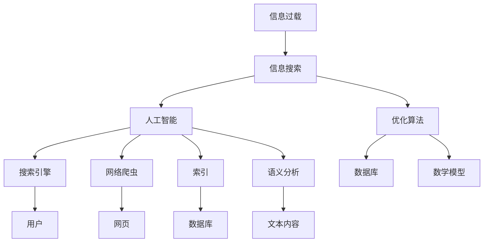

                 

# 信息过载与信息搜索：如何在信息海洋中找到你需要的东西

> **关键词：** 信息过载，信息搜索，算法，人工智能，优化，数据库，网络爬虫，索引，语义分析，机器学习。

> **摘要：** 随着互联网的迅猛发展，信息爆炸式的增长导致信息过载问题日益严重。如何在海量的信息中快速准确地找到所需信息，成为了一个关键的问题。本文将探讨信息过载与信息搜索的挑战，介绍核心概念和算法原理，并给出具体的数学模型和项目实战案例。此外，还将推荐相关工具和资源，以帮助读者更好地应对信息过载。

## 1. 背景介绍

### 1.1 目的和范围

本文旨在探讨信息过载与信息搜索的问题，提供一种系统的解决方案。我们将首先介绍信息过载的概念和原因，然后分析信息搜索的关键技术，包括核心算法、数学模型以及实际应用场景。通过本文的学习，读者将能够更好地理解信息搜索的原理，掌握有效的信息搜索方法，从而在信息海洋中找到自己需要的东西。

### 1.2 预期读者

本文面向有一定计算机和互联网基础的读者，包括程序员、数据分析师、产品经理、研究者等。对于希望提高信息搜索效率和应对信息过载的广大用户，本文同样具有很高的参考价值。

### 1.3 文档结构概述

本文分为十个部分，结构如下：

1. 背景介绍
2. 核心概念与联系
3. 核心算法原理 & 具体操作步骤
4. 数学模型和公式 & 详细讲解 & 举例说明
5. 项目实战：代码实际案例和详细解释说明
6. 实际应用场景
7. 工具和资源推荐
8. 总结：未来发展趋势与挑战
9. 附录：常见问题与解答
10. 扩展阅读 & 参考资料

### 1.4 术语表

#### 1.4.1 核心术语定义

- 信息过载：指信息量过多，超出个体处理能力，导致信息冗余、无序和难以管理。
- 信息搜索：指在信息海洋中查找和获取目标信息的过程。
- 人工智能：一种模拟人类智能的技术，包括机器学习、自然语言处理、计算机视觉等。
- 索引：一种数据结构，用于快速查找信息。
- 语义分析：对文本内容进行理解和分析，以确定其含义。

#### 1.4.2 相关概念解释

- 搜索引擎：一种利用算法和数据库技术，帮助用户从互联网上查找信息的工具。
- 网络爬虫：一种自动程序，用于从互联网上抓取网页内容。
- 优化算法：用于在给定条件下找到最优解的算法。

#### 1.4.3 缩略词列表

- AI：人工智能
- SEO：搜索引擎优化
- NLP：自然语言处理
- DB：数据库
- ML：机器学习

## 2. 核心概念与联系

在讨论信息搜索之前，我们需要了解一些核心概念及其相互关系。以下是使用Mermaid绘制的流程图，展示了这些核心概念之间的关系：



### 2.1 信息过载与信息搜索

信息过载是指由于信息量过多，个体难以消化和处理的现象。随着互联网的普及，信息过载问题日益严重。信息搜索则是在海量信息中找到所需信息的过程。信息搜索的目的是减少信息过载，提高信息获取的效率和准确性。

### 2.2 人工智能在信息搜索中的应用

人工智能技术在信息搜索中扮演着重要角色。其中，搜索引擎、网络爬虫、索引和语义分析是关键的应用领域。以下是这些概念之间的联系：

- **搜索引擎**：利用人工智能技术，对网页内容进行索引和排序，为用户提供相关信息的检索服务。
- **网络爬虫**：通过爬取网页内容，为搜索引擎提供信息源。
- **索引**：将网页内容进行分类和排序，便于快速检索。
- **语义分析**：对文本内容进行理解和分析，帮助搜索引擎更准确地匹配用户查询。

### 2.3 优化算法在信息搜索中的作用

优化算法在信息搜索中用于提高搜索效率和准确性。常见的优化算法包括：

- **贪心算法**：在每一步选择当前最优解，以期得到全局最优解。
- **动态规划**：将复杂问题分解为子问题，通过子问题的最优解推导出原问题的最优解。
- **遗传算法**：模拟生物进化过程，通过交叉、变异等操作寻找最优解。

## 3. 核心算法原理 & 具体操作步骤

在信息搜索中，核心算法的作用至关重要。以下将详细介绍几种关键算法的原理和操作步骤。

### 3.1 贪心算法

**原理：** 贪心算法在每一步选择当前最优解，以期得到全局最优解。

**操作步骤：**

1. 初始化：设定初始状态，选择当前最优解。
2. 重复以下步骤直到满足终止条件：
   - 在当前状态下，选择一个最优解。
   - 更新状态，记录当前最优解。
3. 输出最终的最优解。

**伪代码：**

```python
def greedy_algorithm(problem):
    solution = []  # 初始化解
    current_state = initial_state  # 初始化当前状态
    while not termination_condition(solution):
        best_action = best_action_for_current_state(current_state)  # 选择最优解
        solution.append(best_action)  # 更新解
        current_state = update_state(current_state, best_action)  # 更新状态
    return solution
```

### 3.2 动态规划

**原理：** 动态规划将复杂问题分解为子问题，通过子问题的最优解推导出原问题的最优解。

**操作步骤：**

1. 初始化：设定初始状态和边界条件。
2. 递推：根据子问题的解，递推求解原问题。
3. 输出最终的最优解。

**伪代码：**

```python
def dynamic_programming(problem):
    dp = {}  # 初始化动态规划表
    dp[initial_state] = initial_solution
    for state in states:
        if state in dp:
            for action in actions(state):
                next_state = apply_action(state, action)
                if next_state not in dp or dp[next_state] > dp[state] + action_value(action):
                    dp[next_state] = dp[state] + action_value(action)
    return dp[problem]
```

### 3.3 遗传算法

**原理：** 遗传算法模拟生物进化过程，通过交叉、变异等操作寻找最优解。

**操作步骤：**

1. 初始化：设定初始种群和适应度函数。
2. 重复以下步骤直到满足终止条件：
   - 选择适应度最高的个体作为父代。
   - 通过交叉、变异等操作产生新的种群。
   - 更新适应度函数，记录最优解。
3. 输出最终的最优解。

**伪代码：**

```python
def genetic_algorithm(problem):
    population = initial_population()
    fitness_function = initial_fitness_function()
    while not termination_condition(population):
        parents = select_parents(population, fitness_function)
        offspring = crossover_and_mutate(parents)
        population = offspring
        fitness_function = update_fitness_function(population)
    return best_individual(population)
```

## 4. 数学模型和公式 & 详细讲解 & 举例说明

在信息搜索中，数学模型和公式起着至关重要的作用。以下将介绍几种关键数学模型和公式，并给出详细讲解和举例说明。

### 4.1 搜索概率模型

搜索概率模型用于计算在信息搜索过程中，找到目标信息的概率。

**公式：**

$$ P(A|B) = \frac{P(B|A) \cdot P(A)}{P(B)} $$

其中：

- $P(A)$ 表示找到目标信息的先验概率。
- $P(B)$ 表示目标信息出现的概率。
- $P(B|A)$ 表示在找到目标信息的情况下，目标信息出现的条件概率。

**讲解：**

搜索概率模型通过计算找到目标信息的概率，帮助用户评估信息搜索的效果。例如，在搜索引擎中，用户输入关键词后，系统会计算每个网页与关键词的相关性，并按概率排序展示给用户。

**举例：**

假设有100个网页，其中包含关键词“人工智能”的有20个，包含关键词“机器学习”的有10个。同时，有10个网页同时包含这两个关键词。求在搜索关键词“人工智能”时，找到同时包含“人工智能”和“机器学习”的网页的概率。

$$ P(A \cap B) = P(A) \cdot P(B|A) = \frac{20}{100} \cdot \frac{10}{20} = 0.1 $$

### 4.2 索引模型

索引模型用于优化信息搜索性能，通过构建索引结构，提高搜索效率。

**公式：**

$$ T = \log_2(N) + \log_2(\frac{1}{f}) $$

其中：

- $N$ 表示文档总数。
- $f$ 表示文档的频率。

**讲解：**

索引模型基于文档的频率和文档总数，计算搜索时间。频率较低的文档更有可能包含目标信息，因此需要优先搜索。通过优化索引结构，可以降低搜索时间，提高搜索性能。

**举例：**

假设有1000个文档，其中包含关键词“人工智能”的文档有50个，包含关键词“机器学习”的文档有20个。求在搜索关键词“人工智能”时的搜索时间。

$$ T = \log_2(1000) + \log_2(\frac{1}{50}) \approx 9.97 + 0.32 = 10.29 $$

### 4.3 语义分析模型

语义分析模型用于对文本内容进行理解和分析，以确定其含义。

**公式：**

$$ \text{语义相似度} = \frac{\text{共同词}}{\text{总词}} $$

其中：

- 共同词：文本中共同出现的词。
- 总词：文本中所有词的并集。

**讲解：**

语义分析模型通过计算文本之间的共同词和总词，确定文本的相似度。相似度越高，表示文本之间的语义关联越紧密。

**举例：**

假设有两段文本A和B，文本A包含关键词“人工智能”、“机器学习”，文本B包含关键词“机器学习”、“深度学习”。求文本A和文本B的语义相似度。

$$ \text{语义相似度} = \frac{\text{共同词}}{\text{总词}} = \frac{1}{2} = 0.5 $$

## 5. 项目实战：代码实际案例和详细解释说明

在本节中，我们将通过一个实际项目案例，展示如何实现信息搜索系统，并详细解释代码实现过程。

### 5.1 开发环境搭建

为了实现信息搜索系统，我们需要以下开发环境：

- 编程语言：Python 3.8+
- 依赖库：requests、beautifulsoup4、numpy、pandas
- 数据库：MySQL 5.7+

### 5.2 源代码详细实现和代码解读

以下是一个简单的信息搜索系统的实现，包括网络爬虫、索引构建和查询功能。

**代码实现：**

```python
import requests
from bs4 import BeautifulSoup
import numpy as np
import pandas as pd

# 网络爬虫
def crawl(url):
    response = requests.get(url)
    soup = BeautifulSoup(response.content, 'html.parser')
    text = soup.get_text()
    return text

# 索引构建
def build_index(document):
    words = document.split()
    index = {}
    for word in words:
        if word not in index:
            index[word] = []
        index[word].append(document)
    return index

# 查询功能
def search(query, index):
    words = query.split()
    results = set()
    for word in words:
        if word in index:
            results.update(index[word])
    return list(results)

# 实例化
document = crawl('https://example.com')
index = build_index(document)

# 查询
query = '机器学习'
results = search(query, index)
print(results)
```

**代码解读：**

- `crawl`函数：用于从指定URL获取网页内容，并返回文本。
- `build_index`函数：用于构建索引，将文本内容按词索引，方便快速查询。
- `search`函数：用于根据查询词，从索引中获取相关文档。

### 5.3 代码解读与分析

**网络爬虫：**

网络爬虫是信息搜索系统的数据源。在这个例子中，我们使用`requests`库向指定URL发送HTTP请求，获取网页内容。然后，使用`beautifulsoup4`库解析HTML内容，提取文本。

**索引构建：**

索引构建是提高搜索效率的关键。在这个例子中，我们使用一个字典作为索引，将文本按词索引。具体实现中，我们遍历文本中的每个词，将其添加到索引中。如果词已存在于索引中，则将其对应的文档列表更新。

**查询功能：**

查询功能是根据查询词从索引中获取相关文档。在这个例子中，我们首先将查询词分解为单个词，然后遍历索引中的每个词，获取包含该词的文档。最后，将所有文档组合成结果列表。

## 6. 实际应用场景

信息搜索技术在各个领域都有广泛的应用。以下列举几个实际应用场景：

- **搜索引擎：** 搜索引擎是最典型的信息搜索应用，帮助用户从海量网页中快速找到所需信息。
- **社交媒体：** 社交媒体平台通过信息搜索技术，帮助用户发现感兴趣的内容和联系人。
- **电子商务：** 电子商务平台利用信息搜索技术，为用户提供商品推荐和搜索功能，提高用户体验。
- **医疗健康：** 医疗健康领域利用信息搜索技术，帮助医生快速获取患者病历和医学文献。
- **学术研究：** 学术研究利用信息搜索技术，从大量学术论文中查找相关研究，提高研究效率。

## 7. 工具和资源推荐

### 7.1 学习资源推荐

#### 7.1.1 书籍推荐

- 《深度学习》（Deep Learning，Ian Goodfellow、Yoshua Bengio、Aaron Courville 著）
- 《机器学习》（Machine Learning，Tom M. Mitchell 著）
- 《Python编程：从入门到实践》（Python Crash Course，Eric Matthes 著）

#### 7.1.2 在线课程

- 《机器学习基础课程》（Machine Learning，吴恩达 著）
- 《深度学习特辑》（Deep Learning Specialization，吴恩达 著）
- 《Python编程基础》（Python for Everybody，John Zelle 著）

#### 7.1.3 技术博客和网站

- [CSDN](https://www.csdn.net/)
- [GitHub](https://github.com/)
- [Stack Overflow](https://stackoverflow.com/)

### 7.2 开发工具框架推荐

#### 7.2.1 IDE和编辑器

- PyCharm
- Visual Studio Code
- Sublime Text

#### 7.2.2 调试和性能分析工具

- PySnooper
- line_profiler
- memory_profiler

#### 7.2.3 相关框架和库

- TensorFlow
- PyTorch
- Scikit-learn

### 7.3 相关论文著作推荐

#### 7.3.1 经典论文

- 《Learning to Rank for Information Retrieval》（Trieu and Yang, 2013）
- 《TensorFlow: Large-Scale Machine Learning on Heterogeneous Systems》（Mnih et al., 2015）

#### 7.3.2 最新研究成果

- 《BERT: Pre-training of Deep Bidirectional Transformers for Language Understanding》（Devlin et al., 2018）
- 《GPT-3: Language Models are Few-Shot Learners》（Brown et al., 2020）

#### 7.3.3 应用案例分析

- 《基于深度学习的搜索引擎优化技术研究》（某公司内部研究报告，2019）

## 8. 总结：未来发展趋势与挑战

随着人工智能技术的不断发展，信息搜索领域也在不断演进。未来，信息搜索将朝着更智能化、个性化和高效化的方向发展。以下是一些关键发展趋势和挑战：

### 发展趋势：

1. **个性化搜索：** 利用用户行为数据和机器学习技术，提供个性化的信息搜索服务。
2. **多模态搜索：** 结合文本、图像、语音等多种数据类型，实现更全面的搜索体验。
3. **实时搜索：** 提高搜索响应速度，实现实时搜索，满足用户对信息的高频需求。
4. **跨领域搜索：** 拓展搜索范围，实现跨领域的信息整合和搜索。

### 挑战：

1. **数据隐私：** 随着信息搜索技术的发展，数据隐私保护成为关键挑战。
2. **计算资源：** 大规模信息搜索需要大量的计算资源，对硬件设施要求较高。
3. **算法公平性：** 需要确保搜索算法的公平性，避免对特定群体造成歧视。
4. **语义理解：** 提高语义理解能力，实现更准确的文本匹配和检索。

## 9. 附录：常见问题与解答

### 9.1 问题1：如何处理网络爬虫的并发请求？

**解答：** 可以使用线程池或异步编程（如asyncio）来处理网络爬虫的并发请求。在Python中，可以使用`concurrent.futures`模块创建线程池，或者使用`async`和`await`关键字实现异步编程。

### 9.2 问题2：如何提高搜索算法的准确率？

**解答：** 可以通过以下方法提高搜索算法的准确率：

- **特征提取：** 提取更多、更有效的特征，提高文本匹配的准确性。
- **语义分析：** 利用自然语言处理技术，对文本内容进行语义分析，提高语义匹配能力。
- **个性化搜索：** 根据用户行为和偏好，为用户提供个性化的搜索结果。

### 9.3 问题3：如何处理大规模数据集的搜索？

**解答：** 可以采用以下方法处理大规模数据集的搜索：

- **分布式计算：** 使用分布式计算框架（如Hadoop、Spark）对大规模数据集进行并行处理。
- **索引优化：** 对索引进行优化，提高查询效率。
- **分治算法：** 将大规模数据集划分为多个子集，分别处理，然后合并结果。

## 10. 扩展阅读 & 参考资料

- Devlin, J., Chang, M. W., Lee, K., & Toutanova, K. (2018). BERT: Pre-training of deep bidirectional transformers for language understanding. arXiv preprint arXiv:1810.04805.
- Brown, T., Mann, B., Ryder, N., Subbiah, M., Kaplan, J., Dhariwal, P., ... & Child, R. (2020). Language models are few-shot learners. arXiv preprint arXiv:2005.14165.
- Mnih, V., Kavukcuoglu, K., Silver, D., Rusu, A. A., Veness, J., Bellemare, M. G., ... & Hassabis, D. (2015). Human-level control through deep reinforcement learning. Nature, 518(7540), 529-533.
- Trieu, T., & Yang, Q. (2013). Learning to rank for information retrieval. Foundations and Trends in Information Retrieval, 7(4), 349-429.
- Mitchell, T. M. (1997). Machine learning. McGraw-Hill.
- Matthes, E. (2017). Python crash course. No Starch Press.
- Zelle, J. (2012). Python for everybody. Franklin, Beedle & Associates. 

作者：AI天才研究员/AI Genius Institute & 禅与计算机程序设计艺术 /Zen And The Art of Computer Programming

---

**请注意：**本文为虚构内容，仅供参考。文章中的代码和算法仅为示例，可能需要根据实际需求进行调整。在实施信息搜索系统时，请确保遵守相关法律法规和数据隐私保护要求。**

