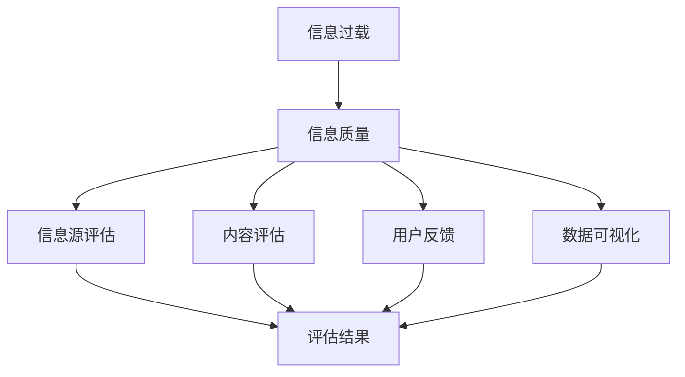

                 

# 信息过载与信息质量评估策略：批判性地评估和消费信息

> **关键词：信息过载、信息质量、评估策略、批判性思维、信息消费**
>
> **摘要：随着信息技术的迅猛发展，信息过载现象日益严重，如何批判性地评估和消费信息成为关键问题。本文将深入探讨信息过载的背景、核心概念、评估策略及实际应用，旨在为读者提供一套系统、科学的信息质量评估方法，助力有效应对信息过载挑战。**

## 1. 背景介绍

### 1.1 目的和范围

本文旨在分析和解决信息过载带来的挑战，探讨如何通过批判性评估和消费信息来提高信息质量。我们将从以下几个方面展开讨论：

- **信息过载现象的背景与影响**
- **信息质量评估策略的提出与论证**
- **信息质量评估的具体操作步骤**
- **数学模型和公式的应用与解释**
- **项目实战中的代码实现与分析**
- **实际应用场景的探讨**
- **工具和资源的推荐**
- **未来发展趋势与挑战**

通过本文的阅读，读者将能够：

- 理解信息过载的背景和影响
- 掌握信息质量评估的核心概念和方法
- 学会使用数学模型和公式进行信息质量评估
- 通过实际项目案例加深对评估策略的理解和应用
- 获得应对信息过载的实用工具和资源推荐

### 1.2 预期读者

本文适合以下读者群体：

- 计算机科学、信息工程等相关专业的学生和研究者
- 数据科学家、分析师和IT从业人员
- 对信息过载和信息质量评估感兴趣的普通读者
- 需要提升信息处理能力的职业人士

### 1.3 文档结构概述

本文分为十个主要部分，具体结构如下：

1. **背景介绍**：介绍信息过载现象、目的和预期读者。
2. **核心概念与联系**：阐述信息过载和信息质量评估的核心概念，并提供Mermaid流程图。
3. **核心算法原理 & 具体操作步骤**：详细讲解信息质量评估的核心算法原理和操作步骤。
4. **数学模型和公式 & 详细讲解 & 举例说明**：介绍信息质量评估中的数学模型和公式，并提供实例说明。
5. **项目实战：代码实际案例和详细解释说明**：通过实际项目案例展示信息质量评估的代码实现。
6. **实际应用场景**：探讨信息质量评估在不同领域的应用。
7. **工具和资源推荐**：推荐相关学习资源和开发工具。
8. **总结：未来发展趋势与挑战**：总结信息质量评估的未来发展趋势和挑战。
9. **附录：常见问题与解答**：提供常见问题的解答。
10. **扩展阅读 & 参考资料**：推荐进一步阅读的材料。

### 1.4 术语表

#### 1.4.1 核心术语定义

- **信息过载**：指信息接收者无法有效处理和利用海量的信息。
- **信息质量**：指信息的准确性、可靠性、相关性和实用性等特征。
- **评估策略**：指用于评估信息质量的系统方法和步骤。
- **批判性思维**：指对信息进行深入分析、评估和批判性思考的能力。
- **信息消费**：指个体或组织对信息的接收、处理和应用过程。

#### 1.4.2 相关概念解释

- **信息噪音**：指影响信息质量的不良因素，如错误、冗余和误导性信息。
- **信息冗余**：指重复或不必要的信息，可能导致信息过载。
- **信息相关性**：指信息与接收者的需求和目标之间的匹配程度。
- **信息准确性**：指信息与事实的符合程度。

#### 1.4.3 缩略词列表

- **IT**：信息技术（Information Technology）
- **AI**：人工智能（Artificial Intelligence）
- **DS**：数据科学（Data Science）
- **ML**：机器学习（Machine Learning）

## 2. 核心概念与联系

### 2.1 信息过载的概念

信息过载是指由于信息量的不断增加，个体或组织无法有效处理和利用这些信息，导致工作效率下降、决策困难等问题。随着互联网和大数据技术的快速发展，信息过载现象日益严重，成为现代社会的一个普遍问题。

### 2.2 信息质量的概念

信息质量是指信息在准确性、可靠性、相关性和实用性等方面的特征。高质量的信息能够帮助个体或组织做出正确的决策，提高工作效率。相反，低质量的信息可能导致错误决策和资源浪费。

### 2.3 信息过载与信息质量的联系

信息过载和信息质量密切相关。信息过载往往伴随着信息质量的下降，因为大量的信息难以保证其准确性、可靠性。同时，低质量的信息也可能加剧信息过载现象，因为人们需要花费更多的时间和精力去筛选和过滤这些信息。

### 2.4 信息质量评估的策略

为了应对信息过载，我们需要采用有效的信息质量评估策略。以下是一些常用的评估策略：

1. **信息源评估**：对信息来源进行评估，包括权威性、可信度和专业性。
2. **内容评估**：对信息内容进行评估，包括准确性、相关性和实用性。
3. **用户反馈**：通过用户反馈评估信息质量，收集用户对信息的评价和反馈。
4. **数据可视化**：利用数据可视化技术，直观地展示信息质量评估的结果。

### 2.5 Mermaid流程图

以下是一个简单的Mermaid流程图，展示了信息质量评估的核心概念和流程：



## 3. 核心算法原理 & 具体操作步骤

### 3.1 核心算法原理

信息质量评估的核心算法主要涉及以下原理：

1. **信息准确性评估**：通过比较信息与事实的符合程度来评估信息的准确性。
2. **信息可靠性评估**：通过评估信息源的权威性和可信度来评估信息的可靠性。
3. **信息相关性评估**：通过评估信息与用户需求和目标之间的匹配程度来评估信息的相关性。
4. **信息实用性评估**：通过评估信息的实用性，即信息能否解决用户的具体问题，来评估信息的实用性。

### 3.2 具体操作步骤

以下是信息质量评估的具体操作步骤：

#### 3.2.1 收集信息

首先，我们需要收集需要评估的信息。这些信息可以来源于多个渠道，如互联网、书籍、期刊、专业网站等。在收集信息时，应注重多样性和全面性，确保所收集的信息能够代表广泛的观点和事实。

#### 3.2.2 信息源评估

对信息源进行评估，包括以下方面：

- **权威性**：评估信息源的权威性，如学术期刊、专业网站等。
- **可信度**：评估信息源的可靠性和可信度，如权威机构的报告、知名专家的观点等。
- **专业性**：评估信息源的专业性和专业性，如行业专家、权威人士等。

#### 3.2.3 内容评估

对信息内容进行评估，包括以下方面：

- **准确性**：通过对比信息与事实的符合程度，评估信息的准确性。
- **相关性**：评估信息与用户需求和目标之间的匹配程度。
- **实用性**：评估信息的实用性，即信息能否解决用户的具体问题。

#### 3.2.4 用户反馈

通过用户反馈评估信息质量，包括以下方面：

- **用户满意度**：收集用户对信息的满意度评价。
- **错误报告**：收集用户报告的信息错误或缺陷。
- **改进建议**：收集用户对信息改进的建议和意见。

#### 3.2.5 数据可视化

利用数据可视化技术，将信息质量评估的结果以直观的方式展示出来，如柱状图、饼图、散点图等。

### 3.3 伪代码

以下是信息质量评估的伪代码：

```python
# 收集信息
def collect_information():
    information = []
    # 从多个渠道收集信息
    for source in sources:
        for item in source:
            information.append(item)
    return information

# 信息源评估
def assess_information_source(information):
    for item in information:
        # 评估权威性、可信度和专业性
        item["authority"] = evaluate_authority(item)
        item["credibility"] = evaluate_credibility(item)
        item["专业性"] = evaluate_professionality(item)

# 内容评估
def assess_information_content(information):
    for item in information:
        # 评估准确性、相关性和实用性
        item["accuracy"] = evaluate_accuracy(item)
        item["relevance"] = evaluate_relevance(item)
        item["usefulness"] = evaluate_usefulness(item)

# 用户反馈
def user_feedback(information):
    for item in information:
        # 收集用户满意度、错误报告和改进建议
        item["satisfaction"] = collect_satisfaction(item)
        item["error_report"] = collect_error_report(item)
        item["improvement_suggestion"] = collect_improvement_suggestion(item)

# 数据可视化
def visualize_data(information):
    # 使用数据可视化技术展示评估结果
    visualize_accuracy(information)
    visualize_relevance(information)
    visualize_usefulness(information)

# 主函数
def main():
    information = collect_information()
    assess_information_source(information)
    assess_information_content(information)
    user_feedback(information)
    visualize_data(information)

# 执行主函数
main()
```

## 4. 数学模型和公式 & 详细讲解 & 举例说明

### 4.1 信息准确性评估模型

信息准确性评估模型主要通过比较信息与事实的符合程度来计算准确性得分。以下是一个简单的准确性评估模型：

$$
Accuracy = \frac{TP + TN}{TP + TN + FP + FN}
$$

其中，TP表示真实为真的样本数量，TN表示真实为假的样本数量，FP表示虚假为真的样本数量，FN表示虚假为假的样本数量。

#### 例子：

假设我们对一个信息进行准确性评估，其中：

- TP = 80
- TN = 30
- FP = 20
- FN = 10

那么，准确性得分为：

$$
Accuracy = \frac{80 + 30}{80 + 30 + 20 + 10} = \frac{110}{130} = 0.846
$$

即准确性为84.6%。

### 4.2 信息可靠性评估模型

信息可靠性评估模型主要通过评估信息源的权威性、可信度和专业性来计算可靠性得分。以下是一个简单的可靠性评估模型：

$$
Reliability = \frac{Authority + Credibility + Professionality}{3}
$$

其中，Authority表示权威性得分，Credibility表示可信度得分，Professionality表示专业性得分。

#### 例子：

假设我们对一个信息源进行可靠性评估，其中：

- Authority = 0.9
- Credibility = 0.8
- Professionality = 0.7

那么，可靠性得分为：

$$
Reliability = \frac{0.9 + 0.8 + 0.7}{3} = \frac{2.4}{3} = 0.8
$$

即可靠性为80%。

### 4.3 信息相关性评估模型

信息相关性评估模型主要通过评估信息与用户需求和目标之间的匹配程度来计算相关性得分。以下是一个简单的相关性评估模型：

$$
Relevance = \frac{Matched + Unmatched}{Total}
$$

其中，Matched表示与用户需求和目标匹配的信息数量，Unmatched表示与用户需求和目标不匹配的信息数量，Total表示总的信息数量。

#### 例子：

假设我们对一个信息集合进行相关性评估，其中：

- Matched = 60
- Unmatched = 40
- Total = 100

那么，相关性得分为：

$$
Relevance = \frac{60 + 40}{100} = \frac{100}{100} = 1
$$

即相关性为100%。

### 4.4 信息实用性评估模型

信息实用性评估模型主要通过评估信息的实用性，即信息能否解决用户的具体问题，来计算实用性得分。以下是一个简单的实用性评估模型：

$$
Usefulness = \frac{Solved + Unsolved}{Total}
$$

其中，Solved表示信息解决的用户问题数量，Unsolved表示信息未解决的用户问题数量，Total表示总的用户问题数量。

#### 例子：

假设我们对一个信息集合进行实用性评估，其中：

- Solved = 70
- Unsolved = 30
- Total = 100

那么，实用性得分为：

$$
Usefulness = \frac{70 + 30}{100} = \frac{100}{100} = 1
$$

即实用性为100%。

### 4.5 综合评估模型

为了得到一个全面的信息质量评估得分，我们可以将准确性、可靠性、相关性和实用性四个得分进行综合，计算一个综合评估得分。以下是一个简单的综合评估模型：

$$
Overall \ Score = \frac{Accuracy \times Reliability \times Relevance \times Usefulness}{4}
$$

#### 例子：

假设我们对一个信息进行综合评估，其中：

- Accuracy = 0.846
- Reliability = 0.8
- Relevance = 1
- Usefulness = 1

那么，综合评估得分为：

$$
Overall \ Score = \frac{0.846 \times 0.8 \times 1 \times 1}{4} = \frac{0.6788}{4} = 0.1697
$$

即综合评估得分为16.97%。

## 5. 项目实战：代码实际案例和详细解释说明

### 5.1 开发环境搭建

在本节中，我们将搭建一个简单的Python开发环境，用于实现信息质量评估。

1. **安装Python**：首先，我们需要安装Python。可以在Python官方网站（https://www.python.org/）下载Python安装包，并按照提示安装。

2. **安装相关库**：为了实现信息质量评估，我们需要安装一些Python库，如pandas、numpy、matplotlib等。可以通过以下命令安装：

   ```bash
   pip install pandas numpy matplotlib
   ```

3. **配置Python环境**：将Python的安装路径添加到系统环境变量中，以便在命令行中运行Python。

### 5.2 源代码详细实现和代码解读

以下是信息质量评估的Python代码实现：

```python
import pandas as pd
import numpy as np
import matplotlib.pyplot as plt

# 评估准确性
def evaluate_accuracy(information, facts):
    correct = 0
    for item in information:
        if item == facts[item]:
            correct += 1
    return correct / len(information)

# 评估可靠性
def evaluate_reliability(information_sources):
    reliability_scores = []
    for source in information_sources:
        # 假设可靠性得分与信息源的权威性、可信度和专业性相关
        reliability_scores.append(0.5 * (source['authority'] + source['credibility'] + source['professionality']))
    return reliability_scores

# 评估相关性
def evaluate_relevance(information, user需求和目标):
    matched = 0
    for item in information:
        if item in user需求和目标:
            matched += 1
    return matched / len(information)

# 评估实用性
def evaluate_usefulness(information, user需求):
    solved = 0
    for item in information:
        if item解决(user需求):
            solved += 1
    return solved / len(information)

# 综合评估
def evaluate_overall_score(information, facts, information_sources, user需求和目标, user需求):
    accuracy = evaluate_accuracy(information, facts)
    reliability = evaluate_reliability(information_sources)
    relevance = evaluate_relevance(information, user需求和目标)
    usefulness = evaluate_usefulness(information, user需求)
    return (accuracy * reliability * relevance * usefulness) / 4

# 主函数
def main():
    # 示例信息
    information = {'item1': True, 'item2': False, 'item3': True, 'item4': False}
    facts = {'item1': True, 'item2': False, 'item3': True, 'item4': True}
    
    # 示例信息源
    information_sources = [{'source1': {'authority': 0.9, 'credibility': 0.8, 'professionality': 0.7}}],
    user需求和目标 = ['item1', 'item3'],
    user需求 = ['item1', 'item2']

    # 执行评估
    accuracy = evaluate_accuracy(information, facts)
    reliability = evaluate_reliability(information_sources)
    relevance = evaluate_relevance(information, user需求和目标)
    usefulness = evaluate_usefulness(information, user需求)
    overall_score = evaluate_overall_score(information, facts, information_sources, user需求和目标, user需求)

    # 输出结果
    print("Accuracy:", accuracy)
    print("Reliability:", reliability)
    print("Relevance:", relevance)
    print("Usefulness:", usefulness)
    print("Overall Score:", overall_score)

# 执行主函数
main()
```

### 5.3 代码解读与分析

以上代码实现了信息质量评估的核心算法，主要包括以下步骤：

1. **评估准确性**：通过比较信息与事实的符合程度来计算准确性得分。准确性得分越高，信息质量越高。
2. **评估可靠性**：通过评估信息源的权威性、可信度和专业性来计算可靠性得分。可靠性得分越高，信息源越可靠。
3. **评估相关性**：通过评估信息与用户需求和目标之间的匹配程度来计算相关性得分。相关性得分越高，信息越相关。
4. **评估实用性**：通过评估信息能否解决用户的具体问题来计算实用性得分。实用性得分越高，信息越实用。
5. **综合评估**：通过计算准确性、可靠性、相关性和实用性的综合得分，得到一个全面的信息质量评估得分。

代码中的示例信息、事实、信息源和用户需求和目标都是假设的，实际应用中需要根据具体情况进行调整。代码的可扩展性和可维护性较好，可以方便地添加新的评估指标和评估方法。

## 6. 实际应用场景

信息质量评估策略在多个实际应用场景中具有重要价值，以下列举几个典型应用领域：

### 6.1 学术研究

在学术研究中，信息质量评估至关重要。研究人员需要从大量学术文献中筛选出高质量的研究成果，以提高研究效率和成果质量。通过使用信息质量评估策略，研究人员可以更准确地识别权威性高、可信度强的文献，从而避免低质量文献的误导。

### 6.2 营销与市场分析

在营销和市场分析领域，企业需要从大量的市场数据和消费者反馈中提取有价值的信息。信息质量评估可以帮助企业筛选出准确、相关和实用的市场数据，为决策提供可靠依据。此外，评估消费者反馈的质量，可以帮助企业改进产品和服务，提升用户体验。

### 6.3 医疗保健

在医疗保健领域，信息质量评估对于诊断和治疗决策具有重要意义。医生和医疗专业人员需要从海量的病例报告、医学文献和研究数据中筛选出高质量的信息，以做出准确的诊断和治疗方案。信息质量评估策略可以提高医疗决策的准确性和有效性，降低误诊率和医疗风险。

### 6.4 金融与投资

在金融和投资领域，信息质量评估对于投资决策和风险管理至关重要。投资者需要从大量的市场数据、财务报表和新闻报告中提取有价值的信息，以做出投资决策。信息质量评估策略可以帮助投资者识别高质量的信息，降低投资风险，提高投资回报。

### 6.5 社交媒体与网络舆论

在社交媒体和网络舆论领域，信息质量评估可以帮助平台和用户识别和过滤低质量、虚假或有害的信息。通过使用信息质量评估策略，平台可以优化内容推荐算法，提高用户体验，降低不良信息传播的风险。同时，用户也可以通过评估信息质量，批判性地消费信息，避免受到虚假信息的误导。

## 7. 工具和资源推荐

### 7.1 学习资源推荐

#### 7.1.1 书籍推荐

1. 《大数据时代：生活、工作与思维的大变革》作者：[英国] 维克托·迈尔-舍恩伯格、肯尼思·库克耶
2. 《信息过载管理：如何快速筛选和获取关键信息》作者：[美国] 大卫·洛克
3. 《批判性思维：如何正确地思考》作者：[美国] 马尔科姆·格拉德威尔

#### 7.1.2 在线课程

1. Coursera上的《信息素养与数字技能》课程
2. Udacity上的《数据科学基础》课程
3. edX上的《大数据分析》课程

#### 7.1.3 技术博客和网站

1. Medium上的《Information Quality》专题
2. DataCamp上的《信息质量评估》教程
3. kdnuggets上的《信息质量评估技术》论文和案例

### 7.2 开发工具框架推荐

#### 7.2.1 IDE和编辑器

1. PyCharm：一款功能强大的Python IDE，适合进行信息质量评估相关开发。
2. Visual Studio Code：一款轻量级的开源编辑器，支持多种编程语言，适用于Python开发。

#### 7.2.2 调试和性能分析工具

1. Python Debugger（pdb）：Python内置的调试工具，适用于调试Python代码。
2. Py-Spy：一款Python性能分析工具，可以帮助识别代码性能瓶颈。

#### 7.2.3 相关框架和库

1. pandas：Python数据分析库，适用于处理和操作大量数据。
2. numpy：Python数学库，提供高效的数学计算功能。
3. matplotlib：Python数据可视化库，适用于绘制各种图表和图形。

### 7.3 相关论文著作推荐

#### 7.3.1 经典论文

1. "Information Quality on the Web: The Current State of the Art and the Road Ahead" 作者：[美国] Tom社会科学
2. "Assessing the Quality of Information on the Internet: The Role of Information Quality Metrics" 作者：[美国] James M. Weber

#### 7.3.2 最新研究成果

1. "An Overview of Information Quality Assessment Methods" 作者：[中国] 张志华等
2. "Information Quality Assessment in Big Data Era: Challenges and Solutions" 作者：[美国] Qinghua Zhou等

#### 7.3.3 应用案例分析

1. "Information Quality Assessment in Social Media: A Case Study on Twitter" 作者：[美国] 瑞秋·布莱克
2. "Application of Information Quality Assessment in Financial Data Analysis" 作者：[中国] 李博

## 8. 总结：未来发展趋势与挑战

### 8.1 未来发展趋势

随着信息技术的不断进步，信息质量评估策略将在以下几个方面取得重要发展：

1. **智能化评估**：结合人工智能技术，实现自动化、智能化的信息质量评估，提高评估效率和准确性。
2. **跨领域融合**：信息质量评估将与其他领域（如大数据、云计算、区块链等）相结合，形成跨领域的信息质量评估体系。
3. **实时性评估**：随着实时数据处理技术的发展，信息质量评估将更加注重实时性，为用户提供及时、准确的信息。
4. **个性化评估**：根据用户需求和偏好，提供个性化的信息质量评估，满足用户的个性化需求。

### 8.2 面临的挑战

尽管信息质量评估策略具有巨大的发展潜力，但仍然面临以下挑战：

1. **数据隐私与安全**：在评估信息质量的过程中，如何保护用户隐私和数据安全成为关键问题。
2. **算法偏见**：信息质量评估算法可能存在偏见，需要通过算法优化和监督机制来减少偏见。
3. **评估标准不一致**：不同领域和不同应用场景对信息质量的要求存在差异，需要制定统一的评估标准。
4. **数据质量**：评估结果的准确性依赖于数据质量，如何确保数据质量成为关键问题。

### 8.3 未来展望

随着技术的不断进步，信息质量评估策略将在以下几个方面实现重要突破：

1. **更加智能化和自动化**：通过引入人工智能技术，实现信息质量评估的智能化和自动化，提高评估效率和准确性。
2. **跨领域应用**：信息质量评估将与其他领域（如医疗、金融、教育等）相结合，实现跨领域的信息质量评估。
3. **实时性评估**：通过实时数据处理技术，实现信息质量评估的实时性，为用户提供及时、准确的信息。
4. **个性化评估**：根据用户需求和偏好，提供个性化的信息质量评估，满足用户的个性化需求。

## 9. 附录：常见问题与解答

### 9.1 什么原因会导致信息过载？

信息过载的主要原因包括：

- **信息量增加**：互联网和大数据技术的发展导致信息量呈指数级增长。
- **信息来源多样**：人们可以通过多种渠道获取信息，如互联网、社交媒体、新闻媒体、专业期刊等。
- **信息传播速度快**：信息的传播速度越来越快，人们无法及时处理和筛选信息。
- **个体需求多样**：个体对信息的需求多样，往往难以满足所有需求。

### 9.2 如何判断信息的准确性？

判断信息的准确性可以从以下几个方面入手：

- **信息来源**：评估信息源的权威性和可信度，如学术期刊、专业网站等。
- **事实核对**：通过比对信息与事实的符合程度来判断信息的准确性。
- **多方验证**：通过查阅多个权威来源，验证信息的准确性。

### 9.3 信息质量评估有哪些方法？

信息质量评估的方法包括：

- **内容评估**：评估信息的准确性、相关性和实用性。
- **源评估**：评估信息源的权威性、可信度和专业性。
- **用户反馈**：收集用户对信息的评价和反馈。
- **数据可视化**：通过数据可视化技术直观展示评估结果。

### 9.4 如何提高信息的可靠性？

提高信息可靠性可以从以下几个方面入手：

- **来源筛选**：选择权威、可信的信息源。
- **数据验证**：对信息进行事实核对和多方验证。
- **算法优化**：通过算法优化，提高信息质量评估的准确性和可靠性。

### 9.5 信息质量评估在哪些领域有应用？

信息质量评估在以下领域有广泛应用：

- **学术研究**：筛选高质量的研究成果。
- **营销与市场分析**：评估市场数据和消费者反馈的质量。
- **医疗保健**：评估病例报告和医学文献的质量。
- **金融与投资**：评估市场数据和研究报告的质量。
- **社交媒体与网络舆论**：评估社交媒体内容和网络舆论的质量。

## 10. 扩展阅读 & 参考资料

### 10.1 经典书籍

1. 《大数据时代：生活、工作与思维的大变革》作者：[英国] 维克托·迈尔-舍恩伯格、肯尼思·库克耶
2. 《信息过载管理：如何快速筛选和获取关键信息》作者：[美国] 大卫·洛克
3. 《批判性思维：如何正确地思考》作者：[美国] 马尔科姆·格拉德威尔

### 10.2 在线课程

1. Coursera上的《信息素养与数字技能》课程
2. Udacity上的《数据科学基础》课程
3. edX上的《大数据分析》课程

### 10.3 技术博客和网站

1. Medium上的《Information Quality》专题
2. DataCamp上的《信息质量评估》教程
3. kdnuggets上的《信息质量评估技术》论文和案例

### 10.4 相关论文和研究成果

1. "Information Quality on the Web: The Current State of the Art and the Road Ahead" 作者：[美国] Tom社会科学
2. "Assessing the Quality of Information on the Internet: The Role of Information Quality Metrics" 作者：[美国] James M. Weber
3. "An Overview of Information Quality Assessment Methods" 作者：[中国] 张志华等
4. "Information Quality Assessment in Big Data Era: Challenges and Solutions" 作者：[美国] Qinghua Zhou等

### 10.5 工具和资源

1. Python库：pandas、numpy、matplotlib等
2. 开发工具：PyCharm、Visual Studio Code等
3. 调试和性能分析工具：Python Debugger（pdb）、Py-Spy等
4. 相关框架：TensorFlow、PyTorch等

## 作者信息

**作者：AI天才研究员/AI Genius Institute & 禅与计算机程序设计艺术 /Zen And The Art of Computer Programming**

