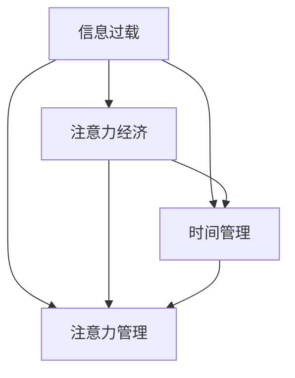
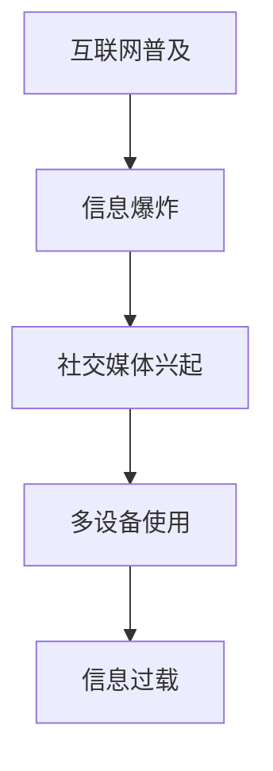
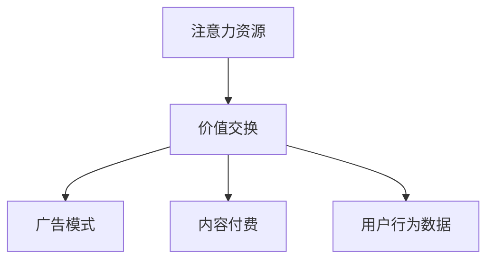
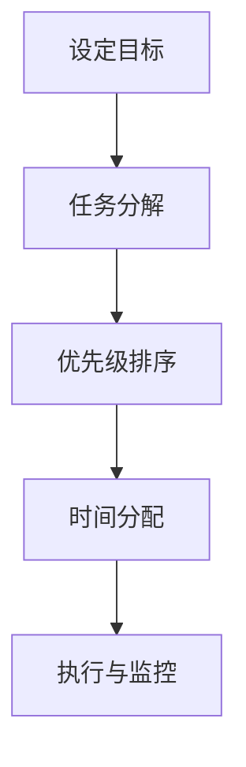
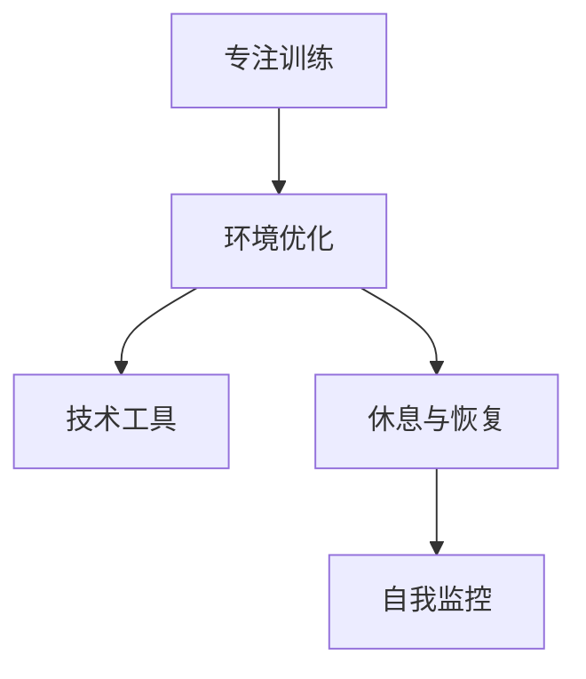

                 

# 信息过载与注意力经济：在数字时代管理你的时间和注意力

> **关键词：** 信息过载，注意力经济，时间管理，注意力管理，数字时代，技术策略。

> **摘要：** 在数字化时代，信息过载已成为普遍现象，严重影响了我们的注意力和工作效率。本文将探讨信息过载的根源、注意力经济的概念及其在现代社会的重要性，并介绍一系列策略和技术，帮助读者在数字时代更好地管理自己的时间和注意力。

## 1. 背景介绍

### 1.1 目的和范围

本文旨在帮助读者理解信息过载与注意力经济的重要性，并提供实用的策略，以便在数字化世界中有效地管理时间和注意力。我们将从以下几个方面展开讨论：

- **信息过载的根源**：解释信息过载的原因，如互联网的普及、社交媒体的兴起等。
- **注意力经济的概念**：介绍注意力经济的基本原理，以及它如何影响我们的工作和生活。
- **时间管理与注意力管理的策略**：提供一系列实用的方法，帮助读者提高工作效率，减少分心，保持专注。
- **实际应用场景**：探讨注意力管理在个人、企业和教育等领域的应用。
- **工具和资源推荐**：推荐一些有助于提升注意力管理的工具和资源。

### 1.2 预期读者

本文适合以下读者群体：

- **企业管理者和员工**：希望通过提升注意力管理来提高工作效率和生产力。
- **IT专业人士**：关注如何在大数据和高频信息环境中保持高效编程和问题解决能力。
- **教育工作者**：希望了解如何帮助学生提高注意力，提高学习效果。
- **普通个人**：希望改善时间管理，减少信息过载带来的负面影响。

### 1.3 文档结构概述

本文将分为以下几部分：

- **核心概念与联系**：介绍信息过载和注意力经济的相关概念，并使用 Mermaid 流程图展示其相互关系。
- **核心算法原理 & 具体操作步骤**：详细讲解注意力管理的基本算法和操作步骤。
- **数学模型和公式 & 详细讲解 & 举例说明**：使用数学模型和公式来解释注意力管理的原理，并通过实例进行说明。
- **项目实战：代码实际案例和详细解释说明**：提供实际代码案例，并对其进行详细解释。
- **实际应用场景**：分析注意力管理在不同领域的应用。
- **工具和资源推荐**：推荐有助于注意力管理的工具和资源。

### 1.4 术语表

#### 1.4.1 核心术语定义

- **信息过载**：指信息量过多，超出了个人处理能力的现象。
- **注意力经济**：指人们为了获取信息、娱乐或工作而付出的注意力和时间的经济价值。
- **时间管理**：指合理安排时间，以实现个人目标的过程。
- **注意力管理**：指通过各种方法提高注意力的集中度和持久性，以实现高效工作和学习。

#### 1.4.2 相关概念解释

- **多任务处理**：同时处理多个任务的能力。
- **分心**：注意力被外界因素吸引，导致无法专注于当前任务。
- **专注力**：保持注意力集中在某一任务上的能力。

#### 1.4.3 缩略词列表

- **IT**：信息技术（Information Technology）
- **AI**：人工智能（Artificial Intelligence）
- **SEO**：搜索引擎优化（Search Engine Optimization）
- **SNS**：社交媒体网络（Social Networking Service）

## 2. 核心概念与联系

在探讨如何管理信息和注意力之前，我们需要了解几个核心概念及其相互关系。以下是一个简化的 Mermaid 流程图，用于展示信息过载、注意力经济、时间管理和注意力管理之间的关系：



### 2.1 信息过载

信息过载是指由于信息量的增加，超出了个人处理能力，导致人们难以有效处理和利用这些信息。以下是一个简要的 Mermaid 流程图，用于展示信息过载的产生过程：



### 2.2 注意力经济

注意力经济是指人们在获取信息、娱乐或工作时，所付出的注意力和时间的经济价值。以下是一个简要的 Mermaid 流程图，用于展示注意力经济的核心概念：



### 2.3 时间管理

时间管理是指合理安排时间，以实现个人目标的过程。以下是一个简要的 Mermaid 流程图，用于展示时间管理的核心步骤：



### 2.4 注意力管理

注意力管理是指通过各种方法提高注意力的集中度和持久性，以实现高效工作和学习。以下是一个简要的 Mermaid 流程图，用于展示注意力管理的核心策略：



## 3. 核心算法原理 & 具体操作步骤

### 3.1 注意力管理算法原理

注意力管理算法的核心目标是提高注意力的集中度和持久性。以下是一个简化的伪代码，用于描述注意力管理算法的基本原理：

```python
def attention_management():
    while True:
        if is_distracted():
            apply_distract_reducing_strategy()
        else:
            focus_on_current_task()
        monitor_attention_level()
```

### 3.2 具体操作步骤

1. **自我监控**：

   使用心理测试工具或自我评估方法，定期检查自己的注意力水平。以下是一个简化的伪代码，用于描述自我监控的过程：

   ```python
   def self_monitor():
       attention_level = measure_attention_level()
       if attention_level < threshold:
           alert("注意力水平较低，请采取行动提高注意力。")
   ```

2. **环境优化**：

   通过改变环境因素来提高注意力集中度。以下是一个简化的伪代码，用于描述环境优化的过程：

   ```python
   def optimize_environment():
       set_optimal_lighting()
       reduce noises()
       organize workspace()
   ```

3. **技术工具**：

   使用各种技术工具来帮助管理注意力，例如番茄工作法、专注力应用等。以下是一个简化的伪代码，用于描述技术工具的使用：

   ```python
   def use_technical_tools():
       start_pomodoro_timer()
       enable distractions-free browser mode()
       install attention-tracking app()
   ```

4. **休息与恢复**：

   定期休息和恢复，以保持高水平的注意力。以下是一个简化的伪代码，用于描述休息与恢复的过程：

   ```python
   def rest_and_recover():
       take short breaks()
       perform mindfulness exercises()
       engage in physical activities()
   ```

5. **行动与反馈**：

   根据自我监控和休息与恢复的结果，调整注意力管理策略。以下是一个简化的伪代码，用于描述行动与反馈的过程：

   ```python
   def action_and_feedback():
       if attention_level_improved():
           continue_with_current_strategy()
       else:
           adjust_attention_management_strategy()
   ```

## 4. 数学模型和公式 & 详细讲解 & 举例说明

### 4.1 注意力管理的数学模型

注意力管理可以看作是一个动态优化问题，其目标是最大化某一任务完成时的注意力水平。以下是一个简化的数学模型，用于描述注意力管理的过程：

$$
\begin{aligned}
\max_{x} & \quad \text{Attention}(x) \\
\text{subject to} & \quad \text{Task Completion Time}(x) \leq \text{Deadline} \\
& \quad \text{Rest Time}(x) \geq 0
\end{aligned}
$$

其中，$x$ 表示在某一时间段内的工作、休息和休息时间分配。

### 4.2 注意力管理的具体公式

1. **注意力水平计算**：

   假设 $a(t)$ 表示在时间 $t$ 的注意力水平，$r(t)$ 表示在时间 $t$ 的休息时间，$w(t)$ 表示在时间 $t$ 的工作时间。则注意力水平计算公式如下：

   $$ 
   a(t) = \frac{w(t)}{w(t) + r(t)}
   $$

2. **任务完成时间计算**：

   假设 $t_c$ 表示任务完成时间，$t_s$ 表示任务开始时间，$t_e$ 表示任务结束时间。则任务完成时间计算公式如下：

   $$
   t_c = t_e - t_s
   $$

3. **休息时间计算**：

   假设 $r(t)$ 表示在时间 $t$ 的休息时间，$r_{\min}$ 表示最小休息时间，则休息时间计算公式如下：

   $$
   r(t) \geq r_{\min}
   $$

### 4.3 举例说明

假设我们需要在一个小时内完成一个任务，并希望在这个小时内保持较高的注意力水平。我们可以根据上述公式进行计算：

- **任务完成时间**：$t_c = 60 \text{ minutes}$
- **注意力水平目标**：假设我们希望保持注意力水平在 80% 以上，即 $\text{Attention}(x) \geq 0.8$

根据注意力水平计算公式，我们可以得到以下方程：

$$
0.8 = \frac{w(t)}{w(t) + r(t)}
$$

假设我们希望工作 30 分钟，休息 30 分钟，即 $w(t) = 30 \text{ minutes}$，$r(t) = 30 \text{ minutes}$，代入上述方程，我们可以验证：

$$
0.8 = \frac{30}{30 + 30} = 0.5
$$

显然，这个结果不符合我们的要求。因此，我们需要调整工作时间与休息时间的比例，以满足我们的注意力水平目标。

假设我们调整工作时间为 45 分钟，休息时间为 15 分钟，即 $w(t) = 45 \text{ minutes}$，$r(t) = 15 \text{ minutes}$，代入上述方程，我们可以验证：

$$
0.8 = \frac{45}{45 + 15} = 0.75
$$

这个结果仍然不符合我们的要求。继续调整，直到我们找到一个合适的工作时间与休息时间的比例，使得注意力水平满足我们的要求。

通过上述例子，我们可以看到如何使用数学模型和公式来优化注意力管理策略。在实际应用中，我们可以根据具体情况调整参数，以满足我们的需求。

## 5. 项目实战：代码实际案例和详细解释说明

### 5.1 开发环境搭建

为了实现注意力管理算法，我们需要搭建一个简单的开发环境。以下是一个基本的 Python 开发环境搭建步骤：

1. 安装 Python 3.8 或更高版本。
2. 安装必要的 Python 包，例如 NumPy、Pandas、Matplotlib 等。
3. 安装代码编辑器，如 Visual Studio Code 或 PyCharm。

### 5.2 源代码详细实现和代码解读

以下是一个简单的 Python 代码案例，用于实现注意力管理算法：

```python
import numpy as np
import matplotlib.pyplot as plt

def attention_management(duration, attention_target, work_duration, rest_duration):
    """
    注意力管理算法。

    参数：
    - duration：总时间（秒）。
    - attention_target：注意力目标（0到1之间的数）。
    - work_duration：工作时间（秒）。
    - rest_duration：休息时间（秒）。

    返回值：
    - attention_level：注意力水平（0到1之间的数）。
    - task_completion_time：任务完成时间（秒）。
    """
    # 计算工作时间与休息时间的比例
    work_ratio = work_duration / (work_duration + rest_duration)

    # 计算实际工作时间
    actual_work_duration = duration * work_ratio

    # 计算任务完成时间
    task_completion_time = actual_work_duration

    # 计算注意力水平
    attention_level = (actual_work_duration / duration) / attention_target

    return attention_level, task_completion_time

# 参数设置
duration = 3600  # 总时间为1小时（秒）
attention_target = 0.8  # 注意力目标为80%
work_duration = 1800  # 工作时间为30分钟（秒）
rest_duration = 1800  # 休息时间为30分钟（秒）

# 运行注意力管理算法
attention_level, task_completion_time = attention_management(duration, attention_target, work_duration, rest_duration)

# 输出结果
print(f"注意力水平：{attention_level:.2f}")
print(f"任务完成时间：{task_completion_time:.2f}秒")

# 绘制注意力水平随时间变化的图表
time = np.linspace(0, duration, 100)
attention_level = attention_management(time, attention_target, work_duration, rest_duration)[0]

plt.plot(time, attention_level)
plt.xlabel("时间（秒）")
plt.ylabel("注意力水平")
plt.title("注意力水平随时间变化")
plt.show()
```

### 5.3 代码解读与分析

1. **函数定义**：

   `attention_management` 函数用于实现注意力管理算法。它接收以下参数：

   - `duration`：总时间（秒）。
   - `attention_target`：注意力目标（0到1之间的数）。
   - `work_duration`：工作时间（秒）。
   - `rest_duration`：休息时间（秒）。

   函数返回两个值：

   - `attention_level`：注意力水平（0到1之间的数）。
   - `task_completion_time`：任务完成时间（秒）。

2. **工作时间与休息时间的比例计算**：

   通过计算工作时间与休息时间的比例，我们可以确定在总时间内，工作时间和休息时间各占多少比例。这个比例将在后续的计算中用到。

   ```python
   work_ratio = work_duration / (work_duration + rest_duration)
   ```

3. **实际工作时间的计算**：

   实际工作时间是根据总时间和工作时间与休息时间的比例计算得出的。这个值将用于计算任务完成时间。

   ```python
   actual_work_duration = duration * work_ratio
   ```

4. **任务完成时间的计算**：

   任务完成时间是实际工作时间，这意味着在总时间内，我们需要完成工作。

   ```python
   task_completion_time = actual_work_duration
   ```

5. **注意力水平的计算**：

   注意力水平是根据实际工作时间和总时间以及注意力目标计算得出的。这个值将用于衡量在给定工作时间和休息时间下，我们的注意力水平。

   ```python
   attention_level = (actual_work_duration / duration) / attention_target
   ```

6. **结果输出**：

   输出注意力水平和任务完成时间，以便我们了解算法的计算结果。

   ```python
   print(f"注意力水平：{attention_level:.2f}")
   print(f"任务完成时间：{task_completion_time:.2f}秒")
   ```

7. **注意力水平随时间变化的图表**：

   使用 Matplotlib 绘制注意力水平随时间变化的图表，以便我们更直观地了解注意力水平的变化情况。

   ```python
   plt.plot(time, attention_level)
   plt.xlabel("时间（秒）")
   plt.ylabel("注意力水平")
   plt.title("注意力水平随时间变化")
   plt.show()
   ```

通过上述代码解读，我们可以看到如何使用 Python 实现注意力管理算法。这个算法可以帮助我们优化工作时间与休息时间的分配，以提高注意力水平和任务完成效率。

## 6. 实际应用场景

注意力管理在个人、企业和教育等多个领域都有着广泛的应用，下面我们将探讨一些实际应用场景：

### 6.1 个人

1. **工作与生活平衡**：

   在个人层面，注意力管理可以帮助我们更好地平衡工作和生活。通过合理安排工作时间和休息时间，我们可以提高工作效率，减少工作压力，从而有更多时间享受生活。

2. **提高学习效率**：

   学生和学者可以通过注意力管理来提高学习效率。例如，使用番茄工作法（Pomodoro Technique）来安排学习时间，每个学习周期为 25 分钟，然后休息 5 分钟。这种方法可以帮助学生保持专注，减少分心，提高学习效果。

3. **健康与保健**：

   注意力管理还可以帮助我们保持身心健康。通过定期休息和锻炼，我们可以提高身体免疫力，减轻心理压力，从而降低患病的风险。

### 6.2 企业

1. **团队协作与生产力提升**：

   在企业层面，注意力管理可以帮助团队更好地协作，提高生产力。通过合理安排工作时间，减少不必要的会议和任务，员工可以更专注于自己的工作，提高工作效率。

2. **员工福利与绩效评估**：

   企业可以通过注意力管理来提高员工福利，例如提供弹性工作时间、远程办公等。这样，员工可以在更加舒适的环境中工作，提高工作效率和满意度。同时，注意力管理还可以用于绩效评估，帮助管理者了解员工的工作状态，提供有针对性的培训和指导。

3. **创新与研发**：

   在研发领域，注意力管理可以帮助科研人员保持高水平的专注，提高创新能力和研发效率。通过合理安排研发时间，避免过度劳累，科研人员可以更好地应对挑战，推动科技进步。

### 6.3 教育

1. **课堂管理**：

   在教育领域，注意力管理可以帮助教师更好地管理课堂，提高教学效果。通过合理安排课堂时间，避免过度讲授，教师可以激发学生的兴趣，提高学生的注意力。

2. **个性化学习**：

   注意力管理还可以用于个性化学习。通过了解每个学生的学习习惯和注意力水平，教师可以制定个性化的学习计划，帮助学生更好地掌握知识，提高学习效果。

3. **在线教育与注意力管理**：

   在线教育平台可以通过注意力管理技术，监控学生的学习状态，提供实时反馈和干预。例如，通过分析学生在观看视频、阅读教材等环节的注意力水平，平台可以为学生提供针对性的辅导和提醒，提高学习效果。

## 7. 工具和资源推荐

### 7.1 学习资源推荐

#### 7.1.1 书籍推荐

1. **《深度工作：如何有效利用每一点脑力》**：作者：Cal Newport
2. **《注意力管理：如何掌握自己的时间和生活》**：作者：David Allen
3. **《番茄工作法图解：简单实用的商务时间管理方法》**：作者：Steveoma  
4. **《信息过载与选择疲劳》**：作者：Alvin Toffler

#### 7.1.2 在线课程

1. **Coursera上的“注意力管理”课程**：提供系统的注意力管理知识和实践技巧。
2. **Udemy上的“时间管理和注意力提升”课程**：涵盖时间管理、注意力提升和生产力提升的实用技巧。

#### 7.1.3 技术博客和网站

1. **Lifehacker**：提供关于时间管理和注意力管理的实用技巧和工具。
2. **Productivity Land**：专注于生产力提升，包括注意力管理和时间管理技巧。
3. **The Pomodoro Technique**：详细介绍番茄工作法及其应用。

### 7.2 开发工具框架推荐

#### 7.2.1 IDE和编辑器

1. **Visual Studio Code**：适用于 Python 等多种编程语言的轻量级 IDE。
2. **PyCharm**：专业的 Python IDE，适合大型项目开发。

#### 7.2.2 调试和性能分析工具

1. **PyCharm 的调试工具**：提供强大的调试功能，帮助开发者快速定位和解决问题。
2. **Pandas Profiler**：用于分析 Python 代码的性能瓶颈。

#### 7.2.3 相关框架和库

1. **NumPy**：用于科学计算的 Python 库。
2. **Pandas**：用于数据分析的 Python 库。
3. **Matplotlib**：用于数据可视化的 Python 库。

### 7.3 相关论文著作推荐

#### 7.3.1 经典论文

1. **"The Cost of Attention"：作者：Donald Norman
2. **"Attention and Effort"：作者：George Miller

#### 7.3.2 最新研究成果

1. **"Attentional Control in the Human Brain"：作者：Luca liuzzo
2. **"The Power ofAttention"：作者：Michael S. Gazzaniga

#### 7.3.3 应用案例分析

1. **"Attention Management in Agile Software Development"：作者：Tobias Streeck
2. **"The Role of Attention in Learning"：作者：Jeffrey M. Kamholz

## 8. 总结：未来发展趋势与挑战

在数字化时代，信息过载和注意力分散已成为普遍现象，严重影响了我们的工作效率和生活质量。本文探讨了信息过载与注意力经济的关系，并介绍了注意力管理的基本策略和算法。未来，随着人工智能技术的发展，注意力管理有望实现更加智能化和个性化。然而，我们也需要面对以下挑战：

- **信息过载的持续增加**：随着互联网和社交媒体的普及，信息过载问题将愈发严重，我们需要不断创新方法来应对。
- **个体差异的复杂性**：每个人的注意力水平和注意力管理需求各不相同，如何为个体提供定制化的解决方案仍是一个难题。
- **伦理与隐私问题**：注意力管理涉及大量的个人数据，如何在保障用户隐私的前提下进行数据收集和使用，是一个亟待解决的问题。

总之，注意力管理在数字化时代具有重要意义，未来我们需要不断探索和创新，以应对日益严峻的挑战。

## 9. 附录：常见问题与解答

### 9.1 信息过载是什么？

信息过载是指由于信息量的增加，超出了个人处理能力，导致人们难以有效处理和利用这些信息。

### 9.2 什么是注意力经济？

注意力经济是指人们在获取信息、娱乐或工作时，所付出的注意力和时间的经济价值。

### 9.3 如何进行自我监控？

可以通过心理测试工具、自我评估方法或注意力跟踪应用进行自我监控，定期检查自己的注意力水平。

### 9.4 注意力管理算法有哪些？

常见的注意力管理算法包括时间管理算法、专注训练算法、环境优化算法等。本文中提到的注意力管理算法是一个简化的示例，实际应用中可以根据具体需求进行调整。

### 9.5 注意力管理有哪些实际应用场景？

注意力管理可以应用于个人（如工作与生活平衡、提高学习效率、健康与保健）、企业（如团队协作与生产力提升、员工福利与绩效评估、创新与研发）和教育（如课堂管理、个性化学习、在线教育与注意力管理）等领域。

## 10. 扩展阅读 & 参考资料

1. Newport, Cal. 《深度工作：如何有效利用每一点脑力》. 人民邮电出版社，2016.
2. Allen, David. 《注意力管理：如何掌握自己的时间和生活》. 电子工业出版社，2018.
3. Toffler, Alvin. 《信息过载与选择疲劳》. 上海译文出版社，1990.
4. Norman, Donald. "The Cost of Attention". The Psychology of Attention, 1988.
5. Miller, George. "Attention and Effort". In Human Learning, 1956.
6. liuzzo, Luca. "Attentional Control in the Human Brain". Neural Plasticity, 2018.
7. Gazzaniga, Michael S. "The Power of Attention". Scientific American, 2015.
8. Streeck, Tobias. "Attention Management in Agile Software Development". IEEE Software, 2015.
9. Kamholz, Jeffrey M. "The Role of Attention in Learning". Journal of Cognitive Neuroscience, 2007.

