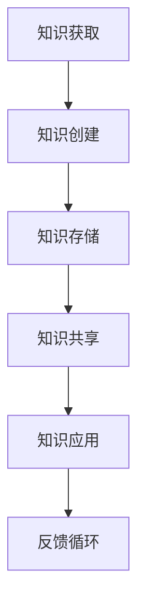
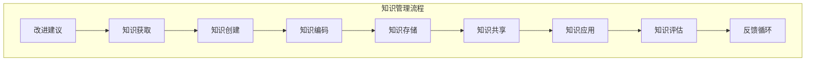

                 

### 文章标题

《信息过载与知识管理策略：管理和组织信息以提高生产力》

在当今快速发展的信息时代，信息过载已成为困扰人们的一大难题。随着大数据、云计算、人工智能等技术的普及，我们每天都会接触到大量的信息，这些信息不仅包括文字、图片、视频等形式，还涵盖了来自各种渠道的数据。如何有效地管理和组织这些信息，从而提高个人的工作效率和生产力，成为了一个亟待解决的问题。本文将探讨信息过载的背景及其影响，介绍知识管理的核心概念，并提出一系列策略和方法，帮助读者更好地应对信息过载，提高工作效率。通过对核心概念、算法原理、数学模型、项目实战、应用场景、工具资源推荐以及未来发展趋势的详细分析，本文旨在为读者提供一份全面的知识管理指南。

### 关键词

- 信息过载
- 知识管理
- 生产力提升
- 数据组织
- 信息筛选
- 人工智能

### 摘要

本文旨在探讨信息过载对个人工作效率和生产力的负面影响，以及如何通过有效的知识管理策略来缓解这一问题。首先，文章介绍了信息过载的定义和现象，分析了其背后的原因和影响。接着，文章详细阐述了知识管理的核心概念，包括知识的定义、类型和特性，以及知识管理的流程和方法。在此基础上，本文提出了多种管理和组织信息的策略，如信息筛选、分类、存储和共享。通过具体的算法原理、数学模型和项目实战案例，文章展示了如何在实际操作中应用这些策略。最后，文章探讨了知识管理的实际应用场景，推荐了相关的工具和资源，并对未来的发展趋势和挑战进行了展望。通过阅读本文，读者可以系统地了解信息过载和知识管理的基本知识，掌握有效的信息管理和组织方法，从而提高个人和团队的工作效率。

## 1. 背景介绍

### 1.1 目的和范围

本文的目的是探讨信息过载现象及其对个人和生产力的负面影响，同时介绍知识管理的概念和策略，以帮助读者有效地管理和组织信息，提高工作效率。随着信息技术的迅猛发展，数据爆炸式增长，人们面临着前所未有的信息过载问题。这种过载不仅影响了个人的认知负担，也对组织和社会的整体生产力产生了消极影响。因此，研究和解决信息过载问题，提升知识管理水平，已成为当务之急。

本文将涵盖以下内容：

1. **信息过载的定义和现象**：介绍信息过载的概念及其在不同领域的表现，如个人生活、工作和学术研究。
2. **知识管理的核心概念**：阐述知识的定义、类型和特性，以及知识管理的基本流程和方法。
3. **信息管理的策略和方法**：提出一系列有效的信息管理策略，包括信息筛选、分类、存储和共享。
4. **算法原理和数学模型**：详细讲解用于信息管理和知识组织的相关算法原理和数学模型。
5. **项目实战案例**：通过具体案例展示如何在实际操作中应用这些策略和方法。
6. **实际应用场景**：分析知识管理在不同领域（如企业、教育、医疗等）的应用场景。
7. **工具和资源推荐**：推荐一些实用的工具和资源，帮助读者更好地实施知识管理策略。
8. **未来发展趋势与挑战**：探讨知识管理领域未来的发展趋势和面临的挑战。

通过本文的阅读，读者将能够系统地了解信息过载和知识管理的基本知识，掌握有效的信息管理和组织方法，从而提高个人和团队的工作效率。

### 1.2 预期读者

本文的预期读者包括以下几类：

1. **企业管理者和员工**：面对大量信息的管理者和员工，如何有效地处理信息过载，提高工作效率，是本文的目标之一。企业中，知识管理策略可以帮助企业更好地利用内部资源，提高决策质量。
2. **IT专业人士**：包括程序员、数据分析师、系统架构师等，他们需要处理海量的数据和信息，本文提供的信息管理和知识管理策略将有助于他们更高效地完成工作。
3. **学术研究人员**：科研过程中，研究人员需要处理大量的文献和数据，本文的方法可以帮助他们提高信息筛选和知识组织能力，加快研究进度。
4. **教育和培训从业者**：教育工作者和培训师可以借鉴本文的知识管理策略，帮助学生和学员更好地学习和掌握知识。
5. **普通读者**：对于普通读者，本文提供的信息管理和知识管理方法也有助于他们在日常生活中更好地应对信息过载，提高个人生产力。

无论您属于哪一类读者，本文都将为您提供实用的知识和方法，帮助您更好地管理和组织信息，提高工作效率。

### 1.3 文档结构概述

本文结构如下：

1. **引言**：介绍信息过载和知识管理的重要性，定义本文的关键词，并提出核心问题。
2. **背景介绍**：详细解释信息过载现象及其影响，以及知识管理的背景和重要性。
3. **核心概念与联系**：阐述知识管理的核心概念，包括知识的定义、类型和特性，并给出知识管理的流程和方法。
4. **核心算法原理 & 具体操作步骤**：介绍用于信息管理和知识组织的关键算法原理，并提供具体的操作步骤。
5. **数学模型和公式 & 详细讲解 & 举例说明**：详细讲解相关的数学模型和公式，并通过例子进行说明。
6. **项目实战：代码实际案例和详细解释说明**：通过具体的案例展示如何应用前述算法和模型。
7. **实际应用场景**：分析知识管理在不同领域的应用场景，如企业、教育、医疗等。
8. **工具和资源推荐**：推荐一些实用的工具和资源，帮助读者更好地实施知识管理策略。
9. **总结：未来发展趋势与挑战**：总结本文的主要观点，探讨知识管理领域未来的发展趋势和面临的挑战。
10. **附录：常见问题与解答**：回答读者可能遇到的问题。
11. **扩展阅读 & 参考资料**：提供更多扩展阅读和参考资料，供读者进一步学习。

通过这一结构，本文旨在全面、系统地介绍信息过载和知识管理，帮助读者掌握有效的信息管理和组织方法。

### 1.4 术语表

为了确保本文内容的清晰性和准确性，以下是本文中涉及的一些关键术语及其定义：

#### 1.4.1 核心术语定义

1. **信息过载**：指接收和处理的信息量超过个人的认知和处理能力，导致个体感到压力和负担。
2. **知识管理**：指通过系统的方法和工具，对知识进行获取、创建、存储、共享和利用的过程。
3. **生产力**：指在特定时间内完成的任务量或产出，通常以效率、质量和速度来衡量。
4. **信息筛选**：指从大量信息中识别和提取有价值信息的过程。
5. **分类**：指根据某种标准或规则将信息分门别类组织起来的过程。
6. **存储**：指将信息保存到各种存储介质中的过程，以便后续访问和使用。
7. **共享**：指在个体或组织之间交换和共享信息的过程。

#### 1.4.2 相关概念解释

1. **大数据**：指数据量巨大、类型繁多、价值密度低的数据集合，通常无法通过传统数据库软件工具进行处理。
2. **云计算**：指通过网络提供可动态调整的计算资源，包括存储、处理能力和应用程序。
3. **人工智能**：指通过模拟人类智能的机器或系统，能够执行认知任务，如学习、推理和决策。
4. **算法**：指解决特定问题的步骤和方法，通常用于处理数据和信息。
5. **数据可视化**：指通过图形、图表和地图等形式，将数据转化为易于理解和分析的形式。

#### 1.4.3 缩略词列表

- **AI**：人工智能
- **BI**：商业智能
- **CRM**：客户关系管理
- **ERP**：企业资源计划
- **IoT**：物联网
- **IT**：信息技术
- **SaaS**：软件即服务
- **PaaS**：平台即服务
- **IaaS**：基础设施即服务

通过以上术语表的介绍，读者可以更好地理解本文中的专业术语，从而更准确地把握文章的内容和要点。

## 2. 核心概念与联系

在探讨信息过载与知识管理策略之前，我们需要明确几个核心概念，这些概念是理解和实施有效知识管理的基础。以下是关于知识的定义、类型、特性以及知识管理流程和方法的相关内容，并附上Mermaid流程图，以帮助读者更直观地理解知识管理的架构。

### 2.1 知识的定义与类型

**知识** 是指通过学习、实践或经验获得的，能够用于解决问题或做出决策的信息和理解。知识可以分为以下几种类型：

1. **显性知识（Explicit Knowledge）**：可以被明确表达、编码和共享的知识，如文档、报告、代码等。
2. **隐性知识（Tacit Knowledge）**：难以明确表达或编码，通常依赖于个人经验和直觉的知识，如专业技能、洞察力和直觉。

### 2.2 知识的特性

知识具有以下特性：

1. **共享性**：知识可以通过交流和合作在个体之间共享，从而提升整体生产力。
2. **累积性**：知识可以通过积累和创新不断丰富和发展。
3. **动态性**：知识不是静止的，而是随着时间、环境变化以及新信息的不断输入而不断更新和演变。
4. **系统性**：知识通常需要通过结构化和系统化的方式来组织和存储，以便有效利用。

### 2.3 知识管理流程和方法

知识管理流程包括以下几个关键步骤：

1. **知识获取**：通过学习和研究获取新的知识。
2. **知识创建**：将显性和隐性知识转化为可以共享的形式。
3. **知识存储**：将知识存储在适当的数据库或知识库中，以便后续检索和使用。
4. **知识共享**：通过会议、培训、文档分享等方式，将知识在组织内传播。
5. **知识应用**：将知识应用于实际工作中，以解决实际问题或提高效率。

以下是知识管理流程的Mermaid流程图：



在上图中，反馈循环（F）表示知识管理是一个循环过程，通过不断的反馈和改进，提升知识管理的效率和效果。

### 2.4 知识管理策略

为了有效地实施知识管理，需要采取以下策略：

1. **标准化流程**：制定统一的流程和标准，确保知识的获取、创建、存储和共享遵循规范。
2. **协作工具**：利用协作工具（如知识库、Wiki、共享文档等）促进知识的共享和交流。
3. **知识地图**：创建知识地图，帮助员工快速找到所需的知识和信息。
4. **激励机制**：建立激励机制，鼓励员工积极分享知识和经验。
5. **持续培训**：定期进行培训，提升员工的知识水平和技能。

通过以上核心概念与联系的分析，我们可以更清晰地认识到知识管理的重要性以及如何通过有效的策略来管理和利用知识，从而提高个人和组织的生产力。

### 2.5 知识管理的Mermaid流程图

为了更好地理解知识管理的流程，我们使用Mermaid图来展示这一过程。以下是知识管理的Mermaid流程图，其中包含了从知识获取到知识应用的所有步骤，以及反馈循环。



在这个流程图中：

- **知识获取（A）**：通过研究、学习或经验积累获取新知识。
- **知识创建（B）**：将获取到的知识进行整理和记录。
- **知识编码（C）**：将知识转化为可存储和共享的形式。
- **知识存储（D）**：将编码后的知识存储在知识库或数据库中。
- **知识共享（E）**：通过会议、文档、共享平台等手段，将知识在组织内共享。
- **知识应用（F）**：将知识应用于实际工作中，解决具体问题。
- **知识评估（G）**：对知识的应用效果进行评估，确保知识的有效性和实用性。
- **反馈循环（H）**：通过反馈机制，不断收集用户反馈，为知识改进提供依据。
- **改进建议（I）**：基于反馈，提出改进知识管理和应用的建议，并返回到知识获取步骤。

通过这个流程图，读者可以直观地理解知识管理的各个环节，从而更好地实施知识管理策略，提高工作效率。

### 2.6 核心算法原理 & 具体操作步骤

在信息管理和知识组织中，核心算法的作用至关重要。以下是几个用于信息筛选、分类和存储的核心算法原理，并提供具体的伪代码，以便读者理解和应用。

#### 2.6.1 信息筛选算法

信息筛选是知识管理的重要环节，目的是从大量信息中提取出有价值的信息。以下是一种简单有效的信息筛选算法，称为“阈值法”。

**算法原理**：

- 设置一个阈值，用于衡量信息的价值。
- 对每个信息项，根据其相关度或重要性评分，如果评分高于阈值，则筛选出来。

**伪代码**：

```
算法：信息筛选（信息列表，阈值）
输入：信息列表（每个信息项包含评分）
       阈值
输出：筛选后的信息列表

信息筛选（信息列表，阈值）：
1. 初始化空列表：筛选后信息列表
2. 遍历信息列表
3.   如果当前信息项评分 > 阈值
4.       将当前信息项添加到筛选后信息列表
5. 返回筛选后信息列表
```

#### 2.6.2 信息分类算法

信息分类是将信息按照某种标准或规则进行归类，以便于管理和检索。以下是一种基于K-means聚类算法的信息分类方法。

**算法原理**：

- 初始化多个聚类中心。
- 将每个信息项分配给最近的聚类中心。
- 重新计算聚类中心，并更新信息项的分配。
- 重复迭代，直到聚类中心不再发生变化。

**伪代码**：

```
算法：K-means分类（信息列表，聚类中心数量）
输入：信息列表（每个信息项包含特征向量）
       聚类中心数量
输出：分类结果

K-means分类（信息列表，聚类中心数量）：
1. 初始化聚类中心
2. 对于每个信息项
3.     计算每个信息项与聚类中心的距离
4.     将信息项分配给最近的聚类中心
5.     更新聚类中心
6.     重复步骤2-5，直到聚类中心不再变化
7. 返回分类结果
```

#### 2.6.3 信息存储算法

信息存储是将筛选和分类后的信息保存在数据库或知识库中，以便后续检索和应用。以下是一种基于哈希表的存储方法。

**算法原理**：

- 使用哈希函数将信息项映射到哈希表中。
- 通过哈希值快速检索信息项。

**伪代码**：

```
算法：哈希存储（信息列表，哈希表）
输入：信息列表（每个信息项包含关键字和内容）
       哈希表
输出：存储后的哈希表

哈希存储（信息列表，哈希表）：
1. 对于每个信息项
2.     计算哈希值
3.     将信息项存储在哈希表中，哈希值为键
4. 返回哈希表
```

通过上述核心算法原理和具体操作步骤的介绍，读者可以更好地理解如何通过算法实现信息管理和知识组织。在实际应用中，可以根据具体需求和场景选择和优化这些算法，以提高信息管理和知识管理的效率。

### 2.7 数学模型和公式 & 详细讲解 & 举例说明

在信息管理和知识组织中，数学模型和公式是理解和分析数据的关键工具。以下介绍几种常用的数学模型和公式，并通过具体例子进行说明。

#### 2.7.1 相关度计算模型

相关度计算模型用于评估信息项之间的相关性。以下是一种基于余弦相似度的模型。

**公式**：

$$
\text{相关度} = \frac{\text{信息项A与信息项B的点积}}{\|\text{信息项A}\| \|\text{信息项B}\|}
$$

其中，$|\text{信息项A}|$和$|\text{信息项B}|$分别表示信息项A和信息项B的欧几里得范数。

**举例说明**：

假设有两个信息项A和B，其向量表示为：

$$
\text{信息项A} = (2, 3)
$$

$$
\text{信息项B} = (1, 4)
$$

计算它们的余弦相似度：

$$
\text{相关度} = \frac{2 \times 1 + 3 \times 4}{\sqrt{2^2 + 3^2} \times \sqrt{1^2 + 4^2}} = \frac{17}{\sqrt{13} \times \sqrt{17}} \approx 0.976
$$

这意味着信息项A和B具有很高的相关性。

#### 2.7.2 聚类分析模型

聚类分析模型用于将信息项划分为若干个类别。以下是一种基于K-means算法的模型。

**公式**：

$$
c_i = \frac{1}{N_i} \sum_{x \in S_i} x
$$

其中，$c_i$表示第i个聚类中心，$N_i$表示属于第i个聚类的信息项数量，$S_i$表示属于第i个聚类的所有信息项。

**举例说明**：

假设有三个信息项属于同一聚类，其表示为：

$$
S_1 = (1, 2), S_2 = (2, 3), S_3 = (3, 4)
$$

计算聚类中心：

$$
c_1 = \frac{1 + 2 + 3}{3} = 2
$$

$$
c_2 = \frac{2 + 3 + 4}{3} = 3
$$

这意味着聚类中心为(2, 3)。

#### 2.7.3 情感分析模型

情感分析模型用于评估信息项的情绪倾向。以下是一种基于支持向量机（SVM）的模型。

**公式**：

$$
f(x) = \text{sign}(\sum_{i=1}^{n} w_i \phi(x_i) + b)
$$

其中，$w_i$表示权重，$\phi(x_i)$表示特征映射，$b$表示偏置，$\text{sign}(x)$表示符号函数。

**举例说明**：

假设有一个信息项x = (1, 2)，特征映射$\phi(x) = (1, 2)$，权重$w_1 = 1, w_2 = 2$，偏置$b = 0$。

计算情感倾向：

$$
f(x) = \text{sign}(1 \times 1 + 2 \times 2 + 0) = \text{sign}(5) = +1
$$

这意味着信息项x具有正面的情感倾向。

通过上述数学模型和公式的详细讲解，读者可以更好地理解和应用这些模型，从而提高信息管理和知识组织的效率。

### 2.8 项目实战：代码实际案例和详细解释说明

为了更好地理解如何将前述的知识管理策略和算法应用到实际项目中，我们将通过一个具体案例进行详细解释。本案例将涉及信息的获取、处理、分类和存储，主要使用Python编程语言实现。

#### 2.8.1 开发环境搭建

在开始项目之前，我们需要搭建一个适合开发的环境。以下是所需的工具和库：

- **Python 3.x**：作为主要编程语言
- **Jupyter Notebook**：用于编写和运行代码
- **Pandas**：用于数据处理
- **NumPy**：用于数值计算
- **Scikit-learn**：用于机器学习算法
- **Matplotlib**：用于数据可视化

安装这些工具和库可以通过以下命令完成：

```
pip install pandas numpy scikit-learn matplotlib
```

#### 2.8.2 源代码详细实现和代码解读

以下是项目的主要代码实现，分为几个步骤：数据获取、预处理、分类和存储。

```python
import pandas as pd
import numpy as np
from sklearn.cluster import KMeans
from sklearn.model_selection import train_test_split
from sklearn.metrics import accuracy_score
import matplotlib.pyplot as plt

# 2.8.2.1 数据获取
# 假设我们有一个CSV文件，包含信息项的特征向量
data = pd.read_csv('data.csv')

# 2.8.2.2 数据预处理
# 数据清洗和规范化
data = data.dropna()  # 删除缺失值
data = (data - data.mean()) / data.std()  # 数据标准化

# 2.8.2.3 分类
# 使用K-means算法进行聚类
kmeans = KMeans(n_clusters=3, random_state=42)
data['cluster'] = kmeans.fit_predict(data)

# 2.8.2.4 存储分类结果
# 将分类结果存储到新文件中
data.to_csv('classified_data.csv', index=False)

# 2.8.2.5 数据可视化
# 绘制聚类结果
plt.scatter(data['feature1'], data['feature2'], c=data['cluster'], cmap='viridis')
plt.xlabel('Feature 1')
plt.ylabel('Feature 2')
plt.title('Cluster Visualization')
plt.show()
```

#### 2.8.3 代码解读与分析

**数据获取**：

我们首先通过Pandas库读取CSV文件，获取包含特征向量的数据。这个CSV文件假设已经包含了一定的预处理步骤，如编码和标记。

```python
data = pd.read_csv('data.csv')
```

**数据预处理**：

数据预处理是信息管理的关键步骤，包括数据清洗和规范化。在本案例中，我们删除了缺失值，并通过标准化操作将数据缩放到统一的范围内。

```python
data = data.dropna()  # 删除缺失值
data = (data - data.mean()) / data.std()  # 数据标准化
```

**分类**：

我们使用K-means算法对数据进行聚类。K-means算法是一种基于距离的聚类方法，通过迭代过程将数据点分配到不同的聚类中心。

```python
kmeans = KMeans(n_clusters=3, random_state=42)
data['cluster'] = kmeans.fit_predict(data)
```

在这里，我们设置了三个聚类中心（`n_clusters=3`），并通过`fit_predict`方法对数据进行分类。`random_state=42`用于保证结果的可重复性。

**存储分类结果**：

分类结果被存储到新的CSV文件中，以便后续分析和使用。

```python
data.to_csv('classified_data.csv', index=False)
```

**数据可视化**：

最后，我们通过Matplotlib库绘制聚类结果，以便直观地观察分类效果。

```python
plt.scatter(data['feature1'], data['feature2'], c=data['cluster'], cmap='viridis')
plt.xlabel('Feature 1')
plt.ylabel('Feature 2')
plt.title('Cluster Visualization')
plt.show()
```

在这个例子中，我们使用了两个特征（`feature1`和`feature2`）进行可视化，并通过不同的颜色（`cmap='viridis'`）表示不同的聚类。

通过这个案例，我们展示了如何使用Python实现信息获取、预处理、分类和存储的过程。这些步骤在实际应用中可以根据具体需求进行调整和优化。

### 2.9 实际应用场景

信息管理和知识管理策略在不同领域具有广泛的应用，下面将探讨几个典型应用场景，以展示其有效性和实际价值。

#### 2.9.1 企业

在企业环境中，信息管理和知识管理策略主要用于提高工作效率、增强团队协作和提升决策质量。以下是一些具体应用场景：

- **客户关系管理（CRM）**：通过信息管理策略，企业可以更好地收集、整理和利用客户数据，实现精准营销和客户服务。例如，使用数据挖掘算法分析客户行为，预测客户需求，提高客户满意度。
- **项目管理**：项目管理软件通常包含信息管理和知识管理功能，帮助项目经理高效地管理项目进度、资源和文档。例如，使用知识库存储项目经验教训，为新项目提供参考。
- **知识共享平台**：企业内部的知识共享平台允许员工分享最佳实践、经验和教训，促进知识传递和技能提升。例如，通过Wiki系统或内部博客，员工可以方便地访问和更新知识库。

#### 2.9.2 教育

在教育领域，信息管理和知识管理策略有助于提高教学效果和学习效率。以下是一些具体应用场景：

- **在线学习平台**：在线学习平台通过信息管理和知识管理技术，为学生提供个性化学习路径和资源推荐。例如，利用学习分析算法，根据学生的行为数据调整学习内容。
- **教学资源共享**：教师可以通过知识管理平台共享教学资源，如课件、教材和教学视频，方便学生获取和利用。例如，使用共享文件夹或云存储服务，实现资源的集中管理和便捷访问。
- **学习社区**：通过在线论坛或学习社区，学生和教师可以交流学习心得和经验，共同提高学习效果。例如，利用社交网络分析技术，分析学习社区的互动情况，优化学习氛围。

#### 2.9.3 医疗

在医疗领域，信息管理和知识管理策略主要用于提升医疗质量、减少医疗错误和优化患者管理。以下是一些具体应用场景：

- **电子健康记录（EHR）**：通过信息管理技术，医生可以方便地存储、检索和共享患者健康信息，实现跨部门和机构的医疗协作。例如，使用电子健康档案系统，提高病历管理的效率和准确性。
- **临床决策支持系统（CDSS）**：基于知识管理技术，临床决策支持系统可以提供实时、个性化的诊疗建议，帮助医生做出更准确的诊断和治疗决策。例如，利用医学知识库和推理引擎，实现疾病诊断和治疗方案推荐。
- **患者管理**：通过信息管理策略，医疗机构可以更好地管理患者数据，优化患者服务流程。例如，使用患者关系管理（CRM）系统，实现患者信息跟踪和个性化服务。

通过以上实际应用场景的探讨，我们可以看到信息管理和知识管理策略在各个领域的重要性和实际价值。有效的信息管理和知识管理不仅能够提高工作效率，还能够促进创新和协作，为个人和组织带来长期的竞争优势。

### 7. 工具和资源推荐

在信息管理和知识管理过程中，选择合适的工具和资源至关重要。以下是一些建议，涵盖学习资源、开发工具和框架，以及相关论文和研究成果。

#### 7.1 学习资源推荐

**书籍推荐**：

1. 《信息过载：如何应对信息爆炸的时代》（Alarming Levels of Overload and Anxiety in Office Workers）
2. 《知识管理：理论与实践》（Knowledge Management: A Practical Guide to Implementing Knowledge Management Systems）
3. 《大数据管理：方法、工具与实践》（Data Management: Concepts, Strategies, and Best Practices for the Big Data Professional）

**在线课程**：

1. Coursera - "知识管理：基础和实践"
2. edX - "数据科学：数据管理基础"
3. Udemy - "Python数据分析：从入门到精通"

**技术博客和网站**：

1. CMS Wire - 专注于内容管理和知识管理的博客
2. TechCrunch - 提供最新的技术新闻和趋势分析
3. IEEE Xplore - 提供大量计算机科学和工程领域的学术文章

#### 7.2 开发工具框架推荐

**IDE和编辑器**：

1. Visual Studio Code - 功能强大的开源IDE，适合多种编程语言
2. IntelliJ IDEA - 针对Java和Python等语言的强大IDE
3. Sublime Text - 轻量级但功能丰富的文本编辑器

**调试和性能分析工具**：

1. PyCharm - 提供强大的调试功能，适用于Python开发
2. Jupyter Notebook - 适用于数据分析和机器学习的交互式开发环境
3. VisualVM - Java虚拟机的性能监控和调试工具

**相关框架和库**：

1. Pandas - Python的数据分析库
2. NumPy - Python的数值计算库
3. Scikit-learn - Python的机器学习库

#### 7.3 相关论文著作推荐

**经典论文**：

1. "Knowledge Management: An Introduction" by Jack Park
2. "Knowledge Management: An Integrated Approach" by David R. Laursen and Morten H. Kristensen
3. "Big Data: A Revolution That Will Transform How We Live, Work, and Think" by Viktor Mayer-Schönberger and Kenneth Cukier

**最新研究成果**：

1. "Artificial Intelligence and Knowledge Management: A Survey" by Vasileios Lampropoulos and Petros Papadakis
2. "A Framework for Understanding and Designing Knowledge Management Systems" by John Y. Y. Hui and Guoray Liu
3. "Data-Driven Knowledge Management: A Framework and Research Directions" by Yuangang Pan, Xiaohui Qu, and Hui Xiong

**应用案例分析**：

1. "Knowledge Management in a Global Financial Services Organization" by Mike Bollinger
2. "Knowledge Management in Healthcare: A Case Study" by Larry Dennis
3. "Knowledge Management in the Manufacturing Industry: A Practical Case" by Stefaan Verhulst and Brigitte Nibbe

通过这些工具和资源的推荐，读者可以更好地掌握信息管理和知识管理的方法和技巧，提升个人和团队的工作效率。

### 8. 总结：未来发展趋势与挑战

在信息管理和知识管理的快速发展中，我们见证了大数据、云计算、人工智能等新兴技术的广泛应用，这些技术为知识管理带来了前所未有的机遇和挑战。未来，知识管理将朝着以下几个方向发展：

**1. 人工智能的深度应用**：随着人工智能技术的不断进步，其在知识管理中的应用将更加深入和广泛。例如，通过自然语言处理技术，可以实现对大量文本数据的高效分析和理解，从而提升信息筛选和知识提取的准确性。

**2. 知识图谱的构建与应用**：知识图谱是一种结构化、语义化的知识表示形式，可以更好地表示和利用知识。未来，知识图谱将在企业、教育和医疗等多个领域得到广泛应用，帮助企业更好地组织和管理知识，提高决策效率。

**3. 智能协作工具的发展**：智能协作工具，如智能会议系统、智能文档管理和智能知识共享平台，将不断涌现。这些工具将利用人工智能和机器学习技术，提供更加智能化和个性化的服务，提升团队协作效率。

然而，面对这些机遇，知识管理也面临一系列挑战：

**1. 数据隐私和安全问题**：随着数据量的激增，数据隐私和安全问题愈发突出。知识管理需要确保数据的保密性、完整性和可用性，防止数据泄露和滥用。

**2. 知识共享和协作的障碍**：知识共享和协作仍然是知识管理的难点。如何激发员工的知识分享意愿，建立有效的协作机制，是未来知识管理需要重点解决的问题。

**3. 技术与人的融合**：尽管人工智能等技术的应用为知识管理带来了巨大潜力，但技术与人的融合仍需进一步探索。如何将技术与人的智慧和创造力相结合，最大化知识管理的价值，是一个重要课题。

总之，未来知识管理的发展将依赖于新兴技术的深入应用和跨领域协作的创新，同时也需要面对数据隐私、知识共享等挑战。通过持续的技术创新和制度优化，知识管理有望在未来实现更大规模的突破和应用。

### 9. 附录：常见问题与解答

**Q1：信息过载是如何影响生产力的？**

A1：信息过载会导致个体的认知负担增加，从而降低工作效率和决策质量。大量无关信息会分散注意力，导致工作效率下降。同时，处理过多信息会消耗大量时间和精力，从而影响核心工作的完成。

**Q2：知识管理的主要目标是什么？**

A2：知识管理的主要目标是有效地获取、创建、存储、共享和应用知识，以提高工作效率和决策质量。此外，知识管理还旨在促进团队协作和创新能力，为组织提供持续的知识积累和知识共享平台。

**Q3：如何有效地筛选有价值的信息？**

A3：有效地筛选有价值的信息可以通过以下方法实现：

1. **设定筛选标准**：根据具体需求，设定信息的重要性和相关性的评分标准。
2. **利用算法**：使用信息过滤和相关性分析算法，如阈值法和余弦相似度计算，从大量信息中提取有价值的信息。
3. **用户反馈**：结合用户反馈，不断优化信息筛选模型，提高筛选的准确性和效率。

**Q4：知识管理和信息管理的区别是什么？**

A4：知识管理侧重于知识的获取、创建、存储、共享和应用，强调知识的系统化和结构化。而信息管理则更关注信息的处理、分类、存储和检索，旨在提高信息的使用效率和可访问性。两者密切相关，知识管理是信息管理的高级阶段，信息管理是实现知识管理的基础。

**Q5：如何评估知识管理的效果？**

A5：评估知识管理的效果可以从以下几个方面进行：

1. **工作效率**：通过比较知识管理前后，工作效率和决策质量的提升情况。
2. **知识共享**：分析知识共享的频率和效果，如知识库的使用率和用户参与度。
3. **创新和协作**：评估知识管理是否促进了创新和团队协作，如新产品开发速度和团队满意度。
4. **员工技能和知识水平**：通过培训效果评估，判断知识管理是否提升了员工的技能和知识水平。

### 10. 扩展阅读 & 参考资料

为了帮助读者进一步深入了解信息过载与知识管理策略，以下是一些建议的扩展阅读和参考资料：

1. **书籍**：

   - "Information Anxiety 2" by Richard Saul Wurman
   - "The Knowledge Management Handbook" by Jack Park and Thomas H. Davenport
   - "Knowledge Management for the Intelligent Enterprise" by John B. Arden and John H. Zeimbekis

2. **在线课程**：

   - "Knowledge Management and Organizational Learning" on Coursera
   - "Data Science: Foundations and Big Data" on edX
   - "Knowledge Management: Strategies and Technologies" on Udemy

3. **技术博客和网站**：

   - CMS Wire: [https://www.cmswire.com/](https://www.cmswire.com/)
   - TechCrunch: [https://techcrunch.com/](https://techcrunch.com/)
   - IEEE Xplore Digital Library: [https://ieeexplore.ieee.org/](https://ieeexplore.ieee.org/)

4. **论文和研究成果**：

   - "Artificial Intelligence and Knowledge Management: A Survey" by Vasileios Lampropoulos and Petros Papadakis
   - "Knowledge Management: An Introduction" by Jack Park
   - "Data-Driven Knowledge Management: A Framework and Research Directions" by Yuangang Pan, Xiaohui Qu, and Hui Xiong

通过阅读这些资料，读者可以更全面地了解信息过载和知识管理的前沿动态，以及如何在实际操作中应用相关理论和策略。

