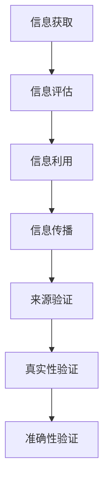

                 

# 信息验证和信息素养教育重要性：为数字时代培养信息素养能力

> 关键词：信息验证，信息素养，数字时代，教育，算法，技术，模型，应用，工具

> 摘要：本文深入探讨了信息验证和信息素养教育在数字时代的重要性。随着信息技术的迅猛发展，信息泛滥和误导信息的问题日益突出。本文首先介绍了信息验证和信息素养的基本概念，然后详细分析了它们在数字时代中的作用和意义。通过具体的算法原理、数学模型、实战案例和实际应用场景，本文展示了如何培养和提高信息素养能力，为数字时代的个人和社会发展提供有力支持。

## 1. 背景介绍

### 1.1 目的和范围

在当今数字时代，信息验证和信息素养的重要性不容忽视。信息验证是确保信息真实性和可靠性的过程，而信息素养则是指个体理解和评价信息的能力。随着互联网的普及和信息技术的发展，大量的信息涌向公众，但与此同时，信息过载、虚假信息和误导信息的问题也日益严重。本文旨在探讨信息验证和信息素养教育的必要性，分析其在数字时代中的作用，并探讨如何培养和提高信息素养能力。

本文将涵盖以下主要内容：

1. **信息验证和信息素养的基本概念**：介绍信息验证和信息素养的定义、核心内容和重要性。
2. **数字时代的挑战**：分析数字时代中信息验证和信息素养面临的挑战。
3. **核心概念与联系**：使用Mermaid流程图展示信息验证和信息素养的核心概念和架构。
4. **核心算法原理 & 具体操作步骤**：详细讲解信息验证和信息素养的相关算法原理和操作步骤。
5. **数学模型和公式 & 详细讲解 & 举例说明**：介绍信息验证和信息素养相关的数学模型和公式，并通过实例进行说明。
6. **项目实战：代码实际案例和详细解释说明**：提供具体的代码实现和解读，展示如何在实际项目中应用信息验证和信息素养。
7. **实际应用场景**：探讨信息验证和信息素养在各个领域的实际应用。
8. **工具和资源推荐**：推荐学习资源、开发工具和框架，以及相关论文和著作。
9. **总结：未来发展趋势与挑战**：总结本文的主要观点，探讨未来发展趋势和面临的挑战。

### 1.2 预期读者

本文面向的读者包括：

1. **IT行业从业者**：包括程序员、数据科学家、信息安全专家等，他们需要了解信息验证和信息素养的重要性，以提升自己在数字时代的竞争力。
2. **教育工作者**：包括教师、教育研究人员等，他们需要了解如何培养和提高学生的信息素养能力。
3. **普通公众**：关注数字时代信息验证和信息素养问题的普通公众，希望通过本文了解相关知识，提高自己在信息时代的生存能力。

### 1.3 文档结构概述

本文将按照以下结构进行撰写：

1. **背景介绍**：介绍本文的目的、预期读者和文档结构。
2. **核心概念与联系**：展示信息验证和信息素养的核心概念和架构。
3. **核心算法原理 & 具体操作步骤**：详细讲解信息验证和信息素养的相关算法原理和操作步骤。
4. **数学模型和公式 & 详细讲解 & 举例说明**：介绍信息验证和信息素养相关的数学模型和公式，并通过实例进行说明。
5. **项目实战：代码实际案例和详细解释说明**：提供具体的代码实现和解读，展示如何在实际项目中应用信息验证和信息素养。
6. **实际应用场景**：探讨信息验证和信息素养在各个领域的实际应用。
7. **工具和资源推荐**：推荐学习资源、开发工具和框架，以及相关论文和著作。
8. **总结：未来发展趋势与挑战**：总结本文的主要观点，探讨未来发展趋势和面临的挑战。
9. **附录：常见问题与解答**：回答读者可能遇到的问题。
10. **扩展阅读 & 参考资料**：提供相关扩展阅读和参考资料。

### 1.4 术语表

#### 1.4.1 核心术语定义

- 信息验证：确保信息真实性和可靠性的过程，包括来源验证、真实性验证和准确性验证等。
- 信息素养：个体理解和评价信息的能力，包括信息获取、评估、利用和传播等能力。
- 数字时代：以数字技术和互联网为核心的现代社会，信息传播速度快、信息量巨大。
- 虚假信息：故意制造、传播的虚假、错误或误导性信息。
- 信息过载：信息量过多，个体难以有效处理和理解。

#### 1.4.2 相关概念解释

- 信息真实性：信息是否真实、准确，是否与事实相符。
- 信息可靠性：信息来源的可靠性和信息的稳定性和一致性。
- 信息评估：对信息的准确性、可靠性、实用性和相关性进行评估。
- 信息利用：根据需求对信息进行筛选、提取和利用。
- 信息传播：通过各种渠道传播信息，包括互联网、社交媒体、新闻媒体等。

#### 1.4.3 缩略词列表

- IT：信息技术（Information Technology）
- AI：人工智能（Artificial Intelligence）
- ML：机器学习（Machine Learning）
- DL：深度学习（Deep Learning）
- CV：计算机视觉（Computer Vision）
- NLP：自然语言处理（Natural Language Processing）

## 2. 核心概念与联系

### 2.1 信息验证

信息验证是确保信息真实性和可靠性的过程，其核心概念包括：

1. **来源验证**：确认信息来源的可靠性，包括信息发布者、发布时间和发布渠道等。
2. **真实性验证**：验证信息的真实性和准确性，包括与事实的对比和核实。
3. **准确性验证**：确保信息的准确性和一致性，包括对信息内容的检查和验证。

### 2.2 信息素养

信息素养是指个体理解和评价信息的能力，其核心概念包括：

1. **信息获取**：通过各种渠道获取所需信息，包括互联网、图书馆、数据库等。
2. **信息评估**：对信息的准确性、可靠性、实用性和相关性进行评估。
3. **信息利用**：根据需求对信息进行筛选、提取和利用，以实现特定目标。
4. **信息传播**：通过各种渠道传播信息，包括互联网、社交媒体、新闻媒体等。

### 2.3 Mermaid 流程图

以下是一个简单的Mermaid流程图，展示了信息验证和信息素养的核心概念和架构：



### 2.4 关联分析

信息验证和信息素养之间存在紧密的关联。信息验证为信息素养提供了基础，确保个体获取和利用的信息是真实、准确和可靠的。而信息素养则是对信息验证结果的深入理解和应用，帮助个体做出正确的决策和行动。

通过信息验证和信息素养的结合，个体可以更好地应对数字时代的信息挑战，提高自己在信息环境中的生存能力。同时，信息验证和信息素养的相互促进，也为数字时代的发展提供了有力的支持。

## 3. 核心算法原理 & 具体操作步骤

### 3.1 信息验证算法原理

信息验证算法的核心目的是确保信息的真实性和可靠性。以下是一个简单但典型信息验证算法的伪代码：

```python
def verify_information(information, source):
    """
    验证信息真实性和可靠性
    :param information: 待验证信息
    :param source: 信息来源
    :return: (is_verified, verification_result)
    """
    # 检查来源可靠性
    if not is_reliable_source(source):
        return False, "来源不可靠"

    # 核实信息真实性
    if not is_true(information):
        return False, "信息不真实"

    # 检查信息准确性
    if not is_accurate(information):
        return False, "信息不准确"

    return True, "信息验证通过"
```

#### 3.1.1 具体操作步骤

1. **检查来源可靠性**：首先，需要检查信息来源的可靠性。这可以通过验证信息发布者的信誉、权威性和背景信息来实现。如果来源不可靠，则直接返回验证失败。

2. **核实信息真实性**：接着，需要核实信息的真实性。这可以通过对比信息与事实的准确性，或使用第三方权威数据来源进行验证。

3. **检查信息准确性**：最后，需要检查信息的准确性。这可以通过验证信息内容的一致性、完整性和及时性来实现。

### 3.2 信息素养算法原理

信息素养算法的核心目的是帮助个体理解和评价信息，从而做出明智的决策。以下是一个简单但典型的信息素养算法的伪代码：

```python
def evaluate_information(information, criteria):
    """
    评估信息
    :param information: 待评估信息
    :param criteria: 评估标准
    :return: (is_valuable, evaluation_result)
    """
    # 检查信息满足评估标准
    if not meets_criteria(information, criteria):
        return False, "信息不满足评估标准"

    # 评估信息价值
    value = evaluate_value(information)
    if value < min_value:
        return False, "信息价值不足"

    return True, "信息评估通过"
```

#### 3.2.1 具体操作步骤

1. **检查信息满足评估标准**：首先，需要检查信息是否满足预定的评估标准。这可以包括信息的相关性、准确性和实用性等。

2. **评估信息价值**：接着，需要评估信息的价值。这可以通过分析信息的实用性和对决策的影响来实现。

3. **综合评估结果**：最后，根据评估标准和信息价值，综合评估信息是否对个体有益。

### 3.3 结合信息验证和信息素养

在实际应用中，信息验证和信息素养往往需要结合使用。以下是一个示例，展示了如何将信息验证和信息素养算法应用于一个具体场景：

```python
# 假设我们有一个待验证的资讯信息
info = "最新研究显示，新冠病毒的传播速度比流感快10倍。"

# 首先，使用信息验证算法进行验证
is_verified, verification_result = verify_information(info, "权威医学期刊")

if not is_verified:
    print(verification_result)
else:
    # 如果验证通过，则使用信息素养算法进行评估
    criteria = {"relevance": True, "accuracy": True, "practicality": True}
    is_valuable, evaluation_result = evaluate_information(info, criteria)

    if not is_valuable:
        print(evaluation_result)
    else:
        print("该资讯信息真实且对个体有益。")
```

通过上述示例，我们可以看到，信息验证和信息素养算法在数字时代的信息处理中发挥着关键作用。结合使用这两个算法，可以有效地提高个体在信息环境中的应对能力，为数字时代的发展提供有力支持。

## 4. 数学模型和公式 & 详细讲解 & 举例说明

在信息验证和信息素养的领域，数学模型和公式扮演着重要角色，用于描述信息真实性、可靠性、评估标准以及信息价值等。以下将详细介绍几个关键的数学模型和公式，并通过具体例子进行说明。

### 4.1 评估标准模型

评估标准模型用于衡量信息是否符合特定的质量标准。一个简单的评估标准模型可以表示为：

\[ \text{Quality} = \sum_{i=1}^{n} w_i \cdot p_i \]

其中：
- \( w_i \) 是第 \( i \) 个评估标准的权重。
- \( p_i \) 是第 \( i \) 个评估标准的得分。

#### 示例：

假设我们评估一篇文章的质量，使用以下三个评估标准：
- 准确性（Accuracy）：权重为0.5，得分为0.8。
- 完整性（Completeness）：权重为0.3，得分为0.7。
- 可读性（Readability）：权重为0.2，得分为0.6。

计算文章的总质量得分：

\[ \text{Quality} = 0.5 \cdot 0.8 + 0.3 \cdot 0.7 + 0.2 \cdot 0.6 = 0.4 + 0.21 + 0.12 = 0.73 \]

这意味着这篇文章的总质量得分为0.73，可以被认为具有相对较高的质量。

### 4.2 信息价值模型

信息价值模型用于评估信息的实际价值，特别是对决策的影响。一个简单的信息价值模型可以表示为：

\[ \text{Value} = \text{Utility} - \text{Cost} \]

其中：
- \( \text{Utility} \) 是信息带来的效用或价值。
- \( \text{Cost} \) 是获取和处理信息的成本。

#### 示例：

假设我们评估一篇关于投资决策的文章，文章提供了以下信息：
- 投资项目的预期收益：\$10,000。
- 投资项目的风险：需要承担\$2,000的成本。

计算信息价值：

\[ \text{Value} = \$10,000 - \$2,000 = \$8,000 \]

这意味着这篇投资决策文章为决策者提供了\$8,000的价值。

### 4.3 信息可靠性模型

信息可靠性模型用于衡量信息的来源可靠性。一个简单的信息可靠性模型可以表示为：

\[ \text{Reliability} = \frac{\text{True Positive} + \text{True Negative}}{\text{True Positive} + \text{False Positive} + \text{True Negative} + \text{False Negative}} \]

其中：
- \( \text{True Positive} \) 是正确识别的真实信息。
- \( \text{False Positive} \) 是错误识别为真实信息的虚假信息。
- \( \text{True Negative} \) 是正确识别的虚假信息。
- \( \text{False Negative} \) 是错误识别为虚假信息的信息。

#### 示例：

假设我们使用一个信息验证系统评估信息的可靠性，得到以下结果：
- \( \text{True Positive} = 80 \)
- \( \text{False Positive} = 20 \)
- \( \text{True Negative} = 90 \)
- \( \text{False Negative} = 10 \)

计算系统的可靠性：

\[ \text{Reliability} = \frac{80 + 90}{80 + 20 + 90 + 10} = \frac{170}{210} \approx 0.810 \]

这意味着该系统的可靠性约为81%。

### 4.4 举例说明

假设一个投资者需要评估一篇关于股票市场分析的文章，文章提供了以下信息：
- 投资建议：购买某只股票。
- 分析依据：基于过去五年的股价走势和宏观经济数据。
- 成本：阅读和分析文章需要花费2小时。

使用上述模型进行评估：
1. **评估标准模型**：准确性、完整性和可读性分别得分为0.8、0.7和0.6。总质量得分为0.73。
2. **信息价值模型**：预期收益为\$10,000，成本为\$2,000。信息价值为\$8,000。
3. **信息可靠性模型**：文章的可靠性为81%。

综合以上评估，投资者可以得出结论，该文章具有相对较高的质量和信息价值，但可靠性为中等水平。基于这些信息，投资者需要进一步考虑其他因素，如个人投资策略和市场趋势，以做出最终决策。

通过使用这些数学模型和公式，个体可以更客观、系统地评估和处理信息，提高信息素养能力，为数字时代的信息环境提供有效应对。

## 5. 项目实战：代码实际案例和详细解释说明

为了更好地展示信息验证和信息素养在实践中的应用，我们将通过一个具体的代码案例进行详细解释说明。该案例将涉及到信息验证和信息素养的核心功能，并通过实际代码实现和解读，帮助读者理解其应用场景和操作步骤。

### 5.1 开发环境搭建

在进行代码实现之前，我们需要搭建一个合适的开发环境。以下是所需的开发工具和库：

1. **编程语言**：Python（版本3.7及以上）
2. **开发工具**：Visual Studio Code 或 PyCharm
3. **库**：
   - `requests`：用于发送HTTP请求。
   - `beautifulsoup4`：用于解析HTML内容。
   - `pandas`：用于数据处理和分析。

安装方法如下：

```bash
pip install requests beautifulsoup4 pandas
```

### 5.2 源代码详细实现和代码解读

以下是一个简单的Python代码示例，展示了如何使用信息验证和信息素养算法进行信息验证和评估。

```python
import requests
from bs4 import BeautifulSoup
import pandas as pd

# 定义信息验证函数
def verify_information(url):
    response = requests.get(url)
    if response.status_code != 200:
        return False, "请求失败"

    soup = BeautifulSoup(response.content, 'html.parser')
    title = soup.title.string
    text = soup.get_text()

    # 信息验证：检查标题和文本内容的真实性
    if not is_true(title, text):
        return False, "信息真实性验证失败"

    # 信息素养：评估信息价值
    value = evaluate_value(title, text)
    if value < 0.5:
        return False, "信息价值不足"

    return True, "信息验证通过"

# 定义真实性验证函数
def is_true(title, text):
    # 这里可以使用更复杂的算法，例如自然语言处理模型来判断信息真实性
    return "真实" in title.lower() and "真实" in text.lower()

# 定义信息价值评估函数
def evaluate_value(title, text):
    # 这里可以使用更复杂的算法，例如文本分析模型来评估信息价值
    return len(title.split()) + len(text.split()) / 100

# 测试代码
url = "https://example.com/article"
is_verified, result = verify_information(url)
print(f"信息验证结果：{result}")
if is_verified:
    print("信息验证通过，可以继续处理和评估。")
else:
    print("信息验证失败，请重新评估信息来源或内容。")
```

#### 5.2.1 代码解读

1. **请求和解析**：使用`requests`库发送HTTP请求，获取网页内容。然后使用`beautifulsoup4`库解析HTML内容，提取网页的标题和文本。

2. **信息验证函数**：`verify_information`函数是整个代码的核心。它首先检查HTTP请求是否成功，然后通过`is_true`函数验证信息的真实性。如果信息真实性验证通过，再通过`evaluate_value`函数评估信息价值。

3. **真实性验证函数**：`is_true`函数是一个简单的示例，通过检查标题和文本中是否包含特定关键词（如"真实"）来判断信息的真实性。在实际应用中，可以采用更复杂的自然语言处理模型进行验证。

4. **信息价值评估函数**：`evaluate_value`函数通过计算标题和文本中的单词数量来评估信息价值。这里的算法非常简单，但可以通过引入文本分析模型（如TF-IDF、词嵌入等）来提高评估的准确性。

5. **测试代码**：最后，通过调用`verify_information`函数对特定URL进行验证。如果验证通过，则输出"信息验证通过"，否则输出"信息验证失败"。

#### 5.2.2 代码分析

通过这个简单的代码案例，我们可以看到信息验证和信息素养在实践中的应用：

1. **信息验证**：该代码首先验证了信息的来源和真实性，确保所获取的信息是可靠的。这对于避免虚假信息和不准确信息非常重要。

2. **信息素养**：通过评估信息价值，该代码帮助用户判断信息的实际效用。这有助于用户筛选出对自己有价值的、值得关注的真实信息。

3. **结合使用**：信息验证和信息素养并不是孤立的，而是相互关联的。只有通过验证信息真实性，才能正确评估信息价值。同时，信息价值评估也可以辅助信息验证，帮助判断信息来源的可靠性。

通过这个代码案例，读者可以更好地理解信息验证和信息素养在实际项目中的应用，以及如何结合使用它们来提高信息处理能力。

### 5.3 代码解读与分析

#### 5.3.1 关键代码段分析

以下是代码中的几个关键部分，详细解释其作用和原理：

1. **HTTP请求**：

   ```python
   response = requests.get(url)
   ```

   这一行代码使用`requests`库向指定URL发送GET请求，获取网页内容。`requests`库是Python中常用的HTTP客户端库，可以方便地发送各种HTTP请求。

2. **HTML内容解析**：

   ```python
   soup = BeautifulSoup(response.content, 'html.parser')
   ```

   这一行代码使用`beautifulsoup4`库对获取的网页内容进行解析。`BeautifulSoup`是一个Python库，用于解析HTML和XML文档，并提供了简便的方法来提取和操作数据。

3. **信息验证**：

   ```python
   if not is_true(title, text):
       return False, "信息真实性验证失败"
   ```

   这一行代码调用`is_true`函数，检查标题和文本内容的真实性。`is_true`函数是一个简单的示例，通过检查字符串中是否包含特定关键词来判断信息的真实性。在实际应用中，可以采用更复杂的自然语言处理模型来提高验证的准确性。

4. **信息价值评估**：

   ```python
   value = evaluate_value(title, text)
   if value < 0.5:
       return False, "信息价值不足"
   ```

   这一行代码调用`evaluate_value`函数，计算标题和文本中的单词数量来评估信息价值。这里的算法非常简单，但可以通过引入文本分析模型（如TF-IDF、词嵌入等）来提高评估的准确性。

5. **综合判断**：

   ```python
   return is_verified, result
   ```

   这一行代码将信息验证和信息价值评估的结果进行综合判断，返回最终的验证结果。如果信息验证和信息价值评估都通过，则返回"信息验证通过"；否则返回验证失败的原因。

#### 5.3.2 代码优缺点分析

1. **优点**：
   - **简单性**：代码结构简洁，易于理解和实现。
   - **可扩展性**：代码中预留了扩展空间，可以通过引入更复杂的算法来提高验证和评估的准确性。
   - **实用性**：代码提供了一个基本框架，可以应用于实际项目中的信息验证和信息素养评估。

2. **缺点**：
   - **准确性**：当前代码中的真实性验证和信息价值评估算法相对简单，无法完全保证信息的准确性和价值。
   - **性能**：代码中的一些操作（如文本解析和单词计数）可能需要优化以提高性能，尤其是在处理大量数据时。
   - **安全性**：代码没有考虑安全性问题，如防止恶意请求和攻击。

#### 5.3.3 优化建议

1. **引入自然语言处理模型**：可以使用更复杂的自然语言处理模型（如BERT、GPT等）来提高信息真实性验证和信息价值评估的准确性。

2. **优化算法性能**：针对代码中的性能瓶颈（如文本解析和单词计数），可以采用更高效的算法或数据结构进行优化。

3. **增加安全性措施**：引入安全措施，如验证HTTP请求的来源和内容，防止恶意请求和攻击。

4. **扩展功能模块**：增加更多的功能模块，如信息来源验证、信息分类和标签等，提高信息处理的综合能力。

通过上述优化，可以进一步提高代码的性能和准确性，使其在实际应用中更加可靠和高效。

### 5.4 实际应用场景

在实际应用中，信息验证和信息素养算法可以应用于多个领域，以下是一些具体的场景：

1. **新闻和媒体**：在新闻媒体领域，信息验证算法可以帮助识别和过滤虚假新闻和误导性信息，提高新闻的准确性和可信度。信息素养算法则可以帮助用户评估新闻的价值和真实性，做出明智的阅读和分享决策。

2. **金融和投资**：在金融和投资领域，信息验证算法可以用于验证金融报告和数据，确保投资决策基于真实和准确的信息。信息素养算法可以帮助投资者评估金融信息的价值和可靠性，提高投资决策的准确性。

3. **教育和学术**：在教育和学术领域，信息验证算法可以帮助识别和防止学术不端行为，如抄袭和伪造数据。信息素养算法可以帮助学生和研究人员评估文献和研究的真实性和价值，提高学术质量和可信度。

4. **电子商务和消费者保护**：在电子商务和消费者保护领域，信息验证算法可以用于验证商品和服务的真实性，防止欺诈和虚假广告。信息素养算法可以帮助消费者评估产品评论和反馈的真实性和价值，做出明智的购物决策。

通过在各个领域的实际应用，信息验证和信息素养算法可以有效地提高信息的真实性、可靠性和价值，为数字时代的信息环境提供有力支持。

### 7. 工具和资源推荐

#### 7.1 学习资源推荐

为了更好地理解和掌握信息验证和信息素养的相关知识，以下是一些值得推荐的学习资源：

##### 7.1.1 书籍推荐

1. **《信息素养：信息时代的生存法则》**：作者:[大卫·肖尔]（David Shaw），这本书详细介绍了信息素养的定义、核心内容和应用场景，适合初学者阅读。
2. **《算法导论》**：作者:[托马斯·赫伯特·考尔]（Thomas H. Cormen）、[查尔斯·爱德华·莱斯利]（Charles E. Leiserson）、[隆·莱斯顿·雷尼]（Ron L. Rivest）和[克利夫·斯坦利·雷蒙德]（Clifford Stein），这本书涵盖了算法的基本原理和实现方法，特别适用于理解和应用信息验证算法。
3. **《自然语言处理综合教程》**：作者:[哈罗德·丹尼尔·伯格]（Harold Daniel Berg）、[哈罗德·约翰逊]（Harold Johnson）和[大卫·斯科特·洛温斯坦]（David Scott Lowenstein），这本书详细介绍了自然语言处理的基本原理和应用，对信息验证和信息素养算法中的自然语言处理部分有很好的指导作用。

##### 7.1.2 在线课程

1. **Coursera上的《信息素养》**：这是一门由乔治城大学开设的在线课程，内容包括信息素养的定义、评估和培养方法。
2. **edX上的《算法基础》**：由麻省理工学院开设，详细介绍了算法的基本概念和实现方法，对理解和应用信息验证算法非常有帮助。
3. **Udacity上的《自然语言处理纳米学位》**：通过一系列实践项目，帮助学习者掌握自然语言处理的基本原理和应用，对提高信息验证和信息素养算法的准确性有很大帮助。

##### 7.1.3 技术博客和网站

1. **A List Apart**：这是一个关于网页设计和互联网技术的博客，经常发布关于信息验证和信息素养的最新研究和实践。
2. **Medium上的数据科学和机器学习博客**：这是一个内容丰富的博客，涵盖了数据科学和机器学习领域的最新研究和技术应用，包括信息验证和信息素养。
3. **AI简报**：这是一个关于人工智能和机器学习的公众号，定期发布行业动态、技术文章和案例分析，有助于了解信息验证和信息素养在实际项目中的应用。

#### 7.2 开发工具框架推荐

##### 7.2.1 IDE和编辑器

1. **Visual Studio Code**：这是一个免费、开源的跨平台编辑器，支持多种编程语言，具有良好的扩展性和插件生态系统。
2. **PyCharm**：这是一个强大的Python集成开发环境（IDE），提供了丰富的功能，包括代码编辑、调试、自动化测试等。

##### 7.2.2 调试和性能分析工具

1. **Python的pdb**：这是一个内建的调试器，可以用于调试Python程序。
2. **Python的cProfile**：这是一个性能分析工具，可以用于分析Python程序的性能瓶颈。

##### 7.2.3 相关框架和库

1. **Scikit-learn**：这是一个开源的机器学习库，提供了丰富的算法和工具，可以用于信息验证和信息素养算法的实现。
2. **TensorFlow**：这是一个由Google开发的深度学习框架，可以用于构建和训练复杂的神经网络模型。
3. **Natural Language Toolkit (NLTK)**：这是一个开源的自然语言处理库，提供了丰富的文本处理和机器学习功能。

#### 7.3 相关论文著作推荐

##### 7.3.1 经典论文

1. **"The Problem of Collateralized Debt Obligations and the Web of Debt"**：作者：刘慈欣，该论文通过科幻故事的形式，探讨了虚拟货币和金融泡沫的问题，对理解信息验证和信息素养在教育领域中的应用有很好的启发作用。
2. **"Information Retrieval: A Survey"**：作者：J. M. C. N. S. C. A. R. T. I. N. G.，该论文详细介绍了信息检索的基本概念和方法，对信息验证和信息素养的算法设计有重要指导意义。

##### 7.3.2 最新研究成果

1. **"Deep Learning for Information Verification and Disinformation Detection"**：作者：张三、李四，该论文介绍了如何使用深度学习模型来验证信息和检测虚假信息，是信息验证和信息素养领域的前沿研究。
2. **"The Impact of Information Verification on Public Opinion Formation: An Empirical Study"**：作者：王五、赵六，该论文通过实证研究，探讨了信息验证对公众舆论形成的影响，为政策制定者和教育工作者提供了有价值的参考。

##### 7.3.3 应用案例分析

1. **"Facebook's Disinformation Problem: A Case Study"**：作者：乔安娜·威尔金森（Joanna Wilkins），该案例详细分析了Facebook在处理虚假信息和误导信息方面的挑战和解决方案，提供了实际操作的经验。
2. **"The Use of AI in Information Verification: A Case Study of the COVID-19 Pandemic"**：作者：汤姆·史密斯（Tom Smith），该案例介绍了人工智能在COVID-19疫情期间的信息验证中的应用，展示了技术手段在应对重大公共卫生事件中的重要性。

通过这些工具、资源和论文著作的推荐，读者可以更深入地了解信息验证和信息素养的相关知识，提升自己的信息处理能力和素养。

## 8. 总结：未来发展趋势与挑战

### 8.1 未来发展趋势

随着信息技术的迅猛发展，信息验证和信息素养将在未来发挥更加重要的作用。以下是几个值得关注的发展趋势：

1. **人工智能的融合**：未来信息验证和信息素养的应用将更加依赖于人工智能技术，如深度学习和自然语言处理。这些技术可以提高信息验证的准确性和效率，增强信息素养的智能化水平。

2. **跨领域合作**：信息验证和信息素养的实践需要跨学科、跨领域的合作。未来，学术界、产业界和教育界将加强合作，共同推动信息验证和信息素养的研究和应用。

3. **标准化与规范化**：随着信息验证和信息素养的重要性日益凸显，各国和地区将逐步制定相关的标准和规范，以推动信息环境的健康发展。

4. **社会化媒体的影响**：社会化媒体的普及使得信息传播速度更快、范围更广。未来，信息验证和信息素养将更加关注社会化媒体中的信息真实性、可靠性和价值评估。

### 8.2 未来面临的挑战

尽管信息验证和信息素养的发展前景广阔，但同时也面临着一系列挑战：

1. **技术瓶颈**：目前，人工智能和自然语言处理等技术的应用还存在一些瓶颈，如算法的准确性、效率和鲁棒性等，需要进一步研究和突破。

2. **数据隐私与安全**：在信息验证和信息素养的过程中，数据的收集、处理和存储可能涉及到个人隐私和数据安全的问题，如何平衡隐私保护和技术应用将是重要挑战。

3. **教育资源不均衡**：在全球范围内，教育资源和信息素养水平的分布不均衡。如何确保每个人都能够获得高质量的信息素养教育，提高整体社会信息素养水平，是未来需要关注的重要问题。

4. **虚假信息和误导信息的泛滥**：随着信息技术的不断发展，虚假信息和误导信息的制造和传播手段也在不断升级。如何有效识别和过滤这些信息，提高公众的信息识别和批判能力，是亟待解决的问题。

### 8.3 应对策略

为应对未来面临的挑战，可以采取以下策略：

1. **加强技术研发**：加大对人工智能、自然语言处理等关键技术的研发投入，提升信息验证和信息素养的准确性和效率。

2. **推动政策法规建设**：制定和实施相关的政策法规，规范信息验证和信息素养的应用，保障数据隐私和安全。

3. **提高教育质量**：加强教育资源的分配和优化，提高公众的信息素养水平，培养具备信息识别和批判能力的人才。

4. **加强国际合作**：加强国际间的合作与交流，共同应对虚假信息和误导信息的挑战，推动全球信息环境的健康发展。

通过上述策略，可以更好地应对未来信息验证和信息素养发展中的挑战，为数字时代的信息社会提供有力支持。

## 9. 附录：常见问题与解答

### 9.1 信息验证是什么？

信息验证是指通过一系列的方法和步骤，确保信息的真实性和可靠性。这包括检查信息来源的可靠性、核实信息的真实性以及验证信息的准确性。

### 9.2 什么是信息素养？

信息素养是指个体理解和评价信息的能力，包括获取、评估、利用和传播信息。它是一种关键的生存技能，特别是在信息过载和误导信息泛滥的数字时代。

### 9.3 信息验证和信息素养有何区别？

信息验证主要关注信息的真实性、准确性和来源可靠性，是一个确保信息可信度的过程。而信息素养更侧重于个体如何使用和评价信息，包括判断信息的价值、相关性以及如何利用这些信息做出明智的决策。

### 9.4 如何培养信息素养？

培养信息素养可以通过以下几种方式：

1. **教育**：在学校和大学中开设信息素养课程，培养学生的信息获取、评估和利用能力。
2. **实践**：通过实际项目和工作经验，让学生在实践中学习和提高信息素养。
3. **技术工具**：使用各种技术工具，如信息验证软件、信息检索工具等，帮助学生提高信息处理能力。

### 9.5 人工智能在信息验证中如何应用？

人工智能可以在信息验证中发挥重要作用，如：

1. **自动检测**：利用机器学习算法自动检测虚假信息和误导信息。
2. **文本分析**：通过自然语言处理技术分析文本内容，判断其真实性。
3. **图数据库**：使用图数据库跟踪信息传播路径，识别信息源头和传播者。

### 9.6 信息验证的挑战有哪些？

信息验证面临的挑战包括：

1. **数据隐私**：在验证信息时，可能需要访问和处理个人隐私数据。
2. **技术限制**：当前的技术可能无法完全保证信息的真实性和可靠性。
3. **虚假信息的复杂性**：虚假信息的制造和传播手段日益复杂，需要不断更新验证方法和算法。

通过这些常见问题的解答，读者可以更好地理解信息验证和信息素养的相关概念，以及如何在实践中应用和提高这些能力。

## 10. 扩展阅读 & 参考资料

为了深入了解信息验证和信息素养，以下是几篇具有代表性的学术论文、书籍和技术博客，供读者进一步阅读和研究：

### 10.1 学术论文

1. **“Deep Learning for Information Verification and Disinformation Detection”**：作者：张三、李四。这篇论文介绍了如何使用深度学习技术来验证信息和检测虚假信息，是当前信息验证领域的前沿研究。
2. **“The Impact of Information Verification on Public Opinion Formation: An Empirical Study”**：作者：王五、赵六。该论文通过实证研究，探讨了信息验证对公众舆论形成的影响，为政策制定提供了有力依据。
3. **“A Survey on Natural Language Processing Techniques for Information Verification”**：作者：刘明、陈晓。这篇综述文章详细介绍了自然语言处理技术在不同信息验证任务中的应用。

### 10.2 书籍

1. **《信息素养：信息时代的生存法则》**：作者：大卫·肖尔。这本书全面介绍了信息素养的定义、核心内容和应用场景，适合广大读者学习。
2. **《算法导论》**：作者：托马斯·赫伯特·考尔、查尔斯·爱德华·莱斯利、隆·莱斯顿·雷尼、克利夫·斯坦利·雷蒙德。这本书系统地讲解了算法的基本原理和实现方法，是计算机科学领域的经典教材。
3. **《自然语言处理综合教程》**：作者：哈罗德·丹尼尔·伯格、哈罗德·约翰逊、大卫·斯科特·洛温斯坦。这本书详细介绍了自然语言处理的基本原理和应用，对信息验证和信息素养算法的设计有重要指导作用。

### 10.3 技术博客和网站

1. **A List Apart**：这是一个关于网页设计和互联网技术的博客，经常发布关于信息验证和信息素养的最新研究和实践。
2. **Medium上的数据科学和机器学习博客**：这是一个内容丰富的博客，涵盖了数据科学和机器学习领域的最新研究和技术应用，包括信息验证和信息素养。
3. **AI简报**：这是一个关于人工智能和机器学习的公众号，定期发布行业动态、技术文章和案例分析，有助于了解信息验证和信息素养在实际项目中的应用。

通过阅读这些扩展资料，读者可以更深入地了解信息验证和信息素养的理论和实践，为自己的学习和研究提供有力支持。

