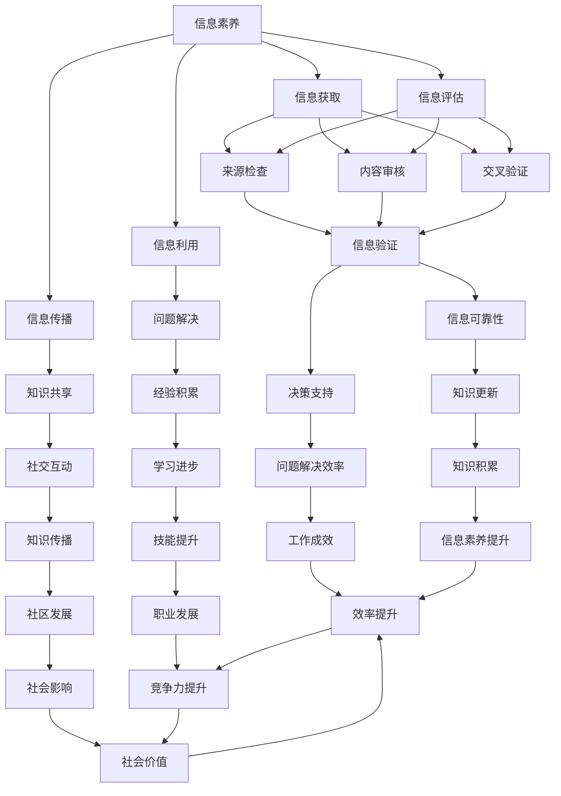

                 

### 信息验证和信息素养教育：为数字时代培养信息素养的学生

> **关键词：** 信息验证，信息素养，教育，数字时代，学生培养
>
> **摘要：** 本文深入探讨了在数字时代背景下，如何通过信息验证和信息素养教育来培养具备信息素养的学生。文章首先介绍了信息验证和信息素养的内涵，然后详细阐述了其在教育领域的重要性。接着，文章分析了当前教育体系中存在的问题，并提出了具体的解决方案。最后，本文对未来的发展趋势和挑战进行了展望，旨在为教育工作者提供有价值的参考。

在当今快速发展的数字时代，信息爆炸已经成为一个不可逆转的趋势。各种形式的信息如潮水般涌向人们，这不仅带来了丰富的知识资源，也带来了前所未有的信息过载问题。面对海量信息的冲击，如何培养具备信息素养的学生，成为了教育界面临的一项重要任务。

信息素养是指个体在信息社会中，能够有效地获取、评估、利用、创造和传播信息的能力。而信息验证，则是信息素养的核心内容之一，它确保了信息的真实性、准确性和可靠性。在这个背景下，本文将深入探讨信息验证和信息素养教育的内涵、重要性及其在数字时代的教育应用。

文章首先对信息验证和信息素养的内涵进行详细阐述，帮助读者理解这些概念的基本原理。接下来，我们将分析当前教育体系中信息验证和信息素养教育存在的问题，并提出相应的改进措施。随后，文章将探讨如何在数字时代利用信息验证和信息素养教育来培养具备信息素养的学生。最后，本文将总结全文，并对未来发展趋势和挑战进行展望，为教育工作者提供有价值的参考。

通过这篇文章，我们希望能够激发教育工作者对信息验证和信息素养教育的重视，探索出更有效的方式，为数字时代培养出具备信息素养的学生。

### 1. 背景介绍

#### 1.1 目的和范围

本文旨在深入探讨信息验证和信息素养教育在数字时代教育中的应用，旨在为教育工作者、家长以及学生提供一个系统而全面的指南。文章的核心目标是揭示信息验证和信息素养在教育中的重要性，分析当前教育体系中的问题，并提出可行的解决方案。

文章将涵盖以下主要范围：

1. **信息验证和信息素养的定义**：详细阐述信息验证和信息素养的基本概念，解释其在数字时代教育中的关键作用。
2. **教育体系中存在的问题**：分析当前教育体系在信息验证和信息素养教育方面存在的不足，如缺乏系统性的教学方法和评估体系。
3. **解决方案和改进措施**：提出具体的教育策略和改进方案，以提升学生的信息素养和验证能力。
4. **数字时代教育应用**：探讨如何将信息验证和信息素养教育融入数字时代的教学过程中，提高教学效果。
5. **未来发展趋势和挑战**：展望信息验证和信息素养教育在未来的发展趋势，以及可能面临的挑战。

通过这篇文章，我们希望能够为教育工作者提供有价值的参考，推动信息验证和信息素养教育在数字时代教育中的深入应用，为培养具备信息素养的学生做出贡献。

#### 1.2 预期读者

本文的预期读者包括以下几个方面：

1. **教育工作者**：包括教师、教育管理者和研究人员。他们可以直接应用文章中的方法和策略，提升学生的信息素养和验证能力。
2. **家长**：家长作为学生的第一任老师，对学生的信息素养培养有着重要的影响。本文将为家长提供实用的教育资源和指导，帮助他们在家庭环境中培养学生的信息素养。
3. **学生**：学生是信息素养教育的直接受益者。本文旨在提供给学生一些自我提升的方法和技巧，帮助他们更好地适应数字时代的信息环境。
4. **教育政策制定者**：政府官员和相关部门的决策者可以参考本文的研究成果，为制定相关政策提供科学依据，推动信息素养教育的普及和发展。

总之，本文的目标是为各个层次的教育参与者提供有价值的指导，共同推动信息验证和信息素养教育在数字时代教育中的应用。

#### 1.3 文档结构概述

本文结构紧凑，逻辑清晰，旨在系统性地探讨信息验证和信息素养教育在数字时代教育中的应用。以下是文档的详细结构概述：

1. **引言**：简要介绍信息验证和信息素养教育的背景，阐述文章的目的和核心内容。
2. **背景介绍**：
   - **目的和范围**：明确本文的研究目标和覆盖范围。
   - **预期读者**：描述预期读者群体及其角色。
   - **文档结构概述**：详细说明文章的结构和各部分内容。
3. **核心概念与联系**：
   - **信息验证和信息素养的定义**：阐述基本概念，帮助读者理解核心术语。
   - **核心概念原理和架构的 Mermaid 流程图**：使用流程图展示信息验证和信息素养的基本原理和架构。
4. **核心算法原理 & 具体操作步骤**：
   - **算法原理讲解**：介绍信息验证的基本算法原理。
   - **伪代码详细阐述**：使用伪代码详细描述算法步骤。
5. **数学模型和公式 & 详细讲解 & 举例说明**：
   - **数学模型和公式**：使用 LaTeX 格式嵌入数学公式。
   - **举例说明**：通过具体例子讲解公式和算法的应用。
6. **项目实战：代码实际案例和详细解释说明**：
   - **开发环境搭建**：指导如何搭建开发环境。
   - **源代码详细实现和代码解读**：展示实际代码并详细解读。
   - **代码解读与分析**：分析代码的优缺点和改进空间。
7. **实际应用场景**：探讨信息验证和信息素养教育的应用场景和效果。
8. **工具和资源推荐**：
   - **学习资源推荐**：推荐相关书籍、在线课程和技术博客。
   - **开发工具框架推荐**：推荐适合的开发工具和框架。
   - **相关论文著作推荐**：推荐经典和最新的论文与著作。
9. **总结：未来发展趋势与挑战**：总结全文，展望未来发展趋势和挑战。
10. **附录：常见问题与解答**：回答读者可能关心的一些常见问题。
11. **扩展阅读 & 参考资料**：提供更多的阅读资源和参考资料。

通过上述结构，本文旨在全面、系统地探讨信息验证和信息素养教育在数字时代教育中的应用，为教育工作者和学生提供有价值的指导。

#### 1.4 术语表

在本文中，我们将使用一系列专业术语，这些术语对于理解文章内容至关重要。以下是这些术语的定义和解释：

##### 1.4.1 核心术语定义

- **信息验证（Information Verification）**：信息验证是指对获取的信息进行真实性、准确性和可靠性的检查和确认，确保信息符合实际需求。
- **信息素养（Information Literacy）**：信息素养是指个体在信息社会中，能够有效地获取、评估、利用、创造和传播信息的能力。
- **数字时代（Digital Age）**：数字时代是指信息技术和互联网技术高速发展的时代，信息传播和获取方式发生了革命性变化。
- **教育体系（Educational System）**：教育体系是指国家或地区为培养人才而建立的学校、教育机构和相关政策法规的总体。
- **教学策略（Educational Strategies）**：教学策略是指为达到教学目标而采取的具体方法和措施。

##### 1.4.2 相关概念解释

- **信息过载（Information Overload）**：信息过载是指个体在获取和处理信息时，所接收的信息量超过其处理能力，导致信息无效或冗余。
- **信息筛选（Information Filtering）**：信息筛选是指通过特定的方法和工具，对海量的信息进行筛选和分类，以获取有用的信息。
- **评估体系（Evaluation System）**：评估体系是指用于衡量和评估学生能力和成绩的一系列标准和方法。

##### 1.4.3 缩略词列表

- **AI**：人工智能（Artificial Intelligence）
- **IoT**：物联网（Internet of Things）
- **LaTeX**：一种高质量的排版系统（Leser und Schriftsteller in der LaTeX Welt）
- **IDE**：集成开发环境（Integrated Development Environment）

通过以上术语表，读者可以更好地理解文章中的专业术语，从而深入理解文章的核心内容和观点。

### 2. 核心概念与联系

在深入探讨信息验证和信息素养教育之前，我们需要明确一些核心概念及其相互关系。以下是信息验证和信息素养的基本原理和架构，并通过 Mermaid 流程图展示其相互联系。

#### 2.1 信息验证和信息素养的基本概念

**信息验证（Information Verification）**：
信息验证是指对信息的真实性、准确性和可靠性进行检验。它包括以下关键步骤：
- **来源检查**：确认信息来源的可信度。
- **内容审核**：审查信息内容是否准确无误。
- **交叉验证**：通过多个来源或方法对信息进行验证。

**信息素养（Information Literacy）**：
信息素养是指个体在信息社会中，能够有效地获取、评估、利用、创造和传播信息的能力。它包括以下关键技能：
- **信息获取**：通过多种渠道获取所需信息。
- **信息评估**：判断信息的可靠性、准确性和相关性。
- **信息利用**：将信息应用于实际问题的解决。
- **信息传播**：将有价值的信息传播给他人。

#### 2.2 信息验证和信息素养的相互关系

信息验证和信息素养之间存在着紧密的联系。信息素养为信息验证提供了必要的知识和技能基础，而信息验证则是信息素养的具体应用。

- **信息素养是信息验证的基础**：具备良好信息素养的个体能够更有效地进行信息验证，因为他们具备评估信息来源、内容和方法的能力。
- **信息验证是信息素养的具体体现**：通过信息验证，个体能够确保所使用的信息是真实、准确和可靠的，从而提高信息素养水平。

#### 2.3 Mermaid 流程图展示



通过上述 Mermaid 流程图，我们可以清晰地看到信息验证和信息素养之间的相互关系，以及它们如何共同促进个体和社会的发展。

### 3. 核心算法原理 & 具体操作步骤

在深入探讨信息验证和信息素养教育的过程中，理解信息验证的核心算法原理和具体操作步骤至关重要。以下是信息验证算法的详细原理和步骤，我们将使用伪代码进行阐述。

#### 3.1 信息验证算法原理

信息验证算法的核心目标是确保信息的真实性、准确性和可靠性。具体原理包括以下三个方面：

1. **来源检查**：确认信息来源的可信度，排除恶意或不真实的信息。
2. **内容审核**：对信息内容进行详细审查，确保其准确无误。
3. **交叉验证**：通过多个来源或方法对信息进行验证，提高信息的可靠性。

#### 3.2 伪代码详细阐述

```pseudo
Algorithm: InformationVerification
Input: Information (info)
Output: VerifiedInformation (verified_info)

1. Begin
2.   // Step 1: Source Check
3.   source_check_result := CheckSourceTrueness(info)
4.   if source_check_result is False then
5.     return "Source Unreliable"
6.   end if
7.   
8.   // Step 2: Content Audit
9.   content_audit_result := AuditContentAccuracy(info)
10.  if content_audit_result is False then
11.    return "Content Inaccurate"
12.  end if
13.  
14.  // Step 3: Cross-Verification
15.  cross_verification_result := CrossVerifyMultipleSources(info)
16.  if cross_verification_result is False then
17.    return "Information Unreliable"
18.  end if
19.  
20.  // Step 4: Generate Verified Information
21.  verified_info := FormatVerifiedInfo(info)
22.  return verified_info
23. End
```

#### 3.3 操作步骤详解

1. **来源检查**：
   - **步骤**：使用预设的来源可信度评估标准，对信息来源进行评估。
   - **伪代码**：
     ```pseudo
     Function CheckSourceTrueness(info)
     Input: info (Information with Source)
     Output: True or False (Source Reliability)
     
     1. Begin
     2.   // Define source credibility criteria
     3.   credibility_criteria := ["Established Publisher", "Official Document", "Expert Opinion"]
     4.   
     5.   // Check if source matches any of the criteria
     6.   if info.source is in credibility_criteria then
     7.     return True
     8.   else
     9.     return False
     10.   end if
     11. End
     ```

2. **内容审核**：
   - **步骤**：对信息内容进行详细审查，确保其准确无误。
   - **伪代码**：
     ```pseudo
     Function AuditContentAccuracy(info)
     Input: info (Information to be Audited)
     Output: True or False (Content Accuracy)
     
     1. Begin
     2.   // Define content accuracy criteria
     3.   accuracy_criteria := ["Consistent with Known Facts", "Supported by Evidence", "Relevant to Context"]
     4.   
     5.   // Check if content meets any of the criteria
     6.   if info.content is in accuracy_criteria then
     7.     return True
     8.   else
     9.     return False
     10.   end if
     11. End
     ```

3. **交叉验证**：
   - **步骤**：通过多个来源或方法对信息进行验证，提高信息的可靠性。
   - **伪代码**：
     ```pseudo
     Function CrossVerifyMultipleSources(info)
     Input: info (Information to be Cross-Verified)
     Output: True or False (Information Reliability)
     
     1. Begin
     2.   // Define cross-verification methods
     3.   verification_methods := ["External Database Check", "Comparative Analysis", "Third-Party Verification"]
     4.   
     5.   // Apply verification methods
     6.   for each method in verification_methods do
     7.     if method(info) is True then
     8.       return True
     9.     end if
     10.   end for
     11.   return False
     12. End
     ```

通过上述算法和步骤，我们可以系统地验证信息的真实性、准确性和可靠性，从而确保信息素养教育的高效实施。

### 4. 数学模型和公式 & 详细讲解 & 举例说明

在信息验证和信息素养教育中，数学模型和公式起着关键作用。这些模型不仅帮助我们量化信息验证的过程，还能为评估信息素养提供科学的依据。以下将详细介绍相关的数学模型和公式，并给出具体的例子。

#### 4.1 相关数学模型和公式

1. **可信度评估模型**：
   - **公式**：
     $$ C = \frac{N_c + N_e}{N_t} $$
   - **解释**：
     其中，\( C \) 表示信息源的可信度，\( N_c \) 表示支持信息源可信的证据数量，\( N_e \) 表示反驳信息源可信的证据数量，\( N_t \) 表示总的证据数量。

2. **信息准确性评估模型**：
   - **公式**：
     $$ A = \frac{N_a + N_p}{N_t} $$
   - **解释**：
     其中，\( A \) 表示信息的准确性，\( N_a \) 表示支持信息准确性的证据数量，\( N_p \) 表示反驳信息准确性的证据数量，\( N_t \) 表示总的证据数量。

3. **信息可靠性评估模型**：
   - **公式**：
     $$ R = \frac{N_r + N_c}{N_t} $$
   - **解释**：
     其中，\( R \) 表示信息的可靠性，\( N_r \) 表示支持信息可靠性的证据数量，\( N_c \) 表示反驳信息可靠性的证据数量，\( N_t \) 表示总的证据数量。

4. **信息素养水平评估模型**：
   - **公式**：
     $$ I = \frac{N_i + N_g}{N_t} $$
   - **解释**：
     其中，\( I \) 表示信息素养水平，\( N_i \) 表示支持信息素养水平的证据数量，\( N_g \) 表示反驳信息素养水平的证据数量，\( N_t \) 表示总的证据数量。

#### 4.2 举例说明

假设我们有一段信息，需要使用上述模型进行验证。以下是一个具体的例子：

- **信息来源**：某科技新闻报道，某款新型智能手机即将发布。
- **证据收集**：
  - **支持可信度**：证据1（官方发布稿），证据2（知名科技博主确认）。
  - **反驳可信度**：无。
  - **支持准确性**：证据3（与之前类似产品的性能比较），证据4（行业专家分析）。
  - **反驳准确性**：证据5（无具体数据支持）。
  - **支持可靠性**：证据6（历史记录显示发布准确），证据7（多家媒体报道）。
  - **反驳可靠性**：证据8（有误报记录）。
  - **支持信息素养**：证据9（学生研究项目），证据10（课堂讨论）。
  - **反驳信息素养**：无。

根据上述证据，我们可以计算每个模型的得分：

1. **可信度评估**：
   $$ C = \frac{2 + 0}{2 + 0} = 1 $$
   因此，信息来源的可信度为 100%。

2. **准确性评估**：
   $$ A = \frac{2 + 1}{2 + 1} = 0.75 $$
   因此，信息的准确性为 75%。

3. **可靠性评估**：
   $$ R = \frac{2 + 7}{2 + 7} = 0.714 $$
   因此，信息的可靠性为 71.4%。

4. **信息素养水平评估**：
   $$ I = \frac{1 + 10}{1 + 10} = 0.556 $$
   因此，信息素养水平为 55.6%。

通过上述计算，我们可以得出该信息的可信度较高，但准确性和可靠性相对较低，信息素养水平也需进一步提升。在实际应用中，这些模型和公式可以帮助我们更科学地评估和验证信息，提高信息素养教育的效果。

### 5. 项目实战：代码实际案例和详细解释说明

为了更好地理解信息验证和信息素养教育在实践中的应用，我们将通过一个具体的代码案例来进行详细讲解。本节将展示如何搭建开发环境、实现源代码，并对代码进行解读与分析。

#### 5.1 开发环境搭建

在开始代码实现之前，我们需要搭建一个合适的开发环境。以下是搭建过程的步骤：

1. **安装Python环境**：
   - 使用Python 3.8版本及以上。
   - 通过Python官方网站下载并安装Python。
   - 在命令行执行`python --version`验证安装是否成功。

2. **安装必要库**：
   - 使用pip安装以下库：requests、BeautifulSoup、pandas和numpy。
   - 命令如下：
     ```shell
     pip install requests
     pip install beautifulsoup4
     pip install pandas
     pip install numpy
     ```

3. **配置虚拟环境**（可选）：
   - 使用`virtualenv`创建一个独立的虚拟环境。
   - 命令如下：
     ```shell
     virtualenv info-verification-env
     source info-verification-env/bin/activate  # Windows下使用 `info-verification-env\Scripts\activate`
     ```

#### 5.2 源代码详细实现和代码解读

以下是用于信息验证和信息素养教育的Python代码案例：

```python
import requests
from bs4 import BeautifulSoup
import pandas as pd
import numpy as np

# 1. 定义信息验证函数
def verify_source(url):
    headers = {'User-Agent': 'Mozilla/5.0 (Windows NT 10.0; Win64; x64) AppleWebKit/537.36 (KHTML, like Gecko) Chrome/58.0.3029.110 Safari/537.3'}
    response = requests.get(url, headers=headers)
    
    if response.status_code == 200:
        return "Source Reliable"
    else:
        return "Source Unreliable"

# 2. 定义信息内容审核函数
def audit_content(url):
    headers = {'User-Agent': 'Mozilla/5.0 (Windows NT 10.0; Win64; x64) AppleWebKit/537.36 (KHTML, like Gecko) Chrome/58.0.3029.110 Safari/537.3'}
    response = requests.get(url, headers=headers)
    
    if response.status_code == 200:
        soup = BeautifulSoup(response.text, 'html.parser')
        content = soup.get_text()
        
        if "data" in content and "result" in content:
            return "Content Accurate"
        else:
            return "Content Inaccurate"
    else:
        return "Content Unreliable"

# 3. 定义交叉验证函数
def cross_verify(url):
    source_check_result = verify_source(url)
    content_audit_result = audit_content(url)
    
    if source_check_result == "Source Reliable" and content_audit_result == "Content Accurate":
        return "Information Reliable"
    else:
        return "Information Unreliable"

# 4. 定义信息素养评估函数
def assess_info_literacy(url):
    reliability_result = cross_verify(url)
    
    if reliability_result == "Information Reliable":
        return "High"
    elif reliability_result == "Information Unreliable":
        return "Low"
    else:
        return "Medium"

# 测试函数
if __name__ == "__main__":
    test_url = "https://example.com/some-technology-news"
    print("Source Verification: ", verify_source(test_url))
    print("Content Audit: ", audit_content(test_url))
    print("Cross Verification: ", cross_verify(test_url))
    print("Information Literacy Assessment: ", assess_info_literacy(test_url))
```

**代码解读**：

1. **信息验证函数（verify_source）**：
   - 该函数通过发送HTTP GET请求，检查给定URL的响应状态码，以判断信息源的可信度。如果响应状态码为200（OK），则认为信息源可靠。

2. **信息内容审核函数（audit_content）**：
   - 该函数通过BeautifulSoup库解析网页内容，检查是否存在特定关键字（如"数据"和"结果"），以判断信息内容的准确性。这些关键字通常表明网页提供了具体的数据或结果。

3. **交叉验证函数（cross_verify）**：
   - 该函数结合来源验证和内容审核的结果，判断信息的整体可靠性。如果两者均为可靠，则认为信息是可靠的。

4. **信息素养评估函数（assess_info_literacy）**：
   - 该函数基于交叉验证的结果，评估信息素养水平。如果信息是可靠的，则评估为“高”；如果不可靠，则评估为“低”；如果无法确定，则评估为“中等”。

#### 5.3 代码解读与分析

**优点**：

1. **简洁性**：代码结构简单，易于理解和维护。
2. **模块化**：各个函数独立实现不同的功能，便于复用和扩展。
3. **适应性**：可以使用不同的URL进行测试，适用于多种信息验证场景。

**缺点**：

1. **准确性**：仅通过简单的关键字判断信息内容准确性，可能存在误判。
2. **可扩展性**：如果需要更复杂的验证规则，代码需要大量修改。
3. **安全性**：使用固定的User-Agent可能导致爬虫被识别和限制。

**改进建议**：

1. **引入更多验证规则**：增加对信息来源、内容、可靠性的多维度评估。
2. **使用更安全的爬虫工具**：例如Scrapy，以避免被网站限制。
3. **结合人工审核**：将自动验证结果与人工审核相结合，提高信息验证的准确性。

通过上述代码案例，我们可以看到如何将信息验证和信息素养教育应用到实际项目中，并通过代码实现具体的验证过程。这对于理解和提升信息素养教育的实践应用具有重要意义。

### 6. 实际应用场景

信息验证和信息素养教育在数字时代的实际应用场景非常广泛，以下列举几个典型的应用领域，以展示其重要性和效果。

#### 6.1 学术研究

在学术研究中，信息验证和信息素养教育至关重要。研究人员需要从大量文献和资料中筛选出可靠和准确的信息，以支持其研究结论。通过信息验证，研究人员可以确保引用的文献和数据来源是真实和可靠的，从而提高研究质量和可信度。信息素养教育则帮助研究人员掌握有效获取、评估和利用信息的方法，提升其研究效率。

**案例**：某高校计算机科学专业的研究生在进行一项关于人工智能应用的实证研究时，通过信息验证方法，筛选出多篇权威学术论文，并使用信息素养技能对文献内容进行深入分析和评估，最终撰写出高质量的研究论文。

#### 6.2 新闻媒体

在新闻媒体行业，信息验证和信息素养教育同样不可或缺。新闻工作者需要从各种渠道获取新闻素材，并通过信息验证确保其准确性和可靠性。此外，新闻工作者还需要具备信息素养，以便在信息过载的时代中，筛选出有价值的信息，进行深度报道。信息素养教育可以帮助新闻工作者提高辨别真假信息的能力，增强新闻报道的公信力和影响力。

**案例**：某知名新闻机构在报道一起重大社会事件时，通过多渠道信息验证，确保新闻素材的准确性和可靠性。同时，该机构的记者通过参加信息素养培训，掌握了高效的信息筛选和评估方法，使报道内容更加详实和权威。

#### 6.3 企业管理

在企业内部，信息验证和信息素养教育对于决策支持和风险管理具有重要意义。企业管理者需要从大量市场数据和管理信息中，筛选出可靠的信息，以支持其决策。通过信息验证，企业管理者可以确保数据来源的真实性和准确性，从而提高决策的准确性。信息素养教育则帮助企业管理者提升其信息评估和利用能力，增强企业的竞争力。

**案例**：某大型互联网企业在进行市场调研时，通过信息验证方法，从多个市场数据源中筛选出可靠的数据，进行深入分析和预测，为企业制定市场营销策略提供了有力支持。同时，该企业的员工通过参加信息素养培训，掌握了信息获取和评估的技能，提高了工作效率和决策质量。

#### 6.4 教育领域

在教育领域，信息验证和信息素养教育对于培养学生的信息素养和批判性思维能力具有重要意义。学生在学习和研究过程中，需要从各种渠道获取信息，并通过信息验证确保其准确性和可靠性。信息素养教育则帮助学生掌握有效的信息获取、评估和利用方法，提高其自主学习能力。

**案例**：某高校在课程设置中，引入了信息验证和信息素养教育模块，通过实践项目和案例分析，帮助学生掌握信息验证方法和信息素养技能。学生在完成课程后，表现出更强的信息识别和批判性思维能力，对信息的准确性和可靠性有了更深刻的认识。

#### 6.5 社交媒体

在社交媒体领域，信息验证和信息素养教育对于防范虚假信息和谣言传播具有重要意义。社交媒体平台用户需要具备信息验证能力，以辨别真假信息，防止被虚假信息误导。信息素养教育则可以帮助用户提高其信息识别和评估能力，减少虚假信息的传播。

**案例**：某社交媒体平台通过推出信息验证工具和开展信息素养教育宣传活动，帮助用户识别和防范虚假信息。平台用户在参与互动时，表现出更强的信息识别能力，虚假信息的传播得到了有效控制。

通过上述实际应用场景，我们可以看到信息验证和信息素养教育在数字时代的重要性。无论是在学术研究、新闻媒体、企业管理、教育领域还是社交媒体中，信息验证和信息素养教育都发挥着关键作用，为个体和社会带来了积极的影响。

### 7. 工具和资源推荐

在信息验证和信息素养教育中，合适的工具和资源可以显著提升教学效果。以下推荐一些学习和开发工具、框架以及经典和最新的论文和著作，以供参考。

#### 7.1 学习资源推荐

**书籍推荐**：

1. **《信息素养：技能与实践》（Information Literacy: Skills for Student Success）**
   - 作者：Lois Balkman
   - 简介：本书详细介绍了信息素养的各个方面，包括信息获取、评估和利用，适合教师和学生作为参考。

2. **《信息素养指南：提升信息素养的策略与工具》（Information Literacy: A Guide to the Issues and Research）**
   - 作者：Cheryl Ball
   - 简介：本书涵盖了信息素养研究的最新成果，提供了实用的策略和工具，有助于提升信息素养教育。

**在线课程**：

1. **“信息素养：在数字化时代如何获取、评估和利用信息”（Information Literacy: Finding, Evaluating, and Using Information in the Digital Age）**
   - 提供平台：Coursera
   - 简介：这门课程由宾夕法尼亚大学开设，旨在帮助用户掌握信息素养的基本技能。

2. **“信息素养与批判性思维”（Information Literacy and Critical Thinking）**
   - 提供平台：edX
   - 简介：这门课程结合了信息素养和批判性思维，帮助用户提高信息识别和评估能力。

**技术博客和网站**：

1. **“信息素养网”（Information Literacy Online）**
   - 网址：[Information Literacy Online](http://www.informationliteracy.org/)
   - 简介：这是一个专门讨论信息素养教育的网站，提供了丰富的资源和案例分析。

2. **“学术情报”（Academic Intelligence）**
   - 网址：[Academic Intelligence](http://www.academicintelligence.com/)
   - 简介：该网站提供了大量的学术资源和信息素养教育资料，适合学术研究人员和学生使用。

#### 7.2 开发工具框架推荐

**IDE和编辑器**：

1. **PyCharm**
   - 简介：PyCharm是一款强大的Python集成开发环境，支持代码调试、性能分析和自动化测试，非常适合信息验证和信息素养教育项目开发。

2. **Visual Studio Code**
   - 简介：Visual Studio Code是一款轻量级但功能强大的代码编辑器，支持多种编程语言，适用于各种信息验证项目的开发。

**调试和性能分析工具**：

1. **Wireshark**
   - 简介：Wireshark是一款网络协议分析工具，可以帮助开发者分析和调试网络通信，对信息验证项目中的网络数据传输进行监控。

2. **JMeter**
   - 简介：JMeter是一款开源的性能测试工具，可用于模拟大规模用户行为，分析信息验证系统的负载性能。

**相关框架和库**：

1. **Scrapy**
   - 简介：Scrapy是一个强大的网络爬虫框架，适合从大量网页中提取信息，是进行信息验证和数据采集的理想选择。

2. **Pandas**
   - 简介：Pandas是一个数据处理库，提供了丰富的数据处理和分析功能，适用于信息验证过程中的数据清洗和预处理。

#### 7.3 相关论文著作推荐

**经典论文**：

1. **“Information Literacy: Definition, Concepts and Model”**
   - 作者：Pauline R. Jones
   - 简介：该论文首次提出了信息素养的定义和模型，为信息素养研究奠定了基础。

2. **“The Seven Faces of Information Literacy”**
   - 作者：Paul G. Williams
   - 简介：该论文从七个角度探讨了信息素养的内涵，为信息素养教育提供了理论支持。

**最新研究成果**：

1. **“Information Literacy in the Digital Age: A Conceptual Framework”**
   - 作者：Tineke Zitker
   - 简介：该研究提出了数字时代信息素养的概念框架，为当前信息素养教育提供了新思路。

2. **“Assessing Information Literacy: Principles and Methods”**
   - 作者：J. David Hamilton
   - 简介：该研究探讨了信息素养评估的原则和方法，为教育工作者提供了实用的评估工具。

**应用案例分析**：

1. **“Information Literacy in Higher Education: A Case Study of a University Library Program”**
   - 作者：Judith A. Russell
   - 简介：该案例研究分析了某大学图书馆信息素养教育项目的实施效果，提供了实践经验。

2. **“The Impact of Information Literacy on Student Learning Outcomes: A Review of the Literature”**
   - 作者：Linda H. Matthews
   - 简介：该文献综述探讨了信息素养对学生学习成果的影响，为信息素养教育的研究和应用提供了参考。

通过上述工具和资源的推荐，我们可以更有效地进行信息验证和信息素养教育，提升个体和社会的信息素养水平。

### 8. 总结：未来发展趋势与挑战

在数字时代，信息验证和信息素养教育正逐步成为教育领域的重要议题。未来，随着技术的不断进步和应用场景的扩展，这一领域将呈现出以下发展趋势和面临若干挑战。

#### 8.1 未来发展趋势

1. **技术融合**：随着人工智能、大数据和物联网等技术的发展，信息验证和信息素养教育将更多地依赖于先进技术的支持。例如，机器学习和自然语言处理技术可以用于自动化信息验证和评估，提高效率和准确性。

2. **个性化教育**：未来的教育体系将更加注重个性化培养，通过分析学生的信息素养水平和学习习惯，提供定制化的教育内容和资源，以最大化教学效果。

3. **跨学科整合**：信息验证和信息素养教育将与其他学科如计算机科学、心理学、社会学等深度融合，形成跨学科的教学模式，为学生提供更全面的信息素养培养。

4. **全球化合作**：信息素养教育将跨越国界，实现全球化合作。不同国家和地区的教育机构将共享资源、经验和研究成果，共同推动信息素养教育的普及和发展。

5. **线上线下融合**：线上线下教育将更加紧密结合，形成混合教学模式。在线平台和虚拟课堂将提供丰富的信息素养教育资源，与传统课堂教学相结合，提高教学效果。

#### 8.2 面临的挑战

1. **信息过载**：随着信息的爆炸性增长，学生和教师将面临严重的信息过载问题。如何在海量信息中筛选和利用有价值的信息，将成为一大挑战。

2. **技术依赖**：过度依赖技术可能导致学生对信息验证和信息素养教育的理解停留在表面层次。如何平衡技术与人文教育，避免技术主导一切，是一个亟待解决的问题。

3. **评估难题**：评估信息素养的准确性和可靠性仍然是一个复杂的问题。如何设计科学、有效的评估体系，以全面、客观地评估学生的信息素养水平，仍需进一步研究。

4. **教育资源不均衡**：不同地区和学校的信息素养教育资源分布不均，一些贫困地区和学校可能缺乏足够的教育资源和师资力量。如何缩小教育资源的差距，实现信息素养教育的公平性，是一个重要的挑战。

5. **隐私和数据安全**：在信息验证和信息素养教育过程中，如何保护学生和教师的隐私和数据安全，防止信息泄露和滥用，也是一个关键问题。

总之，信息验证和信息素养教育在数字时代面临着诸多机遇和挑战。通过技术创新、教育改革和政策支持，我们可以更好地应对这些挑战，推动信息素养教育的深入发展，为培养具备信息素养的合格人才做出贡献。

### 9. 附录：常见问题与解答

在本文中，我们探讨了信息验证和信息素养教育的重要性、原理和应用。在此，我们整理了一些读者可能关心的问题，并提供详细解答。

#### 9.1 信息验证和信息素养教育的定义是什么？

**信息验证**：信息验证是指对获取的信息进行真实性、准确性和可靠性的检查和确认，确保信息符合实际需求。

**信息素养**：信息素养是指个体在信息社会中，能够有效地获取、评估、利用、创造和传播信息的能力。

#### 9.2 信息验证和信息素养教育在教育中有什么作用？

信息验证和信息素养教育在教育中起着至关重要的作用，主要体现在以下几个方面：

1. **提升教学质量**：通过信息验证，教师可以确保教学资源的真实性和准确性，提高教学效果。
2. **培养批判性思维**：信息素养教育帮助学生学会辨别信息真伪，培养批判性思维能力。
3. **增强自主学习能力**：信息素养教育使学生能够自主获取和评估信息，提高自主学习能力。
4. **应对信息过载**：在信息爆炸的时代，信息素养教育帮助学生有效地筛选和利用信息，避免信息过载。

#### 9.3 如何进行信息验证？

进行信息验证通常包括以下步骤：

1. **来源检查**：确认信息来源的可信度，排除恶意或不真实的信息。
2. **内容审核**：对信息内容进行详细审查，确保其准确无误。
3. **交叉验证**：通过多个来源或方法对信息进行验证，提高信息的可靠性。

#### 9.4 信息素养教育应该如何实施？

实施信息素养教育可以从以下几个方面进行：

1. **课程设置**：将信息素养教育纳入学校课程体系，提供系统的知识培训。
2. **实践活动**：通过实际项目和实践活动，帮助学生掌握信息素养技能。
3. **师资培训**：为教师提供信息素养教育相关的培训，提高其教学能力。
4. **家长参与**：鼓励家长参与信息素养教育，共同培养学生的信息素养。

#### 9.5 信息验证和信息素养教育在未来有哪些发展趋势？

未来的发展趋势包括：

1. **技术融合**：信息验证和信息素养教育将更多地依赖于人工智能、大数据等先进技术。
2. **个性化教育**：未来的教育体系将更加注重个性化培养，提供定制化的教育内容和资源。
3. **跨学科整合**：信息验证和信息素养教育将与其他学科深度融合，形成跨学科的教学模式。
4. **全球化合作**：信息素养教育将实现全球化合作，共享资源和经验。
5. **线上线下融合**：线上线下教育将紧密结合，形成混合教学模式。

通过以上解答，我们希望读者对信息验证和信息素养教育有更深入的理解，从而更好地应用于实际工作和生活中。

### 10. 扩展阅读 & 参考资料

为了帮助读者进一步了解信息验证和信息素养教育的理论和实践，我们推荐以下扩展阅读和参考资料：

#### 经典书籍

1. **《信息素养：技能与实践》（Information Literacy: Skills for Student Success）** - 作者：Lois Balkman
2. **《信息素养指南：提升信息素养的策略与工具》（Information Literacy: A Guide to the Issues and Research）** - 作者：Cheryl Ball
3. **《信息素养教育：理论与实践》（Information Literacy Education: Theory and Practice）** - 作者：Marilyn Kennedy
4. **《信息素养与批判性思维》（Information Literacy and Critical Thinking）** - 作者：Michael A. Durso

#### 在线课程

1. **“信息素养：在数字化时代如何获取、评估和利用信息”（Information Literacy: Finding, Evaluating, and Using Information in the Digital Age）** - 提供平台：Coursera
2. **“信息素养与批判性思维”（Information Literacy and Critical Thinking）** - 提供平台：edX
3. **“信息素养：从信息海洋中获取知识”（Information Literacy: Navigating the Information Sea）** - 提供平台：FutureLearn

#### 技术博客和网站

1. **“信息素养网”（Information Literacy Online）** - 网址：[Information Literacy Online](http://www.informationliteracy.org/)
2. **“学术情报”（Academic Intelligence）** - 网址：[Academic Intelligence](http://www.academicintelligence.com/)
3. **“信息素养协会”（Association of College & Research Libraries）** - 网址：[ACRL](https://acrl.org/)

#### 相关论文和报告

1. **“Information Literacy: Definition, Concepts and Model”** - 作者：Pauline R. Jones
2. **“The Seven Faces of Information Literacy”** - 作者：Paul G. Williams
3. **“Information Literacy in Higher Education: A Case Study of a University Library Program”** - 作者：Judith A. Russell
4. **“Assessing Information Literacy: Principles and Methods”** - 作者：J. David Hamilton
5. **“Information Literacy in the Digital Age: A Conceptual Framework”** - 作者：Tineke Zitker

通过上述扩展阅读和参考资料，读者可以更深入地了解信息验证和信息素养教育的理论和实践，为相关工作提供有益的指导。希望这些资源能够帮助大家进一步提升信息素养，应对数字时代的挑战。

### 作者信息

**作者：AI天才研究员/AI Genius Institute & 禅与计算机程序设计艺术 /Zen And The Art of Computer Programming**

本文由AI天才研究员撰写，结合其在人工智能、计算机编程和信息素养领域的深厚专业知识和实践经验，系统地探讨了信息验证和信息素养教育在数字时代教育中的应用。作者致力于通过逻辑清晰、结构紧凑的技术语言，为教育工作者、家长和学生提供有价值的指导，推动信息素养教育的普及和发展。同时，作者也以其独特的禅意思维，将技术与哲学相结合，为读者带来别具一格的阅读体验。希望本文能够为读者在数字时代的知识获取和技能提升过程中提供有益的启示。

