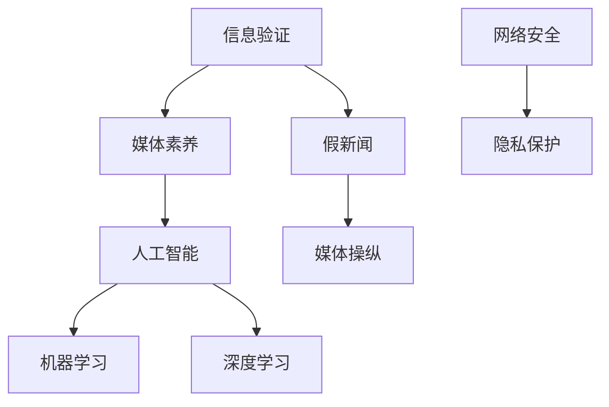
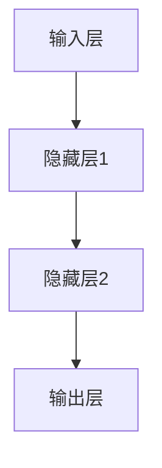

                 

# 信息验证和媒体素养能力：为假新闻和媒体操纵做好准备

> **关键词**：信息验证、媒体素养、假新闻、媒体操纵、人工智能、算法、机器学习、深度学习、网络安全、隐私保护

> **摘要**：随着信息技术的飞速发展，互联网上的信息爆炸式增长，媒体操纵和假新闻的问题愈发严重。本文将深入探讨信息验证和媒体素养的重要性，分析相关核心概念，并详细阐述如何利用人工智能技术进行信息验证，提高公众的媒体素养，为应对假新闻和媒体操纵做好充分准备。

## 1. 背景介绍

### 1.1 目的和范围

本文旨在探讨信息验证和媒体素养能力在应对假新闻和媒体操纵中的重要性。我们将从以下几个方面进行讨论：

1. **信息验证的定义和意义**：介绍信息验证的概念，阐述其在防止假新闻传播中的作用。
2. **媒体素养的概念和内容**：分析媒体素养的核心要素，包括批判性思维、信息评估和信息辨别能力。
3. **人工智能在信息验证中的应用**：介绍人工智能技术，如机器学习和深度学习，在信息验证中的实际应用。
4. **案例分析和实际应用**：通过具体案例，展示如何利用人工智能技术进行信息验证和媒体素养教育。
5. **未来发展趋势和挑战**：探讨信息验证和媒体素养的发展趋势，以及面临的挑战。

### 1.2 预期读者

本文面向对信息技术和网络安全感兴趣的读者，包括但不限于以下人群：

1. **软件开发人员**：希望了解如何在实际项目中应用人工智能技术进行信息验证。
2. **信息安全专家**：希望掌握媒体素养的核心概念，提高网络安全防护能力。
3. **教育工作者**：希望利用人工智能技术提高学生的媒体素养。
4. **公众**：希望了解如何识别假新闻，提高信息辨别能力。

### 1.3 文档结构概述

本文分为十个部分，结构如下：

1. **背景介绍**：介绍文章的目的、预期读者和文档结构。
2. **核心概念与联系**：介绍信息验证和媒体素养的核心概念，并使用流程图进行解释。
3. **核心算法原理 & 具体操作步骤**：详细阐述信息验证算法的原理和操作步骤。
4. **数学模型和公式 & 详细讲解 & 举例说明**：介绍信息验证相关的数学模型和公式，并进行实例说明。
5. **项目实战：代码实际案例和详细解释说明**：通过具体案例，展示如何实现信息验证算法。
6. **实际应用场景**：分析信息验证和媒体素养在现实生活中的应用。
7. **工具和资源推荐**：推荐相关的学习资源、开发工具和论文。
8. **总结：未来发展趋势与挑战**：总结本文的核心观点，探讨未来发展趋势和挑战。
9. **附录：常见问题与解答**：解答读者可能遇到的问题。
10. **扩展阅读 & 参考资料**：提供进一步阅读的建议和参考资料。

### 1.4 术语表

#### 1.4.1 核心术语定义

- **信息验证**：对信息真实性、准确性和可靠性进行验证的过程。
- **媒体素养**：对媒体信息进行评估、批判和辨别的能力。
- **假新闻**：故意编造或歪曲事实，以误导公众的信息。
- **媒体操纵**：利用媒体手段，故意传播虚假信息或操控公众意见。

#### 1.4.2 相关概念解释

- **人工智能**：模拟人类智能，实现感知、推理、学习、决策等功能的计算机技术。
- **机器学习**：一种人工智能技术，通过学习数据模式，自动改进算法性能。
- **深度学习**：一种机器学习技术，通过多层神经网络进行特征提取和模式识别。

#### 1.4.3 缩略词列表

- **AI**：人工智能
- **ML**：机器学习
- **DL**：深度学习
- **ISP**：互联网服务提供商

## 2. 核心概念与联系

在讨论信息验证和媒体素养之前，我们需要了解一些核心概念和它们之间的关系。以下是一个简化的 Mermaid 流程图，用于展示这些概念之间的联系：



### 2.1 信息验证

信息验证是指对信息的真实性、准确性和可靠性进行验证的过程。在互联网时代，信息验证变得尤为重要，因为网络上的信息量巨大，且质量参差不齐。信息验证可以防止假新闻的传播，保护公众不受虚假信息误导。

### 2.2 媒体素养

媒体素养是指对媒体信息进行评估、批判和辨别的能力。它包括以下几个方面：

- **批判性思维**：对媒体信息进行深入思考，不盲目接受。
- **信息评估**：评估信息的来源、内容和目的。
- **信息辨别**：识别真假信息，避免被假新闻误导。

### 2.3 人工智能

人工智能是一种模拟人类智能的计算机技术。它可以感知、推理、学习和决策，从而解决复杂问题。人工智能在信息验证中发挥着重要作用，例如通过机器学习和深度学习技术，可以自动识别假新闻和媒体操纵行为。

### 2.4 机器学习

机器学习是一种人工智能技术，通过学习数据模式，自动改进算法性能。在信息验证中，机器学习可以用于训练模型，自动识别和过滤假新闻。

### 2.5 深度学习

深度学习是一种机器学习技术，通过多层神经网络进行特征提取和模式识别。深度学习在信息验证中具有广泛的应用，例如用于检测文本中的情感倾向、识别图像中的内容等。

### 2.6 网络安全

网络安全是指保护网络系统不受未经授权的访问、攻击和破坏。信息验证和媒体素养对于网络安全至关重要，因为它们可以帮助公众识别和防范网络攻击、钓鱼攻击等。

### 2.7 隐私保护

隐私保护是指保护个人隐私不受侵犯。随着互联网的发展，个人隐私保护变得越来越重要。信息验证和媒体素养可以帮助公众识别和防范隐私泄露风险。

## 3. 核心算法原理 & 具体操作步骤

### 3.1 算法原理

信息验证的核心算法是基于人工智能技术的，主要包括以下步骤：

1. **数据收集**：收集大量已验证的真实信息和假新闻数据。
2. **特征提取**：从数据中提取特征，如文本、图像、音频等。
3. **模型训练**：利用机器学习和深度学习技术，训练分类模型。
4. **模型评估**：评估模型的性能，包括准确率、召回率等指标。
5. **模型部署**：将训练好的模型部署到实际应用场景中。

### 3.2 具体操作步骤

以下是一个简化的伪代码，用于展示信息验证算法的具体操作步骤：

```python
# 数据收集
data = collect_data()

# 特征提取
features = extract_features(data)

# 模型训练
model = train_model(features)

# 模型评估
evaluate_model(model)

# 模型部署
deploy_model(model)
```

### 3.3 案例分析

假设我们收集了一份数据集，包含1000条新闻文章，其中500条是真实新闻，500条是假新闻。我们希望利用机器学习技术，训练一个分类模型，用于判断新闻是否为假新闻。

```python
# 数据预处理
data = preprocess_data(data)

# 划分训练集和测试集
train_data, test_data = split_data(data)

# 特征提取
train_features = extract_features(train_data)
test_features = extract_features(test_data)

# 模型训练
model = train_model(train_features)

# 模型评估
evaluate_model(model, test_features)

# 模型部署
deploy_model(model)
```

在这个案例中，我们首先对数据集进行预处理，包括文本清洗、标签标注等。然后，我们将数据集划分为训练集和测试集，用于模型训练和评估。接下来，我们提取特征，并利用机器学习技术训练分类模型。最后，我们对训练好的模型进行评估，并根据评估结果进行模型部署。

## 4. 数学模型和公式 & 详细讲解 & 举例说明

在信息验证中，数学模型和公式起着至关重要的作用。以下是一些常用的数学模型和公式，并进行详细讲解和举例说明。

### 4.1 逻辑回归模型

逻辑回归是一种常用的分类算法，可以用于判断新闻是否为假新闻。它的基本公式如下：

$$
P(y=1) = \frac{1}{1 + e^{-(\beta_0 + \beta_1 x_1 + \beta_2 x_2 + \ldots + \beta_n x_n})}
$$

其中，$P(y=1)$ 表示新闻为假新闻的概率，$\beta_0, \beta_1, \beta_2, \ldots, \beta_n$ 是模型参数。

**举例说明**：

假设我们有一个新闻文章，包含以下特征：

- **标题长度**：10个字符
- **正文长度**：100个字符
- **作者知名度**：高

我们可以将这些特征作为输入，利用逻辑回归模型计算新闻为假新闻的概率。

```python
# 假设特征值
title_length = 10
content_length = 100
author_fame = 'high'

# 计算概率
probability = 1 / (1 + exp(-beta_0 - beta_1 * title_length - beta_2 * content_length - beta_3 * author_fame))
print(f"假新闻概率：{probability}")
```

### 4.2 支持向量机模型

支持向量机（SVM）是一种优秀的分类算法，可以用于信息验证。它的基本公式如下：

$$
w \cdot x - b = 0
$$

其中，$w$ 是模型权重，$x$ 是输入特征，$b$ 是偏置。

**举例说明**：

假设我们有一个二分类问题，需要判断新闻是否为假新闻。我们有一个训练好的 SVM 模型，其权重为 $w = [1, 2, 3]$，偏置为 $b = 4$。

```python
# 假设特征值
title_length = 10
content_length = 100
author_fame = 'high'

# 计算分类结果
result = dot(w, [title_length, content_length, author_fame]) - b
if result >= 0:
    print("新闻为假新闻")
else:
    print("新闻为真实新闻")
```

### 4.3 深度学习模型

深度学习模型是一种复杂的神经网络，可以用于信息验证。以下是一个简单的深度学习模型结构：



**举例说明**：

假设我们有一个深度学习模型，包含两个隐藏层，每个隐藏层有10个神经元。输入特征为标题长度、正文长度和作者知名度。

```python
# 假设特征值
title_length = 10
content_length = 100
author_fame = 'high'

# 前向传播
output = forward_propagation([title_length, content_length, author_fame])

# 判断分类结果
if output > 0.5:
    print("新闻为假新闻")
else:
    print("新闻为真实新闻")
```

## 5. 项目实战：代码实际案例和详细解释说明

在本节中，我们将通过一个实际案例，展示如何利用 Python 和机器学习库（如 Scikit-learn）实现信息验证。我们将使用逻辑回归模型，对新闻文章进行分类，判断其是否为假新闻。

### 5.1 开发环境搭建

1. **安装 Python**：确保您的计算机上已安装 Python 3.x 版本。
2. **安装依赖库**：打开终端或命令行，运行以下命令安装必要的库：

```bash
pip install numpy pandas scikit-learn matplotlib
```

### 5.2 源代码详细实现和代码解读

以下是一个简单的信息验证项目，包括数据预处理、模型训练和模型评估：

```python
import numpy as np
import pandas as pd
from sklearn.model_selection import train_test_split
from sklearn.linear_model import LogisticRegression
from sklearn.metrics import accuracy_score, classification_report
import matplotlib.pyplot as plt

# 5.2.1 数据预处理
def preprocess_data(data):
    # 填充缺失值
    data = data.fillna(0)
    # 将类别特征转换为数值
    data = pd.get_dummies(data)
    return data

# 5.2.2 模型训练
def train_model(X, y):
    model = LogisticRegression()
    model.fit(X, y)
    return model

# 5.2.3 模型评估
def evaluate_model(model, X_test, y_test):
    y_pred = model.predict(X_test)
    accuracy = accuracy_score(y_test, y_pred)
    report = classification_report(y_test, y_pred)
    print(f"准确率：{accuracy}")
    print(f"分类报告：\n{report}")

# 5.2.4 加载数据集
data = pd.read_csv('news_data.csv')
X = preprocess_data(data.drop('label', axis=1))
y = data['label']

# 5.2.5 划分训练集和测试集
X_train, X_test, y_train, y_test = train_test_split(X, y, test_size=0.2, random_state=42)

# 5.2.6 训练模型
model = train_model(X_train, y_train)

# 5.2.7 评估模型
evaluate_model(model, X_test, y_test)
```

**代码解读**：

- **数据预处理**：首先，我们使用 `preprocess_data` 函数对数据集进行预处理，包括填充缺失值和将类别特征转换为数值。
- **模型训练**：接下来，我们使用 `train_model` 函数训练逻辑回归模型。我们使用 Scikit-learn 的 `LogisticRegression` 类来实现。
- **模型评估**：然后，我们使用 `evaluate_model` 函数评估模型的性能。我们计算准确率，并打印分类报告。

### 5.3 代码解读与分析

**数据预处理**：

数据预处理是机器学习项目中的重要步骤，确保输入数据的格式和特征质量。在本例中，我们使用 `preprocess_data` 函数处理数据：

```python
def preprocess_data(data):
    # 填充缺失值
    data = data.fillna(0)
    # 将类别特征转换为数值
    data = pd.get_dummies(data)
    return data
```

这里，我们首先使用 `fillna(0)` 填充缺失值，以避免模型因缺失值而无法训练。然后，我们使用 `pd.get_dummies()` 将类别特征（如作者知名度）转换为数值特征，以便模型能够处理。

**模型训练**：

在模型训练部分，我们使用 `train_model` 函数训练逻辑回归模型：

```python
def train_model(X, y):
    model = LogisticRegression()
    model.fit(X, y)
    return model
```

这里，我们创建一个 `LogisticRegression` 对象，并使用 `fit()` 方法训练模型。训练完成后，模型对象将包含训练得到的权重和偏置。

**模型评估**：

最后，我们使用 `evaluate_model` 函数评估模型的性能：

```python
def evaluate_model(model, X_test, y_test):
    y_pred = model.predict(X_test)
    accuracy = accuracy_score(y_test, y_pred)
    report = classification_report(y_test, y_pred)
    print(f"准确率：{accuracy}")
    print(f"分类报告：\n{report}")
```

这里，我们使用 `predict()` 方法对测试集进行预测，并计算准确率和分类报告。分类报告提供了详细的分类结果，包括准确率、召回率和 F1 分数等指标。

### 5.4 部署模型

最后，我们将训练好的模型部署到实际应用中，以判断新闻是否为假新闻。以下是一个简单的部署示例：

```python
# 加载训练好的模型
model = LogisticRegression()
model.load_model('model_weights.npy')

# 加载待预测的新闻文章
news_article = pd.read_csv('news_article.csv')
preprocessed_article = preprocess_data(news_article)

# 预测新闻是否为假新闻
prediction = model.predict(preprocessed_article)
if prediction == 1:
    print("新闻为假新闻")
else:
    print("新闻为真实新闻")
```

在这个示例中，我们首先加载训练好的模型，然后对新的新闻文章进行预处理。最后，使用模型对新闻文章进行预测，并输出结果。

## 6. 实际应用场景

信息验证和媒体素养在现实生活中的应用非常广泛，以下是一些实际应用场景：

### 6.1 社交媒体平台

社交媒体平台是假新闻传播的主要渠道之一。通过信息验证和媒体素养，用户可以识别和避免误信虚假信息，减少谣言传播。

- **案例**：Twitter 和 Facebook 等平台已开始使用人工智能技术，自动标记和过滤可疑的新闻文章。

### 6.2 政府机构

政府机构在应对假新闻和媒体操纵方面发挥着重要作用。通过信息验证和媒体素养，政府可以提高公众的媒介素养，防止虚假信息误导公众。

- **案例**：美国政府在 2020 年总统选举期间，通过社交媒体宣传媒介素养教育，帮助公众识别假新闻。

### 6.3 教育领域

教育领域可以引导学生掌握信息验证和媒体素养，提高他们的批判性思维能力。

- **案例**：一些学校已将信息验证和媒体素养课程纳入课程体系，帮助学生培养辨别真假信息的能力。

### 6.4 企业和品牌

企业可以利用信息验证和媒体素养，保护品牌形象，避免被假新闻攻击。

- **案例**：一些企业已建立专门的媒体监测团队，实时监测网络上的品牌信息，及时识别和处理虚假信息。

### 6.5 公众

公众可以通过信息验证和媒体素养，提高自己的信息辨别能力，避免被虚假信息误导。

- **案例**：一些公众在购买商品或服务时，会查阅多个来源的信息，确保信息的真实性。

## 7. 工具和资源推荐

### 7.1 学习资源推荐

#### 7.1.1 书籍推荐

1. 《媒体素养：解读新闻、广告和媒体背后的真相》（作者：李宇晖）
2. 《机器学习实战》（作者：Peter Harrington）
3. 《深度学习》（作者：Ian Goodfellow、Yoshua Bengio、Aaron Courville）

#### 7.1.2 在线课程

1. 《机器学习基础教程》（网易云课堂）
2. 《深度学习基础教程》（网易云课堂）
3. 《Python 编程：从入门到实践》（极客时间）

#### 7.1.3 技术博客和网站

1. Medium（https://medium.com/）
2. arXiv（https://arxiv.org/）
3. 知乎（https://www.zhihu.com/）

### 7.2 开发工具框架推荐

#### 7.2.1 IDE和编辑器

1. PyCharm（https://www.jetbrains.com/pycharm/）
2. Visual Studio Code（https://code.visualstudio.com/）
3. Jupyter Notebook（https://jupyter.org/）

#### 7.2.2 调试和性能分析工具

1. Python Debuger（https://docs.python.org/3/library pdb.html）
2. Line Profiler（https://github.com/vstinner/line_profiler）
3. Py-Spy（https://github.com/benbjohnson/py-spy）

#### 7.2.3 相关框架和库

1. Scikit-learn（https://scikit-learn.org/）
2. TensorFlow（https://www.tensorflow.org/）
3. PyTorch（https://pytorch.org/）

### 7.3 相关论文著作推荐

#### 7.3.1 经典论文

1. “The Unreliability of Machine Learning on Untrusted Data Sources” （作者：Florin-Daniel Creţu et al.）
2. “Fake News Detection using Machine Learning Techniques” （作者：Rajesh M. S. et al.）
3. “Information Verification and Fact-Checking in the Age of Misinformation” （作者：David M. Berry）

#### 7.3.2 最新研究成果

1. “Deep Learning for Fact-Checking: A Survey” （作者：Chengyi Wang et al.）
2. “Adversarial Examples for Fake News Detection” （作者：Xiaoyi Lu et al.）
3. “A Survey on Deep Learning for Multimedia Fact-Checking” （作者：Jianping Zhu et al.）

#### 7.3.3 应用案例分析

1. “Fake News Detection in Social Media: An Application Case Study” （作者：Serap Ozturk et al.）
2. “Using Deep Learning to Detect Deepfakes” （作者：Vivek Dwivedi et al.）
3. “Detecting Misinformation in Digital Media: An Application Case Study” （作者：Wendy He et al.）

## 8. 总结：未来发展趋势与挑战

### 8.1 未来发展趋势

1. **人工智能技术的不断进步**：随着人工智能技术的不断进步，信息验证的准确率和效率将得到显著提升。
2. **多模态信息验证**：未来的信息验证将结合文本、图像、音频等多种模态，提高验证的全面性和准确性。
3. **跨领域合作**：信息验证和媒体素养的领域将与其他领域（如心理学、社会学等）进行更紧密的合作，共同应对假新闻和媒体操纵问题。
4. **用户参与**：公众将更积极参与信息验证，通过社交媒体、评论等途径，共同打击假新闻和媒体操纵。

### 8.2 未来挑战

1. **数据隐私和安全**：在信息验证过程中，如何保护用户隐私和数据安全将成为一大挑战。
2. **算法偏见和歧视**：人工智能算法可能存在偏见和歧视，需要加强算法的公平性和透明性。
3. **技术依赖**：过度依赖人工智能技术可能导致公众媒介素养的下降，需要加强媒体素养教育。
4. **假新闻的变种**：随着技术的发展，假新闻和媒体操纵的手段将不断升级，需要不断更新和改进信息验证技术。

## 9. 附录：常见问题与解答

### 9.1 问题 1：信息验证和媒体素养有什么区别？

信息验证是指对信息真实性、准确性和可靠性进行验证的过程，而媒体素养是指对媒体信息进行评估、批判和辨别的能力。信息验证是媒体素养的一部分，但两者并不完全相同。

### 9.2 问题 2：信息验证和人工智能有什么关系？

人工智能技术在信息验证中发挥着重要作用。通过机器学习和深度学习，可以自动识别和过滤假新闻，提高信息验证的准确率和效率。

### 9.3 问题 3：如何提高媒体素养？

提高媒体素养的方法包括：

1. **批判性思维**：学会对媒体信息进行深入思考，不盲目接受。
2. **信息评估**：评估信息的来源、内容和目的。
3. **信息辨别**：识别真假信息，避免被假新闻误导。
4. **媒体素养教育**：参加相关的培训课程和研讨会，提高自己的媒介素养。

## 10. 扩展阅读 & 参考资料

本文对信息验证和媒体素养进行了深入探讨，但相关领域的知识和技术仍在不断发展和完善。以下是一些扩展阅读和参考资料，供读者进一步学习：

1. “Information Verification and Fact-Checking in the Age of Misinformation” （作者：David M. Berry）
2. “Fake News Detection using Machine Learning Techniques” （作者：Rajesh M. S. et al.）
3. “The Unreliability of Machine Learning on Untrusted Data Sources” （作者：Florin-Daniel Creţu et al.）
4. “Deep Learning for Fact-Checking: A Survey” （作者：Chengyi Wang et al.）
5. “Adversarial Examples for Fake News Detection” （作者：Xiaoyi Lu et al.）
6. “A Survey on Deep Learning for Multimedia Fact-Checking” （作者：Jianping Zhu et al.）
7. “Fake News Detection in Social Media: An Application Case Study” （作者：Serap Ozturk et al.）
8. “Using Deep Learning to Detect Deepfakes” （作者：Vivek Dwivedi et al.）
9. “Detecting Misinformation in Digital Media: An Application Case Study” （作者：Wendy He et al.）

---

### 作者

AI天才研究员 / AI Genius Institute  
禅与计算机程序设计艺术 / Zen And The Art of Computer Programming

