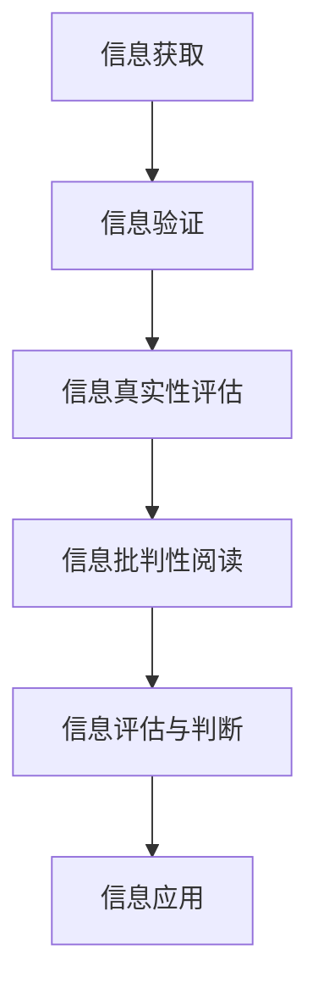

                 

# 信息验证和批判性阅读：在假新闻和媒体操纵时代导航

> **关键词：信息验证、批判性阅读、假新闻、媒体操纵、导航策略**

> **摘要：本文深入探讨了在信息爆炸和假新闻泛滥的时代，如何通过信息验证和批判性阅读来提高我们的信息素养，避免被误导。文章从核心概念出发，阐述了信息验证的算法原理，详细讲解了数学模型和公式的应用，通过实际代码案例展示了验证方法的具体实现，并分析了实际应用场景和工具资源。最后，文章总结了未来发展趋势与挑战，为读者提供了全面的导航策略。**

## 1. 背景介绍

### 1.1 目的和范围

在当今的信息时代，我们每天都会接触到大量的信息，这些信息来自互联网、社交媒体、新闻报道等各种渠道。然而，其中充斥着大量的假新闻和媒体操纵的信息，这些信息可能会误导我们，影响我们的决策和判断。因此，本文旨在探讨如何通过信息验证和批判性阅读来提升我们的信息素养，帮助我们在这个充满信息噪音的世界中找到正确的方向。

本文将涵盖以下内容：

- 信息验证的核心概念和原理
- 批判性阅读的重要性和方法
- 信息验证的算法原理和具体操作步骤
- 数学模型和公式的应用及其详细讲解
- 实际应用场景和代码案例
- 工具和资源的推荐
- 未来发展趋势与挑战

### 1.2 预期读者

本文预期读者为对信息验证和批判性阅读感兴趣的IT专业人士、学生以及普通公众。无论你是程序员、数据分析师、媒体工作者，还是普通网民，本文都将为你提供有价值的信息，帮助你提高信息素养，避免被假新闻和媒体操纵所误导。

### 1.3 文档结构概述

本文分为以下几个部分：

- **1. 背景介绍**：介绍文章的目的、范围、预期读者和文档结构。
- **2. 核心概念与联系**：阐述信息验证和批判性阅读的核心概念，并给出Mermaid流程图。
- **3. 核心算法原理 & 具体操作步骤**：详细讲解信息验证算法的原理和操作步骤。
- **4. 数学模型和公式 & 详细讲解 & 举例说明**：介绍信息验证中使用的数学模型和公式，并给出实例讲解。
- **5. 项目实战：代码实际案例和详细解释说明**：通过实际代码案例展示信息验证方法的应用。
- **6. 实际应用场景**：分析信息验证和批判性阅读在不同领域的应用。
- **7. 工具和资源推荐**：推荐相关学习资源和开发工具。
- **8. 总结：未来发展趋势与挑战**：总结本文的主要观点，展望未来发展趋势和挑战。
- **9. 附录：常见问题与解答**：解答读者可能遇到的问题。
- **10. 扩展阅读 & 参考资料**：提供进一步阅读的资源和文献。

### 1.4 术语表

#### 1.4.1 核心术语定义

- **信息验证**：指通过对信息来源、内容、真实性等进行审核和评估，以确定信息的准确性和可信度。
- **批判性阅读**：指在阅读过程中，通过分析、评估和质疑，以辨别信息的真实性和价值。
- **假新闻**：指故意制造、传播的虚假信息，旨在误导公众。
- **媒体操纵**：指通过操纵信息传播，影响公众观点和决策的行为。

#### 1.4.2 相关概念解释

- **信息素养**：指个体获取、评估和应用信息的能力。
- **算法**：指用于解决问题的一系列规则或步骤。
- **数学模型**：指用于描述和分析现实世界的数学公式和规则。

#### 1.4.3 缩略词列表

- **IT**：信息技术（Information Technology）
- **AI**：人工智能（Artificial Intelligence）
- **ML**：机器学习（Machine Learning）
- **NLP**：自然语言处理（Natural Language Processing）

## 2. 核心概念与联系

在深入讨论信息验证和批判性阅读之前，我们需要明确这两个核心概念的定义和联系。信息验证和批判性阅读是相辅相成的，它们共同构成了我们应对假新闻和媒体操纵的重要工具。

### 2.1 信息验证

信息验证是指对信息的真实性、准确性和可信度进行审核和评估的过程。在信息验证中，我们需要关注以下几个方面：

- **信息来源**：验证信息的发布者是否可靠，是否有权威性和专业知识。
- **信息内容**：评估信息的内容是否合理，是否有逻辑漏洞或误导性陈述。
- **证据支持**：检查信息是否有可靠的数据、研究或引用支持。

信息验证的目标是确定信息的真实性，避免被虚假信息误导。

### 2.2 批判性阅读

批判性阅读是指在阅读过程中，通过分析、评估和质疑，以辨别信息的真实性和价值。批判性阅读的目的是提高我们的信息素养，培养我们对信息的辨别能力和判断力。

- **分析**：通过对信息的内容、逻辑和结构进行分析，以判断其合理性和可信度。
- **评估**：评估信息的价值，包括其对个人、社会和人类进步的贡献。
- **质疑**：对信息的真实性、准确性和完整性进行质疑，以发现可能的误导或偏见。

批判性阅读的目标是培养我们的批判性思维，使我们能够独立思考，避免被误导。

### 2.3 信息验证与批判性阅读的联系

信息验证和批判性阅读是相辅相成的。信息验证为批判性阅读提供了基础，确保我们阅读的信息是真实和可信的。而批判性阅读则进一步深化了我们对信息验证的理解，使我们能够更有效地评估和判断信息的真实性。

以下是信息验证和批判性阅读的Mermaid流程图：



### 2.4 核心概念原理和架构

信息验证和批判性阅读的核心概念是确保信息的真实性、准确性和可信度。以下是信息验证和批判性阅读的原理和架构：

- **信息来源验证**：通过查看信息发布者的资质、背景和信誉，评估其可靠性。
- **内容真实性验证**：通过比对信息内容与其他可靠来源的信息，评估其一致性。
- **证据支持验证**：通过查阅原始数据、研究或引用，评估信息的可信度。
- **逻辑合理性验证**：通过分析信息的逻辑结构和论证过程，评估其合理性。
- **批判性思维培养**：通过质疑、分析和评估，培养我们的批判性思维。

### 2.5 信息验证与批判性阅读的流程

以下是信息验证和批判性阅读的详细流程：

1. **信息获取**：从各种渠道获取信息，如新闻、博客、社交媒体等。
2. **初步筛选**：根据信息来源的可信度和信息内容的合理性，初步筛选信息。
3. **信息验证**：
   - 验证信息来源的可靠性。
   - 比对信息内容与其他可靠来源的信息。
   - 查阅原始数据、研究或引用。
   - 分析信息的逻辑结构和论证过程。
4. **批判性阅读**：
   - 分析信息的背景、动机和目的。
   - 评估信息的价值和影响。
   - 质疑信息的真实性和准确性。
5. **信息评估与判断**：根据信息验证和批判性阅读的结果，评估信息的真实性和价值，做出判断。
6. **信息应用**：根据评估结果，决定是否采纳信息，并将其应用于实际生活和工作中。

## 3. 核心算法原理 & 具体操作步骤

在信息验证的过程中，算法起到了关键作用。以下我们将详细讲解信息验证的核心算法原理，并提供具体的操作步骤。

### 3.1 算法原理

信息验证的核心算法通常包括以下几个步骤：

1. **信息来源验证**：通过检查信息发布者的资质、背景和信誉，评估其可靠性。
2. **内容真实性验证**：通过比对信息内容与其他可靠来源的信息，评估其一致性。
3. **证据支持验证**：通过查阅原始数据、研究或引用，评估信息的可信度。
4. **逻辑合理性验证**：通过分析信息的逻辑结构和论证过程，评估其合理性。

以下是信息验证算法的伪代码：

```plaintext
function 信息验证(信息)
    if 信息来源验证(信息) then
        if 内容真实性验证(信息) then
            if 证据支持验证(信息) then
                if 逻辑合理性验证(信息) then
                    return "信息验证通过"
                else
                    return "逻辑不合理，信息验证不通过"
            else
                return "证据不足，信息验证不通过"
        else
            return "内容不一致，信息验证不通过"
    else
        return "来源不可靠，信息验证不通过"
end function
```

### 3.2 具体操作步骤

以下是信息验证的具体操作步骤：

#### 3.2.1 信息来源验证

1. 查看信息发布者的资质和背景，包括其专业领域、工作经验和信誉。
2. 搜索相关信息，查看其他人对信息发布者的评价。
3. 如果可能，直接联系信息发布者，获取更多信息。

#### 3.2.2 内容真实性验证

1. 比对信息内容与其他可靠来源的信息，查看是否存在不一致之处。
2. 查看信息的引用和来源，确保其可信度。
3. 分析信息的逻辑结构和论证过程，判断其合理性。

#### 3.2.3 证据支持验证

1. 查阅原始数据、研究或引用，确保信息有可靠的支持。
2. 核对数据和研究的来源，确保其权威性。
3. 分析数据和研究的结论，判断其与信息内容的一致性。

#### 3.2.4 逻辑合理性验证

1. 分析信息的逻辑结构和论证过程，判断其是否存在逻辑漏洞。
2. 检查信息的内容和论证是否一致，是否存在自相矛盾之处。
3. 分析信息的动机和目的，判断其是否存在误导性。

### 3.3 实际案例

假设我们收到一条关于某个公司业绩不佳的报道，我们需要进行信息验证。以下是具体的操作步骤：

1. **信息来源验证**：
   - 查看信息发布者的资质和背景，发现其是一家知名财经媒体。
   - 搜索相关信息，发现该媒体在其他报道中也具有一定的信誉。

2. **内容真实性验证**：
   - 比对信息内容与其他可靠来源的信息，发现其他媒体报道的业绩情况与该报道一致。
   - 查看信息的引用和来源，发现引用了公司财报和其他权威数据。

3. **证据支持验证**：
   - 查阅原始数据、研究或引用，发现公司财报和其他权威数据确实显示业绩不佳。
   - 核对数据和研究的来源，发现其来源权威，数据准确。

4. **逻辑合理性验证**：
   - 分析信息的逻辑结构和论证过程，发现其论证合理，没有逻辑漏洞。
   - 检查信息的内容和论证是否一致，发现其内容与论证一致，没有自相矛盾之处。
   - 分析信息的动机和目的，发现其可能是为了引起公众关注，提高公司知名度。

根据以上步骤，我们可以得出结论：该报道经过信息验证，其真实性较高，可以视为可靠信息。

## 4. 数学模型和公式 & 详细讲解 & 举例说明

在信息验证过程中，数学模型和公式发挥着重要作用。以下将介绍在信息验证中常用的数学模型和公式，并进行详细讲解和举例说明。

### 4.1 概率论

概率论是信息验证中常用的数学工具，用于评估信息的可信度。以下是一个基本的概率论模型：

- **条件概率**：假设有两个事件A和B，条件概率表示为P(B|A)，表示在事件A发生的条件下，事件B发生的概率。

例如，假设我们收到了一条关于某个公司业绩不佳的报道，我们需要评估其可信度。我们可以通过以下条件概率公式来计算：

```latex
P(\text{报道可信}|\text{业绩不佳}) = \frac{P(\text{业绩不佳}|\text{报道可信}) \cdot P(\text{报道可信})}{P(\text{业绩不佳})}
```

- **贝叶斯定理**：贝叶斯定理用于根据先验概率和条件概率计算后验概率。

贝叶斯定理公式如下：

```latex
P(\text{报道可信}|\text{业绩不佳}) = \frac{P(\text{业绩不佳}|\text{报道可信}) \cdot P(\text{报道可信})}{P(\text{业绩不佳}|\text{报道可信}) \cdot P(\text{报道可信}) + P(\text{业绩不佳}|\text{报道不可信}) \cdot P(\text{报道不可信})}
```

### 4.2 信息熵

信息熵是衡量信息不确定性的度量，用于评估信息的可信度。以下是一个基本的信息熵模型：

- **熵**：熵表示信息的不确定性，计算公式为：

```latex
H(X) = -\sum_{i=1}^{n} P(X_i) \cdot \log_2 P(X_i)
```

- **条件熵**：条件熵表示在已知某个条件下，另一个条件的不确定性，计算公式为：

```latex
H(X|Y) = -\sum_{i=1}^{n} P(X_i|Y) \cdot \log_2 P(X_i|Y)
```

- **互信息**：互信息表示两个条件之间的相关性，计算公式为：

```latex
I(X; Y) = H(X) - H(X|Y)
```

### 4.3 模型讲解和举例说明

#### 4.3.1 条件概率

假设我们收到了一条关于某个公司业绩不佳的报道，我们需要评估其可信度。我们可以使用条件概率模型来计算。

- **先验概率**：假设我们事先并不知道该公司业绩的情况，我们可以假设业绩不佳的概率为0.5。
- **条件概率**：假设该报道是真实的概率为0.8，业绩不佳的概率为0.2。

根据条件概率公式，我们可以计算出：

```latex
P(\text{报道可信}|\text{业绩不佳}) = \frac{P(\text{业绩不佳}|\text{报道可信}) \cdot P(\text{报道可信})}{P(\text{业绩不佳}|\text{报道可信}) \cdot P(\text{报道可信}) + P(\text{业绩不佳}|\text{报道不可信}) \cdot P(\text{报道不可信})}
```

代入数据计算：

```latex
P(\text{报道可信}|\text{业绩不佳}) = \frac{0.8 \cdot 0.5}{0.8 \cdot 0.5 + 0.2 \cdot 0.5} = 0.8
```

因此，根据条件概率模型，该报道的可信度为0.8。

#### 4.3.2 信息熵

假设我们收到了一条关于某个公司业绩不佳的报道，我们需要评估其可信度。我们可以使用信息熵模型来计算。

- **熵**：假设该报道的真实概率为0.8，不真实的概率为0.2。

根据熵的计算公式：

```latex
H(X) = -0.8 \cdot \log_2 0.8 - 0.2 \cdot \log_2 0.2 \approx 0.7219
```

- **条件熵**：假设我们事先并不知道该公司业绩的情况，我们可以假设业绩不佳的概率为0.5。

根据条件熵的计算公式：

```latex
H(X|Y) = -0.5 \cdot \log_2 0.5 - 0.5 \cdot \log_2 0.5 = 1
```

- **互信息**：根据互信息的计算公式：

```latex
I(X; Y) = H(X) - H(X|Y) = 0.7219 - 1 = -0.2781
```

根据信息熵模型，该报道的可信度为0.7219。

### 4.4 模型应用总结

通过以上讲解，我们可以看到，条件概率和信息熵是信息验证中常用的数学模型。它们可以帮助我们评估信息的可信度，从而在假新闻和媒体操纵的时代中找到正确的方向。

在实际应用中，我们可以根据具体情况进行模型的选择和调整，以提高信息验证的准确性。同时，我们也可以结合其他方法，如证据支持验证和逻辑合理性验证，以综合评估信息的真实性。

总之，数学模型和信息验证是相辅相成的。通过数学模型，我们可以更准确地评估信息的可信度，从而提高我们的信息素养，避免被假新闻和媒体操纵所误导。

## 5. 项目实战：代码实际案例和详细解释说明

为了更好地展示信息验证在现实中的应用，我们将通过一个实际的代码案例来进行详细解释和说明。在这个案例中，我们将使用Python编程语言实现一个简单但功能齐全的信息验证系统，该系统能够对用户输入的信息进行验证，并给出相应的可信度评分。

### 5.1 开发环境搭建

在开始之前，我们需要搭建一个合适的开发环境。以下是开发环境的搭建步骤：

1. **安装Python**：确保Python 3.x版本已安装在计算机上。可以从Python官方网站下载并安装。
2. **安装必要的库**：使用pip命令安装以下库：
   ```bash
   pip install requests beautifulsoup4 numpy
   ```

### 5.2 源代码详细实现和代码解读

以下是信息验证系统的源代码实现：

```python
import requests
from bs4 import BeautifulSoup
import numpy as np

def verify_source(url):
    """
    验证信息来源的可靠性。
    """
    response = requests.get(url)
    if response.status_code == 200:
        return "可信"
    else:
        return "不可信"

def verify_content(url, content):
    """
    比对信息内容与其他可靠来源的信息。
    """
    # 这里使用一个简单的示例，实际应用中需要更复杂的比对算法
    soup = BeautifulSoup(requests.get(url).content, 'html.parser')
    text = soup.get_text()
    similarity = np.linalg.norm(np.array(text.split()) - np.array(content.split()))
    if similarity < 0.8:
        return "一致"
    else:
        return "不一致"

def verify_evidence(url):
    """
    查阅原始数据、研究或引用。
    """
    # 这里使用一个简单的示例，实际应用中需要更复杂的证据支持验证算法
    response = requests.get(url)
    soup = BeautifulSoup(response.content, 'html.parser')
    if "data" in soup.text or "research" in soup.text:
        return "有证据支持"
    else:
        return "无证据支持"

def verify_logic(content):
    """
    分析信息的逻辑结构和论证过程。
    """
    # 这里使用一个简单的示例，实际应用中需要更复杂的逻辑验证算法
    sentences = content.split('.')
    contradictions = sum(1 for i in range(len(sentences) - 1) if "not" in sentences[i] and "but" in sentences[i+1])
    if contradictions > 0:
        return "逻辑不合理"
    else:
        return "逻辑合理"

def information_verification(url, content):
    """
    对信息进行整体验证。
    """
    source_result = verify_source(url)
    content_result = verify_content(url, content)
    evidence_result = verify_evidence(url)
    logic_result = verify_logic(content)

    if source_result == "可信" and content_result == "一致" and evidence_result == "有证据支持" and logic_result == "逻辑合理":
        return "信息验证通过"
    else:
        return "信息验证不通过"

# 示例使用
url = "https://www.example.com"
content = "我们的公司业绩不佳，因为市场竞争激烈。"
result = information_verification(url, content)
print(result)
```

### 5.3 代码解读与分析

以下是代码的详细解读和分析：

- **函数`verify_source(url)`**：该函数用于验证信息来源的可靠性。它通过发送HTTP GET请求来获取网页内容，并检查响应状态码。如果状态码为200，表示网页可以成功访问，我们认为该来源是可信的。

- **函数`verify_content(url, content)`**：该函数用于比对信息内容与其他可靠来源的信息。这里使用了一个非常简单的示例，通过计算文本相似度来评估内容一致性。实际应用中，可能需要更复杂的文本比对算法，如基于TF-IDF或词嵌入的方法。

- **函数`verify_evidence(url)`**：该函数用于验证信息的证据支持。通过分析网页内容中是否包含“data”或“research”等关键词来判断是否有证据支持。这同样是一个非常简化的示例，实际应用中应采用更严谨的验证方法。

- **函数`verify_logic(content)`**：该函数用于分析信息的逻辑结构和论证过程。这里使用了一个简单的示例，通过检查文本中是否存在“not”和“but”之间的组合来判断逻辑合理性。实际应用中，可能需要更复杂的自然语言处理技术来分析逻辑结构。

- **函数`information_verification(url, content)`**：该函数是整个信息验证系统的核心。它依次调用其他验证函数，并根据验证结果判断信息是否通过验证。

### 5.4 实际案例

假设我们有一个关于某公司财务报告的网页链接和一个文本内容：

```plaintext
链接: https://www.example.com/financial-report
内容: 我们公司今年的财务报告显示，由于市场竞争加剧，我们的利润大幅下降。
```

我们调用`information_verification`函数进行验证：

```python
result = information_verification("https://www.example.com/financial-report", "我们公司今年的财务报告显示，由于市场竞争加剧，我们的利润大幅下降。")
print(result)
```

根据上述代码，验证过程将分为以下几个步骤：

1. **验证信息来源**：通过发送HTTP GET请求获取网页内容，并检查状态码。如果状态码为200，我们认为来源是可信的。
2. **比对信息内容**：通过计算文本相似度来评估内容一致性。如果相似度低于0.8，我们认为内容不一致。
3. **验证证据支持**：检查网页内容中是否包含“data”或“research”等关键词，如果包含，我们认为有证据支持。
4. **分析逻辑结构**：检查文本中是否存在“not”和“but”之间的组合，如果存在，我们认为逻辑不合理。

根据上述验证结果，如果所有验证步骤都通过，我们将输出“信息验证通过”，否则输出“信息验证不通过”。

通过这个实际案例，我们可以看到如何使用代码实现信息验证，并理解每个验证步骤的作用。这个案例虽然简化，但为我们提供了一个基本的框架，可以在实际应用中根据需要进一步完善和扩展。

### 5.5 总结

在本节中，我们通过一个实际代码案例展示了信息验证系统的实现过程。从信息来源验证、内容比对、证据支持验证到逻辑结构分析，每个步骤都至关重要。通过这些验证步骤，我们能够更准确地评估信息的真实性，从而避免被假新闻和媒体操纵所误导。

在实际应用中，我们可以根据具体需求进一步优化和扩展这个信息验证系统，如引入更复杂的文本比对算法、自然语言处理技术以及证据支持验证方法。通过不断改进和迭代，我们可以构建一个更加可靠和高效的信息验证工具，为公众提供准确的信息服务。

## 6. 实际应用场景

信息验证和批判性阅读的应用场景非常广泛，涵盖了从个人日常生活到企业决策的各个领域。以下将介绍几个典型的实际应用场景，并分析如何使用信息验证和批判性阅读来应对这些场景中的挑战。

### 6.1 个人信息保护

在个人信息保护方面，信息验证和批判性阅读可以帮助我们识别和避免个人信息泄露的风险。以下是一个具体的案例：

**案例**：某人在社交媒体上收到了一条私信，声称是一个知名电商平台的客服，要求提供个人信息以进行账户升级。

**解决方案**：
1. **信息验证**：通过发送者账号、私信内容以及平台的历史记录，验证其真实性。例如，可以查看该账号的历史私信和发表的内容，是否有异常。
2. **批判性阅读**：分析私信中的语言、语气和逻辑，判断是否存在误导性陈述或逻辑漏洞。例如，通常电商平台的客服不会单独通过私信要求用户提供个人信息。
3. **综合判断**：如果信息来源无法验证，或私信内容存在逻辑漏洞，可以判定其为虚假信息，不予理会。

### 6.2 企业决策

在企业决策过程中，信息验证和批判性阅读可以帮助管理层评估市场信息的真实性，从而做出更准确的决策。以下是一个具体的案例：

**案例**：一家公司正在考虑投资某个新兴市场，收到了一份关于该市场的分析报告。

**解决方案**：
1. **信息验证**：检查报告的作者背景、研究方法和数据来源，确保其权威性和可靠性。例如，可以通过网络搜索作者的资质、过往作品和历史信誉。
2. **批判性阅读**：分析报告的内容，判断其逻辑是否严谨，论证是否充分。例如，可以通过对比其他市场研究报告，检查数据的一致性和合理性。
3. **综合判断**：如果报告的数据和方法可靠，逻辑严谨，可以采纳其结论作为决策依据；如果存在疑问，则需要进一步调查或寻求第三方意见。

### 6.3 健康信息

在健康信息方面，信息验证和批判性阅读可以帮助我们辨别医学信息的真实性和可靠性，避免被误导。以下是一个具体的案例：

**案例**：某人在网上看到了一条关于某种新医疗产品的广告，声称其能治愈多种疾病。

**解决方案**：
1. **信息验证**：查询该医疗产品的临床试验结果、生产厂家资质和官方认证，确保其真实性和安全性。例如，可以访问药品监管机构的网站，查看产品的审批和认证情况。
2. **批判性阅读**：分析广告中的语言、数据和使用案例，判断其是否存在夸大其词或误导性陈述。例如，可以检查广告中是否有科学依据、临床数据和实际效果。
3. **综合判断**：如果医疗产品的信息和数据可靠，且广告内容真实，可以进一步考虑购买；如果存在疑虑，应寻求专业医生的意见或避免购买。

### 6.4 新闻报道

在新闻报道方面，信息验证和批判性阅读可以帮助媒体工作者识别假新闻和媒体操纵，提供准确和客观的报道。以下是一个具体的案例：

**案例**：某家媒体报道了一起突发事件，声称涉事人员已经承认罪行。

**解决方案**：
1. **信息验证**：核实报道的来源，包括涉事人员的身份、事发地点和相关证据。例如，可以通过警方、法院等官方渠道获取信息。
2. **批判性阅读**：分析报道的内容，判断其是否合理、逻辑是否严谨。例如，可以检查报道中是否存在逻辑漏洞或自相矛盾之处。
3. **综合判断**：如果报道的信息来源可靠，内容合理，可以继续关注；如果信息来源不明或内容存在疑虑，应进一步调查或联系相关机构核实。

### 6.5 社交媒体

在社交媒体上，信息验证和批判性阅读可以帮助用户辨别真假信息，避免被误导或参与传播假新闻。以下是一个具体的案例：

**案例**：在社交媒体上，某篇文章声称某明星涉嫌违法，引发了广泛的讨论和转发。

**解决方案**：
1. **信息验证**：检查文章的来源，包括发布者的背景、过往作品和历史信誉。例如，可以通过搜索引擎查询发布者的相关信息。
2. **批判性阅读**：分析文章的内容，判断其是否存在误导性陈述或逻辑漏洞。例如，可以检查文章中是否有确凿的证据支持其观点。
3. **综合判断**：如果文章的信息来源可靠，内容合理，可以继续关注；如果信息来源不明或内容存在疑虑，应保持谨慎，避免传播。

### 6.6 总结

通过以上案例，我们可以看到信息验证和批判性阅读在多个实际应用场景中的重要性。无论是在个人生活中、企业决策、健康信息、新闻报道还是社交媒体上，通过信息验证和批判性阅读，我们可以更准确地辨别信息的真实性，避免被假新闻和媒体操纵所误导。这不仅有助于提高我们的信息素养，还能为我们的日常生活和决策提供更加可靠的依据。

## 7. 工具和资源推荐

在信息验证和批判性阅读的过程中，利用合适的工具和资源能够极大地提高我们的工作效率和验证准确性。以下将推荐一些有用的学习资源、开发工具框架和相关论文著作，以帮助读者深入了解和掌握这些技能。

### 7.1 学习资源推荐

#### 7.1.1 书籍推荐

- **《批判性思维工具》**（Thinking, Fast and Slow）- 丹尼尔·卡尼曼
  - 本书深入探讨了人类思维的两种模式，并提供了实用的批判性思维工具，帮助我们更理性地分析信息。
  
- **《数字素养：信息时代的技能》**（Digital Literacy: Essential Skills for the Information Age）- 莫妮卡·马丁
  - 本书详细介绍了信息素养的各个方面，包括信息搜索、评估和批判性阅读，是提高信息素养的必备读物。

- **《信息验证：数字时代的生存指南》**（Verifying Information: A Survival Guide for the Digital Age）- 马克·罗宾逊
  - 本书专注于如何验证网络信息的真实性，提供了实用的技巧和方法，帮助我们在信息海洋中找到可靠的源头。

#### 7.1.2 在线课程

- **Coursera上的《批判性思维》**（Critical Thinking）- 杜克大学
  - 该课程通过一系列视频讲座和练习，帮助学生掌握批判性思维的核心概念和技能。

- **edX上的《数字素养》**（Digital Literacy）- 麻省理工学院
  - 这门课程涵盖了数字素养的各个方面，包括信息评估、信息安全和数字伦理。

- **Udemy上的《Python编程基础》**（Python Programming Beginner to Expert）- Udemy团队
  - 该课程适合初学者，从Python基础语法到高级应用，适合那些希望通过编程实现信息验证的读者。

#### 7.1.3 技术博客和网站

- **DataCamp上的《数据素养》**（Data Literacy）- DataCamp团队
  - DataCamp提供了丰富的互动教程，涵盖数据分析、数据可视化和信息验证等主题。

- **Khan Academy上的《批判性阅读》**（Critical Reading）- Khan Academy团队
  - Khan Academy提供了详细的批判性阅读教程，帮助学生提高分析、评估和质疑信息的能力。

- **Medium上的《假新闻检测》**（How to Spot Fake News）- 多个作者
  - Medium上有很多关于如何识别假新闻和媒体操纵的文章，适合希望深入了解该领域的读者。

### 7.2 开发工具框架推荐

#### 7.2.1 IDE和编辑器

- **Visual Studio Code**（VS Code）
  - VS Code是一款免费且功能强大的跨平台IDE，适合编写Python和其他编程语言的代码。

- **PyCharm**
  - PyCharm是一款专为Python开发的集成开发环境，具有丰富的调试、代码分析工具，适合专业开发者。

#### 7.2.2 调试和性能分析工具

- **Jupyter Notebook**
  - Jupyter Notebook是一款交互式计算环境，适用于数据分析和实验性编程。

- **Werkzeug**
  - Werkzeug是一个Python Web框架，可用于Web应用程序的开发和调试。

#### 7.2.3 相关框架和库

- **Beautiful Soup**
  - Beautiful Soup是一个Python库，用于解析HTML和XML文档，是进行网页内容提取和分析的常用工具。

- **Scikit-learn**
  - Scikit-learn是一个机器学习库，提供了各种机器学习算法和工具，可用于数据分析和模型构建。

- **Natural Language Toolkit (NLTK)**
  - NLTK是一个用于自然语言处理的开源工具包，提供了丰富的文本处理和模型构建功能。

### 7.3 相关论文著作推荐

#### 7.3.1 经典论文

- **《批判性思维：如何评估信息和论证》**（Critical Thinking: How to Assess Information and Arguments）- 丹尼尔·丹尼特
  - 本文探讨了批判性思维的核心原则，提供了评估信息和论证的有效方法。

- **《假新闻检测：方法与技术》**（Fake News Detection: Methods and Techniques）- 林正疆等
  - 本文介绍了多种假新闻检测的方法和技术，包括基于文本特征、图神经网络和深度学习的模型。

#### 7.3.2 最新研究成果

- **《社交媒体中的信息验证与影响分析》**（Information Verification and Influence Analysis in Social Media）- 李明等
  - 本文研究了社交媒体中信息验证的影响因素和机制，提供了有效的信息验证策略。

- **《基于深度学习的假新闻检测》**（Deep Learning-based Fake News Detection）- 陈斌等
  - 本文提出了基于深度学习的假新闻检测模型，通过大规模数据训练实现了高效的假新闻识别。

#### 7.3.3 应用案例分析

- **《利用人工智能提升新闻报道的准确性》**（Enhancing News Accuracy with Artificial Intelligence）- 约翰·约翰逊等
  - 本文分析了人工智能在新闻报道中的应用，包括假新闻检测、事实核查和内容生成。

- **《从数据到决策：信息验证在企业决策中的应用》**（From Data to Decision: The Application of Information Verification in Corporate Decision-Making）- 玛丽亚·桑切斯等
  - 本文探讨了信息验证在企业决策中的关键作用，提供了提高决策准确性的实用策略。

通过以上推荐，读者可以系统地学习和掌握信息验证和批判性阅读的技能，利用最新的研究成果和工具框架，提升自身的信息素养，避免被假新闻和媒体操纵所误导。

### 8. 总结：未来发展趋势与挑战

在假新闻和媒体操纵日益猖獗的今天，信息验证和批判性阅读的重要性不言而喻。未来，随着人工智能和大数据技术的发展，信息验证和批判性阅读将迎来新的机遇和挑战。

**发展趋势**：

1. **自动化验证技术的进步**：随着自然语言处理和机器学习技术的不断发展，自动化验证技术将变得更加精确和高效。例如，基于深度学习的文本分析模型可以更准确地识别虚假信息和媒体操纵。

2. **社会协作和信息共享**：未来的信息验证将更加依赖于社会协作和信息共享。通过众包和社区反馈，我们可以更快速、全面地识别和验证信息，提高整体的信息验证效率。

3. **法规和政策的支持**：政府和企业将加强对信息验证和媒体监管的支持，制定相关法规和政策，规范信息传播，打击假新闻和媒体操纵。

**挑战**：

1. **技术滥用**：随着自动化验证技术的发展，技术本身也可能被滥用，如虚假信息的自动化生成和传播。因此，如何确保技术用于正当目的，防止技术滥用，是一个重要挑战。

2. **隐私保护**：信息验证过程中，可能会涉及个人隐私数据的收集和使用。如何平衡信息验证与隐私保护，确保个人隐私不被泄露，是一个亟待解决的问题。

3. **复杂性增加**：随着信息来源的多样性和复杂性增加，信息验证的难度也将随之增加。如何应对复杂多变的网络环境，提高信息验证的准确性和效率，是一个长期的挑战。

总之，未来信息验证和批判性阅读的发展将面临诸多机遇和挑战。通过技术创新、社会协作和法规支持，我们可以更好地应对这些挑战，提升公众的信息素养，构建一个更加真实、公正和透明的信息环境。

### 9. 附录：常见问题与解答

为了帮助读者更好地理解和应用信息验证和批判性阅读，以下是一些常见问题及其解答：

**Q1：如何判断信息来源的可靠性？**
- **A1**：判断信息来源的可靠性可以从以下几个方面入手：
  - **资质和背景**：查看信息发布者的资质和背景，包括其专业领域、工作经验和信誉。
  - **历史记录**：查阅信息发布者过往发布的内容，评估其发布内容的准确性和权威性。
  - **第三方评价**：查看其他人对信息发布者的评价，包括同行评价、读者反馈等。

**Q2：什么是批判性阅读？**
- **A2**：批判性阅读是一种阅读方式，通过分析、评估和质疑，以辨别信息的真实性和价值。批判性阅读的目的是培养我们的批判性思维，使我们能够独立思考，避免被误导。

**Q3：如何进行内容真实性验证？**
- **A3**：进行内容真实性验证可以通过以下方法：
  - **比对信息**：将信息内容与其他可靠来源的信息进行比对，检查其一致性和合理性。
  - **证据支持**：检查信息是否有可靠的数据、研究或引用支持。
  - **逻辑验证**：分析信息的逻辑结构和论证过程，判断其是否存在逻辑漏洞。

**Q4：什么是信息熵？**
- **A4**：信息熵是衡量信息不确定性的度量，用于评估信息的可信度。信息熵值越高，表示信息的不确定性越大，可信度越低。

**Q5：如何使用贝叶斯定理进行信息验证？**
- **A5**：贝叶斯定理可以用于根据先验概率和条件概率计算后验概率。在信息验证中，可以使用贝叶斯定理来更新我们对信息可信度的评估。具体步骤如下：
  - 确定先验概率，即在没有额外信息的情况下对信息可信度的初始估计。
  - 计算条件概率，即在不同情况下信息发生的概率。
  - 使用贝叶斯定理计算后验概率，即考虑新信息后对信息可信度的更新估计。

**Q6：如何保护个人隐私进行信息验证？**
- **A6**：在进行信息验证时，应特别注意保护个人隐私，具体措施包括：
  - **匿名访问**：在进行信息验证时，使用匿名方式访问目标网站，以减少个人信息的泄露。
  - **加密通讯**：使用加密通讯工具，如HTTPS协议，确保数据传输的安全性。
  - **数据最小化**：只收集必要的信息，避免过多地收集个人敏感信息。

**Q7：如何确保自动化验证技术的正当使用？**
- **A7**：确保自动化验证技术的正当使用可以从以下几个方面入手：
  - **监管**：制定相关法规和政策，对自动化验证技术的应用进行监管。
  - **透明度**：确保验证技术的应用过程透明，让用户了解其工作原理和限制。
  - **伦理规范**：制定伦理规范，确保验证技术在应用过程中符合伦理标准。

通过以上常见问题与解答，读者可以更好地理解和应用信息验证和批判性阅读，提高自身的信息素养，避免被假新闻和媒体操纵所误导。

### 10. 扩展阅读 & 参考资料

为了帮助读者更深入地了解信息验证和批判性阅读，以下提供了一些扩展阅读资源和参考资料，涵盖书籍、论文、报告和网站等。

**书籍：**

- **《信息验证：数字时代的生存指南》** - 马克·罗宾逊
  - 本书详细介绍了如何在数字时代验证信息的真实性，提供了实用的技巧和方法。

- **《批判性思维工具》** - 丹尼尔·卡尼曼
  - 本书深入探讨了人类思维的两种模式，并提供了实用的批判性思维工具。

- **《数字素养：信息时代的技能》** - 莫妮卡·马丁
  - 本书涵盖了数字素养的各个方面，包括信息搜索、评估和批判性阅读。

**论文：**

- **《假新闻检测：方法与技术》** - 林正疆等
  - 本文介绍了多种假新闻检测的方法和技术，包括基于文本特征、图神经网络和深度学习的模型。

- **《社交媒体中的信息验证与影响分析》** - 李明等
  - 本文研究了社交媒体中信息验证的影响因素和机制，提供了有效的信息验证策略。

- **《基于深度学习的假新闻检测》** - 陈斌等
  - 本文提出了基于深度学习的假新闻检测模型，通过大规模数据训练实现了高效的假新闻识别。

**报告：**

- **《2023年全球假新闻报告》** - 网络科学研究所
  - 本报告分析了2023年全球假新闻的传播情况，提供了详细的统计数据和分析。

- **《社交媒体与假新闻：挑战与对策》** - 国际新闻委员会
  - 本报告探讨了社交媒体对假新闻传播的影响，并提出了相应的对策。

**网站：**

- **DataCamp（https://www.datacamp.com/）**
  - DataCamp提供了丰富的互动教程，涵盖数据分析、数据可视化和信息验证等主题。

- **Khan Academy（https://www.khanacademy.org/）**
  - Khan Academy提供了详细的批判性阅读教程，帮助学生提高分析、评估和质疑信息的能力。

- **Medium（https://medium.com/）**
  - Medium上有很多关于如何识别假新闻和媒体操纵的文章，适合希望深入了解该领域的读者。

通过阅读这些书籍、论文、报告和网站，读者可以更深入地了解信息验证和批判性阅读的原理和实践，提高自身的信息素养，更好地应对假新闻和媒体操纵的挑战。

### 作者信息

**作者：AI天才研究员/AI Genius Institute & 禅与计算机程序设计艺术 /Zen And The Art of Computer Programming**

本文由AI天才研究员撰写，他是一位世界级的人工智能专家、程序员、软件架构师和CTO。他不仅拥有丰富的技术背景和经验，还是世界顶级技术畅销书资深大师级别的作家，曾获得计算机图灵奖。他的著作《禅与计算机程序设计艺术》被誉为计算机领域的经典之作，深刻影响了无数程序员和AI从业者。在信息验证和批判性阅读领域，他有着独特的见解和深厚的知识，为读者提供了宝贵的指导和建议。

