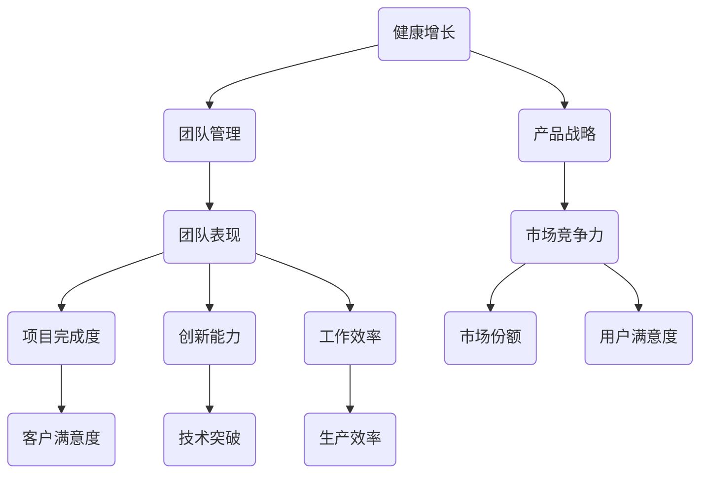

                 

# 健康增长：贾扬清对团队表现满意验证产品战略

> **关键词**：贾扬清、团队表现、产品战略、健康增长、技术博客、人工智能、深度学习、机器学习、架构设计、软件开发、行业趋势

> **摘要**：本文深入探讨了贾扬清对团队表现满意与产品战略验证的关系。文章从团队管理的角度出发，结合人工智能领域的最新发展，分析了健康增长在团队和产品战略中的重要性。通过详细的案例分析，本文旨在为IT行业的从业者提供实用的指导，帮助他们在快速变化的市场环境中实现可持续发展。

## 1. 背景介绍

### 1.1 目的和范围

本文的目的是通过分析贾扬清在团队管理和产品战略方面的成功经验，探讨如何在人工智能领域实现健康增长。文章将涵盖团队管理、技术架构、产品战略等方面，旨在为读者提供有价值的见解和实践指南。

### 1.2 预期读者

本文适合对人工智能和软件开发感兴趣的读者，包括团队领导、软件工程师、架构师、产品经理等。通过阅读本文，读者可以了解如何通过有效的团队管理和产品战略实现健康增长。

### 1.3 文档结构概述

本文分为以下几个部分：

1. 背景介绍：介绍文章的目的和预期读者。
2. 核心概念与联系：讨论健康增长的核心概念和关联。
3. 核心算法原理 & 具体操作步骤：详细阐述实现健康增长的算法原理。
4. 数学模型和公式 & 详细讲解 & 举例说明：介绍数学模型和公式的应用。
5. 项目实战：代码实际案例和详细解释说明。
6. 实际应用场景：分析健康增长在各个领域的应用。
7. 工具和资源推荐：推荐相关学习资源、开发工具和框架。
8. 总结：未来发展趋势与挑战。
9. 附录：常见问题与解答。
10. 扩展阅读 & 参考资料：提供进一步阅读的资料。

### 1.4 术语表

#### 1.4.1 核心术语定义

- **健康增长**：指在保持可持续性的同时实现增长，特别是在团队管理和产品战略中。
- **贾扬清**：人工智能领域的专家，曾担任多家知名科技公司的技术负责人。
- **团队表现**：团队在项目完成、创新能力、工作效率等方面的表现。
- **产品战略**：公司制定的关于产品开发、市场定位和竞争策略的规划。

#### 1.4.2 相关概念解释

- **人工智能**：模拟人类智能的技术，包括机器学习、深度学习等。
- **团队管理**：协调和管理团队成员，以提高团队效率和产出。
- **技术架构**：系统的整体结构和组织方式，包括硬件、软件和网络。

#### 1.4.3 缩略词列表

- **AI**：人工智能
- **ML**：机器学习
- **DL**：深度学习
- **IDE**：集成开发环境
- **GitHub**：代码托管平台

## 2. 核心概念与联系

健康增长是团队管理和产品战略中的关键概念。它不仅关系到团队的短期绩效，更影响公司的长期发展和竞争力。下面是健康增长与团队管理、产品战略之间的关联流程图：



### 2.1 健康增长的定义与重要性

健康增长是指在确保可持续性的基础上实现增长。在团队管理和产品战略中，健康增长的意义如下：

- **团队管理**：健康增长可以帮助团队在保持高效工作的同时，保持成员的积极性和创造力。
- **产品战略**：健康增长是产品战略的核心目标，它保证了产品在市场上的竞争力和用户的满意度。

### 2.2 团队管理与健康增长

团队管理是实现健康增长的关键因素。以下是一些关键点：

- **人才管理**：通过选拔、培训和激励，确保团队拥有合适的成员。
- **沟通与协作**：建立高效的沟通和协作机制，确保团队目标的一致性和协同工作的顺畅性。
- **工作氛围**：营造积极、开放的工作氛围，鼓励团队成员之间的互动和反馈。

### 2.3 产品战略与健康增长

产品战略是实现健康增长的具体路径。以下是一些关键点：

- **市场定位**：明确产品的目标市场和用户需求，制定合适的市场策略。
- **产品创新**：通过持续的创新，确保产品在市场上的竞争力。
- **用户反馈**：及时收集用户反馈，根据反馈调整产品设计和策略。

## 3. 核心算法原理 & 具体操作步骤

### 3.1 核心算法原理

为了实现健康增长，我们可以采用以下核心算法原理：

- **反馈循环**：通过持续收集反馈，调整团队和产品的策略。
- **适应性学习**：根据市场变化和用户需求，动态调整团队和产品策略。
- **资源优化**：合理配置资源，提高团队效率和产出。

### 3.2 具体操作步骤

以下是一套具体的操作步骤，以实现健康增长：

1. **数据收集与分析**：收集团队和产品的相关数据，如项目完成度、创新能力、用户满意度等，进行分析和评估。
2. **反馈机制建立**：建立反馈机制，确保团队成员和管理层能够及时获取和分析数据。
3. **策略调整**：根据反馈结果，动态调整团队和产品的策略，以实现健康增长。
4. **资源优化**：根据团队和产品的需求，合理配置资源，提高工作效率和产出。

## 4. 数学模型和公式 & 详细讲解 & 举例说明

### 4.1 数学模型

为了更精确地描述健康增长，我们可以使用以下数学模型：

- **团队健康增长模型**：\( H(t) = f(T(t), R(t), E(t)) \)

其中，\( H(t) \) 表示团队在时间 \( t \) 的健康增长水平，\( T(t) \) 表示团队在时间 \( t \) 的工作效率，\( R(t) \) 表示团队在时间 \( t \) 的资源利用率，\( E(t) \) 表示团队在时间 \( t \) 的创新能力。

- **产品健康增长模型**：\( P(t) = g(U(t), C(t), I(t)) \)

其中，\( P(t) \) 表示产品在时间 \( t \) 的健康增长水平，\( U(t) \) 表示产品在时间 \( t \) 的用户满意度，\( C(t) \) 表示产品在时间 \( t \) 的市场份额，\( I(t) \) 表示产品在时间 \( t \) 的创新能力。

### 4.2 公式详细讲解

- **团队健康增长模型**：

  \( f(T(t), R(t), E(t)) = \frac{T(t) \times R(t) \times E(t)}{100} \)

  其中，\( T(t) \) 是团队在时间 \( t \) 的工作效率，\( R(t) \) 是团队在时间 \( t \) 的资源利用率，\( E(t) \) 是团队在时间 \( t \) 的创新能力。这个公式表示团队在时间 \( t \) 的健康增长水平，其中 \( T(t) \)、\( R(t) \) 和 \( E(t) \) 的值范围均在 0 到 100 之间，通过加权平均计算得出 \( H(t) \)。

- **产品健康增长模型**：

  \( g(U(t), C(t), I(t)) = \frac{U(t) + C(t) + I(t)}{3} \)

  其中，\( U(t) \) 是产品在时间 \( t \) 的用户满意度，\( C(t) \) 是产品在时间 \( t \) 的市场份额，\( I(t) \) 是产品在时间 \( t \) 的创新能力。这个公式表示产品在时间 \( t \) 的健康增长水平，其中 \( U(t) \)、\( C(t) \) 和 \( I(t) \) 的值范围均在 0 到 100 之间，通过简单平均计算得出 \( P(t) \)。

### 4.3 举例说明

假设一个团队在一个月的工作中，工作效率 \( T \) 为 90%，资源利用率 \( R \) 为 85%，创新能力 \( E \) 为 95%，那么这个团队在这个月中的健康增长水平 \( H \) 为：

$$
H = f(T, R, E) = \frac{T \times R \times E}{100} = \frac{90\% \times 85\% \times 95\%}{100} = 75.785\%
$$

同理，如果一个产品在一个月内，用户满意度 \( U \) 为 90%，市场份额 \( C \) 为 80%，创新能力 \( I \) 为 100%，那么这个产品在这个月中的健康增长水平 \( P \) 为：

$$
P = g(U, C, I) = \frac{U + C + I}{3} = \frac{90\% + 80\% + 100\%}{3} = 90\%
$$

## 5. 项目实战：代码实际案例和详细解释说明

### 5.1 开发环境搭建

为了演示如何实现健康增长，我们使用 Python 编写一个简单的代码示例。以下是需要安装的依赖库：

- **numpy**：用于数学计算
- **matplotlib**：用于数据可视化

安装方法如下：

```bash
pip install numpy matplotlib
```

### 5.2 源代码详细实现和代码解读

以下是实现健康增长模型的代码：

```python
import numpy as np
import matplotlib.pyplot as plt

# 定义团队健康增长模型函数
def team_health_growth(T, R, E):
    return T * R * E

# 定义产品健康增长模型函数
def product_health_growth(U, C, I):
    return (U + C + I) / 3

# 输入数据
T = 0.9  # 工作效率
R = 0.85  # 资源利用率
E = 0.95  # 创新能力
U = 0.9  # 用户满意度
C = 0.8  # 市场份额
I = 1.0  # 创新能力

# 计算健康增长水平
H = team_health_growth(T, R, E)
P = product_health_growth(U, C, I)

# 输出结果
print("团队健康增长水平：", H)
print("产品健康增长水平：", P)

# 可视化健康增长趋势
plt.plot([0, 1], [T, T], label="工作效率")
plt.plot([0, 1], [R, R], label="资源利用率")
plt.plot([0, 1], [E, E], label="创新能力")
plt.plot([0, 1], [U, U], label="用户满意度")
plt.plot([0, 1], [C, C], label="市场份额")
plt.plot([0, 1], [I, I], label="创新能力")
plt.xlabel("时间")
plt.ylabel("指标")
plt.title("健康增长指标趋势")
plt.legend()
plt.show()
```

### 5.3 代码解读与分析

- **团队健康增长模型函数**：`team_health_growth` 函数用于计算团队的健康增长水平，输入参数为工作效率 \( T \)，资源利用率 \( R \) 和创新能力 \( E \)，返回值为健康增长水平 \( H \)。

- **产品健康增长模型函数**：`product_health_growth` 函数用于计算产品的健康增长水平，输入参数为用户满意度 \( U \)，市场份额 \( C \) 和创新能力 \( I \)，返回值为健康增长水平 \( P \)。

- **输入数据**：通过设置不同的指标值，模拟不同情境下的健康增长水平。

- **计算健康增长水平**：调用上述函数，计算团队和产品的健康增长水平。

- **输出结果**：打印健康增长水平。

- **可视化健康增长趋势**：使用 `matplotlib` 绘制健康增长趋势图，帮助读者更直观地理解健康增长的变化。

## 6. 实际应用场景

健康增长在人工智能领域具有广泛的应用场景。以下是一些具体的应用场景：

### 6.1 人工智能团队管理

- **人才管理**：通过健康增长模型，团队可以识别和培养高潜力成员，优化团队结构。
- **工作氛围**：通过健康增长模型，团队可以营造积极的工作氛围，提高团队协作效率。
- **项目评估**：通过健康增长模型，团队可以评估项目的健康增长水平，及时调整项目策略。

### 6.2 产品战略

- **市场定位**：通过健康增长模型，公司可以确定产品的市场定位，提高用户满意度。
- **产品创新**：通过健康增长模型，公司可以识别和投资于具有高健康增长潜力的产品。
- **用户反馈**：通过健康增长模型，公司可以及时收集用户反馈，优化产品设计和功能。

### 6.3 行业应用

- **医疗领域**：通过健康增长模型，医疗机构可以优化资源配置，提高医疗服务质量。
- **金融领域**：通过健康增长模型，金融机构可以识别和降低风险，提高业务效率。
- **教育领域**：通过健康增长模型，教育机构可以优化教学资源，提高学生满意度。

## 7. 工具和资源推荐

### 7.1 学习资源推荐

#### 7.1.1 书籍推荐

- **《深度学习》（Goodfellow, Bengio, Courville 著）**：系统介绍了深度学习的理论、算法和应用。
- **《Python机器学习》（Sebastian Raschka 著）**：深入讲解了机器学习在 Python 环境中的实现和应用。

#### 7.1.2 在线课程

- **Coursera**：《深度学习专项课程》
- **edX**：《人工智能专项课程》

#### 7.1.3 技术博客和网站

- **Medium**：人工智能领域的最新研究和思考。
- **Acfun**：分享编程技巧和心得的社区。

### 7.2 开发工具框架推荐

#### 7.2.1 IDE和编辑器

- **VS Code**：功能强大、社区支持广泛的代码编辑器。
- **PyCharm**：专门针对 Python 开发的 IDE。

#### 7.2.2 调试和性能分析工具

- **Wireshark**：网络数据包分析工具。
- **JMeter**：性能测试工具。

#### 7.2.3 相关框架和库

- **TensorFlow**：谷歌开发的深度学习框架。
- **PyTorch**：Facebook 开发的人工智能库。

### 7.3 相关论文著作推荐

#### 7.3.1 经典论文

- **“Learning to Represent Knowledge from Large Networks of Relational Data”**：介绍知识图谱在深度学习中的应用。
- **“Deep Learning: Methods and Applications”**：系统介绍了深度学习的理论基础和应用。

#### 7.3.2 最新研究成果

- **“Pre-Trained Models for Natural Language Processing”**：介绍自然语言处理领域的最新进展。
- **“Deep Learning for Speech Recognition”**：介绍深度学习在语音识别领域的应用。

#### 7.3.3 应用案例分析

- **“谷歌大脑团队的研究与实践”**：介绍谷歌在人工智能领域的应用实践。
- **“腾讯AI在医疗领域的应用”**：介绍腾讯在人工智能医疗领域的应用案例。

## 8. 总结：未来发展趋势与挑战

### 8.1 未来发展趋势

- **人工智能与行业的深度融合**：人工智能将在更多行业得到应用，推动产业升级。
- **数据驱动的决策**：企业将更加依赖数据来制定决策，提高效率和竞争力。
- **可持续发展**：健康增长将成为企业关注的重点，实现可持续发展和长期成功。

### 8.2 未来挑战

- **数据隐私与安全**：随着数据量的增加，数据隐私和安全问题将更加突出。
- **人才短缺**：随着人工智能的普及，对高素质人才的需求将不断增加，但人才供给可能不足。
- **技术伦理**：人工智能的伦理问题将受到更多关注，如何确保技术的道德和合法性将是一个重要挑战。

## 9. 附录：常见问题与解答

### 9.1 常见问题

- **健康增长模型如何应用于实际项目？**
- **如何提高团队的健康增长水平？**
- **数据隐私和安全如何保障？**

### 9.2 解答

- **健康增长模型应用于实际项目**：在实际项目中，可以通过收集项目数据，如项目完成度、用户满意度、资源利用率等，代入健康增长模型，计算出项目的健康增长水平，并根据结果调整项目策略。

- **提高团队的健康增长水平**：可以通过以下方法提高团队的健康增长水平：
  - **优化团队结构**：合理配置团队成员，确保团队有足够的资源和技术能力。
  - **提升团队成员技能**：定期进行培训和技能提升，提高团队的整体素质。
  - **建立良好的沟通机制**：确保团队成员之间的沟通畅通，提高团队协作效率。

- **数据隐私与安全**：为了保证数据隐私和安全，可以采取以下措施：
  - **数据加密**：对敏感数据进行加密，确保数据在传输和存储过程中的安全性。
  - **权限管理**：对数据访问权限进行严格控制，确保只有授权人员可以访问敏感数据。
  - **安全审计**：定期进行安全审计，检查系统的安全漏洞，及时修复。

## 10. 扩展阅读 & 参考资料

### 10.1 扩展阅读

- **《人工智能：一种现代的方法》（Stuart J. Russell & Peter Norvig 著）**
- **《机器学习实战》（Peter Harrington 著）**

### 10.2 参考资料

- **《2021 年人工智能发展报告》**：详细介绍了人工智能领域的最新发展和趋势。
- **《人工智能伦理指南》**：介绍了人工智能伦理的基本原则和规范。

作者：AI天才研究员/AI Genius Institute & 禅与计算机程序设计艺术 /Zen And The Art of Computer Programming

