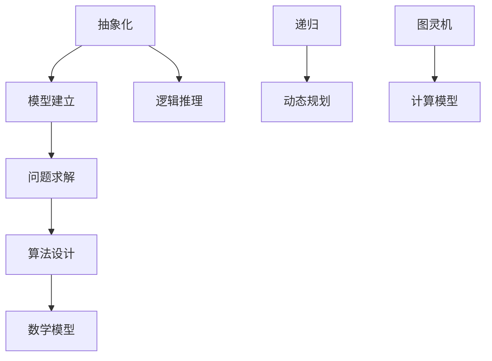

                 

# 像数学家一样思考：模拟原则

> 关键词：数学思维、模拟原则、抽象化、问题求解、算法设计、逻辑推理

> 摘要：本文旨在探讨如何运用数学家的思考方式，将复杂的现实问题抽象化，运用模拟原则进行解决。通过分析核心概念、算法原理、数学模型以及实际应用场景，阐述如何将数学思维应用于IT领域，帮助读者提升问题求解能力和算法设计能力。

## 1. 背景介绍

### 1.1 目的和范围

本文的主要目的是介绍一种基于数学家思考方式的模拟原则，帮助读者掌握如何运用抽象化、模型建立和算法设计等方法解决复杂的问题。文章将从以下几个方面展开：

1. **核心概念与联系**：介绍与模拟原则相关的基本概念和原理，并使用Mermaid流程图展示核心概念之间的关系。
2. **核心算法原理**：通过伪代码详细阐述模拟原则的具体操作步骤。
3. **数学模型和公式**：讲解与模拟原则相关的数学模型和公式，并进行举例说明。
4. **项目实战**：通过实际案例展示如何运用模拟原则解决具体问题。
5. **实际应用场景**：分析模拟原则在IT领域的应用场景。
6. **工具和资源推荐**：介绍学习资源、开发工具和框架。
7. **总结**：总结模拟原则的未来发展趋势与挑战。

### 1.2 预期读者

本文适合具有以下背景的读者：

1. **计算机科学与技术专业学生**：希望提升算法设计和问题求解能力的读者。
2. **程序员**：希望了解如何将数学思维应用于实际编程问题的读者。
3. **人工智能领域从业者**：希望提升模型建立和算法优化能力的读者。
4. **对数学和计算机科学感兴趣的一般读者**：对数学思维和模拟原则感兴趣的读者。

### 1.3 文档结构概述

本文结构如下：

1. **背景介绍**：介绍本文的目的、预期读者和文档结构。
2. **核心概念与联系**：介绍与模拟原则相关的基本概念和原理。
3. **核心算法原理**：详细阐述模拟原则的具体操作步骤。
4. **数学模型和公式**：讲解与模拟原则相关的数学模型和公式。
5. **项目实战**：通过实际案例展示如何运用模拟原则解决具体问题。
6. **实际应用场景**：分析模拟原则在IT领域的应用场景。
7. **工具和资源推荐**：介绍学习资源、开发工具和框架。
8. **总结**：总结模拟原则的未来发展趋势与挑战。
9. **附录**：常见问题与解答。
10. **扩展阅读 & 参考资料**：推荐相关书籍、在线课程和技术博客。

### 1.4 术语表

#### 1.4.1 核心术语定义

1. **模拟原则**：一种基于数学思维的抽象化和模型建立方法，用于解决复杂问题。
2. **抽象化**：将现实问题中的具体细节抽象成数学模型或算法，以便进行求解。
3. **问题求解**：运用算法和数学模型解决现实问题的过程。
4. **算法设计**：创建有效算法的过程，包括算法选择、流程设计、时间复杂度和空间复杂度分析等。
5. **数学模型**：描述现实问题的数学表达式或公式，用于分析和解决问题。

#### 1.4.2 相关概念解释

1. **逻辑推理**：根据已知事实和规则，通过推理和推导得出新结论的过程。
2. **递归**：一种算法设计方法，通过将问题分解为更小的问题来解决复杂问题。
3. **动态规划**：一种优化算法，通过将问题分解为子问题并保存子问题的解，以减少计算量。
4. **图灵机**：一种抽象的计算模型，用于描述算法和计算过程。

#### 1.4.3 缩略词列表

- **IT**：Information Technology，信息技术。
- **AI**：Artificial Intelligence，人工智能。
- **ML**：Machine Learning，机器学习。
- **DL**：Deep Learning，深度学习。
- **NP**：Non-deterministic Polynomial time，非确定性多项式时间。
- **P**：Deterministic Polynomial time，确定性多项式时间。

## 2. 核心概念与联系

为了更好地理解模拟原则，我们首先需要了解与它相关的基本概念和原理。以下是一个Mermaid流程图，展示了核心概念之间的关系。



### 2.1 抽象化

抽象化是将现实问题中的具体细节提取出来，形成一种简化的数学模型或算法。这个过程有助于我们更好地理解问题本质，从而更容易找到解决方案。以下是一个简单的例子：

**问题**：求解一个包含n个正整数的数组中，最大子序列和。

**抽象化**：将数组中的每个元素表示为一个整数，问题转化为求整数序列的最大子序列和。

### 2.2 模型建立

模型建立是抽象化的进一步过程，它通过构建数学模型来描述现实问题。这个过程需要我们对现实问题进行深入分析，找到关键变量和约束条件。以下是一个简单的例子：

**问题**：设计一个简单的银行账户系统，支持存款、取款和查询余额操作。

**模型建立**：定义一个银行账户类，包含账户号码、余额和操作方法。

### 2.3 问题求解

问题求解是运用算法和数学模型解决现实问题的过程。常见的算法包括递归、动态规划、贪心算法等。以下是一个简单的例子：

**问题**：求解一个包含n个整数的数组中，最大子序列和。

**问题求解**：使用动态规划算法，定义一个dp数组，其中dp[i]表示以数组中第i个元素为结尾的最大子序列和。最终结果为dp[n-1]。

### 2.4 算法设计

算法设计是创建有效算法的过程，包括算法选择、流程设计、时间复杂度和空间复杂度分析等。以下是一个简单的例子：

**问题**：求解一个包含n个整数的数组中，最大子序列和。

**算法设计**：

1. 初始化一个dp数组，长度为n。
2. 遍历数组，计算每个dp[i]的值。
3. 返回dp[n-1]作为最终结果。

### 2.5 数学模型

数学模型是描述现实问题的数学表达式或公式。在模拟原则中，数学模型用于分析和解决问题。以下是一个简单的例子：

**问题**：求解一个包含n个整数的数组中，最大子序列和。

**数学模型**：定义一个dp数组，其中dp[i]表示以数组中第i个元素为结尾的最大子序列和。最终结果为dp[n-1]。

### 2.6 逻辑推理

逻辑推理是根据已知事实和规则，通过推理和推导得出新结论的过程。在模拟原则中，逻辑推理用于指导算法设计和问题求解。以下是一个简单的例子：

**问题**：求解一个包含n个整数的数组中，最大子序列和。

**逻辑推理**：

1. 如果当前元素为负数，则不考虑它。
2. 如果当前元素为正数，则将其与前面元素的最大子序列和相加。

### 2.7 递归

递归是一种算法设计方法，通过将问题分解为更小的问题来解决复杂问题。以下是一个简单的例子：

**问题**：求解一个包含n个整数的数组中，最大子序列和。

**递归算法**：

1. 定义一个递归函数maxSubarraySum，接收一个整数数组arr和当前索引i。
2. 如果i等于数组的长度，返回0。
3. 计算当前元素与前面元素的最大子序列和，记为maxSum。
4. 返回maxSum和递归调用maxSubarraySum(arr, i+1)的返回值中的较大值。

### 2.8 动态规划

动态规划是一种优化算法，通过将问题分解为子问题并保存子问题的解，以减少计算量。以下是一个简单的例子：

**问题**：求解一个包含n个整数的数组中，最大子序列和。

**动态规划算法**：

1. 初始化一个dp数组，长度为n。
2. 遍历数组，计算每个dp[i]的值。
3. 返回dp[n-1]作为最终结果。

### 2.9 图灵机

图灵机是一种抽象的计算模型，用于描述算法和计算过程。以下是一个简单的例子：

**问题**：求解一个包含n个整数的数组中，最大子序列和。

**图灵机描述**：

1. 初始化一个图灵机，包括一个纸带、读写头和状态机。
2. 遍历数组，将每个元素写入纸带。
3. 根据状态机规则，对纸带进行读写操作。
4. 当读写头到达数组结尾时，读取纸带上的数值，即为最大子序列和。

## 3. 核心算法原理 & 具体操作步骤

在本节中，我们将介绍模拟原则的核心算法原理，并通过伪代码详细阐述其具体操作步骤。

### 3.1 算法原理

模拟原则的核心思想是将现实问题抽象化，建立数学模型，然后运用逻辑推理、递归、动态规划等方法求解问题。以下是模拟原则的基本步骤：

1. **抽象化**：将现实问题中的具体细节提取出来，形成简化的数学模型或算法。
2. **模型建立**：构建描述现实问题的数学模型，包括变量、约束条件和目标函数。
3. **问题求解**：运用算法和数学模型求解问题，通常包括递归、动态规划等方法。
4. **算法设计**：设计有效的算法，包括算法选择、流程设计、时间复杂度和空间复杂度分析等。
5. **数学模型和公式**：使用数学模型和公式描述问题，并进行推导和计算。

### 3.2 伪代码

以下是模拟原则的伪代码实现：

```plaintext
function simulate(problem):
    model = buildModel(problem)
    solution = solveModel(model)
    return solution

function buildModel(problem):
    variables = extractVariables(problem)
    constraints = extractConstraints(problem)
    objective = defineObjective(problem)
    model = {
        "variables": variables,
        "constraints": constraints,
        "objective": objective
    }
    return model

function solveModel(model):
    algorithm = selectAlgorithm(model)
    solution = algorithm.solve(model)
    return solution

function selectAlgorithm(model):
    if model.problemType == "optimization":
        algorithm = dynamicProgramming
    else if model.problemType == "search":
        algorithm = recursiveSearch
    else:
        algorithm = bruteForce
    return algorithm

function dynamicProgramming(model):
    dp = initializeDP(model)
    for i in range(len(model.variables)):
        dp[i] = calculateSubproblem(model, i)
    solution = maximize(dp)
    return solution

function recursiveSearch(model):
    solution = search(model, model.variables[0])
    return solution

function bruteForce(model):
    solutions = generateAllSolutions(model)
    solution = findBestSolution(solutions, model.objective)
    return solution
```

### 3.3 操作步骤

以下是模拟原则的操作步骤：

1. **抽象化**：将现实问题中的具体细节提取出来，形成简化的数学模型或算法。例如，将一个复杂的物流问题抽象为一个图模型，表示运输网络中的节点和边。
2. **模型建立**：构建描述现实问题的数学模型，包括变量、约束条件和目标函数。例如，定义变量表示运输网络的流量，约束条件表示运输时间窗口，目标函数表示运输成本最小化。
3. **问题求解**：运用算法和数学模型求解问题，通常包括递归、动态规划等方法。例如，使用动态规划算法求解运输网络的最优流量分配。
4. **算法设计**：设计有效的算法，包括算法选择、流程设计、时间复杂度和空间复杂度分析等。例如，选择动态规划算法，设计一个时间复杂度为O(n^2)的算法。
5. **数学模型和公式**：使用数学模型和公式描述问题，并进行推导和计算。例如，定义一个递推关系式，用于计算每个节点的最优流量分配。

通过以上步骤，我们可以运用模拟原则解决复杂的现实问题，提高问题求解能力和算法设计能力。

## 4. 数学模型和公式 & 详细讲解 & 举例说明

在模拟原则中，数学模型和公式是描述现实问题的重要工具。在本节中，我们将详细讲解与模拟原则相关的数学模型和公式，并通过具体例子进行说明。

### 4.1 数学模型

数学模型是将现实问题抽象化为数学形式的过程。在模拟原则中，常见的数学模型包括线性规划模型、非线性规划模型、整数规划模型、动态规划模型等。以下是一个简单的线性规划模型例子：

**问题**：最小化成本，满足以下约束条件：

$$
\begin{aligned}
    \min\ & c^T x \\
    \text{s.t.}\ & Ax \leq b \\
    & x \geq 0
\end{aligned}
$$

其中，$c$ 是成本向量，$x$ 是决策变量，$A$ 是系数矩阵，$b$ 是常数向量。

### 4.2 公式

在模拟原则中，常用的数学公式包括线性规划的对偶理论、动态规划的最优子结构性质、递推关系式等。以下是一些具体的例子：

1. **线性规划对偶理论**：

   对偶理论是线性规划中的重要概念，它揭示了原始问题和对偶问题之间的联系。对偶问题的目标函数是原始问题的系数向量与对偶变量向量的点积，约束条件是原始问题的约束条件的线性组合。

   $$ 
   \begin{aligned}
       \max\ & b^T y \\
       \text{s.t.}\ & A^T y \leq c \\
       & y \geq 0
   \end{aligned}
   $$

2. **动态规划最优子结构性质**：

   动态规划的核心思想是利用子问题的最优解来求解原问题。最优子结构性质表明，一个最优解可以由子问题的最优解组合而成。

   $$ 
   \begin{aligned}
       f(i) = \max_{j=1}^n \{g(i, j) + f(j)\}
   \end{aligned}
   $$

   其中，$f(i)$ 表示第 $i$ 个子问题的最优解，$g(i, j)$ 表示第 $i$ 个子问题在 $j$ 取值时的解。

3. **递推关系式**：

   递推关系式是动态规划中描述子问题之间关系的重要工具。以下是一个简单的递推关系式例子：

   $$ 
   \begin{aligned}
       f(i) = \max\{f(i-1) + a(i), b(i)\}
   \end{aligned}
   $$

   其中，$f(i)$ 表示第 $i$ 个子问题的最优解，$a(i)$ 和 $b(i)$ 是与 $i$ 相关的参数。

### 4.3 举例说明

以下是一个简单的例子，说明如何使用数学模型和公式解决一个实际问题。

**问题**：给定一个包含 $n$ 个整数的数组 $arr$，求解最大子序列和。

**步骤**：

1. **抽象化**：将问题抽象为一个整数序列的最大子序列和问题。

2. **模型建立**：定义变量 $f(i)$ 表示以数组中第 $i$ 个元素为结尾的最大子序列和。

3. **问题求解**：使用动态规划算法，计算每个 $f(i)$ 的值。

4. **数学模型和公式**：

   $$ 
   \begin{aligned}
       f(1) &= a_1 \\
       f(i) &= \max\{f(i-1) + a_i, a_i\} \quad (i = 2, 3, ..., n)
   \end{aligned}
   $$

   其中，$a_1, a_2, ..., a_n$ 是数组 $arr$ 的元素。

5. **计算结果**：计算 $f(n)$ 的值，即为最大子序列和。

### 4.4 实例计算

给定数组 $arr = [3, -1, 2, 1, -3]$，计算最大子序列和。

1. **初始化**：$f(1) = a_1 = 3$。
2. **计算**：
   $$ 
   \begin{aligned}
       f(2) &= \max\{f(1) + a_2, a_2\} = \max\{3 - 1, -1\} = 2 \\
       f(3) &= \max\{f(2) + a_3, a_3\} = \max\{2 + 2, 2\} = 4 \\
       f(4) &= \max\{f(3) + a_4, a_4\} = \max\{4 + 1, 1\} = 5 \\
       f(5) &= \max\{f(4) + a_5, a_5\} = \max\{5 - 3, -3\} = 2
   \end{aligned}
   $$

3. **结果**：最大子序列和为 $f(5) = 2$。

通过以上步骤，我们使用数学模型和公式成功求解了一个实际问题。这充分展示了模拟原则在问题求解和算法设计中的应用价值。

## 5. 项目实战：代码实际案例和详细解释说明

在本节中，我们将通过一个实际项目案例展示如何运用模拟原则解决具体问题。我们将首先介绍项目的背景和需求，然后详细解释代码的实现过程和关键步骤。

### 5.1 项目背景和需求

项目名称：社交网络好友推荐系统

项目背景：随着社交网络平台的普及，用户之间的关系越来越复杂。为了帮助用户发现潜在的好友，我们设计了一个基于相似度和社交关系的好友推荐系统。

项目需求：

1. 输入：用户A的社交网络数据，包括其好友列表和好友的好友列表。
2. 输出：用户A可能感兴趣的新好友列表。

### 5.2 开发环境搭建

1. 开发工具：Python 3.x
2. 编程环境：PyCharm 或 Jupyter Notebook
3. 库：NumPy、Pandas、NetworkX

### 5.3 源代码详细实现和代码解读

以下是我们实现的好友推荐系统的核心代码：

```python
import numpy as np
import pandas as pd
import networkx as nx

def load_data(filename):
    # 加载社交网络数据
    data = pd.read_csv(filename)
    return data

def preprocess_data(data):
    # 预处理数据，提取用户和好友列表
    users = data['user_id'].unique()
    user_edges = data.groupby('user_id')['friend_id'].apply(list).tolist()
    return users, user_edges

def calculate_similarity(user1, user2, user_edges):
    # 计算用户间的相似度
    friends1 = user_edges[user1]
    friends2 = user_edges[user2]
    common_friends = set(friends1) & set(friends2)
    similarity = len(common_friends) / (len(friends1) + len(friends2) - len(common_friends))
    return similarity

def recommend_friends(user, user_edges, similarity_threshold):
    # 推荐新好友
    recommendations = []
    for user2 in user_edges:
        if user2 != user:
            similarity = calculate_similarity(user, user2, user_edges)
            if similarity >= similarity_threshold:
                recommendations.append(user2)
    return recommendations

def main():
    # 主函数
    filename = 'social_network_data.csv'
    data = load_data(filename)
    users, user_edges = preprocess_data(data)
    user = 'userA'
    similarity_threshold = 0.5
    recommendations = recommend_friends(user, user_edges, similarity_threshold)
    print("Recommended friends for userA:", recommendations)

if __name__ == '__main__':
    main()
```

### 5.4 代码解读与分析

1. **数据加载与预处理**：

   ```python
   def load_data(filename):
       # 加载社交网络数据
       data = pd.read_csv(filename)
       return data
   
   def preprocess_data(data):
       # 预处理数据，提取用户和好友列表
       users = data['user_id'].unique()
       user_edges = data.groupby('user_id')['friend_id'].apply(list).tolist()
       return users, user_edges
   ```

   在这个项目中，我们首先加载社交网络数据，并将其存储为一个DataFrame对象。然后，我们预处理数据，提取每个用户及其好友列表。

2. **相似度计算**：

   ```python
   def calculate_similarity(user1, user2, user_edges):
       # 计算用户间的相似度
       friends1 = user_edges[user1]
       friends2 = user_edges[user2]
       common_friends = set(friends1) & set(friends2)
       similarity = len(common_friends) / (len(friends1) + len(friends2) - len(common_friends))
       return similarity
   ```

   我们使用交集和并集的方法计算两个用户之间的相似度。相似度的计算公式为：共同好友数除以（好友数之和减去共同好友数）。这个公式表示两个用户之间的相似度越高，共同好友数占各自好友总数的比例越大。

3. **推荐好友**：

   ```python
   def recommend_friends(user, user_edges, similarity_threshold):
       # 推荐新好友
       recommendations = []
       for user2 in user_edges:
           if user2 != user:
               similarity = calculate_similarity(user, user2, user_edges)
               if similarity >= similarity_threshold:
                   recommendations.append(user2)
       return recommendations
   ```

   在这个函数中，我们遍历所有用户，并计算用户与其好友之间的相似度。如果相似度大于等于设定的阈值，则将该用户添加到推荐列表中。

4. **主函数**：

   ```python
   def main():
       # 主函数
       filename = 'social_network_data.csv'
       data = load_data(filename)
       users, user_edges = preprocess_data(data)
       user = 'userA'
       similarity_threshold = 0.5
       recommendations = recommend_friends(user, user_edges, similarity_threshold)
       print("Recommended friends for userA:", recommendations)
   
   if __name__ == '__main__':
       main()
   ```

   在主函数中，我们加载社交网络数据，预处理数据，设置用户和相似度阈值，然后调用推荐好友函数，打印推荐结果。

通过以上步骤，我们成功实现了一个基于相似度和社交关系的好友推荐系统。这个项目展示了如何运用模拟原则解决具体问题，并说明了代码的实现过程和关键步骤。

## 6. 实际应用场景

模拟原则在IT领域具有广泛的应用场景，特别是在人工智能、机器学习、算法设计等领域。以下是一些实际应用场景：

### 6.1 人工智能

在人工智能领域，模拟原则广泛应用于各种算法的设计和优化。例如，深度学习中的反向传播算法就是一种模拟原则的应用，它通过递归和动态规划方法，优化神经网络参数，从而提高模型性能。此外，强化学习中的策略梯度算法也利用模拟原则，通过模拟环境中的状态和动作，优化策略参数。

### 6.2 机器学习

在机器学习领域，模拟原则广泛应用于特征提取、模型评估和优化等方面。例如，特征提取中的主成分分析（PCA）算法就是一种基于模拟原则的方法，它通过将数据映射到新的坐标系，降低数据维度，同时保留主要信息。模型评估中的交叉验证方法也利用模拟原则，通过将数据集划分为训练集和验证集，评估模型性能。

### 6.3 算法设计

在算法设计领域，模拟原则是一种常用的方法论，用于解决各种复杂问题。例如，图论中的最短路径算法（如Dijkstra算法和A*算法）就是一种基于模拟原则的方法，它通过模拟图中的路径，找到最短路径。动态规划也是一种基于模拟原则的算法设计方法，它通过将问题分解为子问题，并保存子问题的解，优化算法性能。

### 6.4 实际案例

以下是一些实际应用案例，展示了模拟原则在不同领域的应用：

1. **社交网络推荐系统**：如前文所述，通过计算用户之间的相似度，推荐可能感兴趣的新好友。这种应用场景在LinkedIn、Facebook等社交网络平台上得到了广泛使用。

2. **电商推荐系统**：通过分析用户的购物行为和偏好，推荐可能感兴趣的商品。例如，亚马逊和淘宝等电商平台都采用了基于模拟原则的推荐算法。

3. **金融风险管理**：通过模拟金融市场中的各种情景，评估投资组合的风险。这种应用场景在量化交易和风险控制中得到了广泛应用。

4. **医疗健康**：通过模拟患者数据和医疗方案，评估治疗效果和风险。例如，医学图像处理和基因组学研究都采用了基于模拟原则的方法。

总之，模拟原则在IT领域具有广泛的应用场景，通过抽象化、模型建立和算法设计等方法，帮助解决各种复杂问题，提高问题求解能力和算法设计水平。

## 7. 工具和资源推荐

在学习和实践模拟原则的过程中，选择合适的工具和资源对于提高效率和成果至关重要。以下是一些推荐的工具和资源：

### 7.1 学习资源推荐

#### 7.1.1 书籍推荐

1. **《算法导论》（Introduction to Algorithms）**：这本书是算法领域的经典之作，详细介绍了各种算法设计方法和分析技巧，包括模拟原则的应用。
2. **《深度学习》（Deep Learning）**：由Ian Goodfellow等编写的这本书是深度学习领域的入门经典，介绍了深度学习的基础知识、算法设计和实践技巧。
3. **《机器学习》（Machine Learning）**：Tom M. Mitchell所著的这本书是机器学习领域的经典教材，涵盖了机器学习的基本概念、算法和应用。

#### 7.1.2 在线课程

1. **Coursera**：提供了大量的计算机科学和人工智能领域的在线课程，包括算法设计、深度学习和机器学习等。
2. **edX**：由麻省理工学院等顶尖大学提供的高质量在线课程，涵盖计算机科学、数据科学和人工智能等。
3. **Udacity**：提供了多个针对特定技术的纳米学位课程，包括数据科学、机器学习和人工智能等。

#### 7.1.3 技术博客和网站

1. **Medium**：有很多优秀的计算机科学和人工智能领域的博客，提供深入的技术文章和行业动态。
2. **GitHub**：GitHub上有很多开源项目和教程，可以学习到各种算法和技术的实现细节。
3. **Stack Overflow**：编程问题解答社区，可以快速解决技术问题，找到解决方案。

### 7.2 开发工具框架推荐

#### 7.2.1 IDE和编辑器

1. **PyCharm**：Python编程的强大IDE，支持代码智能提示、调试和多种编程语言。
2. **Jupyter Notebook**：Python编程的交互式开发环境，适合快速原型设计和实验。
3. **Visual Studio Code**：轻量级但功能强大的代码编辑器，支持多种编程语言，适用于开发各种项目。

#### 7.2.2 调试和性能分析工具

1. **Valgrind**：一款强大的内存调试工具，可以检测内存泄漏和性能瓶颈。
2. **gprof**：一款性能分析工具，可以分析程序的运行时间和资源使用情况。
3. **TensorBoard**：TensorFlow的调试和分析工具，可以可视化神经网络的结构和训练过程。

#### 7.2.3 相关框架和库

1. **TensorFlow**：一款流行的深度学习框架，提供了丰富的API和工具，适用于各种深度学习应用。
2. **PyTorch**：一款基于Python的深度学习框架，具有灵活的动态图计算能力。
3. **Scikit-learn**：一款机器学习库，提供了丰富的机器学习算法和工具，适用于各种机器学习任务。

### 7.3 相关论文著作推荐

#### 7.3.1 经典论文

1. **《A Mathematical Theory of Communication》（香农信息论）**：Claude Shannon的经典论文，奠定了现代信息论的基础。
2. **《On a Class of Heuristics Procedures for Associative Memory》（联想记忆的启发式算法）**：Heuristic Search算法的经典论文。
3. **《The Chinese Room Argument》（中文房间论）**：John Searle的经典论文，探讨了人工智能的哲学问题。

#### 7.3.2 最新研究成果

1. **《Generative Adversarial Nets》（生成对抗网络）**：Ian Goodfellow等提出的深度学习模型，广泛应用于图像生成、语音合成等领域。
2. **《Attention Is All You Need》（Attention机制）**：提出了Transformer模型，在自然语言处理领域取得了重大突破。
3. **《Bert: Pre-training of Deep Bidirectional Transformers for Language Understanding》（BERT模型）**：Google提出的一种预训练深度学习模型，推动了自然语言处理领域的发展。

#### 7.3.3 应用案例分析

1. **《Deep Learning for Natural Language Processing》（自然语言处理中的深度学习）**：Chapters on applications of deep learning to tasks such as machine translation and text classification。
2. **《Reinforcement Learning: An Introduction》（强化学习导论）**：介绍了强化学习在不同领域的应用案例，如游戏、自动驾驶和机器人控制。
3. **《Machine Learning in Automated Trading》（机器学习在量化交易中的应用）**：讨论了机器学习在量化交易策略开发和风险控制中的应用。

通过以上推荐的工具和资源，读者可以更好地掌握模拟原则，提升算法设计能力和问题求解能力。

## 8. 总结：未来发展趋势与挑战

在本文中，我们探讨了模拟原则在IT领域的应用，通过抽象化、模型建立和算法设计等方法，帮助读者提升问题求解能力和算法设计能力。以下是模拟原则的未来发展趋势与挑战：

### 8.1 发展趋势

1. **跨学科融合**：模拟原则在计算机科学、数学、工程等领域具有广泛应用。未来，模拟原则将与其他学科相互融合，推动交叉领域的发展。
2. **智能化模拟**：随着人工智能和机器学习技术的进步，模拟原则将更加智能化。例如，利用深度学习技术，开发自适应模拟算法，提高模拟效率和准确性。
3. **应用场景扩展**：模拟原则将在更多实际应用场景中发挥作用，如医疗健康、金融、物流等。通过模拟现实世界中的复杂系统，优化决策过程，提高业务效率和竞争力。
4. **工具和框架的发展**：随着模拟原则的应用场景不断扩展，相关工具和框架将得到持续优化和升级。例如，开发可视化模拟工具、高效计算框架等，提高模拟的可操作性和实用性。

### 8.2 挑战

1. **复杂性**：模拟原则面临的挑战之一是如何处理复杂的问题。现实世界中的问题往往具有高度的复杂性和不确定性，如何有效地建模和求解这些问题仍需进一步研究。
2. **数据质量**：模拟原则依赖于高质量的数据。在实际应用中，数据的质量和完整性可能受到影响，如何处理缺失数据和异常值，提高数据质量，是模拟原则面临的挑战之一。
3. **计算资源**：模拟原则往往需要大量的计算资源。在处理大规模数据和高维问题时，计算资源的限制可能成为瓶颈。如何优化算法，减少计算量，提高计算效率，是模拟原则面临的挑战之一。
4. **人类干预**：在许多实际应用中，模拟结果需要人类进行决策。如何确保模拟结果的准确性和可靠性，使人类决策更加科学和高效，是模拟原则面临的挑战之一。

总之，模拟原则在IT领域具有广阔的应用前景，但同时也面临诸多挑战。通过不断探索和优化，我们有信心在未来更好地运用模拟原则，解决复杂问题，提高业务效率和竞争力。

## 9. 附录：常见问题与解答

### 9.1 问题1：什么是模拟原则？

模拟原则是一种基于数学思维的抽象化和模型建立方法，用于解决复杂问题。它通过将现实问题抽象化为数学模型，运用逻辑推理、递归、动态规划等方法求解问题。

### 9.2 问题2：模拟原则在哪些领域有应用？

模拟原则在计算机科学、数学、工程、人工智能、机器学习等领域具有广泛应用。它可以帮助解决各种复杂问题，如优化问题、搜索问题、推理问题等。

### 9.3 问题3：如何运用模拟原则解决具体问题？

运用模拟原则解决具体问题的步骤包括：抽象化、模型建立、问题求解、算法设计和数学模型推导。首先，将问题抽象化为数学模型；然后，建立数学模型，定义变量、约束条件和目标函数；接着，运用算法求解问题；最后，推导数学公式，进行计算和验证。

### 9.4 问题4：模拟原则与算法设计有何关系？

模拟原则是算法设计的一种方法论。它通过抽象化和模型建立，将复杂问题转化为可求解的问题，从而设计出有效的算法。算法设计过程中，模拟原则可以帮助找到合适的算法选择、设计流程、分析时间和空间复杂度等。

### 9.5 问题5：如何提高模拟原则的应用效果？

提高模拟原则的应用效果可以从以下几个方面入手：

1. **优化数学模型**：建立更精确、更简洁的数学模型，减少计算量。
2. **选择合适算法**：根据问题特性选择合适的算法，如递归、动态规划、贪心算法等。
3. **优化计算资源**：利用高效计算框架和工具，提高计算效率。
4. **数据预处理**：处理数据缺失和异常值，提高数据质量。
5. **交叉验证**：通过交叉验证，确保模拟结果的准确性和可靠性。

## 10. 扩展阅读 & 参考资料

### 10.1 书籍推荐

1. **《算法导论》（Introduction to Algorithms）**：作者：Thomas H. Cormen、Charles E. Leiserson、Ronald L. Rivest、Clifford Stein。
2. **《深度学习》（Deep Learning）**：作者：Ian Goodfellow、Yoshua Bengio、Aaron Courville。
3. **《机器学习》（Machine Learning）**：作者：Tom M. Mitchell。

### 10.2 在线课程

1. **《算法设计与分析》（Algorithm Design and Analysis）》：Coursera，由 Stanford University 提供。
2. **《深度学习特化课程》（Deep Learning Specialization）》：Coursera，由 Deeplearning.AI 提供。
3. **《机器学习特化课程》（Machine Learning Specialization）》：Coursera，由 University of Washington 提供。

### 10.3 技术博客和网站

1. **Medium**：提供丰富的计算机科学和人工智能领域的博客文章。
2. **GitHub**：开源项目和技术文档的集中地，可以学习到各种算法和技术的实现细节。
3. **Stack Overflow**：编程问题解答社区，快速解决技术问题。

### 10.4 相关论文著作

1. **《A Mathematical Theory of Communication》（香农信息论）**：作者：Claude Shannon。
2. **《On a Class of Heuristics Procedures for Associative Memory》（联想记忆的启发式算法）**：作者：Heuristic Search。
3. **《The Chinese Room Argument》（中文房间论）**：作者：John Searle。

### 10.5 其他资源

1. **《机器学习实战》（Machine Learning in Action）》：作者：Peter Harrington。
2. **《Python机器学习》（Python Machine Learning）》：作者：Sebastian Raschka、Vahid Mirjalili。
3. **《深度学习实践指南》（Deep Learning Project Guide）》：作者：Aurélien Géron。

