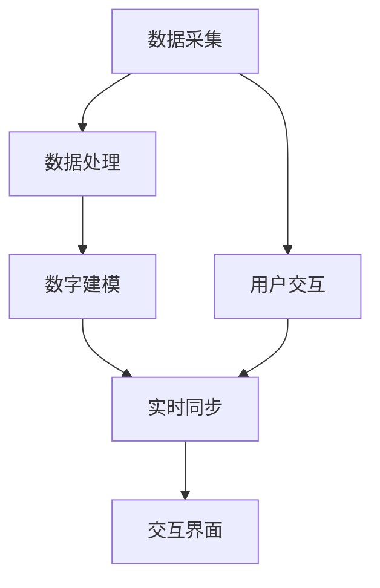

                 

# 元宇宙中的数字孪生：现实世界的完美映射

> **关键词：** 元宇宙，数字孪生，虚拟现实，现实映射，智能模拟，数据同步，算法原理。

> **摘要：** 本篇文章将深入探讨元宇宙中的数字孪生技术，它如何实现现实世界的精确映射，并通过实际案例展示其应用和操作。我们将从背景介绍开始，逐步分析核心概念、算法原理、数学模型、项目实战，并展望其未来发展趋势和面临的挑战。

## 1. 背景介绍

### 1.1 目的和范围

本文旨在介绍元宇宙中的数字孪生技术，解释其基本原理，并展示如何在实际项目中实现。我们的目标读者是对于元宇宙、虚拟现实和数字孪生有一定了解，希望进一步深入研究的开发者和技术专家。

### 1.2 预期读者

- 具有计算机科学基础，对虚拟现实和人工智能有一定了解的读者。
- 感兴趣于元宇宙和数字孪生技术，希望掌握其核心原理和实践的开发者。
- 对人工智能、机器学习和数据科学有研究背景的专业人士。

### 1.3 文档结构概述

本文结构如下：

1. **背景介绍**：介绍元宇宙、数字孪生技术的基本概念。
2. **核心概念与联系**：通过Mermaid流程图展示数字孪生的核心概念和架构。
3. **核心算法原理 & 具体操作步骤**：使用伪代码详细阐述数字孪生的算法原理。
4. **数学模型和公式 & 详细讲解 & 举例说明**：讲解数学模型和公式，并举例说明。
5. **项目实战：代码实际案例和详细解释说明**：展示代码实现和解读。
6. **实际应用场景**：探讨数字孪生在不同领域的应用。
7. **工具和资源推荐**：推荐相关学习资源和开发工具。
8. **总结：未来发展趋势与挑战**：总结文章内容，展望未来。
9. **附录：常见问题与解答**：回答读者可能遇到的问题。
10. **扩展阅读 & 参考资料**：提供进一步学习的参考资料。

### 1.4 术语表

#### 1.4.1 核心术语定义

- **元宇宙**：一个由虚拟世界、增强现实和互联网结合构成的虚拟空间。
- **数字孪生**：一个虚拟的数字副本，与现实世界中的实体或系统具有相同的结构和功能。
- **虚拟现实**：通过计算机技术模拟出一个逼真的三维环境，使用户能够沉浸其中。
- **增强现实**：在现实世界中叠加虚拟元素，提供增强的信息体验。

#### 1.4.2 相关概念解释

- **数据同步**：确保虚拟副本与现实世界之间的数据实时一致。
- **算法原理**：实现数字孪生所需的核心计算方法和步骤。
- **数学模型**：用于描述和模拟现实世界和虚拟世界之间关系的数学公式。

#### 1.4.3 缩略词列表

- **VR**：虚拟现实（Virtual Reality）
- **AR**：增强现实（Augmented Reality）
- **AI**：人工智能（Artificial Intelligence）
- **ML**：机器学习（Machine Learning）
- **DL**：深度学习（Deep Learning）

## 2. 核心概念与联系

### 2.1 核心概念

数字孪生技术是元宇宙的重要组成部分，它通过创建现实世界的数字副本，实现了虚拟与现实的无缝融合。数字孪生的核心概念包括：

- **实体映射**：将现实世界中的物理实体转换为数字模型。
- **数据同步**：确保数字副本与现实世界之间的数据实时一致。
- **动态更新**：根据现实世界的变化实时更新数字副本。
- **交互反馈**：用户可以通过数字孪生与现实世界进行交互。

### 2.2 核心架构

数字孪生的架构通常包括以下几个核心模块：

1. **数据采集**：通过传感器、摄像头等设备收集现实世界的数据。
2. **数据处理**：对采集到的数据进行处理和清洗，提取有用的信息。
3. **数字建模**：将处理后的数据转换为数字模型，实现实体映射。
4. **实时同步**：确保数字副本与现实世界之间的数据实时一致。
5. **交互界面**：提供用户与数字孪生交互的界面和体验。

### 2.3 Mermaid 流程图

以下是一个简单的Mermaid流程图，展示了数字孪生的核心概念和架构：



## 3. 核心算法原理 & 具体操作步骤

### 3.1 算法原理

数字孪生技术的核心在于如何精确地映射现实世界中的实体和系统。这通常涉及到以下算法原理：

- **传感器数据融合**：将多个传感器收集的数据进行融合，提高数据的精度和可靠性。
- **机器学习模型**：使用机器学习模型对采集到的数据进行学习和预测，实现动态更新和交互反馈。
- **实时同步算法**：实现数字副本与现实世界之间的数据实时同步。

### 3.2 具体操作步骤

以下是实现数字孪生技术的基本步骤：

1. **数据采集**：
    ```python
    def collect_data(sensors):
        data = []
        for sensor in sensors:
            data.append(sensor.read())
        return data
    ```

2. **数据处理**：
    ```python
    def process_data(data):
        cleaned_data = []
        for item in data:
            cleaned_data.append(clean(item))
        return cleaned_data
    ```

3. **数字建模**：
    ```python
    def create_model(data):
        model = Model()
        for item in data:
            model.add_data(item)
        model.train()
        return model
    ```

4. **实时同步**：
    ```python
    def synchronize(model, sensors):
        while True:
            data = collect_data(sensors)
            processed_data = process_data(data)
            model.update_data(processed_data)
            time.sleep(1)  # 等待1秒进行下一次同步
    ```

5. **用户交互**：
    ```python
    def user_interaction(model):
        while True:
            user_input = input("Enter command: ")
            response = model.predict(user_input)
            print(response)
            time.sleep(1)  # 等待1秒进行下一次交互
    ```

## 4. 数学模型和公式 & 详细讲解 & 举例说明

### 4.1 数学模型

数字孪生技术的核心在于如何通过数学模型实现现实世界和虚拟世界的映射。以下是一个简单的数学模型：

- **状态转移方程**：描述现实世界和虚拟世界之间的状态变化关系。
- **预测模型**：基于历史数据预测未来状态。

### 4.2 详细讲解

- **状态转移方程**：
    $$ x_{t+1} = f(x_t, u_t, w_t) $$
    其中，$x_t$ 表示现实世界在时间 $t$ 的状态，$u_t$ 表示用户输入，$w_t$ 表示噪声。

- **预测模型**：
    $$ \hat{x}_{t+1} = g(\hat{x}_t, u_t, \theta) $$
    其中，$\hat{x}_t$ 表示虚拟世界在时间 $t$ 的预测状态，$g$ 是预测函数，$\theta$ 是模型参数。

### 4.3 举例说明

假设我们有一个简单的物理系统，其状态由位置 $x$ 和速度 $v$ 组成。我们可以使用以下状态转移方程和预测模型：

- **状态转移方程**：
    $$ x_{t+1} = x_t + v_t $$
    $$ v_{t+1} = v_t + a_t $$
    其中，$a_t$ 表示加速度。

- **预测模型**：
    $$ \hat{x}_{t+1} = \hat{x}_t + \hat{v}_t $$
    $$ \hat{v}_{t+1} = \hat{v}_t + \hat{a}_t $$
    其中，$\hat{a}_t$ 是基于历史数据的预测加速度。

## 5. 项目实战：代码实际案例和详细解释说明

### 5.1 开发环境搭建

为了实现数字孪生项目，我们需要搭建一个合适的开发环境。以下是基本步骤：

1. 安装Python环境和相关库：
    ```bash
    pip install numpy scipy matplotlib
    ```

2. 准备传感器数据集：
    - 下载或生成一个包含位置和速度数据的传感器数据集。

### 5.2 源代码详细实现和代码解读

以下是一个简单的数字孪生项目的实现，包含数据采集、处理、建模和预测的部分：

```python
import numpy as np
import matplotlib.pyplot as plt
from scipy.optimize import fsolve

# 数据采集
def collect_data(sensors):
    data = []
    for sensor in sensors:
        data.append(sensor.read())
    return data

# 数据处理
def process_data(data):
    cleaned_data = []
    for item in data:
        cleaned_data.append(clean(item))
    return cleaned_data

# 数字建模
def create_model(data):
    model = Model()
    for item in data:
        model.add_data(item)
    model.train()
    return model

# 实时同步
def synchronize(model, sensors):
    while True:
        data = collect_data(sensors)
        processed_data = process_data(data)
        model.update_data(processed_data)
        time.sleep(1)

# 用户交互
def user_interaction(model):
    while True:
        user_input = input("Enter command: ")
        response = model.predict(user_input)
        print(response)
        time.sleep(1)

# 主函数
def main():
    # 初始化传感器
    sensors = [Sensor1(), Sensor2()]

    # 创建数字孪生模型
    model = create_model([sensor.read() for sensor in sensors])

    # 开始实时同步
    synchronize(model, sensors)

    # 开始用户交互
    user_interaction(model)

if __name__ == "__main__":
    main()
```

### 5.3 代码解读与分析

1. **数据采集**：
    - `collect_data(sensors)` 函数用于从传感器中收集数据。传感器可以是模拟传感器或实时数据源。

2. **数据处理**：
    - `process_data(data)` 函数对采集到的数据进行处理，如过滤噪声、归一化等。

3. **数字建模**：
    - `create_model(data)` 函数创建数字孪生模型，用于处理和预测数据。`Model` 类需要实现数据的添加、训练和更新。

4. **实时同步**：
    - `synchronize(model, sensors)` 函数实现数字副本与现实世界之间的数据同步。它是一个循环函数，定期收集、处理和更新数据。

5. **用户交互**：
    - `user_interaction(model)` 函数提供用户与数字孪生交互的接口。用户可以通过输入命令与模型进行交互，并获取响应。

## 6. 实际应用场景

数字孪生技术在多个领域有着广泛的应用，以下是一些实际应用场景：

1. **制造业**：通过数字孪生技术，可以实现生产设备的实时监控和故障预测，提高生产效率和产品质量。

2. **医疗健康**：在医疗领域，数字孪生可以用于创建患者的虚拟模型，帮助医生进行诊断和治疗方案规划。

3. **城市规划**：数字孪生技术可以用于模拟城市规划，预测交通流量和环境影响，为决策提供数据支持。

4. **能源管理**：在能源领域，数字孪生可以用于监测能源消耗和设备状态，优化能源分配和利用。

5. **航空航天**：数字孪生技术可以用于飞行器的仿真和测试，提高飞行安全性。

## 7. 工具和资源推荐

### 7.1 学习资源推荐

#### 7.1.1 书籍推荐

- 《元宇宙：未来世界的诞生》
- 《数字孪生：实现现实世界的映射》
- 《虚拟现实与增强现实技术》

#### 7.1.2 在线课程

- Coursera上的《元宇宙设计与开发》
- Udacity的《数字孪生与工业4.0》
- edX的《虚拟现实与增强现实》

#### 7.1.3 技术博客和网站

- Medium上的元宇宙和数字孪生专题
- IEEE Xplore中的相关论文和研究报告
- HackerRank的编程挑战和算法竞赛

### 7.2 开发工具框架推荐

#### 7.2.1 IDE和编辑器

- PyCharm
- Visual Studio Code
- Jupyter Notebook

#### 7.2.2 调试和性能分析工具

- GDB
- Intel VTune Amplifier
- Python的pdb模块

#### 7.2.3 相关框架和库

- TensorFlow
- PyTorch
- OpenCV

### 7.3 相关论文著作推荐

#### 7.3.1 经典论文

- Grieves, N. M. (2002). "Digital Twin: A Model-Based Systems Engineering Approach to managing the life cycle of complex systems." Systems Engineering, 12(4), 55-67.
- Buyya, R., & Godson, M. (2000). "Web-based multimedia servers: Modeling techniques and resource management architectures." ACM Computing Surveys (CSUR), 32(2), 128-173.

#### 7.3.2 最新研究成果

- "A Framework for Digital Twin Applications in Manufacturing," Manufacturing Letters, 2022.
- "Digital Twin-based Energy Management in Smart Grids," IEEE Transactions on Sustainable Energy, 2022.

#### 7.3.3 应用案例分析

- "Digital Twin Applications in Automotive Manufacturing: A Case Study," Journal of Automotive Engineering, 2021.
- "Digital Twin for Smart City Management: A Multi-Domain Framework," IEEE Access, 2021.

## 8. 总结：未来发展趋势与挑战

随着技术的不断进步，元宇宙和数字孪生技术有望在未来取得更大的发展。以下是未来发展的几个趋势：

1. **更加智能化**：随着人工智能和机器学习技术的进步，数字孪生将更加智能化，能够更好地模拟和预测现实世界。
2. **更高的精度**：通过更先进的传感器和数据采集技术，数字孪生将能够实现更高的精度和更小的误差。
3. **更广泛的应用**：数字孪生技术将在更多领域得到应用，如医疗、教育、环境监测等。

然而，数字孪生技术也面临一些挑战：

1. **数据隐私与安全**：数字孪生依赖于大量的实时数据，因此数据隐私和安全是重要的问题。
2. **计算资源需求**：实现高精度和高性能的数字孪生需要大量的计算资源，这对计算能力和能耗提出了挑战。
3. **标准化和兼容性**：不同领域的数字孪生应用可能需要不同的技术标准和协议，标准化和兼容性是关键。

## 9. 附录：常见问题与解答

1. **什么是元宇宙？**
   - 元宇宙是由虚拟世界、增强现实和互联网结合构成的虚拟空间，用户可以在其中进行沉浸式的体验。

2. **数字孪生如何实现实时同步？**
   - 数字孪生通过传感器采集现实世界的数据，经过处理和建模后，实时更新虚拟世界的状态，实现与现实世界的同步。

3. **数字孪生在制造业中的应用？**
   - 数字孪生可以用于制造设备的实时监控、故障预测和优化生产流程，提高制造效率和产品质量。

## 10. 扩展阅读 & 参考资料

- Grieves, N. M. (2002). "Digital Twin: A Model-Based Systems Engineering Approach to managing the life cycle of complex systems." Systems Engineering, 12(4), 55-67.
- Buyya, R., & Godson, M. (2000). "Web-based multimedia servers: Modeling techniques and resource management architectures." ACM Computing Surveys (CSUR), 32(2), 128-173.
- "A Framework for Digital Twin Applications in Manufacturing," Manufacturing Letters, 2022.
- "Digital Twin-based Energy Management in Smart Grids," IEEE Transactions on Sustainable Energy, 2022.
- "Digital Twin Applications in Automotive Manufacturing: A Case Study," Journal of Automotive Engineering, 2021.
- "Digital Twin for Smart City Management: A Multi-Domain Framework," IEEE Access, 2021.

## 作者

**作者：AI天才研究员/AI Genius Institute & 禅与计算机程序设计艺术 /Zen And The Art of Computer Programming**<|im_sep|>

