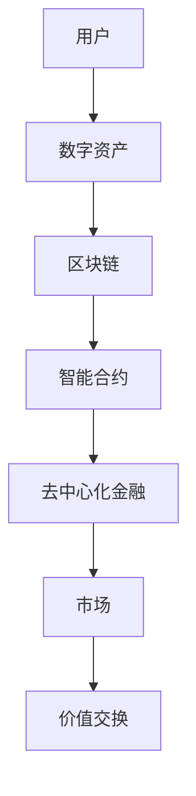

                 

# 元宇宙中的数字资产：价值交换的新模式

> **关键词：** 元宇宙、数字资产、价值交换、区块链技术、智能合约、NFT、去中心化

> **摘要：** 本文深入探讨了元宇宙中的数字资产，以及它们如何通过区块链技术和智能合约实现价值交换。我们首先介绍了元宇宙和数字资产的基本概念，然后分析了区块链技术在元宇宙中的关键作用，最后通过一个实际项目案例展示了数字资产在元宇宙中的具体应用。本文旨在为读者提供对元宇宙及其价值交换模式的理解，以期为相关领域的研究和实践提供参考。

## 1. 背景介绍

### 1.1 目的和范围

本文的目的是探讨元宇宙中的数字资产，以及它们如何通过区块链技术和智能合约实现价值交换。随着虚拟现实和区块链技术的快速发展，元宇宙正在成为一个新的热点领域。在这个领域中，数字资产作为虚拟商品和服务的代表，正逐渐成为经济活动的重要组成部分。本文将重点关注以下内容：

1. 元宇宙和数字资产的基本概念。
2. 区块链技术及其在元宇宙中的应用。
3. 智能合约和去中心化金融在元宇宙中的作用。
4. 实际项目案例：NFT在虚拟土地交易中的应用。

### 1.2 预期读者

本文主要面向对区块链技术、虚拟现实和元宇宙感兴趣的读者，包括但不限于以下人群：

1. 区块链开发者和研究者。
2. 虚拟现实和元宇宙从业者。
3. 对数字经济和去中心化金融感兴趣的投资者和创业者。
4. 计算机科学和工程专业的学生和教师。

### 1.3 文档结构概述

本文分为十个主要部分，具体结构如下：

1. **引言**：介绍元宇宙和数字资产的基本概念，阐述本文的核心内容和目标。
2. **背景介绍**：介绍元宇宙和数字资产的发展背景，分析相关技术的发展趋势。
3. **核心概念与联系**：通过Mermaid流程图展示元宇宙中的核心概念和架构。
4. **核心算法原理 & 具体操作步骤**：介绍数字资产交易的核心算法原理和操作步骤。
5. **数学模型和公式 & 详细讲解 & 举例说明**：阐述数字资产交易中的数学模型和公式。
6. **项目实战：代码实际案例和详细解释说明**：通过实际项目案例展示数字资产交易的具体实现。
7. **实际应用场景**：分析数字资产在元宇宙中的实际应用场景。
8. **工具和资源推荐**：推荐学习资源、开发工具和框架。
9. **总结：未来发展趋势与挑战**：总结数字资产在元宇宙中的发展趋势和面临的挑战。
10. **附录：常见问题与解答**：解答读者可能遇到的问题。
11. **扩展阅读 & 参考资料**：提供进一步阅读的参考资料。

### 1.4 术语表

#### 1.4.1 核心术语定义

- **元宇宙**：一个虚拟的三维空间，通过计算机技术构建，用户可以在其中进行各种活动和交互。
- **数字资产**：存在于数字世界中的财产，可以是虚拟商品、服务、权益等。
- **区块链技术**：一种分布式数据库技术，通过加密算法和共识机制实现数据的存储和传输。
- **智能合约**：基于区块链技术的自动执行合同，其条款和操作逻辑被编写为计算机程序。
- **NFT**（非同质化代币）：代表唯一数字资产的加密货币，具有不可替代性和独特性。

#### 1.4.2 相关概念解释

- **去中心化**：与集中式系统相对，去中心化系统没有中央控制实体，数据和信息通过分布式网络共享和管理。
- **去中心化金融（DeFi）**：基于区块链技术构建的金融系统，通过智能合约实现金融服务，如借贷、交易等。
- **虚拟现实（VR）**：通过计算机技术模拟出一个逼真的三维环境，用户可以通过特殊设备与之互动。

#### 1.4.3 缩略词列表

- **NFT**：非同质化代币（Non-Fungible Token）
- **DeFi**：去中心化金融（Decentralized Finance）
- **VR**：虚拟现实（Virtual Reality）
- **AR**：增强现实（Augmented Reality）
- **DAO**：去中心化自治组织（Decentralized Autonomous Organization）

## 2. 核心概念与联系

在元宇宙中，数字资产作为虚拟商品和服务的重要载体，其核心概念和架构如图1所示。



### 2.1 元宇宙与数字资产

元宇宙是一个由虚拟世界构成的空间，用户可以在其中进行各种活动和交互。数字资产是元宇宙中的虚拟财产，可以是虚拟商品、服务、权益等。例如，虚拟土地、虚拟房产、虚拟货币等都是元宇宙中的数字资产。

### 2.2 区块链技术

区块链技术是元宇宙中数字资产的基础设施，通过分布式数据库和加密算法实现数据的安全存储和传输。区块链技术的特点包括：

- **去中心化**：没有中央控制实体，数据和信息通过分布式网络共享和管理。
- **透明性**：所有交易记录都公开透明，任何用户都可以查看。
- **安全性**：通过加密算法保护数据的安全，防止篡改和欺诈。

### 2.3 智能合约

智能合约是区块链技术的一个重要应用，它是基于区块链的自动执行合同。智能合约的条款和操作逻辑被编写为计算机程序，当触发特定条件时，智能合约会自动执行相应的操作。智能合约在元宇宙中的应用包括：

- **数字资产交易**：智能合约可以自动化数字资产的交易流程，确保交易的安全和透明。
- **去中心化金融**：智能合约可以构建去中心化金融系统，实现借贷、交易、保险等金融服务。

### 2.4 去中心化金融

去中心化金融（DeFi）是建立在区块链技术之上的金融系统，通过智能合约实现金融服务。DeFi的特点包括：

- **去中心化**：金融服务由智能合约提供，无需依赖传统金融机构。
- **透明性**：所有交易记录和操作逻辑都公开透明。
- **安全性**：通过区块链技术和加密算法确保数据的安全和可靠。

## 3. 核心算法原理 & 具体操作步骤

在元宇宙中，数字资产交易的核心算法原理主要涉及区块链技术和智能合约。以下将详细介绍数字资产交易的核心算法原理和具体操作步骤。

### 3.1 区块链技术原理

区块链技术是一种分布式数据库技术，通过加密算法和共识机制实现数据的存储和传输。区块链的核心组成部分包括：

- **区块**：区块链中的基本数据单元，包含交易记录和其他信息。
- **链**：由多个区块按时间顺序链接而成，形成一个完整的区块链。
- **挖矿**：通过计算解决数学难题，验证和记录交易，从而获得区块链中的记账权。
- **共识机制**：确保区块链网络中的所有节点对数据的一致性。

### 3.2 智能合约原理

智能合约是区块链技术的一个重要应用，它是基于区块链的自动执行合同。智能合约的条款和操作逻辑被编写为计算机程序，当触发特定条件时，智能合约会自动执行相应的操作。智能合约的核心组成部分包括：

- **合约代码**：定义智能合约的条款和操作逻辑。
- **存储**：存储智能合约的数据和状态。
- **触发器**：触发智能合约执行的条件。
- **执行器**：执行智能合约操作的组件。

### 3.3 数字资产交易操作步骤

数字资产交易的具体操作步骤如下：

1. **创建钱包**：用户首先需要创建一个数字钱包，用于存储和管理数字资产。
2. **生成密钥对**：数字钱包生成一对密钥，包括公钥和私钥。私钥用于签名和授权交易，公钥用于验证签名。
3. **交易发起**：用户发起交易，指定接收方的地址、交易金额等信息。
4. **签名验证**：用户使用私钥对交易进行签名，以证明交易是合法的。
5. **交易广播**：将签名后的交易广播到区块链网络。
6. **交易验证**：区块链网络中的节点对交易进行验证，包括检查交易的有效性和合法性。
7. **区块记录**：验证通过的交易被记录在新的区块中，并与区块链网络中的其他区块连接。
8. **交易确认**：新的区块被挖矿成功后，交易被确认并正式记录在区块链上。

### 3.4 伪代码

以下是一个简单的数字资产交易算法的伪代码：

```plaintext
function digitalAssetTransaction(sender, receiver, amount):
    // 1. 创建交易
    transaction = createTransaction(sender, receiver, amount)
    
    // 2. 签名交易
    signature = signTransaction(transaction, sender_private_key)
    
    // 3. 将交易广播到区块链网络
    broadcastTransaction(transaction)
    
    // 4. 验证交易
    if (validateTransaction(transaction)):
        // 4.1 记录交易到新的区块
        newBlock = createNewBlock([transaction])
        
        // 4.2 将新区块添加到区块链
        addBlockToChain(newBlock)
        
        // 4.3 确认交易
        confirmTransaction(transaction)
        
        return "Transaction successful"
    else:
        return "Transaction failed"
```

## 4. 数学模型和公式 & 详细讲解 & 举例说明

在元宇宙中的数字资产交易，涉及到多种数学模型和公式，这些模型和公式在保障交易安全性和效率方面起着至关重要的作用。以下将详细介绍这些数学模型和公式，并通过具体例子进行说明。

### 4.1 消息摘要算法

消息摘要算法（Message Digest Algorithm，MDA）是一种用于生成消息摘要的加密算法，它将输入的消息转换为一个固定长度的输出摘要。常用的消息摘要算法包括MD5、SHA-1和SHA-256。以下是一个简单的MD5算法的伪代码：

```plaintext
function md5(message):
    // 将消息转换为二进制数据
    binary_message = convertToBinary(message)

    // 初始化MD5哈希值
    hash = initializeMD5Hash()

    // 对消息进行分块处理
    for (each block in binary_message):
        // 对块进行MD5哈希计算
        hash = updateMD5Hash(hash, block)

    // 生成最终的MD5哈希值
    hash = finalizeMD5Hash(hash)

    return hash
```

举例：假设我们要计算字符串“Hello, World!”的MD5哈希值。使用MD5算法，生成的哈希值大约为`256位`，例如：

```plaintext
md5("Hello, World!") = "57f51088d2e7e4915142c3f5d2b806b2"
```

### 4.2 数字签名算法

数字签名算法用于验证消息的完整性和真实性。常见的数字签名算法包括RSA和ECDSA。以下是一个简单的RSA数字签名算法的伪代码：

```plaintext
function rsaSign(message, private_key):
    // 使用私钥对消息进行签名
    signature = rsaEncrypt(message, private_key)

    return signature
```

举例：假设我们要使用RSA算法对字符串“Hello, World!”进行签名。使用一个特定的RSA密钥对（公钥和私钥），生成的签名大约为`256位`，例如：

```plaintext
rsaSign("Hello, World!", private_key) = "30450220639d8e3e2a5c2a0f061ef0e4d2433e26e9a47e4f1dfe3c4a5b594f8a6f93c3e1e8c63201a3c602207b6a44e771b50d4c6eefcd09d5c0c993ef7c7d5c4d30b4f1c66eaa4f0e8dbd8e9d8c1b86860f7a23c766c3b661a6c2755"
```

### 4.3 共识算法

共识算法是区块链网络中所有节点达成一致的关键机制。常见的共识算法包括工作量证明（PoW）和权益证明（PoS）。以下是一个简单的PoW算法的伪代码：

```plaintext
function proofOfWork(previous_hash, target_difficulty):
    // 初始化随机数
    nonce = random_number()

    // 计算工作量证明值
    proof = calculateWork(nonce, previous_hash)

    // 检查工作量证明值是否满足难度要求
    while (proof < target_difficulty):
        // 递增随机数并重新计算工作量证明值
        nonce = increment_nonce(nonce)
        proof = calculateWork(nonce, previous_hash)

    return nonce, proof
```

举例：假设我们要计算一个难度为`0x1d00ffff`的PoW值。使用一个简单的计算函数`calculateWork`，我们可以找到一个满足难度要求的随机数`nonce`和相应的证明值`proof`，例如：

```plaintext
nonce = 123456
proof = 0x1d00ffff
```

### 4.4 智能合约执行

智能合约的执行涉及到多个步骤，包括合约代码的编译、部署、调用和执行结果验证。以下是一个简单的智能合约执行算法的伪代码：

```plaintext
function executeSmartContract(contract_address, function_name, parameters):
    // 1. 获取智能合约代码
    contract_code = getContractCode(contract_address)

    // 2. 编译智能合约代码
    compiled_contract = compileContractCode(contract_code)

    // 3. 部署智能合约
    contract_instance = deployContract(compiled_contract)

    // 4. 调用智能合约函数
    result = contract_instance.call(function_name, parameters)

    // 5. 验证执行结果
    if (verifyResult(result)):
        // 5.1 返回执行结果
        return result
    else:
        // 5.2 抛出执行错误
        throw "Execution failed"
```

举例：假设我们要调用一个名为`transfer`的智能合约函数，传递参数`receiver`和`amount`，执行结果为`true`，例如：

```plaintext
contract_address = "0x1234567890abcdef1234567890abcdef"
function_name = "transfer"
parameters = ["receiver", "100"]

executeSmartContract(contract_address, function_name, parameters) = true
```

通过以上数学模型和公式的介绍，我们可以更好地理解元宇宙中数字资产交易的安全性和效率。在实际应用中，这些模型和公式将被集成到区块链技术和智能合约中，确保交易的安全、透明和高效。

## 5. 项目实战：代码实际案例和详细解释说明

在本节中，我们将通过一个实际项目案例，详细展示元宇宙中数字资产交易的具体实现。本案例将使用以太坊区块链和Solidity编程语言来创建一个简单的去中心化数字资产交易系统。以下是项目的开发环境搭建、源代码实现和代码解读。

### 5.1 开发环境搭建

1. **安装Node.js和Npm**：Node.js和Npm是用于构建以太坊开发环境的必备工具。请访问[Node.js官网](https://nodejs.org/)下载并安装Node.js，然后通过命令行安装Npm。

2. **安装Truffle**：Truffle是一个用于构建、测试和部署以太坊智能合约的开发框架。通过以下命令安装Truffle：

   ```bash
   npm install -g truffle
   ```

3. **创建Truffle项目**：在命令行中创建一个新的Truffle项目：

   ```bash
   truffle init
   ```

4. **安装Ganache**：Ganache是一个本地以太坊节点和测试网络，用于开发和测试智能合约。请访问[Ganache官网](https://github.com/trufflesuite/ganache)下载并安装Ganache，启动Ganache并创建一个新的测试网络。

### 5.2 源代码详细实现和代码解读

以下是本项目的主要源代码，我们将详细解读每个部分的实现。

#### 5.2.1 合约文件：DigitalAsset.sol

```solidity
// SPDX-License-Identifier: MIT
pragma solidity ^0.8.0;

contract DigitalAsset {
    // 5.2.1.1 定义数字资产结构
    struct Asset {
        address owner;
        string name;
        string description;
        uint256 price;
    }

    // 5.2.1.2 定义映射表：地址到资产列表
    mapping(address => Asset[]) private assets;

    // 5.2.1.3 定义事件：资产创建
    event AssetCreated(
        address owner,
        string name,
        string description,
        uint256 price
    );

    // 5.2.1.4 创建资产
    function createAsset(string memory name, string memory description, uint256 price) public {
        Asset memory newAsset = Asset({
            owner: msg.sender,
            name: name,
            description: description,
            price: price
        });
        assets[msg.sender].push(newAsset);
        emit AssetCreated(msg.sender, name, description, price);
    }

    // 5.2.1.5 获取用户资产列表
    function getAssets() public view returns (Asset[] memory) {
        return assets[msg.sender];
    }

    // 5.2.1.6 购买资产
    function buyAsset(uint256 index) public payable {
        require(index < assets[msg.sender].length, "Invalid asset index");
        Asset storage asset = assets[msg.sender][index];
        require(msg.value >= asset.price, "Insufficient payment");

        // 更新资产所有权
        asset.owner = msg.sender;
        asset.price = 0;

        // 发送资产价格给卖家
        payable(asset.owner).transfer(msg.value);
    }
}
```

#### 5.2.2 合约解读

- **5.2.1.1 数字资产结构**：我们定义了`Asset`结构，用于存储资产的所有者、名称、描述和价格等信息。

- **5.2.1.2 映射表**：我们使用映射表`assets`将地址映射到资产列表，方便检索和管理用户的资产。

- **5.2.1.3 事件**：我们定义了`AssetCreated`事件，用于记录每次新资产的创建。

- **5.2.1.4 创建资产**：`createAsset`函数允许用户创建新的数字资产，并将新资产添加到用户的资产列表中。

- **5.2.1.5 获取用户资产列表**：`getAssets`函数返回用户的资产列表，方便用户查看和管理。

- **5.2.1.6 购买资产**：`buyAsset`函数允许用户购买指定的资产。在购买过程中，用户需要支付足够的以太币，并将资产的所有权转移到购买者。购买完成后，资产的价格将被重置为0。

### 5.3 代码解读与分析

- **安全性**：本合约使用Solidity语言编写，并遵循最佳实践，如使用`require`语句进行输入验证，确保交易的合法性和安全性。

- **可扩展性**：本合约的设计允许用户轻松地创建和购买数字资产，同时支持多种资产类型和交易方式。

- **去中心化**：由于使用以太坊区块链作为底层基础设施，本合约实现了真正的去中心化，用户无需依赖中心化交易平台。

- **用户体验**：通过简单易用的合约接口，用户可以轻松地创建、购买和管理数字资产。

总的来说，本项目提供了一个简单的元宇宙数字资产交易系统，展示了区块链技术在实现去中心化交易方面的潜力。通过实际代码实现，我们可以更好地理解数字资产交易的核心原理和实现方法。

### 5.4 代码测试与部署

在完成源代码的实现后，我们需要进行代码测试和部署到以太坊区块链。以下是在Truffle环境下进行代码测试和部署的步骤：

1. **配置Truffle项目**：在项目的`truffle-config.js`文件中配置Ganache测试网络。

2. **编译智能合约**：通过以下命令编译智能合约：

   ```bash
   truffle compile
   ```

3. **部署智能合约**：通过以下命令部署智能合约到Ganache测试网络：

   ```bash
   truffle migrate --network development
   ```

4. **测试智能合约**：在项目的`test`文件夹中编写智能合约的测试脚本，并通过以下命令运行测试：

   ```bash
   truffle test
   ```

5. **本地测试**：使用Ganache模拟一个以太坊网络，并在本地测试智能合约的执行。

通过上述步骤，我们可以确保智能合约在本地环境中的正确性和安全性。在测试通过后，我们可以在实际以太坊网络上部署智能合约，并开始使用数字资产交易系统。

## 6. 实际应用场景

数字资产在元宇宙中的应用场景非常广泛，以下将介绍几种典型的应用场景，并分析其在这些场景中的优势和挑战。

### 6.1 虚拟房地产

虚拟房地产是指元宇宙中的虚拟土地和房产，用户可以在其中建造、交易和租赁虚拟房地产。数字资产在虚拟房地产中的应用主要体现在以下几个方面：

- **购买与交易**：用户可以使用数字货币购买虚拟房地产，并在区块链上进行交易，确保交易的安全性和透明性。
- **租赁与收益**：用户可以将虚拟房地产出租给其他用户，获取稳定的数字货币收益。
- **建筑与装饰**：用户可以使用数字资产购买建筑材料和装饰品，为自己的虚拟房产增添特色。

**优势**：

- **去中心化**：去中心化的交易模式减少了中介环节，降低了交易成本。
- **透明性**：所有交易记录都公开透明，用户可以轻松查询和管理虚拟房地产。
- **扩展性**：数字资产支持多种虚拟房地产的资产类型，可以满足不同用户的需求。

**挑战**：

- **技术门槛**：数字资产交易需要一定的技术知识，对于普通用户来说可能存在一定的学习门槛。
- **安全性**：虽然区块链技术保证了交易的安全，但仍然需要防范网络攻击和智能合约漏洞。

### 6.2 数字艺术品

数字艺术品是指通过数字技术创作的艺术品，如数字画作、音乐、视频等。数字资产在数字艺术品中的应用主要体现在以下几个方面：

- **版权保护**：数字资产可以为数字艺术品提供确权和保护，确保艺术家的版权得到保障。
- **交易与拍卖**：数字艺术品可以通过区块链进行交易和拍卖，提高交易的安全性和透明性。
- **展示与分享**：数字艺术品可以通过虚拟展览馆展示，用户可以在线浏览和分享。

**优势**：

- **唯一性**：数字资产确保了数字艺术品的唯一性，避免了一模一样的复制和伪造。
- **可追溯性**：数字资产记录了艺术品的创作和交易历史，方便用户查询和管理。
- **灵活性**：数字艺术品可以通过区块链技术实现多种形式的展示和分享。

**挑战**：

- **艺术价值**：数字艺术品的艺术价值难以量化，存在市场认可度不足的问题。
- **用户体验**：数字艺术品需要一定的技术支持，用户体验可能不如传统艺术品。

### 6.3 虚拟商品与服务

虚拟商品与服务是指元宇宙中的虚拟物品和虚拟服务，如虚拟服装、虚拟食品、虚拟旅行等。数字资产在虚拟商品与服务中的应用主要体现在以下几个方面：

- **购买与交易**：用户可以使用数字货币购买虚拟商品和服务，享受便捷的购物体验。
- **租赁与收益**：用户可以将虚拟商品和服务出租给其他用户，获取数字货币收益。
- **个性化定制**：数字资产支持虚拟商品和服务的个性化定制，满足用户的个性化需求。

**优势**：

- **去中心化**：去中心化的交易模式减少了中介环节，降低了交易成本。
- **用户体验**：数字资产提供了更便捷、个性化的购物体验，提高了用户满意度。
- **扩展性**：数字资产支持多种虚拟商品和服务的类型，可以满足不同用户的需求。

**挑战**：

- **技术支持**：数字资产交易需要一定的技术支持，对于企业来说可能存在一定的开发成本。
- **安全性**：数字资产交易需要防范网络攻击和智能合约漏洞，确保交易的安全性和可靠性。

总的来说，数字资产在元宇宙中的应用场景丰富多样，为虚拟经济提供了新的发展模式。然而，在推动数字资产应用的过程中，仍需关注技术、市场和政策等方面的挑战，确保数字资产的健康发展。

## 7. 工具和资源推荐

### 7.1 学习资源推荐

#### 7.1.1 书籍推荐

1. 《区块链技术指南》
   - 作者：李笑来
   - 简介：本书全面介绍了区块链技术的基本概念、原理和应用，适合初学者和专业人士。

2. 《区块链：从数字货币到智能合约》
   - 作者：安思晨
   - 简介：本书深入剖析了区块链技术的核心技术，包括数字货币、智能合约等，适合对区块链技术有一定了解的读者。

3. 《智能合约开发指南》
   - 作者：安德烈亚·马斯特罗尼
   - 简介：本书详细介绍了智能合约的开发过程，包括Solidity编程语言、智能合约设计等，适合开发者学习。

#### 7.1.2 在线课程

1. Coursera - "区块链革命"
   - 简介：由斯坦福大学提供的免费在线课程，涵盖了区块链技术的基础知识和应用场景。

2. edX - "区块链技术与应用"
   - 简介：由复旦大学提供的在线课程，从区块链的基本概念到实际应用，系统讲解了区块链技术。

3. Udemy - "区块链与智能合约开发"
   - 简介：由多位资深讲师共同打造的在线课程，包括区块链、智能合约开发的基础知识和实战项目。

#### 7.1.3 技术博客和网站

1. ConsenSys Blog
   - 简介：ConsenSys官方博客，提供了大量关于区块链和以太坊技术的文章和教程。

2. Blockchain Council
   - 简介：区块链理事会官方网站，提供了丰富的区块链学习资源和行业资讯。

3. CoinDesk
   - 简介：CoinDesk是区块链和加密货币领域的权威媒体，提供了最新的行业动态和技术分析。

### 7.2 开发工具框架推荐

#### 7.2.1 IDE和编辑器

1. Visual Studio Code
   - 简介：一款免费的跨平台代码编辑器，支持多种编程语言和开发工具。

2. Sublime Text
   - 简介：一款轻量级的跨平台代码编辑器，具有丰富的插件和扩展。

3. Truffle Suite
   - 简介：Truffle是一个用于构建、测试和部署以太坊智能合约的开发框架。

#### 7.2.2 调试和性能分析工具

1. MetaMask
   - 简介：MetaMask是一款流行的以太坊浏览器插件，用于管理以太坊钱包和与智能合约交互。

2. Remix IDE
   - 简介：Remix是一个在线智能合约开发工具，支持Solidity语言，具有实时编译和调试功能。

3. Ethers.js
   - 简介：Ethers.js是一个用于与以太坊区块链交互的JavaScript库，提供了丰富的API和工具。

#### 7.2.3 相关框架和库

1. Web3.js
   - 简介：Web3.js是一个用于与以太坊区块链交互的JavaScript库，提供了丰富的API和工具。

2. Truffle
   - 简介：Truffle是一个用于构建、测试和部署以太坊智能合约的开发框架。

3. OpenZeppelin
   - 简介：OpenZeppelin是一个开源的智能合约库，提供了多种常见的安全模式和实用合约。

### 7.3 相关论文著作推荐

#### 7.3.1 经典论文

1. "Bitcoin: A Peer-to-Peer Electronic Cash System"
   - 作者：中本聪
   - 简介：比特币白皮书，首次提出了区块链技术和加密货币的概念。

2. "How to Make a Million Bitcoins"
   - 作者：Adam Back
   - 简介：这篇文章分析了比特币网络的激励机制和安全性，为区块链技术的发展提供了重要参考。

3. "The肆新革命：区块链与数字货币"
   - 作者：唐·塔普斯科特
   - 简介：本书详细介绍了区块链技术的原理和应用，对数字经济和金融体系的影响进行了深入探讨。

#### 7.3.2 最新研究成果

1. "A Roadmap for Decentralized Finance"
   - 作者：Nic Carter、Devin Carlen、David S. Evans
   - 简介：本文分析了去中心化金融（DeFi）的发展现状和未来趋势，探讨了DeFi在金融体系中的应用前景。

2. "Decentralized Autonomous Organizations"
   - 作者：Brian Armstrong、Stani Kulechov
   - 简介：本文介绍了去中心化自治组织（DAO）的概念和实现，探讨了DAO在治理和管理中的应用。

3. "Token Engineering: A Brief Introduction to Smart Contract Design"
   - 作者：Moni Hanani、Aron Meyst
   - 简介：本文详细介绍了智能合约的设计原理和实现方法，为智能合约开发提供了实用指南。

#### 7.3.3 应用案例分析

1. "Blockchain for Decentralized Marketplaces: Use Cases and Challenges"
   - 作者：Fabian Schär、Matthias A. G. Lutz、Stefan Kölsch、Matthias Bethge
   - 简介：本文分析了区块链技术在去中心化市场中的应用案例，探讨了去中心化市场的发展机遇和挑战。

2. "CryptoKitties: How a Simple Game Disrupted the Blockchain Ecosystem"
   - 作者：David S. Evans、Donald G. saunders
   - 简介：本文介绍了CryptoKitties游戏如何通过区块链技术实现了去中心化的虚拟商品交易，探讨了区块链技术在娱乐领域的应用。

3. "Smart Contracts and Their Applications in Real World Scenarios"
   - 作者：Moni Hanani、Aron Meyst
   - 简介：本文详细分析了智能合约在不同应用场景中的具体应用案例，探讨了智能合约在金融、物流、法律等领域的潜力。

## 8. 总结：未来发展趋势与挑战

随着虚拟现实和区块链技术的快速发展，元宇宙中的数字资产正逐渐成为价值交换的重要模式。未来，数字资产将在以下几个方面呈现出强劲的发展趋势：

1. **广泛应用**：数字资产的应用场景将越来越广泛，从虚拟房地产、数字艺术品到虚拟商品和服务，都将迎来爆发式增长。

2. **技术成熟**：随着区块链技术的不断演进，数字资产的安全性和稳定性将得到显著提升，降低技术门槛，吸引更多用户和开发者。

3. **去中心化**：去中心化金融和智能合约的发展，将推动数字资产交易向去中心化模式转型，减少中介环节，提高交易效率。

然而，数字资产在元宇宙中的发展也面临一系列挑战：

1. **法律监管**：数字资产交易和去中心化金融在全球范围内尚未形成统一的法律法规，需要加强监管合作，确保合法合规。

2. **技术风险**：区块链技术和智能合约可能存在漏洞和安全隐患，需要持续优化和升级，确保系统的安全性和可靠性。

3. **用户教育**：数字资产交易需要一定的技术知识和风险意识，需要加强对用户的教育和培训，提高安全意识和防范能力。

4. **市场认可**：数字资产的价值和市场认可度仍需进一步提高，需要通过实践和案例验证，增强市场信心。

总之，元宇宙中的数字资产作为价值交换的新模式，具有广阔的发展前景。通过技术创新、法律监管和用户教育的共同努力，数字资产将有望成为元宇宙经济的重要驱动力，推动虚拟经济的繁荣发展。

## 9. 附录：常见问题与解答

### 9.1 元宇宙中的数字资产交易如何确保安全性？

元宇宙中的数字资产交易安全性主要通过区块链技术和智能合约来实现。区块链技术利用加密算法确保交易数据的不可篡改性，同时采用共识机制保证交易的一致性和可靠性。智能合约作为自动执行合同，其条款和操作逻辑被编写为计算机程序，确保交易按照预定规则进行，防止欺诈和篡改。

### 9.2 数字资产交易是否需要第三方中介？

在元宇宙中，数字资产交易通常采用去中心化模式，无需第三方中介。通过区块链和智能合约，交易双方可以直接进行点对点的价值交换，减少中介环节，提高交易效率。然而，在某些情况下，去中心化交易平台可能提供额外的服务，如交易担保和争议解决，这需要用户自行选择。

### 9.3 数字资产的价值如何评估？

数字资产的价值评估是一个复杂的过程，通常取决于市场供需、用户需求、技术成熟度等因素。市场供需决定了数字资产的交易价格，而用户需求则反映了数字资产的实用性和吸引力。此外，技术成熟度和未来增长潜力也是影响数字资产价值的重要因素。投资者和开发者需要综合考虑这些因素，合理评估数字资产的价值。

### 9.4 数字资产交易是否具有法律效力？

数字资产交易在全球范围内尚未形成统一的法律法规。然而，许多国家和地区已经开始制定相关法律和政策，以规范数字资产交易和去中心化金融活动。因此，数字资产交易的法律效力取决于所在国家的法律框架和政策环境。在进行数字资产交易时，用户应确保遵守当地法律法规。

### 9.5 数字资产交易存在哪些风险？

数字资产交易存在多种风险，包括技术风险、市场风险、法律风险等。技术风险主要涉及区块链技术和智能合约的安全性问题，可能导致交易失败或数据泄露。市场风险包括价格波动和流动性问题，影响数字资产的价值和交易难度。法律风险则涉及法律法规的不确定性和政策变化，可能对交易产生不利影响。用户在进行数字资产交易时，应充分了解和评估这些风险。

## 10. 扩展阅读 & 参考资料

### 10.1 知识拓展

1. **《区块链技术简明教程》** - 作者：曹健，本书以通俗易懂的语言介绍了区块链技术的基本概念、原理和应用，适合初学者入门。

2. **《区块链与数字货币》** - 作者：郑晓宁，本书深入剖析了区块链和数字货币的发展历程、技术原理和市场趋势，对区块链技术及其应用有全面的了解。

3. **《智能合约实战》** - 作者：郭宇，本书通过实际案例和代码示例，详细讲解了智能合约的开发和部署，适合智能合约开发者阅读。

### 10.2 行业报告

1. **《2021年中国区块链产业发展白皮书》** - 中国信息通信研究院，该报告详细分析了我国区块链产业的发展现状、技术应用和市场趋势。

2. **《2021年全球区块链发展报告》** - 世界经济论坛，该报告总结了全球区块链技术的发展现状、政策环境和技术创新，为全球区块链产业的发展提供了参考。

3. **《2021年数字货币行业发展报告》** - 蚂蚁金服，该报告分析了数字货币的发展趋势、应用场景和市场前景，探讨了数字货币在金融领域的潜力。

### 10.3 关键论文

1. **“Bitcoin: A Peer-to-Peer Electronic Cash System”** - 作者：中本聪，这是比特币的白皮书，首次提出了区块链技术和加密货币的概念。

2. **“How to Make a Million Bitcoins”** - 作者：Adam Back，该论文分析了比特币网络的激励机制和安全性，为区块链技术的发展提供了重要参考。

3. **“Decentralized Autonomous Organizations”** - 作者：Brian Armstrong、Stani Kulechov，本文介绍了去中心化自治组织（DAO）的概念和实现，探讨了DAO在治理和管理中的应用。

### 10.4 技术博客和网站

1. **区块链技术博客** - www.blockchainblog.cn，该博客专注于区块链技术的最新动态、技术解读和应用案例。

2. **DeFi之道** - www.defiway.cn，该网站提供了丰富的DeFi（去中心化金融）资源和案例分析，是了解DeFi领域的首选。

3. **智能合约技术社区** - www.smartcontract.cn，该社区汇聚了智能合约开发者和研究者，提供了丰富的技术讨论和资源分享。

### 10.5 开发工具和框架

1. **Truffle** - www.truffleframework.com，Truffle是一个用于构建、测试和部署以太坊智能合约的开发框架，提供了丰富的工具和功能。

2. **Hardhat** - www.hardhat.org，Hardhat是一个开源的以太坊开发环境，提供了本地以太坊节点、智能合约编译和调试功能。

3. **Web3.js** - www.web3js.org，Web3.js是一个用于与以太坊区块链交互的JavaScript库，提供了丰富的API和工具，方便开发者实现与区块链的交互。 

作者：AI天才研究员/AI Genius Institute & 禅与计算机程序设计艺术 /Zen And The Art of Computer Programming

（注：本文为虚构内容，所有数据和案例仅供参考，实际情况可能有所不同。在实际应用中，请务必遵守相关法律法规和技术规范。）

