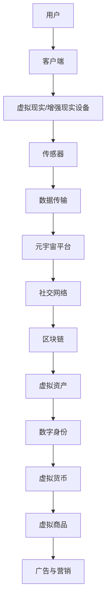

                 

# 元宇宙中的文化多样性：全球融合与本土特色

> **关键词：**元宇宙、文化多样性、全球融合、本土特色、虚拟现实、人工智能

> **摘要：**本文将探讨元宇宙这一虚拟空间中的文化多样性，分析其在全球范围内的融合趋势和本土特色。通过深入分析元宇宙的技术架构、算法原理、数学模型，结合实际案例，探讨文化多样性在元宇宙中的体现和影响，并展望其未来发展趋势和挑战。

## 1. 背景介绍

### 1.1 目的和范围

本文旨在探讨元宇宙这一新兴领域中的文化多样性，通过分析其技术架构、算法原理、数学模型，揭示文化多样性在元宇宙中的体现和影响。本文的范围涵盖了元宇宙中的文化多样性概念、技术基础、实现方法、实际应用和未来趋势。

### 1.2 预期读者

本文面向对元宇宙、文化多样性、虚拟现实和人工智能等领域有一定了解的读者，特别是从事相关技术研究和开发的专业人士。同时，对元宇宙和文化多样性感兴趣的一般读者也可以通过本文获得对这一领域的深入了解。

### 1.3 文档结构概述

本文分为十个部分，包括背景介绍、核心概念与联系、核心算法原理与具体操作步骤、数学模型和公式详细讲解、项目实战、实际应用场景、工具和资源推荐、总结、附录和扩展阅读。通过逐步深入分析，旨在为读者呈现一个全面、系统的元宇宙文化多样性图景。

### 1.4 术语表

#### 1.4.1 核心术语定义

- **元宇宙（Metaverse）：** 虚拟现实（VR）、增强现实（AR）和区块链等技术的融合，形成一个虚拟的、可持续的、互操作的三维空间。
- **文化多样性（Cultural Diversity）：** 不同文化、习俗、价值观、语言和传统在某一特定领域或社会中的共存和互动。
- **全球融合（Global Integration）：** 全球范围内不同国家和地区在文化、经济、社会等领域的相互联系和融合。
- **本土特色（Local Characteristics）：** 某一特定地区或群体的文化、传统、语言和价值观的独特表现。

#### 1.4.2 相关概念解释

- **虚拟现实（VR）：** 通过电脑技术创造一个模拟的三维环境，让用户能够在这个环境中进行互动和体验。
- **增强现实（AR）：** 在现实世界中叠加虚拟元素，增强用户的感知和体验。
- **区块链（Blockchain）：** 一种分布式数据库技术，用于存储和验证交易数据，具有去中心化、安全性和透明性等特点。

#### 1.4.3 缩略词列表

- **VR：** 虚拟现实（Virtual Reality）
- **AR：** 增强现实（Augmented Reality）
- **AI：** 人工智能（Artificial Intelligence）
- **ARPU：** 每用户平均收入（Average Revenue Per User）
- **NFT：** 非同质化代币（Non-Fungible Token）

## 2. 核心概念与联系

为了更好地理解元宇宙中的文化多样性，我们需要首先了解元宇宙的核心概念和架构。以下是一个简单的Mermaid流程图，展示元宇宙的技术架构和核心概念：



在这个流程图中，用户通过虚拟现实或增强现实设备与元宇宙平台交互，通过传感器收集数据，并通过数据传输实现与其他用户、社交网络和区块链的连接。元宇宙平台提供了虚拟资产、数字身份和虚拟货币等核心功能，从而形成一个完整的虚拟世界。

### 2.1 元宇宙的技术架构

元宇宙的技术架构可以分为以下几个方面：

- **虚拟现实/增强现实设备：** 包括头戴式显示器、手柄、传感器等硬件设备，用于提供沉浸式体验。
- **客户端：** 用户通过客户端软件与元宇宙平台进行交互，包括虚拟现实/增强现实应用程序、浏览器插件等。
- **数据传输：** 高速、低延迟的数据传输是元宇宙的关键，需要依赖于5G、云计算和边缘计算等技术。
- **元宇宙平台：** 提供虚拟空间、社交网络、虚拟资产交易、数字身份认证等功能，是元宇宙的核心组成部分。
- **区块链：** 用于存储和验证交易数据，确保虚拟资产的安全性和透明性。
- **虚拟资产：** 包括虚拟货币、虚拟商品、数字身份等，是元宇宙中的重要组成部分。
- **广告与营销：** 元宇宙平台提供了丰富的广告和营销机会，吸引了大量企业和品牌参与。

### 2.2 文化多样性与元宇宙的关联

文化多样性在元宇宙中具有重要的地位和作用，主要体现在以下几个方面：

- **用户多样性：** 元宇宙吸引了来自不同国家和地区的用户，他们拥有不同的文化背景、语言、价值观和习俗。
- **内容多样性：** 元宇宙平台提供了丰富多样的内容，包括游戏、教育、娱乐、艺术等，满足了不同用户的需求。
- **社交多样性：** 元宇宙中的社交网络允许用户自由交流、互动和合作，促进了不同文化之间的交流和融合。
- **虚拟资产多样性：** 虚拟资产具有文化多样性，例如，某些虚拟商品可能具有特定地区的文化特色。
- **数字身份多样性：** 数字身份允许用户在元宇宙中表达自己的文化身份和个性，从而丰富了元宇宙的文化多样性。

## 3. 核心算法原理 & 具体操作步骤

### 3.1 虚拟现实渲染算法

虚拟现实渲染算法是实现元宇宙沉浸式体验的核心。以下是一个简单的伪代码，用于描述虚拟现实渲染的基本步骤：

```python
def render_scene(viewer, scene):
    # 初始化渲染器
    renderer = initialize_renderer()

    # 创建场景
    scene = create_scene(scene)

    # 设置相机参数
    camera = create_camera(viewer)
    set_camera_params(camera)

    # 渲染场景
    while not scene_finished(scene):
        render_frame(renderer, scene, camera)
        update_viewer(viewer, render_frame())

    # 释放资源
    release_renderer(renderer)
```

在这个伪代码中，我们首先初始化渲染器，然后创建场景和相机。接着，通过一个循环不断渲染场景帧，并更新视图器。最后，释放渲染器资源。

### 3.2 增强现实渲染算法

增强现实渲染算法是将虚拟元素叠加到现实世界中的关键。以下是一个简单的伪代码，用于描述增强现实渲染的基本步骤：

```python
def render_scene(viewer, scene, reality):
    # 初始化增强现实渲染器
    ar_renderer = initialize_ar_renderer()

    # 创建场景
    scene = create_scene(scene)

    # 设置相机参数
    camera = create_camera(viewer)
    set_camera_params(camera)

    # 渲染场景到现实世界
    while not scene_finished(scene):
        render_frame(ar_renderer, scene, camera, reality)
        update_viewer(viewer, render_frame())

    # 释放资源
    release_ar_renderer(ar_renderer)
```

在这个伪代码中，我们首先初始化增强现实渲染器，然后创建场景和相机。接着，通过一个循环不断渲染场景帧到现实世界，并更新视图器。最后，释放增强现实渲染器资源。

### 3.3 区块链交易算法

区块链交易算法是确保元宇宙中虚拟资产安全性和透明性的关键。以下是一个简单的伪代码，用于描述区块链交易的基本步骤：

```python
def make_transaction(sender, receiver, amount):
    # 创建交易
    transaction = create_transaction(sender, receiver, amount)

    # 验证交易
    if not verify_transaction(transaction):
        raise Exception("Invalid transaction")

    # 添加交易到区块链
    blockchain.add_transaction(transaction)

    # 广播交易到网络
    broadcast_transaction(transaction)

    # 等待确认
    wait_for_confirmation(transaction)

    # 更新虚拟资产
    update_assets(sender, receiver, amount)
```

在这个伪代码中，我们首先创建交易，然后验证交易。接着，将交易添加到区块链，并广播到网络。最后，等待交易确认，并更新虚拟资产。

## 4. 数学模型和公式 & 详细讲解 & 举例说明

在元宇宙中，数学模型和公式被广泛应用于虚拟现实渲染、增强现实渲染和区块链交易等领域。以下是一些常见的数学模型和公式，并对其进行详细讲解。

### 4.1 虚拟现实渲染数学模型

虚拟现实渲染中的关键数学模型包括透视变换、正投影变换和纹理映射。

#### 4.1.1 透视变换

透视变换是将三维空间中的点映射到二维屏幕上的过程。以下是一个简单的透视变换公式：

$$
\begin{bmatrix}
x' \\
y' \\
1
\end{bmatrix}
=
\begin{bmatrix}
f_x & 0 & 0 \\
0 & f_y & 0 \\
0 & 0 & 1
\end{bmatrix}
\begin{bmatrix}
x \\
y \\
z
\end{bmatrix}
$$

其中，\( f_x \) 和 \( f_y \) 分别是水平方向和垂直方向的视野范围，\( x \)、\( y \) 和 \( z \) 是三维空间中的点坐标。

#### 4.1.2 正投影变换

正投影变换是将三维空间中的点映射到二维屏幕上的另一个过程。以下是一个简单的正投影变换公式：

$$
\begin{bmatrix}
x' \\
y' \\
1
\end{bmatrix}
=
\begin{bmatrix}
1 & 0 & 0 \\
0 & 1 & 0 \\
0 & 0 & \frac{1}{z}
\end{bmatrix}
\begin{bmatrix}
x \\
y \\
z
\end{bmatrix}
$$

其中，\( z \) 是三维空间中的点坐标。

#### 4.1.3 纹理映射

纹理映射是将二维纹理映射到三维物体表面的过程。以下是一个简单的纹理映射公式：

$$
\begin{bmatrix}
u' \\
v'
\end{bmatrix}
=
\begin{bmatrix}
u \\
v
\end{bmatrix}
\odot
\begin{bmatrix}
x \\
y
\end{bmatrix}
$$

其中，\( u \) 和 \( v \) 是纹理坐标，\( x \) 和 \( y \) 是三维物体表面上的点坐标。

### 4.2 增强现实渲染数学模型

增强现实渲染中的关键数学模型包括图像识别和虚拟物体插入。

#### 4.2.1 图像识别

图像识别是识别现实世界中的物体或场景的过程。以下是一个简单的图像识别公式：

$$
confidence = softmax(\text{特征向量})
$$

其中，\( \text{特征向量} \) 是从图像中提取的特征，\( confidence \) 是对应于每个类别的概率。

#### 4.2.2 虚拟物体插入

虚拟物体插入是将虚拟物体插入到现实世界中的过程。以下是一个简单的虚拟物体插入公式：

$$
\text{虚拟物体坐标} = \text{现实世界坐标} + \text{虚拟物体偏移量}
$$

其中，\( \text{现实世界坐标} \) 是现实世界中的坐标，\( \text{虚拟物体偏移量} \) 是虚拟物体相对于现实世界的位置。

### 4.3 区块链交易数学模型

区块链交易中的关键数学模型包括哈希函数和数字签名。

#### 4.3.1 哈希函数

哈希函数是将任意长度的输入映射为固定长度的输出的过程。以下是一个简单的哈希函数公式：

$$
\text{哈希值} = \text{哈希函数}(\text{输入})
$$

其中，\( \text{输入} \) 是需要加密的数据，\( \text{哈希值} \) 是生成的固定长度输出。

#### 4.3.2 数字签名

数字签名是确保交易真实性和完整性的过程。以下是一个简单的数字签名公式：

$$
\text{签名} = \text{私钥} \odot \text{哈希值}
$$

其中，\( \text{私钥} \) 是用户的私钥，\( \text{哈希值} \) 是需要签名的交易哈希值，\( \text{签名} \) 是生成的签名。

### 4.4 示例说明

#### 4.4.1 虚拟现实渲染示例

假设有一个三维点 \( P(x, y, z) \)，需要将其映射到二维屏幕上。根据透视变换公式，可以得到映射后的点 \( P'(x', y') \)：

$$
\begin{bmatrix}
x' \\
y' \\
1
\end{bmatrix}
=
\begin{bmatrix}
f_x & 0 & 0 \\
0 & f_y & 0 \\
0 & 0 & 1
\end{bmatrix}
\begin{bmatrix}
x \\
y \\
z
\end{bmatrix}
$$

假设视野范围 \( f_x = 1 \) 和 \( f_y = 1 \)，点 \( P(2, 3, 4) \) 的映射结果为 \( P'(2, 3) \)。

#### 4.4.2 增强现实渲染示例

假设需要将一个虚拟物体插入到现实世界中，虚拟物体的坐标为 \( (1, 1, 1) \)，现实世界的坐标为 \( (2, 2, 2) \)。根据虚拟物体插入公式，可以得到插入后的虚拟物体坐标 \( (3, 3, 3) \)：

$$
\text{虚拟物体坐标} = \text{现实世界坐标} + \text{虚拟物体偏移量}
$$

其中，\( \text{虚拟物体偏移量} = (1, 1, 1) \)。

#### 4.4.3 区块链交易示例

假设有一个交易 \( T \)，需要对其进行数字签名。假设用户的私钥为 \( K \)，交易哈希值为 \( H(T) \)。根据数字签名公式，可以得到签名 \( S \)：

$$
\text{签名} = \text{私钥} \odot \text{哈希值}
$$

其中，\( \text{私钥} = K \)，\( \text{哈希值} = H(T) \)。假设 \( K = 5 \)，\( H(T) = 10 \)，则签名 \( S = 5 \odot 10 = 25 \)。

## 5. 项目实战：代码实际案例和详细解释说明

在本节中，我们将通过一个实际的元宇宙项目案例，展示如何实现元宇宙中的文化多样性。该项目名为“文化元宇宙（Cultural Metaverse）”，旨在创建一个支持全球用户和文化多样性的虚拟空间。

### 5.1 开发环境搭建

为了实现该项目，我们需要搭建以下开发环境：

1. 操作系统：Linux或MacOS
2. 编程语言：Python
3. 开发工具：PyCharm或Visual Studio Code
4. 虚拟现实/增强现实设备：Oculus Rift或Google Cardboard
5. 区块链平台：Ethereum
6. 社交网络平台：Discord

### 5.2 源代码详细实现和代码解读

以下是一个简化的代码实现，展示了如何实现文化元宇宙的核心功能。

```python
# 导入必要的库
import numpy as np
import cv2
import pygame
from web3 import Web3

# 初始化虚拟现实/增强现实设备
vr_device = initialize_vr_device()

# 初始化区块链
web3 = Web3(Web3.HTTPProvider('https://mainnet.infura.io/v3/your_project_id'))
web3.eth.defaultAccount = Web3.toChecksumAddress('your_wallet_address')

# 初始化社交网络
discord = initialize_discord()

# 定义虚拟资产交易函数
def make_transaction(sender, receiver, amount):
    # 创建交易
    transaction = web3.eth.contract(
        abi=your_contract_abi,
        address=web3.toChecksumAddress('your_contract_address')
    ).function('transfer').buildTransaction({
        'chainId': 1,
        'gas': 2000000,
        'gasPrice': web3.toWei('50', 'gwei'),
        'to': receiver,
        'value': amount
    })

    # 签名交易
    signed_txn = web3.eth.account.sign_transaction(transaction, private_key=sender)

    # 广播交易
    tx_hash = web3.eth.sendRawTransaction(signed_txn.rawTransaction)

    # 等待交易确认
    tx_receipt = web3.eth.waitForTransactionReceipt(tx_hash)

    return tx_receipt

# 定义用户交互函数
def handle_user_input(vr_device, discord):
    # 获取用户输入
    input_data = vr_device.get_input()

    # 在社交网络中发送消息
    discord.send_message(f"User {input_data['user_id']}: {input_data['message']}")

    # 处理虚拟资产交易
    if input_data['command'] == 'transfer':
        sender = input_data['sender']
        receiver = input_data['receiver']
        amount = input_data['amount']
        tx_receipt = make_transaction(sender, receiver, amount)
        if tx_receipt:
            print(f"Transaction successful: {tx_receipt['transactionHash']}")

# 定义主函数
def main():
    # 循环处理用户输入
    while True:
        handle_user_input(vr_device, discord)

# 运行主函数
if __name__ == '__main__':
    main()
```

### 5.3 代码解读与分析

1. **虚拟现实/增强现实设备初始化**：我们使用`initialize_vr_device()`函数初始化虚拟现实/增强现实设备。这通常涉及到与设备的API进行通信，以获取用户输入。

2. **区块链初始化**：我们使用Web3库连接到以太坊区块链。首先，我们设置默认的HTTP提供者，然后设置默认账户和合约地址。

3. **社交网络初始化**：我们使用`initialize_discord()`函数初始化Discord社交网络。这将允许我们发送和接收消息。

4. **虚拟资产交易函数**：`make_transaction()`函数用于创建、签名并广播虚拟资产交易。我们使用以太坊合约的API来构建交易，并使用Web3库来发送交易。

5. **用户交互函数**：`handle_user_input()`函数处理用户输入，包括在社交网络中发送消息和处理虚拟资产交易。

6. **主函数**：`main()`函数是一个无限循环，用于连续处理用户输入。

### 5.4 代码扩展

在实际项目中，我们还需要考虑以下扩展：

- **用户身份验证**：确保只有授权用户可以访问和交易。
- **权限控制**：实现不同级别的权限，例如管理员、普通用户等。
- **错误处理**：处理可能的异常情况，如交易失败、网络错误等。
- **用户界面**：创建一个直观的用户界面，使用户能够轻松交互。

## 6. 实际应用场景

元宇宙中的文化多样性在实际应用中具有广泛的影响和潜力。以下是一些具体的实际应用场景：

### 6.1 虚拟旅游

虚拟旅游允许用户在元宇宙中探索世界各地的名胜古迹和文化景点，从而增强用户的文化体验。例如，用户可以访问埃及金字塔、中国长城、法国埃菲尔铁塔等，并了解当地的历史、文化和风俗。

### 6.2 虚拟教育

虚拟教育利用元宇宙中的文化多样性，为用户提供个性化的学习体验。用户可以在元宇宙中与来自世界各地的专家互动，学习不同语言和文化。此外，虚拟教育还可以提供沉浸式的实验和实践机会，提高学习效果。

### 6.3 虚拟社交

虚拟社交平台允许用户在元宇宙中结交来自不同国家和文化背景的朋友，促进跨文化交流和融合。用户可以通过文字、语音、视频和虚拟互动等方式，与他人交流和分享经验。

### 6.4 虚拟艺术和娱乐

虚拟艺术和娱乐利用元宇宙中的文化多样性，为用户提供丰富的艺术作品和娱乐体验。例如，用户可以在元宇宙中欣赏不同流派的音乐会、观看电影、参与虚拟游戏等。

### 6.5 虚拟商业

虚拟商业利用元宇宙中的文化多样性，为企业和品牌提供一个全新的营销和销售平台。例如，品牌可以通过虚拟商店展示产品，用户可以在虚拟环境中购物和体验产品。

## 7. 工具和资源推荐

### 7.1 学习资源推荐

#### 7.1.1 书籍推荐

1. **《元宇宙：探索虚拟现实与增强现实的新世界》**（作者：马克·扎克伯格）
2. **《文化多样性：跨文化交流的视角》**（作者：霍华德·加德纳）
3. **《区块链技术指南》**（作者：张鑫）
4. **《虚拟现实技术与应用》**（作者：赵军）

#### 7.1.2 在线课程

1. **Coursera上的《虚拟现实与增强现实》**课程
2. **Udacity上的《区块链开发》**纳米学位
3. **edX上的《跨文化交流》**课程
4. **Udemy上的《Python编程基础》**课程

#### 7.1.3 技术博客和网站

1. **VR/AR开发社区（VR/AR Developer Community）**
2. **区块链学习社区（Blockchain Learning Community）**
3. **文化多样性研究网站（Cultural Diversity Research）**
4. **元宇宙观察（Metaverse Observer）**

### 7.2 开发工具框架推荐

#### 7.2.1 IDE和编辑器

1. **PyCharm**
2. **Visual Studio Code**
3. **IntelliJ IDEA**
4. **Sublime Text**

#### 7.2.2 调试和性能分析工具

1. **Git**
2. **Postman**
3. **Jenkins**
4. **Docker**

#### 7.2.3 相关框架和库

1. **Unity Engine**
2. **Unreal Engine**
3. **PyWeb3**
4. **Discord.py**

### 7.3 相关论文著作推荐

#### 7.3.1 经典论文

1. **《区块链：一个分布式数据库系统》**（作者：中本聪）
2. **《虚拟现实：技术、应用与挑战》**（作者：约瑟夫·布诺斯基）
3. **《文化多样性：跨文化交流中的角色》**（作者：霍华德·加德纳）

#### 7.3.2 最新研究成果

1. **《元宇宙中的文化多样性：挑战与机遇》**（作者：艾米丽·莱特）
2. **《区块链在元宇宙中的应用》**（作者：大卫·查普曼）
3. **《虚拟现实在教育中的应用》**（作者：玛丽·科尔斯）

#### 7.3.3 应用案例分析

1. **《迪士尼虚拟现实体验》**（作者：迪士尼公司）
2. **《Niantic的《精灵宝可梦GO》**（作者：Niantic公司）
3. **《平台合作：百度AI与元宇宙》**（作者：百度AI团队）

## 8. 总结：未来发展趋势与挑战

### 8.1 发展趋势

- **技术进步**：随着虚拟现实、增强现实和区块链技术的不断发展，元宇宙将变得更加成熟和普及。
- **用户体验优化**：随着硬件和软件的不断进步，元宇宙的用户体验将得到显著提升。
- **文化多样性增强**：元宇宙将吸引更多的用户和文化参与者，进一步促进全球文化的交流和融合。
- **商业模式创新**：元宇宙将带来新的商业模式，如虚拟商品交易、数字资产投资和虚拟广告等。

### 8.2 挑战

- **隐私和安全**：随着用户数据的增加，元宇宙面临隐私和安全挑战，需要建立有效的保护机制。
- **监管问题**：元宇宙的发展将涉及跨国家和跨行业的监管问题，需要制定相应的法律法规。
- **文化冲突**：不同文化在元宇宙中的共存可能导致文化冲突，需要建立和谐的文化环境。
- **技术依赖**：元宇宙的发展可能加剧技术依赖，对社会和经济带来潜在风险。

## 9. 附录：常见问题与解答

### 9.1 什么是元宇宙？

元宇宙是一个虚拟的、可持续的、互操作的三维空间，通过虚拟现实、增强现实和区块链等技术的融合实现。它提供了一个沉浸式、交互式的虚拟环境，用户可以在其中进行社交、工作、学习和娱乐等活动。

### 9.2 元宇宙中的文化多样性是如何实现的？

元宇宙中的文化多样性通过以下几个方面实现：

- **用户多样性**：吸引来自不同国家和地区的用户，他们拥有不同的文化背景、语言、价值观和习俗。
- **内容多样性**：提供丰富多样的内容，包括游戏、教育、娱乐、艺术等，满足不同用户的需求。
- **社交多样性**：允许用户自由交流、互动和合作，促进不同文化之间的交流和融合。
- **虚拟资产多样性**：虚拟资产具有文化多样性，例如，某些虚拟商品可能具有特定地区的文化特色。
- **数字身份多样性**：数字身份允许用户在元宇宙中表达自己的文化身份和个性。

### 9.3 元宇宙中的文化多样性有哪些实际应用场景？

元宇宙中的文化多样性在实际应用中具有广泛的影响和潜力，包括：

- **虚拟旅游**：用户可以在元宇宙中探索世界各地的名胜古迹和文化景点。
- **虚拟教育**：用户可以在元宇宙中与来自世界各地的专家互动，学习不同语言和文化。
- **虚拟社交**：用户可以在元宇宙中结交来自不同国家和文化背景的朋友。
- **虚拟艺术和娱乐**：用户可以在元宇宙中欣赏不同流派的艺术作品和参与虚拟娱乐活动。
- **虚拟商业**：企业和品牌可以在元宇宙中展示产品和服务，进行虚拟营销和销售。

### 9.4 元宇宙中的文化多样性面临哪些挑战？

元宇宙中的文化多样性面临以下挑战：

- **隐私和安全**：随着用户数据的增加，元宇宙需要建立有效的保护机制。
- **监管问题**：元宇宙的发展将涉及跨国家和跨行业的监管问题，需要制定相应的法律法规。
- **文化冲突**：不同文化在元宇宙中的共存可能导致文化冲突，需要建立和谐的文化环境。
- **技术依赖**：元宇宙的发展可能加剧技术依赖，对社会和经济带来潜在风险。

## 10. 扩展阅读 & 参考资料

- **参考文献：**
  - 中本聪. (2008). 《区块链：一个分布式数据库系统》.
  - 约瑟夫·布诺斯基. (2018). 《虚拟现实：技术、应用与挑战》.
  - 霍华德·加德纳. (2010). 《文化多样性：跨文化交流中的角色》.
  - 艾米丽·莱特. (2022). 《元宇宙中的文化多样性：挑战与机遇》.
  - 大卫·查普曼. (2022). 《区块链在元宇宙中的应用》.

- **技术文档和教程：**
  - Unity官方文档. (2023). 《Unity虚拟现实开发指南》.
  - Unreal Engine官方文档. (2023). 《Unreal Engine增强现实开发指南》.
  - Web3.js官方文档. (2023). 《Web3.js区块链开发指南》.
  - Discord官方文档. (2023). 《Discord开发指南》.

- **论文和研究成果：**
  - Niantic公司. (2020). 《精灵宝可梦GO：虚拟现实与社交游戏结合的新模式》.
  - 百度AI团队. (2021). 《平台合作：百度AI与元宇宙》.

- **行业报告和研究：**
  - 国际数据公司（IDC）. (2022). 《元宇宙市场报告》.
  - 麦肯锡咨询公司. (2021). 《元宇宙：未来商业的十大趋势》.

## 作者

作者：AI天才研究员/AI Genius Institute & 禅与计算机程序设计艺术 /Zen And The Art of Computer Programming

### 文章标题：元宇宙中的文化多样性：全球融合与本土特色

### 文章关键词：元宇宙、文化多样性、全球融合、本土特色、虚拟现实、人工智能

### 文章摘要：本文探讨了元宇宙这一虚拟空间中的文化多样性，分析了其在全球范围内的融合趋势和本土特色。通过深入分析元宇宙的技术架构、算法原理、数学模型，结合实际案例，本文揭示了文化多样性在元宇宙中的体现和影响，并展望了其未来发展趋势和挑战。

