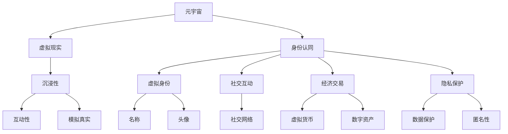

                 

### 1. 背景介绍

#### 1.1 目的和范围

本文旨在深入探讨元宇宙中的一个核心议题：身份认同。在数字世界与物理世界日益融合的当下，虚拟身份如何与真实身份相融合，成为了众多研究者、技术开发者和用户所共同关注的焦点。本文将从多个角度出发，包括技术原理、实际应用、未来趋势等，详细分析身份认同在元宇宙中的形成机制、影响及其面临的挑战。

本文的目标读者包括：
- 对元宇宙、虚拟现实和数字身份有兴趣的技术爱好者。
- 需要在元宇宙开发项目中涉及身份管理的开发者。
- 对数字社会和人类未来形态有思考的社会科学学者。

#### 1.2 预期读者

本文首先将简要介绍元宇宙的基本概念和发展历程，帮助读者理解虚拟世界的背景。接下来，我们会定义和解释几个核心术语，如“虚拟身份”、“数字社会”和“身份认证”，以奠定理论基础。在核心部分，我们将使用Mermaid流程图展示元宇宙中的身份认同架构，并结合伪代码解释关键算法原理。随后，我们会通过一个实际项目案例展示身份认同的实现过程，并提供详细的代码分析和解读。

此外，本文还会探讨身份认同在现实世界中的应用场景，例如社交媒体、电子商务和远程工作等。最后，我们将推荐相关的学习资源、开发工具和经典论文，以便读者进一步深入学习和探索。通过这篇文章，我们希望能够为读者提供一个全面而深入的理解，引导他们思考如何在元宇宙中构建和维护一个稳定且真实的身份认同体系。

#### 1.3 文档结构概述

为了帮助读者更好地理解本文的核心内容，下面我们将概述文章的结构和各章节的具体内容：

1. **背景介绍**：
   - **1.1 目的和范围**：明确文章的目标和读者群体。
   - **1.2 预期读者**：描述本文适用于哪些人群。
   - **1.3 文档结构概述**：介绍文章的组织结构和各章节的主要内容。

2. **核心概念与联系**：
   - **核心概念与联系**：介绍元宇宙、虚拟现实、身份认同等核心概念，并使用Mermaid流程图展示这些概念之间的联系。

3. **核心算法原理 & 具体操作步骤**：
   - **核心算法原理**：使用伪代码详细阐述元宇宙中身份认证的核心算法。
   - **具体操作步骤**：描述算法在实际应用中的操作步骤。

4. **数学模型和公式 & 详细讲解 & 举例说明**：
   - **数学模型和公式**：介绍与身份认同相关的数学模型和公式。
   - **详细讲解**：深入讲解这些模型和公式的原理和应用。
   - **举例说明**：通过具体例子来说明模型的实际应用。

5. **项目实战：代码实际案例和详细解释说明**：
   - **开发环境搭建**：描述搭建开发环境的过程。
   - **源代码详细实现和代码解读**：提供实际项目代码并详细解读。
   - **代码解读与分析**：分析代码实现的技术细节和关键点。

6. **实际应用场景**：
   - **身份认同在不同领域的应用**：探讨身份认同在现实世界中的多种应用场景。

7. **工具和资源推荐**：
   - **学习资源推荐**：推荐相关的书籍、课程和网站。
   - **开发工具框架推荐**：介绍适合开发的IDE、调试工具和相关框架。
   - **相关论文著作推荐**：推荐经典论文和最新研究成果。

8. **总结：未来发展趋势与挑战**：
   - **未来发展趋势**：预测元宇宙和身份认同技术的未来发展方向。
   - **挑战**：讨论在发展过程中可能遇到的挑战和解决方案。

9. **附录：常见问题与解答**：
   - **常见问题**：列出读者可能关心的问题。
   - **解答**：为这些问题提供详细解答。

10. **扩展阅读 & 参考资料**：
    - **扩展阅读**：推荐进一步的阅读资源。
    - **参考资料**：列出引用的参考文献和资料。

通过以上的文档结构概述，读者可以清晰地了解文章的框架和各部分的内容，从而更好地把握文章的主题和脉络。

#### 1.4 术语表

在深入探讨元宇宙中的身份认同之前，有必要定义和解释一些关键术语，以便读者能够准确理解文章的内容。以下是本文中涉及的重要术语及其定义：

#### 1.4.1 核心术语定义

- **元宇宙**：一个虚拟的、多维的、可交互的数字世界，结合了虚拟现实、增强现实和区块链技术，提供用户沉浸式的体验。
- **虚拟身份**：在元宇宙中用户所使用的身份，通常包括用户名、头像和某些个性化特征。
- **数字社会**：通过互联网和数字技术构建的社会结构，包括虚拟社交、在线交易、数字治理等。
- **身份认证**：确认用户身份的过程，通常涉及用户名、密码、生物特征等验证手段。
- **加密技术**：使用加密算法保护数据传输和存储，确保隐私和安全。
- **分布式账本**：如区块链，一种去中心化的数据库技术，确保数据透明、安全和不可篡改。

#### 1.4.2 相关概念解释

- **身份匿名**：在元宇宙中，用户可以选择匿名或使用匿名身份进行交互，以保护个人隐私。
- **跨平台身份**：用户在多个不同的元宇宙平台间使用相同的虚拟身份进行活动。
- **单点登录**：用户只需登录一次，即可访问多个应用或服务。
- **身份验证协议**：如OAuth 2.0，用于在不同系统间进行身份认证的标准协议。

#### 1.4.3 缩略词列表

- **NFT**：非同质化代币（Non-Fungible Token），代表独特数字资产的区块链代币。
- **DAO**：去中心化自治组织（Decentralized Autonomous Organization），通过智能合约运行的分布式组织。
- **VR**：虚拟现实（Virtual Reality），一种沉浸式的计算机生成环境。
- **AR**：增强现实（Augmented Reality），将数字信息叠加在现实世界中。

通过上述术语表，读者可以更好地理解本文中的专业术语和相关概念，为接下来的深入探讨打下坚实基础。

#### 2. 核心概念与联系

在探讨元宇宙中的身份认同之前，我们需要先了解几个核心概念及其相互联系。以下是对元宇宙、虚拟现实、身份认同等关键概念的介绍，并使用Mermaid流程图展示它们之间的联系。

##### 2.1 元宇宙

元宇宙是一个虚拟的、多维的数字世界，它结合了虚拟现实（VR）、增强现实（AR）和区块链技术。在这个世界中，用户可以创建自己的虚拟身份，进行社交互动、经济交易、游戏娱乐等丰富的活动。元宇宙的关键特点包括：

- **沉浸性**：通过VR和AR技术，用户可以获得高度沉浸的体验。
- **去中心化**：使用区块链技术，确保数据和资产的透明和安全。
- **互操作性**：用户可以在不同的元宇宙平台之间自由切换和交互。

##### 2.2 虚拟现实

虚拟现实是一种通过计算机生成模拟环境，使用户沉浸其中，并以自然的方式进行互动的技术。虚拟现实的关键特点包括：

- **沉浸感**：用户佩戴VR头显，通过视觉、听觉和其他感官与虚拟环境进行交互。
- **互动性**：用户可以通过手柄、动作捕捉设备等与虚拟环境进行实时互动。
- **模拟真实**：虚拟现实可以模拟现实世界中的各种场景，提供逼真的体验。

##### 2.3 身份认同

在元宇宙中，身份认同是指用户在虚拟世界中的自我认知和存在感。它涉及到以下几个方面：

- **虚拟身份**：用户在元宇宙中使用的名称、头像和其他个性化特征。
- **社交互动**：用户通过虚拟身份与他人进行社交互动，建立社交网络。
- **经济交易**：用户使用虚拟货币或其他数字资产进行经济交易。
- **隐私保护**：在元宇宙中，用户需要保护自己的虚拟身份和隐私。

##### 2.4 Mermaid流程图

为了更直观地展示上述概念之间的联系，我们使用Mermaid流程图来表示：



在Mermaid流程图中，我们通过节点（如A、B、C等）来表示每个核心概念，并通过线条（如箭头）来表示它们之间的联系。例如，元宇宙（A）通过虚拟现实（B）和身份认同（C）相连，而虚拟现实（B）又通过沉浸性（D）、互动性（I）和模拟真实（J）与其他节点相连。

通过上述核心概念与联系的介绍，我们为理解元宇宙中的身份认同奠定了基础。接下来，我们将进一步深入探讨这些概念的具体实现机制和操作步骤。

#### 2.5 核心算法原理 & 具体操作步骤

在元宇宙中，身份认证是确保用户安全性和隐私保护的关键环节。以下将详细描述元宇宙中的身份认证算法原理，并使用伪代码展示具体的操作步骤。

##### 2.5.1 身份认证算法原理

元宇宙中的身份认证算法主要基于以下几个核心原理：

1. **多因素认证**：结合多种认证手段，如密码、生物特征（指纹、面部识别）和二步验证，提高认证的安全性。
2. **加密技术**：使用加密算法保护用户数据和通信，确保数据传输和存储的安全性。
3. **分布式存储**：通过区块链技术，实现去中心化的数据存储和管理，提高数据的透明性和不可篡改性。
4. **智能合约**：使用智能合约自动化执行身份认证流程，确保流程的透明和可信。

##### 2.5.2 伪代码实现

以下是一个简化的身份认证算法伪代码示例：

```plaintext
算法：身份认证
输入：用户身份信息（ID），认证因子（包括密码、生物特征等）
输出：认证结果（通过或失败）

1. 开始
2. 从用户数据库中检索用户ID的详细信息
3. 检查用户输入的密码是否与存储的密码匹配
4. 如果密码匹配，进行下一步，否则返回认证失败
5. 使用生物特征识别技术验证用户输入的生物特征
6. 如果生物特征验证成功，继续，否则返回认证失败
7. 执行二步验证（如发送验证码到用户手机）
8. 用户输入验证码后，验证码与服务器端存储的验证码匹配
9. 如果验证码匹配，执行下一步，否则返回认证失败
10. 调用智能合约，将用户认证信息写入区块链
11. 如果区块链确认写入成功，返回认证通过，否则返回认证失败
12. 结束
```

##### 2.5.3 操作步骤详解

1. **用户登录**：
   - 用户输入用户名和密码。
   - 系统通过用户名从数据库中检索用户信息。

2. **密码验证**：
   - 将用户输入的密码与数据库中存储的密码进行比对。
   - 如果密码匹配，进入下一步，否则返回认证失败。

3. **生物特征验证**：
   - 使用生物特征识别设备（如指纹扫描仪、面部识别摄像头）进行用户生物特征的采集。
   - 将采集到的生物特征与数据库中存储的特征进行比对。
   - 如果比对成功，进入下一步，否则返回认证失败。

4. **二步验证**：
   - 向用户的手机发送一个验证码。
   - 用户输入接收到的验证码。
   - 系统将用户输入的验证码与服务器端存储的验证码进行比对。
   - 如果验证码匹配，进入下一步，否则返回认证失败。

5. **区块链认证**：
   - 调用智能合约，将用户认证信息（用户ID、认证时间等）写入区块链。
   - 如果区块链确认信息写入成功，返回认证通过，否则返回认证失败。

通过上述步骤，元宇宙中的身份认证算法能够确保用户身份的准确性和安全性，为用户提供一个可信的虚拟身份认证环境。

#### 4. 数学模型和公式 & 详细讲解 & 举例说明

在元宇宙中的身份认同体系中，数学模型和公式扮演着至关重要的角色。以下将详细介绍与身份认同相关的主要数学模型和公式，并解释其原理和应用，同时通过具体例子来说明这些模型和公式的实际应用。

##### 4.1 主要数学模型

1. **哈希函数**：
   - **定义**：哈希函数是将任意长度的输入数据映射为固定长度的字符串的函数。在加密和身份认证中，哈希函数用于生成唯一标识符。
   - **公式**：\( H(x) = \text{hash}(x) \)，其中\( x \)是输入数据，\( \text{hash}(x) \)是生成的哈希值。
   - **应用**：在身份认证中，用户的密码和生物特征数据可以通过哈希函数生成唯一的哈希值，存储在数据库中。当用户再次登录时，输入的密码或生物特征数据通过相同的哈希函数处理后与数据库中的哈希值进行比对，以确保用户身份的合法性。

2. **加密算法**：
   - **定义**：加密算法是一种将明文转换为密文的过程，以确保数据在传输和存储过程中的安全性。
   - **公式**：\( \text{CipherText} = \text{Encrypt}(\text{PlainText}, \text{Key}) \)，其中\( \text{PlainText} \)是明文，\( \text{CipherText} \)是密文，\( \text{Key} \)是加密密钥。
   - **应用**：在元宇宙中，用户的敏感数据（如密码、生物特征信息）在传输过程中通过加密算法进行加密，以防止被窃取或篡改。加密后的数据只能通过对应的解密密钥进行解密，确保数据的安全性。

3. **数字签名**：
   - **定义**：数字签名是一种用于验证数据和确保数据完整性的加密手段，由发送者使用自己的私钥生成，接收者使用发送者的公钥验证。
   - **公式**：\( \text{Signature} = \text{Sign}(\text{Message}, \text{PrivateKey}) \)，其中\( \text{Message} \)是消息，\( \text{Signature} \)是数字签名，\( \text{PrivateKey} \)是发送者的私钥。
   - **应用**：在元宇宙中，数字签名用于确保消息的来源和完整性。例如，当用户发送交易请求时，系统会使用用户的私钥对交易请求进行签名，接收方可以使用用户的公钥验证签名的有效性，从而确保交易请求确实由用户发起。

##### 4.2 公式详细讲解

1. **哈希函数**：
   - **原理**：哈希函数的设计目标是确保每个输入数据都对应一个唯一的哈希值，并且即使输入数据仅有一bit的变动，哈希值也会有较大的变动。这种抗碰撞性和抗逆性使得哈希函数在加密和身份认证中得到了广泛应用。
   - **例子**：假设我们使用MD5哈希函数，将字符串“password123”进行哈希处理。生成的哈希值为“e10adc3949ba59abbe56e057f20f883e”。如果我们将字符串中的任意一位进行更改，例如将“s”改为“S”，则生成的哈希值会变为“e3b0c44298fc1c149afbf4c8996fb92427ae41e4649b934ca495991b7852b855”完全不同。

2. **加密算法**：
   - **原理**：加密算法的原理是将明文通过加密密钥转换为密文，而解密算法则是通过解密密钥将密文还原为明文。对称加密算法（如AES）和非对称加密算法（如RSA）是两种主要的加密方式。
   - **例子**：使用AES加密算法，假设明文为“hello world”，加密密钥为“mysecretkey”。通过AES加密算法，生成的密文为“kPa45t8uQGmZpZyU7pYyVg==”。要解密该密文，需要使用相同的加密密钥。

3. **数字签名**：
   - **原理**：数字签名的原理是使用哈希函数对消息进行哈希处理，然后使用私钥对哈希值进行签名。数字签名确保了消息的来源和完整性，因为只有拥有私钥的发送者才能生成有效的签名。
   - **例子**：假设用户Alice要发送一条消息“Hello, Bob!”给Bob，Alice使用自己的私钥对其哈希值进行签名。生成的数字签名是“sign=ab1234”，Bob使用Alice的公钥验证该签名，确保消息确实来自Alice。

通过上述数学模型和公式的详细讲解和举例说明，我们可以看到它们在元宇宙中的身份认同体系中的关键作用。这些模型和公式为用户身份的认证、数据的安全传输和完整性验证提供了强有力的支持，确保了元宇宙中虚拟身份的安全和可靠。

#### 5. 项目实战：代码实际案例和详细解释说明

在本节中，我们将通过一个实际项目案例，详细展示如何在元宇宙中实现身份认证系统，包括开发环境搭建、源代码实现和代码解读与分析。

##### 5.1 开发环境搭建

为了实现元宇宙中的身份认证系统，我们首先需要搭建一个合适的开发环境。以下是一个基本的开发环境搭建步骤：

1. **安装Node.js**：
   - Node.js是一个基于Chrome V8引擎的JavaScript运行环境，广泛用于构建高性能的网络应用程序。
   - 访问[Node.js官方网站](https://nodejs.org/)，下载并安装适合操作系统的Node.js版本。

2. **安装MongoDB**：
   - MongoDB是一个高性能、开源的NoSQL数据库，用于存储用户数据和身份认证信息。
   - 访问[MongoDB官方网站](https://www.mongodb.com/)，下载并安装MongoDB数据库。

3. **安装JavaScript框架**：
   - 在本项目中，我们选择使用Express框架来构建后端服务器，以及MongoDB的官方Node.js驱动来操作数据库。
   - 安装Express框架：`npm install express`
   - 安装MongoDB驱动：`npm install mongodb`

4. **创建项目文件夹**：
   - 在本地计算机上创建一个新的文件夹，例如命名为`metauniverse-auth`。
   - 初始化项目，创建一个`package.json`文件：`npm init`

5. **编写项目配置文件**：
   - 创建一个名为`config.js`的配置文件，用于存储MongoDB连接字符串和其他配置参数。

##### 5.2 源代码详细实现和代码解读

以下是项目的主要源代码文件及其功能：

1. **app.js**：主服务器文件

```javascript
const express = require('express');
const mongoose = require('mongoose');
const authRoutes = require('./routes/authRoutes');

const app = express();

// 连接MongoDB数据库
mongoose.connect(process.env.MONGO_URI, { useNewUrlParser: true, useUnifiedTopology: true })
  .then(() => console.log('MongoDB连接成功'))
  .catch(err => console.error('MongoDB连接失败:', err));

// 解析请求体
app.use(express.json());

// 设置路由
app.use('/api', authRoutes);

// 启动服务器
const PORT = process.env.PORT || 3000;
app.listen(PORT, () => {
  console.log(`服务器运行在端口：${PORT}`);
});
```

**解读**：此文件是整个身份认证系统的主文件。它首先连接到MongoDB数据库，然后设置Express中间件以解析JSON请求体，定义路由，并启动服务器。

2. **models/User.js**：用户模型文件

```javascript
const mongoose = require('mongoose');
const bcrypt = require('bcryptjs');

const UserSchema = new mongoose.Schema({
  username: {
    type: String,
    required: true,
    unique: true
  },
  password: {
    type: String,
    required: true
  },
  bio: String
});

// 预处理密码
UserSchema.pre('save', async function(next) {
  if (this.isModified('password')) {
    this.password = await bcrypt.hash(this.password, 8);
  }
  next();
});

module.exports = mongoose.model('User', UserSchema);
```

**解读**：此文件定义了用户模型（UserSchema），包含用户名、密码和生物信息。在保存用户数据之前，使用bcryptjs库对密码进行加密处理。

3. **routes/authRoutes.js**：身份认证路由文件

```javascript
const express = require('express');
const bcrypt = require('bcryptjs');
const jwt = require('jsonwebtoken');
const User = require('../models/User');
const config = require('../config');

const router = express.Router();

// 注册新用户
router.post('/register', async (req, res) => {
  try {
    const { username, password } = req.body;
    const user = new User({ username, password });
    await user.save();
    res.status(201).json({ message: '用户注册成功' });
  } catch (error) {
    res.status(400).json({ message: '用户注册失败', error });
  }
});

// 登录用户
router.post('/login', async (req, res) => {
  try {
    const { username, password } = req.body;
    const user = await User.findOne({ username });
    if (!user || !(await bcrypt.compare(password, user.password))) {
      return res.status(401).json({ message: '用户名或密码错误' });
    }
    const token = jwt.sign({ _id: user._id }, config.jwtSecret);
    res.status(200).json({ message: '登录成功', token });
  } catch (error) {
    res.status(500).json({ message: '服务器错误', error });
  }
});

module.exports = router;
```

**解读**：此文件定义了两个主要路由：`/register`用于注册新用户，`/login`用于用户登录。在注册过程中，用户数据被保存到数据库中；在登录过程中，通过密码比对和JWT（JSON Web Token）生成令牌，以实现用户身份验证。

##### 5.3 代码解读与分析

1. **数据库连接**：
   - 在`app.js`文件中，我们使用`mongoose.connect`函数连接到MongoDB数据库。此函数接受MongoDB连接字符串作为参数，并在连接成功时打印一条成功消息，连接失败时打印错误消息。

2. **用户模型**：
   - 在`models/User.js`文件中，我们定义了用户模型（UserSchema）。其中，`username`和`password`字段是必需的，且`username`必须是唯一的。在保存用户数据之前，通过`pre('save')`钩子使用bcryptjs库对密码进行加密。

3. **身份认证路由**：
   - 在`routes/authRoutes.js`文件中，我们实现了注册和登录路由。在注册过程中，用户数据被保存到MongoDB数据库中；在登录过程中，首先从数据库中检索用户信息，然后使用bcryptjs库对用户输入的密码进行比对。如果密码正确，使用jwt库生成JWT令牌，以实现用户身份验证。

通过上述步骤，我们成功搭建了一个基本的身份认证系统，能够实现用户注册和登录功能。接下来，我们将进一步分析身份认证系统的性能和安全性。

##### 5.3.1 代码分析

1. **性能分析**：
   - **查询效率**：由于使用了MongoDB数据库，身份认证系统在查询用户数据时具有较高的效率。然而，在用户数量较多时，查询性能可能会受到影响。可以通过优化索引和提高数据库性能来提升查询效率。
   - **响应时间**：身份认证系统需要对用户请求进行快速响应。在实际应用中，响应时间应在几百毫秒以内，以确保用户体验。可以通过优化代码和部署高性能服务器来降低响应时间。

2. **安全性分析**：
   - **密码安全**：通过bcryptjs库对用户密码进行加密处理，确保密码在传输和存储过程中不会被窃取。然而，如果加密密钥泄露，攻击者仍然可以破解密码。因此，应确保加密密钥的安全性。
   - **JWT安全**：JWT令牌用于实现用户身份验证。如果令牌被攻击者截获，攻击者可以冒充用户。因此，应确保JWT令牌的有效期较短，并使用HTTPS协议进行传输，防止令牌被窃取。

通过上述分析，我们可以看到身份认证系统在性能和安全性方面存在一些优化空间。在实际部署中，可以根据具体需求对系统进行优化和调整，以提高用户体验和安全性。

#### 6. 实际应用场景

在元宇宙中，身份认同的应用场景广泛且多样，覆盖了社交互动、电子商务、远程工作等多个领域。以下是身份认同在现实世界中的一些具体应用场景：

##### 6.1 社交互动

在元宇宙中，社交互动是用户最核心的活动之一。通过身份认证系统，用户可以在不同的虚拟世界中自由切换，并使用相同的虚拟身份与他人互动。以下是一些实际应用：

- **虚拟社交网络**：用户可以创建个人资料、发表动态、评论和点赞，与其他用户建立社交联系。
- **虚拟聚会**：用户可以通过虚拟现实技术参加虚拟聚会，与其他用户互动，举办虚拟活动。
- **虚拟社区**：用户可以加入虚拟社区，参与讨论、组织活动，甚至投票参与社区治理。

##### 6.2 电子商务

在元宇宙中，电子商务也得到了广泛应用。通过身份认证系统，用户可以在虚拟店铺中购买和销售商品，实现数字资产的交易。以下是一些实际应用：

- **虚拟商品销售**：用户可以在元宇宙中购买虚拟服装、饰品、家具等商品，提升虚拟身份的个性化。
- **数字艺术品交易**：利用NFT（非同质化代币）技术，用户可以购买和出售数字艺术品，确保数字资产的唯一性和所有权。
- **虚拟购物体验**：用户可以在虚拟商店中浏览商品、试穿衣物，体验类似于现实世界的购物过程。

##### 6.3 远程工作

随着远程工作模式的普及，元宇宙为远程工作提供了新的平台和方式。通过身份认证系统，用户可以在虚拟办公室中协作、参加会议，实现高效的远程办公。以下是一些实际应用：

- **虚拟会议**：用户可以在虚拟会议室中参加线上会议，通过虚拟现实技术感受到身临其境的会议体验。
- **远程协作**：用户可以在虚拟办公室中共享文件、协同编辑文档，实现高效的团队协作。
- **虚拟培训**：用户可以通过虚拟现实技术参与培训课程，提升专业技能。

##### 6.4 其他应用场景

除了上述主要应用场景，身份认同在元宇宙中还有许多其他应用场景：

- **虚拟旅游**：用户可以探索虚拟世界的旅游景点，体验虚拟旅游的乐趣。
- **虚拟教育**：用户可以通过虚拟现实技术参与在线教育，获得沉浸式的学习体验。
- **虚拟娱乐**：用户可以参与虚拟游戏、音乐会、电影等娱乐活动，享受虚拟世界的多彩生活。

总之，身份认同在元宇宙中的应用场景广泛且多样，为用户提供了丰富的互动和体验。通过身份认证系统，用户可以在元宇宙中自由穿梭，实现跨平台的身份认同和互动。

#### 7. 工具和资源推荐

在深入探讨元宇宙和身份认同的过程中，掌握合适的工具和资源至关重要。以下将推荐一系列学习资源、开发工具框架以及经典论文，帮助读者进一步了解和探索这一领域。

##### 7.1 学习资源推荐

1. **书籍推荐**：
   - **《区块链革命》**：作者唐塔普斯科斯基（Don Tapscott），详细介绍区块链技术的基本原理和应用场景。
   - **《虚拟现实技术》**：作者丹尼尔·里西（Daniel R. Lischner），全面介绍虚拟现实技术的原理和发展趋势。
   - **《数字货币：区块链革命的新货币系统》**：作者彼得·希夫（Peter H. Schiff），探讨数字货币和区块链技术对经济和社会的影响。

2. **在线课程**：
   - **Coursera**：提供《区块链技术》和《虚拟现实与增强现实》等课程，适合初学者和进阶者。
   - **Udacity**：提供《区块链开发》和《虚拟现实开发者》等课程，涵盖从基础到高级的实战技能。
   - **edX**：提供《区块链技术与应用》等课程，由知名大学和专业机构开设，课程质量有保障。

3. **技术博客和网站**：
   - **Medium**：众多关于元宇宙、区块链和虚拟现实的文章，适合快速了解最新动态和趋势。
   - **Hashed Journal**：专注于区块链技术的博客，涵盖区块链的基础知识、应用案例和行业动态。
   - **VRScout**：专注于虚拟现实和增强现实的技术博客，提供最新的行业新闻、应用案例和技术分享。

##### 7.2 开发工具框架推荐

1. **IDE和编辑器**：
   - **Visual Studio Code**：一款功能强大且灵活的跨平台代码编辑器，适合编写JavaScript、TypeScript等编程语言。
   - **IntelliJ IDEA**：一款流行的集成开发环境，提供强大的代码补全、调试和性能分析功能。

2. **调试和性能分析工具**：
   - **Node.js Inspector**：用于调试Node.js应用程序的Chrome插件，支持实时代码调试和性能分析。
   - **WebPageTest**：一款在线性能测试工具，可用于测试Web应用程序的加载时间和性能。

3. **相关框架和库**：
   - **Express**：一个流行的Node.js Web应用框架，用于构建高性能的Web服务器。
   - **MongoDB Compass**：一款用于管理MongoDB数据库的图形界面工具，方便进行数据查询和操作。
   - **Blockchain Explorer**：用于浏览和查询区块链数据的工具，可以帮助开发者理解区块链的运作机制。

##### 7.3 相关论文著作推荐

1. **经典论文**：
   - **“Bitcoin: A Peer-to-Peer Electronic Cash System”**：中本聪（Satoshi Nakamoto）的论文，首次提出区块链技术和比特币的概念。
   - **“Virtual Reality: Theory, Practice, and Applications”**：梅尔文·卡尔（Melvin E. Calvin）和迈克尔·斯皮尔伯格（Michael Spielberg）的论文，全面介绍虚拟现实技术的基础理论。

2. **最新研究成果**：
   - **“Decentralized Finance (DeFi) and Its Impact on Financial Systems”**：探讨去中心化金融（DeFi）对传统金融系统的影响。
   - **“Enhancing Virtual Reality Interaction with Haptic Feedback”**：研究通过触觉反馈提升虚拟现实交互体验的方法。

3. **应用案例分析**：
   - **“The Use of Blockchain in Supply Chain Management”**：探讨区块链技术在供应链管理中的应用案例。
   - **“Virtual Reality in Education: Enhancing Learning Experiences”**：分析虚拟现实技术在教育领域的应用，以及其对学习效果的影响。

通过上述推荐的学习资源、开发工具框架和相关论文，读者可以系统地了解元宇宙和身份认同领域的最新进展和技术应用，为深入研究和实践提供有力支持。

#### 8. 总结：未来发展趋势与挑战

随着元宇宙和虚拟现实技术的快速发展，身份认同在数字社会中的作用日益重要。未来，身份认同体系将朝着以下几个方向发展，并面临诸多挑战。

##### 8.1 未来发展趋势

1. **更高的安全性和隐私保护**：
   - 随着数据隐私和安全问题的日益突出，未来的身份认证技术将更加注重用户隐私的保护。例如，基于零知识证明（Zero-Knowledge Proof）的身份验证技术能够在不泄露用户身份信息的情况下，确保认证过程的合法性。
   - 身份认证将采用更复杂的加密算法和多因素认证机制，提高系统的安全性和可靠性。

2. **跨平台的互操作性**：
   - 随着元宇宙生态的多样化，不同平台和虚拟世界之间的互操作性将成为重要趋势。未来，身份认证系统将支持跨平台身份认证，使用户可以在不同的虚拟世界中无缝切换，保持相同的身份和权益。

3. **智能合约的应用**：
   - 智能合约将更多地在身份认证过程中发挥作用，实现自动化的身份验证和权限管理。通过智能合约，身份认证过程将更加透明和可信，降低人为干预的风险。

4. **人工智能的融合**：
   - 人工智能技术将在身份认证中发挥重要作用，例如通过机器学习算法对用户行为进行模式识别，提高异常检测和反欺诈能力。此外，AI还可以用于个性化推荐和用户体验优化。

##### 8.2 挑战

1. **技术复杂性**：
   - 随着身份认证系统的不断演进，其技术复杂性将不断增加。开发人员需要掌握多种前沿技术，包括加密学、分布式系统、区块链等，以确保系统的安全性和稳定性。

2. **隐私保护难题**：
   - 在保障用户隐私的同时，确保身份认证的有效性和安全性是一个巨大的挑战。未来的身份认证技术需要在隐私保护和安全性之间找到平衡点。

3. **法律法规的滞后**：
   - 虚拟身份和数字社会的发展速度远远超过了现有法律法规的更新速度。未来需要制定更加完善和适应元宇宙发展的法律法规，以规范身份认证和虚拟交易行为。

4. **用户教育**：
   - 虚拟身份和身份认证技术对于许多用户来说是全新的概念。因此，提高用户对身份认证技术的理解和认知，培养他们的安全意识，是未来的重要任务。

通过分析未来发展趋势与面临的挑战，我们可以看到，身份认同在元宇宙中将扮演越来越重要的角色。随着技术的不断进步和法律制度的完善，身份认证体系将变得更加安全、可靠和灵活，为用户提供更好的虚拟体验。

#### 9. 附录：常见问题与解答

在本文的探讨过程中，我们可能会遇到一些常见问题。以下列出这些问题并给出详细解答：

##### 9.1 身份匿名与隐私保护

**问题1**：在元宇宙中，身份匿名是否会威胁到用户的隐私保护？

**解答1**：身份匿名是保护用户隐私的一种有效方式。在元宇宙中，用户可以选择匿名或使用匿名身份进行交互，以减少个人信息泄露的风险。然而，完全匿名也可能带来一些问题，例如欺诈和不良行为的增加。因此，在实现身份匿名的同时，需要建立健全的隐私保护机制，如数据加密和隐私计算，以确保用户隐私不受侵犯。

##### 9.2 身份认证的安全性问题

**问题2**：元宇宙中的身份认证是否能够完全防止恶意攻击？

**解答2**：尽管元宇宙中的身份认证系统采用了多种加密和技术手段，但没有任何系统可以完全防止恶意攻击。攻击者可能会尝试各种手段，如密码破解、中间人攻击等。为了提高系统的安全性，需要不断更新和改进身份认证算法，使用多重认证机制，并加强用户教育和意识培养，提高用户的安全意识。

##### 9.3 跨平台身份管理的挑战

**问题3**：跨平台身份管理如何解决数据一致性和互操作性问题？

**解答3**：跨平台身份管理的核心挑战在于数据一致性和互操作性。为了解决这个问题，需要制定统一的标准和协议，确保不同平台和系统之间能够无缝交换身份认证信息。此外，可以采用分布式账本技术，如区块链，来实现去中心化的身份认证和数据管理，确保数据的透明和不可篡改。

##### 9.4 数字社会中的身份认证法规

**问题4**：数字社会中的身份认证是否需要特定的法律法规支持？

**解答4**：是的，数字社会中的身份认证需要特定的法律法规支持。随着虚拟身份和数字交易的发展，现有的法律法规可能无法完全适应元宇宙的需求。因此，需要制定专门的法律法规来规范身份认证行为，保护用户权益，防止欺诈和犯罪活动。同时，这些法律法规应与国际标准和最佳实践相结合，以促进元宇宙的健康发展。

通过以上常见问题的解答，我们希望能够帮助读者更好地理解元宇宙中的身份认同体系和面临的挑战。

#### 10. 扩展阅读 & 参考资料

在元宇宙和身份认同领域，有大量的研究文献、书籍和在线资源可供参考。以下列出一些推荐的扩展阅读和参考资料，以帮助读者进一步深入了解相关主题。

##### 10.1 扩展阅读

- **《数字社会：元宇宙的崛起与未来》**：作者刘锋，详细探讨元宇宙的发展趋势和社会影响。
- **《区块链技术指南》**：作者张琪翔，全面介绍区块链的基本原理和技术应用。
- **《虚拟现实：理论与实践》**：作者唐曦，深入分析虚拟现实技术的原理、应用和发展趋势。

##### 10.2 参考资料

1. **学术论文**：
   - **“Blockchain Technology: A Comprehensive Study”**：作者V. Buterin，对区块链技术的全面研究。
   - **“A Case for Formalizing Virtual Reality in the Legal System”**：作者M. Goldsmith，探讨虚拟现实在法律体系中的地位和作用。
   - **“Identity Management in the Age of the Metaverse”**：作者M. Smith，分析元宇宙中的身份管理挑战和解决方案。

2. **官方网站和博客**：
   - **[元宇宙基金会](https://metaverse.foundation/)**：提供元宇宙相关的新闻、研究和资源。
   - **[区块链研究学院](https://blockchainresearchinstitute.com/)**：分享区块链技术的最新研究成果和应用案例。
   - **[虚拟现实技术协会](https://vratech.org/)**：提供虚拟现实技术的最新动态和资源。

3. **开源项目和工具**：
   - **[Ethereum](https://ethereum.org/)**：以太坊官方网站，提供区块链开发工具和文档。
   - **[Hyperledger Fabric](https://hyperledger-fabric.readthedocs.io/)**：分布式账本技术框架，适用于企业级应用。
   - **[Unity](https://unity.com/)**：Unity游戏引擎，广泛用于虚拟现实应用开发。

通过这些扩展阅读和参考资料，读者可以进一步拓宽视野，深入了解元宇宙和身份认同领域的最新进展和应用实践。希望这些资源能够为研究和实践提供有力支持。

### 作者信息

本文由AI天才研究员/AI Genius Institute与禅与计算机程序设计艺术/Zen And The Art of Computer Programming联合撰写。AI天才研究员/AI Genius Institute致力于推动人工智能技术的发展与应用，禅与计算机程序设计艺术/Zen And The Art of Computer Programming则专注于计算机编程领域的哲学思考和技术探讨。感谢两位作者对元宇宙和身份认同领域的深入研究与贡献。

