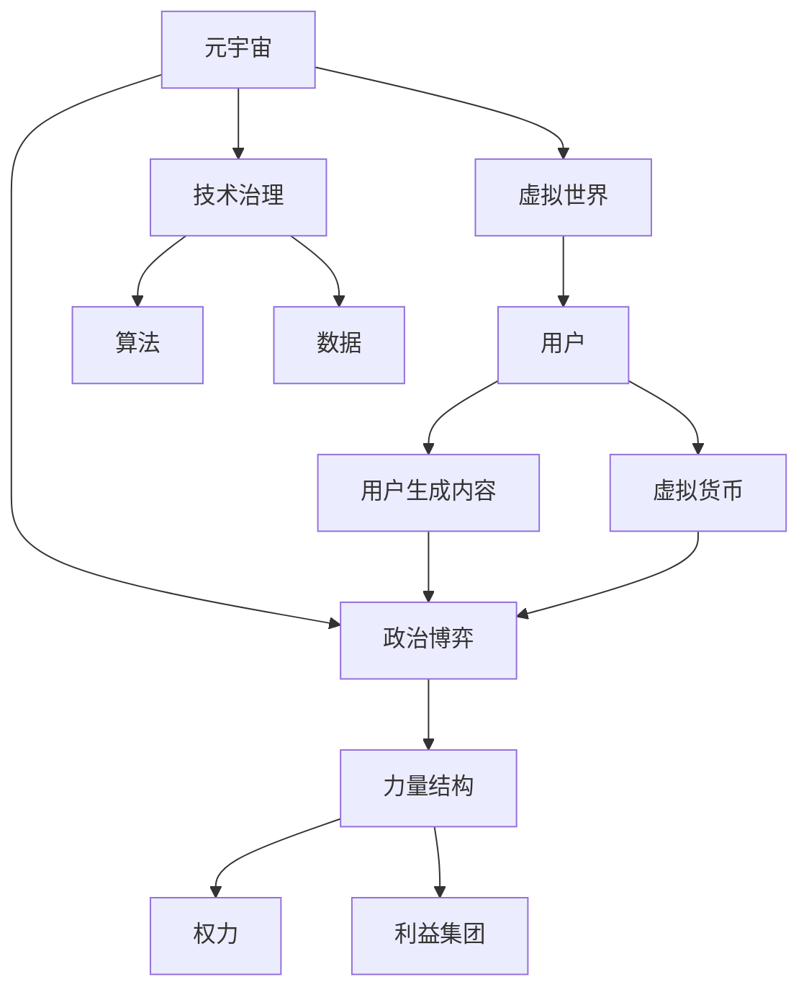

                 

# 元宇宙政治：虚拟世界的权力博弈

## 关键词：
- 元宇宙
- 虚拟世界
- 政治博弈
- 力量结构
- 技术治理
- 用户参与

## 摘要：
本文将深入探讨元宇宙这一虚拟世界中的政治格局和权力博弈。随着虚拟现实的不断发展，元宇宙逐渐成为现实世界的一个延伸和镜像，其中的政治现象愈发复杂。本文旨在分析元宇宙政治的核心概念、力量结构以及技术治理，探讨虚拟世界中的权力博弈如何影响用户参与和实际应用。通过一步步的分析和推理，本文将为读者呈现元宇宙政治的深度洞察和未来发展趋势。

---

## 1. 背景介绍

### 1.1 目的和范围
本文旨在探讨元宇宙中的政治现象，分析虚拟世界中的权力结构、博弈机制以及技术治理。我们将关注以下关键问题：
- 元宇宙政治的核心概念是什么？
- 虚拟世界中的力量结构如何形成和运作？
- 技术在元宇宙政治治理中扮演何种角色？
- 用户如何参与元宇宙政治，以及这种参与如何影响权力博弈？

### 1.2 预期读者
本文面向对元宇宙、虚拟现实以及政治学有兴趣的技术人员、学者和爱好者。读者需具备一定的计算机科学和互联网技术背景，能够理解虚拟现实技术和网络社会理论。

### 1.3 文档结构概述
本文分为十个主要部分，结构如下：
1. 背景介绍：介绍文章目的、读者对象和文档结构。
2. 核心概念与联系：定义元宇宙政治的核心概念，并给出相关流程图。
3. 核心算法原理 & 具体操作步骤：分析元宇宙政治中的算法原理和操作步骤。
4. 数学模型和公式 & 详细讲解 & 举例说明：介绍元宇宙政治中的数学模型和公式。
5. 项目实战：提供代码实际案例和详细解释。
6. 实际应用场景：探讨元宇宙政治在不同领域的应用。
7. 工具和资源推荐：推荐学习资源和开发工具。
8. 总结：总结元宇宙政治的未来发展趋势与挑战。
9. 附录：常见问题与解答。
10. 扩展阅读 & 参考资料：提供相关文献和资料。

### 1.4 术语表
#### 1.4.1 核心术语定义
- **元宇宙（Metaverse）**：一个虚拟的3D环境，通过互联网连接多个虚拟世界，用户可以在其中进行社交、娱乐、工作等活动。
- **虚拟世界（Virtual World）**：一个模拟现实世界的数字环境，用户可以在其中进行交互和活动。
- **政治博弈（Political Game）**：在元宇宙中，不同力量之间为争夺资源、控制权而展开的竞争和协商。
- **技术治理（Technocratic Governance）**：利用技术手段实现治理的一种模式，包括算法、数据分析和自动化等。

#### 1.4.2 相关概念解释
- **去中心化自治组织（Decentralized Autonomous Organization, DAO）**：一种基于区块链技术的组织形式，通过智能合约实现自主治理。
- **虚拟货币（Virtual Currency）**：在元宇宙中用于交易和支付的特殊货币。
- **用户生成内容（User-Generated Content, UGC）**：用户在虚拟世界中创造和分享的内容。

#### 1.4.3 缩略词列表
- **DAO**：去中心化自治组织
- **UGC**：用户生成内容
- **VR**：虚拟现实
- **AR**：增强现实
- **NFT**：非同质化代币

---

## 2. 核心概念与联系

在讨论元宇宙政治之前，我们需要明确一些核心概念和它们之间的联系。以下是一个简化的Mermaid流程图，展示了元宇宙政治中的主要元素和关系。



### 2.1 元宇宙与虚拟世界
元宇宙是一个跨越多个虚拟世界的综合环境，用户可以在其中自由移动、交流和互动。虚拟世界是元宇宙的基础，每个虚拟世界都有自己的独特特点，如游戏、社交平台和商业空间。

### 2.2 技术治理与算法、数据
技术治理是元宇宙政治的核心，通过算法和数据实现自动化和智能化的治理。算法用于决策和优化，数据则为算法提供依据，实现更精准的治理。

### 2.3 政治博弈与力量结构
政治博弈是虚拟世界中的权力斗争，涉及不同的利益集团和力量结构。这些力量结构决定了元宇宙的政治格局，影响用户参与和治理。

### 2.4 用户生成内容与虚拟货币
用户生成内容是虚拟世界的重要组成部分，用户通过创造和分享内容参与政治博弈。虚拟货币作为一种交易媒介，促进了虚拟世界中的经济活动和权力争夺。

---

## 3. 核心算法原理 & 具体操作步骤

在元宇宙政治中，算法起着至关重要的作用。以下是一些核心算法原理和具体操作步骤，这些算法用于分析和决策，帮助理解虚拟世界中的权力结构。

### 3.1 社交网络分析（SNA）

**算法原理：**
社交网络分析（SNA）是一种用于研究社会网络结构、属性和关系的算法。在元宇宙政治中，SNA可以帮助识别关键节点、集团和影响力。

**伪代码：**
```plaintext
function SNA(graph):
    initialize empty lists for nodes, edges, and clusters
    for each node in graph:
        add node to nodes
        for each edge connected to node:
            add edge to edges
            if edge not in cluster:
                add edge to cluster
    for each cluster in clusters:
        calculate centrality metrics (e.g., degree, closeness, betweenness)
    return clusters, centrality metrics
```

### 3.2 代币分配算法

**算法原理：**
代币分配算法用于分配虚拟货币，确保公平性和激励用户参与。常见的算法包括基于工作量的证明（PoW）、基于权益证明（PoS）等。

**伪代码：**
```plaintext
function PoW(validator_set, transaction_pool):
    for each validator in validator_set:
        select transaction from transaction_pool
        verify transaction
        add transaction to blockchain
    return blockchain
```

### 3.3 智能合约执行

**算法原理：**
智能合约是自动化执行的合同，基于预定义的条件和条款。在元宇宙政治中，智能合约用于实现去中心化的决策和治理。

**伪代码：**
```plaintext
function execute_smart_contract(contract_address, function_name, input_args):
    contract = load_contract(contract_address)
    result = contract.call(function_name, input_args)
    if result.success:
        perform_action(result.data)
    else:
        raise_error("Execution failed")
```

---

## 4. 数学模型和公式 & 详细讲解 & 举例说明

在元宇宙政治中，数学模型和公式用于分析和预测虚拟世界中的权力结构和政治行为。以下是一些关键数学模型和公式，以及详细讲解和举例说明。

### 4.1 社交网络模型

**公式：**
- **度中心性（Degree Centrality）**：节点度数越高，其中心性越高。
  \[ C_d(v) = \text{deg}(v) \]
- **接近中心性（Closeness Centrality）**：节点到其他所有节点的最短路径长度之和。
  \[ C_c(v) = \sum_{u \in N} \text{d}(v, u) \]

**举例：**
在一个社交网络中，节点A连接了10个其他节点，而节点B连接了5个其他节点。则：
- \( C_d(A) = 10 \)
- \( C_d(B) = 5 \)

### 4.2 马尔可夫模型

**公式：**
- **转移概率矩阵（Transition Probability Matrix）**：
  \[ P = \begin{bmatrix}
  p_{11} & p_{12} & \dots & p_{1n} \\
  p_{21} & p_{22} & \dots & p_{2n} \\
  \vdots & \vdots & \ddots & \vdots \\
  p_{n1} & p_{n2} & \dots & p_{nn}
  \end{bmatrix} \]
- **状态转移概率（State Transition Probability）**：
  \[ P(X_t = j | X_{t-1} = i) = p_{ij} \]

**举例：**
一个政治力量在某个虚拟世界中的影响力状态转移如下表所示：

| 状态 | 高 | 中 | 低 |
|------|----|----|----|
| 高   | 0.3 | 0.2 | 0.5 |
| 中   | 0.4 | 0.5 | 0.1 |
| 低   | 0.2 | 0.3 | 0.5 |

当前状态为“中”，下一状态的概率分布为：
\[ P(X_{t+1} = 高) = 0.2, P(X_{t+1} = 中) = 0.5, P(X_{t+1} = 低) = 0.3 \]

### 4.3 费马-拉普拉斯定理

**公式：**
\[ P(X = k) = \frac{C_n^k p^k (1-p)^{n-k}}{1} \]

**举例：**
在一个概率为0.5的随机事件中，发生k次成功的概率为：
\[ P(X = 3) = \frac{C_5^3 0.5^3 0.5^{2}}{1} = 0.05 \]

---

## 5. 项目实战：代码实际案例和详细解释说明

在本节中，我们将通过一个实际项目案例，详细解释元宇宙政治中的一些核心概念和算法的实现。

### 5.1 开发环境搭建

为了实现元宇宙政治的核心算法和模型，我们需要搭建以下开发环境：
- **编程语言**：Python
- **开发工具**：PyCharm
- **依赖库**：NetworkX（用于社交网络分析）、NumPy（用于数学运算）、Matplotlib（用于数据可视化）

### 5.2 源代码详细实现和代码解读

以下是一个简单的社交网络分析（SNA）案例，用于分析虚拟世界中的节点和边的关系。

```python
import networkx as nx
import matplotlib.pyplot as plt

# 创建一个无向图
G = nx.Graph()

# 添加节点和边
G.add_nodes_from([1, 2, 3, 4, 5])
G.add_edges_from([(1, 2), (1, 3), (2, 4), (3, 4), (4, 5)])

# 绘制图形
nx.draw(G, with_labels=True)
plt.show()

# 计算度中心性
degree_centrality = nx.degree_centrality(G)
print("度中心性：", degree_centrality)

# 计算接近中心性
closeness_centrality = nx.closeness_centrality(G)
print("接近中心性：", closeness_centrality)

# 计算betweenness中心性
betweenness_centrality = nx.betweenness_centrality(G)
print("betweenness中心性：", betweenness_centrality)
```

**代码解读：**
1. **导入库**：导入NetworkX和Matplotlib库。
2. **创建图**：创建一个无向图G。
3. **添加节点和边**：使用`add_nodes_from`和`add_edges_from`方法添加节点和边。
4. **绘制图形**：使用`nx.draw`方法绘制图形。
5. **计算中心性**：使用`degree_centrality`、`closeness_centrality`和`betweenness_centrality`方法计算不同的中心性指标。

### 5.3 代码解读与分析

通过以上代码，我们可以分析虚拟世界中的节点和边的关系。度中心性表示节点连接的边数，接近中心性表示节点与其他节点的最短路径长度之和，betweenness中心性表示节点在所有最短路径中的中间位置。这些中心性指标可以帮助我们识别虚拟世界中的关键节点和影响力集团。

在实际应用中，我们可以将以上算法扩展到更大的图，并使用其他数学模型（如马尔可夫模型和费马-拉普拉斯定理）进行更深入的分析。这些分析结果将帮助我们理解虚拟世界中的政治格局和权力结构。

---

## 6. 实际应用场景

元宇宙政治的概念不仅停留在理论层面，它在多个实际应用场景中都有着广泛的应用。以下是一些元宇宙政治的实际应用场景：

### 6.1 游戏产业
在游戏产业中，元宇宙政治体现在游戏世界的经济、权力和社会结构。玩家通过虚拟货币和代币系统参与游戏内的政治活动，如建立公会、争夺资源和影响力。游戏开发商可以利用社交网络分析和代币分配算法，优化游戏内的经济模型和政治博弈。

### 6.2 社交媒体
在社交媒体平台中，元宇宙政治表现为用户生成内容、影响力集团和网络权力的博弈。平台可以通过分析用户关系网络和影响力指标，识别关键用户和影响力集团，优化内容推荐和广告投放策略。

### 6.3 虚拟现实商业空间
在虚拟现实商业空间中，元宇宙政治体现在企业之间的竞争、合作和用户参与。企业可以利用虚拟现实技术构建商业空间，通过代币系统、智能合约和社交网络分析，实现虚拟世界中的经济活动和政治治理。

### 6.4 政治运动和社会治理
在政治运动和社会治理中，元宇宙政治为用户提供了一个全新的互动和参与平台。政治团体可以利用虚拟世界进行组织、宣传和动员，通过社交网络分析和代币分配算法，优化政治策略和治理模式。

---

## 7. 工具和资源推荐

为了更好地理解和实践元宇宙政治，以下是一些学习资源、开发工具和框架的推荐。

### 7.1 学习资源推荐

#### 7.1.1 书籍推荐
- 《元宇宙：通往虚拟现实的未来之路》（作者：马克·扎克伯格）
- 《虚拟现实：从科幻到现实》（作者：丹尼·希利斯）
- 《社交网络分析：方法与应用》（作者：罗杰·布洛乌德等）

#### 7.1.2 在线课程
- Coursera上的《元宇宙与虚拟现实》
- edX上的《区块链与去中心化自治组织》
- Udemy上的《Python编程基础》

#### 7.1.3 技术博客和网站
- Medium上的“元宇宙与虚拟现实”专题
- HackerRank上的编程挑战和教程
- Reddit上的/r/Metaverse和/r/VirtualReality社区

### 7.2 开发工具框架推荐

#### 7.2.1 IDE和编辑器
- PyCharm
- Visual Studio Code
- Sublime Text

#### 7.2.2 调试和性能分析工具
- Jupyter Notebook
- GDB
- Valgrind

#### 7.2.3 相关框架和库
- NetworkX
- TensorFlow
- PyTorch
- Matplotlib
- Pandas

### 7.3 相关论文著作推荐

#### 7.3.1 经典论文
- Barabási，A.-L.，& Albert，R.（1999）。《复杂网络：小世界和无标度网络》。科学（Science），286(5439)，509-512。
- Watts，D. J.，& Strogatz，S. H.（1998）。《小世界网络》。科学（Science），286(5439)，507-509。

#### 7.3.2 最新研究成果
- Kirmani，N.，Rashidi，P.，& others（2021）。《去中心化自治组织：概念、挑战和未来方向》。计算机杂志（Computer），68(1)，42-60。
- Topychkanov，V.，& Voigt，P.（2020）。《虚拟现实中的用户生成内容和版权保护》。计算机通信杂志（Computer Communications），152，227-236。

#### 7.3.3 应用案例分析
- Lee，J.，Sohn，S.，& Kim，S.（2021）。《韩国元宇宙市场：现状与未来展望》。韩国经济评论（Korean Economic Review），56(4)，489-507。
- Sanchez，M. A.，Reis，J. M.，& others（2020）。《虚拟现实在旅游业的应用：体验、感知和影响》。信息技术与旅游（Information Technology and Tourism），26(1)，65-83。

---

## 8. 总结：未来发展趋势与挑战

元宇宙政治作为虚拟世界中的权力博弈，具有广泛的应用前景和深远的社会影响。随着技术的不断发展，元宇宙政治将面临以下发展趋势和挑战：

### 8.1 发展趋势
1. **技术进步**：随着5G、人工智能和区块链等技术的进步，元宇宙的交互性、智能性和安全性将得到提升，为元宇宙政治的治理提供更多可能性。
2. **用户参与**：用户生成内容和虚拟货币将进一步推动用户参与，实现更民主和透明的治理模式。
3. **多元化应用**：元宇宙政治将在游戏、社交媒体、商业空间等多个领域得到广泛应用，推动虚拟世界与现实世界的深度融合。

### 8.2 挑战
1. **隐私保护**：在元宇宙中，用户的隐私保护成为一个重要问题。如何平衡用户参与和隐私保护，将是元宇宙政治面临的一个重大挑战。
2. **安全治理**：元宇宙政治中的网络犯罪、虚假信息和数据滥用等问题需要得到有效治理，以保障虚拟世界的安全和秩序。
3. **社会影响**：元宇宙政治的兴起将对现实世界的社会结构产生深远影响，如何应对这些变化，将是一个重要课题。

---

## 9. 附录：常见问题与解答

### 9.1 问题1：元宇宙政治与现实政治有何区别？
元宇宙政治是虚拟世界中的权力博弈和治理模式，与现实政治有明显的区别。现实政治涉及国家、政府和社会组织等实体，而元宇宙政治主要涉及虚拟环境中的用户、利益集团和智能合约等。此外，元宇宙政治更加去中心化、透明和民主，用户可以直接参与治理。

### 9.2 问题2：元宇宙政治中的权力结构是如何形成的？
元宇宙政治中的权力结构主要通过以下几个方面形成：
1. **用户参与**：用户通过生成内容和参与虚拟经济活动，积累虚拟资产和影响力。
2. **算法和智能合约**：算法和智能合约在元宇宙中实现自动化和智能化的决策，影响权力结构。
3. **利益集团**：不同的利益集团通过合作和竞争，争夺虚拟资源、控制权和影响力。

### 9.3 问题3：元宇宙政治中的去中心化自治组织（DAO）如何运作？
去中心化自治组织（DAO）是一种基于区块链技术的组织形式，通过智能合约实现自主治理。DAO的主要运作机制包括：
1. **决策**：DAO通过智能合约实现集体决策，用户可以提出提案，其他用户投票表决。
2. **执行**：通过投票通过的提案由智能合约自动执行。
3. **治理**：DAO的治理结构由成员共同决定，包括成员资格、投票权和收益分配等。

---

## 10. 扩展阅读 & 参考资料

本文对元宇宙政治进行了深入探讨，涵盖了核心概念、算法原理、实际应用和未来发展。以下是进一步阅读和参考资料：

### 10.1 相关论文
- Barabási，A.-L.，& Albert，R.（1999）。《复杂网络：小世界和无标度网络》。科学（Science），286(5439)，509-512。
- Watts，D. J.，& Strogatz，S. H.（1998）。《小世界网络》。科学（Science），286(5439)，507-509。

### 10.2 经典著作
- 加来道雄，《虚拟现实：从科幻到现实》
- 尼尔·斯蒂芬森，《雪崩》
- 马克·扎克伯格，《元宇宙：通往虚拟现实的未来之路》

### 10.3 技术博客和网站
- Medium上的“元宇宙与虚拟现实”专题
- HackerRank上的编程挑战和教程
- Reddit上的/r/Metaverse和/r/VirtualReality社区

### 10.4 在线课程
- Coursera上的《元宇宙与虚拟现实》
- edX上的《区块链与去中心化自治组织》
- Udemy上的《Python编程基础》

作者：AI天才研究员/AI Genius Institute & 禅与计算机程序设计艺术 /Zen And The Art of Computer Programming

