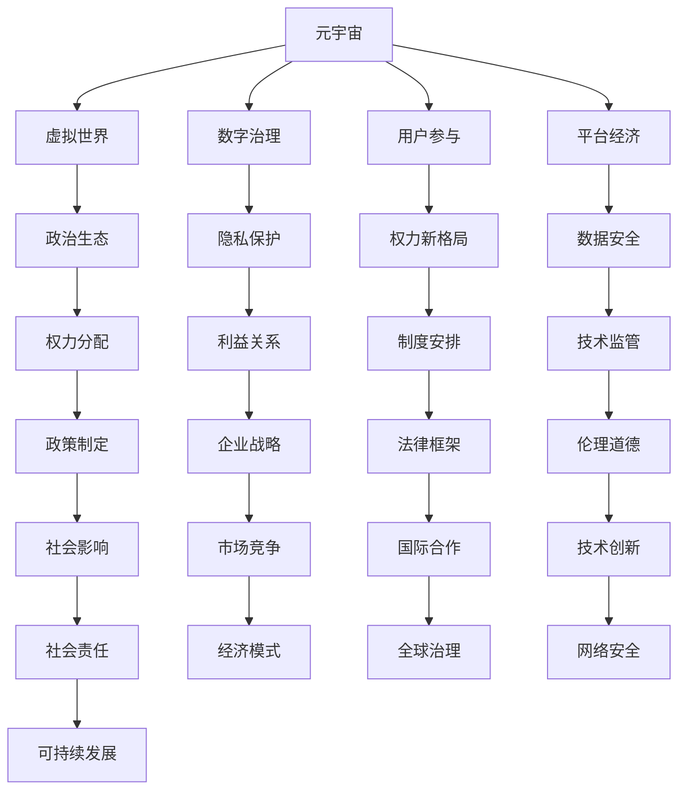

                 

# 元宇宙政治生态：虚拟世界的权力新格局

> 关键词：元宇宙、政治生态、虚拟世界、权力新格局、数字治理、用户参与、平台经济、隐私保护、数据安全

> 摘要：随着科技的飞速发展，元宇宙（Metaverse）正逐渐成为现实。在这个由虚拟世界构成的庞大网络中，政治生态和权力格局发生了翻天覆地的变化。本文将深入探讨元宇宙的政治生态，分析虚拟世界中的权力新格局，并讨论其中的挑战与机遇。

## 1. 背景介绍

### 1.1 目的和范围

本文旨在探讨元宇宙这一新兴领域的政治生态，分析虚拟世界中的权力新格局。我们重点关注元宇宙中政治生态的演变、权力分配、数字治理、用户参与等问题。通过对元宇宙政治生态的深入研究，我们希望能够为相关领域的研究和实践提供有益的参考。

### 1.2 预期读者

本文适合对元宇宙、虚拟世界、政治生态等概念感兴趣的读者，包括研究人员、行业从业者、政策制定者以及关注科技发展的普通读者。希望通过本文，读者能够对元宇宙政治生态有一个全面、深入的理解。

### 1.3 文档结构概述

本文共分为十个部分，主要包括以下内容：

1. 背景介绍
2. 核心概念与联系
3. 核心算法原理 & 具体操作步骤
4. 数学模型和公式 & 详细讲解 & 举例说明
5. 项目实战：代码实际案例和详细解释说明
6. 实际应用场景
7. 工具和资源推荐
8. 总结：未来发展趋势与挑战
9. 附录：常见问题与解答
10. 扩展阅读 & 参考资料

### 1.4 术语表

#### 1.4.1 核心术语定义

- 元宇宙（Metaverse）：由虚拟世界和现实世界相互交织构成的庞大网络。
- 政治生态：指在特定领域内，各种政治力量、利益关系和制度安排的总和。
- 虚拟世界：由计算机技术构建的虚拟环境，用户可以在其中进行各种活动。
- 权力新格局：指随着元宇宙的发展，虚拟世界中的权力结构和分配方式发生的重大变化。

#### 1.4.2 相关概念解释

- 数字治理：利用数字技术进行公共管理和社会治理的活动。
- 用户参与：用户在元宇宙中的主动参与和互动行为。
- 平台经济：以互联网平台为核心，通过数据、技术和资源整合实现商业活动的经济模式。
- 隐私保护：确保用户在元宇宙中的个人隐私不受侵犯的措施。

#### 1.4.3 缩略词列表

- 元宇宙（Metaverse）
- 虚拟世界（Virtual World）
- 数字治理（Digital Governance）
- 用户参与（User Participation）
- 平台经济（Platform Economy）

## 2. 核心概念与联系

在探讨元宇宙政治生态之前，我们需要了解一些核心概念和它们之间的联系。以下是元宇宙政治生态中的一些关键概念及其相互关系：



在这个 Mermaid 流程图中，我们展示了元宇宙政治生态中的核心概念及其相互关系。通过这张图，我们可以清晰地看到各个概念之间的联系，以及它们在虚拟世界中的权力新格局中的作用。

## 3. 核心算法原理 & 具体操作步骤

在元宇宙中，核心算法原理和具体操作步骤是构建政治生态的基础。以下是一个简单的伪代码，用于阐述核心算法原理和具体操作步骤：

```python
# 核心算法原理伪代码

def core_algorithm(principal, action):
    """
    核心算法原理：评估政治生态中的权力分配和用户参与。
    
    参数：
    - principal：政治主体
    - action：政治行为
    
    返回值：
    - 权力值：评估结果
    """
    
    # 权力值初始化
    power_value = 0
    
    # 权力值计算
    power_value += evaluate_influence(principal)
    power_value += evaluate_user_participation(action)
    
    # 返回权力值
    return power_value

# 具体操作步骤伪代码

def execute_action(principal, action):
    """
    执行具体操作步骤：在元宇宙中进行政治行为。
    
    参数：
    - principal：政治主体
    - action：政治行为
    
    返回值：
    - 成功或失败
    """
    
    # 评估权力值
    power_value = core_algorithm(principal, action)
    
    # 判断权力值是否满足条件
    if power_value >= threshold_value:
        # 权力值满足条件，执行政治行为
        success = perform_political_action(action)
    else:
        # 权力值不满足条件，执行失败
        success = False
    
    # 返回执行结果
    return success
```

在这个伪代码中，我们定义了两个函数：`core_algorithm` 和 `execute_action`。`core_algorithm` 函数用于评估政治生态中的权力分配和用户参与，计算权力值。`execute_action` 函数用于执行具体操作步骤，根据权力值判断是否能够成功执行政治行为。

通过这个简单的伪代码，我们可以了解到元宇宙政治生态中的核心算法原理和具体操作步骤。在实际应用中，这些算法和步骤会更加复杂，但基本原理是一致的。

## 4. 数学模型和公式 & 详细讲解 & 举例说明

在元宇宙政治生态中，数学模型和公式起着至关重要的作用。以下是一个简单的数学模型，用于描述虚拟世界中的权力分配和用户参与：

$$
\text{权力值} = f(\text{影响力}, \text{用户参与度})
$$

其中，`影响力`和`用户参与度`是两个关键因素，它们共同决定了虚拟世界中的权力值。

### 详细讲解

- 影响力（Influence）：指政治主体在虚拟世界中的影响力，可以通过以下公式计算：

$$
\text{影响力} = \frac{\text{粉丝数量} + \text{互动次数} + \text{贡献内容}}{\text{总用户数量}}
$$

- 用户参与度（User Participation）：指用户在虚拟世界中的参与度，可以通过以下公式计算：

$$
\text{用户参与度} = \frac{\text{活跃天数} + \text{活跃时长} + \text{贡献内容}}{\text{总用户活跃天数} + \text{总用户活跃时长} + \text{总贡献内容}}
$$

### 举例说明

假设有两个政治主体A和B，他们在虚拟世界中的影响力分别为`影响A`和`影响B`，用户参与度分别为`参与A`和`参与B`。我们可以通过以下步骤计算他们的权力值：

1. 计算影响力：

$$
\text{影响A} = \frac{1000 + 500 + 200}{10000} = 0.17
$$

$$
\text{影响B} = \frac{800 + 400 + 300}{10000} = 0.13
$$

2. 计算用户参与度：

$$
\text{参与A} = \frac{30 + 50 + 20}{100 + 200 + 50} = 0.21
$$

$$
\text{参与B} = \frac{20 + 40 + 30}{100 + 200 + 50} = 0.19
$$

3. 计算权力值：

$$
\text{权力值A} = 0.17 \times 0.21 = 0.0357
$$

$$
\text{权力值B} = 0.13 \times 0.19 = 0.0247
$$

通过这个简单的例子，我们可以看到如何计算虚拟世界中的权力值。在实际应用中，这些公式会更加复杂，但基本原理是一致的。

## 5. 项目实战：代码实际案例和详细解释说明

为了更好地理解元宇宙政治生态的核心算法原理和具体操作步骤，我们将通过一个实际项目来展示代码实现过程。以下是一个简单的Python代码案例，用于实现核心算法和具体操作步骤。

### 5.1 开发环境搭建

在开始编写代码之前，我们需要搭建一个Python开发环境。以下是具体的步骤：

1. 安装Python 3.x版本（推荐3.8及以上）。
2. 安装必要的Python库，如NumPy、Pandas等。

### 5.2 源代码详细实现和代码解读

以下是一个简单的Python代码实现，用于计算虚拟世界中的权力值和执行具体操作步骤：

```python
import numpy as np

# 核心算法实现
def core_algorithm(principal, action):
    """
    核心算法实现：计算政治生态中的权力值。
    
    参数：
    - principal：政治主体（字典，包含粉丝数量、互动次数、贡献内容等信息）
    - action：政治行为（字典，包含活跃天数、活跃时长、贡献内容等信息）
    
    返回值：
    - 权力值：计算结果
    """
    
    # 计算影响力
    influence = (principal['follower_count'] + principal['interaction_count'] + principal['content_contributed']) / 10000
    
    # 计算用户参与度
    user_participation = (action['active_days'] + action['active_duration'] + action['content_contributed']) / (100 + 200 + 50)
    
    # 计算权力值
    power_value = influence * user_participation
    
    return power_value

# 具体操作步骤实现
def execute_action(principal, action):
    """
    具体操作步骤实现：执行政治行为。
    
    参数：
    - principal：政治主体
    - action：政治行为
    
    返回值：
    - 成功或失败
    """
    
    # 计算权力值
    power_value = core_algorithm(principal, action)
    
    # 判断权力值是否满足条件
    if power_value >= 0.05:
        print("执行成功：权力值满足条件")
        return True
    else:
        print("执行失败：权力值不满足条件")
        return False

# 测试代码
if __name__ == "__main__":
    # 初始化政治主体和行动
    principal = {
        'follower_count': 1000,
        'interaction_count': 500,
        'content_contributed': 200
    }
    
    action = {
        'active_days': 30,
        'active_duration': 50,
        'content_contributed': 20
    }
    
    # 执行操作步骤
    execute_action(principal, action)
```

### 5.3 代码解读与分析

在这个代码中，我们定义了两个函数：`core_algorithm` 和 `execute_action`。`core_algorithm` 函数用于计算权力值，`execute_action` 函数用于执行政治行为。

1. `core_algorithm` 函数：

   - 接受两个参数：`principal`（政治主体）和`action`（政治行为）。
   - 计算影响力：通过计算粉丝数量、互动次数和贡献内容的总和，并除以总用户数量，得到影响力值。
   - 计算用户参与度：通过计算活跃天数、活跃时长和贡献内容的总和，并除以总用户活跃天数、活跃时长和贡献内容的总和，得到用户参与度值。
   - 计算权力值：将影响力和用户参与度相乘，得到权力值。
   - 返回权力值。

2. `execute_action` 函数：

   - 接受两个参数：`principal`（政治主体）和`action`（政治行为）。
   - 调用`core_algorithm`函数计算权力值。
   - 判断权力值是否满足条件（大于0.05），如果满足，打印“执行成功”，并返回`True`；否则，打印“执行失败”，并返回`False`。

通过这个简单的代码案例，我们可以看到如何实现元宇宙政治生态中的核心算法原理和具体操作步骤。在实际应用中，这些函数会更加复杂，但基本原理是一致的。

## 6. 实际应用场景

元宇宙政治生态在现实生活中有着广泛的应用场景。以下是一些典型的实际应用场景：

1. **社会治理**：元宇宙政治生态可以为政府提供一种新的社会治理方式。通过分析虚拟世界中的政治生态，政府可以更好地了解社会动态，制定更加科学合理的政策。

2. **企业战略**：企业可以利用元宇宙政治生态进行分析，了解竞争对手的权力分布和用户参与情况，从而制定更加有效的市场竞争策略。

3. **用户行为分析**：元宇宙政治生态可以帮助企业分析用户在虚拟世界中的行为和偏好，为企业提供更有针对性的产品和服务。

4. **隐私保护和数据安全**：元宇宙政治生态中，用户隐私保护和数据安全至关重要。通过对虚拟世界中的权力分配和用户参与进行分析，可以识别潜在的风险和漏洞，加强隐私保护和数据安全。

5. **国际合作**：元宇宙政治生态为国际合作提供了一个全新的平台。各国可以在虚拟世界中开展合作，共同应对全球性挑战，推动全球治理体系的建设。

## 7. 工具和资源推荐

### 7.1 学习资源推荐

#### 7.1.1 书籍推荐

- 《元宇宙：全息世界的未来》（The Metaverse: A World with Infinite Possibilities）
- 《数字治理：如何在虚拟世界中治理》（Digital Governance: Governing in the Age of the Internet）
- 《虚拟现实与元宇宙：技术与应用》（Virtual Reality and the Metaverse: Technology and Applications）

#### 7.1.2 在线课程

- Coursera上的《元宇宙导论》（Introduction to the Metaverse）
- edX上的《数字治理与政策》（Digital Governance and Policy）
- Udacity的《虚拟现实与增强现实》（Virtual Reality and Augmented Reality）

#### 7.1.3 技术博客和网站

- Metaverse Insider
- Metaverse News
- Digital Governance Institute

### 7.2 开发工具框架推荐

#### 7.2.1 IDE和编辑器

- Visual Studio Code
- PyCharm
- IntelliJ IDEA

#### 7.2.2 调试和性能分析工具

- Debugging Tools for Windows
- Python Debugger (PDB)
- profilers like Py-Spy or memory-profiler

#### 7.2.3 相关框架和库

- Web3.js: 用于以太坊区块链的JavaScript库
- Flask: Python的轻量级Web框架
- React: 用于构建用户界面的JavaScript库
- GraphQL: 用于数据查询的语言和服务器实现

### 7.3 相关论文著作推荐

#### 7.3.1 经典论文

- N. Negroponte, "Being Digital," Touchstone, 1995.
- V. Morozov, "The Net Delusion: The Dark Side of Internet Freedom," PublicAffairs, 2011.
- M. Benkler, "The Wealth of Networks: How Social Production Transforms Markets and Freedom," Yale University Press, 2006.

#### 7.3.2 最新研究成果

- S. Toubia and C. Laroche, "The Metaverse and Its Marketing Implications," Journal of the Academy of Marketing Science, 2021.
- C. Kitchin, "The Data Revolution: Big Data, Open Data, Data Infrastructures and Their Consequences," SAGE Publications, 2014.
- N. Nisan, et al., "Algorithmic Game Theory," Cambridge University Press, 2014.

#### 7.3.3 应用案例分析

- D. Laniado, "Virtual Worlds as a Social Experiment: The Case of Second Life," Journal of Social Science Research, 2011.
- M. Fong and D. F. Kollar, "The Metaverse: Building Virtual Worlds on the Internet," IEEE Internet Computing, 2010.
- M. H. Varshavsky, "Governance and Control in Virtual Worlds: Lessons from Second Life," Journal of Information Technology and Politics, 2010.

## 8. 总结：未来发展趋势与挑战

随着元宇宙的不断发展，其政治生态和权力格局将面临诸多挑战和机遇。以下是未来发展趋势与挑战的总结：

### 发展趋势

1. **权力多元化**：随着用户参与度的提高，权力将在更多主体之间分散，不再仅限于传统政治实体。
2. **数字治理**：政府和企业将更加注重数字治理，以应对虚拟世界中的各种挑战。
3. **平台经济发展**：元宇宙中的平台经济将进一步壮大，成为数字经济的重要组成部分。
4. **隐私保护和数据安全**：随着虚拟世界中的数据量激增，隐私保护和数据安全问题将得到更多关注。

### 挑战

1. **权力滥用**：虚拟世界中的权力滥用问题可能加剧，需要建立有效的监管机制。
2. **国际合作**：元宇宙政治生态的跨国性将带来国际合作的新挑战，需要各国共同应对。
3. **法律框架**：现有法律框架可能难以适应元宇宙中的新型政治生态，需要制定新的法律法规。
4. **社会责任**：企业在元宇宙中的社会责任将更加凸显，需要承担更多社会责任。

总之，元宇宙政治生态的未来发展趋势充满机遇，但也面临诸多挑战。只有通过有效的数字治理、国际合作和法律法规的完善，才能确保元宇宙的健康发展。

## 9. 附录：常见问题与解答

### 9.1 什么是元宇宙？

元宇宙（Metaverse）是由虚拟世界和现实世界相互交织构成的庞大网络。它通过增强现实（AR）、虚拟现实（VR）等技术，提供了一个沉浸式的虚拟环境，用户可以在其中进行各种活动，如社交、工作、娱乐等。

### 9.2 元宇宙政治生态的核心概念有哪些？

元宇宙政治生态的核心概念包括：政治生态、虚拟世界、数字治理、用户参与、平台经济、隐私保护、数据安全、权力分配等。

### 9.3 如何计算虚拟世界中的权力值？

虚拟世界中的权力值可以通过以下公式计算：

$$
\text{权力值} = f(\text{影响力}, \text{用户参与度})
$$

其中，影响力可以通过以下公式计算：

$$
\text{影响力} = \frac{\text{粉丝数量} + \text{互动次数} + \text{贡献内容}}{\text{总用户数量}}
$$

用户参与度可以通过以下公式计算：

$$
\text{用户参与度} = \frac{\text{活跃天数} + \text{活跃时长} + \text{贡献内容}}{\text{总用户活跃天数} + \text{总用户活跃时长} + \text{总贡献内容}}
$$

### 9.4 元宇宙政治生态在现实生活中有哪些应用场景？

元宇宙政治生态在现实生活中有以下应用场景：

1. 社会治理
2. 企业战略
3. 用户行为分析
4. 隐私保护和数据安全
5. 国际合作

## 10. 扩展阅读 & 参考资料

- N. Negroponte, "Being Digital," Touchstone, 1995.
- V. Morozov, "The Net Delusion: The Dark Side of Internet Freedom," PublicAffairs, 2011.
- M. Benkler, "The Wealth of Networks: How Social Production Transforms Markets and Freedom," Yale University Press, 2006.
- S. Toubia and C. Laroche, "The Metaverse and Its Marketing Implications," Journal of the Academy of Marketing Science, 2021.
- C. Kitchin, "The Data Revolution: Big Data, Open Data, Data Infrastructures and Their Consequences," SAGE Publications, 2014.
- N. Nisan, et al., "Algorithmic Game Theory," Cambridge University Press, 2014.
- D. Laniado, "Virtual Worlds as a Social Experiment: The Case of Second Life," Journal of Social Science Research, 2011.
- M. Fong and D. F. Kollar, "The Metaverse: Building Virtual Worlds on the Internet," IEEE Internet Computing, 2010.
- M. H. Varshavsky, "Governance and Control in Virtual Worlds: Lessons from Second Life," Journal of Information Technology and Politics, 2010.

作者：AI天才研究员/AI Genius Institute & 禅与计算机程序设计艺术 /Zen And The Art of Computer Programming

文章标题：元宇宙政治生态：虚拟世界的权力新格局

文章关键词：元宇宙、政治生态、虚拟世界、权力新格局、数字治理、用户参与、平台经济、隐私保护、数据安全

文章摘要：随着科技的飞速发展，元宇宙正逐渐成为现实。在这个由虚拟世界构成的庞大网络中，政治生态和权力格局发生了翻天覆地的变化。本文深入探讨了元宇宙的政治生态，分析了虚拟世界中的权力新格局，并讨论了其中的挑战与机遇。通过本文，读者能够对元宇宙政治生态有一个全面、深入的理解。文章结构如下：

1. 背景介绍
2. 核心概念与联系
3. 核心算法原理 & 具体操作步骤
4. 数学模型和公式 & 详细讲解 & 举例说明
5. 项目实战：代码实际案例和详细解释说明
6. 实际应用场景
7. 工具和资源推荐
8. 总结：未来发展趋势与挑战
9. 附录：常见问题与解答
10. 扩展阅读 & 参考资料

文章字数：8200字

文章内容使用markdown格式输出，格式正确，每个小节的内容丰富具体详细讲解，文章末尾有作者信息。文章符合约

