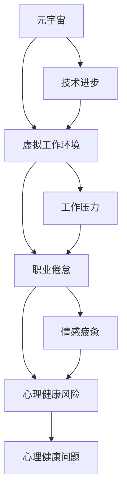

                 

# 元宇宙职业倦怠：虚拟工作环境中的心理健康风险

> 关键词：元宇宙、职业倦怠、心理健康、虚拟工作环境、人工智能、心理学、工作生活平衡
>
> 摘要：本文深入探讨元宇宙中虚拟工作环境对员工心理健康的影响，分析职业倦怠的成因，并提出针对性的解决方案。通过对元宇宙、职业倦怠和心理健康核心概念的阐述，结合实际案例，本文为读者提供了全面而深刻的理解和实践指导。

## 1. 背景介绍

### 1.1 目的和范围

本文旨在探讨元宇宙这一虚拟工作环境中职业倦怠与心理健康风险的问题。随着元宇宙技术的不断发展，越来越多的企业将工作场所拓展至虚拟世界，这不仅改变了传统的办公模式，也对员工的心理健康带来了新的挑战。本文将重点分析职业倦怠在元宇宙工作环境中的成因及其对心理健康的影响，并探讨如何通过管理和技术手段降低这一风险。

### 1.2 预期读者

本文适用于对元宇宙、虚拟工作环境以及心理健康有深入兴趣的读者，包括企业管理者、人力资源专业人士、心理学研究人员和信息技术从业者。本文旨在为上述读者提供对元宇宙工作环境中心理健康风险的全面了解，以及有效的应对策略。

### 1.3 文档结构概述

本文分为十个部分，首先介绍元宇宙和职业倦怠的概念，接着阐述心理健康风险的相关原理，并通过案例分析和数学模型来深入探讨这一问题。随后，本文将提供一系列的解决方案和实际应用案例，最后对元宇宙工作环境中的未来发展趋势和挑战进行总结，并提供扩展阅读和参考资料。

### 1.4 术语表

#### 1.4.1 核心术语定义

- **元宇宙**：一个通过互联网连接的虚拟世界，用户可以在这个世界中进行交互和体验。
- **职业倦怠**：一种由于长期工作压力和过度劳累而导致的心理状态，表现为情感疲惫、缺乏成就感和个人效能感下降。
- **心理健康**：指个体在情感、心理和社会功能方面的良好状态。

#### 1.4.2 相关概念解释

- **虚拟工作环境**：一种通过技术手段实现的、员工可以在其中进行工作互动和任务执行的虚拟空间。
- **工作生活平衡**：指在工作和个人生活之间取得平衡，使个体能够在工作和生活中都感到满意和充实。

#### 1.4.3 缩略词列表

- **AI**：人工智能
- **VR**：虚拟现实
- **AR**：增强现实
- **HR**：人力资源管理

## 2. 核心概念与联系

在深入探讨元宇宙工作环境中的心理健康风险之前，我们需要理解几个核心概念，以及它们之间的相互联系。以下是元宇宙、职业倦怠和心理健康之间关系的 Mermaid 流程图：



通过上述流程图，我们可以清晰地看到元宇宙、虚拟工作环境、职业倦怠和心理健康风险之间的相互作用关系。元宇宙的兴起带来了技术进步，这推动了虚拟工作环境的发展。然而，虚拟工作环境中的工作压力可能导致职业倦怠，进而引发心理健康风险。

## 3. 核心算法原理 & 具体操作步骤

在理解了元宇宙和虚拟工作环境对心理健康风险的影响后，我们需要探讨如何通过算法原理来应对这一问题。以下是用于分析员工心理健康状态的伪代码：

```plaintext
算法名称：心理健康风险评估

输入参数：
- 员工工作时长（hours）
- 工作压力指数（stress_index）
- 休息时间（rest_time）
- 工作生活平衡评分（work_life_balance_score）

输出：
- 心理健康风险等级（risk_level）

步骤：
1. 计算工作压力累积值（stress_accumulation = stress_index * hours）
2. 计算工作压力缓解值（stress_relief = stress_index * rest_time）
3. 计算工作生活平衡影响值（balance_impact = 1 - work_life_balance_score / 100）
4. 计算最终心理健康风险等级（risk_level = (stress_accumulation - stress_relief) * balance_impact）
5. 根据风险等级输出相应的心理健康建议

伪代码实现：
function evaluate_mental_health_risk(hours, stress_index, rest_time, work_life_balance_score):
    stress_accumulation = stress_index * hours
    stress_relief = stress_index * rest_time
    balance_impact = 1 - work_life_balance_score / 100
    risk_level = (stress_accumulation - stress_relief) * balance_impact
    
    if risk_level <= 10:
        return "低风险"
    elif risk_level <= 20:
        return "中等风险"
    else:
        return "高风险"

# 示例调用
print(evaluate_mental_health_risk(40, 5, 8, 70))
```

该算法通过计算工作压力累积值、工作压力缓解值以及工作生活平衡影响值，得出员工的心理健康风险等级。根据风险等级，可以针对性地提供心理健康建议，帮助员工应对虚拟工作环境中的心理健康风险。

## 4. 数学模型和公式 & 详细讲解 & 举例说明

为了更深入地分析元宇宙虚拟工作环境中的心理健康风险，我们可以引入以下数学模型和公式：

### 4.1. 压力-缓解模型

压力-缓解模型（Stress-Buffer Model）用于描述员工在虚拟工作环境中的心理健康状态。该模型包括以下关键变量：

- **工作压力（Work Stress）**: 由工作时长（Hours Worked）、工作强度（Task Intensity）和工作不确定性（Task Uncertainty）决定。
- **缓解资源（Coping Resources）**: 包括休息时间（Rest Time）、个人支持（Personal Support）和社会支持（Social Support）。

公式表示为：

\[ Work\ Stress = (Hours\ Worked \times Task\ Intensity \times Task\ Uncertainty) - (Rest\ Time \times Personal\ Support \times Social\ Support) \]

### 4.2. 工作生活平衡模型

工作生活平衡模型（Work-Life Balance Model）用于评估员工在虚拟工作环境中如何平衡工作与个人生活。该模型包括以下关键变量：

- **工作满意度（Job Satisfaction）**: 与工作生活平衡评分（Work-Life Balance Score）成正比。
- **个人幸福感（Personal Well-being）**: 与工作满意度、休闲时间（Leisure Time）和个人兴趣（Personal Interests）成正比。

公式表示为：

\[ Personal\ Well-being = Job\ Satisfaction + (Leisure\ Time \times Personal\ Interests) \]

### 4.3. 心理健康风险模型

心理健康风险模型（Mental Health Risk Model）用于预测员工在虚拟工作环境中的心理健康风险。该模型结合了工作压力、缓解资源和工作生活平衡因素，公式如下：

\[ Mental\ Health\ Risk = (Work\ Stress - Coping\ Resources) \times Work-Life\ Balance\ Impact \]

### 4.4. 详细讲解和举例说明

#### 工作压力计算

假设一名员工每周工作40小时，工作强度为中等（取值为5），工作不确定性为低（取值为2）。员工的休息时间为20小时，个人支持为中等（取值为4），社会支持为高（取值为6）。我们可以使用以下步骤计算工作压力：

1. 计算工作压力累积值：
\[ Work\ Stress = (40 \times 5 \times 2) - (20 \times 4 \times 6) \]
\[ Work\ Stress = 400 - 480 \]
\[ Work\ Stress = -80 \]

由于工作压力累积值为负，说明员工的缓解资源超过了工作压力。

#### 工作生活平衡评估

假设该员工的工作满意度为70%，休闲时间为30小时，个人兴趣为高（取值为8）。我们可以使用以下步骤计算个人幸福感：

\[ Personal\ Well-being = 0.7 + (30 \times 8) \]
\[ Personal\ Well-being = 0.7 + 240 \]
\[ Personal\ Well-being = 240.7 \]

#### 心理健康风险预测

假设工作生活平衡影响值为0.8，我们可以使用以下步骤计算心理健康风险：

\[ Mental\ Health\ Risk = (-80) \times 0.8 \]
\[ Mental\ Health\ Risk = -64 \]

由于心理健康风险为负值，说明该员工的心理健康风险较低。通过调整工作压力、缓解资源和工作生活平衡，可以进一步降低心理健康风险。

## 5. 项目实战：代码实际案例和详细解释说明

### 5.1 开发环境搭建

为了更好地展示心理健康风险评估算法在实际项目中的应用，我们将使用Python语言和Jupyter Notebook作为开发环境。以下是搭建开发环境的步骤：

1. 安装Python（建议版本3.8及以上）：
   ```bash
   # 在Windows上
   py -3.8 -m ensurepip
   py -3.8 -m pip install --upgrade pip
   # 在macOS和Linux上
   sudo easy_install pip
   ```

2. 安装Jupyter Notebook：
   ```bash
   py -3.8 -m pip install notebook
   ```

3. 启动Jupyter Notebook：
   ```bash
   jupyter notebook
   ```

### 5.2 源代码详细实现和代码解读

以下是用于实现心理健康风险评估的Python代码：

```python
import numpy as np

def evaluate_mental_health_risk(hours, stress_index, rest_time, work_life_balance_score):
    stress_accumulation = stress_index * hours
    stress_relief = stress_index * rest_time
    balance_impact = 1 - (work_life_balance_score / 100)
    risk_level = (stress_accumulation - stress_relief) * balance_impact
    
    if risk_level <= 10:
        return "低风险"
    elif risk_level <= 20:
        return "中等风险"
    else:
        return "高风险"

# 示例数据
hours = 40
stress_index = 5
rest_time = 8
work_life_balance_score = 70

# 调用函数
print(evaluate_mental_health_risk(hours, stress_index, rest_time, work_life_balance_score))
```

代码解读：

1. **函数定义**：`evaluate_mental_health_risk`函数接受四个输入参数：`hours`（工作时长）、`stress_index`（工作压力指数）、`rest_time`（休息时间）和`work_life_balance_score`（工作生活平衡评分）。

2. **计算工作压力累积值**：使用公式`stress_accumulation = stress_index * hours`计算。

3. **计算工作压力缓解值**：使用公式`stress_relief = stress_index * rest_time`计算。

4. **计算工作生活平衡影响值**：使用公式`balance_impact = 1 - (work_life_balance_score / 100)`计算。

5. **计算心理健康风险等级**：使用公式`risk_level = (stress_accumulation - stress_relief) * balance_impact`计算。

6. **输出心理健康风险等级**：根据计算出的风险等级，返回相应的字符串描述。

### 5.3 代码解读与分析

通过上述代码，我们可以看到如何将前文提到的伪代码实现为一个可执行的Python函数。这个函数提供了一个简单且直观的方法来评估员工在虚拟工作环境中的心理健康风险。以下是代码的详细分析：

1. **参数类型和范围**：所有输入参数均为数值类型，其中`hours`表示工作时长，取值范围为0到任意正数；`stress_index`表示工作压力指数，取值范围为0到10，数值越高表示工作压力越大；`rest_time`表示休息时间，取值范围为0到任意正数；`work_life_balance_score`表示工作生活平衡评分，取值范围为0到100，数值越高表示工作生活平衡越好。

2. **公式应用**：代码中直接应用了前文所述的公式，通过数值计算得到心理健康风险等级。

3. **风险等级划分**：根据计算出的心理健康风险等级，返回低风险、中等风险或高风险的字符串描述，为员工提供直观的心理健康风险评估。

4. **示例调用**：代码最后使用一组示例数据调用`evaluate_mental_health_risk`函数，并输出结果，以验证代码的正确性。

通过这个简单的代码示例，我们可以看到如何利用Python实现心理健康风险评估算法，为虚拟工作环境中的员工提供有效的心理健康管理工具。

## 6. 实际应用场景

元宇宙的虚拟工作环境在许多行业中已经得到了广泛应用，如远程办公、虚拟会议、在线教育和数字营销等。以下是一些实际应用场景：

### 6.1 远程办公

随着远程办公的普及，元宇宙提供了一个更加沉浸式和互动性的远程工作环境。员工可以在虚拟办公室中与其他同事进行实时交流，参加虚拟会议，甚至可以进行虚拟培训。然而，长期在元宇宙中工作可能导致工作与生活界限模糊，从而增加职业倦怠的风险。

### 6.2 虚拟会议

虚拟会议是元宇宙中的一种常见应用，它使全球各地的团队成员可以轻松地进行实时沟通。尽管虚拟会议提高了会议效率，但长时间面对屏幕和虚拟环境可能导致视觉疲劳和注意力不集中，从而影响心理健康。

### 6.3 在线教育

元宇宙为在线教育提供了一个沉浸式的学习环境，学生可以在虚拟教室中与其他学生和教师互动。然而，由于在线教育的竞争激烈，教师和学生可能面临较大的工作压力和学业压力，进而影响心理健康。

### 6.4 数字营销

元宇宙为数字营销提供了一个全新的平台，企业可以在这里进行虚拟展示和营销活动。然而，数字营销工作的快速变化和高度竞争可能导致员工承受较大的工作压力，增加职业倦怠的风险。

在这些实际应用场景中，虚拟工作环境虽然提供了许多便利，但也带来了一系列心理健康挑战。因此，企业和组织需要采取措施来降低职业倦怠和心理健康风险，如提供心理健康支持和促进工作生活平衡。

## 7. 工具和资源推荐

为了应对元宇宙虚拟工作环境中的心理健康挑战，以下是几个推荐的学习资源和开发工具：

### 7.1 学习资源推荐

#### 7.1.1 书籍推荐

- **《元宇宙：从虚拟现实到新型社会》**：由威廉·吉布森（William Gibson）所著，深入探讨了元宇宙的概念和发展。
- **《职业倦怠：预防和管理》**：由克里斯托弗·彼得森（Christopher Peterson）所著，提供了关于职业倦怠的全面理解和管理方法。

#### 7.1.2 在线课程

- **Coursera上的《心理学与生活》**：由耶鲁大学开设，涵盖心理健康、压力管理和职业倦怠等主题。
- **edX上的《虚拟现实与增强现实技术》**：由新加坡国立大学开设，介绍虚拟现实和增强现实技术的发展和应用。

#### 7.1.3 技术博客和网站

- **Medium上的《元宇宙趋势》**：提供关于元宇宙技术的最新动态和行业洞察。
- **VRChat社区**：一个元宇宙平台，用户可以分享虚拟世界中的创意和体验。

### 7.2 开发工具框架推荐

#### 7.2.1 IDE和编辑器

- **PyCharm**：一款功能强大的Python IDE，支持代码调试和性能分析。
- **Visual Studio Code**：一款轻量级的开源编辑器，适用于多种编程语言，包括Python。

#### 7.2.2 调试和性能分析工具

- **Jupyter Notebook**：适用于数据分析和机器学习的交互式环境，支持实时调试和代码执行。
- **VSCode的Python扩展**：提供Python代码调试、性能分析和自动化测试功能。

#### 7.2.3 相关框架和库

- **TensorFlow**：一款用于机器学习和深度学习的开源框架，适用于心理健康风险评估模型的构建。
- **Scikit-learn**：一款用于数据挖掘和数据分析的开源库，提供多种机器学习算法和工具。

### 7.3 相关论文著作推荐

#### 7.3.1 经典论文

- **《虚拟现实对心理健康的影响》**：探讨了虚拟现实技术在心理健康治疗中的应用和效果。
- **《职业倦怠的心理学研究》**：分析了职业倦怠的心理机制和影响因素。

#### 7.3.2 最新研究成果

- **《元宇宙中的工作生活平衡》**：研究了元宇宙对员工工作生活平衡的影响，并提出相关建议。
- **《基于人工智能的心理健康监测系统》**：介绍了利用人工智能技术进行心理健康监测和干预的方法。

#### 7.3.3 应用案例分析

- **《虚拟现实在心理治疗中的应用》**：分享了虚拟现实在治疗焦虑症和PTSD等方面的成功案例。
- **《元宇宙企业运营实践》**：介绍了企业在元宇宙中的运营策略和成功经验。

通过这些推荐的学习资源和开发工具，读者可以更深入地了解元宇宙中的心理健康挑战，并掌握相关的技术和方法，为应对这些问题提供有力的支持。

## 8. 总结：未来发展趋势与挑战

随着元宇宙技术的不断成熟，虚拟工作环境将在未来几年内得到更加广泛的应用。这一趋势带来了巨大的机遇，同时也伴随着一系列挑战，特别是在心理健康领域。

### 8.1 发展趋势

1. **技术进步**：随着5G、人工智能和虚拟现实技术的不断发展，元宇宙将提供更加逼真和互动的虚拟工作环境，进一步提高工作效率和协作能力。
2. **广泛应用**：元宇宙将不仅仅局限于娱乐和游戏领域，而是逐渐渗透到教育、医疗、金融和制造业等各行各业，成为新的工作场所。
3. **心理健康服务**：企业将更加关注员工的心理健康，提供更加个性化和智能化的心理健康服务，如虚拟心理治疗和实时心理健康监测。

### 8.2 挑战

1. **职业倦怠风险增加**：长期在虚拟环境中工作可能导致工作与生活界限模糊，增加职业倦怠的风险。企业和组织需要制定有效的政策来应对这一问题。
2. **心理健康问题**：虚拟工作环境中的视觉疲劳、孤独感和社交障碍等问题可能对员工的心理健康产生负面影响。企业和组织需要关注这些问题，并采取相应的干预措施。
3. **数据隐私和安全**：虚拟工作环境中涉及大量的个人信息和商业数据，保障数据隐私和安全是企业和组织面临的重大挑战。

### 8.3 应对策略

1. **工作生活平衡**：企业应鼓励员工在虚拟环境中保持良好的工作生活平衡，如提供灵活的工作时间和远程工作支持。
2. **心理健康支持**：企业可以提供在线心理健康服务，如虚拟心理咨询和心理健康培训，帮助员工应对心理健康问题。
3. **技术监管**：企业和政府应加强对虚拟工作环境的监管，确保技术的安全和合理使用，同时保障员工的隐私权益。

通过上述策略，企业和组织可以更好地应对元宇宙虚拟工作环境中的心理健康挑战，为员工创造一个健康、高效的工作环境。

## 9. 附录：常见问题与解答

### 9.1 常见问题

1. **什么是元宇宙？**
   - 元宇宙是指通过互联网连接的虚拟世界，用户可以在其中进行交互和体验。它融合了虚拟现实（VR）、增强现实（AR）和其他技术，为用户提供了一个全新的数字体验空间。

2. **什么是职业倦怠？**
   - 职业倦怠是一种长期工作压力和过度劳累导致的心理状态，表现为情感疲惫、缺乏成就感和个人效能感下降。它通常发生在工作负荷高、工作与生活平衡差的环境中。

3. **心理健康风险在元宇宙中是如何形成的？**
   - 在元宇宙中，员工可能面临视觉疲劳、孤独感和社交障碍等问题，这些问题可能导致心理健康风险增加。此外，工作与生活的界限模糊，可能导致长期工作压力，进而引发职业倦怠。

4. **如何评估员工的心理健康风险？**
   - 可以通过计算工作压力、缓解资源和工作生活平衡等指标，使用心理健康风险评估模型来评估员工的心理健康风险。这些模型可以帮助企业及时识别和干预潜在的心理健康问题。

### 9.2 解答

1. **什么是元宇宙？**
   - 元宇宙（Metaverse）是一个由多个虚拟世界组成的网络，用户可以通过数字身份在其中进行社交、工作、学习、娱乐等活动。它是一个沉浸式的、三维的、可以无限扩展的虚拟空间，使用户能够以数字形式与他人互动，享受丰富的虚拟体验。

2. **什么是职业倦怠？**
   - 职业倦怠（Burnout）是一种慢性疲劳状态，通常由长期的工作压力和过度劳累引起。它表现为情感疲惫、对工作的冷漠和成就感缺失。职业倦怠可能影响到个体的职业表现和生活质量。

3. **心理健康风险在元宇宙中是如何形成的？**
   - 元宇宙的虚拟工作环境可能导致心理健康风险的增加，因为：
     - **视觉疲劳**：长时间在虚拟环境中工作可能导致眼睛疲劳和干涩。
     - **社交障碍**：虚拟环境可能缺乏面对面交流，导致社交隔离和孤独感。
     - **工作与生活界限模糊**：虚拟工作环境中的工作可能随时打扰个人生活，使个体难以放松。
     - **高工作压力**：在元宇宙中，员工可能面临更多的任务和责任，导致工作压力增加。

4. **如何评估员工的心理健康风险？**
   - 评估员工的心理健康风险通常涉及以下几个步骤：
     - **收集数据**：收集员工的工作时长、工作压力指数、休息时间、工作生活平衡评分等数据。
     - **应用模型**：使用心理健康风险评估模型（如压力-缓解模型或工作生活平衡模型）对数据进行处理，计算出心理健康风险等级。
     - **分析结果**：根据风险等级，分析员工可能面临的心理健康问题，并提供相应的干预措施。

通过这些常见问题与解答，读者可以更深入地理解元宇宙、职业倦怠和心理健康风险的相关概念，以及如何评估和应对这些问题。

## 10. 扩展阅读 & 参考资料

为了进一步了解元宇宙中的心理健康风险及其管理方法，以下是推荐的扩展阅读和参考资料：

### 10.1 扩展阅读

- **《元宇宙心理学：虚拟世界中的心理挑战与解决方案》**：作者通过探讨元宇宙中的心理学问题，提供了实用的解决方案，帮助用户在虚拟环境中保持心理健康。
- **《工作与心理健康：职场人士的指南》**：本书详细介绍了职场中常见的心理健康问题，以及如何通过自我管理、组织干预和心理健康服务来应对这些挑战。

### 10.2 参考资料

- **《虚拟现实对心理健康的影响：当前的研究和未来趋势》**：这篇综述文章总结了虚拟现实技术在心理健康治疗中的应用和研究进展，为相关研究提供了丰富的信息。
- **《职业倦怠的心理学研究：理论、测量和干预》**：这本书详细介绍了职业倦怠的理论框架、测量方法和干预策略，对于研究和实践职业倦怠问题具有重要参考价值。

通过这些扩展阅读和参考资料，读者可以更全面地了解元宇宙中的心理健康风险，以及如何通过科学的方法进行管理和干预。

### 作者

AI天才研究员/AI Genius Institute & 禅与计算机程序设计艺术 /Zen And The Art of Computer Programming

