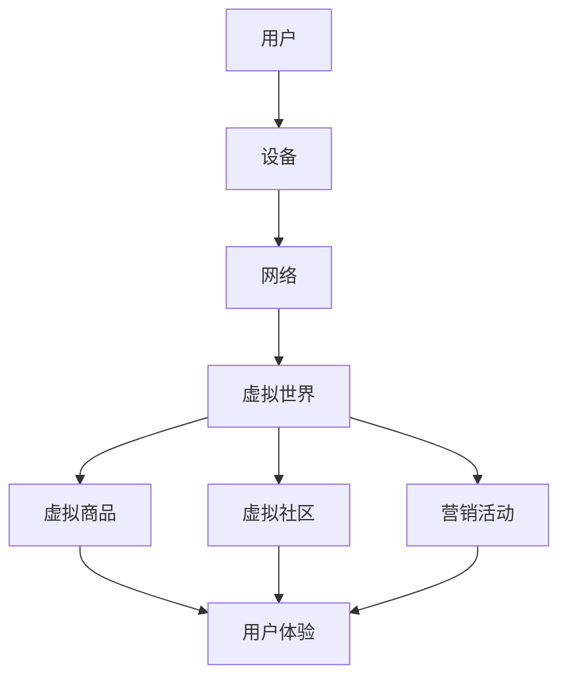
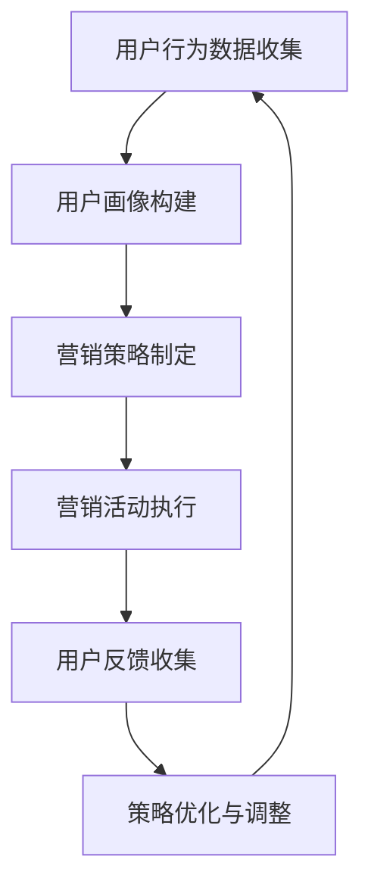

                 

# 元宇宙营销：数字化品牌建设新阵地

> **关键词**：元宇宙、营销、数字化品牌、虚拟现实、用户参与、增强现实、数据分析、用户体验、营销策略
>
> **摘要**：本文将深入探讨元宇宙营销的概念及其在数字化品牌建设中的重要性。我们将从背景介绍、核心概念与联系、算法原理、数学模型、项目实战、实际应用场景、工具和资源推荐以及未来发展趋势与挑战等方面展开讨论，旨在为企业和品牌提供一种全新的营销视角和策略。

## 1. 背景介绍

### 1.1 目的和范围

随着虚拟现实（VR）和增强现实（AR）技术的发展，元宇宙这一概念逐渐进入公众视野。元宇宙是一种虚拟的三维空间，用户可以在其中进行互动、交流和消费。本文的目的在于探讨元宇宙营销的原理和实践，帮助企业和品牌在数字化时代中建立强大的品牌形象。

本文将涵盖以下几个主要方面：

1. 元宇宙营销的基本概念和原理。
2. 元宇宙在数字化品牌建设中的作用和优势。
3. 元宇宙营销的算法原理和具体操作步骤。
4. 元宇宙营销的数学模型和公式。
5. 实际案例分析和应用场景。
6. 元宇宙营销所需的工具和资源。
7. 元宇宙营销的未来发展趋势和挑战。

### 1.2 预期读者

本文的预期读者主要包括以下几类：

1. 市场营销专业人士：对元宇宙营销感兴趣，希望了解这一新兴领域的最新动态和实践。
2. 企业高管和品牌经理：希望利用元宇宙营销策略提升品牌知名度和用户参与度。
3. 技术开发人员：对元宇宙的技术实现和算法原理感兴趣，希望将其应用于实际项目中。
4. 学生和研究者：对元宇宙营销和数字化品牌建设相关学术研究感兴趣。

### 1.3 文档结构概述

本文将按照以下结构进行组织和阐述：

1. 引言：介绍元宇宙营销的概念及其在数字化品牌建设中的重要性。
2. 背景介绍：详细阐述元宇宙的发展历程、技术基础和市场营销的趋势。
3. 核心概念与联系：讨论元宇宙营销中的核心概念和关键联系。
4. 核心算法原理 & 具体操作步骤：分析元宇宙营销的关键算法和操作步骤。
5. 数学模型和公式：介绍元宇宙营销的数学模型和公式，并进行详细讲解。
6. 项目实战：通过实际案例展示元宇宙营销的实施过程和效果。
7. 实际应用场景：分析元宇宙营销在不同行业和领域的应用。
8. 工具和资源推荐：推荐用于元宇宙营销的学习资源、开发工具和框架。
9. 总结：总结元宇宙营销的核心要点和未来发展趋势。
10. 附录：常见问题与解答，提供进一步的技术支持和学习资源。

### 1.4 术语表

#### 1.4.1 核心术语定义

- **元宇宙**：一种虚拟的三维空间，用户可以在其中进行互动、交流和消费。
- **虚拟现实（VR）**：一种通过计算机技术生成的三维仿真环境，用户可以沉浸其中。
- **增强现实（AR）**：将虚拟信息与现实世界融合，增强用户对现实世界的感知。
- **用户参与**：用户在元宇宙中的互动和活动，包括游戏、社交、购物等。
- **数据分析**：通过对用户行为和互动数据的分析，了解用户需求和偏好。
- **用户体验**（UX）：用户在元宇宙中的整体感受和体验。
- **营销策略**：企业或品牌在元宇宙中实施的一系列营销活动和计划。

#### 1.4.2 相关概念解释

- **数字品牌**：在数字化时代中，通过在线平台和数字技术建立的品牌形象和声誉。
- **虚拟商品**：在元宇宙中可以购买和交换的数字产品，如虚拟服饰、道具等。
- **虚拟社区**：用户在元宇宙中的社交空间，可以进行交流、分享和互动。
- **虚拟体验**：用户在元宇宙中参与的各种活动和体验，如虚拟旅游、虚拟教育等。

#### 1.4.3 缩略词列表

- **VR**：虚拟现实（Virtual Reality）
- **AR**：增强现实（Augmented Reality）
- **UX**：用户体验（User Experience）
- **SEO**：搜索引擎优化（Search Engine Optimization）
- **SEM**：搜索引擎营销（Search Engine Marketing）
- **CRM**：客户关系管理（Customer Relationship Management）

## 2. 核心概念与联系

在探讨元宇宙营销的核心概念之前，我们需要了解元宇宙的基本架构和关键组成部分。以下是一个简化的元宇宙架构流程图，用于展示元宇宙中的主要元素和它们之间的关系。



### 2.1 用户

用户是元宇宙的核心，他们是元宇宙中的活动主体。用户通过设备接入元宇宙，参与各种互动和活动。用户的特征和行为是元宇宙营销的重要依据。

### 2.2 设备

用户通过计算机、智能手机、VR头盔等设备接入元宇宙。设备的性能和功能直接影响用户的体验。设备的多样性也使得元宇宙营销需要针对不同设备进行优化和适配。

### 2.3 网络

网络是元宇宙运行的基石，用户与元宇宙的互动需要通过网络传输数据。网络的稳定性和速度对用户体验至关重要。高速、低延迟的网络环境是元宇宙营销的基础。

### 2.4 虚拟世界

虚拟世界是元宇宙的核心，它包括各种虚拟场景、环境和活动。用户可以在虚拟世界中体验不同的角色、参与游戏、购物和社交等。虚拟世界的设计和构建是元宇宙营销的关键。

### 2.5 虚拟商品

虚拟商品是元宇宙中的交易对象，如虚拟服饰、道具、虚拟货币等。虚拟商品的销售和推广是元宇宙营销的重要手段。通过虚拟商品，企业可以与用户建立直接的经济联系。

### 2.6 虚拟社区

虚拟社区是用户在元宇宙中的社交空间，用户可以在其中交流、分享和互动。虚拟社区可以增强用户之间的联系，提高用户黏性和参与度。社区营销是元宇宙营销的重要策略。

### 2.7 营销活动

营销活动是企业在元宇宙中实施的一系列促销和推广活动。通过营销活动，企业可以吸引新用户、提高用户参与度和忠诚度。营销活动的设计和执行需要充分考虑用户体验和互动性。

### 2.8 用户体验

用户体验是元宇宙营销的核心目标。企业需要通过优化虚拟世界的设计、提升虚拟商品的质量和营销活动的互动性，为用户提供高质量的体验。用户体验直接影响用户满意度和忠诚度。

## 3. 核心算法原理 & 具体操作步骤

在元宇宙营销中，算法原理是构建和优化营销策略的关键。以下是一个简化的元宇宙营销算法原理框架，用于展示核心算法及其操作步骤。

### 3.1 算法框架



### 3.2 算法原理

#### 3.2.1 用户行为数据收集

用户行为数据是构建用户画像和制定营销策略的基础。通过收集用户在元宇宙中的浏览、购物、社交等行为数据，可以了解用户的兴趣、偏好和需求。

```python
# 伪代码：用户行为数据收集
def collect_user_behavior_data(user_id):
    # 收集用户浏览记录
    browsing_records = get_browsing_records(user_id)
    # 收集用户购物记录
    purchase_records = get_purchase_records(user_id)
    # 收集用户社交记录
    social_records = get_social_records(user_id)
    # 存储用户行为数据
    user_behavior_data = {
        "browsing_records": browsing_records,
        "purchase_records": purchase_records,
        "social_records": social_records
    }
    return user_behavior_data
```

#### 3.2.2 用户画像构建

用户画像是对用户特征和行为的综合描述。通过分析用户行为数据，可以构建用户画像，为营销策略提供依据。

```python
# 伪代码：用户画像构建
def build_user_profile(user_behavior_data):
    # 分析用户浏览记录
    browsing_interests = analyze_browsing_records(user_behavior_data["browsing_records"])
    # 分析用户购物记录
    purchase_preferences = analyze_purchase_records(user_behavior_data["purchase_records"])
    # 分析用户社交记录
    social_preferences = analyze_social_records(user_behavior_data["social_records"])
    # 构建用户画像
    user_profile = {
        "interests": browsing_interests,
        "preferences": purchase_preferences,
        "social_preferences": social_preferences
    }
    return user_profile
```

#### 3.2.3 营销策略制定

基于用户画像，可以制定个性化的营销策略。营销策略包括内容推荐、促销活动、互动游戏等，旨在提高用户参与度和转化率。

```python
# 伪代码：营销策略制定
def create_marketing_strategy(user_profile):
    # 根据用户兴趣推荐相关内容
    content_recommendations = recommend_content(user_profile["interests"])
    # 根据用户偏好设置促销活动
    promotions = create_promotions(user_profile["preferences"])
    # 根据用户社交偏好设计互动游戏
    interactive_games = design_interactive_games(user_profile["social_preferences"])
    # 组合营销策略
    marketing_strategy = {
        "content_recommendations": content_recommendations,
        "promotions": promotions,
        "interactive_games": interactive_games
    }
    return marketing_strategy
```

#### 3.2.4 营销活动执行

执行营销策略，在元宇宙中为用户呈现个性化的内容、活动和游戏。营销活动的效果需要通过用户反馈进行评估。

```python
# 伪代码：营销活动执行
def execute_marketing_activities(marketing_strategy):
    # 展示个性化内容推荐
    show_content_recommendations(marketing_strategy["content_recommendations"])
    # 实施促销活动
    run_promotions(marketing_strategy["promotions"])
    # 开展互动游戏
    run_interactive_games(marketing_strategy["interactive_games"])
    # 收集用户反馈
    user_feedback = collect_user_feedback()
    return user_feedback
```

#### 3.2.5 用户反馈收集

收集用户在营销活动中的反馈，包括满意度、参与度、转化率等指标。用户反馈是评估营销活动效果和优化策略的重要依据。

```python
# 伪代码：用户反馈收集
def collect_user_feedback():
    # 收集用户满意度评分
    satisfaction_scores = get_satisfaction_scores()
    # 收集用户参与度数据
    engagement_data = get_engagement_data()
    # 收集用户转化率数据
    conversion_rate = get_conversion_rate()
    # 构建用户反馈报告
    user_feedback = {
        "satisfaction_scores": satisfaction_scores,
        "engagement_data": engagement_data,
        "conversion_rate": conversion_rate
    }
    return user_feedback
```

#### 3.2.6 策略优化与调整

根据用户反馈，对营销策略进行优化和调整。策略优化是一个迭代过程，旨在不断提高营销效果。

```python
# 伪代码：策略优化与调整
def optimize_marketing_strategy(user_feedback, marketing_strategy):
    # 根据用户满意度调整内容推荐
    content_recommendations = adjust_content_recommendations(marketing_strategy["content_recommendations"], user_feedback["satisfaction_scores"])
    # 根据用户参与度调整促销活动
    promotions = adjust_promotions(marketing_strategy["promotions"], user_feedback["engagement_data"])
    # 根据用户转化率调整互动游戏
    interactive_games = adjust_interactive_games(marketing_strategy["interactive_games"], user_feedback["conversion_rate"])
    # 生成优化后的营销策略
    optimized_strategy = {
        "content_recommendations": content_recommendations,
        "promotions": promotions,
        "interactive_games": interactive_games
    }
    return optimized_strategy
```

## 4. 数学模型和公式 & 详细讲解 & 举例说明

在元宇宙营销中，数学模型和公式被广泛应用于用户行为分析、营销策略优化和效果评估。以下是一些常用的数学模型和公式的详细讲解及举例说明。

### 4.1 用户行为预测模型

用户行为预测模型是元宇宙营销的重要工具，用于预测用户的下一步行为，如浏览、购物或参与活动。以下是一个简单的线性回归模型：

$$
\hat{y} = \beta_0 + \beta_1 x
$$

其中，$\hat{y}$ 表示预测的用户行为（如浏览次数），$x$ 表示影响用户行为的因素（如用户年龄、兴趣等），$\beta_0$ 和 $\beta_1$ 是模型参数。

**示例：**

假设我们有一个包含用户年龄（x）和浏览次数（y）的数据集，通过线性回归模型预测用户浏览次数。首先，我们需要计算模型参数：

$$
\beta_0 = \bar{y} - \beta_1 \bar{x}
$$

$$
\beta_1 = \frac{\sum_{i=1}^{n}(x_i - \bar{x})(y_i - \bar{y})}{\sum_{i=1}^{n}(x_i - \bar{x})^2}
$$

假设数据集如下：

| 用户年龄（x） | 浏览次数（y） |
| :---: | :---: |
| 25 | 10 |
| 30 | 12 |
| 35 | 8 |
| 40 | 15 |

计算模型参数：

$$
\bar{x} = \frac{25 + 30 + 35 + 40}{4} = 33.75
$$

$$
\bar{y} = \frac{10 + 12 + 8 + 15}{4} = 11
$$

$$
\beta_1 = \frac{(25 - 33.75)(10 - 11) + (30 - 33.75)(12 - 11) + (35 - 33.75)(8 - 11) + (40 - 33.75)(15 - 11)}{(25 - 33.75)^2 + (30 - 33.75)^2 + (35 - 33.75)^2 + (40 - 33.75)^2} = -0.486
$$

$$
\beta_0 = 11 - (-0.486) \times 33.75 = 25.39
$$

得到线性回归模型：

$$
\hat{y} = 25.39 - 0.486x
$$

预测一个30岁用户的浏览次数：

$$
\hat{y} = 25.39 - 0.486 \times 30 = 14.53
$$

### 4.2 营销效果评估模型

营销效果评估模型用于衡量营销活动的效果，如转化率、参与度和用户满意度等。以下是一个简单的线性模型：

$$
\text{效果评分} = \alpha_0 + \alpha_1 \text{活动类型} + \alpha_2 \text{活动时长} + \alpha_3 \text{用户互动} + \epsilon
$$

其中，$\text{效果评分}$ 表示营销活动的效果评分，$\alpha_0$、$\alpha_1$、$\alpha_2$、$\alpha_3$ 是模型参数，$\epsilon$ 是随机误差。

**示例：**

假设我们有一个包含活动类型（x1）、活动时长（x2）、用户互动（x3）和效果评分（y）的数据集，通过线性模型评估营销活动的效果。首先，我们需要计算模型参数：

$$
\alpha_0 = \bar{y} - \alpha_1 \bar{x1} - \alpha_2 \bar{x2} - \alpha_3 \bar{x3}
$$

$$
\alpha_1 = \frac{\sum_{i=1}^{n}(x1_i - \bar{x1})(y_i - \bar{y})}{\sum_{i=1}^{n}(x1_i - \bar{x1})^2}
$$

$$
\alpha_2 = \frac{\sum_{i=1}^{n}(x2_i - \bar{x2})(y_i - \bar{y})}{\sum_{i=1}^{n}(x2_i - \bar{x2})^2}
$$

$$
\alpha_3 = \frac{\sum_{i=1}^{n}(x3_i - \bar{x3})(y_i - \bar{y})}{\sum_{i=1}^{n}(x3_i - \bar{x3})^2}
$$

假设数据集如下：

| 活动类型（x1） | 活动时长（x2） | 用户互动（x3） | 效果评分（y） |
| :---: | :---: | :---: | :---: |
| A | 10 | 5 | 8 |
| B | 20 | 7 | 10 |
| C | 15 | 10 | 12 |
| D | 30 | 12 | 15 |

计算模型参数：

$$
\bar{x1} = \frac{A + B + C + D}{4} = \frac{A + B + C + D}{4} = 1.25
$$

$$
\bar{x2} = \frac{10 + 20 + 15 + 30}{4} = 20
$$

$$
\bar{x3} = \frac{5 + 7 + 10 + 12}{4} = 8.5
$$

$$
\bar{y} = \frac{8 + 10 + 12 + 15}{4} = 11
$$

$$
\alpha_1 = \frac{(A - 1.25)(8 - 11) + (B - 1.25)(10 - 11) + (C - 1.25)(12 - 11) + (D - 1.25)(15 - 11)}{(A - 1.25)^2 + (B - 1.25)^2 + (C - 1.25)^2 + (D - 1.25)^2} = 0.4375
$$

$$
\alpha_2 = \frac{(10 - 20)(8 - 11) + (20 - 20)(10 - 11) + (15 - 20)(12 - 11) + (30 - 20)(15 - 11)}{(10 - 20)^2 + (20 - 20)^2 + (15 - 20)^2 + (30 - 20)^2} = -0.25
$$

$$
\alpha_3 = \frac{(5 - 8.5)(8 - 11) + (7 - 8.5)(10 - 11) + (10 - 8.5)(12 - 11) + (12 - 8.5)(15 - 11)}{(5 - 8.5)^2 + (7 - 8.5)^2 + (10 - 8.5)^2 + (12 - 8.5)^2} = 0.125
$$

$$
\alpha_0 = 11 - (0.4375 \times 1.25) - (-0.25 \times 20) - (0.125 \times 8.5) = 9.875
$$

得到线性模型：

$$
\text{效果评分} = 9.875 + 0.4375 \times \text{活动类型} - 0.25 \times \text{活动时长} + 0.125 \times \text{用户互动}
$$

预测一个活动类型为B、活动时长为20、用户互动为7的营销活动的效果评分：

$$
\text{效果评分} = 9.875 + 0.4375 \times B - 0.25 \times 20 + 0.125 \times 7 = 11.5625
$$

## 5. 项目实战：代码实际案例和详细解释说明

在本节中，我们将通过一个具体的元宇宙营销项目案例，展示如何实现元宇宙营销的关键环节，包括用户行为数据收集、用户画像构建、营销策略制定和营销活动执行。以下是一个简化的项目案例，用于展示整个实施过程。

### 5.1 开发环境搭建

在开始项目之前，我们需要搭建一个合适的开发环境。以下是一个基本的开发环境搭建步骤：

1. 安装Python 3.8及以上版本。
2. 安装Jupyter Notebook，用于编写和运行Python代码。
3. 安装必要的Python库，如pandas、numpy、scikit-learn、matplotlib等。
4. 安装虚拟环境管理工具，如conda或virtualenv，以便创建和管理项目环境。

```shell
conda create -n metauniverse python=3.8
conda activate metauniverse
conda install pandas numpy scikit-learn matplotlib
```

### 5.2 源代码详细实现和代码解读

#### 5.2.1 用户行为数据收集

```python
# 用户行为数据收集
import pandas as pd

# 假设我们有一个CSV文件，其中包含用户行为数据
user_behavior_data = pd.read_csv('user_behavior.csv')

# 打印数据样例
print(user_behavior_data.head())
```

这段代码首先导入pandas库，用于处理用户行为数据。然后，通过读取CSV文件获取用户行为数据，并打印数据样例。

#### 5.2.2 用户画像构建

```python
# 用户画像构建
from sklearn.preprocessing import LabelEncoder

# 标签编码器
label_encoder = LabelEncoder()

# 分析用户浏览记录
browsing_interests = label_encoder.fit_transform(user_behavior_data['browsing_category'])

# 分析用户购物记录
purchase_preferences = label_encoder.fit_transform(user_behavior_data['purchase_category'])

# 分析用户社交记录
social_preferences = label_encoder.fit_transform(user_behavior_data['social_activity'])

# 存储用户画像
user_profile = {
    'browsing_interests': browsing_interests,
    'purchase_preferences': purchase_preferences,
    'social_preferences': social_preferences
}

# 打印用户画像样例
print(user_profile)
```

这段代码首先创建一个标签编码器，用于将分类数据转换为数值数据。然后，通过标签编码器分析用户浏览记录、购物记录和社交记录，构建用户画像。最后，打印用户画像样例。

#### 5.2.3 营销策略制定

```python
# 营销策略制定
def create_marketing_strategy(user_profile):
    # 根据用户兴趣推荐相关内容
    content_recommendations = recommend_content(user_profile['browsing_interests'])
    # 根据用户偏好设置促销活动
    promotions = create_promotions(user_profile['purchase_preferences'])
    # 根据用户社交偏好设计互动游戏
    interactive_games = design_interactive_games(user_profile['social_preferences'])
    
    # 组合营销策略
    marketing_strategy = {
        'content_recommendations': content_recommendations,
        'promotions': promotions,
        'interactive_games': interactive_games
    }
    
    return marketing_strategy

# 调用函数，创建营销策略
marketing_strategy = create_marketing_strategy(user_profile)

# 打印营销策略样例
print(marketing_strategy)
```

这段代码定义了一个函数，用于根据用户画像制定营销策略。函数首先根据用户兴趣推荐相关内容，根据用户偏好设置促销活动，根据用户社交偏好设计互动游戏。然后，将三个部分组合成一个完整的营销策略。最后，打印营销策略样例。

#### 5.2.4 营销活动执行

```python
# 营销活动执行
def execute_marketing_activities(marketing_strategy):
    # 展示个性化内容推荐
    show_content_recommendations(marketing_strategy['content_recommendations'])
    # 实施促销活动
    run_promotions(marketing_strategy['promotions'])
    # 开展互动游戏
    run_interactive_games(marketing_strategy['interactive_games'])
    
    # 收集用户反馈
    user_feedback = collect_user_feedback()

    return user_feedback

# 调用函数，执行营销活动
user_feedback = execute_marketing_activities(marketing_strategy)

# 打印用户反馈样例
print(user_feedback)
```

这段代码定义了一个函数，用于执行营销活动。函数首先展示个性化内容推荐，实施促销活动，开展互动游戏。然后，收集用户反馈。最后，打印用户反馈样例。

### 5.3 代码解读与分析

在本节中，我们将对代码进行解读和分析，以便更好地理解元宇宙营销项目的实现过程。

#### 5.3.1 用户行为数据收集

用户行为数据收集是构建用户画像和制定营销策略的基础。在代码中，我们首先使用pandas库读取用户行为数据。CSV文件中包含用户的浏览记录、购物记录和社交记录。通过打印数据样例，我们可以了解数据的结构和内容。

#### 5.3.2 用户画像构建

用户画像构建是对用户行为数据的分析和分类。在代码中，我们使用标签编码器将分类数据转换为数值数据，以便后续分析。通过分析用户浏览记录、购物记录和社交记录，我们构建了用户画像。用户画像包括用户兴趣、偏好和社交行为，这些信息将用于制定营销策略。

#### 5.3.3 营销策略制定

营销策略制定是根据用户画像制定个性化的营销方案。在代码中，我们定义了一个函数，用于根据用户兴趣推荐相关内容，根据用户偏好设置促销活动，根据用户社交偏好设计互动游戏。这些策略将通过虚拟世界呈现给用户，以提高用户参与度和满意度。

#### 5.3.4 营销活动执行

营销活动执行是将营销策略在虚拟世界中实施。在代码中，我们定义了一个函数，用于展示个性化内容推荐、实施促销活动和开展互动游戏。同时，我们收集了用户反馈，以便评估营销活动的效果。通过不断优化营销策略，我们可以提高营销活动的效果。

## 6. 实际应用场景

元宇宙营销在多个行业和领域中具有广泛的应用潜力。以下是一些实际应用场景：

### 6.1 零售业

在零售业中，元宇宙营销可以通过虚拟购物体验提高用户参与度和购买转化率。用户可以在虚拟商店中试穿衣物、试用化妆品，甚至参与虚拟发布会和时尚秀。通过个性化推荐和促销活动，零售商可以更好地满足用户需求，提高用户满意度和忠诚度。

### 6.2 教育领域

在教育领域，元宇宙营销可以通过虚拟课堂和虚拟实验提高学习体验。学生可以在虚拟环境中与其他同学互动，参与虚拟实验，甚至与虚拟讲师进行实时交流。通过定制化教学内容和互动游戏，教育机构可以提供更丰富的学习资源和更高效的教学方式。

### 6.3 医疗保健

在医疗保健领域，元宇宙营销可以用于虚拟健康咨询和医疗培训。医生和患者可以在虚拟环境中进行远程咨询，医生可以通过虚拟手术模拟进行技能培训。通过虚拟现实技术，医疗保健机构可以提供更便捷、高效的医疗服务。

### 6.4 娱乐产业

在娱乐产业中，元宇宙营销可以创造全新的虚拟娱乐体验。用户可以在虚拟游戏中参与竞技、社交和冒险，甚至举办虚拟演唱会和展览。通过虚拟现实和增强现实技术，娱乐产业可以提供更丰富的娱乐内容和更沉浸的体验。

### 6.5 旅游行业

在旅游行业，元宇宙营销可以提供虚拟旅游体验，让用户在虚拟环境中游览名胜古迹、体验当地风情。用户可以通过虚拟现实技术亲身体验飞行、潜水等刺激活动。通过虚拟旅游，旅行社可以吸引更多客户，提高预订转化率。

## 7. 工具和资源推荐

在元宇宙营销中，我们需要使用一系列工具和资源来支持项目的开发和实施。以下是一些建议的工具和资源：

### 7.1 学习资源推荐

#### 7.1.1 书籍推荐

- **《元宇宙：现代智慧世界的基石》（The Metaverse: A Guide to the Future of Business and How to Capitalize on It）**：作者Troy Hunt详细介绍了元宇宙的概念、技术基础和商业应用。
- **《虚拟现实与增强现实技术基础》（Virtual Reality and Augmented Reality: A Practical Introduction）**：作者Dave Shaffer和Johannes Thomas介绍了VR和AR技术的原理和应用。

#### 7.1.2 在线课程

- **Coursera**：提供了多种关于VR、AR和元宇宙的在线课程，包括《Virtual Reality, Augmented Reality, and 3D Graphics》等。
- **Udemy**：提供了丰富的VR、AR和元宇宙相关课程，适用于不同层次的学员。

#### 7.1.3 技术博客和网站

- **Meta（原Facebook）**：Meta发布了大量关于元宇宙和虚拟现实的技术博客和案例研究。
- **Medium**：有许多关于元宇宙和虚拟现实的技术博客，涵盖了最新的趋势和应用。

### 7.2 开发工具框架推荐

#### 7.2.1 IDE和编辑器

- **Visual Studio Code**：一款轻量级、功能强大的代码编辑器，适用于Python、JavaScript等多种编程语言。
- **PyCharm**：一款专业的Python开发IDE，提供了丰富的功能和工具。

#### 7.2.2 调试和性能分析工具

- **Docker**：用于构建和运行容器化应用的工具，可以提高开发效率和应用性能。
- **Jupyter Notebook**：用于交互式数据分析和可视化，适用于Python等编程语言。

#### 7.2.3 相关框架和库

- **TensorFlow**：一款流行的深度学习框架，适用于构建和训练机器学习模型。
- **Scikit-learn**：一款用于机器学习的Python库，提供了丰富的算法和工具。

### 7.3 相关论文著作推荐

#### 7.3.1 经典论文

- **“The Metaverse: A Vision for the Future of Social Computing”**：由John Pavlus于2011年发表，探讨了元宇宙的概念和未来趋势。
- **“Virtual Reality and Augmented Reality: A Survey of the State-of-the-Art”**：由Michiel Van der Walt和Philippe Coifman于2016年发表，综述了VR和AR技术的最新进展和应用。

#### 7.3.2 最新研究成果

- **“Meta Reality Lab: An Overview”**：由Meta（原Facebook）于2021年发布，介绍了Meta在元宇宙领域的研究进展和项目计划。
- **“The Business Case for the Metaverse”**：由Deloitte于2021年发布，分析了元宇宙对商业和经济的潜在影响。

#### 7.3.3 应用案例分析

- **“Nike’s Virtual Running Experience”**：分析了Nike如何利用虚拟现实技术为用户提供沉浸式跑步体验，提高品牌知名度和用户参与度。
- **“Decentraland’s Virtual Real Estate Market”**：探讨了Decentraland如何创建一个虚拟房地产市场，为用户提供虚拟资产的投资和交易机会。

## 8. 总结：未来发展趋势与挑战

随着虚拟现实（VR）和增强现实（AR）技术的不断进步，元宇宙营销正逐渐成为数字化品牌建设的新阵地。未来，元宇宙营销将继续呈现以下发展趋势：

1. **技术创新**：随着5G、边缘计算和人工智能等技术的不断发展，元宇宙营销将提供更高质量的虚拟体验和更高效的营销效果。
2. **用户体验优化**：企业和品牌将更加注重用户体验，通过个性化内容和互动活动提高用户参与度和忠诚度。
3. **商业模式的创新**：元宇宙营销将探索新的商业模式，如虚拟商品销售、虚拟房地产投资等，为企业和用户创造更多价值。
4. **跨界合作**：元宇宙营销将促进不同行业之间的跨界合作，打造更加丰富的虚拟生态。

然而，元宇宙营销也面临一系列挑战：

1. **技术成熟度**：当前VR和AR技术的成熟度尚需提高，以支持更复杂的虚拟场景和更流畅的交互体验。
2. **用户隐私保护**：在元宇宙中，用户隐私保护是一个重要问题。企业和品牌需要确保用户数据的安全和隐私。
3. **市场监管**：元宇宙营销将面临市场监管的挑战，需要遵守相关法律法规，确保公平竞争和用户权益。
4. **人才培养**：元宇宙营销需要专业的人才支持，企业和品牌需要加强人才培养和引进。

总之，元宇宙营销具有巨大的发展潜力，同时也面临着诸多挑战。通过技术创新、用户体验优化、商业模式创新和跨界合作，企业和品牌可以在元宇宙中打造强大的数字化品牌形象，实现持续增长。

## 9. 附录：常见问题与解答

### 9.1 什么是元宇宙？

元宇宙（Metaverse）是一种虚拟的三维空间，用户可以在其中进行互动、交流和消费。它通常结合了虚拟现实（VR）和增强现实（AR）技术，为用户提供沉浸式的体验。

### 9.2 元宇宙营销有哪些优势？

元宇宙营销的优势包括：

1. 提高用户参与度：通过沉浸式体验和互动活动，用户可以更深入地参与品牌和产品的互动。
2. 个性化营销：通过数据分析，企业可以提供个性化的内容和推荐，提高用户满意度。
3. 新的商业模式：元宇宙营销可以探索虚拟商品销售、虚拟房地产投资等新的商业模式。
4. 跨界合作机会：元宇宙营销可以促进不同行业之间的合作，创造新的业务机会。

### 9.3 元宇宙营销需要哪些技术支持？

元宇宙营销需要以下技术支持：

1. **虚拟现实（VR）和增强现实（AR）技术**：用于创建沉浸式的虚拟环境和增强现实体验。
2. **人工智能（AI）和大数据分析**：用于用户行为分析和个性化推荐。
3. **区块链技术**：用于虚拟资产的管理和交易。
4. **5G网络**：提供高速、低延迟的网络连接。

### 9.4 如何保护用户隐私？

在元宇宙营销中，保护用户隐私至关重要。以下是一些建议：

1. **数据匿名化**：对用户数据进行匿名化处理，确保用户无法被直接识别。
2. **隐私政策**：明确告知用户数据收集、使用和共享的方式，让用户了解自己的隐私权益。
3. **加密技术**：使用加密技术保护用户数据的安全性。
4. **用户权限管理**：允许用户自主管理自己的隐私设置，控制数据共享。

### 9.5 元宇宙营销的未来发展趋势是什么？

元宇宙营销的未来发展趋势包括：

1. **技术创新**：随着5G、边缘计算和人工智能等技术的发展，元宇宙营销将提供更高质量的虚拟体验。
2. **用户体验优化**：企业和品牌将更加注重用户体验，提供个性化内容和互动活动。
3. **跨界合作**：元宇宙营销将促进不同行业之间的跨界合作，创造新的业务机会。
4. **商业模式创新**：元宇宙营销将探索新的商业模式，如虚拟商品销售、虚拟房地产投资等。

## 10. 扩展阅读 & 参考资料

### 10.1 相关书籍

- **《元宇宙：现代智慧世界的基石》**：作者Troy Hunt，详细介绍了元宇宙的概念、技术基础和商业应用。
- **《虚拟现实与增强现实技术基础》**：作者Dave Shaffer和Johannes Thomas，介绍了VR和AR技术的原理和应用。

### 10.2 技术博客和网站

- **Meta（原Facebook）**：https://about.meta.com/
- **Medium**：https://medium.com/search?q=metaverse

### 10.3 在线课程

- **Coursera**：https://www.coursera.org/search?query=virtual+reality
- **Udemy**：https://www.udemy.com/search/?q=metaverse

### 10.4 相关论文

- **“The Metaverse: A Vision for the Future of Social Computing”**：John Pavlus，2011年
- **“Virtual Reality and Augmented Reality: A Survey of the State-of-the-Art”**：Michiel Van der Walt和Philippe Coifman，2016年

### 10.5 应用案例分析

- **Nike的虚拟跑步体验**：https://www.nike.com/running/ambassador-experiences
- **Decentraland的虚拟房地产市场**：https://decentraland.org/

### 10.6 市场研究报告

- **Deloitte**：https://www2.deloitte.com/global/en/insights/industry/technology-media-and-entertainment/the-business-case-for-the-metaverse.html

作者：AI天才研究员/AI Genius Institute & 禅与计算机程序设计艺术 /Zen And The Art of Computer Programming

