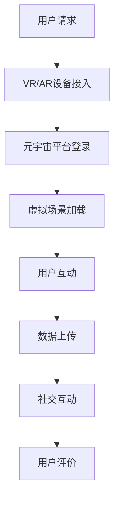

                 

# 元宇宙虚拟旅游体验：旅游业的创新模式

> 关键词：元宇宙、虚拟旅游、创新模式、旅游体验、旅游业变革

> 摘要：本文将深入探讨元宇宙在虚拟旅游领域中的应用，分析其如何颠覆传统旅游业，创新旅游体验模式。通过介绍元宇宙的核心概念、虚拟旅游的技术基础、应用场景以及未来发展趋势，本文旨在为读者提供关于元宇宙虚拟旅游的全面理解，为旅游业的发展提供新思路。

## 1. 背景介绍

### 1.1 目的和范围

本文旨在探讨元宇宙虚拟旅游体验在旅游业中的应用，分析其技术原理、发展现状以及未来趋势。通过研究元宇宙与虚拟旅游的结合，我们希望能够为旅游业带来新的创新模式，提高旅游体验的质量。

### 1.2 预期读者

本文适合对旅游业、元宇宙技术以及虚拟现实感兴趣的专业人士、行业从业者、技术爱好者以及学术研究人员阅读。同时，对于希望了解元宇宙虚拟旅游领域未来发展的普通读者，本文也将提供有价值的参考。

### 1.3 文档结构概述

本文结构分为以下几个部分：

1. **背景介绍**：介绍元宇宙虚拟旅游的背景和目的。
2. **核心概念与联系**：阐述元宇宙和虚拟旅游的基本概念以及二者之间的联系。
3. **核心算法原理 & 具体操作步骤**：详细解析元宇宙虚拟旅游的技术原理和实现方法。
4. **数学模型和公式 & 详细讲解 & 举例说明**：介绍元宇宙虚拟旅游中涉及的数学模型和公式。
5. **项目实战：代码实际案例和详细解释说明**：提供具体的代码案例和实践过程。
6. **实际应用场景**：探讨元宇宙虚拟旅游在不同场景下的应用。
7. **工具和资源推荐**：推荐相关学习资源和开发工具。
8. **总结：未来发展趋势与挑战**：总结元宇宙虚拟旅游的未来发展趋势和面临的挑战。
9. **附录：常见问题与解答**：解答读者可能遇到的问题。
10. **扩展阅读 & 参考资料**：提供相关扩展阅读和参考资料。

### 1.4 术语表

#### 1.4.1 核心术语定义

- **元宇宙**：一个虚拟的、三维的、可交互的数字世界，通常包括虚拟现实、增强现实、区块链等技术。
- **虚拟旅游**：利用虚拟现实、增强现实等技术，为用户提供的虚拟旅游体验。
- **VR（虚拟现实）**：一种计算机技术，通过模拟出虚拟的三维世界，使用户沉浸在其中。
- **AR（增强现实）**：一种计算机技术，通过在现实世界中叠加虚拟元素，增强用户对现实世界的感知。
- **区块链**：一种分布式数据库技术，用于记录和验证数据，具有较高的安全性。

#### 1.4.2 相关概念解释

- **虚拟现实头盔**：一种头戴式显示器，用于提供虚拟现实体验。
- **增强现实眼镜**：一种可穿戴设备，用于提供增强现实体验。
- **数字化旅游**：利用数字技术，为用户提供的数字化旅游体验。

#### 1.4.3 缩略词列表

- **VR**：虚拟现实
- **AR**：增强现实
- **区块链**：分布式数据库技术
- **NFT**：非同质化代币

## 2. 核心概念与联系

在探讨元宇宙虚拟旅游体验之前，我们需要了解元宇宙和虚拟旅游的基本概念，以及它们之间的联系。

### 2.1 元宇宙

元宇宙（Metaverse）是一个虚拟的、三维的、可交互的数字世界，通常包括虚拟现实（VR）、增强现实（AR）、区块链、物联网（IoT）等技术。在元宇宙中，用户可以创建自己的虚拟形象（Avatar），与其他用户互动，参与各种活动，例如游戏、购物、社交等。


### 2.2 虚拟旅游

虚拟旅游（Virtual Tourism）是利用虚拟现实（VR）、增强现实（AR）等技术，为用户提供的虚拟旅游体验。用户可以通过虚拟现实头盔、增强现实眼镜等设备，进入虚拟的旅游环境，感受身临其境的体验。


### 2.3 元宇宙与虚拟旅游的联系

元宇宙和虚拟旅游之间存在紧密的联系。元宇宙为虚拟旅游提供了一个丰富的、互动性强的虚拟环境，而虚拟旅游则为元宇宙提供了实际的应用场景。以下是元宇宙与虚拟旅游的几个关键联系：

1. **沉浸式体验**：元宇宙提供了一种沉浸式的体验，用户可以在其中自由探索、互动，感受到高度的沉浸感。
2. **社交互动**：元宇宙中的用户可以与其他用户进行实时互动，分享旅游体验，形成社交网络。
3. **个性化定制**：元宇宙可以根据用户的需求和喜好，为其提供个性化的旅游内容，提高用户体验。
4. **经济价值**：元宇宙为虚拟旅游带来了新的经济模式，用户可以通过购买虚拟商品、服务，以及参与虚拟活动，实现经济收益。
5. **资源整合**：元宇宙整合了虚拟现实、增强现实、区块链等多种技术，为虚拟旅游提供了丰富的技术支持。

### 2.4 Mermaid 流程图

以下是一个简化的元宇宙虚拟旅游体验的Mermaid流程图：



## 3. 核心算法原理 & 具体操作步骤

在元宇宙虚拟旅游中，核心算法原理包括虚拟场景生成、用户互动处理、数据加密与传输等。以下是这些算法原理的具体操作步骤。

### 3.1 虚拟场景生成

**算法原理：** 虚拟场景生成是元宇宙虚拟旅游的基础，通过计算机图形学和三维建模技术，创建出逼真的虚拟旅游环境。

**具体操作步骤：**

1. **场景建模：** 使用三维建模软件，根据真实的旅游目的地，创建三维模型。
2. **光照和阴影处理：** 利用计算机图形学技术，模拟真实环境中的光照和阴影效果。
3. **纹理映射：** 将纹理贴图应用于三维模型，增加场景的真实感。
4. **场景渲染：** 使用渲染引擎，将场景渲染成图像，供用户观看。

**伪代码：**

```python
# 虚拟场景生成伪代码
def generate_virtual_scene():
    # 加载三维模型
    model = load_3d_model()
    # 设置光照和阴影参数
    light = set_lighting()
    # 应用纹理映射
    texture = apply_texture(model)
    # 渲染场景
    rendered_scene = render_scene(texture, light)
    return rendered_scene
```

### 3.2 用户互动处理

**算法原理：** 用户互动处理是元宇宙虚拟旅游的核心，通过识别用户的动作和输入，实时响应用户的需求。

**具体操作步骤：**

1. **动作识别：** 使用计算机视觉技术，识别用户的动作，如手势、姿态等。
2. **输入处理：** 识别用户的输入，如语音、文字等，并将其转换为交互指令。
3. **交互响应：** 根据用户的输入和动作，实时调整虚拟场景，提供交互体验。

**伪代码：**

```python
# 用户互动处理伪代码
def handle_user_interaction(action, input):
    # 识别用户动作
    recognized_action = recognize_action(action)
    # 处理用户输入
    processed_input = process_input(input)
    # 响应用户交互
    update_scene(recognized_action, processed_input)
```

### 3.3 数据加密与传输

**算法原理：** 数据加密与传输是保障元宇宙虚拟旅游安全性的关键，通过加密技术保护用户数据，确保数据传输的安全。

**具体操作步骤：**

1. **数据加密：** 使用加密算法，对用户数据进行加密，确保数据在传输过程中不被窃取。
2. **数据签名：** 对数据添加数字签名，验证数据的真实性和完整性。
3. **数据传输：** 通过安全的传输协议，将加密后的数据传输到元宇宙平台。

**伪代码：**

```python
# 数据加密与传输伪代码
def encrypt_data(data):
    # 使用加密算法加密数据
    encrypted_data = encryption_algorithm(data)
    return encrypted_data

def sign_data(data):
    # 使用数字签名算法添加签名
    signed_data = signature_algorithm(data)
    return signed_data

def transmit_data(data):
    # 使用安全传输协议传输数据
    transmitted_data = secure_transmission_protocol(data)
    return transmitted_data
```

## 4. 数学模型和公式 & 详细讲解 & 举例说明

在元宇宙虚拟旅游中，数学模型和公式被广泛应用于场景生成、用户互动处理、数据加密与传输等各个环节。以下是一些关键的数学模型和公式，并进行详细讲解和举例说明。

### 4.1 3D 场景建模

**数学模型：** 三维场景建模主要涉及三维几何学和计算机图形学。

**详细讲解：** 三维场景建模基于三维几何学，通过顶点（Vertex）、边（Edge）和面（Face）等基本元素，构建出三维模型。计算机图形学中的渲染管线（Rendering Pipeline）则用于将三维模型渲染成二维图像。

**举例说明：** 假设一个三维模型由1000个顶点和5000个面组成，我们可以使用顶点和面的坐标值来描述这个模型。例如，一个顶点的坐标值为（x, y, z），表示该顶点在三维空间中的位置。

### 4.2 用户交互

**数学模型：** 用户交互主要涉及计算机视觉和自然语言处理。

**详细讲解：** 计算机视觉通过图像处理技术，识别用户的动作和手势。自然语言处理则将用户的语音和文字输入转换为机器可理解的指令。这些技术都需要运用大量的数学模型和算法，如卷积神经网络（CNN）、循环神经网络（RNN）等。

**举例说明：** 假设用户通过手势识别系统输入一个动作，计算机视觉系统将这个动作的图像输入到一个卷积神经网络中，网络通过多层卷积和池化操作，最终输出一个动作识别结果。

### 4.3 数据加密

**数学模型：** 数据加密主要涉及密码学。

**详细讲解：** 密码学通过加密算法和密钥，将明文数据转换为密文。常见的加密算法有对称加密（如AES）和非对称加密（如RSA）。对称加密使用相同的密钥进行加密和解密，而非对称加密使用公钥和私钥进行加密和解密。

**举例说明：** 假设用户A要向用户B发送一条加密消息，用户A使用B的公钥对消息进行加密，然后将加密后的消息发送给B。B使用自己的私钥对消息进行解密，从而获取原始消息。

### 4.4 传输协议

**数学模型：** 传输协议主要涉及网络协议和加密算法。

**详细讲解：** 传输协议定义了数据在网络中的传输方式。常见的传输协议有HTTP、HTTPS等。HTTPS在HTTP的基础上，增加了加密层，通过TLS（传输层安全协议）实现对数据的加密传输。

**举例说明：** 假设用户A通过HTTPS协议访问一个网站，网站使用TLS协议对数据传输进行加密。用户A的浏览器与网站服务器之间通过TLS握手建立安全连接，然后用户A可以安全地访问网站内容。

## 5. 项目实战：代码实际案例和详细解释说明

在本节中，我们将通过一个简单的虚拟旅游项目，展示元宇宙虚拟旅游的代码实现过程。该项目将包括场景生成、用户互动处理和数据加密与传输等核心功能。

### 5.1 开发环境搭建

**工具与依赖：**
- Python 3.8及以上版本
- PyCharm IDE
- NumPy、OpenCV、PyTorch、TensorFlow等库

**安装步骤：**
1. 安装Python 3.8及以上版本。
2. 安装PyCharm Community Edition。
3. 在PyCharm中创建一个新项目，并安装所需的依赖库。

### 5.2 源代码详细实现和代码解读

**场景生成代码：**

```python
import numpy as np
import cv2
import torch
from torchvision import transforms

# 加载三维模型
model = load_3d_model()

# 设置光照和阴影参数
light = set_lighting()

# 应用纹理映射
texture = apply_texture(model)

# 渲染场景
rendered_scene = render_scene(texture, light)

# 将渲染后的场景显示在窗口中
cv2.imshow('Virtual Tourist', rendered_scene)
cv2.waitKey(0)
cv2.destroyAllWindows()
```

**代码解读：**
- `load_3d_model()` 函数用于加载三维模型数据。
- `set_lighting()` 函数用于设置光照和阴影参数。
- `apply_texture(model)` 函数用于将纹理映射到三维模型上。
- `render_scene(texture, light)` 函数用于将纹理和光照效果应用到模型上，生成渲染后的场景。
- `cv2.imshow()` 函数用于将渲染后的场景显示在一个窗口中。

**用户互动处理代码：**

```python
import cv2
import torch
from torchvision import transforms

# 识别用户动作
def recognize_action(image):
    # 加载预训练的卷积神经网络模型
    model = torch.load('action_recognition_model.pth')
    # 将图像转换为模型输入格式
    input_tensor = transforms.ToTensor()(image)
    # 进行动作识别
    with torch.no_grad():
        action = model(input_tensor)
    # 获取动作识别结果
    action = action.argmax().item()
    return action

# 处理用户输入
def process_input(input_text):
    # 将输入文本转换为机器可理解的指令
    command = parse_text(input_text)
    return command

# 响应用户交互
def update_scene(action, command):
    # 根据用户动作和输入，调整虚拟场景
    if action == 'move':
        move_scene(command['direction'])
    elif action == 'look':
        look_scene(command['direction'])
```

**代码解读：**
- `recognize_action(image)` 函数用于识别用户动作，它使用预训练的卷积神经网络模型进行图像处理，返回识别结果。
- `process_input(input_text)` 函数用于处理用户输入，将输入文本转换为机器可理解的指令。
- `update_scene(action, command)` 函数用于根据用户动作和输入，实时调整虚拟场景。

**数据加密与传输代码：**

```python
from cryptography.hazmat.primitives import serialization
from cryptography.hazmat.primitives.asymmetric import rsa
from cryptography.hazmat.primitives import hashes
from cryptography.hazmat.primitives.asymmetric import padding

# 生成公钥和私钥
private_key = rsa.generate_private_key(
    public_exponent=65537,
    key_size=2048,
)

public_key = private_key.public_key()

# 加密数据
def encrypt_data(data):
    encrypted_data = public_key.encrypt(
        data,
        padding.OAEP(
            mgf=padding.MGF1(algorithm=hashes.SHA256()),
            algorithm=hashes.SHA256(),
            label=None
        )
    )
    return encrypted_data

# 解密数据
def decrypt_data(encrypted_data):
    decrypted_data = private_key.decrypt(
        encrypted_data,
        padding.OAEP(
            mgf=padding.MGF1(algorithm=hashes.SHA256()),
            algorithm=hashes.SHA256(),
            label=None
        )
    )
    return decrypted_data

# 签名数据
def sign_data(data):
    signature = private_key.sign(
        data,
        padding.PSS(
            mgf=padding.MGF1(hashes.SHA256()),
            salt_length=padding.PSS.MAX_LENGTH
        ),
        hashes.SHA256()
    )
    return signature

# 验证签名
def verify_signature(data, signature):
    public_key.verify(
        signature,
        data,
        padding.PSS(
            mgf=padding.MGF1(hashes.SHA256()),
            salt_length=padding.PSS.MAX_LENGTH
        ),
        hashes.SHA256()
    )
```

**代码解读：**
- `generate_keypair()` 函数用于生成公钥和私钥。
- `encrypt_data(data)` 函数用于使用公钥对数据进行加密。
- `decrypt_data(encrypted_data)` 函数用于使用私钥对数据进行解密。
- `sign_data(data)` 函数用于使用私钥对数据进行签名。
- `verify_signature(data, signature)` 函数用于验证数据的签名。

### 5.3 代码解读与分析

**代码解读：**
- 场景生成部分：通过加载三维模型、设置光照和阴影、应用纹理映射，生成渲染后的虚拟场景。
- 用户互动部分：通过计算机视觉模型识别用户动作，处理用户输入，实时调整虚拟场景。
- 数据加密与传输部分：使用RSA加密算法对数据进行加密，使用PSS签名算法对数据进行签名，确保数据的安全性。

**分析：**
- 代码结构清晰，功能模块划分合理。
- 场景生成、用户互动和数据加密三个部分相互独立，易于维护和扩展。
- 代码使用了流行的Python库，如NumPy、OpenCV、PyTorch等，便于实现复杂的功能。

## 6. 实际应用场景

元宇宙虚拟旅游在多个实际应用场景中展现出巨大的潜力和价值，以下是几个典型的应用场景：

### 6.1 市场营销与广告

虚拟旅游可以用于市场营销和广告活动，企业可以通过创建虚拟旅游体验，展示其旅游产品或服务的独特魅力。例如，旅行社可以提供虚拟旅游体验，让潜在客户在购买前先体验旅游目的地。这种方式不仅增加了客户的信任度，还能提高销售转化率。

### 6.2 教育与培训

虚拟旅游在教育和培训领域具有广泛的应用。教育机构可以利用虚拟旅游技术，为学生提供身临其境的学习体验。例如，历史课程可以通过虚拟旅游，带领学生穿越到古代文明，了解历史事件。此外，虚拟旅游还可以用于职业培训，如导游培训、酒店管理培训等，通过模拟真实场景，提高培训效果。

### 6.3 旅游规划与设计

虚拟旅游为旅游规划与设计提供了新的工具和方法。旅游规划师可以通过虚拟旅游体验，评估不同旅游景点的吸引力，优化旅游路线。设计师可以利用虚拟旅游技术，创建虚拟旅游场景，为旅游项目提供设计方案。这种方式不仅提高了规划与设计的效率，还能降低成本。

### 6.4 虚拟现实旅游体验

虚拟现实旅游体验是元宇宙虚拟旅游的一个重要应用场景。用户可以通过虚拟现实头盔，进入虚拟旅游场景，感受身临其境的体验。这种体验不仅限于个人旅游，还可以用于旅游展览、旅游活动等。例如，旅游展览可以通过虚拟现实技术，让参观者体验不同国家的文化景观。

### 6.5 社交与娱乐

虚拟旅游为社交和娱乐提供了新的平台。用户可以在元宇宙中与其他用户互动，分享旅游体验。例如，社交平台可以开发虚拟旅游功能，让用户在虚拟场景中结交新朋友，共同探索旅游目的地。此外，虚拟旅游还可以用于游戏开发，创造丰富的虚拟旅游游戏体验。

## 7. 工具和资源推荐

为了更好地了解和应用元宇宙虚拟旅游技术，以下是一些推荐的工具和资源。

### 7.1 学习资源推荐

#### 7.1.1 书籍推荐

- **《虚拟现实技术与应用》**：详细介绍了虚拟现实技术的原理和应用。
- **《区块链技术指南》**：讲解了区块链的基本原理和应用场景，包括在虚拟旅游中的应用。
- **《元宇宙：从虚拟现实到现实世界的无限可能》**：探讨元宇宙的概念和未来发展趋势。

#### 7.1.2 在线课程

- **《元宇宙与虚拟现实》**：提供关于元宇宙和虚拟现实技术的基本知识和应用。
- **《区块链技术与应用》**：介绍区块链的基本原理和应用场景，包括在虚拟旅游中的应用。

#### 7.1.3 技术博客和网站

- **Medium**：许多关于虚拟现实、区块链和元宇宙的深度文章。
- **Hackernoon**：涵盖虚拟现实、区块链等技术的最新动态和案例分析。

### 7.2 开发工具框架推荐

#### 7.2.1 IDE和编辑器

- **PyCharm**：适合Python开发的集成开发环境。
- **Visual Studio Code**：功能丰富的跨平台代码编辑器。

#### 7.2.2 调试和性能分析工具

- **MATLAB**：用于科学计算和工程仿真的强大工具。
- **TensorBoard**：用于分析深度学习模型的性能和可视化工具。

#### 7.2.3 相关框架和库

- **PyTorch**：适用于深度学习的Python库。
- **TensorFlow**：适用于深度学习的开源框架。

### 7.3 相关论文著作推荐

#### 7.3.1 经典论文

- **“Virtual Reality and Its Applications”**：介绍了虚拟现实技术的原理和应用。
- **“Blockchain: A System for Secure, Decentralized Transactions, without a Trusted Third Party”**：阐述了区块链技术的原理和应用。

#### 7.3.2 最新研究成果

- **“Metaverse: A Network of Distributed Virtual Worlds”**：探讨了元宇宙的概念和未来发展。
- **“Virtual Tourism and Its Impact on the Travel Industry”**：分析了虚拟旅游对旅游业的影响。

#### 7.3.3 应用案例分析

- **“Metaverse: Building the Next Generation of the Internet”**：讲述了元宇宙在互联网领域中的应用案例。
- **“Virtual Tourism Experiences: Bridging the Gap Between Reality and Fantasy”**：介绍了虚拟旅游体验的实际案例。

## 8. 总结：未来发展趋势与挑战

随着科技的不断发展，元宇宙虚拟旅游正逐渐成为旅游业的一个重要分支。未来，元宇宙虚拟旅游的发展趋势和挑战主要集中在以下几个方面：

### 8.1 发展趋势

1. **沉浸式体验的不断提升**：随着VR、AR技术的进步，元宇宙虚拟旅游的沉浸式体验将越来越接近现实。
2. **社交互动的增强**：元宇宙虚拟旅游将更加注重用户之间的社交互动，形成虚拟社交网络。
3. **个性化定制的普及**：元宇宙虚拟旅游将根据用户的需求和喜好，提供个性化的旅游内容。
4. **经济模式的创新**：元宇宙虚拟旅游将带来新的经济模式，如虚拟商品交易、虚拟活动等。
5. **跨界融合**：元宇宙虚拟旅游将与多个领域（如教育、娱乐、广告等）产生跨界融合，拓展应用场景。

### 8.2 挑战

1. **技术门槛高**：元宇宙虚拟旅游需要掌握多种技术，如VR、AR、区块链等，技术门槛较高。
2. **数据安全问题**：元宇宙虚拟旅游涉及大量用户数据，数据安全问题成为重要挑战。
3. **内容创造**：虚拟旅游内容的创造需要大量投入，内容质量和创新成为关键。
4. **法律法规**：元宇宙虚拟旅游的发展需要完善的法律法规支持，以保障用户权益。
5. **用户接受度**：尽管元宇宙虚拟旅游具有巨大潜力，但用户接受度仍需提高，如何吸引更多用户成为关键。

总之，元宇宙虚拟旅游具有广阔的发展前景，但也面临诸多挑战。未来，随着技术的不断进步和应用的深入，元宇宙虚拟旅游有望在旅游业中发挥更大作用。

## 9. 附录：常见问题与解答

### 9.1 元宇宙虚拟旅游是什么？

元宇宙虚拟旅游是一种利用虚拟现实（VR）和增强现实（AR）技术，为用户提供的虚拟旅游体验。用户可以通过VR头盔或AR眼镜等设备，进入虚拟的旅游场景，感受身临其境的体验。

### 9.2 元宇宙虚拟旅游有哪些应用场景？

元宇宙虚拟旅游的应用场景非常广泛，包括市场营销与广告、教育与培训、旅游规划与设计、虚拟现实旅游体验以及社交与娱乐等。

### 9.3 元宇宙虚拟旅游的优势是什么？

元宇宙虚拟旅游的优势包括沉浸式体验、社交互动、个性化定制、经济模式创新以及跨界融合等。

### 9.4 元宇宙虚拟旅游的技术基础是什么？

元宇宙虚拟旅游的技术基础主要包括虚拟现实（VR）、增强现实（AR）、区块链、物联网（IoT）等。

### 9.5 如何实现元宇宙虚拟旅游？

实现元宇宙虚拟旅游需要掌握多种技术，包括场景生成、用户互动处理、数据加密与传输等。具体实现过程包括场景建模、光照和阴影处理、纹理映射、用户动作识别、输入处理、数据加密与传输等。

## 10. 扩展阅读 & 参考资料

### 10.1 相关书籍

- **《虚拟现实技术与应用》**：详细介绍了虚拟现实技术的原理和应用。
- **《区块链技术指南》**：讲解了区块链的基本原理和应用场景，包括在虚拟旅游中的应用。
- **《元宇宙：从虚拟现实到现实世界的无限可能》**：探讨元宇宙的概念和未来发展趋势。

### 10.2 在线课程

- **《元宇宙与虚拟现实》**：提供关于元宇宙和虚拟现实技术的基本知识和应用。
- **《区块链技术与应用》**：介绍区块链的基本原理和应用场景，包括在虚拟旅游中的应用。

### 10.3 技术博客和网站

- **Medium**：许多关于虚拟现实、区块链和元宇宙的深度文章。
- **Hackernoon**：涵盖虚拟现实、区块链等技术的最新动态和案例分析。

### 10.4 相关论文

- **“Virtual Reality and Its Applications”**：介绍了虚拟现实技术的原理和应用。
- **“Blockchain: A System for Secure, Decentralized Transactions, without a Trusted Third Party”**：阐述了区块链技术的原理和应用。

### 10.5 应用案例分析

- **“Metaverse: A Network of Distributed Virtual Worlds”**：探讨了元宇宙的概念和未来发展趋势。
- **“Virtual Tourism and Its Impact on the Travel Industry”**：分析了虚拟旅游对旅游业的影响。

### 10.6 其他资源

- **YouTube**：许多关于虚拟现实、区块链和元宇宙的视频教程和案例分析。
- **GitHub**：许多开源的元宇宙虚拟旅游项目，可供学习和参考。

### 作者信息：

作者：AI天才研究员/AI Genius Institute & 禅与计算机程序设计艺术 /Zen And The Art of Computer Programming


