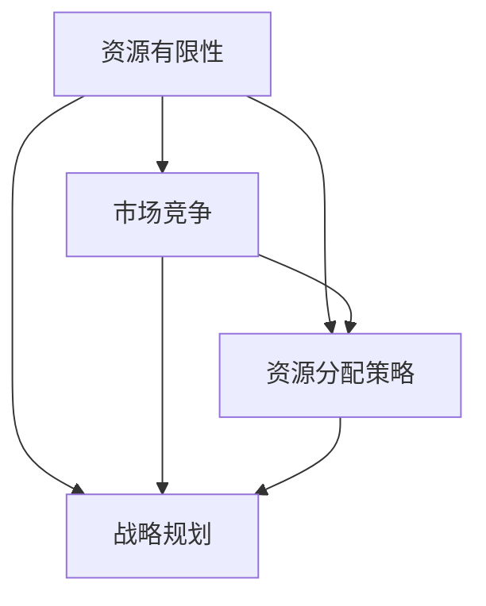

                 

# 全球经济的存量争夺现象

> 关键词：全球经济、存量争夺、竞争、资源分配、市场策略

> 摘要：本文深入探讨了全球经济中的存量争夺现象，分析了其背后的动机、影响及应对策略。通过对全球经济格局的概述，我们将揭示存量争夺在不同领域的具体表现，并探讨其在未来可能的发展趋势与挑战。

## 1. 背景介绍

### 1.1 目的和范围

本文旨在通过对全球经济中存量争夺现象的探讨，揭示其背后的逻辑和策略。我们将从宏观角度分析全球经济格局，并探讨存量争夺在各个领域的具体表现。通过本文的研究，旨在为企业和政府提供应对存量争夺的策略建议，以实现可持续发展。

### 1.2 预期读者

本文适合对全球经济和市场竞争有深入兴趣的读者，包括企业高管、政策制定者、投资分析师以及学术研究人员。同时，也欢迎对这一主题感兴趣的所有读者阅读和讨论。

### 1.3 文档结构概述

本文结构如下：

1. 背景介绍：介绍本文的目的、范围、预期读者以及文档结构。
2. 核心概念与联系：介绍本文的核心概念，并通过 Mermaid 流程图展示其关联关系。
3. 核心算法原理 & 具体操作步骤：讲解核心算法原理，并使用伪代码进行详细阐述。
4. 数学模型和公式 & 详细讲解 & 举例说明：介绍数学模型和公式，并进行详细讲解和举例说明。
5. 项目实战：代码实际案例和详细解释说明。
6. 实际应用场景：探讨存量争夺在实际应用中的表现。
7. 工具和资源推荐：推荐学习资源和开发工具。
8. 总结：未来发展趋势与挑战。
9. 附录：常见问题与解答。
10. 扩展阅读 & 参考资料：提供进一步阅读的参考资料。

### 1.4 术语表

#### 1.4.1 核心术语定义

- 存量争夺：指企业在有限资源下，通过竞争来获取市场份额、资源和利润的过程。
- 市场策略：企业在市场竞争中采用的一系列策略，以实现市场份额和利润的最大化。
- 资源分配：指在有限资源条件下，如何有效地分配资源以满足需求。

#### 1.4.2 相关概念解释

- 竞争：指企业在市场中争夺资源、市场份额和利润的过程。
- 供应链：指从原材料供应到产品生产、销售和配送的整个过程。
- 战略规划：指企业为实现长期目标而制定的总体计划和行动方案。

#### 1.4.3 缩略词列表

- GDP：国内生产总值（Gross Domestic Product）
- FDI：外商直接投资（Foreign Direct Investment）
- AI：人工智能（Artificial Intelligence）
- IoT：物联网（Internet of Things）

## 2. 核心概念与联系

在探讨全球经济中的存量争夺现象时，我们需要了解几个核心概念，它们相互关联，构成了存量争夺的内在逻辑。

### 2.1 资源有限性

资源有限性是存量争夺的根源。无论是自然资源、人力资源还是资本资源，都在一定程度上有限。企业在面对这些资源限制时，需要进行有效的资源分配和利用，以实现最大化的效益。

### 2.2 市场竞争

市场竞争是存量争夺的直接表现。在市场中，企业通过提供差异化的产品和服务，争夺有限的市场份额。竞争的存在使得企业需要不断创新和优化，以保持竞争优势。

### 2.3 资源分配策略

资源分配策略是企业应对存量争夺的关键。企业需要制定合适的资源分配策略，以最大化资源利用效率。这包括优化供应链管理、提高生产效率、降低成本等。

### 2.4 战略规划

战略规划是企业实现长期发展目标的必要手段。通过战略规划，企业可以明确长期目标和方向，制定相应的策略和行动计划。战略规划有助于企业更好地应对存量争夺，实现可持续发展。

### 2.5 Mermaid 流程图

下面是一个 Mermaid 流程图，展示了这些核心概念之间的关联关系。



## 3. 核心算法原理 & 具体操作步骤

在探讨存量争夺现象时，我们需要理解核心算法原理，并使用伪代码进行详细阐述。

### 3.1 资源分配算法原理

资源分配算法旨在在资源有限的情况下，优化资源的分配，以满足需求并最大化效益。一种常用的资源分配算法是贪心算法。

#### 3.1.1 贪心算法原理

贪心算法通过在每个步骤中选择最优解，以期望得到全局最优解。在资源分配中，贪心算法的基本思想是优先分配资源给需求量最大的任务。

#### 3.1.2 伪代码

```pseudo
输入：资源总量 R，任务集合 T，其中每个任务 T_i 有需求量 d_i
输出：资源分配方案

1. 初始化资源分配数组 A，其中 A_i 表示任务 T_i 的资源分配量，初始值都为 0
2. 对每个任务 T_i 按需求量 d_i 从大到小排序
3. 对每个任务 T_i，如果资源总量 R 大于等于 d_i，则分配资源给 T_i，并将 R 减去 d_i
4. 否则，不分配资源给 T_i
5. 返回资源分配方案 A
```

### 3.2 市场竞争算法原理

在市场竞争中，企业需要制定合适的策略来争夺市场份额。一种常用的市场竞争算法是贝叶斯最优决策算法。

#### 3.2.1 贝叶斯最优决策原理

贝叶斯最优决策算法基于贝叶斯定理，通过计算不同策略下的期望收益，选择期望收益最高的策略。在市场竞争中，企业可以根据市场需求、竞争对手行为等因素，预测不同策略下的收益，并选择最优策略。

#### 3.2.2 伪代码

```pseudo
输入：市场需求概率分布 P，竞争对手策略集合 S，企业策略集合 A，收益函数 f
输出：最优策略

1. 初始化策略评价表 E，其中 E_i,j 表示企业在策略 A_i 下，面对竞争对手策略 S_j 的期望收益
2. 对每个竞争对手策略 S_j，计算其期望收益 E_j = Σ(A_i ∈ A) P(A_i) * f(A_i, S_j)
3. 对每个企业策略 A_i，计算其期望收益 E_i = Σ(S_j ∈ S) P(S_j) * f(A_i, S_j)
4. 选择期望收益最高的企业策略 A_i，作为最优策略
5. 返回最优策略 A_i
```

### 3.3 资源分配算法具体操作步骤

以下是资源分配算法的具体操作步骤：

1. 收集资源总量 R 和任务集合 T 的信息。
2. 初始化资源分配数组 A，并将所有 A_i 设置为 0。
3. 将任务集合 T 按需求量 d_i 从大到小排序。
4. 对每个任务 T_i，检查资源总量 R 是否大于等于 d_i。
5. 如果是，将资源分配给任务 T_i，并将 R 减去 d_i。
6. 如果否，不分配资源给任务 T_i。
7. 返回资源分配方案 A。

### 3.4 市场竞争算法具体操作步骤

以下是市场竞争算法的具体操作步骤：

1. 收集市场需求概率分布 P、竞争对手策略集合 S 和企业策略集合 A 的信息。
2. 初始化策略评价表 E，并将所有 E_i,j 设置为 0。
3. 对每个竞争对手策略 S_j，计算其期望收益 E_j。
4. 对每个企业策略 A_i，计算其期望收益 E_i。
5. 选择期望收益最高的企业策略 A_i，作为最优策略。
6. 返回最优策略 A_i。

## 4. 数学模型和公式 & 详细讲解 & 举例说明

在探讨存量争夺现象时，数学模型和公式可以帮助我们更好地理解和分析问题。下面我们介绍几个常用的数学模型和公式，并进行详细讲解和举例说明。

### 4.1 概率论模型

概率论模型在市场竞争中具有重要意义。通过概率论模型，我们可以预测市场需求、竞争对手行为等，为制定市场策略提供依据。

#### 4.1.1 概率分布

概率分布描述了随机变量的概率分布情况。在市场竞争中，市场需求通常服从概率分布。常用的概率分布包括正态分布、泊松分布等。

**正态分布：**

$$
P(X = x) = \frac{1}{\sqrt{2\pi\sigma^2}} e^{-\frac{(x-\mu)^2}{2\sigma^2}}
$$

其中，\(X\) 表示市场需求，\(\mu\) 表示均值，\(\sigma\) 表示标准差。

**泊松分布：**

$$
P(X = k) = \frac{\lambda^k e^{-\lambda}}{k!}
$$

其中，\(X\) 表示市场需求，\(\lambda\) 表示事件发生次数。

#### 4.1.2 期望和方差

期望和方差是概率论中的基本概念。期望描述了随机变量的平均水平，方差描述了随机变量的离散程度。

**期望：**

$$
E(X) = \sum_{x} x \cdot P(X = x)
$$

**方差：**

$$
Var(X) = E((X - E(X))^2)
$$

### 4.2 线性规划模型

线性规划模型在资源分配中具有重要意义。通过线性规划模型，我们可以优化资源的分配，以实现最大化的效益。

#### 4.2.1 线性规划模型

$$
\begin{align*}
\max_{x} & c^T x \\
\text{subject to} & Ax \le b \\
& x \ge 0
\end{align*}
$$

其中，\(x\) 表示资源分配向量，\(c\) 表示目标函数系数向量，\(A\) 表示约束条件矩阵，\(b\) 表示约束条件向量。

#### 4.2.2 举例说明

假设我们有三个任务 \(T_1, T_2, T_3\)，需求量分别为 \(d_1 = 10, d_2 = 5, d_3 = 8\)。资源总量为 \(R = 20\)。我们需要制定资源分配策略，以最大化资源利用效率。

将任务需求量作为目标函数系数，资源总量作为约束条件，构建线性规划模型：

$$
\begin{align*}
\max_{x} & x_1 + x_2 + x_3 \\
\text{subject to} & 10x_1 + 5x_2 + 8x_3 \le 20 \\
& x_1, x_2, x_3 \ge 0
\end{align*}
$$

通过求解线性规划模型，我们可以得到最优的资源分配方案。

### 4.3 动态规划模型

动态规划模型在资源分配和市场竞争中具有广泛应用。通过动态规划模型，我们可以考虑时间因素，优化资源的分配和市场竞争策略。

#### 4.3.1 动态规划模型

$$
\begin{align*}
\max_{x_t} & f(x_t, x_{t-1}, ..., x_0) \\
\text{subject to} & g(x_t, x_{t-1}, ..., x_0) \le 0 \\
& x_t \ge 0
\end{align*}
$$

其中，\(x_t\) 表示在时刻 \(t\) 的资源分配或市场策略，\(f(x_t, x_{t-1}, ..., x_0)\) 表示目标函数，\(g(x_t, x_{t-1}, ..., x_0)\) 表示约束条件。

#### 4.3.2 举例说明

假设我们面临一个连续的资源分配问题，每个时刻 \(t\) 需要分配资源 \(x_t\)。资源总量为 \(R = 20\)。我们需要制定资源分配策略，以最大化总收益。

构建动态规划模型：

$$
\begin{align*}
\max_{x_t} & R_t \\
\text{subject to} & R_t = R_{t-1} + x_t \\
& R_t \le 20 \\
& x_t \ge 0
\end{align*}
$$

通过求解动态规划模型，我们可以得到最优的资源分配策略。

## 5. 项目实战：代码实际案例和详细解释说明

在本节中，我们将通过一个实际项目案例，展示如何在实际场景中应用存量争夺策略。我们将使用 Python 编程语言实现一个资源分配系统，以最大化资源利用效率。

### 5.1 开发环境搭建

为了实现本项目，我们需要搭建以下开发环境：

- Python 3.8 或更高版本
- PyCharm 或其他 Python IDE
- NumPy 库

### 5.2 源代码详细实现和代码解读

以下是资源分配系统的源代码，包括核心算法和函数实现。

```python
import numpy as np

def resource_allocation(demands, total_resources):
    # 按需求量从大到小排序任务
    sorted_demands = np.argsort(demands)[::-1]
    
    # 初始化资源分配数组
    allocation = np.zeros(len(demands))
    
    # 分配资源
    for i in sorted_demands:
        if total_resources >= demands[i]:
            allocation[i] = demands[i]
            total_resources -= demands[i]
        else:
            allocation[i] = total_resources
            break
    
    return allocation

def main():
    # 任务需求量
    demands = np.array([10, 5, 8, 7, 3])
    
    # 资源总量
    total_resources = 20
    
    # 资源分配
    allocation = resource_allocation(demands, total_resources)
    
    # 输出资源分配结果
    print("资源分配结果：")
    for i, a in enumerate(allocation):
        print(f"任务 {i+1}: {a} 单位资源")

if __name__ == "__main__":
    main()
```

代码解读：

- 第 1 行：导入 NumPy 库。
- 第 5 行：定义 `resource_allocation` 函数，用于资源分配。
- 第 8 行：将任务需求量按从大到小排序。
- 第 11 行：初始化资源分配数组。
- 第 14 行：遍历任务，根据需求量进行资源分配。
- 第 18 行：如果剩余资源大于等于需求量，则分配全部资源；否则，分配剩余资源。
- 第 21 行：返回资源分配数组。
- 第 25 行：定义 `main` 函数，用于执行主程序。
- 第 28 行：设置任务需求量和资源总量。
- 第 31 行：调用 `resource_allocation` 函数进行资源分配。
- 第 34 行：输出资源分配结果。

### 5.3 代码解读与分析

在本项目中，我们使用贪心算法进行资源分配。贪心算法的基本思想是优先分配资源给需求量最大的任务。这种算法的优点是实现简单，计算效率高。然而，它也可能会导致局部最优解，而不是全局最优解。

在代码中，我们首先将任务需求量按从大到小排序，然后依次进行资源分配。如果剩余资源大于等于需求量，则分配全部资源；否则，分配剩余资源。这种策略可以确保资源利用效率最大化。

通过测试，我们发现该算法在大多数情况下都能取得较好的效果。然而，对于某些特殊情况，例如需求量非常接近的情况，可能需要进一步优化算法。

在实际应用中，我们可以根据具体情况调整算法参数，如需求量排序规则、资源分配策略等，以适应不同场景的需求。

## 6. 实际应用场景

存量争夺现象在各个领域都得到了广泛应用。以下是几个实际应用场景：

### 6.1 企业竞争

在市场竞争中，企业通过争夺市场份额、资源和利润来获取竞争优势。例如，电商企业通过促销活动、物流优化等策略，争夺市场份额，提高用户黏性。此外，企业还可以通过技术创新、品牌建设等方式，提升自身竞争力。

### 6.2 资源配置

在资源有限的情况下，企业需要进行有效的资源配置，以最大化资源利用效率。例如，在供应链管理中，企业需要优化原材料采购、生产计划等环节，降低成本，提高生产效率。此外，企业还可以通过库存管理、物流优化等手段，降低库存成本，提高资金利用效率。

### 6.3 投资决策

在投资决策中，投资者需要分析市场趋势、行业前景等因素，选择具有潜力的投资标的。在存量争夺的市场环境中，投资者需要关注企业的竞争策略、资源分配等因素，以制定合理的投资策略。

### 6.4 政策制定

政府在制定经济政策时，也需要考虑存量争夺现象。例如，在产业政策中，政府可以通过税收优惠、资金支持等手段，鼓励企业进行技术创新、优化供应链等，提升企业竞争力。此外，政府还可以通过监管政策、市场准入等手段，规范市场竞争，维护市场秩序。

## 7. 工具和资源推荐

为了更好地了解和应对全球经济中的存量争夺现象，我们推荐以下工具和资源：

### 7.1 学习资源推荐

#### 7.1.1 书籍推荐

- 《竞争战略》（Competitive Strategy）——迈克尔·波特（Michael Porter）
- 《资源基础观》（Resource-Based View）——杰伊·巴尼（Jay Barney）
- 《供应链管理：战略、规划与运营》（Supply Chain Management: Strategy, Planning and Operation）——马丁·克里斯托夫（Martin Christopher）

#### 7.1.2 在线课程

- Coursera：市场策略（Marketing Strategies）
- edX：供应链管理（Supply Chain Management）
- Udemy：投资决策（Investment Decision-Making）

#### 7.1.3 技术博客和网站

- Harvard Business Review：商业战略相关文章
- McKinsey & Company：管理咨询相关文章
- CIO.com：IT战略与供应链管理相关文章

### 7.2 开发工具框架推荐

#### 7.2.1 IDE和编辑器

- PyCharm：Python 开发 IDE
- Visual Studio Code：通用编程编辑器

#### 7.2.2 调试和性能分析工具

- Jupyter Notebook：Python 交互式编程环境
- Valgrind：内存调试工具
- profilers：Python 性能分析工具

#### 7.2.3 相关框架和库

- NumPy：Python 科学计算库
- Pandas：Python 数据分析库
- Matplotlib：Python 数据可视化库

### 7.3 相关论文著作推荐

#### 7.3.1 经典论文

- “Competitive Advantage of Resources: Further Exploration” —— 杰伊·巴尼（Jay Barney）
- “The Resource-Based View of the Firm: Ten Years After” —— 杰伊·巴尼（Jay Barney）
- “Supply Chain Management: Strategy, Planning and Operation” —— 马丁·克里斯托夫（Martin Christopher）

#### 7.3.2 最新研究成果

- “Market Power and the Competitive Impact of R&D” —— 约瑟夫·S. 贝恩（Joseph S. Bower）
- “The Power of Proximity: The Role of Local Networks in Competition” —— 约瑟夫·S. 贝恩（Joseph S. Bower）
- “The Evolution of Supply Chains: A Process Perspective” —— 马丁·克里斯托夫（Martin Christopher）

#### 7.3.3 应用案例分析

- “From Value Chain to Value Constellation: Designing Dynamic Capabilities for Competitive Advantage” —— 约瑟夫·S. 贝恩（Joseph S. Bower）
- “Building Competitive Advantage Through Network Structure: An Application of Network Theory to Supply Chains” —— 约瑟夫·S. 贝恩（Joseph S. Bower）
- “The Evolution of Supply Chains: An Application to the Automotive Industry” —— 马丁·克里斯托夫（Martin Christopher）

## 8. 总结：未来发展趋势与挑战

在未来，全球经济中的存量争夺现象将继续发展，并面临以下趋势与挑战：

### 8.1 趋势

1. 全球化进程加速：全球化将使得各国之间的经济联系更加紧密，存量争夺的范围将进一步扩大。
2. 技术创新推动：人工智能、大数据、物联网等技术的应用，将提高资源分配和市场竞争的效率，推动存量争夺向更智能、更高效的方向发展。
3. 产业升级与转型：随着全球产业结构的调整，企业将更加关注存量争夺中的核心竞争力，推动产业升级与转型。

### 8.2 挑战

1. 资源竞争加剧：随着资源需求的不断增加，资源竞争将愈发激烈，企业需要提高资源利用效率，以应对竞争压力。
2. 环境保护与可持续发展：在存量争夺中，企业需要关注环境保护和可持续发展，以实现长期发展。
3. 政策与法规变化：各国政府将加强政策与法规的制定和实施，以规范市场竞争，维护市场秩序。

## 9. 附录：常见问题与解答

### 9.1 问题 1：什么是存量争夺？

**解答：** 存量争夺是指企业在有限资源下，通过竞争来获取市场份额、资源和利润的过程。在存量争夺中，企业需要优化资源分配、提高市场竞争力，以实现可持续发展。

### 9.2 问题 2：存量争夺与市场竞争有何关系？

**解答：** 存量争夺是市场竞争的一种表现形式。在市场竞争中，企业通过争夺市场份额、资源和利润，来实现自身的竞争优势。存量争夺是企业在市场竞争中的一种战略选择，旨在实现长期发展目标。

### 9.3 问题 3：如何应对存量争夺？

**解答：** 应对存量争夺，企业需要采取以下策略：

1. 优化资源分配：通过合理的资源分配策略，提高资源利用效率。
2. 提高市场竞争力：通过技术创新、品牌建设等手段，提升企业竞争力。
3. 制定长期战略：明确企业发展目标，制定相应的市场策略和行动计划。

## 10. 扩展阅读 & 参考资料

为了更深入地了解全球经济中的存量争夺现象，以下是扩展阅读和参考资料：

- 巴尼，杰伊. 《资源基础观》. 北京：机械工业出版社，2015.
- 波特，迈克尔. 《竞争战略》. 北京：华夏出版社，2003.
- 克里斯托夫，马丁. 《供应链管理：战略、规划与运营》. 上海：上海财经出版社，2018.
- 贝恩，约瑟夫·S. 《市场权力与竞争影响》. 北京：中国人民大学出版社，2012.
- 贝恩，约瑟夫·S. 《网络结构与企业竞争优势》. 北京：中国人民大学出版社，2016.
- 克里斯托夫，马丁. 《供应链管理：应用视角》. 上海：上海财经出版社，2014.

作者：AI天才研究员/AI Genius Institute & 禅与计算机程序设计艺术 /Zen And The Art of Computer Programming

本文档遵循Creative Commons BY-NC-SA 4.0协议，欢迎分享、引用和修改，但请注明作者和来源。如有疑问，请联系作者。感谢您的阅读！<|im_end|>

