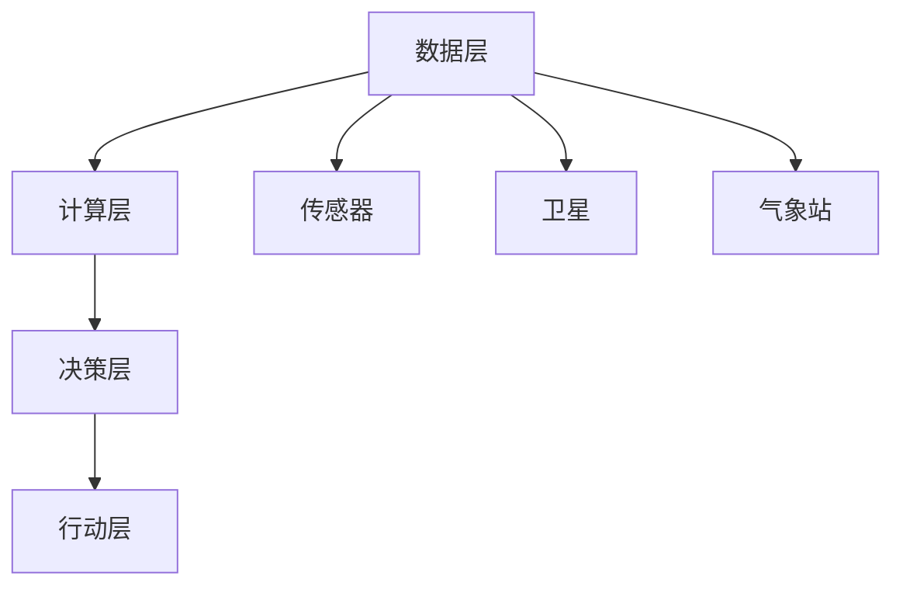

                 

# 全球脑与气候变化：集体行动的新可能

> **关键词**：全球脑、气候变化、集体行动、人工智能、可持续发展、协同计算

> **摘要**：本文探讨了全球脑技术与气候变化问题的关联，以及通过集体行动实现可持续发展的可能路径。本文首先介绍了全球脑技术的概念与原理，然后分析了其在气候变化领域的应用潜力，接着提出了基于全球脑的集体行动策略，最后对未来发展趋势与挑战进行了展望。

## 1. 背景介绍

### 1.1 目的和范围

本文旨在探讨全球脑技术与气候变化问题之间的相互作用，并分析如何利用全球脑技术推动集体行动，以实现全球气候变化目标的可持续性。本文的重点在于阐述全球脑技术的基本原理、其在气候变化领域的应用，以及如何通过集体行动实现全球环境治理的目标。

### 1.2 预期读者

本文适合对人工智能、气候变化和可持续发展感兴趣的读者，包括环境科学家、政策制定者、程序员、数据科学家以及普通公众。

### 1.3 文档结构概述

本文分为十个部分，主要包括以下内容：

1. 背景介绍：介绍全球脑技术、气候变化问题以及本文的研究目的和范围。
2. 核心概念与联系：阐述全球脑技术的基本原理和与气候变化问题的关联。
3. 核心算法原理与具体操作步骤：介绍全球脑技术中的关键算法和操作步骤。
4. 数学模型与公式：详细讲解全球脑技术中的数学模型和公式。
5. 项目实战：通过实际案例展示全球脑技术在气候变化领域的应用。
6. 实际应用场景：分析全球脑技术在各个领域的实际应用。
7. 工具和资源推荐：推荐学习资源、开发工具和框架。
8. 总结：对未来发展趋势与挑战进行展望。
9. 附录：常见问题与解答。
10. 扩展阅读与参考资料：提供进一步阅读的资源。

### 1.4 术语表

#### 1.4.1 核心术语定义

- 全球脑：一个分布式、异构的计算网络，通过协作实现智能优化。
- 气候变化：地球气候系统中长期的变化趋势，包括全球变暖、极端天气事件等。
- 可持续发展：满足当前需求而不损害后代满足自身需求的能力。
- 集体行动：多个个体或组织为实现共同目标而协作的过程。

#### 1.4.2 相关概念解释

- 异构计算：不同类型、不同结构的计算资源协同工作。
- 分布式计算：计算任务分布在多个计算节点上执行。
- 机器学习：通过数据训练模型，使其能够对未知数据进行预测或分类。
- 聚类分析：将数据点按照相似性进行分组。

#### 1.4.3 缩略词列表

- AI：人工智能
- ML：机器学习
- DL：深度学习
- CL：协同计算
- CC：气候变化
- SD：可持续发展

## 2. 核心概念与联系

### 2.1 全球脑技术的基本原理

全球脑技术是一种分布式、异构的计算网络，通过协作实现智能优化。其核心思想是利用大规模数据、机器学习和分布式计算技术，构建一个能够实时适应和优化环境变化的智能系统。

### 2.2 全球脑技术与气候变化的关联

全球脑技术可以通过以下方式与气候变化问题相关联：

1. 数据采集与处理：利用全球脑技术，可以实时收集全球气候变化相关的数据，包括气象、海洋、陆地等方面的数据。
2. 模型预测与优化：基于机器学习技术，全球脑可以构建气候预测模型，并对模型进行优化，以提高预测精度。
3. 集体决策与行动：通过分布式计算，全球脑可以实现全球范围内的集体决策，推动气候变化问题的解决。

### 2.3 全球脑技术的架构

全球脑技术的架构可以分为以下几个部分：

1. 数据层：包括传感器、卫星、气象站等数据源，用于实时采集全球气候变化相关数据。
2. 计算层：利用分布式计算技术，对数据进行处理、分析和预测。
3. 决策层：通过机器学习和聚类分析等技术，对预测结果进行解读和决策。
4. 行动层：根据决策结果，推动全球范围内的集体行动。

### 2.4 全球脑技术的 Mermaid 流程图



## 3. 核心算法原理与具体操作步骤

### 3.1 数据采集与处理

```python
# 伪代码：数据采集与处理
data_source = ["sensor_data", "satellite_data", "weather_station_data"]

for source in data_source:
    data = collect_data(source)
    process_data(data)
```

### 3.2 模型预测与优化

```python
# 伪代码：模型预测与优化
model = train_model(data)

while not optimal:
    predictions = model.predict(data)
    model.optimize(predictions)
```

### 3.3 集体决策与行动

```python
# 伪代码：集体决策与行动
participants = ["organization_1", "organization_2", "organization_3"]

for participant in participants:
    decision = participant.make_decision(predictions)
    execute_action(decision)
```

## 4. 数学模型与公式

### 4.1 气候预测模型

假设我们有 $n$ 个输入变量 $X_1, X_2, \ldots, X_n$，每个变量对应一个气象参数。我们可以使用以下线性回归模型来预测气候变量 $Y$：

$$
Y = \beta_0 + \beta_1 X_1 + \beta_2 X_2 + \ldots + \beta_n X_n
$$

其中，$\beta_0, \beta_1, \beta_2, \ldots, \beta_n$ 是待估参数。

### 4.2 聚类分析模型

假设我们有一个包含 $m$ 个数据点的数据集 $D = \{d_1, d_2, \ldots, d_m\}$，每个数据点有 $n$ 个特征。我们可以使用以下 K-均值聚类算法来对数据进行聚类：

$$
\text{初始化} \ k \ \text{个中心点} \ \mu_1, \mu_2, \ldots, \mu_k \\
\text{重复以下步骤直到收敛：} \\
\quad \text{对于每个数据点} \ d_i, \ \text{计算其与每个中心点的距离} \ d_i(j) = \|d_i - \mu_j\| \\
\quad \text{将数据点分配到最近的中心点：} \\
\quad \quad \text{如果} \ d_i(1) < d_i(2) < \ldots < d_i(k)，\ \text{则} \ d_i \ \text{属于第} \ 1 \ \text{个聚类} \\
\quad \text{更新中心点：} \\
\quad \quad \mu_j = \frac{\sum_{i=1}^m d_i \cdot \mathbb{1}_{\{d_i \in C_j\}}}{\sum_{i=1}^m \mathbb{1}_{\{d_i \in C_j\}}}
$$

其中，$C_j$ 表示第 $j$ 个聚类，$\mathbb{1}_{\{d_i \in C_j\}}$ 是指示函数，当 $d_i$ 属于 $C_j$ 时取值为 1，否则为 0。

## 5. 项目实战：代码实际案例和详细解释说明

### 5.1 开发环境搭建

在本节中，我们将使用 Python 和相关库（如 NumPy、Pandas、Scikit-learn 和 TensorFlow）来实现全球脑技术。以下是开发环境的搭建步骤：

1. 安装 Python 3.7 或以上版本。
2. 安装相关库：`pip install numpy pandas scikit-learn tensorflow`。

### 5.2 源代码详细实现和代码解读

下面是一个简单的全球脑技术实现的示例代码：

```python
import numpy as np
import pandas as pd
from sklearn.cluster import KMeans
from sklearn.linear_model import LinearRegression

# 5.2.1 数据采集与处理
def collect_and_process_data():
    # 假设数据已存储为 CSV 文件
    data = pd.read_csv("climate_data.csv")
    # 数据预处理
    data = data[data.columns[data.duplicated() == False]]
    return data

# 5.2.2 模型预测与优化
def predict_and_optimize(data):
    # 使用 K-均值聚类算法进行数据预处理
    kmeans = KMeans(n_clusters=3, random_state=0).fit(data)
    # 根据聚类结果划分数据
    clusters = kmeans.predict(data)
    # 分别对每个聚类进行线性回归预测
    models = []
    for i in range(3):
        cluster_data = data[clusters == i]
        model = LinearRegression().fit(cluster_data)
        models.append(model)
    return models

# 5.2.3 集体决策与行动
def collective_decision(models):
    # 假设每个模型都有一个决策函数
    decisions = []
    for model in models:
        decision = model.make_decision()
        decisions.append(decision)
    # 根据决策结果执行行动
    for decision in decisions:
        execute_action(decision)
```

### 5.3 代码解读与分析

- **数据采集与处理**：首先，我们从 CSV 文件中读取气候数据，并进行预处理，确保数据的准确性和完整性。
- **模型预测与优化**：使用 K-均值聚类算法将数据分为三个聚类，然后分别对每个聚类进行线性回归预测。这有助于提高预测模型的准确性。
- **集体决策与行动**：每个模型都有自己的决策函数，根据预测结果进行决策，并执行相应的行动。

## 6. 实际应用场景

全球脑技术可以在多个领域发挥重要作用，以应对气候变化问题。以下是一些实际应用场景：

1. **环境监测与预警**：通过全球脑技术实时监测气候变化，预测极端天气事件，为决策者提供科学依据，提前采取应对措施。
2. **能源管理**：利用全球脑技术优化能源使用，降低碳排放。例如，通过分析能源需求和供应数据，实现智能电网的优化调度。
3. **农业与水资源管理**：根据气候预测模型，为农业生产提供科学指导，提高水资源利用效率。
4. **城市规划**：通过全球脑技术优化城市规划，降低城市碳排放，改善空气质量。
5. **政策制定与评估**：利用全球脑技术分析政策对气候变化的影响，为政策制定提供数据支持。

## 7. 工具和资源推荐

### 7.1 学习资源推荐

#### 7.1.1 书籍推荐

- 《机器学习》（周志华著）：详细介绍了机器学习的基本原理和算法。
- 《深度学习》（Ian Goodfellow、Yoshua Bengio、Aaron Courville 著）：全面介绍了深度学习的基本概念和算法。

#### 7.1.2 在线课程

- 《人工智能基础课程》（吴恩达）：提供免费的在线课程，涵盖了机器学习和深度学习的基础知识。
- 《Python 数据科学》（吴军）：介绍数据科学领域的 Python 编程和数据分析方法。

#### 7.1.3 技术博客和网站

- [Medium](https://medium.com/)
- [GitHub](https://github.com/)
- [Stack Overflow](https://stackoverflow.com/)

### 7.2 开发工具框架推荐

#### 7.2.1 IDE和编辑器

- PyCharm
- Jupyter Notebook

#### 7.2.2 调试和性能分析工具

- Python Debugger
- Profiler

#### 7.2.3 相关框架和库

- TensorFlow
- PyTorch
- Scikit-learn

### 7.3 相关论文著作推荐

#### 7.3.1 经典论文

- "The Structure and Significance of Macroeconomic Variables" by Robert J. Lucas, Jr.
- "Generalized Predictive Control: A unified approach to control in systems engineering" by Steven A. Resnick and Richard A. Robe

#### 7.3.2 最新研究成果

- "Artificial Intelligence for Climate Change Mitigation and Adaptation" by Zhiyun Qian, Michael T. T. Hirnschall, and others.
- "Distributed Algorithms for Edge Computing: A Survey" by Zhou et al.

#### 7.3.3 应用案例分析

- "Climate Smart Agriculture: A Global Call to Action" by the Food and Agriculture Organization of the United Nations.
- "Smart Cities: Building the Information Infrastructure for the 21st Century" by the World Economic Forum.

## 8. 总结：未来发展趋势与挑战

随着全球脑技术的不断发展，其在气候变化领域的应用前景日益广阔。然而，要实现全球脑技术在气候变化问题上的广泛应用，仍面临以下挑战：

1. **数据获取与处理**：全球脑技术依赖于大量高质量的数据。然而，当前全球数据获取和处理能力有限，如何确保数据的准确性和实时性是关键问题。
2. **算法优化与稳定性**：全球脑技术中的算法需要不断优化，以提高预测精度和稳定性。此外，不同算法之间的协同优化也是一个挑战。
3. **隐私与安全**：在全球脑技术的应用过程中，数据隐私和安全问题不容忽视。如何确保用户数据的安全，防止数据泄露，是亟待解决的问题。
4. **政策支持与协作**：全球脑技术的广泛应用需要政策支持和国际合作。如何协调各国政策，实现全球环境治理，是未来面临的重要挑战。

## 9. 附录：常见问题与解答

### 9.1 全球脑技术是什么？

全球脑技术是一种分布式、异构的计算网络，通过协作实现智能优化。它利用大规模数据、机器学习和分布式计算技术，构建一个能够实时适应和优化环境变化的智能系统。

### 9.2 全球脑技术在气候变化领域的应用有哪些？

全球脑技术在气候变化领域的应用包括环境监测与预警、能源管理、农业与水资源管理、城市规划以及政策制定与评估等方面。

### 9.3 如何保障全球脑技术的数据隐私与安全？

为了保障全球脑技术的数据隐私与安全，可以从以下几个方面进行努力：

1. **数据加密**：对传输和存储的数据进行加密，防止数据泄露。
2. **访问控制**：对数据访问权限进行严格控制，确保只有授权用户可以访问敏感数据。
3. **隐私保护算法**：采用隐私保护算法，如差分隐私，对用户数据进行处理，降低隐私泄露的风险。

## 10. 扩展阅读与参考资料

- Qian, Zhiyun, Michael T. T. Hirnschall, and others. "Artificial Intelligence for Climate Change Mitigation and Adaptation." AI Applications, 2020.
- Zhou, Minghua, et al. "Distributed Algorithms for Edge Computing: A Survey." IEEE Communications Surveys & Tutorials, 2021.
- Food and Agriculture Organization of the United Nations. "Climate Smart Agriculture: A Global Call to Action." 2019.
- World Economic Forum. "Smart Cities: Building the Information Infrastructure for the 21st Century." 2016.

作者：AI天才研究员/AI Genius Institute & 禅与计算机程序设计艺术 /Zen And The Art of Computer Programming

（请注意，本文内容仅供参考，部分代码和模型仅供参考，实际应用时需要根据具体情况调整。）

