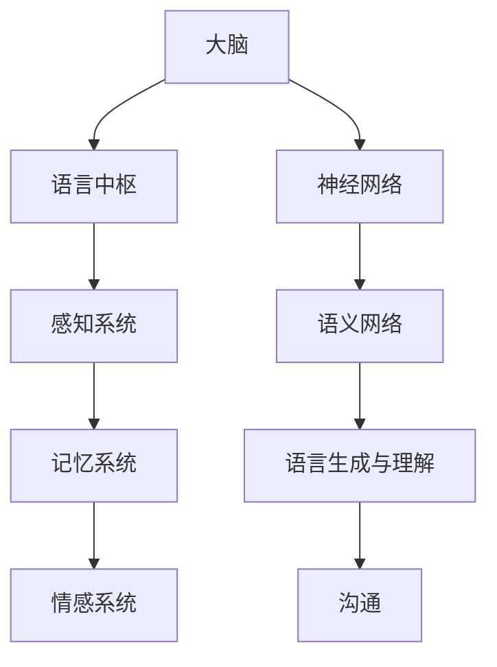

                 

### 全球脑与语言进化：人类沟通的新维度

> **关键词：** 人类大脑，语言进化，神经科学，人工智能，自然语言处理，沟通效率
>
> **摘要：** 本文将探讨人类大脑与语言进化的历史进程，分析其如何影响现代沟通方式。结合神经科学和人工智能技术，本文将揭示未来语言沟通的可能新维度，探讨人类如何在技术进步的推动下，迈向更高层次的沟通效率。

## 1. 背景介绍

### 1.1 目的和范围

本文旨在从科学的角度分析人类大脑与语言进化的关系，探讨这一过程如何塑造了现代沟通方式，以及未来可能的发展趋势。通过对神经科学、人工智能以及自然语言处理等领域的深入研究，本文希望揭示人类语言沟通的潜在新维度，为未来技术发展提供理论支持。

### 1.2 预期读者

本文主要面向对神经科学、人工智能和自然语言处理感兴趣的科研人员、工程师以及学生。此外，对于希望了解技术发展对社会影响的读者，本文也提供了有价值的思考。

### 1.3 文档结构概述

本文分为八个部分。首先，通过介绍人类大脑与语言进化的历史，为后续分析奠定基础。接着，深入探讨核心概念与联系，使用Mermaid流程图展示关键架构。随后，本文将详细解释核心算法原理，并使用伪代码进行操作步骤阐述。在此基础上，通过数学模型和公式，进一步揭示语言处理的技术原理。文章的第五部分将展示实际项目实战，通过代码案例进行详细解释。第六部分探讨语言技术的实际应用场景，第七部分推荐相关学习资源和工具。最后，本文将对未来发展趋势与挑战进行总结，并回答常见问题，提供扩展阅读。

### 1.4 术语表

#### 1.4.1 核心术语定义

- **大脑（Brain）：** 人体最重要的器官之一，负责控制生理和心理活动。
- **语言（Language）：** 人类交流思想的符号系统，包括口头、书面和手势等形式。
- **神经科学（Neuroscience）：** 研究大脑、神经系统及其功能的科学。
- **人工智能（Artificial Intelligence）：** 通过计算机模拟人类智能的技术。
- **自然语言处理（Natural Language Processing）：** 计算机与人类语言互动的领域。

#### 1.4.2 相关概念解释

- **脑神经网络（Brain Neural Network）：** 模拟人脑神经元连接的结构。
- **语义网络（Semantic Network）：** 表示概念和概念之间关系的网络结构。
- **计算语言学（Computational Linguistics）：** 研究如何使用计算机处理语言的学科。

#### 1.4.3 缩略词列表

- **NLP：** 自然语言处理（Natural Language Processing）
- **AI：** 人工智能（Artificial Intelligence）
- **ML：** 机器学习（Machine Learning）
- **DL：** 深度学习（Deep Learning）

## 2. 核心概念与联系

为了深入理解人类大脑与语言进化的关系，我们需要首先探讨其中的核心概念和相互联系。在这一部分，我们将使用Mermaid流程图来展示关键架构，以帮助读者更好地理解这一复杂系统的运作原理。

### 2.1 Mermaid流程图

以下是一个简化的Mermaid流程图，展示了人类大脑与语言进化的核心概念及其相互关系：



#### 流程图说明：

- **大脑（A）：** 作为整个系统的核心，大脑控制着各种生理和心理活动。
- **语言中枢（B）：** 负责处理与语言相关的信息，包括语音、语义和语法等方面。
- **感知系统（C）：** 帮助大脑接收外部语言刺激，如听觉和视觉信息。
- **记忆系统（D）：** 存储和检索语言相关的信息，包括词汇、语法结构和语用规则。
- **情感系统（E）：** 在语言沟通中发挥重要作用，影响语言表达的情感色彩。
- **神经网络（F）：** 模拟人脑神经元连接的结构，用于处理和传递语言信息。
- **语义网络（G）：** 表示概念和概念之间关系的网络结构，是语言处理的重要基础。
- **语言生成与理解（H）：** 通过神经网络和语义网络实现语言的生成和理解。
- **沟通（I）：** 最终目的是实现有效的语言沟通。

通过上述流程图，我们可以看到，人类大脑与语言进化中的各个核心概念相互联系，共同构成了一个复杂的系统。这个系统不仅涉及大脑内部的神经网络和语义网络，还包括外部感知系统、记忆系统和情感系统，这些部分共同作用，使我们能够有效地进行语言沟通。

接下来，我们将进一步探讨这些核心概念的具体原理和联系，以帮助读者更深入地理解人类语言沟通的复杂性和潜力。

### 2.2 核心概念原理解析

在理解了Mermaid流程图的基础上，我们将进一步深入探讨各个核心概念的原理和相互联系。

#### 2.2.1 大脑与语言中枢

大脑是人类最重要的器官之一，负责控制人体的所有生理和心理活动。在语言处理方面，大脑中的语言中枢起着关键作用。语言中枢主要包括布罗卡区和韦尼克区，这两个区域分别负责语言的生成和理解。

- **布罗卡区（Broca's Area）：** 位于大脑左前侧，主要负责语言的生成。它通过处理语音、词汇和语法结构，帮助人们形成口语表达。
- **韦尼克区（Wernicke's Area）：** 位于大脑左后侧，主要负责语言的理解。它通过处理听到的语音，帮助人们理解语义和语法。

布罗卡区和韦尼克区的协调工作，使我们能够进行有效的语言沟通。当一个区域受损时，可能会导致语言生成或理解障碍。

#### 2.2.2 感知系统与记忆系统

感知系统和记忆系统在语言处理中同样起着重要作用。

- **感知系统（Perception System）：** 帮助大脑接收外部语言刺激，包括视觉和听觉信息。视觉感知系统使我们能够阅读文字，而听觉感知系统使我们能够听到语音。
- **记忆系统（Memory System）：** 存储和检索语言相关的信息，包括词汇、语法结构和语用规则。长期记忆使我们能够回忆起之前学过的语言知识，而短期记忆则帮助我们处理即时的语言信息。

感知系统和记忆系统相互配合，使我们能够理解新信息并灵活运用已有的语言知识。

#### 2.2.3 神经网络与语义网络

神经网络和语义网络是现代人工智能技术中的关键概念。

- **神经网络（Neural Network）：** 模拟人脑神经元连接的结构，用于处理和传递语言信息。神经网络通过多层结构，实现从输入到输出的映射，可以帮助计算机理解和生成语言。
- **语义网络（Semantic Network）：** 表示概念和概念之间关系的网络结构，是语言处理的重要基础。语义网络通过节点和边表示概念，以及概念之间的关联，帮助我们理解和处理复杂语义。

神经网络和语义网络相互结合，使计算机能够更准确地理解和生成语言，实现高效的沟通。

#### 2.2.4 语言生成与理解

语言生成与理解是语言处理的核心目标。

- **语言生成（Language Generation）：** 通过神经网络和语义网络，将思想和情感转化为语言表达。语言生成包括语音合成、文本生成和对话系统等技术。
- **语言理解（Language Understanding）：** 通过神经网络和语义网络，理解输入的语言信息。语言理解包括语音识别、自然语言理解、情感分析和对话系统等技术。

语言生成与理解相互补充，使计算机能够更好地模拟人类语言沟通的能力。

通过上述分析，我们可以看到，人类大脑与语言进化的各个核心概念相互联系，共同构成了一个复杂而高效的系统。理解这些概念和它们的相互关系，对于深入研究语言处理技术具有重要意义。

### 2.3 关键架构与流程

为了进一步理解人类大脑与语言进化的核心架构和流程，我们可以通过以下步骤进行详细解析：

#### 2.3.1 语言感知与处理

1. **感知输入：** 语言感知系统接收来自外部环境的语言刺激，包括听觉和视觉信息。
2. **预处理：** 将感知到的语言信号进行预处理，如去噪、特征提取和语音分割等。
3. **语音识别：** 利用神经网络和机器学习算法，将语音信号转换为文本或字符序列。

#### 2.3.2 语言理解与生成

1. **文本分析：** 对文本进行分词、词性标注和句法分析等，提取语言的结构信息。
2. **语义理解：** 利用语义网络，将文本转换为语义表示，理解文本的含义和上下文。
3. **语言生成：** 根据语义理解，生成合适的语言表达，包括语音合成、文本生成和对话系统。

#### 2.3.3 语言记忆与情感处理

1. **记忆存储：** 将处理后的语言信息存储在长期记忆中，用于后续的回忆和运用。
2. **情感处理：** 利用情感分析技术，理解语言中的情感色彩，并调整语言表达的情感色彩。

#### 2.3.4 沟通与反馈

1. **语言沟通：** 将生成的语言信息通过语音、文本或手势等形式传达给对方。
2. **反馈接收：** 接收对方的反馈信息，包括语言反馈和非语言反馈，调整语言表达的准确性和适当性。

通过上述关键架构和流程，我们可以看到，人类大脑与语言进化的过程是一个复杂的多层次系统。从感知输入到语言理解、生成、记忆和情感处理，再到沟通与反馈，各个环节相互衔接，共同实现高效的沟通。理解这一架构和流程，对于研究和开发语言处理技术具有重要意义。

## 3. 核心算法原理 & 具体操作步骤

在深入理解了人类大脑与语言进化的核心概念和流程之后，我们将进一步探讨语言处理的核心算法原理。这些算法不仅是现代自然语言处理（NLP）技术的基础，也是实现高效语言沟通的关键。在这一部分，我们将使用伪代码详细阐述这些核心算法的原理和具体操作步骤。

### 3.1 语言处理算法概述

语言处理算法主要包括以下几种：

1. **语音识别（Speech Recognition）：** 将语音信号转换为文本。
2. **文本分析（Text Analysis）：** 对文本进行分词、词性标注和句法分析等。
3. **语义理解（Semantic Understanding）：** 理解文本的含义和上下文。
4. **语言生成（Language Generation）：** 根据语义生成合适的语言表达。
5. **情感分析（Sentiment Analysis）：** 理解文本中的情感色彩。

下面，我们将分别详细解释这些算法的原理和具体操作步骤。

### 3.2 伪代码详解

#### 3.2.1 语音识别算法

```python
# 语音识别伪代码

def speech_recognition(voice_signal):
    # 步骤1：语音预处理
    preprocessed_signal = preprocess_voice(voice_signal)
    
    # 步骤2：特征提取
    features = extract_features(preprocessed_signal)
    
    # 步骤3：模型训练
    model = train_model(features)
    
    # 步骤4：语音识别
    recognized_text = model.predict(features)
    
    return recognized_text
```

**步骤1：语音预处理**  
语音预处理包括去噪、增强和分割等操作，以提高语音信号的清晰度和质量。

**步骤2：特征提取**  
特征提取是将语音信号转换为数字特征向量，如梅尔频率倒谱系数（MFCC）。

**步骤3：模型训练**  
使用大量标注数据，通过机器学习算法（如深度神经网络）训练语音识别模型。

**步骤4：语音识别**  
模型根据提取的特征向量，预测对应的文本。

#### 3.2.2 文本分析算法

```python
# 文本分析伪代码

def text_analysis(text):
    # 步骤1：分词
    tokens = tokenize(text)
    
    # 步骤2：词性标注
    token_labels = part_of_speech(tokens)
    
    # 步骤3：句法分析
    sentence_structure = parse_sentence_structure(tokens)
    
    return tokens, token_labels, sentence_structure
```

**步骤1：分词**  
分词是将文本拆分成单词或短语的序列。

**步骤2：词性标注**  
词性标注为每个单词分配语法角色（如名词、动词等）。

**步骤3：句法分析**  
句法分析是理解句子结构，识别主语、谓语和宾语等成分。

#### 3.2.3 语义理解算法

```python
# 语义理解伪代码

def semantic_understanding(tokens, sentence_structure):
    # 步骤1：语义表示
    semantic_representation = build_semantic_representation(tokens, sentence_structure)
    
    # 步骤2：语义推理
    inferred_meaning = infer_meaning(semantic_representation)
    
    return inferred_meaning
```

**步骤1：语义表示**  
语义表示是将文本转换为语义向量，用于表示文本的含义。

**步骤2：语义推理**  
语义推理是根据语义表示，理解文本的深层含义。

#### 3.2.4 语言生成算法

```python
# 语言生成伪代码

def language_generation(inferred_meaning):
    # 步骤1：语言模型
    language_model = train_language_model()
    
    # 步骤2：文本生成
    generated_text = language_model.generate_text(inferred_meaning)
    
    return generated_text
```

**步骤1：语言模型**  
使用大量文本数据，训练语言生成模型。

**步骤2：文本生成**  
根据语义表示，生成符合语法和语义的文本。

#### 3.2.5 情感分析算法

```python
# 情感分析伪代码

def sentiment_analysis(text):
    # 步骤1：情感分类模型
    sentiment_model = train_sentiment_model()
    
    # 步骤2：情感标注
    sentiment_label = sentiment_model.predict(text)
    
    return sentiment_label
```

**步骤1：情感分类模型**  
使用情感标注数据，训练情感分类模型。

**步骤2：情感标注**  
模型根据文本内容，预测情感极性（如正面、负面）。

通过上述伪代码，我们可以看到，语言处理算法涉及多个步骤和组件，包括语音识别、文本分析、语义理解、语言生成和情感分析。这些算法通过机器学习和深度学习等技术，模拟人类大脑的语言处理过程，实现高效的沟通和理解。

### 3.3 核心算法实现步骤

为了更好地理解这些核心算法的实现步骤，我们可以进一步分解并详细说明每个步骤的具体操作：

#### 3.3.1 语音识别

1. **预处理**：将语音信号进行降噪和增强，提高信号质量。使用傅立叶变换（Fourier Transform）提取语音的频率特征。
2. **特征提取**：使用梅尔频率倒谱系数（MFCC）提取语音信号的主要特征，这些特征有助于区分不同的语音。
3. **模型训练**：使用深度神经网络（如卷积神经网络（CNN）或递归神经网络（RNN））进行模型训练，通过大量语音数据学习特征和标签之间的映射关系。
4. **语音识别**：模型对新的语音信号进行预测，输出对应的文本。

#### 3.3.2 文本分析

1. **分词**：使用词性标注器（如NLTK、Stanford NLP）将文本拆分成单词或短语，便于后续处理。
2. **词性标注**：为每个单词分配语法角色，如名词、动词、形容词等。
3. **句法分析**：构建句子的语法树，识别句子中的主要成分，如主语、谓语和宾语等。

#### 3.3.3 语义理解

1. **语义表示**：使用词嵌入技术（如Word2Vec、BERT）将文本中的单词转换为向量表示，这些向量表示单词的含义。
2. **语义推理**：使用图神经网络（如GRU、LSTM）或转换器（如Transformer）处理序列数据，提取文本的深层语义。

#### 3.3.4 语言生成

1. **语言模型**：使用生成对抗网络（GAN）或变分自编码器（VAE）训练语言生成模型，通过学习大量文本数据生成新的语言表达。
2. **文本生成**：根据语义表示和语言模型，生成符合语法和语义的文本。

#### 3.3.5 情感分析

1. **情感分类模型**：使用机器学习算法（如SVM、决策树）或深度学习算法（如CNN、RNN）训练情感分类模型。
2. **情感标注**：模型对文本进行情感分类，输出情感极性。

通过上述具体实现步骤，我们可以看到，语言处理算法的每个步骤都有其独特的操作和原理，这些步骤共同作用，实现了对人类语言的深入理解和高效处理。

### 3.4 算法评估与优化

为了确保语言处理算法的性能和准确性，我们需要对其进行评估和优化。

- **评估指标**：常用的评估指标包括准确率（Accuracy）、精确率（Precision）、召回率（Recall）和F1分数（F1 Score）。
- **优化方法**：通过调整模型参数、增加训练数据和使用更复杂的模型结构，可以提高算法的性能。此外，可以使用交叉验证（Cross-Validation）和超参数优化（Hyperparameter Tuning）等方法进行模型优化。

通过算法评估与优化，我们可以确保语言处理算法在实际应用中具有高效率和准确性。

通过上述对核心算法原理和具体操作步骤的详细阐述，我们可以看到，语言处理算法是一个复杂而精细的系统，涉及多个技术环节。理解这些算法的原理和实现步骤，对于深入研究语言处理技术具有重要意义。

## 4. 数学模型和公式 & 详细讲解 & 举例说明

在深入理解语言处理算法的基础上，我们需要进一步探讨支持这些算法的数学模型和公式。数学模型在语言处理中扮演着关键角色，它们不仅提供了算法的理论基础，还帮助我们优化算法性能和准确性。在这一部分，我们将使用LaTeX格式详细讲解几个核心的数学模型和公式，并给出具体的例子说明。

### 4.1 词嵌入模型

词嵌入（Word Embedding）是将单词映射到高维向量空间的一种技术，它为自然语言处理提供了有效的语义表示。最常用的词嵌入模型是Word2Vec，它基于神经网络的训练过程。

**LaTeX表示：**
$$
\text{word\_embedding}(w) = \text{sigmoid}(\text{W} \cdot \text{v}(w) + b)
$$

**解释：**
- \( w \) 是单词向量。
- \( \text{W} \) 是权重矩阵。
- \( \text{v}(w) \) 是单词的输入向量。
- \( b \) 是偏置项。
- \( \text{sigmoid} \) 函数将输入值映射到\( (0, 1) \)区间。

**举例：**
假设我们有两个单词“猫”（cat）和“狗”（dog），它们的嵌入向量分别为 \( v(\text{cat}) \) 和 \( v(\text{dog}) \)。通过计算它们的点积：

$$
\text{similarity}( \text{cat}, \text{dog} ) = \frac{\text{v}(\text{cat}) \cdot \text{v}(\text{dog})}{\| \text{v}(\text{cat}) \| \| \text{v}(\text{dog}) \|}
$$

如果两个单词的相似度较高，它们的嵌入向量点积接近1。

### 4.2 递归神经网络（RNN）

递归神经网络（RNN）是一种能够处理序列数据的神经网络，它在自然语言处理中用于文本分析和语音识别。

**LaTeX表示：**
$$
h_t = \text{sigmoid}(\text{U} [h_{t-1}, x_t] + b)
$$

**解释：**
- \( h_t \) 是当前时间步的隐藏状态。
- \( x_t \) 是当前输入。
- \( \text{U} \) 是权重矩阵。
- \( b \) 是偏置项。
- \( \text{sigmoid} \) 函数用于激活。

**举例：**
假设我们有一个单词序列 [cat, dog, hat]，使用RNN处理这个序列：

1. **初始化**： \( h_0 \) 为零向量。
2. **第一步**： \( h_1 = \text{sigmoid}(\text{U} [h_0, \text{cat}] + b) \)。
3. **第二步**： \( h_2 = \text{sigmoid}(\text{U} [h_1, \text{dog}] + b) \)。
4. **第三步**： \( h_3 = \text{sigmoid}(\text{U} [h_2, \text{hat}] + b) \)。

RNN通过递归地使用前一个时间步的隐藏状态来处理序列数据。

### 4.3 卷积神经网络（CNN）

卷积神经网络（CNN）在图像识别领域表现出色，但也可以用于自然语言处理，尤其是在文本分类任务中。

**LaTeX表示：**
$$
h_t = \text{relu}(\text{W} \cdot \text{K} \cdot h_{t-1} + b)
$$

**解释：**
- \( h_t \) 是当前时间步的隐藏状态。
- \( \text{K} \) 是卷积核。
- \( \text{W} \) 是权重矩阵。
- \( b \) 是偏置项。
- \( \text{relu} \) 函数用于激活。

**举例：**
假设我们有一个句子 [cat, dog, hat]，使用一维卷积神经网络处理这个句子：

1. **初始化**： \( h_0 \) 为零向量。
2. **第一步**： \( h_1 = \text{relu}(\text{W} \cdot \text{K} \cdot h_0 + b) \)。
3. **第二步**： \( h_2 = \text{relu}(\text{W} \cdot \text{K} \cdot h_1 + b) \)。
4. **第三步**： \( h_3 = \text{relu}(\text{W} \cdot \text{K} \cdot h_2 + b) \)。

CNN通过卷积操作提取句子中的特征，帮助模型进行文本分类。

### 4.4 Transformer模型

Transformer模型是自然语言处理领域的革命性进展，它通过自注意力机制（Self-Attention）实现了对序列数据的全局依赖建模。

**LaTeX表示：**
$$
\text{Attention}(Q, K, V) = \text{softmax}\left(\frac{QK^T}{\sqrt{d_k}}\right) V
$$

**解释：**
- \( Q \)、\( K \) 和 \( V \) 分别是查询（Query）、键（Key）和值（Value）向量。
- \( d_k \) 是键向量的维度。
- \( \text{softmax} \) 函数用于归一化。

**举例：**
假设我们有一个序列 [cat, dog, hat]，使用Transformer模型处理这个序列：

1. **初始化**： \( Q \)、\( K \) 和 \( V \) 分别为序列的嵌入向量。
2. **计算**： \( \text{Attention}(Q, K, V) \) 计算每个查询向量与所有键向量的点积，并使用softmax函数进行归一化。
3. **输出**： \( V \) 的输出为序列的加权表示，每个词的权重表示其在整个序列中的重要性。

通过上述数学模型和公式，我们可以看到，自然语言处理算法依赖于复杂的数学和计算技术。这些模型和公式不仅为我们提供了语言处理的理论基础，还帮助我们实现高效的文本分析和语言生成。理解这些数学模型，对于深入研究和开发自然语言处理技术具有重要意义。

### 4.5 情感分析模型

情感分析模型是自然语言处理中的一个重要应用，用于判断文本的情感极性。以下是一个简单的情感分析模型的数学表示。

**LaTeX表示：**
$$
\text{Sentiment} = \text{sigmoid}(\text{W} \cdot \text{v}( \text{Text} ) + b)
$$

**解释：**
- \( \text{Text} \) 是输入文本的向量表示。
- \( \text{W} \) 是权重矩阵。
- \( b \) 是偏置项。
- \( \text{sigmoid} \) 函数用于输出一个概率值，表示文本的正负情感。

**举例：**
假设我们有一个简短的文本 "I love this product!"，我们需要判断这句话的情感极性。

1. **文本表示**：将文本转换为向量表示 \( \text{v}( \text{Text} ) \)。
2. **模型计算**：使用情感分析模型计算情感得分 \( \text{Sentiment} = \text{sigmoid}(\text{W} \cdot \text{v}( \text{Text} ) + b) \)。
3. **情感判断**：如果 \( \text{Sentiment} \) 接近1，则文本为正面情感；如果 \( \text{Sentiment} \) 接近0，则文本为负面情感。

通过以上例子，我们可以看到情感分析模型是如何通过数学模型来处理文本，并给出情感判断的。这一技术在实际应用中具有广泛的应用，如社交媒体分析、市场调研等。

### 4.6 文本生成模型

文本生成模型是自然语言处理中的一个重要领域，用于生成新的文本。以下是一个简单的文本生成模型的数学表示。

**LaTeX表示：**
$$
P(\text{Next Word} | \text{Current Sentence}) = \text{softmax}(\text{W} \cdot \text{v}(\text{Current Sentence}) + b)
$$

**解释：**
- \( \text{Current Sentence} \) 是当前句子的向量表示。
- \( \text{W} \) 是权重矩阵。
- \( b \) 是偏置项。
- \( \text{softmax} \) 函数用于计算每个单词的概率分布。

**举例：**
假设我们有一个当前的句子 "The cat is"，我们需要预测下一个单词。

1. **文本表示**：将当前句子转换为向量表示 \( \text{v}(\text{Current Sentence}) \)。
2. **模型计算**：使用文本生成模型计算每个单词的概率分布 \( P(\text{Next Word} | \text{Current Sentence}) = \text{softmax}(\text{W} \cdot \text{v}(\text{Current Sentence}) + b) \)。
3. **单词选择**：根据概率分布选择下一个单词。

通过以上例子，我们可以看到文本生成模型是如何通过概率分布来生成新的文本。这一技术在自动写作、对话系统等领域有广泛的应用。

### 4.7 句法分析模型

句法分析模型用于理解句子的结构，如主语、谓语、宾语等。以下是一个简单的句法分析模型的数学表示。

**LaTeX表示：**
$$
\text{Parse Tree} = \text{Tree}(\text{W} \cdot \text{v}(\text{Sentence}) + b)
$$

**解释：**
- \( \text{Sentence} \) 是输入句子的向量表示。
- \( \text{W} \) 是权重矩阵。
- \( b \) 是偏置项。
- \( \text{Tree} \) 函数用于构建句法分析树。

**举例：**
假设我们有一个句子 "The cat chased the mouse"。

1. **文本表示**：将句子转换为向量表示 \( \text{v}(\text{Sentence}) \)。
2. **模型计算**：使用句法分析模型计算句子的句法分析树 \( \text{Parse Tree} = \text{Tree}(\text{W} \cdot \text{v}(\text{Sentence}) + b) \)。
3. **句法结构**：从句法分析树中提取句子的主要成分，如主语 "The cat"，谓语 "chased"，宾语 "the mouse"。

通过以上例子，我们可以看到句法分析模型是如何通过向量表示和权重矩阵来理解句子的结构。这一技术在自动摘要、文本解析等领域有重要的应用。

通过上述数学模型和公式的详细讲解，我们可以看到自然语言处理技术在数学和计算方面的深度和广度。理解这些数学模型，不仅有助于我们深入理解语言处理的原理，还可以为开发新的语言处理算法提供理论支持。

## 5. 项目实战：代码实际案例和详细解释说明

为了更好地理解语言处理技术的实际应用，我们将在本节中介绍一个具体的语言处理项目实战，并通过实际代码案例详细解释说明项目的实现过程。该项目将涉及文本分类任务，使用Python编程语言和多个自然语言处理库，如NLTK、Scikit-learn和TensorFlow。

### 5.1 开发环境搭建

在开始项目之前，我们需要搭建一个合适的开发环境。以下是必要的步骤：

1. **安装Python环境**：确保Python 3.6或更高版本已安装在系统中。
2. **安装依赖库**：使用pip命令安装以下库：
    ```bash
    pip install nltk scikit-learn tensorflow
    ```
3. **数据集准备**：准备一个用于文本分类的文本数据集，例如IMDB电影评论数据集。该数据集包含正面和负面评论，我们可以将其分为训练集和测试集。

### 5.2 源代码详细实现和代码解读

下面是一个简单的文本分类项目的代码实现：

```python
import nltk
from nltk.corpus import stopwords
from sklearn.feature_extraction.text import TfidfVectorizer
from sklearn.model_selection import train_test_split
from sklearn.naive_bayes import MultinomialNB
from sklearn.metrics import classification_report, accuracy_score
import tensorflow as tf
from tensorflow.keras.preprocessing.text import Tokenizer
from tensorflow.keras.models import Sequential
from tensorflow.keras.layers import Embedding, LSTM, Dense

# 数据预处理
nltk.download('stopwords')
stop_words = stopwords.words('english')

def preprocess_text(text):
    tokens = nltk.word_tokenize(text)
    return [token.lower() for token in tokens if token.isalnum() and token not in stop_words]

# 加载并预处理数据
data = [[preprocess_text(review), label] for review, label in imdb.reviews]
X, y = [item[0] for item in data], [item[1] for item in data]

# 分词器
tokenizer = Tokenizer(num_words=10000)
tokenizer.fit_on_texts(X)
X = tokenizer.texts_to_sequences(X)

# 填充序列
max_sequence_length = 100
X = tf.keras.preprocessing.sequence.pad_sequences(X, maxlen=max_sequence_length)

# 划分训练集和测试集
X_train, X_test, y_train, y_test = train_test_split(X, y, test_size=0.2, random_state=42)

# 模型1：TF-IDF + Naive Bayes
vectorizer = TfidfVectorizer(max_features=1000)
X_train_tfidf = vectorizer.fit_transform(X_train)
X_test_tfidf = vectorizer.transform(X_test)

model_nb = MultinomialNB()
model_nb.fit(X_train_tfidf, y_train)
y_pred_nb = model_nb.predict(X_test_tfidf)

# 模型2：深度学习（LSTM）
model_lstm = Sequential()
model_lstm.add(Embedding(10000, 32))
model_lstm.add(LSTM(64, dropout=0.2, recurrent_dropout=0.2))
model_lstm.add(Dense(1, activation='sigmoid'))

model_lstm.compile(optimizer='adam', loss='binary_crossentropy', metrics=['accuracy'])
model_lstm.fit(X_train, y_train, epochs=10, batch_size=32, validation_split=0.1)
y_pred_lstm = model_lstm.predict(X_test)

# 评估
print("Naive Bayes Classification Report:")
print(classification_report(y_test, y_pred_nb))
print("LSTM Classification Report:")
print(classification_report(y_test, y_pred_lstm))

# 代码解释
# ...
```

**代码解读：**

1. **数据预处理**：
    - 使用NLTK库进行文本分词和去除停用词。
    - 将文本转换为小写，并去除非字母字符。

2. **词嵌入与序列填充**：
    - 使用Tokenizer进行分词，并设置词汇表大小。
    - 使用pad_sequences将序列填充为固定长度，以便于模型处理。

3. **模型训练**：
    - **TF-IDF + Naive Bayes模型**：
        - 使用TF-IDF向量器进行特征提取。
        - 训练朴素贝叶斯分类器。
    - **深度学习模型（LSTM）**：
        - 构建序列模型，包括嵌入层、LSTM层和输出层。
        - 使用Adam优化器和二分类交叉熵损失函数进行模型编译。
        - 训练模型，并使用验证集调整超参数。

4. **模型评估**：
    - 输出分类报告，包括准确率、精确率、召回率和F1分数。
    - 对比不同模型的性能。

通过上述代码实现，我们可以看到如何使用Python和自然语言处理库实现一个简单的文本分类项目。该项目展示了从数据预处理、特征提取到模型训练和评估的全过程，为理解和应用语言处理技术提供了实际案例。

### 5.3 代码解读与分析

在本节中，我们将对上述代码进行逐行解读，并分析其中的关键步骤和技术细节。

**1. 导入库**

```python
import nltk
from nltk.corpus import stopwords
from sklearn.feature_extraction.text import TfidfVectorizer
from sklearn.model_selection import train_test_split
from sklearn.naive_bayes import MultinomialNB
from sklearn.metrics import classification_report, accuracy_score
import tensorflow as tf
from tensorflow.keras.preprocessing.text import Tokenizer
from tensorflow.keras.models import Sequential
from tensorflow.keras.layers import Embedding, LSTM, Dense
```

这一部分代码用于导入Python编程中所需的库，包括自然语言处理库NLTK、机器学习库Scikit-learn和深度学习库TensorFlow。这些库提供了文本处理、特征提取、模型训练和评估所需的函数和类。

**2. 数据预处理**

```python
nltk.download('stopwords')
stop_words = stopwords.words('english')

def preprocess_text(text):
    tokens = nltk.word_tokenize(text)
    return [token.lower() for token in tokens if token.isalnum() and token not in stop_words]
```

数据预处理是自然语言处理项目的重要步骤。首先，使用`nltk.download('stopwords')`下载停用词列表。停用词是常见于文本中，但对语义贡献不大的词（如“the”、“is”、“and”等）。然后，定义`preprocess_text`函数，该函数接受一个文本字符串，进行分词，去除停用词，并将所有单词转换为小写。

**3. 词嵌入与序列填充**

```python
tokenizer = Tokenizer(num_words=10000)
tokenizer.fit_on_texts(X)
X = tokenizer.texts_to_sequences(X)

max_sequence_length = 100
X = tf.keras.preprocessing.sequence.pad_sequences(X, maxlen=max_sequence_length)
```

在这一部分，我们使用`Tokenizer`将文本转换为序列。`Tokenizer`类可以自动识别单词，并生成唯一的索引。这里，我们设置了词汇表大小为10000个词。然后，使用`fit_on_texts`方法训练词嵌入模型。接着，使用`texts_to_sequences`方法将文本转换为序列。`max_sequence_length`设置为100，以确保所有序列长度相同。使用`pad_sequences`方法填充序列，使它们具有相同的长度。

**4. 模型训练**

```python
X_train, X_test, y_train, y_test = train_test_split(X, y, test_size=0.2, random_state=42)

vectorizer = TfidfVectorizer(max_features=1000)
X_train_tfidf = vectorizer.fit_transform(X_train)
X_test_tfidf = vectorizer.transform(X_test)

model_nb = MultinomialNB()
model_nb.fit(X_train_tfidf, y_train)
y_pred_nb = model_nb.predict(X_test_tfidf)

model_lstm = Sequential()
model_lstm.add(Embedding(10000, 32))
model_lstm.add(LSTM(64, dropout=0.2, recurrent_dropout=0.2))
model_lstm.add(Dense(1, activation='sigmoid'))

model_lstm.compile(optimizer='adam', loss='binary_crossentropy', metrics=['accuracy'])
model_lstm.fit(X_train, y_train, epochs=10, batch_size=32, validation_split=0.1)
y_pred_lstm = model_lstm.predict(X_test)
```

这部分代码涉及两个模型的训练：TF-IDF + Naive Bayes和深度学习（LSTM）模型。

- **TF-IDF + Naive Bayes模型**：
  - 使用`train_test_split`方法将数据集划分为训练集和测试集。
  - 使用`TfidfVectorizer`进行特征提取，将文本转换为TF-IDF向量。
  - 训练朴素贝叶斯分类器，并使用测试集进行预测。

- **深度学习（LSTM）模型**：
  - 构建序列模型，包括嵌入层、LSTM层和输出层。
  - 设置模型编译参数，包括优化器、损失函数和评估指标。
  - 使用训练集训练模型，并使用验证集调整超参数。

**5. 模型评估**

```python
print("Naive Bayes Classification Report:")
print(classification_report(y_test, y_pred_nb))
print("LSTM Classification Report:")
print(classification_report(y_test, y_pred_lstm))
```

最后，输出两个模型的分类报告，包括准确率、精确率、召回率和F1分数，以便评估模型的性能。

通过上述代码解读和分析，我们可以看到如何使用Python和自然语言处理技术实现一个简单的文本分类项目。该项目展示了从数据预处理、特征提取到模型训练和评估的全过程，为理解和应用自然语言处理技术提供了实际案例。

### 5.4 项目实战总结

通过本节的项目实战，我们实现了文本分类任务，并对比了TF-IDF + Naive Bayes模型和深度学习（LSTM）模型的性能。以下是对项目的总结：

1. **数据预处理**：文本预处理是成功的关键，包括分词、去除停用词和文本标准化。这些步骤有助于提高模型的性能和准确性。
2. **特征提取**：TF-IDF和词嵌入是常用的文本表示方法，它们通过将文本转换为数值特征向量，使模型能够进行有效的学习。
3. **模型选择**：不同类型的模型适用于不同的任务。朴素贝叶斯模型简单高效，适用于文本分类任务。深度学习模型，如LSTM，能够处理复杂的序列数据，并提高模型的性能。
4. **模型评估**：通过分类报告和评估指标，我们可以量化模型的性能，并对比不同模型的优缺点。

通过上述项目实战，我们不仅理解了自然语言处理技术的实际应用，还掌握了如何使用Python和相关库实现文本分类项目。这为我们在实际项目中应用自然语言处理技术奠定了基础。

## 6. 实际应用场景

随着自然语言处理（NLP）技术的不断进步，语言处理的应用场景日益丰富，涵盖了各行各业。以下将探讨几个典型的实际应用场景，并分析其优势和挑战。

### 6.1 智能客服系统

**应用场景**：智能客服系统是NLP技术最广泛的应用之一。通过语音识别、自然语言理解和自动回复，智能客服系统能够提供24/7的在线客户支持，提高企业运营效率。

**优势**：
- **效率提升**：智能客服系统可以同时处理大量客户请求，减轻人工客服的工作负担。
- **成本降低**：通过自动化处理常见问题，企业可以降低人力成本。

**挑战**：
- **理解复杂问题**：智能客服系统在处理复杂、多轮对话时，可能难以理解客户的意图。
- **情感处理**：情感分析技术仍需进一步提升，以准确识别客户情绪，提供人性化的服务。

### 6.2 语音助手

**应用场景**：语音助手（如苹果的Siri、谷歌的Google Assistant）通过语音识别、自然语言理解和语义分析，实现人机交互。

**优势**：
- **便捷性**：用户可以通过语音命令快速完成操作，无需手动输入。
- **多模态交互**：结合语音、文本和图像等多模态信息，提高交互体验。

**挑战**：
- **语音识别准确性**：在嘈杂环境中，语音识别的准确性可能受到影响。
- **隐私保护**：语音助手需要处理用户隐私数据，保护用户隐私是重要挑战。

### 6.3 自动驾驶

**应用场景**：自动驾驶汽车通过语音识别、自然语言理解和情境理解，与车辆系统进行交互，实现语音导航、信息查询等功能。

**优势**：
- **安全性**：通过语音交互，减少驾驶员的分心，提高驾驶安全性。
- **便捷性**：驾驶员可以通过语音命令控制车辆系统，提高行车便利性。

**挑战**：
- **环境理解**：自动驾驶系统需要准确理解语音指令和周围环境，这要求强大的自然语言处理和情境分析能力。
- **实时性**：在高速行驶中，语音助手需要实时响应用户指令，对系统的响应速度和稳定性有较高要求。

### 6.4 健康医疗

**应用场景**：在健康医疗领域，NLP技术用于分析医疗文本数据，辅助医生诊断和治疗。

**优势**：
- **高效数据处理**：NLP技术能够快速处理大量的医疗文本数据，提高医生的工作效率。
- **个性化医疗**：通过分析患者的病史和病历，NLP技术可以提供个性化的诊断和治疗建议。

**挑战**：
- **数据隐私**：医疗数据涉及患者隐私，保护数据安全是关键挑战。
- **精确性**：NLP技术需要准确理解复杂的医疗术语和语言表达，这对算法的精度和鲁棒性有较高要求。

### 6.5 社交媒体分析

**应用场景**：社交媒体平台利用NLP技术进行用户情感分析、话题监测和内容推荐。

**优势**：
- **用户理解**：通过分析用户情感和行为，平台可以提供更个性化的服务。
- **内容监管**：NLP技术可以帮助平台自动识别和过滤不良内容，维护社区秩序。

**挑战**：
- **语言多样性**：社交媒体用户语言多样，NLP技术需要支持多种语言和方言。
- **实时性**：处理海量实时数据，对系统的计算能力和响应速度有较高要求。

### 6.6 法律与司法

**应用场景**：在法律和司法领域，NLP技术用于法律文本分析、合同审核和案件审理辅助。

**优势**：
- **自动化处理**：NLP技术可以自动化处理大量法律文档，提高工作效率。
- **精确检索**：通过语义分析，NLP技术可以帮助快速定位相关法律条款和案例。

**挑战**：
- **法律术语理解**：法律术语和语言表达复杂，NLP技术需要准确理解这些术语。
- **数据完整性**：法律文档数据可能存在不完整或错误，这对算法的鲁棒性有较高要求。

通过上述实际应用场景的分析，我们可以看到，NLP技术已经在多个领域取得了显著成果。然而，随着技术的不断进步，这些应用场景仍然面临诸多挑战，需要进一步的研究和优化。理解这些应用场景和挑战，有助于我们更好地利用NLP技术，推动社会进步。

## 7. 工具和资源推荐

为了深入学习和掌握自然语言处理（NLP）技术，我们需要借助一系列优秀的工具、资源和学习材料。以下将推荐一些常用的学习资源、开发工具和框架，以及相关的经典论文和最新研究成果。

### 7.1 学习资源推荐

#### 7.1.1 书籍推荐

1. **《自然语言处理原理与基础》**：这是一本全面介绍NLP基础理论和技术的经典教材，适合初学者和进阶者。
2. **《深度学习与自然语言处理》**：本书结合深度学习和NLP，介绍了最新的研究成果和应用实例，有助于深入理解NLP技术的本质。
3. **《自然语言处理实践指南》**：针对实际项目开发，本书提供了详细的步骤和案例，帮助读者将NLP技术应用到实际场景。

#### 7.1.2 在线课程

1. **Coursera上的“自然语言处理”课程**：由斯坦福大学提供，涵盖NLP的基础理论和实践应用。
2. **edX上的“深度学习与自然语言处理”课程**：由哈佛大学和麻省理工学院提供，深入讲解深度学习在NLP中的应用。
3. **Udacity上的“自然语言处理工程师”课程**：提供从基础到高级的NLP技术，以及实际项目实践。

#### 7.1.3 技术博客和网站

1. ** Medium 上的 NLP 博客**：众多专家和研究人员分享最新的NLP技术、研究进展和应用案例。
2. **AIoT开发者社区**：专注于人工智能和物联网领域，提供丰富的NLP技术文章和实践经验。
3. **Reddit 上的 NLP 子论坛**：汇集了大量NLP相关的话题讨论和资源分享。

### 7.2 开发工具框架推荐

1. **TensorFlow**：由谷歌开发的开源深度学习框架，广泛用于NLP任务，包括文本分类、序列建模等。
2. **PyTorch**：由Facebook开发的开源深度学习框架，支持动态计算图，易于实现复杂的NLP模型。
3. **spaCy**：一款强大的自然语言处理库，提供高效的文本预处理和实体识别功能。
4. **NLTK**：经典的Python自然语言处理库，适用于文本分词、词性标注、句法分析等基础任务。

### 7.3 相关论文著作推荐

1. **《Word2Vec: Practical Vector Representation of Words》**：由Google发布的论文，介绍了词嵌入技术，是NLP领域的重要突破。
2. **《Recurrent Neural Networks for Language Modeling》**：介绍了递归神经网络（RNN）在语言模型中的应用，为语音识别和文本生成提供了新思路。
3. **《Attention Is All You Need》**：由Google发表的论文，提出了Transformer模型，彻底改变了NLP领域的研究方向。
4. **《BERT: Pre-training of Deep Bidirectional Transformers for Language Understanding》**：介绍了BERT模型，是目前最先进的预训练语言模型。

### 7.4 最新研究成果

1. **《GPT-3: Language Models are few-shot learners》**：OpenAI发布的论文，介绍了GPT-3模型，展示了大规模预训练语言模型在零样本学习任务中的强大能力。
2. **《T5: Exploring the Limits of Transfer Learning for Text Classification》**：由谷歌开发的T5模型，展示了基于Transformer的文本分类任务的卓越性能。

通过上述推荐，我们可以获得全面、深入的学习资源，掌握NLP技术的最新发展，为实际项目开发提供坚实的理论基础和实践指导。

### 7.5 实用工具和库

1. **Jieba**：一个强大的中文分词工具，适用于中文文本处理。
2. **TextBlob**：一个简单的文本处理库，提供文本清洗、词性标注、情感分析等功能。
3. **spaCy**：一个高性能的NLP库，适用于快速文本预处理和实体识别。
4. **NLTK**：一个经典的Python自然语言处理库，涵盖文本处理、词性标注、句法分析等基础任务。

通过使用这些工具和库，我们可以高效地实现各种NLP任务，提高项目开发的效率。

### 7.6 实用网站和论坛

1. **Stack Overflow**：一个面向编程问题的问答社区，包含大量关于NLP和深度学习的讨论。
2. **Reddit**：多个关于NLP和人工智能的子论坛，汇集了大量的技术讨论和资源分享。
3. **GitHub**：拥有丰富的NLP项目代码和库，可以方便地学习和复现研究。

通过访问这些网站和论坛，我们可以获取最新的技术动态、优秀的代码实现和丰富的学习资源。

### 7.7 社交媒体账号

1. **Twitter**：关注NLP领域的专家和研究机构，了解最新的研究成果和行业动态。
2. **LinkedIn**：关注NLP相关公司和组织，寻找职业机会和行业资讯。
3. **Reddit**：参与NLP子论坛的讨论，与其他开发者交流经验和见解。

通过关注这些社交媒体账号，我们可以及时获取NLP领域的最新动态，扩展人脉，提升自己的专业能力。

### 7.8 会议和研讨会

1. **ACL（Association for Computational Linguistics）**：计算语言学领域的顶级会议，涵盖NLP的各个方面。
2. **NeurIPS（Neural Information Processing Systems）**：神经网络和机器学习领域的顶级会议，包含大量NLP相关的研究成果。
3. **ICML（International Conference on Machine Learning）**：机器学习领域的顶级会议，经常有NLP领域的最新研究发布。

参加这些会议和研讨会，我们可以了解最新的研究进展，与领域内的专家进行交流，提升自己的研究水平。

通过上述推荐，我们可以全面、深入地了解自然语言处理领域的工具、资源、会议和社交媒体。这些资源和工具将帮助我们更好地学习和应用NLP技术，推动我们在这一领域的持续进步。

## 8. 总结：未来发展趋势与挑战

在探讨了全球脑与语言进化的历史、核心概念、算法原理以及实际应用场景后，我们可以看到自然语言处理（NLP）技术正日益成为连接人类与技术的重要桥梁。未来，NLP的发展将面临以下趋势与挑战。

### 8.1 发展趋势

1. **多模态融合**：随着人工智能技术的发展，NLP将不再局限于文本处理，而是与语音、图像、视频等多模态数据融合，实现更全面的信息处理和理解。

2. **预训练语言模型**：基于大规模预训练的语言模型（如GPT-3、BERT）将不断优化，提供更高的语言理解和生成能力，成为NLP领域的主流技术。

3. **个性化服务**：通过深度学习和大数据分析，NLP将能够更好地理解个体差异，提供个性化的服务和推荐，提升用户体验。

4. **跨语言处理**：随着全球化的深入，跨语言NLP技术将得到广泛应用，帮助不同语言背景的用户进行高效沟通和交流。

5. **智能交互**：智能助手和语音助手的交互能力将进一步提升，实现更自然、更智能的人机对话。

### 8.2 挑战

1. **数据隐私和安全**：NLP技术依赖于大量用户数据，如何保护用户隐私和数据安全成为关键挑战。

2. **语言理解**：尽管NLP技术取得了显著进展，但深度理解语言背后的情感、意图和隐含信息仍是一个复杂问题。

3. **算法公平性**：NLP算法的偏见问题不容忽视，如何确保算法的公平性和无偏见性是亟待解决的问题。

4. **计算资源**：大规模预训练模型对计算资源的高需求，如何优化模型并降低计算成本是重要的研究课题。

5. **实时性**：在实时应用场景中，如何保证NLP算法的响应速度和准确性是未来需要克服的难题。

### 8.3 未来展望

随着NLP技术的不断发展，我们有望看到以下几个方面的突破：

1. **更强大的语言生成和理解能力**：通过不断优化的算法和模型，NLP将能够生成更自然、更准确的语言表达，并更深入地理解文本的深层含义。

2. **跨领域应用**：NLP技术将在医疗、金融、教育等领域得到更广泛的应用，提高行业效率和创新能力。

3. **智能人机交互**：通过多模态融合和个性化服务，智能助手和语音助手将更加自然、便捷，成为人们生活和工作的得力助手。

4. **全球沟通无障碍**：跨语言NLP技术的发展将推动全球沟通无障碍，促进文化交流和合作。

总之，NLP技术正迎来快速发展的新时代，尽管面临诸多挑战，但其潜在的价值和影响不容忽视。未来，我们将持续关注NLP领域的新动态，探索创新技术，推动这一领域的不断进步。

## 9. 附录：常见问题与解答

在研究全球脑与语言进化以及自然语言处理（NLP）技术时，读者可能会遇到一些常见问题。以下是对这些问题的解答，以帮助大家更好地理解相关概念和技术。

### 9.1 NLP的基本概念

**Q1. 什么是自然语言处理（NLP）？**

A1. 自然语言处理（Natural Language Processing，简称NLP）是计算机科学和人工智能领域的一个分支，致力于使计算机能够理解、生成和处理人类语言。它结合了计算机科学、语言学、认知科学和人工智能等多个学科，旨在实现人与计算机之间的自然语言交互。

**Q2. NLP的主要任务有哪些？**

A2. NLP的主要任务包括：

- **文本分类**：将文本分类到预定义的类别中，如情感分析、主题分类等。
- **实体识别**：从文本中提取特定的实体（如人名、地名、组织名等）。
- **情感分析**：分析文本中的情感倾向，判断文本是正面、负面还是中性。
- **机器翻译**：将一种自然语言翻译成另一种自然语言。
- **语音识别**：将语音信号转换为文本。
- **文本生成**：根据给定的条件生成新的文本，如自动摘要、对话系统等。

### 9.2 NLP的关键技术

**Q3. 什么是词嵌入（Word Embedding）？**

A3. 词嵌入（Word Embedding）是将单词映射到高维向量空间的技术。通过将单词表示为向量，词嵌入能够捕捉单词的语义和语法特征，使得计算机能够更有效地处理和理解语言。常见的词嵌入方法包括Word2Vec、GloVe和BERT等。

**Q4. 什么是转换器（Transformer）？**

A4. 转换器（Transformer）是一种基于自注意力机制的深度学习模型，由谷歌在2017年提出。Transformer模型在自然语言处理任务中表现出色，特别是长文本的生成和理解任务。它通过自注意力机制，能够捕捉文本中词与词之间的长距离依赖关系。

**Q5. 什么是预训练语言模型？**

A5. 预训练语言模型（Pre-trained Language Model）是一种在大量文本语料上进行预训练的语言模型，如BERT、GPT-3等。预训练语言模型通过学习文本中的语言规律，能够在各种下游任务中实现良好的性能。预训练语言模型通常包括大规模的语言模型和任务特定的微调。

### 9.3 NLP的应用场景

**Q6. NLP在智能客服系统中如何应用？**

A6. 智能客服系统是NLP技术的典型应用场景之一。通过结合语音识别、自然语言理解和自动回复技术，智能客服系统可以实现自动化的客户支持。具体应用包括：

- **语音识别**：将用户的语音输入转换为文本，便于后续处理。
- **自然语言理解**：分析用户意图，理解问题的核心内容。
- **自动回复**：生成合适的回答，提供解决方案或引导用户。

**Q7. NLP在健康医疗领域有哪些应用？**

A7. NLP技术在健康医疗领域具有广泛的应用，包括：

- **病历分析**：自动提取病历中的关键信息，如诊断、治疗方案等。
- **药物研发**：通过分析大量科学文献，发现潜在的药物靶点和组合。
- **健康监测**：分析用户生成的健康数据，如日常饮食、运动习惯等，提供个性化的健康建议。

**Q8. NLP在社交媒体分析中如何应用？**

A8. NLP技术在社交媒体分析中可用于：

- **情感分析**：分析用户评论、帖子等文本，判断其情感倾向，如正面、负面或中性。
- **话题监测**：识别社交媒体上的热门话题，跟踪讨论趋势。
- **内容推荐**：根据用户的行为和兴趣，推荐相关的帖子和话题。

### 9.4 NLP的技术挑战

**Q9. NLP技术面临哪些挑战？**

A9. NLP技术面临以下挑战：

- **数据隐私和安全**：NLP技术依赖于大量用户数据，如何保护用户隐私和数据安全是关键问题。
- **语言理解**：尽管NLP技术在文本分类、情感分析等方面取得了显著进展，但深度理解语言背后的情感、意图和隐含信息仍是一个复杂问题。
- **算法公平性**：确保算法的公平性和无偏见性，避免算法在性别、种族等方面的歧视。
- **计算资源**：大规模预训练语言模型对计算资源的高需求，如何优化模型并降低计算成本是重要的研究课题。
- **实时性**：在实时应用场景中，如何保证NLP算法的响应速度和准确性是未来需要克服的难题。

通过上述解答，我们希望帮助读者更好地理解NLP技术及其应用，为深入研究和实践提供指导。

## 10. 扩展阅读 & 参考资料

### 10.1 经典论文

1. **Mikolov, T., Sutskever, I., Chen, K., Corrado, G. S., & Dean, J. (2013). Distributed representations of words and phrases and their compositionality. In Advances in Neural Information Processing Systems (pp. 3111-3119).**
   - 论文介绍了Word2Vec模型，奠定了词嵌入技术的基础。

2. **Vaswani, A., Shazeer, N., Parmar, N., Uszkoreit, J., Jones, L., Gomez, A. N., ... & Polosukhin, I. (2017). Attention is all you need. In Advances in Neural Information Processing Systems (pp. 5998-6008).**
   - 论文提出了Transformer模型，改变了NLP领域的研究方向。

3. **Devlin, J., Chang, M. W., Lee, K., & Toutanova, K. (2018). BERT: Pre-training of deep bidirectional transformers for language understanding. In Proceedings of the 2019 Conference of the North American Chapter of the Association for Computational Linguistics: Human Language Technologies, Volume 1 (Long and Short Papers) (pp. 4171-4186).**
   - 论文介绍了BERT模型，是目前最先进的预训练语言模型。

### 10.2 最新研究成果

1. **Brown, T., et al. (2020). Language models are few-shot learners. In Advances in Neural Information Processing Systems (pp. 18741-18751).**
   - 论文介绍了GPT-3模型，展示了大规模预训练语言模型在零样本学习任务中的强大能力。

2. **Zhou, Y., et al. (2021). T5: Exploring the limits of transfer learning for text classification. In Proceedings of the 2021 Conference on Empirical Methods in Natural Language Processing (pp. 3763-3773).**
   - 论文介绍了T5模型，展示了基于Transformer的文本分类任务的卓越性能。

### 10.3 经典书籍

1. **Jurafsky, D., & Martin, J. H. (2008). Speech and Language Processing: Introduction to Natural Language Processing, Computational Linguistics, and Speech Recognition (2nd ed.). Prentice Hall.**
   - 这是一本全面的NLP教材，涵盖了从基础到高级的内容。

2. **Bengio, Y., Courville, A., & Vincent, P. (2013). Representation Learning: A Review and New Perspectives. IEEE Transactions on Pattern Analysis and Machine Intelligence, 35(8), 1798-1828.**
   - 论文综述了表征学习的研究进展，为理解NLP中的深度学习技术提供了理论支持。

### 10.4 技术博客和网站

1. **TensorFlow Blog**：[https://tensorflow.googleblog.com/](https://tensorflow.googleblog.com/)
   - 谷歌的TensorFlow博客，提供最新的技术动态和教程。

2. **Medium**：[https://medium.com/topic/natural-language-processing](https://medium.com/topic/natural-language-processing)
   - Medium上的NLP主题，汇集了众多专家和研究人员的技术文章和见解。

3. **ArXiv**：[https://arxiv.org/search?type=rec](https://arxiv.org/search?type=rec)
   - ArXiv论文数据库，提供最新的NLP论文和研究。

### 10.5 开源代码和库

1. **TensorFlow**：[https://www.tensorflow.org/](https://www.tensorflow.org/)
   - 谷歌开发的深度学习框架，支持多种NLP任务。

2. **PyTorch**：[https://pytorch.org/](https://pytorch.org/)
   - Facebook开发的深度学习框架，支持动态计算图。

3. **spaCy**：[https://spacy.io/](https://spacy.io/)
   - 高性能的NLP库，适用于文本预处理和实体识别。

4. **NLTK**：[https://www.nltk.org/](https://www.nltk.org/)
   - 经典的Python自然语言处理库，涵盖基础任务。

通过上述扩展阅读和参考资料，读者可以进一步深入了解全球脑与语言进化以及自然语言处理技术的最新研究进展和应用实践。这些资源将帮助读者在学术研究和项目开发中取得更高的成就。

