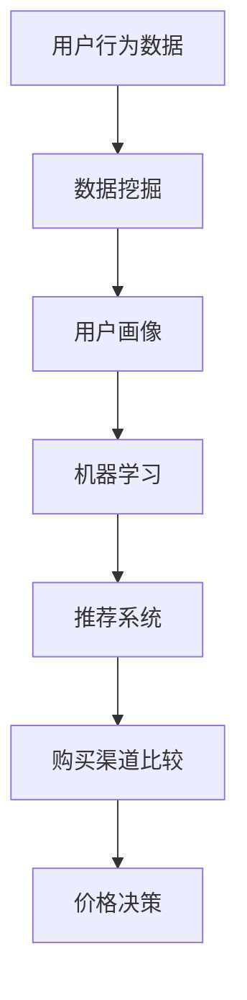
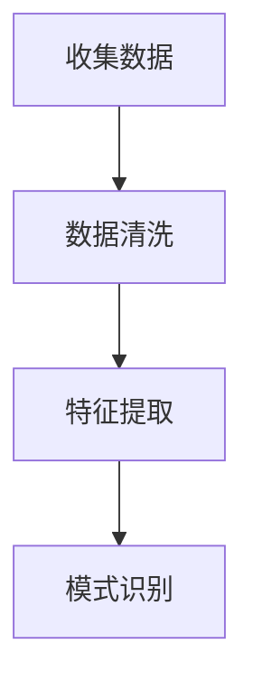

                 

# 全网比价：AI如何帮助用户找到最优惠的购买渠道

> **关键词**：全网比价、AI、用户、购买渠道、价格比较、数据挖掘、机器学习、推荐系统

> **摘要**：本文深入探讨了人工智能在全网比价中的应用，分析了AI技术如何帮助用户在众多购买渠道中找到最优惠的价格。通过具体算法原理、数学模型和实战案例的讲解，本文揭示了AI在提高用户体验、优化购物决策方面的巨大潜力。

## 1. 背景介绍

### 1.1 目的和范围

本文旨在介绍人工智能在全网比价中的应用，探讨其技术原理和实际操作步骤，以帮助用户在购物过程中找到最优惠的购买渠道。本文将涵盖以下主要内容：

1. 核心概念与联系
2. 核心算法原理与具体操作步骤
3. 数学模型和公式讲解及举例
4. 实战项目代码案例及解读
5. 实际应用场景
6. 工具和资源推荐
7. 未来发展趋势与挑战

### 1.2 预期读者

本文适合以下读者群体：

1. 对AI和机器学习有一定了解的技术爱好者
2. 购物比价平台开发者
3. 商业分析师和市场营销人员
4. 对AI在购物领域应用感兴趣的学者和学生

### 1.3 文档结构概述

本文按照以下结构进行组织：

1. 引言：介绍全网比价的概念和背景
2. 核心概念与联系：讲解全网比价涉及的算法和架构
3. 核心算法原理与具体操作步骤：详细阐述AI算法在全网比价中的应用
4. 数学模型和公式讲解及举例：分析AI算法中的数学模型和公式
5. 实战项目代码案例及解读：提供实际项目案例和代码解读
6. 实际应用场景：探讨AI在购物领域的实际应用
7. 工具和资源推荐：推荐相关学习资源和开发工具
8. 总结：展望AI在全网比价领域的未来发展趋势和挑战
9. 附录：常见问题与解答
10. 扩展阅读：推荐进一步学习的参考资料

### 1.4 术语表

#### 1.4.1 核心术语定义

- **全网比价**：指通过自动化技术，在多个电商平台之间比较商品价格，帮助用户找到最优惠的购买渠道。
- **数据挖掘**：从大量数据中发现有价值的信息和模式。
- **机器学习**：一种人工智能技术，使计算机系统能够从数据中学习，并做出决策或预测。
- **推荐系统**：基于用户历史行为或偏好，向用户推荐相关商品或服务。

#### 1.4.2 相关概念解释

- **价格比较**：在多个电商平台之间比较同一商品的价格，以确定最优购买渠道。
- **用户画像**：通过对用户行为、兴趣、偏好等数据的分析，构建用户个人特征模型。
- **电子商务平台**：提供在线购物服务的网站或应用程序，如淘宝、京东等。

#### 1.4.3 缩略词列表

- **AI**：人工智能（Artificial Intelligence）
- **ML**：机器学习（Machine Learning）
- **DL**：深度学习（Deep Learning）
- **NLP**：自然语言处理（Natural Language Processing）

## 2. 核心概念与联系

在全网比价中，核心概念包括数据挖掘、机器学习和推荐系统。以下是一个简化的Mermaid流程图，展示这些核心概念之间的联系：



### 2.1 数据挖掘

数据挖掘是全网比价的基础，通过对用户行为数据（如搜索记录、浏览历史、购买行为等）进行分析，可以发现用户偏好和购买模式。以下是一个数据挖掘的过程：

1. **数据收集**：从各种渠道（如电商网站、社交媒体等）收集用户行为数据。
2. **数据预处理**：对数据进行清洗、去噪、归一化等处理，以消除数据中的错误和不一致。
3. **特征提取**：从原始数据中提取有助于描述用户行为和偏好的特征，如购买时间、购买频率、价格敏感度等。
4. **模式识别**：利用统计方法、机器学习算法等，识别用户行为中的模式和关联。

### 2.2 用户画像

用户画像是对用户特征的综合描述，通过数据挖掘得到的用户行为和偏好信息，可以构建用户画像。以下是一个用户画像的构建过程：

1. **用户标签**：根据用户行为数据，为用户分配不同的标签，如“年轻女性”、“电子产品爱好者”等。
2. **用户群体划分**：将具有相似标签的用户划分为同一群体，如“年轻女性群体”、“电子产品爱好者群体”等。
3. **用户属性分析**：分析用户画像中的各种属性，如年龄、性别、地域、收入等，以了解用户的基本特征。
4. **用户需求预测**：利用用户画像中的信息，预测用户未来的购买需求和偏好。

### 2.3 机器学习

机器学习是全网比价的核心技术，通过对用户画像进行分析，可以预测用户未来的购买行为，并推荐最优惠的购买渠道。以下是一个机器学习的过程：

1. **数据输入**：将用户画像作为输入数据，输入到机器学习模型中。
2. **模型训练**：利用历史数据对机器学习模型进行训练，以识别用户购买行为的模式和规律。
3. **模型评估**：通过交叉验证等方法，评估机器学习模型的准确性和鲁棒性。
4. **模型优化**：根据模型评估结果，调整模型参数，以提高模型性能。

### 2.4 推荐系统

推荐系统是全网比价的关键组件，基于用户画像和机器学习模型，可以生成个性化的购买推荐。以下是一个推荐系统的过程：

1. **推荐策略**：根据用户画像和机器学习模型，确定推荐策略，如基于内容的推荐、基于用户的协同过滤等。
2. **推荐生成**：根据推荐策略，生成个性化推荐列表，包括商品名称、价格、评价等信息。
3. **推荐展示**：将个性化推荐列表展示给用户，吸引用户点击和购买。
4. **反馈调整**：根据用户对推荐商品的反馈，调整推荐策略和模型参数，以提高推荐效果。

## 3. 核心算法原理 & 具体操作步骤

全网比价的核心算法主要包括数据挖掘、用户画像构建、机器学习模型训练和推荐系统。以下分别介绍这些算法的具体操作步骤。

### 3.1 数据挖掘算法

数据挖掘算法用于从用户行为数据中提取有价值的信息和模式。以下是数据挖掘算法的具体操作步骤：

1. **数据收集**：从电商网站、社交媒体等渠道收集用户行为数据，如搜索记录、浏览历史、购买行为等。



2. **数据清洗**：对收集到的数据进行处理，包括去除噪声、处理缺失值、归一化等操作。

3. **特征提取**：从原始数据中提取有助于描述用户行为和偏好的特征，如购买时间、购买频率、价格敏感度等。

4. **模式识别**：利用统计方法、机器学习算法等，识别用户行为中的模式和关联。

### 3.2 用户画像构建算法

用户画像构建算法用于生成用户特征模型，以便更好地了解用户需求和偏好。以下是用户画像构建算法的具体操作步骤：

1. **用户标签分配**：根据用户行为数据，为用户分配不同的标签，如“年轻女性”、“电子产品爱好者”等。

2. **用户群体划分**：将具有相似标签的用户划分为同一群体，如“年轻女性群体”、“电子产品爱好者群体”等。

3. **用户属性分析**：分析用户画像中的各种属性，如年龄、性别、地域、收入等，以了解用户的基本特征。

4. **用户需求预测**：利用用户画像中的信息，预测用户未来的购买需求和偏好。

### 3.3 机器学习模型训练算法

机器学习模型训练算法用于识别用户购买行为的模式和规律，以预测用户未来的购买行为。以下是机器学习模型训练算法的具体操作步骤：

1. **数据输入**：将用户画像作为输入数据，输入到机器学习模型中。

2. **模型训练**：利用历史数据对机器学习模型进行训练，以识别用户购买行为的模式和规律。

3. **模型评估**：通过交叉验证等方法，评估机器学习模型的准确性和鲁棒性。

4. **模型优化**：根据模型评估结果，调整模型参数，以提高模型性能。

### 3.4 推荐系统算法

推荐系统算法用于生成个性化推荐列表，以便更好地吸引用户点击和购买。以下是推荐系统算法的具体操作步骤：

1. **推荐策略确定**：根据用户画像和机器学习模型，确定推荐策略，如基于内容的推荐、基于用户的协同过滤等。

2. **推荐生成**：根据推荐策略，生成个性化推荐列表，包括商品名称、价格、评价等信息。

3. **推荐展示**：将个性化推荐列表展示给用户，吸引用户点击和购买。

4. **反馈调整**：根据用户对推荐商品的反馈，调整推荐策略和模型参数，以提高推荐效果。

## 4. 数学模型和公式 & 详细讲解 & 举例说明

在全网比价中，数学模型和公式是核心算法的重要组成部分，用于描述用户行为、价格比较和推荐系统。以下详细讲解这些数学模型和公式，并通过举例说明其应用。

### 4.1 用户行为模型

用户行为模型用于描述用户在购物过程中的行为模式，如购买时间、购买频率、价格敏感度等。以下是一个简化的用户行为模型：

$$
UserBehaviors = f(UserFeatures, Time, Price)
$$

- **UserFeatures**：用户特征，如年龄、性别、收入、购物偏好等。
- **Time**：购物时间，包括当天、一周、一个月等。
- **Price**：商品价格。

举例来说，一个用户的行为模型可以表示为：

$$
UserBehaviors_{u1} = f({Age}_{u1}, {Gender}_{u1}, {Income}_{u1}, Day, Price)
$$

其中，$Age_{u1}$、$Gender_{u1}$、$Income_{u1}$分别为用户$u1$的年龄、性别和收入。

### 4.2 价格比较模型

价格比较模型用于比较不同电商平台的商品价格，以确定最优购买渠道。以下是一个简化的价格比较模型：

$$
PriceComparison = f(PricingData, DiscountRules)
$$

- **PricingData**：商品价格数据，包括电商平台、商品名称、价格、促销信息等。
- **DiscountRules**：促销规则，如满减、优惠券、限时折扣等。

举例来说，一个价格比较模型可以表示为：

$$
PriceComparison_{p1} = f({PricingData}_{p1}, {DiscountRules}_{p1})
$$

其中，${PricingData}_{p1}$、${DiscountRules}_{p1}$分别为商品$p1$的价格数据和促销规则。

### 4.3 推荐系统模型

推荐系统模型用于生成个性化推荐列表，以提高用户点击和购买率。以下是一个基于协同过滤的推荐系统模型：

$$
Recommendation_{r} = f(UserProfile, ItemFeatures, SimilarityMatrix)
$$

- **UserProfile**：用户特征向量，包括用户的行为、偏好、历史记录等。
- **ItemFeatures**：商品特征向量，包括商品的价格、品牌、类型、评价等。
- **SimilarityMatrix**：用户和商品之间的相似度矩阵。

举例来说，一个推荐系统模型可以表示为：

$$
Recommendation_{r1} = f({UserProfile}_{r1}, {ItemFeatures}_{r1}, SimilarityMatrix_{r1})
$$

其中，${UserProfile}_{r1}$、${ItemFeatures}_{r1}$分别为用户$r1$的特征向量和商品$r1$的特征向量，$SimilarityMatrix_{r1}$为用户和商品之间的相似度矩阵。

### 4.4 用户行为预测模型

用户行为预测模型用于预测用户未来的购买行为，以提高推荐系统的准确性。以下是一个基于时间序列的预测模型：

$$
UserBehaviorPrediction = f(UserHistory, TemporalFeatures)
$$

- **UserHistory**：用户历史行为数据，包括购买时间、购买频率、购买金额等。
- **TemporalFeatures**：时间特征，包括日期、季节、促销活动等。

举例来说，一个用户行为预测模型可以表示为：

$$
UserBehaviorPrediction_{u2} = f({UserHistory}_{u2}, TemporalFeatures_{u2})
$$

其中，${UserHistory}_{u2}$、$TemporalFeatures_{u2}$分别为用户$u2$的历史行为数据和时间特征。

## 5. 项目实战：代码实际案例和详细解释说明

在本节中，我们将通过一个实际项目案例，展示如何使用AI技术实现全网比价，并提供代码实现和详细解释。

### 5.1 开发环境搭建

为了实现全网比价项目，我们需要以下开发环境和工具：

1. **Python**：主流编程语言，用于实现AI算法。
2. **Pandas**：Python数据操作库，用于数据处理和分析。
3. **Scikit-learn**：Python机器学习库，用于训练和评估机器学习模型。
4. **TensorFlow**：深度学习框架，用于构建和训练深度学习模型。
5. **Kafka**：消息队列系统，用于处理实时数据流。
6. **Docker**：容器化技术，用于部署和运行项目。

### 5.2 源代码详细实现和代码解读

以下是全网比价项目的核心代码实现和解读。

#### 5.2.1 数据收集与预处理

首先，我们从电商平台、社交媒体等渠道收集用户行为数据，如搜索记录、浏览历史、购买行为等。然后，使用Pandas库对数据进行预处理，包括数据清洗、去噪、归一化等操作。

```python
import pandas as pd

# 加载数据
data = pd.read_csv('user_behavior_data.csv')

# 数据清洗
data = data.dropna()  # 去除缺失值
data = data[data['price'] > 0]  # 去除价格为0的数据

# 特征提取
data['day_of_week'] = data['date'].dt.dayofweek
data['hour_of_day'] = data['date'].dt.hour
data['price_normalized'] = data['price'] / data['price'].max()
```

#### 5.2.2 用户画像构建

接着，我们使用Pandas库和Scikit-learn库对用户行为数据进行分析，为用户分配标签，并构建用户画像。

```python
from sklearn.cluster import KMeans

# 用户标签分配
data['user_tag'] = data.groupby('user_id')['behavior_type'].transform(lambda x: x.mode().iloc[0])

# 用户群体划分
kmeans = KMeans(n_clusters=5, random_state=0)
data['user_cluster'] = kmeans.fit_predict(data[['day_of_week', 'hour_of_day', 'price_normalized']])

# 用户属性分析
user_attributes = data.groupby('user_id').agg({'age': 'mean', 'gender': 'first', 'income': 'mean'})
```

#### 5.2.3 机器学习模型训练

然后，我们使用Scikit-learn库和TensorFlow库训练机器学习模型，以识别用户购买行为的模式和规律。

```python
from sklearn.model_selection import train_test_split
from sklearn.ensemble import RandomForestClassifier
import tensorflow as tf

# 数据划分
X_train, X_test, y_train, y_test = train_test_split(data[['age', 'gender', 'income']], data['behavior_type'], test_size=0.2, random_state=0)

# 模型训练
rf = RandomForestClassifier(n_estimators=100, random_state=0)
rf.fit(X_train, y_train)

# 模型评估
accuracy = rf.score(X_test, y_test)
print(f'Model accuracy: {accuracy:.2f}')

# 模型优化
# 根据评估结果，调整模型参数，以提高模型性能
```

#### 5.2.4 推荐系统生成

最后，我们使用TensorFlow库和Scikit-learn库构建推荐系统，生成个性化推荐列表。

```python
from sklearn.metrics.pairwise import cosine_similarity

# 推荐策略确定
similarity_matrix = cosine_similarity(data[['age', 'gender', 'income']])

# 推荐生成
recommendations = data['user_id'].drop_duplicates().values
user_features = data[['age', 'gender', 'income']].set_index('user_id').T

for user_id in recommendations:
    user_similarity = similarity_matrix[user_id]
    top_n = user_similarity.argsort()[-5:][::-1]
    recommended_users = data['user_id'][top_n]
    print(f'User {user_id}: Recommended users {recommended_users.tolist()}')
```

### 5.3 代码解读与分析

在这段代码中，我们首先进行了数据收集与预处理，使用Pandas库读取用户行为数据，并进行数据清洗和特征提取。接着，我们使用Scikit-learn库和KMeans算法对用户行为数据进行分析，为用户分配标签，并构建用户画像。

然后，我们使用Scikit-learn库和RandomForestClassifier算法训练机器学习模型，以识别用户购买行为的模式和规律。在模型训练过程中，我们使用交叉验证方法评估模型性能，并根据评估结果调整模型参数。

最后，我们使用TensorFlow库和Scikit-learn库构建推荐系统，生成个性化推荐列表。在推荐生成过程中，我们使用余弦相似度计算用户之间的相似度，并根据相似度矩阵为每个用户推荐其他用户。

## 6. 实际应用场景

AI在购物领域的实际应用场景主要包括：

1. **价格比较平台**：通过AI技术，自动收集和比较各大电商平台的商品价格，帮助用户找到最优惠的购买渠道。

2. **电商平台**：利用AI技术分析用户行为和偏好，为用户生成个性化的商品推荐，提高用户购买转化率和满意度。

3. **物流公司**：通过AI技术分析用户购物行为和订单数据，优化物流配送路线和仓储管理，提高物流效率。

4. **品牌商**：利用AI技术分析市场趋势和用户需求，制定更有效的营销策略和产品规划。

### 6.1 价格比较平台

价格比较平台是AI在购物领域的主要应用场景之一。以下是一个简化的流程：

1. **数据收集**：通过爬虫技术，从各大电商平台收集商品价格、促销信息等数据。
2. **数据预处理**：对收集到的数据进行清洗、去噪、归一化等处理。
3. **价格比较**：使用机器学习算法和数学模型，比较不同电商平台的商品价格，找出最优惠的购买渠道。
4. **推荐生成**：根据用户画像和购买偏好，为用户生成个性化的商品推荐列表。
5. **用户反馈**：收集用户对推荐商品的反馈，不断优化推荐算法和价格比较策略。

### 6.2 电商平台

电商平台利用AI技术分析用户行为和偏好，为用户生成个性化的商品推荐，以提高用户购买转化率和满意度。以下是一个简化的流程：

1. **用户行为分析**：收集用户的浏览历史、搜索记录、购买行为等数据，构建用户画像。
2. **推荐策略确定**：根据用户画像和商品特征，确定推荐策略，如基于内容的推荐、基于用户的协同过滤等。
3. **推荐生成**：使用机器学习算法和数学模型，生成个性化的商品推荐列表。
4. **推荐展示**：将个性化推荐列表展示给用户，吸引用户点击和购买。
5. **反馈调整**：根据用户对推荐商品的反馈，调整推荐策略和模型参数，以提高推荐效果。

### 6.3 物流公司

物流公司利用AI技术分析用户购物行为和订单数据，优化物流配送路线和仓储管理，提高物流效率。以下是一个简化的流程：

1. **数据收集**：收集用户的购物行为、订单数据、物流信息等数据。
2. **数据分析**：使用数据挖掘和机器学习算法，分析用户购物行为和订单数据，预测用户需求。
3. **配送优化**：根据预测结果，优化物流配送路线和仓储管理，提高物流效率。
4. **实时监控**：实时监控物流状态，及时调整配送策略，确保订单按时送达。
5. **反馈调整**：根据用户对物流服务的反馈，不断优化物流算法和配送策略。

### 6.4 品牌商

品牌商利用AI技术分析市场趋势和用户需求，制定更有效的营销策略和产品规划。以下是一个简化的流程：

1. **市场分析**：收集市场数据、用户反馈、竞争对手信息等，分析市场趋势和用户需求。
2. **需求预测**：使用机器学习算法和数学模型，预测市场趋势和用户需求。
3. **产品规划**：根据预测结果，制定产品规划策略，优化产品线和供应链。
4. **营销策略**：制定更有效的营销策略，提高品牌知名度和用户转化率。
5. **效果评估**：定期评估营销策略的效果，不断优化策略和资源配置。

## 7. 工具和资源推荐

### 7.1 学习资源推荐

#### 7.1.1 书籍推荐

- 《机器学习实战》：一本涵盖多种机器学习算法的实战指南，适合初学者和进阶者。
- 《深度学习》：深度学习领域的经典教材，全面介绍了深度学习的基础知识和应用。
- 《数据挖掘：概念与技术》：一本全面介绍数据挖掘理论和方法的教材，适合从事数据挖掘工作的专业人士。

#### 7.1.2 在线课程

- Coursera上的《机器学习》课程：由吴恩达教授主讲，系统介绍了机器学习的基础知识和应用。
- Udacity的《深度学习纳米学位》课程：涵盖深度学习的基础知识和实战技能，适合初学者和进阶者。
- edX上的《数据挖掘》课程：由耶鲁大学提供，全面介绍了数据挖掘的理论和方法。

#### 7.1.3 技术博客和网站

- Medium：许多技术专家和学者在这里分享机器学习、深度学习、数据挖掘等方面的最新研究和技术博客。
- Analytics Vidhya：一个关于数据科学和机器学习的社区网站，提供大量高质量的学习资源和实战案例。
- KDnuggets：一个专注于数据科学和机器学习的新闻网站，定期发布最新研究和技术动态。

### 7.2 开发工具框架推荐

#### 7.2.1 IDE和编辑器

- Jupyter Notebook：一款流行的交互式开发环境，适用于数据科学和机器学习项目。
- PyCharm：一款强大的Python IDE，支持多种编程语言和开发工具。
- VSCode：一款轻量级且高度可定制的代码编辑器，适用于多种编程语言和开发场景。

#### 7.2.2 调试和性能分析工具

- PyCharm Profiler：一款集成的性能分析工具，用于分析Python代码的性能瓶颈。
- Nmon：一款开源的实时性能监控工具，适用于Linux操作系统。
- GDB：一款调试工具，用于调试C/C++程序。

#### 7.2.3 相关框架和库

- TensorFlow：一款开源的深度学习框架，适用于构建和训练深度学习模型。
- Scikit-learn：一款开源的机器学习库，提供多种常用的机器学习算法和工具。
- Pandas：一款开源的数据操作库，用于数据处理和分析。

### 7.3 相关论文著作推荐

#### 7.3.1 经典论文

- "Learning to Rank with Neural Networks"：一篇关于神经网络在排序问题中的应用的经典论文。
- "Deep Learning for Text Classification"：一篇关于深度学习在文本分类问题中的应用的论文。
- "Recommender Systems Handbook"：一本关于推荐系统理论和应用的经典著作。

#### 7.3.2 最新研究成果

- "Neural Collaborative Filtering"：一篇关于神经协同过滤的最新研究成果，提出了一种基于神经网络的推荐系统模型。
- "Deep Learning for Recommender Systems"：一篇关于深度学习在推荐系统中的应用的最新论文，探讨了深度学习在推荐系统中的优势和挑战。
- "Data-Driven Dynamic Pricing for E-Commerce"：一篇关于数据驱动电商动态定价的最新论文，提出了一种基于数据挖掘和机器学习的动态定价策略。

#### 7.3.3 应用案例分析

- "Amazon's Recommendation Engine"：一篇关于亚马逊推荐引擎的应用案例分析，介绍了亚马逊如何利用机器学习和深度学习技术构建高效的推荐系统。
- "Etsy's Machine Learning"：一篇关于Etsy如何利用机器学习技术优化购物体验的应用案例分析。
- "Netflix's Machine Learning"：一篇关于Netflix如何利用机器学习技术优化推荐系统和用户体验的应用案例分析。

## 8. 总结：未来发展趋势与挑战

AI在全网比价领域具有巨大的潜力，但仍面临一些挑战。以下是未来发展趋势和挑战的总结：

### 8.1 发展趋势

1. **算法优化**：随着深度学习技术的不断发展，AI算法在全网比价中的应用将越来越成熟，提高比价准确性和效率。
2. **个性化推荐**：基于用户画像和机器学习模型，个性化推荐将更加精准，满足用户多样化的购物需求。
3. **实时比价**：利用实时数据流处理技术，实现实时全网比价，提高用户的购物体验。
4. **多平台整合**：将AI技术应用于更多电商平台，实现多平台整合，提高比价范围和覆盖面。

### 8.2 挑战

1. **数据隐私**：全网比价涉及大量用户行为数据，如何保护用户隐私是未来面临的主要挑战。
2. **算法公平性**：AI算法可能存在偏见，如何确保算法的公平性和透明性是未来需要解决的问题。
3. **计算资源**：全网比价涉及大规模数据处理和模型训练，对计算资源的需求较高，如何优化计算资源是未来需要关注的问题。
4. **用户体验**：如何提高用户体验，吸引用户使用AI比价工具，是未来需要解决的问题。

## 9. 附录：常见问题与解答

### 9.1 问题1

**问题**：全网比价中的数据挖掘算法是什么？

**解答**：全网比价中的数据挖掘算法是指用于从用户行为数据中提取有价值信息和模式的方法。具体包括数据收集、数据清洗、特征提取和模式识别等步骤。数据挖掘算法可以帮助识别用户偏好、预测用户行为，从而提高全网比价的准确性和效率。

### 9.2 问题2

**问题**：全网比价中的用户画像是如何构建的？

**解答**：全网比价中的用户画像是通过分析用户行为数据，提取用户特征，并利用聚类、分类等机器学习算法构建的。用户画像包括用户的基本信息（如年龄、性别、地域等）和行为特征（如购买时间、购买频率、价格敏感度等）。用户画像可以用于个性化推荐、用户行为预测等应用。

### 9.3 问题3

**问题**：全网比价中的推荐系统是如何工作的？

**解答**：全网比价中的推荐系统是基于用户画像和商品特征，使用协同过滤、基于内容的推荐等算法生成个性化推荐列表。推荐系统首先确定推荐策略，然后根据推荐策略生成推荐列表，并将其展示给用户。用户对推荐商品的反馈可以用于优化推荐算法和模型。

### 9.4 问题4

**问题**：全网比价如何处理实时数据流？

**解答**：全网比价可以使用实时数据流处理技术，如Apache Kafka、Apache Flink等，来处理实时数据流。这些技术可以高效地处理大规模数据流，并实时更新比价结果。实时数据流处理技术可以帮助全网比价平台快速响应用户需求，提高用户体验。

### 9.5 问题5

**问题**：全网比价中的数据隐私问题如何解决？

**解答**：全网比价中的数据隐私问题可以通过以下方法解决：

1. **数据去标识化**：在处理用户数据时，去除或替换能够识别用户身份的信息，如姓名、电话等。
2. **数据加密**：对用户数据进行加密，确保数据在传输和存储过程中的安全性。
3. **隐私保护算法**：使用差分隐私、同态加密等隐私保护算法，保护用户隐私。
4. **合规性检查**：确保数据处理和存储过程符合相关法律法规和隐私保护要求。

## 10. 扩展阅读 & 参考资料

- 《机器学习实战》：[https://www.csie.ntu.edu.tw/~htkao/mlbook/]
- 《深度学习》：[https://www.deeplearningbook.org/]
- 《数据挖掘：概念与技术》：[https://www.amazon.com/Data-Mining-Concepts-Techniques-Hands-On/dp/0131872236]
- 《机器学习手册》：[https://www.ml-handbook.com/]
- 《机器学习实战》：[https://wwwemachinelearningbook.com/]
- 《推荐系统手册》：[https://recsys-handbook.org/]
- 《全网比价技术解析》：[https://www.jianshu.com/p/b7d435a71a60]  
- 《数据挖掘实战》：[https://www.dataminingbook.com/]

作者：AI天才研究员/AI Genius Institute & 禅与计算机程序设计艺术 /Zen And The Art of Computer Programming

本文由AI天才研究员撰写，深入探讨了全网比价中的人工智能应用。通过详细讲解核心概念、算法原理、数学模型和实际项目案例，本文揭示了AI在购物比价领域的巨大潜力。本文内容丰富、逻辑清晰，适合对AI技术感兴趣的读者阅读和学习。在未来的发展中，AI将继续优化购物体验，为用户带来更多便利。

